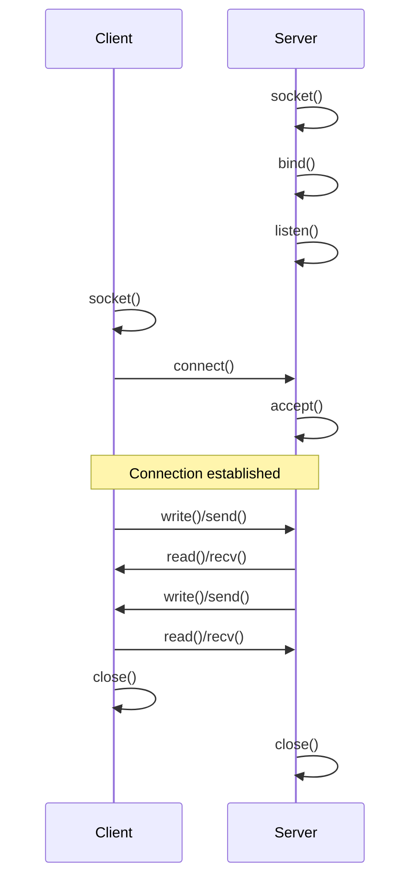

# Chapter 269: Socket Programming

## 1. Introduction

Socket programming is the foundation of network communication on Linux. A socket is an endpoint for communication — a bidirectional channel through which data flows between processes, potentially on different machines. This chapter covers TCP and UDP client-server programming, the I/O multiplexing mechanisms (select, poll, epoll), and non-blocking I/O patterns.

## 2. Intuition: The Socket Model

### 2.1 Client-Server Architecture



### 2.2 Socket Types

| Type | Protocol | Characteristics |
|------|----------|----------------|
| `SOCK_STREAM` | TCP | Reliable, ordered, connection-oriented |
| `SOCK_DGRAM` | UDP | Unreliable, unordered, connectionless |
| `SOCK_RAW` | Various | Direct protocol access |
| `SOCK_SEQPACKET` | Various | Reliable, ordered, message boundaries |

## 3. TCP Client-Server

### 3.1 TCP Server

```c
#include <stdio.h>
#include <stdlib.h>
#include <string.h>
#include <unistd.h>
#include <sys/socket.h>
#include <netinet/in.h>
#include <arpa/inet.h>

#define PORT 8080
#define BACKLOG 128

int main(void)
{
    // Create socket
    int server_fd = socket(AF_INET, SOCK_STREAM | SOCK_CLOEXEC, 0);
    if (server_fd == -1) {
        perror("socket");
        return 1;
    }

    // Allow address reuse
    int opt = 1;
    setsockopt(server_fd, SOL_SOCKET, SO_REUSEADDR, &opt, sizeof(opt));
    setsockopt(server_fd, SOL_SOCKET, SO_REUSEPORT, &opt, sizeof(opt));

    // Bind to address
    struct sockaddr_in addr = {
        .sin_family = AF_INET,
        .sin_port = htons(PORT),
        .sin_addr.s_addr = INADDR_ANY
    };

    if (bind(server_fd, (struct sockaddr *)&addr, sizeof(addr)) == -1) {
        perror("bind");
        close(server_fd);
        return 1;
    }

    // Listen for connections
    if (listen(server_fd, BACKLOG) == -1) {
        perror("listen");
        close(server_fd);
        return 1;
    }

    printf("Server listening on port %d\n", PORT);

    while (1) {
        struct sockaddr_in client_addr;
        socklen_t client_len = sizeof(client_addr);

        int client_fd = accept(server_fd, (struct sockaddr *)&client_addr, &client_len);
        if (client_fd == -1) {
            perror("accept");
            continue;
        }

        char client_ip[INET_ADDRSTRLEN];
        inet_ntop(AF_INET, &client_addr.sin_addr, client_ip, sizeof(client_ip));
        printf("Client connected: %s:%d\n", client_ip, ntohs(client_addr.sin_port));

        // Handle client
        char buf[4096];
        ssize_t n;
        while ((n = recv(client_fd, buf, sizeof(buf), 0)) > 0) {
            send(client_fd, buf, n, 0);  // Echo back
        }

        printf("Client disconnected\n");
        close(client_fd);
    }

    close(server_fd);
    return 0;
}
```

### 3.2 TCP Client

```c
#include <stdio.h>
#include <string.h>
#include <unistd.h>
#include <sys/socket.h>
#include <netinet/in.h>
#include <arpa/inet.h>

int main(void)
{
    int sock_fd = socket(AF_INET, SOCK_STREAM, 0);
    if (sock_fd == -1) {
        perror("socket");
        return 1;
    }

    struct sockaddr_in addr = {
        .sin_family = AF_INET,
        .sin_port = htons(8080)
    };
    inet_pton(AF_INET, "127.0.0.1", &addr.sin_addr);

    if (connect(sock_fd, (struct sockaddr *)&addr, sizeof(addr)) == -1) {
        perror("connect");
        close(sock_fd);
        return 1;
    }

    // Send data
    const char *msg = "Hello, server!";
    send(sock_fd, msg, strlen(msg), 0);

    // Receive response
    char buf[4096];
    ssize_t n = recv(sock_fd, buf, sizeof(buf) - 1, 0);
    if (n > 0) {
        buf[n] = '\0';
        printf("Received: %s\n", buf);
    }

    close(sock_fd);
    return 0;
}
```

## 4. UDP Client-Server

### 4.1 UDP Server

```c
#include <stdio.h>
#include <string.h>
#include <unistd.h>
#include <sys/socket.h>
#include <netinet/in.h>

int main(void)
{
    int sock_fd = socket(AF_INET, SOCK_DGRAM, 0);
    if (sock_fd == -1) {
        perror("socket");
        return 1;
    }

    struct sockaddr_in addr = {
        .sin_family = AF_INET,
        .sin_port = htons(9090),
        .sin_addr.s_addr = INADDR_ANY
    };

    if (bind(sock_fd, (struct sockaddr *)&addr, sizeof(addr)) == -1) {
        perror("bind");
        close(sock_fd);
        return 1;
    }

    char buf[4096];
    struct sockaddr_in client_addr;
    socklen_t client_len;

    while (1) {
        client_len = sizeof(client_addr);
        ssize_t n = recvfrom(sock_fd, buf, sizeof(buf), 0,
                             (struct sockaddr *)&client_addr, &client_len);
        if (n > 0) {
            buf[n] = '\0';
            printf("Received from client: %s\n", buf);
            sendto(sock_fd, buf, n, 0,
                   (struct sockaddr *)&client_addr, client_len);
        }
    }

    close(sock_fd);
    return 0;
}
```

### 4.2 UDP Client

```c
#include <stdio.h>
#include <string.h>
#include <unistd.h>
#include <sys/socket.h>
#include <netinet/in.h>
#include <arpa/inet.h>

int main(void)
{
    int sock_fd = socket(AF_INET, SOCK_DGRAM, 0);

    struct sockaddr_in addr = {
        .sin_family = AF_INET,
        .sin_port = htons(9090)
    };
    inet_pton(AF_INET, "127.0.0.1", &addr.sin_addr);

    const char *msg = "Hello UDP server!";
    sendto(sock_fd, msg, strlen(msg), 0,
           (struct sockaddr *)&addr, sizeof(addr));

    char buf[4096];
    ssize_t n = recvfrom(sock_fd, buf, sizeof(buf) - 1, 0, NULL, NULL);
    if (n > 0) {
        buf[n] = '\0';
        printf("Received: %s\n", buf);
    }

    close(sock_fd);
    return 0;
}
```

## 5. I/O Multiplexing

### 5.1 select()

```c
#include <sys/select.h>

int select(int nfds, fd_set *readfds, fd_set *writefds,
           fd_set *exceptfds, struct timeval *timeout);

// Macros
void FD_ZERO(fd_set *set);
void FD_SET(int fd, fd_set *set);
void FD_CLR(int fd, fd_set *set);
int FD_ISSET(int fd, fd_set *set);
```

```c
#include <stdio.h>
#include <string.h>
#include <unistd.h>
#include <sys/select.h>
#include <sys/socket.h>
#include <netinet/in.h>

#define MAX_CLIENTS FD_SETSIZE

int main(void)
{
    int server_fd = socket(AF_INET, SOCK_STREAM, 0);
    int opt = 1;
    setsockopt(server_fd, SOL_SOCKET, SO_REUSEADDR, &opt, sizeof(opt));

    struct sockaddr_in addr = {AF_INET, htons(8080), {INADDR_ANY}};
    bind(server_fd, (struct sockaddr *)&addr, sizeof(addr));
    listen(server_fd, 128);

    fd_set readfds, activefds;
    FD_ZERO(&activefds);
    FD_SET(server_fd, &activefds);
    int maxfd = server_fd;

    while (1) {
        readfds = activefds;
        int nready = select(maxfd + 1, &readfds, NULL, NULL, NULL);

        if (FD_ISSET(server_fd, &readfds)) {
            int client_fd = accept(server_fd, NULL, NULL);
            FD_SET(client_fd, &activefds);
            if (client_fd > maxfd)
                maxfd = client_fd;
            nready--;
        }

        for (int fd = 0; fd <= maxfd && nready > 0; fd++) {
            if (fd == server_fd)
                continue;
            if (FD_ISSET(fd, &readfds)) {
                char buf[4096];
                ssize_t n = recv(fd, buf, sizeof(buf), 0);
                if (n <= 0) {
                    close(fd);
                    FD_CLR(fd, &activefds);
                } else {
                    send(fd, buf, n, 0);
                }
                nready--;
            }
        }
    }
    return 0;
}
```

**Limitations of select():**
- `FD_SETSIZE` limit (typically 1024)
- O(n) scanning of fd_set on each call
- Must rebuild fd_set before each call

### 5.2 poll()

```c
#include <poll.h>

int poll(struct pollfd *fds, nfds_t nfds, int timeout);

struct pollfd {
    int   fd;         // File descriptor
    short events;     // Requested events
    short revents;    // Returned events
};
```

```c
#include <poll.h>
#include <stdio.h>
#include <unistd.h>
#include <sys/socket.h>
#include <netinet/in.h>

#define MAX_FDS 1024

int main(void)
{
    int server_fd = socket(AF_INET, SOCK_STREAM, 0);
    int opt = 1;
    setsockopt(server_fd, SOL_SOCKET, SO_REUSEADDR, &opt, sizeof(opt));

    struct sockaddr_in addr = {AF_INET, htons(8080), {INADDR_ANY}};
    bind(server_fd, (struct sockaddr *)&addr, sizeof(addr));
    listen(server_fd, 128);

    struct pollfd fds[MAX_FDS];
    int nfds = 1;

    fds[0].fd = server_fd;
    fds[0].events = POLLIN;

    while (1) {
        int nready = poll(fds, nfds, -1);

        if (fds[0].revents & POLLIN) {
            int client_fd = accept(server_fd, NULL, NULL);
            if (client_fd != -1 && nfds < MAX_FDS) {
                fds[nfds].fd = client_fd;
                fds[nfds].events = POLLIN;
                nfds++;
            }
            nready--;
        }

        for (int i = 1; i < nfds && nready > 0; i++) {
            if (fds[i].revents & POLLIN) {
                char buf[4096];
                ssize_t n = recv(fds[i].fd, buf, sizeof(buf), 0);
                if (n <= 0) {
                    close(fds[i].fd);
                    fds[i] = fds[nfds - 1];
                    nfds--;
                    i--;
                } else {
                    send(fds[i].fd, buf, n, 0);
                }
                nready--;
            }
        }
    }
    return 0;
}
```

### 5.3 epoll (Overview — See Chapter 273 for Deep Dive)

```c
#include <sys/epoll.h>

int epoll_create1(int flags);
int epoll_ctl(int epfd, int op, int fd, struct epoll_event *event);
int epoll_wait(int epfd, struct epoll_event *events, int maxevents, int timeout);
```

```c
#include <sys/epoll.h>
#include <stdio.h>
#include <unistd.h>
#include <sys/socket.h>
#include <netinet/in.h>

#define MAX_EVENTS 1024

int main(void)
{
    int server_fd = socket(AF_INET, SOCK_STREAM, 0);
    int opt = 1;
    setsockopt(server_fd, SOL_SOCKET, SO_REUSEADDR, &opt, sizeof(opt));

    struct sockaddr_in addr = {AF_INET, htons(8080), {INADDR_ANY}};
    bind(server_fd, (struct sockaddr *)&addr, sizeof(addr));
    listen(server_fd, 128);

    int epfd = epoll_create1(EPOLL_CLOEXEC);

    struct epoll_event ev = {.events = EPOLLIN, .data.fd = server_fd};
    epoll_ctl(epfd, EPOLL_CTL_ADD, server_fd, &ev);

    struct epoll_event events[MAX_EVENTS];

    while (1) {
        int nready = epoll_wait(epfd, events, MAX_EVENTS, -1);

        for (int i = 0; i < nready; i++) {
            if (events[i].data.fd == server_fd) {
                int client_fd = accept(server_fd, NULL, NULL);
                ev.events = EPOLLIN | EPOLLET;
                ev.data.fd = client_fd;
                epoll_ctl(epfd, EPOLL_CTL_ADD, client_fd, &ev);
            } else {
                char buf[4096];
                ssize_t n = recv(events[i].data.fd, buf, sizeof(buf), 0);
                if (n <= 0) {
                    epoll_ctl(epfd, EPOLL_CTL_DEL, events[i].data.fd, NULL);
                    close(events[i].data.fd);
                } else {
                    send(events[i].data.fd, buf, n, 0);
                }
            }
        }
    }
    return 0;
}
```

## 6. Advanced Socket Options

### 6.1 Socket Options

Socket options control various behaviors of sockets:

```c
#include <sys/socket.h>

int getsockopt(int sockfd, int level, int optname, void *optval, socklen_t *optlen);
int setsockopt(int sockfd, int level, int optname, const void *optval, socklen_t optlen);
```

**Common socket options:**

| Level | Option | Description |
|-------|--------|-------------|
| `SOL_SOCKET` | `SO_REUSEADDR` | Allow reuse of local addresses |
| `SOL_SOCKET` | `SO_REUSEPORT` | Allow multiple sockets to bind to same port |
| `SOL_SOCKET` | `SO_KEEPALIVE` | Enable TCP keepalive probes |
| `SOL_SOCKET` | `SO_LINGER` | Control close() behavior with unsent data |
| `SOL_SOCKET` | `SO_RCVBUF` | Receive buffer size |
| `SOL_SOCKET` | `SO_SNDBUF` | Send buffer size |
| `IPPROTO_TCP` | `TCP_NODELAY` | Disable Nagle's algorithm |
| `IPPROTO_TCP` | `TCP_CORK` | Cork output (batch small writes) |
| `IPPROTO_TCP` | `TCP_QUICKACK` | Disable delayed ACKs |
| `IPPROTO_TCP` | `TCP_DEFER_ACCEPT` | Don't wake on SYN, wait for data |

### 6.2 SO_LINGER

Controls what happens when `close()` is called with unsent data:

```c
// Default: close() returns immediately, kernel tries to send remaining data

// Linger with timeout: close() blocks until data sent or timeout
struct linger lg;
gp.l_onoff = 1;
gp.l_linger = 5;  // 5 second timeout
setsockopt(fd, SOL_SOCKET, SO_LINGER, &lg, sizeof(lg));

// Linger with 0 timeout: RST connection, discard unsent data
lg.l_onoff = 1;
gp.l_linger = 0;
setsockopt(fd, SOL_SOCKET, SO_LINGER, &lg, sizeof(lg));
```

### 6.3 TCP_NODELAY and Nagle's Algorithm

Nagle's algorithm coalesces small writes to reduce the number of TCP segments. This improves throughput but adds latency:

```c
// Disable Nagle's algorithm for low-latency applications
int flag = 1;
setsockopt(fd, IPPROTO_TCP, TCP_NODELAY, &flag, sizeof(flag));

// Cork: accumulate data until uncorked or buffer full
int cork = 1;
setsockopt(fd, IPPROTO_TCP, TCP_CORK, &cork, sizeof(cork));
write(fd, header, header_len);
write(fd, body, body_len);
cork = 0;
setsockopt(fd, IPPROTO_TCP, TCP_CORK, &cork, sizeof(cork));
// Header and body sent in one TCP segment
```

### 6.4 Get Address Information

`getaddrinfo()` is the modern, thread-safe way to resolve hostnames and service names:

```c
#include <netdb.h>

struct addrinfo hints = {
    .ai_family = AF_UNSPEC,      // IPv4 or IPv6
    .ai_socktype = SOCK_STREAM,  // TCP
    .ai_flags = AI_PASSIVE       // For server: fill in my IP
};

struct addrinfo *result;
int ret = getaddrinfo(NULL, "8080", &hints, &result);
if (ret != 0) {
    fprintf(stderr, "getaddrinfo: %s\n", gai_strerror(ret));
    return 1;
}

// Use result->ai_addr for bind()
for (struct addrinfo *rp = result; rp != NULL; rp = rp->ai_next) {
    int fd = socket(rp->ai_family, rp->ai_socktype, rp->ai_protocol);
    if (fd == -1) continue;
    if (bind(fd, rp->ai_addr, rp->ai_addrlen) == 0) break;
    close(fd);
}
freeaddrinfo(result);
```

### 6.5 Shutdown

`shutdown()` provides controlled connection termination:

```c
#include <sys/socket.h>

int shutdown(int sockfd, int how);

// SHUT_RD   (0): Close reading side — peer gets EOF on next read
// SHUT_WR   (1): Close writing side — peer gets EOF, can still send
// SHUT_RDWR (2): Close both sides

// Graceful shutdown pattern:
shutdown(fd, SHUT_WR);   // Signal "I'm done sending"
// Continue reading remaining data from peer
while (recv(fd, buf, sizeof(buf), 0) > 0)
    ;
close(fd);
```

## 7. Non-Blocking I/O

### 7.1 Setting Non-Blocking Mode

```c
#include <fcntl.h>

// Method 1: fcntl
int flags = fcntl(fd, F_GETFL, 0);
fcntl(fd, F_SETFL, flags | O_NONBLOCK);

// Method 2: At socket creation
int fd = socket(AF_INET, SOCK_STREAM | SOCK_NONBLOCK, 0);
```

### 7.2 Non-Blocking connect()

```c
#include <sys/socket.h>
#include <netinet/in.h>
#include <fcntl.h>
#include <poll.h>
#include <errno.h>

int nonblocking_connect(const char *ip, int port, int timeout_ms)
{
    int fd = socket(AF_INET, SOCK_STREAM | SOCK_NONBLOCK, 0);

    struct sockaddr_in addr = {AF_INET, htons(port)};
    inet_pton(AF_INET, ip, &addr.sin_addr);

    int ret = connect(fd, (struct sockaddr *)&addr, sizeof(addr));
    if (ret == 0)
        return fd;  // Connected immediately

    if (errno != EINPROGRESS) {
        close(fd);
        return -1;
    }

    // Wait for connection with timeout
    struct pollfd pfd = {fd, POLLOUT, 0};
    ret = poll(&pfd, 1, timeout_ms);
    if (ret <= 0) {
        close(fd);
        return -1;  // Timeout or error
    }

    // Check if connection succeeded
    int error;
    socklen_t len = sizeof(error);
    getsockopt(fd, SOL_SOCKET, SO_ERROR, &error, &len);
    if (error) {
        close(fd);
        return -1;
    }

    return fd;
}
```

### 6.3 Non-Blocking recv/send

```c
ssize_t nonblocking_recv(int fd, void *buf, size_t len)
{
    ssize_t n = recv(fd, buf, len, 0);
    if (n == -1) {
        if (errno == EAGAIN || errno == EWOULDBLOCK)
            return 0;  // No data available right now
        return -1;     // Real error
    }
    return n;  // 0 = EOF, >0 = bytes read
}

ssize_t nonblocking_send(int fd, const void *buf, size_t len)
{
    ssize_t total = 0;
    while (total < (ssize_t)len) {
        ssize_t n = send(fd, (const char *)buf + total, len - total, 0);
        if (n == -1) {
            if (errno == EAGAIN || errno == EWOULDBLOCK)
                break;  // Kernel buffer full, return what we sent
            return -1;
        }
        total += n;
    }
    return total;
}
```

## 10. Advanced Socket Programming

### 10.1 Multicast

UDP multicast allows sending data to multiple receivers simultaneously:

```c
#include <sys/socket.h>
#include <netinet/in.h>
#include <arpa/inet.h>

// Sender
int sock = socket(AF_INET, SOCK_DGRAM, 0);
struct sockaddr_in addr = {
    .sin_family = AF_INET,
    .sin_port = htons(12345),
    .sin_addr.s_addr = inet_addr("224.0.0.1")  // Multicast address
};

const char *msg = "Hello multicast!";
sendto(sock, msg, strlen(msg), 0, (struct sockaddr *)&addr, sizeof(addr));

// Receiver
int sock = socket(AF_INET, SOCK_DGRAM, 0);
int opt = 1;
setsockopt(sock, SOL_SOCKET, SO_REUSEADDR, &opt, sizeof(opt));

struct sockaddr_in addr = {
    .sin_family = AF_INET,
    .sin_port = htons(12345),
    .sin_addr.s_addr = INADDR_ANY
};
bind(sock, (struct sockaddr *)&addr, sizeof(addr));

// Join multicast group
struct ip_mreq mreq;
mreq.imr_multiaddr.s_addr = inet_addr("224.0.0.1");
mreq.imr_interface.s_addr = INADDR_ANY;
setsockopt(sock, IPPROTO_IP, IP_ADD_MEMBERSHIP, &mreq, sizeof(mreq));

char buf[1024];
ssize_t n = recv(sock, buf, sizeof(buf), 0);
```

### 10.2 TCP Keepalive

TCP keepalive probes detect dead connections:

```c
int opt = 1;
setsockopt(fd, SOL_SOCKET, SO_KEEPALIVE, &opt, sizeof(opt));

// Linux-specific keepalive tuning
int idle = 60;    // Start probes after 60s idle
int interval = 5; // Probe every 5s
int count = 3;    // Give up after 3 failed probes

setsockopt(fd, IPPROTO_TCP, TCP_KEEPIDLE, &idle, sizeof(idle));
setsockopt(fd, IPPROTO_TCP, TCP_KEEPINTVL, &interval, sizeof(interval));
setsockopt(fd, IPPROTO_TCP, TCP_KEEPCNT, &count, sizeof(count));
```

### 10.3 TCP Fast Open

TCP Fast Open (TFO) allows data to be sent during the TCP handshake:

```c
// Enable TFO on the server
int opt = 5;  // Queue length for TFO
setsockopt(listen_fd, IPPROTO_TCP, TCP_FASTOPEN, &opt, sizeof(opt));

// Client: use sendmsg() with MSG_FASTOPEN
struct sockaddr_in addr = {...};
sendto(sock, data, len, MSG_FASTOPEN, (struct sockaddr *)&addr, sizeof(addr));
```

## 11. Common Pitfalls

### 7.1 SIGPIPE on Closed Connections
When writing to a closed socket, `SIGPIPE` kills the process by default.

```c
// Ignore SIGPIPE
signal(SIGPIPE, SIG_IGN);

// Or use MSG_NOSFLAG on send()
send(fd, buf, len, MSG_NOSIGNAL);
```

### 7.2 Partial Reads/Writes
Network I/O can return fewer bytes than requested. Always loop.

### 7.3 Forgetting SO_REUSEADDR
Without `SO_REUSEADDR`, binding to the same port fails if the previous socket is in `TIME_WAIT`.

### 7.4 Not Setting TCP_NODELAY for Low-Latency
```c
int flag = 1;
setsockopt(fd, IPPROTO_TCP, TCP_NODELAY, &flag, sizeof(flag));
```

## 8. Best Practices

1. **Use `SOCK_CLOEXEC` and `SOCK_NONBLOCK`** at socket creation time.
2. **Set `SO_REUSEADDR`** on server sockets.
3. **Handle partial reads/writes** — always loop.
4. **Use `send()` with `MSG_NOSIGNAL`** instead of ignoring SIGPIPE globally.
5. **Set appropriate timeouts** on blocking operations.
6. **Use epoll for high-connection servers** — it's O(1) for event delivery.
7. **Use non-blocking I/O** with epoll for maximum throughput.
8. **Set `TCP_NODELAY`** for interactive/low-latency applications.
9. **Graceful shutdown** — `shutdown(fd, SHUT_WR)` before `close()`.
10. **Use `getaddrinfo()`** for DNS resolution — it's thread-safe and supports IPv6.

## 9. Exercises

### Exercise 1: Multi-Threaded TCP Server
Extend the TCP server to handle multiple clients using threads.

### Exercise 2: HTTP/1.0 Client
Implement a simple HTTP/1.0 GET client using sockets.

### Exercise 3: UDP Echo Server with Timeout
Implement a UDP echo server that times out idle clients.

### Exercise 4: Non-Blocking Chat Server
Build a chat server using non-blocking I/O and epoll.

## 10. References

- **The Linux Programming Interface** by Michael Kerrisk — Chapters 56-61: Sockets
- **Beej's Guide to Network Programming**: https://beej.us/guide/bgnet/
- **man pages**: `man 2 socket`, `man 2 connect`, `man 2 bind`, `man 2 listen`, `man 2 accept`, `man 2 select`, `man 2 poll`, `man 7 tcp`, `man 7 udp`
- **"UNIX Network Programming"** by W. Richard Stevens — The classic networking reference
