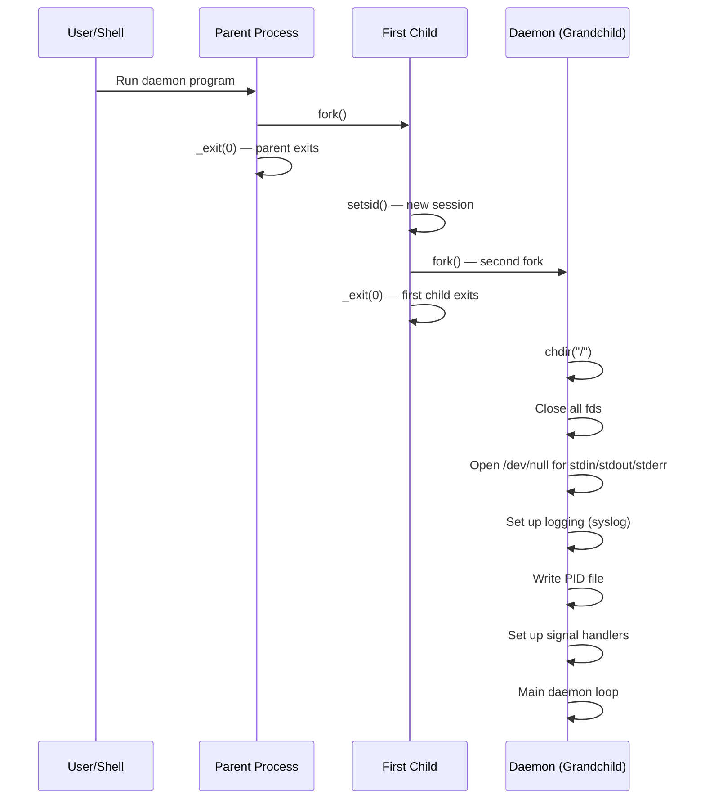

# Chapter 270: Daemon Development

## 1. Introduction

A daemon is a background process that runs without a controlling terminal, typically started at boot time and running until the system shuts down. Daemons provide system services — web servers, database servers, DNS resolvers, cron schedulers, and more. Writing a proper daemon requires careful attention to process lifecycle, session management, signal handling, logging, and integration with the system's init system (systemd).

## 2. Intuition: What Makes a Daemon?

### 2.1 Daemon Characteristics

A daemon differs from a regular process in several ways:

1. **No controlling terminal** — Daemons are not associated with any terminal.
2. **Runs in the background** — The user doesn't interact with it directly.
3. **Session leader** — Typically a session leader to prevent terminal signals.
4. **Working directory** — Runs from `/` to avoid preventing filesystem unmounting.
5. **File descriptors** — Closes inherited fds, opens `/dev/null` for stdin/stdout/stderr.
6. **Logging** — Uses syslog or similar for logging (not stdout/stderr).
7. **PID file** — Writes its PID to a file for management tools.

### 2.2 Traditional Daemon Creation: The Double Fork



### 2.3 Why Double Fork?

The double fork technique solves two problems:

1. **First fork + exit**: The parent process exits, returning control to the calling shell. The child becomes an orphan and is reinitiated by init.

2. **setsid()**: The first child calls `setsid()` to create a new session and process group, becoming a session leader. This detaches from any controlling terminal.

3. **Second fork**: The second fork ensures the daemon is NOT a session leader. This prevents the daemon from accidentally acquiring a controlling terminal (on some systems, a session leader can acquire a controlling terminal by opening a terminal device).

## 3. The daemon() Function

### 3.1 glibc's daemon()

glibc provides a convenience function that performs the double fork:

```c
#include <unistd.h>

int daemon(int nochdir, int noclose);
```

- `nochdir = 0`: `chdir("/")`
- `nochdir != 0`: Don't change directory
- `noclose = 0`: Redirect stdin/stdout/stderr to `/dev/null`
- `noclose != 0`: Don't redirect

```c
#include <stdio.h>
#include <unistd.h>
#include <syslog.h>

int main(void)
{
    // Become a daemon
    if (daemon(0, 0) == -1) {
        perror("daemon");
        return 1;
    }

    // Now running as daemon
    openlog("mydaemon", LOG_PID, LOG_DAEMON);
    syslog(LOG_INFO, "Daemon started");

    // Main loop
    while (1) {
        // ... daemon work ...
        sleep(60);
    }

    closelog();
    return 0;
}
```

**Note**: `daemon()` is deprecated on some systems (not in POSIX) and is considered bad practice for modern daemons. Use systemd integration instead.

## 4. Manual Daemon Creation

### 4.1 Complete Implementation

```c
#include <stdio.h>
#include <stdlib.h>
#include <string.h>
#include <unistd.h>
#include <signal.h>
#include <sys/stat.h>
#include <syslog.h>
#include <fcntl.h>
#include <errno.h>

#define PID_FILE "/var/run/mydaemon.pid"

static volatile sig_atomic_t running = 1;

static void signal_handler(int sig)
{
    (void)sig;
    running = 0;
}

static int write_pid_file(void)
{
    int fd = open(PID_FILE, O_WRONLY | O_CREAT | O_TRUNC, 0644);
    if (fd == -1) {
        syslog(LOG_ERR, "Cannot open PID file %s: %s", PID_FILE, strerror(errno));
        return -1;
    }

    char pid_str[32];
    snprintf(pid_str, sizeof(pid_str), "%d\n", getpid());
    write(fd, pid_str, strlen(pid_str));
    close(fd);
    return 0;
}

static int daemonize(void)
{
    pid_t pid;

    // First fork
    pid = fork();
    if (pid == -1) {
        perror("fork");
        return -1;
    }
    if (pid > 0)
        _exit(0);  // Parent exits

    // Create new session
    if (setsid() == -1) {
        perror("setsid");
        return -1;
    }

    // Second fork
    pid = fork();
    if (pid == -1) {
        perror("fork");
        return -1;
    }
    if (pid > 0)
        _exit(0);  // First child exits

    // Set working directory
    if (chdir("/") == -1) {
        perror("chdir");
        return -1;
    }

    // Close all file descriptors
    for (int fd = sysconf(_SC_OPEN_MAX); fd >= 0; fd--) {
        close(fd);
    }

    // Redirect stdin/stdout/stderr to /dev/null
    int devnull = open("/dev/null", O_RDWR);
    if (devnull == -1)
        return -1;

    dup2(devnull, STDIN_FILENO);
    dup2(devnull, STDOUT_FILENO);
    dup2(devnull, STDERR_FILENO);

    if (devnull > STDERR_FILENO)
        close(devnull);

    // Set file creation mask
    umask(0022);

    return 0;
}

int main(int argc, char *argv[])
{
    (void)argc;
    (void)argv;

    // Open syslog
    openlog("mydaemon", LOG_PID | LOG_NDELAY, LOG_DAEMON);

    // Become a daemon
    if (daemonize() == -1) {
        syslog(LOG_ERR, "Failed to daemonize");
        return 1;
    }

    // Write PID file
    if (write_pid_file() == -1) {
        syslog(LOG_ERR, "Failed to write PID file");
        return 1;
    }

    syslog(LOG_INFO, "Daemon started (PID: %d)", getpid());

    // Set up signal handlers
    struct sigaction sa;
    sa.sa_handler = signal_handler;
    sigemptyset(&sa.sa_mask);
    sa.sa_flags = 0;

    sigaction(SIGTERM, &sa, NULL);
    sigaction(SIGINT, &sa, NULL);
    sigaction(SIGHUP, &sa, NULL);

    // Main daemon loop
    while (running) {
        // ... daemon work ...
        syslog(LOG_DEBUG, "Daemon heartbeat");
        sleep(30);
    }

    // Cleanup
    syslog(LOG_INFO, "Daemon shutting down");
    unlink(PID_FILE);
    closelog();

    return 0;
}
```

## 5. Daemon Lifecycle Management

### 5.1 Signal-Based Management

Traditional daemons are managed through signals. The standard signal conventions for daemons are:

| Signal | Convention | Typical Action |
|--------|-----------|----------------|
| SIGTERM | Graceful shutdown | Stop accepting new work, finish current work, exit cleanly |
| SIGINT | Immediate stop | Similar to SIGTERM, often from Ctrl+C during development |
| SIGHUP | Reload configuration | Re-read config file without restarting |
| SIGUSR1 | Reopen log files | Close and reopen log files (for log rotation) |
| SIGUSR2 | Custom action | Application-defined |
| SIGCHLD | Child status | Reap child processes |

### 5.2 Graceful Shutdown Pattern

A well-written daemon should shut down gracefully:

```c
static volatile sig_atomic_t shutdown_requested = 0;

static void handle_shutdown(int sig)
{
    shutdown_requested = 1;
}

// In main loop:
while (!shutdown_requested) {
    // Accept new connections with timeout
    struct pollfd pfd = {listen_fd, POLLIN, 0};
    int ret = poll(&pfd, 1, 1000);  // 1 second timeout

    if (ret > 0) {
        int client = accept(listen_fd, NULL, NULL);
        handle_client(client);
    }
}

// Graceful cleanup:
printf("Shutting down...\n");
for (int i = 0; i < num_active_connections; i++) {
    shutdown(active_connections[i], SHUT_WR);
}
// Wait for connections to close (with timeout)
// Close listen socket
// Save state if needed
// Remove PID file
// Close log
```

### 5.3 Configuration Reload

```c
static volatile sig_atomic_t reload_config = 0;

static void handle_hup(int sig)
{
    reload_config = 1;
}

// In main loop:
if (reload_config) {
    reload_config = 0;
    syslog(LOG_INFO, "Reloading configuration");

    struct config new_conf;
    if (load_config(CONFIG_FILE, &new_conf) == 0) {
        // Apply new configuration
        apply_config(&new_conf);
        syslog(LOG_INFO, "Configuration reloaded successfully");
    } else {
        syslog(LOG_ERR, "Failed to reload configuration, keeping old config");
    }
}
```

### 5.4 Log Rotation Support

When logs are rotated (by logrotate or similar), the daemon needs to reopen its log files:

```c
static volatile sig_atomic_t reopen_logs = 0;

static void handle_usr1(int sig)
{
    reopen_logs = 1;
}

// In main loop:
if (reopen_logs) {
    reopen_logs = 0;
    syslog(LOG_INFO, "Reopening log files");

    closelog();
    openlog("mydaemon", LOG_PID, LOG_DAEMON);

    // Also reopen application-specific log files
    if (log_fd != -1) close(log_fd);
    log_fd = open(LOG_FILE, O_WRONLY | O_CREAT | O_APPEND, 0644);
    if (log_fd == -1)
        syslog(LOG_ERR, "Failed to reopen log file: %s", strerror(errno));
}
```

## 6. Syslog Integration

### 6.1 The syslog API

```c
#include <syslog.h>

// Open syslog connection
void openlog(const char *ident, int option, int facility);

// Log a message
void syslog(int priority, const char *format, ...);
void vsyslog(int priority, const char *format, va_list ap);

// Close syslog connection
void closelog(void);

// Set log mask
int setlogmask(int maskpri);
```

### 5.2 Priority Levels

| Priority | Value | Description |
|----------|-------|-------------|
| `LOG_EMERG` | 0 | System is unusable |
| `LOG_ALERT` | 1 | Action must be taken immediately |
| `LOG_CRIT` | 2 | Critical conditions |
| `LOG_ERR` | 3 | Error conditions |
| `LOG_WARNING` | 4 | Warning conditions |
| `LOG_NOTICE` | 5 | Normal but significant |
| `LOG_INFO` | 6 | Informational |
| `LOG_DEBUG` | 7 | Debug-level messages |

### 5.3 Facilities

| Facility | Description |
|----------|-------------|
| `LOG_DAEMON` | System daemons |
| `LOG_USER` | Generic user-level messages |
| `LOG_MAIL` | Mail system |
| `LOG_AUTH` | Security/authorization |
| `LOG_LOCAL0`-`LOG_LOCAL7` | Reserved for local use |

### 5.4 openlog() Options

| Option | Description |
|--------|-------------|
| `LOG_PID` | Include PID in each message |
| `LOG_NDELAY` | Open connection immediately |
| `LOG_CONS` | Log to console if syslog unavailable |
| `LOG_PERROR` | Also log to stderr |

```c
// Example: Daemon-specific logging
openlog("nginx", LOG_PID | LOG_NDELAY, LOG_LOCAL0);

// Log at different levels
syslog(LOG_INFO, "Worker %d started", getpid());
syslog(LOG_WARNING, "Connection limit approaching: %d/%d", current, max);
syslog(LOG_ERR, "Failed to open config: %s", strerror(errno));

// Set mask to only log warnings and above
setlogmask(LOG_UPTO(LOG_WARNING));
```

## 6. PID File Management

### 6.1 Purpose of PID Files

PID files serve two purposes:
1. **Process management**: Tools like `systemctl` or init scripts use the PID to send signals.
2. **Singleton enforcement**: Only one instance of the daemon should run.

### 6.2 Robust PID File Implementation

```c
#include <stdio.h>
#include <stdlib.h>
#include <string.h>
#include <fcntl.h>
#include <unistd.h>
#include <errno.h>
#include <signal.h>
#include <sys/stat.h>

#define PID_FILE "/var/run/mydaemon.pid"

// Check if another instance is already running
static int check_running(void)
{
    int fd = open(PID_FILE, O_RDONLY);
    if (fd == -1) {
        if (errno == ENOENT)
            return 0;  // No PID file — not running
        return -1;
    }

    char buf[32];
    ssize_t n = read(fd, buf, sizeof(buf) - 1);
    close(fd);

    if (n <= 0)
        return 0;

    buf[n] = '\0';
    pid_t pid = atoi(buf);
    if (pid <= 0)
        return 0;

    // Check if process is actually running
    if (kill(pid, 0) == 0)
        return 1;  // Process is running

    // PID file is stale
    return 0;
}

static int write_pid_file(void)
{
    int fd = open(PID_FILE, O_WRONLY | O_CREAT | O_TRUNC, 0644);
    if (fd == -1)
        return -1;

    // Lock the file (advisory lock)
    struct flock fl = {
        .l_type = F_WRLCK,
        .l_whence = SEEK_SET,
        .l_start = 0,
        .l_len = 0
    };

    if (fcntl(fd, F_SETLK, &fl) == -1) {
        close(fd);
        return -1;  // Another process holds the lock
    }

    char pid_str[32];
    snprintf(pid_str, sizeof(pid_str), "%d\n", getpid());
    write(fd, pid_str, strlen(pid_str));

    // Don't close — keep lock held
    return fd;
}
```

## 7. Signal Handling for Daemons

### 7.1 Standard Daemon Signals

| Signal | Action | Description |
|--------|--------|-------------|
| `SIGTERM` | Graceful shutdown | Stop accepting connections, finish work, exit |
| `SIGINT` | Graceful shutdown | Same as SIGTERM |
| `SIGHUP` | Reload config | Re-read configuration file |
| `SIGUSR1` | Reopen logs | Close and reopen log files (for log rotation) |
| `SIGUSR2` | Custom | Application-defined |
| `SIGCHLD` | Child status | Reap child processes |

```c
#include <signal.h>

static volatile sig_atomic_t reload_config = 0;
static volatile sig_atomic_t reopen_logs = 0;
static volatile sig_atomic_t shutdown_daemon = 0;

static void signal_handler(int sig)
{
    switch (sig) {
    case SIGHUP:
        reload_config = 1;
        break;
    case SIGUSR1:
        reopen_logs = 1;
        break;
    case SIGTERM:
    case SIGINT:
        shutdown_daemon = 1;
        break;
    }
}

// In main loop:
while (!shutdown_daemon) {
    if (reload_config) {
        reload_config = 0;
        load_config();
    }
    if (reopen_logs) {
        reopen_logs = 0;
        closelog();
        openlog("mydaemon", LOG_PID, LOG_DAEMON);
    }
    // ... daemon work ...
}
```

## 8. systemd Integration

### 8.1 Why systemd?

Modern Linux systems use systemd as the init system. Instead of managing daemons manually (PID files, daemonize, signal handling), systemd provides:

- **Process supervision**: Automatic restart on crash
- **Logging**: Integrated with journald
- **Dependency management**: Start after network, filesystem, etc.
- **Resource limits**: CPU, memory, file descriptor limits
- **Security**: Sandboxing, capability restrictions

### 8.2 systemd Service Unit

```ini
# /etc/systemd/system/mydaemon.service
[Unit]
Description=My Custom Daemon
After=network.target
Wants=network-online.target

[Service]
Type=notify
ExecStart=/usr/local/bin/mydaemon
ExecReload=/bin/kill -HUP $MAINPID
Restart=on-failure
RestartSec=5
WatchdogSec=30

# Security
User=mydaemon
Group=mydaemon
NoNewPrivileges=true
ProtectSystem=strict
ProtectHome=true
ReadWritePaths=/var/lib/mydaemon

# Resource limits
LimitNOFILE=65536
LimitNPROC=4096

# Logging
StandardOutput=journal
StandardError=journal
SyslogIdentifier=mydaemon

[Install]
WantedBy=multi-user.target
```

### 8.3 Type=notify (sd_notify)

For the best integration with systemd, use the `sd_notify` protocol:

```c
#include <systemd/sd-daemon.h>

int main(void)
{
    // Don't daemonize — systemd handles that

    // Initialize...

    // Tell systemd we're ready
    sd_notify(0, "READY=1");

    // Main loop with watchdog
    while (1) {
        // Tell systemd we're still alive
        sd_notify(0, "WATCHDOG=1");

        // ... daemon work ...
        sleep(10);
    }

    // Tell systemd we're stopping
    sd_notify(0, "STOPPING=1");
    return 0;
}
```

```bash
# Link with libsystemd
gcc mydaemon.c -o mydaemon -lsystemd
```

### 8.4 Socket Activation

systemd can create sockets on behalf of your daemon and pass them:

```c
#include <systemd/sd-daemon.h>

int main(void)
{
    int n = sd_listen_fds(0);
    if (n < 0) {
        fprintf(stderr, "sd_listen_fds: %s\n", strerror(-n));
        return 1;
    }

    if (n == 0) {
        fprintf(stderr, "No sockets passed from systemd\n");
        return 1;
    }

    // SD_LISTEN_FDS_START = 3
    int listen_fd = SD_LISTEN_FDS_START;

    // Use the socket
    while (1) {
        int client = accept(listen_fd, NULL, NULL);
        // Handle client...
    }
    return 0;
}
```

```ini
# systemd unit for socket activation
# /etc/systemd/system/mydaemon.socket
[Unit]
Description=My Daemon Socket

[Socket]
ListenStream=8080
Accept=false

[Install]
WantedBy=sockets.target

# /etc/systemd/system/mydaemon.service
[Unit]
Description=My Daemon

[Service]
ExecStart=/usr/local/bin/mydaemon
```

### 8.5 Logging with journald

```c
#include <systemd/sd-journal.h>

// Log to journal
sd_journal_print(LOG_INFO, "Daemon started");
sd_journal_print(LOG_WARNING, "High memory usage: %zu MB", mem_mb);
sd_journal_print(LOG_ERR, "Failed to open file: %s", path);

// Log with custom fields
sd_journal_send("MESSAGE=Connection accepted",
                "CLIENT_IP=%s", client_ip,
                "CLIENT_PORT=%d", port,
                "PRIORITY=%d", LOG_INFO,
                NULL);
```

## 10. Common Pitfalls

### 10.1 Forgetting to Close File Descriptors
If you don't close inherited file descriptors, they may never be closed, causing resource leaks. Use `sysconf(_SC_OPEN_MAX)` to find the maximum fd and close all.

### 10.2 Not Handling SIGHUP
Many daemons ignore SIGHUP, but the convention is to reload configuration. Users expect `kill -HUP <pid>` to work.

### 10.3 Writing PID File Too Early
Write the PID file after the second fork (when the daemon's PID is final). Writing too early captures the wrong PID.

### 10.4 Not Reaping Children
If your daemon forks child processes, handle SIGCHLD and call `waitpid()`. Otherwise, zombie processes accumulate.

### 10.5 Using daemon() with systemd
systemd expects the daemon to NOT daemonize — it handles that itself. Use `Type=simple` or `Type=notify`.

### 10.6 Not Setting File Creation Mask
Forgetting `umask(0022)` can result in files with unexpected permissions.

### 10.7 Running as Root
Daemons should drop privileges as soon as possible. Bind to privileged ports first, then `setuid()` to a non-root user.

### 10.8 Not Handling EINTR in Main Loop
Signal delivery can interrupt blocking calls in the main loop. Always check for `EINTR` and retry.

## 11. Best Practices

1. **Use systemd integration** for new daemons — don't implement double fork manually.
2. **Use `Type=notify`** with `sd_notify()` for proper systemd integration.
3. **Use socket activation** when possible — systemd manages socket lifecycle.
4. **Log to journald** via `sd_journal_print()` or `syslog()`.
5. **Handle SIGHUP** for config reload, SIGTERM for graceful shutdown.
6. **Use `SIGUSR1`** for log rotation (reopen log files).
7. **Set resource limits** in the systemd unit file.
8. **Use security sandboxing** (`ProtectSystem`, `NoNewPrivileges`, `PrivateTmp`).
9. **Implement watchdog** with `sd_notify(WATCHDOG=1)`.
10. **Drop privileges** after binding to privileged ports.

## 11. Exercises

### Exercise 1: Simple Daemon
Write a daemon that writes a timestamp to a log file every 60 seconds.

### Exercise 2: Config-Reloading Daemon
Write a daemon that re-reads its configuration file on SIGHUP.

### Exercise 3: systemd Integration
Convert a traditional daemon to use `Type=notify` and `sd_notify()`.

### Exercise 4: Socket-Activated Service
Write a socket-activated HTTP service with systemd.

## 12. References

- **The Linux Programming Interface** by Michael Kerrisk — Chapter 37: Daemons
- **Advanced Programming in the UNIX Environment** by W. Richard Stevens — Chapter 13: Daemon Processes
- **man pages**: `man 2 daemon`, `man 3 syslog`, `man 1 systemd`, `man 5 systemd.service`, `man 3 sd_notify`
- **systemd documentation**: https://systemd.io/DOCUMENTATION/
- **"Linux Daemon Writing HOWTO"**: Various online resources
