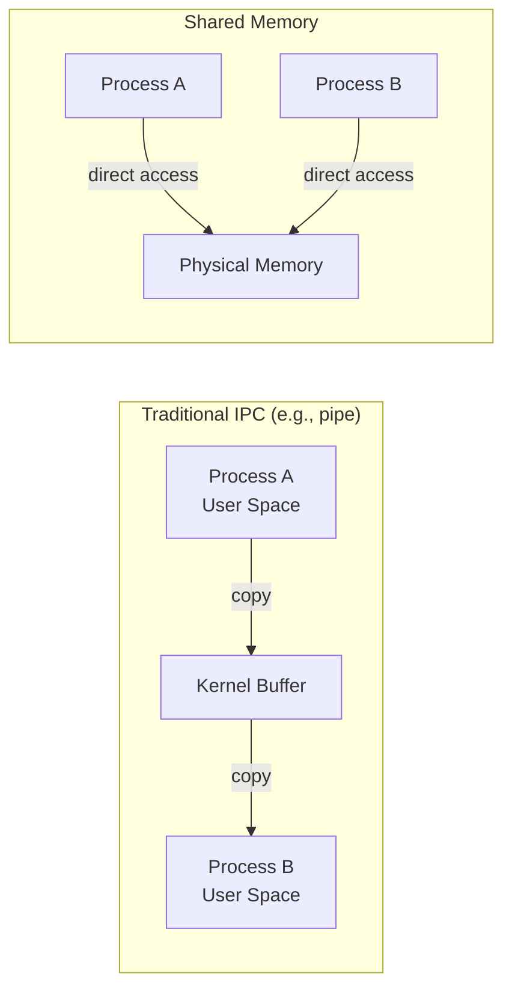
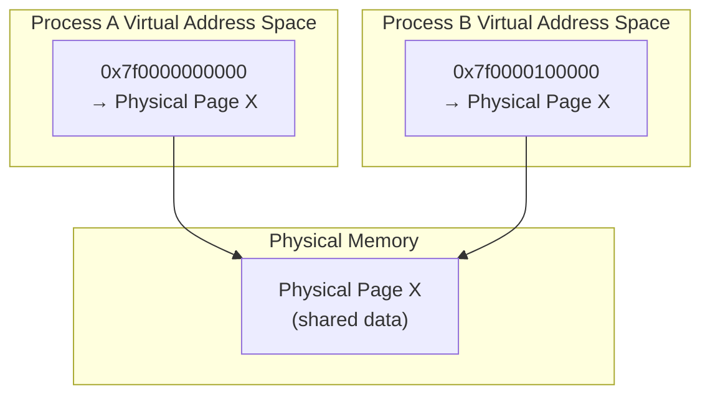

# Chapter 271: Shared Memory

## 1. Introduction

Shared memory is the fastest form of IPC available on Linux. It allows multiple processes to access the same region of physical memory, eliminating the need to copy data between processes. When combined with synchronization primitives (semaphores, mutexes), shared memory provides an extremely efficient mechanism for high-throughput inter-process communication.

This chapter covers System V shared memory, POSIX shared memory, and mmap-based memory sharing, along with the synchronization challenges that arise when multiple processes share memory.

## 2. Intuition: Why Shared Memory is Fast

### 2.1 The Data Copy Problem

Most IPC mechanisms involve copying data between kernel and user space:



With pipes or sockets, data is copied twice: once from the sender to the kernel, and once from the kernel to the receiver. With shared memory, both processes access the same physical pages — zero copies.

### 2.2 Shared Memory Architecture



The kernel maps the same physical page into both processes' virtual address spaces (at possibly different virtual addresses). Reads and writes by either process are immediately visible to the other.

## 3. System V Shared Memory

### 3.1 API Overview

```c
#include <sys/ipc.h>
#include <sys/shm.h>

// Create or get a shared memory segment
int shmget(key_t key, size_t size, int shmflg);

// Attach to process address space
void *shmat(int shmid, const void *shmaddr, int shmflg);

// Detach from process address space
int shmdt(const void *shmaddr);

// Control operations
int shmctl(int shmid, int cmd, struct shmid_ds *buf);
```

### 3.2 shmget() Flags

| Flag | Description |
|------|-------------|
| `IPC_CREAT` | Create if doesn't exist |
| `IPC_EXCL` | Fail if already exists (with IPC_CREAT) |
| `0666` | Permissions (read/write for owner, group, others) |

### 3.3 shmaddr Values for shmat()

| Value | Behavior |
|-------|----------|
| `NULL` | Let the kernel choose the address (recommended) |
| Non-NULL, aligned | Attach at specified address |
| `SHM_RND` | Round address down to SHMLBA boundary |
| `SHM_RDONLY` | Attach read-only |

### 3.4 Complete Example: Shared Counter

```c
#include <stdio.h>
#include <stdlib.h>
#include <string.h>
#include <sys/ipc.h>
#include <sys/shm.h>
#include <sys/wait.h>
#include <unistd.h>

struct shared_data {
    int counter;
    char message[256];
};

int main(void)
{
    // Create shared memory segment
    key_t key = ftok("/tmp", 'S');
    int shmid = shmget(key, sizeof(struct shared_data),
                       IPC_CREAT | 0666);
    if (shmid == -1) {
        perror("shmget");
        return 1;
    }

    // Attach in parent
    struct shared_data *data = shmat(shmid, NULL, 0);
    if (data == (void *)-1) {
        perror("shmat");
        return 1;
    }

    // Initialize
    data->counter = 0;
    strcpy(data->message, "Initial");

    // Fork children
    for (int i = 0; i < 4; i++) {
        pid_t pid = fork();
        if (pid == 0) {
            // Child: attach to same shared memory
            struct shared_data *child_data = shmat(shmid, NULL, 0);
            if (child_data == (void *)-1) {
                perror("shmat");
                _exit(1);
            }

            for (int j = 0; j < 1000; j++) {
                child_data->counter++;  // NOT THREAD-SAFE!
            }

            shmdt(child_data);
            _exit(0);
        }
    }

    // Wait for all children
    for (int i = 0; i < 4; i++)
        wait(NULL);

    printf("Final counter: %d (expected 4000)\n", data->counter);

    // Cleanup
    shmdt(data);
    shmctl(shmid, IPC_RMID, NULL);

    return 0;
}
```

**Note**: The counter will likely be less than 4000 because `counter++` is not atomic. Proper synchronization (semaphores, mutexes in shared memory) is needed.

### 3.5 Shared Memory Control Operations

```c
struct shmid_ds buf;

// Get information about a shared memory segment
shmctl(shmid, IPC_STAT, &buf);
printf("Size: %zu bytes\n", buf.shm_segsz);
printf("Creator PID: %d\n", buf.shm_cpid);
printf("Last attach: %s", ctime(&buf.shm_atime));

// Set permissions
buf.shm_perm.mode = 0600;
shmctl(shmid, IPC_SET, &buf);

// Remove the segment
shmctl(shmid, IPC_RMID, NULL);

// Lock segment in memory (prevent swapping)
shmctl(shmid, SHM_LOCK, NULL);

// Unlock segment
shmctl(shmid, SHM_UNLOCK, NULL);
```

## 4. POSIX Shared Memory

### 4.1 API Overview

POSIX shared memory uses a file-like interface:

```c
#include <sys/mman.h>
#include <sys/stat.h>
#include <fcntl.h>

// Create/open a shared memory object
int shm_open(const char *name, int oflag, mode_t mode);

// Remove a shared memory object
int shm_unlink(const char *name);

// Set size (must be called before mmap)
int ftruncate(int fd, off_t length);

// Map into address space
void *mmap(void *addr, size_t length, int prot, int flags, int fd, off_t offset);

// Unmap
int munmap(void *addr, size_t length);
```

### 4.2 Complete Example

```c
#include <stdio.h>
#include <stdlib.h>
#include <string.h>
#include <fcntl.h>
#include <sys/mman.h>
#include <sys/stat.h>
#include <unistd.h>
#include <sys/wait.h>
#include <semaphore.h>

#define SHM_NAME "/example_shm"
#define SHM_SIZE 4096

struct shared_data {
    sem_t mutex;
    int counter;
    char buffer[256];
};

int main(void)
{
    // Create shared memory object
    int shm_fd = shm_open(SHM_NAME, O_CREAT | O_RDWR, 0666);
    if (shm_fd == -1) {
        perror("shm_open");
        return 1;
    }

    // Set size
    if (ftruncate(shm_fd, SHM_SIZE) == -1) {
        perror("ftruncate");
        return 1;
    }

    // Map into address space
    struct shared_data *data = mmap(NULL, SHM_SIZE,
                                     PROT_READ | PROT_WRITE,
                                     MAP_SHARED, shm_fd, 0);
    if (data == MAP_FAILED) {
        perror("mmap");
        return 1;
    }

    // Initialize (must be done by one process only)
    sem_init(&data->mutex, 1, 1);  // pshared=1 for inter-process
    data->counter = 0;
    strcpy(data->buffer, "Hello");

    // Fork children
    for (int i = 0; i < 4; i++) {
        pid_t pid = fork();
        if (pid == 0) {
            // Child: data is already in address space (MAP_SHARED)
            for (int j = 0; j < 1000; j++) {
                sem_wait(&data->mutex);
                data->counter++;
                sem_post(&data->mutex);
            }
            _exit(0);
        }
    }

    // Wait for children
    for (int i = 0; i < 4; i++)
        wait(NULL);

    printf("Final counter: %d\n", data->counter);

    // Cleanup
    sem_destroy(&data->mutex);
    munmap(data, SHM_SIZE);
    close(shm_fd);
    shm_unlink(SHM_NAME);

    return 0;
}
```

### 4.3 POSIX vs. System V Shared Memory

| Feature | System V | POSIX |
|---------|----------|-------|
| Naming | Integer key (ftok) | String name (`/myshm`) |
| Size change | `shmctl(IPC_SET)` | `ftruncate()` |
| Permissions | `shmctl(IPC_SET)` | `fchmod()`/`fchown()` |
| Close | `shmdt()` + `shmctl(IPC_RMID)` | `munmap()` + `shm_unlink()` |
| Resize | Not supported | `ftruncate()` + remap |
| File descriptors | No fd | Has fd (from `shm_open`) |

## 5. mmap-Based Sharing

### 5.1 Anonymous mmap with fork()

After `fork()`, parent and child share memory mappings marked `MAP_SHARED`. This is one of the simplest ways to share memory between related processes:

```c
#include <stdio.h>
#include <sys/mman.h>
#include <unistd.h>
#include <sys/wait.h>

int main(void)
{
    // Create anonymous shared mapping
    int *counter = mmap(NULL, sizeof(int),
                         PROT_READ | PROT_WRITE,
                         MAP_SHARED | MAP_ANONYMOUS, -1, 0);
    if (counter == MAP_FAILED) {
        perror("mmap");
        return 1;
    }

    *counter = 0;

    pid_t pid = fork();
    if (pid == 0) {
        // Child
        for (int i = 0; i < 1000000; i++)
            (*counter)++;
        _exit(0);
    }

    // Parent
    for (int i = 0; i < 1000000; i++)
        (*counter)++;

    waitpid(pid, NULL, 0);
    printf("Counter: %d\n", *counter);

    munmap(counter, sizeof(int));
    return 0;
}
```

This approach has the advantage of not requiring any filesystem namespace — the shared memory is purely anonymous and exists only as long as the mapping is held.

### 5.2 File-Backed Shared Memory

File-backed shared memory maps a file into the address space. Changes to the mapping are written back to the file, and changes to the file are visible to all mappers:

```c
#include <stdio.h>
#include <fcntl.h>
#include <sys/mman.h>
#include <sys/stat.h>
#include <unistd.h>

int main(void)
{
    int fd = open("/tmp/shared_file", O_RDWR | O_CREAT, 0666);
    ftruncate(fd, 4096);

    void *addr = mmap(NULL, 4096, PROT_READ | PROT_WRITE,
                       MAP_SHARED, fd, 0);

    // Changes are written back to the file
    sprintf((char *)addr, "Written via mmap!");

    // Force write to disk
    msync(addr, 4096, MS_SYNC);

    munmap(addr, 4096);
    close(fd);
    return 0;
}
```

File-backed shared memory is useful when you need persistence — the data survives process termination and can be accessed later.

### 5.3 Huge Pages for Shared Memory

For large shared memory regions, huge pages reduce TLB misses and improve performance:

```c
#include <sys/mman.h>

// Allocate with huge pages (2MB)
void *addr = mmap(NULL, 2 * 1024 * 1024,
                   PROT_READ | PROT_WRITE,
                   MAP_SHARED | MAP_ANONYMOUS | MAP_HUGETLB,
                   -1, 0);

// Or with explicit huge page size (Linux 3.8+)
void *addr = mmap(NULL, 1024 * 1024 * 1024,  // 1GB
                   PROT_READ | PROT_WRITE,
                   MAP_SHARED | MAP_ANONYMOUS | MAP_HUGETLB | (30 << MAP_HUGE_SHIFT),
                   -1, 0);
```

Huge pages are particularly beneficial for databases, in-memory caches, and other applications that access large amounts of shared memory randomly.

### 5.4 memfd_create — Anonymous Shared Memory Without Filesystem

`memfd_create()` creates anonymous shared memory objects without requiring a filesystem path. This is ideal for temporary shared memory that doesn't need a name:

```c
#include <sys/mman.h>

int fd = memfd_create("my_shm", MFD_CLOEXEC);
if (fd == -1) {
    perror("memfd_create");
    return 1;
}

ftruncate(fd, 4096);
void *addr = mmap(NULL, 4096, PROT_READ | PROT_WRITE, MAP_SHARED, fd, 0);

// Share fd with child process via fork() or Unix domain socket
// The child can mmap the same fd
```

`memfd_create()` is the recommended way to create anonymous shared memory on modern Linux. It avoids the filesystem namespace entirely and is automatically cleaned up when the last fd is closed.

### 5.5 Memory-Mapped I/O

Memory mapping can also be used for I/O, mapping device memory or files into the address space:

```c
#include <sys/mman.h>
#include <fcntl.h>

// Map a file for I/O
int fd = open("data.bin", O_RDWR);
void *addr = mmap(NULL, file_size, PROT_READ | PROT_WRITE, MAP_SHARED, fd, 0);

// Read/write directly through the pointer
struct record *rec = (struct record *)addr;
for (int i = 0; i < num_records; i++) {
    process_record(&rec[i]);
}

// Advantages:
// 1. No read()/write() system calls needed
// 2. Kernel handles page faults automatically
// 3. Efficient for random access patterns
// 4. Changes are automatically written back (with MAP_SHARED)

// Disadvantages:
// 1. No control over when writes happen (use msync() for control)
// 2. Can't handle errors as precisely as read()/write()
// 3. File size must fit in address space

munmap(addr, file_size);
close(fd);
```

## 6. Synchronization in Shared Memory

### 6.1 The Challenge

Regular mutexes and condition variables cannot be used across processes by default. You need:

1. **POSIX semaphores** with `pshared=1`
2. **POSIX mutexes** with `PTHREAD_PROCESS_SHARED`
3. **System V semaphores**
4. **Futex-based synchronization** (manual)

### 6.2 Process-Shared Mutex

```c
#include <pthread.h>

// Create a process-shared mutex in shared memory
pthread_mutex_t *create_shared_mutex(void *shm_addr)
{
    pthread_mutex_t *mutex = shm_addr;

    pthread_mutexattr_t attr;
    pthread_mutexattr_init(&attr);
    pthread_mutexattr_setpshared(&attr, PTHREAD_PROCESS_SHARED);
    pthread_mutex_init(mutex, &attr);
    pthread_mutexattr_destroy(&attr);

    return mutex;
}

// Create a process-shared condition variable
pthread_cond_t *create_shared_cond(void *shm_addr)
{
    pthread_cond_t *cond = shm_addr;

    pthread_condattr_t attr;
    pthread_condattr_init(&attr);
    pthread_condattr_setpshared(&attr, PTHREAD_PROCESS_SHARED);
    pthread_cond_init(cond, &attr);
    pthread_condattr_destroy(&attr);

    return cond;
}
```

### 6.3 Process-Shared Read-Write Lock

```c
struct shared_rwlock {
    pthread_rwlock_t rwlock;
    // data follows...
};

void init_shared_rwlock(pthread_rwlock_t *rwlock)
{
    pthread_rwlockattr_t attr;
    pthread_rwlockattr_init(&attr);
    pthread_rwlockattr_setpshared(&attr, PTHREAD_PROCESS_SHARED);
    pthread_rwlock_init(rwlock, &attr);
    pthread_rwlockattr_destroy(&attr);
}
```

## 7. Ring Buffer in Shared Memory

### 7.1 Lock-Free Single-Producer Single-Consumer Ring Buffer

```c
#include <stdatomic.h>
#include <string.h>

#define RING_SIZE 1024
#define RING_MASK (RING_SIZE - 1)

struct ring_buffer {
    atomic_size_t head;  // Write position (producer)
    atomic_size_t tail;  // Read position (consumer)
    size_t element_size;
    char data[RING_SIZE * sizeof(void *)];  // Flexible sizing
};

void ring_init(struct ring_buffer *rb, size_t elem_size)
{
    atomic_store(&rb->head, 0);
    atomic_store(&rb->tail, 0);
    rb->element_size = elem_size;
}

int ring_push(struct ring_buffer *rb, const void *data)
{
    size_t head = atomic_load_explicit(&rb->head, memory_order_relaxed);
    size_t tail = atomic_load_explicit(&rb->tail, memory_order_acquire);

    if (head - tail >= RING_SIZE)
        return -1;  // Full

    char *slot = rb->data + (head & RING_MASK) * rb->element_size;
    memcpy(slot, data, rb->element_size);

    atomic_store_explicit(&rb->head, head + 1, memory_order_release);
    return 0;
}

int ring_pop(struct ring_buffer *rb, void *data)
{
    size_t head = atomic_load_explicit(&rb->head, memory_order_acquire);
    size_t tail = atomic_load_explicit(&rb->tail, memory_order_relaxed);

    if (head == tail)
        return -1;  // Empty

    char *slot = rb->data + (tail & RING_MASK) * rb->element_size;
    memcpy(data, slot, rb->element_size);

    atomic_store_explicit(&rb->tail, tail + 1, memory_order_release);
    return 0;
}
```

## 9. Performance Considerations

### 9.1 Shared Memory Performance Characteristics

Shared memory is the fastest IPC mechanism because it avoids data copying. However, performance depends on several factors:

- **Cache coherency**: When one CPU modifies shared memory, other CPUs' caches must be invalidated. This is handled by the hardware cache coherency protocol (MESI on x86) but has a cost.
- **False sharing**: If two CPUs access different variables that happen to be on the same cache line, they'll cause cache invalidations for each other. Pad structures to avoid this.
- **Memory ordering**: On weakly-ordered architectures (ARM), you need memory barriers to ensure visibility.

### 9.2 Avoiding False Sharing

```c
// BAD: Two counters on the same cache line
struct {
    int counter_a;  // Used by thread A
    int counter_b;  // Used by thread B
} shared;

// GOOD: Pad to separate cache lines
struct {
    int counter_a;
    char padding[60];  // Pad to 64 bytes (cache line size)
    int counter_b;
    char padding2[60];
} shared;

// Or use C11 alignas:
#include <stdalign.h>
struct {
    alignas(64) int counter_a;
    alignas(64) int counter_b;
} shared;
```

### 9.3 Shared Memory vs. Other IPC

For transferring large amounts of data, shared memory is orders of magnitude faster:

| IPC Method | 1MB Transfer Time (approx.) |
|------------|-----------------------------|
| Pipe | ~1ms (2 copies) |
| Unix Socket | ~1ms (2 copies) |
| Shared Memory | ~0.01ms (0 copies) |

The advantage grows with data size. For small messages (a few bytes), the overhead of setting up shared memory may make other IPC methods more efficient.

## 10. Common Pitfalls

### 10.1 Forgetting Synchronization
Shared memory without synchronization leads to data races. Always use appropriate primitives.

### 10.2 Stale Mappings
If one process resizes the shared memory (ftruncate), other processes' mappings may become invalid.

### 10.3 Cleanup After Crashes
System V shared memory persists until explicitly removed. Use `ipcrm` or `shmctl(IPC_RMID)`.

### 10.4 Memory Ordering
On weakly-ordered architectures (ARM), you need memory barriers to ensure visibility.

### 10.5 Process-Shared Primitives
Regular mutexes/condvars can't be used across processes. You must set `PTHREAD_PROCESS_SHARED`.

## 11. Best Practices

1. **Use POSIX shared memory** for new code — cleaner API.
2. **Use `MAP_SHARED | MAP_ANONYMOUS`** for fork-based sharing.
3. **Use process-shared semaphores** (`sem_init` with `pshared=1`) for synchronization.
4. **Use lock-free data structures** when possible for high-performance IPC.
5. **Use `MAP_HUGETLB`** for large shared memory regions.
6. **Use `msync()`** to ensure file-backed changes are persisted.
7. **Clean up shared memory** on daemon shutdown.
8. **Use `MAP_POPULATE`** to pre-fault pages for deterministic performance.
9. **Consider `memfd_create()`** for anonymous shared memory without filesystem namespace.
10. **Test with multiple processes** to find synchronization bugs.

## 10. Exercises

### Exercise 1: Shared Memory Chat
Build a multi-process chat application using POSIX shared memory and semaphores.

### Exercise 2: Shared Memory Database
Implement a simple key-value store in shared memory with a process-shared mutex.

### Exercise 3: Lock-Free Queue
Implement a multi-producer multi-consumer lock-free queue in shared memory.

### Exercise 4: Performance Benchmark
Compare the throughput of pipes, Unix sockets, and shared memory for transferring large data blocks.

## 11. References

- **The Linux Programming Interface** by Michael Kerrisk — Chapter 48: POSIX Shared Memory, Chapter 54: Shared Memory
- **man pages**: `man 2 shmget`, `man 3 shm_open`, `man 2 mmap`, `man 7 shm_overview`
- **"The Art of Multiprocessor Programming"** by Maurice Herlihy and Nir Shavit — Lock-free algorithms
- **POSIX.1-2017**: Shared memory interfaces specification
