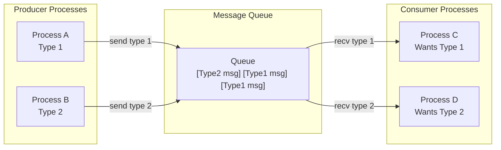
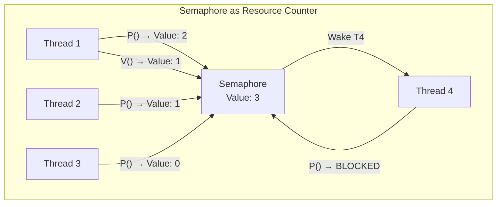

# Chapter 272: Message Queues and Semaphores

## 1. Introduction

Message queues and semaphores are two fundamental IPC mechanisms that solve complementary problems: message queues provide structured data exchange between processes, while semaphores provide synchronization. Both come in System V and POSIX variants, each with distinct advantages.

This chapter covers both mechanisms in depth, including their internal implementations, use cases, and the design patterns that make them effective tools for building concurrent systems.

## 2. Intuition: Messages and Counters

### 2.1 Message Queues: Structured Communication

A message queue is like a mailbox system between processes. Unlike pipes (byte streams), message queues preserve message boundaries and can prioritize messages by type.



### 2.2 Semaphores: Traffic Control

A semaphore is a counter used for synchronization. Think of it as a bouncer at a nightclub:

- **Value = N**: N threads/processes can enter simultaneously
- **Value = 0**: No one can enter; new arrivals wait
- **P operation (wait)**: Decrement counter; block if zero
- **V operation (post)**: Increment counter; wake a waiter



## 3. System V Message Queues

### 3.1 Detailed API

```c
#include <sys/types.h>
#include <sys/ipc.h>
#include <sys/msg.h>

// Create or access a message queue
int msgget(key_t key, int msgflg);

// Send a message
int msgsnd(int msqid, const void *msgp, size_t msgsz, int msgflg);

// Receive a message
ssize_t msgrcv(int msqid, void *msgp, size_t msgsz, long msgtyp, int msgflg);

// Control operations
int msgctl(int msqid, int cmd, struct msqid_ds *buf);
```

### 3.2 Message Structure

```c
struct msgbuf {
    long mtype;       // Message type (must be > 0)
    char mtext[1];    // Message data (actual size is flexible)
};

// Better: define your own structure
struct my_message {
    long mtype;
    struct {
        int id;
        char data[256];
    } payload;
};
```

### 3.3 Message Type Filtering

The `msgtyp` parameter in `msgrcv()` enables selective message consumption:

| msgtyp | Behavior |
|--------|----------|
| `> 0` | Receive first message of exactly this type |
| `= 0` | Receive first message of any type |
| `< 0` | Receive first message with type ≤ abs(msgtyp) |

```c
// Send messages with different priorities
struct my_message msg;

msg.mtype = 1;  // Low priority
strcpy(msg.payload.data, "Low priority message");
msgsnd(msqid, &msg, sizeof(msg.payload), 0);

msg.mtype = 10;  // High priority
strcpy(msg.payload.data, "High priority message");
msgsnd(msqid, &msg, sizeof(msg.payload), 0);

// Receive highest priority first (type < 0)
msgrcv(msqid, &msg, sizeof(msg.payload), -10, 0);
// Will receive type 10 message first
```

### 3.4 Non-Blocking Operations

```c
// Non-blocking send (fails with EAGAIN if queue is full)
msgsnd(msqid, &msg, sizeof(msg.payload), IPC_NOWAIT);

// Non-blocking receive (fails with ENOMSG if no matching message)
ssize_t n = msgrcv(msqid, &msg, sizeof(msg.payload), 0, IPC_NOWAIT);
if (n == -1 && errno == ENOMSG) {
    // No messages available
}
```

### 3.5 Queue Limits

```c
struct msqid_ds buf;
msgctl(msqid, IPC_STAT, &buf);

printf("Messages in queue: %lu\n", buf.msg_qnum);
printf("Max bytes: %lu\n", buf.msg_qbytes);
printf("Last send: %s", ctime(&buf.msg_stime));
printf("Last receive: %s", ctime(&buf.msg_rtime));

// Modify limits
buf.msg_qbytes = 65536;  // Increase max bytes
msgctl(msqid, IPC_SET, &buf);
```

### 3.6 Complete Producer-Consumer Example

```c
#include <stdio.h>
#include <stdlib.h>
#include <string.h>
#include <sys/ipc.h>
#include <sys/msg.h>
#include <sys/wait.h>
#include <unistd.h>
#include <time.h>

#define MSG_TYPE_REQUEST  1
#define MSG_TYPE_RESPONSE 2
#define MSG_TYPE_SHUTDOWN 3

struct message {
    long mtype;
    struct {
        int request_id;
        int operation;
        int operand1;
        int operand2;
        int result;
    } data;
};

void producer(int msqid)
{
    struct message msg;
    srand(time(NULL) ^ getpid());

    for (int i = 0; i < 10; i++) {
        msg.mtype = MSG_TYPE_REQUEST;
        msg.data.request_id = i;
        msg.data.operation = rand() % 4;  // +, -, *, /
        msg.data.operand1 = rand() % 100;
        msg.data.operand2 = rand() % 10 + 1;

        if (msgsnd(msqid, &msg, sizeof(msg.data), 0) == -1) {
            perror("msgsnd");
            break;
        }
        printf("Producer: sent request %d (op=%d, %d %d)\n",
               i, msg.data.operation, msg.data.operand1, msg.data.operand2);
        usleep(rand() % 100000);
    }

    // Send shutdown signal
    msg.mtype = MSG_TYPE_SHUTDOWN;
    msgsnd(msqid, &msg, 0, 0);
}

void consumer(int msqid)
{
    struct message msg;

    while (1) {
        // Receive requests in order, or shutdown
        ssize_t n = msgrcv(msqid, &msg, sizeof(msg.data), 0, 0);
        if (n == -1) {
            perror("msgrcv");
            break;
        }

        if (msg.mtype == MSG_TYPE_SHUTDOWN) {
            printf("Consumer: received shutdown\n");
            break;
        }

        // Process request
        switch (msg.data.operation) {
        case 0: msg.data.result = msg.data.operand1 + msg.data.operand2; break;
        case 1: msg.data.result = msg.data.operand1 - msg.data.operand2; break;
        case 2: msg.data.result = msg.data.operand1 * msg.data.operand2; break;
        case 3: msg.data.result = msg.data.operand1 / msg.data.operand2; break;
        }

        printf("Consumer: request %d = %d\n",
               msg.data.request_id, msg.data.result);
    }
}

int main(void)
{
    key_t key = ftok("/tmp", 'Q');
    int msqid = msgget(key, IPC_CREAT | 0666);

    pid_t consumer_pid = fork();
    if (consumer_pid == 0) {
        consumer(msqid);
        _exit(0);
    }

    pid_t producer_pid = fork();
    if (producer_pid == 0) {
        producer(msqid);
        _exit(0);
    }

    waitpid(producer_pid, NULL, 0);
    waitpid(consumer_pid, NULL, 0);

    msgctl(msqid, IPC_RMID, NULL);
    return 0;
}
```

## 4. POSIX Message Queues

### 4.1 API Overview

```c
#include <mqueue.h>

// Create/open a message queue
mqd_t mq_open(const char *name, int oflag, ...);
int mq_close(mqd_t mqdes);
int mq_unlink(const char *name);

// Send/receive
int mq_send(mqd_t mqdes, const char *msg_ptr, size_t msg_len, unsigned int msg_prio);
ssize_t mq_receive(mqd_t mqdes, char *msg_ptr, size_t msg_len, unsigned int *msg_prio);

// Timed operations
int mq_timedsend(mqd_t mqdes, const char *msg_ptr, size_t msg_len,
                 unsigned int msg_prio, const struct timespec *abs_timeout);
ssize_t mq_timedreceive(mqd_t mqdes, char *msg_ptr, size_t msg_len,
                        unsigned int *msg_prio, const struct timespec *abs_timeout);

// Notification
int mq_notify(mqd_t mqdes, const struct sigevent *sevp);

// Get/set attributes
int mq_getattr(mqd_t mqdes, struct mq_attr *attr);
int mq_setattr(mqd_t mqdes, const struct mq_attr *newattr, struct mq_attr *oldattr);
```

### 4.2 Message Queue Attributes

```c
struct mq_attr {
    long mq_flags;    // Flags (O_NONBLOCK)
    long mq_maxmsg;   // Max number of messages
    long mq_msgsize;  // Max message size
    long mq_curmsgs;  // Current number of messages
};
```

### 4.3 Priority-Based Messaging

```c
#include <stdio.h>
#include <stdlib.h>
#include <mqueue.h>
#include <fcntl.h>
#include <sys/wait.h>
#include <unistd.h>

#define QUEUE_NAME "/priority_queue"
#define MAX_MSG_SIZE 256

int main(void)
{
    struct mq_attr attr = {
        .mq_maxmsg = 10,
        .mq_msgsize = MAX_MSG_SIZE
    };

    mqd_t mq = mq_open(QUEUE_NAME, O_CREAT | O_RDWR, 0666, &attr);
    if (mq == (mqd_t)-1) {
        perror("mq_open");
        return 1;
    }

    pid_t pid = fork();
    if (pid == 0) {
        // Child: send messages with different priorities
        mqd_t mq = mq_open(QUEUE_NAME, O_WRONLY);

        mq_send(mq, "Low priority", 12, 0);
        mq_send(mq, "High priority", 13, 10);
        mq_send(mq, "Medium priority", 15, 5);

        mq_close(mq);
        _exit(0);
    }

    // Parent: receive messages (highest priority first)
    mqd_t mq_parent = mq_open(QUEUE_NAME, O_RDONLY);
    char buf[MAX_MSG_SIZE];
    unsigned int prio;

    for (int i = 0; i < 3; i++) {
        ssize_t n = mq_receive(mq_parent, buf, MAX_MSG_SIZE, &prio);
        if (n > 0) {
            buf[n] = '\0';
            printf("Received (priority %u): %s\n", prio, buf);
        }
    }

    waitpid(pid, NULL, 0);
    mq_close(mq_parent);
    mq_unlink(QUEUE_NAME);
    return 0;
}
```

### 4.4 Asynchronous Notification

```c
#include <stdio.h>
#include <mqueue.h>
#include <signal.h>
#include <unistd.h>

static volatile sig_atomic_t message_arrived = 0;

static void notification_handler(int sig)
{
    message_arrived = 1;
}

int main(void)
{
    struct sigaction sa;
    sa.sa_handler = notification_handler;
    sigemptyset(&sa.sa_mask);
    sa.sa_flags = 0;
    sigaction(SIGUSR1, &sa, NULL);

    struct mq_attr attr = {.mq_maxmsg = 10, .mq_msgsize = 64};
    mqd_t mq = mq_open("/notify_queue", O_CREAT | O_RDONLY | O_NONBLOCK, 0666, &attr);

    // Request notification
    struct sigevent sev;
    sev.sigev_notify = SIGEV_SIGNAL;
    sev.sigev_signo = SIGUSR1;
    mq_notify(mq, &sev);

    while (1) {
        pause();  // Wait for signal

        if (message_arrived) {
            message_arrived = 0;

            // Drain all messages
            char buf[64];
            unsigned int prio;
            ssize_t n;
            while ((n = mq_receive(mq, buf, sizeof(buf), &prio)) > 0) {
                buf[n] = '\0';
                printf("Message (prio %u): %s\n", prio, buf);
            }

            // Re-register notification (one-shot)
            mq_notify(mq, &sev);
        }
    }

    mq_close(mq);
    mq_unlink("/notify_queue");
    return 0;
}
```

## 5. System V Semaphores

### 5.1 Semaphore Sets

System V semaphores operate on sets of semaphores, not individual ones:

```c
#include <sys/types.h>
#include <sys/ipc.h>
#include <sys/sem.h>

// Create a semaphore set
int semget(key_t key, int nsems, int semflg);

// Perform operations
int semop(int semid, struct sembuf *sops, size_t nsops);

// Control
int semctl(int semid, int semnum, int cmd, ...);
```

### 5.2 Semaphore Operations

```c
struct sembuf {
    unsigned short sem_num;  // Semaphore index in set
    short          sem_op;   // Operation
    short          sem_flg;  // Flags
};

// sem_op values:
// > 0: Add to semaphore value (V operation)
// = 0: Wait for semaphore to become zero
// < 0: Subtract from semaphore value (P operation)

// sem_flg values:
// 0: Default (blocking)
// IPC_NOWAIT: Don't block
// SEM_UNDO: Automatically undo on process exit
```

### 5.3 Binary Semaphore Example

```c
#include <stdio.h>
#include <sys/ipc.h>
#include <sys/sem.h>
#include <sys/wait.h>
#include <unistd.h>

static void sem_lock(int semid)
{
    struct sembuf op = {0, -1, SEM_UNDO};
    semop(semid, &op, 1);
}

static void sem_unlock(int semid)
{
    struct sembuf op = {0, 1, SEM_UNDO};
    semop(semid, &op, 1);
}

int main(void)
{
    key_t key = ftok("/tmp", 'E');
    int semid = semget(key, 1, IPC_CREAT | 0666);

    // Initialize to 1 (binary semaphore)
    semctl(semid, 0, SETVAL, 1);

    for (int i = 0; i < 4; i++) {
        pid_t pid = fork();
        if (pid == 0) {
            sem_lock(semid);
            printf("Process %d: in critical section\n", getpid());
            sleep(1);
            printf("Process %d: leaving critical section\n", getpid());
            sem_unlock(semid);
            _exit(0);
        }
    }

    for (int i = 0; i < 4; i++)
        wait(NULL);

    semctl(semid, 0, IPC_RMID);
    return 0;
}
```

### 5.4 Resource Pool Semaphore

```c
// Semaphore initialized to N — allows up to N concurrent accesses
semctl(semid, 0, SETVAL, N);

// Each process/threads does:
sem_lock(semid);   // Decrements; blocks if 0
// ... use resource ...
sem_unlock(semid); // Increments; wakes a waiter
```

### 5.5 Multi-Semaphore Operations

```c
// Atomically operate on multiple semaphores
struct sembuf ops[3];

// Lock semaphores 0 and 1 simultaneously
ops[0] = (struct sembuf){0, -1, 0};
ops[1] = (struct sembuf){1, -1, 0};
semop(semid, ops, 2);

// Unlock both
ops[0] = (struct sembuf){0, 1, 0};
ops[1] = (struct sembuf){1, 1, 0};
semop(semid, ops, 2);
```

### 5.6 SEM_UNDO: Crash Safety

The `SEM_UNDO` flag automatically reverses semaphore operations when a process exits (normally or abnormally):

```c
// Without SEM_UNDO: if process crashes after P(), semaphore is stuck at 0
struct sembuf op = {0, -1, 0};

// With SEM_UNDO: kernel undoes the P() on process exit
struct sembuf op = {0, -1, SEM_UNDO};
```

**Warning**: `SEM_UNDO` has overhead and can cause issues with complex semaphore patterns. Use it for simple resource counting.

## 6. POSIX Semaphores

### 6.1 Named vs. Unnamed Semaphores

```c
#include <semaphore.h>

// Named semaphore (accessible by name)
sem_t *sem_open(const char *name, int oflag, ...);
int sem_close(sem_t *sem);
int sem_unlink(const char *name);

// Unnamed semaphore (in shared memory or process-private)
int sem_init(sem_t *sem, int pshared, unsigned int value);
int sem_destroy(sem_t *sem);

// Operations
int sem_wait(sem_t *sem);         // P (blocking)
int sem_trywait(sem_t *sem);      // P (non-blocking)
int sem_timedwait(sem_t *sem, const struct timespec *abs_timeout);  // P (timed)
int sem_post(sem_t *sem);         // V
int sem_getvalue(sem_t *sem, int *sval);  // Get current value
```

### 6.2 Named Semaphore Example

```c
#include <stdio.h>
#include <semaphore.h>
#include <fcntl.h>
#include <sys/wait.h>
#include <unistd.h>

#define SEM_NAME "/my_semaphore"

int main(void)
{
    // Create named semaphore
    sem_t *sem = sem_open(SEM_NAME, O_CREAT, 0666, 1);
    if (sem == SEM_FAILED) {
        perror("sem_open");
        return 1;
    }

    for (int i = 0; i < 3; i++) {
        pid_t pid = fork();
        if (pid == 0) {
            sem_wait(sem);
            printf("Child %d: critical section\n", i);
            sleep(1);
            printf("Child %d: done\n", i);
            sem_post(sem);
            _exit(0);
        }
    }

    for (int i = 0; i < 3; i++)
        wait(NULL);

    sem_close(sem);
    sem_unlink(SEM_NAME);
    return 0;
}
```

### 6.3 Unnamed Semaphore in Shared Memory

```c
#include <semaphore.h>
#include <sys/mman.h>
#include <sys/wait.h>
#include <unistd.h>

struct shared {
    sem_t mutex;
    int counter;
};

int main(void)
{
    struct shared *s = mmap(NULL, sizeof(struct shared),
                            PROT_READ | PROT_WRITE,
                            MAP_SHARED | MAP_ANONYMOUS, -1, 0);

    // pshared=1 for inter-process sharing
    sem_init(&s->mutex, 1, 1);
    s->counter = 0;

    for (int i = 0; i < 4; i++) {
        if (fork() == 0) {
            for (int j = 0; j < 10000; j++) {
                sem_wait(&s->mutex);
                s->counter++;
                sem_post(&s->mutex);
            }
            _exit(0);
        }
    }

    for (int i = 0; i < 4; i++)
        wait(NULL);

    printf("Counter: %d (expected 40000)\n", s->counter);

    sem_destroy(&s->mutex);
    munmap(s, sizeof(struct shared));
    return 0;
}
```

## 7. Use Cases and Patterns

### 7.1 Producer-Consumer with Bounded Buffer

```c
// Three semaphores:
// mutex: binary semaphore for critical section (init: 1)
// items: count of items in buffer (init: 0)
// spaces: count of empty slots (init: N)

// Producer:
sem_wait(&spaces);  // Wait for empty slot
sem_wait(&mutex);   // Enter critical section
// Add item to buffer
sem_post(&mutex);   // Leave critical section
sem_post(&items);   // Signal item available

// Consumer:
sem_wait(&items);   // Wait for item
sem_wait(&mutex);   // Enter critical section
// Remove item from buffer
sem_post(&mutex);   // Leave critical section
sem_post(&spaces);  // Signal empty slot
```

### 7.2 Reader-Writer Problem

```c
// Shared resources:
// read_count: number of active readers
// mutex: protects read_count (init: 1)
// write_lock: exclusive access for writers (init: 1)

// Reader:
sem_wait(&mutex);
read_count++;
if (read_count == 1)
    sem_wait(&write_lock);  // First reader blocks writers
sem_post(&mutex);

// Read...

sem_wait(&mutex);
read_count--;
if (read_count == 0)
    sem_post(&write_lock);  // Last reader unblocks writers
sem_post(&mutex);

// Writer:
sem_wait(&write_lock);
// Write...
sem_post(&write_lock);
```

### 7.3 Dining Philosophers (Semaphore Solution)

```c
#define N 5
sem_t forks[N];

// Initialize each fork to 1
for (int i = 0; i < N; i++)
    sem_init(&forks[i], 0, 1);

void philosopher(int id)
{
    while (1) {
        think(id);

        // Pick up forks (odd philosophers pick right first to avoid deadlock)
        if (id % 2 == 0) {
            sem_wait(&forks[id]);
            sem_wait(&forks[(id + 1) % N]);
        } else {
            sem_wait(&forks[(id + 1) % N]);
            sem_wait(&forks[id]);
        }

        eat(id);

        sem_post(&forks[id]);
        sem_post(&forks[(id + 1) % N]);
    }
}
```

## 8. System V vs. POSIX Comparison

| Feature | System V | POSIX |
|---------|----------|-------|
| Naming | Integer keys | String names (`/name`) |
| Max messages | Kernel limit (`msgmni`) | Kernel limit (`/proc/sys/fs/mqueue/`) |
| Max message size | Kernel limit (`msgmnb`) | Configurable at creation |
| Priority | Via message type | Native priority support |
| Notification | None | Signal or thread notification |
| Close/Unlink | `msgctl(IPC_RMID)` | `mq_close()` + `mq_unlink()` |
| Semaphore operations | Multiple atomically | Single at a time |
| SEM_UNDO | Yes | No |
| Performance | Similar | Similar |

## 9. Common Pitfalls

### 9.1 Semaphore Starvation
Without proper ordering, some processes may never acquire the semaphore.

### 9.2 Message Queue Overflow
If producers are faster than consumers, the queue fills up. Use `IPC_NOWAIT` or timeouts.

### 9.3 Forgetting SEM_UNDO
Without `SEM_UNDO`, a crashed process can leave a semaphore in an inconsistent state.

### 9.4 POSIX Semaphore Leak
Named POSIX semaphores persist until `sem_unlink()`. Always clean up.

### 9.5 Message Type 0
System V message type must be > 0. Type 0 is invalid.

## 10. Best Practices

1. **Use `SEM_UNDO`** for System V semaphores to handle crash recovery.
2. **Use POSIX IPC** for new code — cleaner API and better portability.
3. **Use `IPC_NOWAIT`** for non-blocking operations where appropriate.
4. **Clean up resources** — use `atexit()` handlers or signal handlers.
5. **Use message priorities** when different message types have different urgencies.
6. **Use `mq_notify()`** for event-driven message processing.
7. **Limit queue sizes** to prevent memory exhaustion.
8. **Use atomic multi-semaphore operations** for complex synchronization patterns.
9. **Test with multiple processes** to find synchronization bugs.
10. **Consider alternatives** — for simple cases, pipes or shared memory may be more appropriate.

## 11. Exercises

### Exercise 1: Priority Task Queue
Build a task scheduling system using POSIX message queues with priority levels.

### Exercise 2: Connection Pool
Implement a database connection pool using semaphores to limit concurrent connections.

### Exercise 3: Barrier with Semaphores
Implement a barrier synchronization primitive using only semaphores.

### Exercise 4: Token Bucket Rate Limiter
Implement a token bucket rate limiter using a semaphore as the token counter.

## 12. References

- **The Linux Programming Interface** by Michael Kerrisk — Chapters 43-47, 53: System V IPC, POSIX semaphores
- **man pages**: `man 2 msgsnd`, `man 3 mq_open`, `man 2 semget`, `man 3 sem_open`
- **POSIX.1-2017**: Message queues and semaphore specifications
- **"Operating Systems Concepts"** by Silberschatz et al. — Classic synchronization problems
