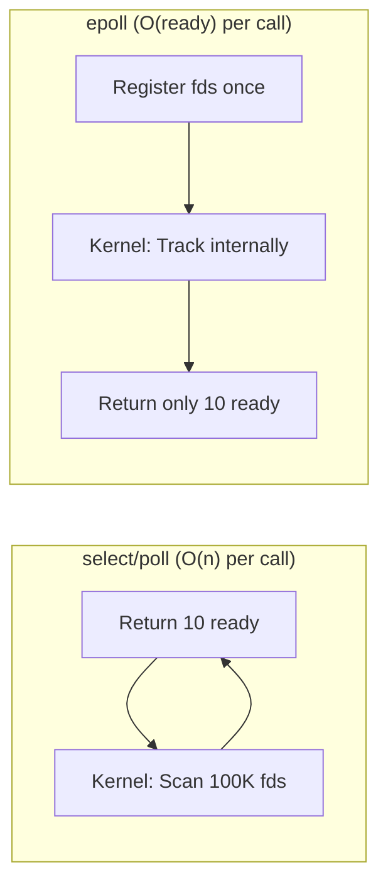
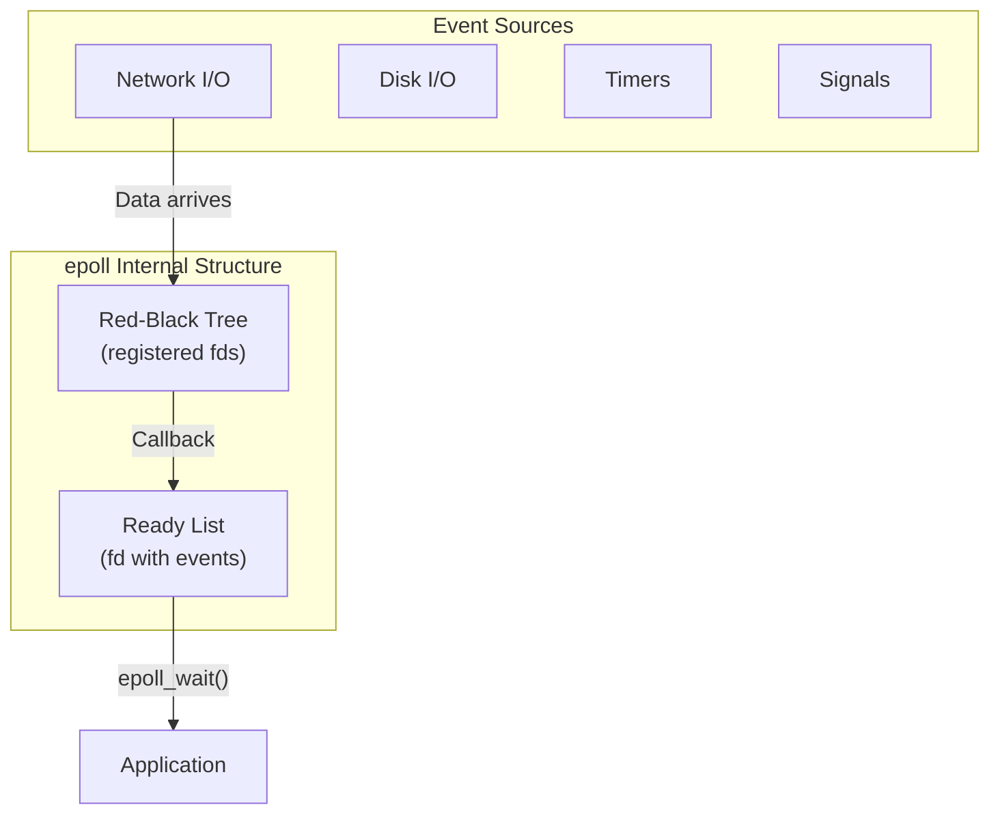

# Chapter 273: epoll Programming

## 1. Introduction

epoll is Linux's scalable I/O event notification mechanism, designed to efficiently handle large numbers of file descriptors. While `select()` and `poll()` scale linearly with the number of monitored file descriptors (O(n)), epoll scales with the number of ready descriptors (O(1) for event delivery). This makes epoll the foundation of high-performance network servers on Linux.

This chapter covers epoll's level-triggered and edge-triggered modes, EPOLLONESHOT, and async patterns that enable handling tens of thousands of concurrent connections.

## 2. Intuition: Why epoll?

### 2.1 The select/poll Problem

With `select()` and `poll()`, every time you call them:

1. The kernel must scan ALL monitored file descriptors.
2. The kernel must copy the entire fd set between user and kernel space.
3. The application must scan ALL returned results.

For a server with 100,000 connections where only 10 are active, this means scanning 100,000 descriptors to find 10 events.



### 2.2 epoll's Design

epoll separates two operations:

1. **Registration** (`epoll_ctl`): Register file descriptors once.
2. **Waiting** (`epoll_wait`): Wait for events — kernel returns only ready fds.

Internally, the kernel uses a red-black tree to store registered fds and a callback mechanism to notify epoll when an fd becomes ready.



## 3. The epoll API

### 3.1 Creating an epoll Instance

```c
#include <sys/epoll.h>

int epoll_create(int size);      // Deprecated (size hint ignored)
int epoll_create1(int flags);    // Preferred

// flags:
// EPOLL_CLOEXEC — Set close-on-exec flag
```

### 3.2 Controlling the Interest List

```c
int epoll_ctl(int epfd, int op, int fd, struct epoll_event *event);

// op values:
// EPOLL_CTL_ADD — Add fd to interest list
// EPOLL_CTL_MOD — Modify events for fd
// EPOLL_CTL_DEL — Remove fd from interest list

struct epoll_event {
    uint32_t     events;   // Epoll events
    epoll_data_t data;     // User data
};

typedef union epoll_data {
    void    *ptr;
    int      fd;
    uint32_t u32;
    uint64_t u64;
} epoll_data_t;
```

### 3.3 Event Flags

| Flag | Description |
|------|-------------|
| `EPOLLIN` | Available for read |
| `EPOLLOUT` | Available for write |
| `EPOLLRDHUP` | Stream socket peer closed connection |
| `EPOLLPRI` | Urgent data available |
| `EPOLLERR` | Error condition (always monitored) |
| `EPOLLHUP` | Hang up (always monitored) |
| `EPOLLET` | Edge-triggered mode |
| `EPOLLONESHOT` | One-shot mode (auto-disable after event) |
| `EPOLLEXCLUSIVE` | Wake only one epoll instance (for shared fds) |
| `EPOLLRDBAND` | Priority band data readable |
| `EPOLLWRBAND` | Priority band data writable |

### 3.4 Waiting for Events

```c
int epoll_wait(int epfd, struct epoll_event *events,
               int maxevents, int timeout);

int epoll_pwait(int epfd, struct epoll_event *events,
                int maxevents, int timeout,
                const sigset_t *sigmask);

// timeout:
// -1: Block indefinitely
// 0: Return immediately
// >0: Block for up to timeout milliseconds
```

## 4. Level-Triggered vs. Edge-Triggered

### 4.1 Level-Triggered (Default)

In level-triggered mode, `epoll_wait()` reports an fd as ready as long as the condition is true:

- `EPOLLIN`: There is data to read (or EOF)
- `EPOLLOUT`: There is space in the write buffer

You don't have to read/write all data at once. If you read partially, `epoll_wait()` will report the fd as ready again.

```c
// Level-triggered: simple and safe
ev.events = EPOLLIN;  // Level-triggered by default
ev.data.fd = client_fd;
epoll_ctl(epfd, EPOLL_CTL_ADD, client_fd, &ev);

// In event loop:
if (events[i].events & EPOLLIN) {
    // Can read as much or as little as you want
    ssize_t n = recv(fd, buf, sizeof(buf), 0);
    if (n > 0) {
        // Process data
    }
    // epoll_wait will report EPOLLIN again if more data is available
}
```

### 4.2 Edge-Triggered

In edge-triggered mode, `epoll_wait()` reports an fd as ready only when the state *changes* — when new data arrives, not when data is available.

```c
// Edge-triggered: must use non-blocking I/O and drain completely
ev.events = EPOLLIN | EPOLLET;  // Edge-triggered
ev.data.fd = client_fd;
epoll_ctl(epfd, EPOLL_CTL_ADD, client_fd, &ev);
```

**Critical requirement**: In edge-triggered mode, you MUST read/write until you get `EAGAIN`:

```c
// Edge-triggered read: MUST drain all data
if (events[i].events & EPOLLIN) {
    while (1) {
        ssize_t n = recv(fd, buf, sizeof(buf), 0);
        if (n == -1) {
            if (errno == EAGAIN || errno == EWOULDBLOCK)
                break;  // No more data — this is the "edge"
            perror("recv");
            break;
        }
        if (n == 0) {
            // Connection closed
            close(fd);
            break;
        }
        // Process data
    }
}
```

### 4.3 Comparison

```mermaid
graph TB
    subgraph "Level-Triggered"
        LT1["Data arrives"] --> LT2["epoll_wait returns EPOLLIN"]
        LT2 --> LT3["Read partial data"]
        LT3 --> LT4["epoll_wait returns EPOLLIN again"]
        LT4 --> LT5["Read more data"]
    end

    subgraph "Edge-Triggered"
        ET1["Data arrives"] --> ET2["epoll_wait returns EPOLLIN"]
        ET2 --> ET3["Read ALL data (until EAGAIN)"]
        ET3 --> ET4["epoll_wait blocks"]
        ET4 --> ET5["More data arrives"]
        ET5 --> ET6["epoll_wait returns EPOLLIN"]
    end
```



| Feature | Level-Triggered | Edge-Triggered |
|---------|-----------------|----------------|
| Event delivery | While condition true | On state change |
| Partial I/O | OK | Must drain to EAGAIN |
| Missed events | Not possible | Possible if not drained |
| Performance | Good | Better (fewer epoll_wait calls) |
| Complexity | Simple | Higher |
| Use case | General purpose | High-performance servers |

## 5. EPOLLONESHOT

### 5.1 The Problem

When using multiple threads with epoll, a race condition can occur:

1. Thread A gets event for fd 5.
2. Thread B also gets event for fd 5 (from a previous epoll_wait call).
3. Both threads try to read from fd 5 simultaneously.

### 5.2 The Solution

`EPOLLONESHOT` ensures that after an event is delivered, the fd is disabled until you explicitly re-arm it:

```c
// Register with EPOLLONESHOT
ev.events = EPOLLIN | EPOLLET | EPOLLONESHOT;
ev.data.fd = client_fd;
epoll_ctl(epfd, EPOLL_CTL_ADD, client_fd, &ev);

// After handling the event, re-arm:
ev.events = EPOLLIN | EPOLLET | EPOLLONESHOT;
epoll_ctl(epfd, EPOLL_CTL_MOD, client_fd, &ev);
```

### 5.3 Multi-Threaded Server with EPOLLONESHOT

```c
#include <stdio.h>
#include <stdlib.h>
#include <string.h>
#include <unistd.h>
#include <pthread.h>
#include <sys/epoll.h>
#include <sys/socket.h>
#include <netinet/in.h>
#include <fcntl.h>
#include <errno.h>

#define MAX_EVENTS 1024
#define NUM_THREADS 4

struct thread_arg {
    int epfd;
};

static int set_nonblocking(int fd)
{
    int flags = fcntl(fd, F_GETFL, 0);
    return fcntl(fd, F_SETFL, flags | O_NONBLOCK);
}

static void handle_client(int client_fd)
{
    char buf[4096];
    ssize_t n;

    while (1) {
        n = recv(client_fd, buf, sizeof(buf), 0);
        if (n == -1) {
            if (errno == EAGAIN)
                break;
            perror("recv");
            break;
        }
        if (n == 0) {
            close(client_fd);
            return;
        }
        send(client_fd, buf, n, 0);
    }
}

void *worker_thread(void *arg)
{
    struct thread_arg *ta = arg;
    struct epoll_event events[MAX_EVENTS];

    while (1) {
        int nfds = epoll_wait(ta->epfd, events, MAX_EVENTS, -1);

        for (int i = 0; i < nfds; i++) {
            int fd = events[i].data.fd;

            if (events[i].events & EPOLLERR || events[i].events & EPOLLHUP) {
                close(fd);
                continue;
            }

            if (events[i].events & EPOLLIN) {
                handle_client(fd);

                // Re-arm EPOLLONESHOT
                struct epoll_event ev = {
                    .events = EPOLLIN | EPOLLET | EPOLLONESHOT,
                    .data.fd = fd
                };
                epoll_ctl(ta->epfd, EPOLL_CTL_MOD, fd, &ev);
            }
        }
    }
    return NULL;
}

int main(void)
{
    int server_fd = socket(AF_INET, SOCK_STREAM, 0);
    int opt = 1;
    setsockopt(server_fd, SOL_SOCKET, SO_REUSEADDR, &opt, sizeof(opt));

    struct sockaddr_in addr = {AF_INET, htons(8080), {INADDR_ANY}};
    bind(server_fd, (struct sockaddr *)&addr, sizeof(addr));
    listen(server_fd, 128);

    int epfd = epoll_create1(EPOLL_CLOEXEC);

    struct epoll_event ev = {
        .events = EPOLLIN,
        .data.fd = server_fd
    };
    epoll_ctl(epfd, EPOLL_CTL_ADD, server_fd, &ev);

    // Create worker threads
    struct thread_arg ta = {epfd};
    pthread_t threads[NUM_THREADS];
    for (int i = 0; i < NUM_THREADS; i++)
        pthread_create(&threads[i], NULL, worker_thread, &ta);

    // Accept loop
    while (1) {
        struct epoll_event events[MAX_EVENTS];
        int nfds = epoll_wait(epfd, events, MAX_EVENTS, -1);

        for (int i = 0; i < nfds; i++) {
            if (events[i].data.fd == server_fd) {
                int client_fd = accept(server_fd, NULL, NULL);
                set_nonblocking(client_fd);

                ev.events = EPOLLIN | EPOLLET | EPOLLONESHOT;
                ev.data.fd = client_fd;
                epoll_ctl(epfd, EPOLL_CTL_ADD, client_fd, &ev);
            }
        }
    }

    return 0;
}
```

## 5. Advanced epoll Techniques

### 5.1 EPOLLEXCLUSIVE

When multiple epoll instances monitor the same fd (e.g., a listen socket), `EPOLLEXCLUSIVE` ensures that only one epoll instance wakes up for each event. This prevents the thundering herd problem:

```c
struct epoll_event ev = {
    .events = EPOLLIN | EPOLLEXCLUSIVE,
    .data.fd = listen_fd
};
epoll_ctl(epfd, EPOLL_CTL_ADD, listen_fd, &ev);
```

### 5.2 EPOLLRDHUP — Detecting Peer Shutdown

`EPOLLRDHUP` allows detecting when the peer has closed its write side of the connection, without having to read from the socket:

```c
struct epoll_event ev = {
    .events = EPOLLIN | EPOLLRDHUP | EPOLLET,
    .data.fd = client_fd
};
epoll_ctl(epfd, EPOLL_CTL_ADD, client_fd, &ev);

// In event loop:
if (events[i].events & EPOLLRDHUP) {
    // Peer has closed its write side
    // We can still write, but won't receive more data
    close(fd);
}
```

### 5.3 Combining epoll with signalfd and timerfd

A powerful pattern is combining all event sources into a single epoll instance:

```c
#include <sys/epoll.h>
#include <sys/signalfd.h>
#include <sys/timerfd.h>
#include <signal.h>

int main(void)
{
    int epfd = epoll_create1(EPOLL_CLOEXEC);

    // 1. Add listen socket
    struct epoll_event ev = {.events = EPOLLIN, .data.fd = listen_fd};
    epoll_ctl(epfd, EPOLL_CTL_ADD, listen_fd, &ev);

    // 2. Add signal fd
    sigset_t mask;
    sigemptyset(&mask);
    sigaddset(&mask, SIGTERM);
    sigaddset(&mask, SIGINT);
    sigaddset(&mask, SIGUSR1);
    sigprocmask(SIG_BLOCK, &mask, NULL);

    int sfd = signalfd(-1, &mask, SFD_CLOEXEC);
    ev.events = EPOLLIN;
    ev.data.fd = sfd;
    epoll_ctl(epfd, EPOLL_CTL_ADD, sfd, &ev);

    // 3. Add timer fd
    int tfd = timerfd_create(CLOCK_MONOTONIC, TFD_CLOEXEC);
    struct itimerspec timer = {{5, 0}, {5, 0}};  // Every 5 seconds
    timerfd_settime(tfd, 0, &timer, NULL);
    ev.events = EPOLLIN;
    ev.data.fd = tfd;
    epoll_ctl(epfd, EPOLL_CTL_ADD, tfd, &ev);

    // Single event loop for everything
    struct epoll_event events[64];
    while (1) {
        int nfds = epoll_wait(epfd, events, 64, -1);
        for (int i = 0; i < nfds; i++) {
            if (events[i].data.fd == listen_fd) {
                // New connection
            } else if (events[i].data.fd == sfd) {
                // Signal
                struct signalfd_siginfo si;
                read(sfd, &si, sizeof(si));
                if (si.ssi_signo == SIGTERM) break;
            } else if (events[i].data.fd == tfd) {
                // Timer
                uint64_t exp;
                read(tfd, &exp, sizeof(exp));
                printf("Timer fired %lu times\n", exp);
            } else {
                // Client I/O
            }
        }
    }
}
```

### 5.4 epoll with One-Shot Mode for Thread Pools

One-shot mode ensures each event is handled by exactly one thread:

```c
void *worker_thread(void *arg)
{
    int epfd = *(int *)arg;
    struct epoll_event events[MAX_EVENTS];

    while (1) {
        int nfds = epoll_wait(epfd, events, MAX_EVENTS, -1);
        for (int i = 0; i < nfds; i++) {
            int fd = events[i].data.fd;

            // Handle the event
            handle_io(fd);

            // Re-arm one-shot
            struct epoll_event ev = {
                .events = EPOLLIN | EPOLLET | EPOLLONESHOT,
                .data.fd = fd
            };
            epoll_ctl(epfd, EPOLL_CTL_MOD, fd, &ev);
        }
    }
}
```

## 6. Event-Driven Architecture Patterns

### 6.1 Reactor Pattern

```c
#include <sys/epoll.h>
#include <sys/timerfd.h>
#include <sys/signalfd.h>
#include <signal.h>

struct event_loop {
    int epfd;
    int running;
};

void event_loop_init(struct event_loop *loop)
{
    loop->epfd = epoll_create1(EPOLL_CLOEXEC);
    loop->running = 1;
}

void event_loop_add(struct event_loop *loop, int fd, uint32_t events, void *data)
{
    struct epoll_event ev = {.events = events, .data.ptr = data};
    epoll_ctl(loop->epfd, EPOLL_CTL_ADD, fd, &ev);
}

void event_loop_run(struct event_loop *loop)
{
    struct epoll_event events[1024];

    while (loop->running) {
        int nfds = epoll_wait(loop->epfd, events, 1024, -1);

        for (int i = 0; i < nfds; i++) {
            struct handler *h = events[i].data.ptr;
            h->callback(h->fd, events[i].events, h->arg);
        }
    }
}
```

### 6.2 Timer Integration with timerfd

```c
#include <sys/timerfd.h>

// Create a timer
int timer_fd = timerfd_create(CLOCK_MONOTONIC, TFD_NONBLOCK | TFD_CLOEXEC);

// Set timer to fire every second
struct itimerspec timer_spec = {
    .it_interval = {1, 0},  // Repeat every 1 second
    .it_value = {1, 0}      // First fire in 1 second
};
timerfd_settime(timer_fd, 0, &timer_spec, NULL);

// Add to epoll
struct epoll_event ev = {.events = EPOLLIN, .data.fd = timer_fd};
epoll_ctl(epfd, EPOLL_CTL_ADD, timer_fd, &ev);

// In event loop:
if (events[i].data.fd == timer_fd) {
    uint64_t expirations;
    read(timer_fd, &expirations, sizeof(expirations));
    printf("Timer fired %lu times\n", expirations);
}
```

### 6.3 Signal Integration with signalfd

```c
#include <sys/signalfd.h>

sigset_t mask;
sigemptyset(&mask);
sigaddset(&mask, SIGTERM);
sigaddset(&mask, SIGINT);
sigprocmask(SIG_BLOCK, &mask, NULL);

int sfd = signalfd(-1, &mask, SFD_NONBLOCK | SFD_CLOEXEC);

struct epoll_event ev = {.events = EPOLLIN, .data.fd = sfd};
epoll_ctl(epfd, EPOLL_CTL_ADD, sfd, &ev);

// In event loop:
if (events[i].data.fd == sfd) {
    struct signalfd_siginfo si;
    read(sfd, &si, sizeof(si));
    if (si.ssi_signo == SIGTERM) {
        // Graceful shutdown
        loop->running = 0;
    }
}
```

## 7. Complete High-Performance Echo Server

```c
#include <stdio.h>
#include <stdlib.h>
#include <string.h>
#include <unistd.h>
#include <pthread.h>
#include <sys/epoll.h>
#include <sys/socket.h>
#include <netinet/in.h>
#include <fcntl.h>
#include <errno.h>

#define MAX_EVENTS 4096
#define NUM_WORKERS 4
#define BUF_SIZE 8192

struct connection {
    int fd;
    char buf[BUF_SIZE];
    size_t buf_used;
};

static int set_nonblocking(int fd)
{
    return fcntl(fd, F_SETFL, fcntl(fd, F_GETFL, 0) | O_NONBLOCK);
}

static void handle_read(struct connection *conn, int epfd)
{
    while (1) {
        ssize_t n = recv(conn->fd, conn->buf + conn->buf_used,
                         BUF_SIZE - conn->buf_used, 0);
        if (n == -1) {
            if (errno == EAGAIN)
                break;
            goto close_conn;
        }
        if (n == 0)
            goto close_conn;

        conn->buf_used += n;

        // Echo back
        size_t sent = 0;
        while (sent < conn->buf_used) {
            ssize_t w = send(conn->fd, conn->buf + sent,
                             conn->buf_used - sent, 0);
            if (w == -1) {
                if (errno == EAGAIN) {
                    // Would block — wait for EPOLLOUT
                    break;
                }
                goto close_conn;
            }
            sent += w;
        }

        conn->buf_used -= sent;
        if (conn->buf_used > 0)
            memmove(conn->buf, conn->buf + sent, conn->buf_used);
    }
    return;

close_conn:
    epoll_ctl(epfd, EPOLL_CTL_DEL, conn->fd, NULL);
    close(conn->fd);
    free(conn);
}

void *worker(void *arg)
{
    int epfd = *(int *)arg;
    struct epoll_event events[MAX_EVENTS];

    while (1) {
        int nfds = epoll_wait(epfd, events, MAX_EVENTS, -1);
        for (int i = 0; i < nfds; i++) {
            struct connection *conn = events[i].data.ptr;
            if (events[i].events & (EPOLLERR | EPOLLHUP)) {
                epoll_ctl(epfd, EPOLL_CTL_DEL, conn->fd, NULL);
                close(conn->fd);
                free(conn);
            } else if (events[i].events & EPOLLIN) {
                handle_read(conn, epfd);
            }
        }
    }
    return NULL;
}

int main(void)
{
    int server_fd = socket(AF_INET, SOCK_STREAM | SOCK_NONBLOCK, 0);
    int opt = 1;
    setsockopt(server_fd, SOL_SOCKET, SO_REUSEADDR, &opt, sizeof(opt));

    struct sockaddr_in addr = {AF_INET, htons(8080), {INADDR_ANY}};
    bind(server_fd, (struct sockaddr *)&addr, sizeof(addr));
    listen(server_fd, 4096);

    int epfd = epoll_create1(EPOLL_CLOEXEC);
    struct epoll_event ev = {.events = EPOLLIN, .data.fd = server_fd};
    epoll_ctl(epfd, EPOLL_CTL_ADD, server_fd, &ev);

    pthread_t threads[NUM_WORKERS];
    for (int i = 0; i < NUM_WORKERS; i++)
        pthread_create(&threads[i], NULL, worker, &epfd);

    while (1) {
        struct epoll_event events[64];
        int nfds = epoll_wait(epfd, events, 64, -1);
        for (int i = 0; i < nfds; i++) {
            if (events[i].data.fd == server_fd) {
                int client_fd = accept4(server_fd, NULL, NULL, SOCK_NONBLOCK | SOCK_CLOEXEC);
                if (client_fd == -1)
                    continue;

                struct connection *conn = calloc(1, sizeof(*conn));
                conn->fd = client_fd;

                ev.events = EPOLLIN | EPOLLET | EPOLLONESHOT;
                ev.data.ptr = conn;
                epoll_ctl(epfd, EPOLL_CTL_ADD, client_fd, &ev);
            }
        }
    }
    return 0;
}
```

## 8. Common Pitfalls

### 8.1 Not Using Non-Blocking I/O with Edge-Triggered
Edge-triggered mode requires non-blocking fds. Blocking I/O can cause events to be missed.

### 8.2 Not Draining in Edge-Triggered Mode
Must read/write until EAGAIN, or the next edge won't be delivered.

### 8.3 Forgetting EPOLLONESHOT in Multi-Threaded Code
Without it, multiple threads may handle the same fd simultaneously.

### 8.4 Closing fd Without EPOLL_CTL_DEL
When an fd is closed, it's automatically removed from epoll. But if you reuse fd numbers (via dup2), you can get spurious events. Always `EPOLL_CTL_DEL` before close.

### 8.5 Sharing epfd Across Fork
After fork(), the epfd is shared but the epoll interest list is NOT. Use `EPOLLEXCLUSIVE` for thundering herd mitigation.

## 9. Best Practices

1. **Use edge-triggered mode** for high-performance servers.
2. **Always use non-blocking I/O** with epoll.
3. **Use EPOLLONESHOT** with thread pools.
4. **Use EPOLLEXCLUSIVE** for accept() with multiple processes.
5. **Integrate timers with timerfd** — no need for separate timer threads.
6. **Integrate signals with signalfd** — handle signals in the event loop.
7. **Use epoll_pwait()** for atomic signal mask changes.
8. **Avoid epoll_wait with timeout=0** in tight loops — wastes CPU.
9. **Use EPOLLRDHUP** to detect peer shutdown without read().
10. **Profile with perf** to find epoll bottlenecks.

## 10. Exercises

### Exercise 1: HTTP Server
Build a simple HTTP/1.1 server using epoll with edge-triggered mode.

### Exercise 2: Chat Server
Build a multi-room chat server using epoll.

### Exercise 3: Connection Pool with Timeout
Implement an idle connection timeout mechanism using timerfd and epoll.

### Exercise 4: Thundering Herd
Demonstrate and solve the thundering herd problem with EPOLLEXCLUSIVE.

## 11. References

- **The Linux Programming Interface** by Michael Kerrisk — Chapter 63: Alternative I/O Models
- **man pages**: `man 2 epoll_create`, `man 2 epoll_ctl`, `man 2 epoll_wait`, `man 7 epoll`
- **"The C10K Problem"**: http://www.kegel.com/c10k.html
- **nginx source code**: https://github.com/nginx/nginx — Real-world epoll usage
- **libevent/libuv source**: Event library implementations using epoll
