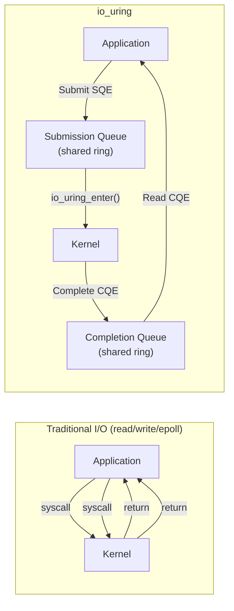
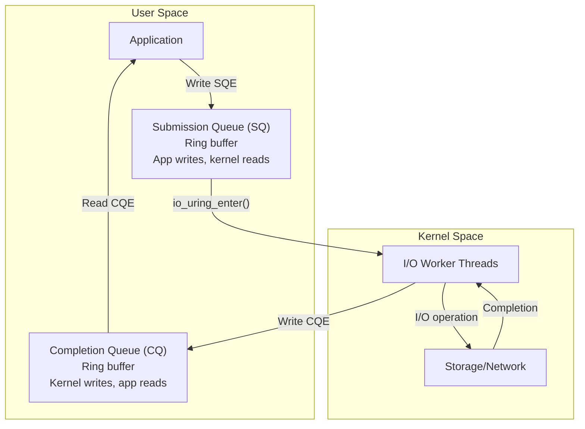

# Chapter 274: io_uring Programming

## 1. Introduction

io_uring is Linux's newest and most powerful asynchronous I/O interface, introduced in kernel 5.1 by Jens Axboe. It solves the fundamental limitations of previous async I/O mechanisms (POSIX AIO, libaio) by providing a zero-copy, lockless interface between user space and kernel space using shared ring buffers.

io_uring represents a paradigm shift in Linux I/O programming. Instead of making system calls for each I/O operation, io_uring uses shared memory rings to submit requests and collect completions, dramatically reducing system call overhead. For high-performance I/O workloads, io_uring can provide 2-10x throughput improvement over epoll.

## 2. Intuition: The Ring Buffer Model

### 2.1 Traditional I/O vs. io_uring



### 2.2 The Two Rings

io_uring uses two ring buffers shared between user space and kernel space:

1. **Submission Queue (SQ)**: The application writes I/O requests (SQEs) here. The kernel consumes them.
2. **Completion Queue (CQ)**: The kernel writes completion results (CQEs) here. The application consumes them.



### 2.3 Key Advantages

1. **Reduced system calls**: Batch multiple operations, submit with one `io_uring_enter()`.
2. **Zero-copy**: Shared memory rings — no data copying between user and kernel.
3. **Lockless**: Ring buffers use memory barriers, not locks.
4. **Submission polling**: With `IORING_SETUP_SQPOLL`, kernel polls for submissions — no syscall needed.
5. **Fixed files/buffers**: Pre-register files and buffers for even faster I/O.

## 3. The io_uring API

### 3.1 Setup

```c
#include <liburing.h>

int io_uring_setup(u32 entries, struct io_uring_params *p);

struct io_uring_params {
    u32 sq_entries;        // SQ ring size (output)
    u32 cq_entries;        // CQ ring size (output)
    u32 flags;             // Setup flags
    u32 sq_thread_cpu;     // SQ polling thread CPU
    u32 sq_thread_idle;    // SQ polling thread idle timeout (ms)
    u32 features;          // Supported features (output)
    u32 resv[4];
};

// flags:
// IORING_SETUP_SQPOLL     — Kernel polls for submissions
// IORING_SETUP_SQ_AFF     — Pin SQ thread to CPU
// IORING_SETUP_CQ_NESTED  — CQ locked (for nested operations)
// IORING_SETUP_IOPOLL     — Busy-poll for completions
```

### 3.2 Using liburing (Recommended)

liburing provides a high-level wrapper around the io_uring system calls:

```c
#include <liburing.h>

struct io_uring ring;

// Initialize
io_uring_queue_init(256, &ring, 0);

// Submit and wait for a read
struct io_uring_sqe *sqe = io_uring_get_sqe(&ring);
io_uring_prep_read(sqe, fd, buf, buf_len, offset);
io_uring_sqe_set_data(sqe, context_ptr);
io_uring_submit(&ring);

// Wait for completion
struct io_uring_cqe *cqe;
io_uring_wait_cqe(&ring, &cqe);
int result = cqe->res;
void *context = io_uring_cqe_get_data(cqe);
io_uring_cqe_seen(&ring, cqe);

// Cleanup
io_uring_queue_exit(&ring);
```

### 3.3 liburing Compilation

```bash
# Install liburing
# Ubuntu/Debian:
sudo apt install liburing-dev

# From source:
git clone https://github.com/axboe/liburing
cd liburing
./configure
make && sudo make install

# Compile:
gcc -o myprogram myprogram.c -luring
```

## 4. Submission Queue Entries (SQEs)

### 4.1 SQE Structure

```c
struct io_uring_sqe {
    __u8  opcode;       // Operation code
    __u8  flags;        // SQE flags
    __u16 ioprio;       // I/O priority
    __s32 fd;           // File descriptor
    __u64 off;          // Offset
    __u64 addr;         // Buffer address
    __u32 len;          // Buffer length
    __u64 user_data;    // User data (returned in CQE)
    __u16 buf_index;    // Buffer index (for registered buffers)
    // ... more fields
};
```

### 4.2 Operation Codes

| Opcode | Operation | Description |
|--------|-----------|-------------|
| `IORING_OP_READ` | Read | Read from fd |
| `IORING_OP_WRITE` | Write | Write to fd |
| `IORING_OP_READV` | Vectored read | Readv from fd |
| `IORING_OP_WRITEV` | Vectored write | Writev to fd |
| `IORING_OP_READ_FIXED` | Fixed read | Read using registered buffer |
| `IORING_OP_WRITE_FIXED` | Fixed write | Write using registered buffer |
| `IORING_OP_SEND` | Send | Send on socket |
| `IORING_OP_RECV` | Receive | Receive on socket |
| `IORING_OP_ACCEPT` | Accept | Accept connection |
| `IORING_OP_CONNECT` | Connect | Connect to address |
| `IORING_OP_CLOSE` | Close | Close fd |
| `IORING_OP_OPENAT` | Open | Open file |
| `IORING_OP_STATX` | Stat | Get file status |
| `IORING_OP_TIMEOUT` | Timeout | Timer |
| `IORING_OP_POLL_ADD` | Poll | Add poll |
| `IORING_OP_FSYNC` | Fsync | Sync file |
| `IORING_OP_FADVISE` | Fadvise | Advise kernel |

### 4.3 SQE Flags

| Flag | Description |
|------|-------------|
| `IOSQE_FIXED_FILE` | Use registered file descriptor |
| `IOSQE_IO_DRAIN` | Drain previous SQEs before this one |
| `IOSQE_IO_LINK` | Link with next SQE (sequential) |
| `IOSQE_IO_HARDLINK` | Like LINK, but survives errors |
| `IOSQE_ASYNC` | Force async execution |
| `IOSQE_BUFFER_SELECT` | Select buffer from provided buffer ring |

## 5. File Operations with io_uring

### 5.1 Basic Read/Write

```c
#include <stdio.h>
#include <fcntl.h>
#include <string.h>
#include <unistd.h>
#include <liburing.h>

#define QUEUE_DEPTH 4
#define BLOCK_SIZE 4096

int main(void)
{
    struct io_uring ring;
    io_uring_queue_init(QUEUE_DEPTH, &ring, 0);

    int fd = open("/tmp/test.txt", O_RDONLY);
    char buf[BLOCK_SIZE];

    // Prepare read SQE
    struct io_uring_sqe *sqe = io_uring_get_sqe(&ring);
    io_uring_prep_read(sqe, fd, buf, BLOCK_SIZE, 0);

    // Submit
    io_uring_submit(&ring);

    // Wait for completion
    struct io_uring_cqe *cqe;
    io_uring_wait_cqe(&ring, &cqe);

    if (cqe->res >= 0) {
        printf("Read %d bytes: %.*s\n", cqe->res, cqe->res, buf);
    } else {
        printf("Read error: %s\n", strerror(-cqe->res));
    }

    io_uring_cqe_seen(&ring, cqe);

    close(fd);
    io_uring_queue_exit(&ring);
    return 0;
}
```

### 5.2 Batched Operations

One of the key advantages of io_uring is the ability to submit multiple operations in a single system call:

```c
#include <stdio.h>
#include <fcntl.h>
#include <liburing.h>

#define QUEUE_DEPTH 8
#define NUM_FILES 4

int main(void)
{
    struct io_uring ring;
    io_uring_queue_init(QUEUE_DEPTH, &ring, 0);

    const char *files[] = {"/etc/hostname", "/etc/hosts", "/etc/resolv.conf", "/etc/mtab"};
    char bufs[NUM_FILES][4096];
    int fds[NUM_FILES];

    // Open all files
    for (int i = 0; i < NUM_FILES; i++)
        fds[i] = open(files[i], O_RDONLY);

    // Submit all reads at once
    for (int i = 0; i < NUM_FILES; i++) {
        struct io_uring_sqe *sqe = io_uring_get_sqe(&ring);
        io_uring_prep_read(sqe, fds[i], bufs[i], 4096, 0);
        io_uring_sqe_set_data(sqe, (void *)(long)i);
    }

    // Single submit for all operations
    io_uring_submit(&ring);

    // Collect all completions
    for (int i = 0; i < NUM_FILES; i++) {
        struct io_uring_cqe *cqe;
        io_uring_wait_cqe(&ring, &cqe);

        int idx = (int)(long)io_uring_cqe_get_data(cqe);
        printf("File %s: %d bytes\n", files[idx], cqe->res);
        io_uring_cqe_seen(&ring, cqe);
    }

    for (int i = 0; i < NUM_FILES; i++)
        close(fds[i]);

    io_uring_queue_exit(&ring);
    return 0;
}
```

### 5.3 File Operations (open, close, stat)

io_uring can perform file operations directly:

```c
// Open a file asynchronously
sqe = io_uring_get_sqe(&ring);
struct open_how how = {
    .flags = O_RDONLY,
    .mode = 0
};
io_uring_prep_openat2(sqe, AT_FDCWD, "/tmp/test.txt", &how);

// Stat a file
sqe = io_uring_get_sqe(&ring);
struct statx stx;
io_uring_prep_statx(sqe, AT_FDCWD, "/tmp/test.txt", 0, STATX_ALL, &stx);

// Close a file
sqe = io_uring_get_sqe(&ring);
io_uring_prep_close(sqe, fd);

io_uring_submit(&ring);
```

These operations are submitted asynchronously, allowing the application to continue while the kernel performs the I/O.

## 6. Registered Buffers and Files

### 6.1 Registered Buffers

Pre-registering buffers avoids repeated page table lookups:

```c
// Allocate and register buffers
void *bufs[NUM_BUFFERS];
struct iovec iovecs[NUM_BUFFERS];

for (int i = 0; i < NUM_BUFFERS; i++) {
    bufs[i] = aligned_alloc(4096, BUFFER_SIZE);
    iovecs[i].iov_base = bufs[i];
    iovecs[i].iov_len = BUFFER_SIZE;
}

io_uring_register_buffers(&ring, iovecs, NUM_BUFFERS);

// Use registered buffer
struct io_uring_sqe *sqe = io_uring_get_sqe(&ring);
io_uring_prep_read_fixed(sqe, fd, bufs[0], BUFFER_SIZE, 0, 0);
// last parameter is buffer index

// Cleanup
io_uring_unregister_buffers(&ring);
```

### 6.2 Registered Files

Pre-registering files avoids repeated fd lookup:

```c
int fds[NUM_FILES];
// ... open files ...

// Register
io_uring_register_files(&ring, fds, NUM_FILES);

// Use registered file (set IOSQE_FIXED_FILE flag)
struct io_uring_sqe *sqe = io_uring_get_sqe(&ring);
sqe->flags |= IOSQE_FIXED_FILE;
sqe->fd = 0;  // Index into registered files array
io_uring_prep_read(sqe, 0, buf, len, 0);

// Update registered files
int new_fds[] = {new_fd};
io_uring_register_files_update(&ring, 0, new_fds, 1);

// Cleanup
io_uring_unregister_files(&ring);
```

## 7. Linked Operations

### 7.1 Sequential Linked SQEs

```c
// These operations execute in order; if one fails, the chain is aborted
struct io_uring_sqe *sqe1 = io_uring_get_sqe(&ring);
io_uring_prep_read(sqe1, fd, buf1, len1, 0);
sqe1->flags |= IOSQE_IO_LINK;

struct io_uring_sqe *sqe2 = io_uring_get_sqe(&ring);
io_uring_prep_write(sqe2, out_fd, buf2, len2, 0);
sqe2->flags |= IOSQE_IO_LINK;

struct io_uring_sqe *sqe3 = io_uring_get_sqe(&ring);
io_uring_prep_fsync(sqe3, out_fd, 0);

io_uring_submit(&ring);
```

### 7.2 Read-Modify-Write Pattern

```c
// Read from input, transform, write to output — all in kernel
struct io_uring_sqe *sqe;

// 1. Read from input file
sqe = io_uring_get_sqe(&ring);
io_uring_prep_read(sqe, in_fd, buf, BLOCK_SIZE, offset);
sqe->flags |= IOSQE_IO_LINK;
io_uring_sqe_set_data(sqe, &ctx);

// 2. Write to output file (linked — executes after read completes)
sqe = io_uring_get_sqe(&ring);
io_uring_prep_write(sqe, out_fd, buf, BLOCK_SIZE, offset);
sqe->flags |= IOSQE_IO_LINK;

// 3. Fsync (linked — executes after write completes)
sqe = io_uring_get_sqe(&ring);
io_uring_prep_fsync(sqe, out_fd, 0);

io_uring_submit(&ring);
```

## 8. Polling Mode

### 8.1 IORING_SETUP_SQPOLL

In this mode, a dedicated kernel thread polls the submission queue, eliminating the need for `io_uring_enter()`:

```c
struct io_uring_params params = {0};
params.flags = IORING_SETUP_SQPOLL;
params.sq_thread_idle = 2000;  // 2 second idle timeout

io_uring_queue_init_params(256, &ring, &params);

// Submit without io_uring_enter() — kernel thread picks up SQEs
struct io_uring_sqe *sqe = io_uring_get_sqe(&ring);
io_uring_prep_read(sqe, fd, buf, len, 0);
io_uring_sqe_set_data(sqe, ctx);

// The SQ thread will process this automatically
// Check if we need to enter (if SQ thread is sleeping)
if (IO_URING_READ_ONCE(*ring.sq.kflags) & IORING_SQ_NEED_WAKEUP)
    io_uring_submit(&ring);
```

### 8.2 IORING_SETUP_IOPOLL

For storage devices that support it, this mode busy-polls for completions instead of using interrupts:

```c
struct io_uring_params params = {0};
params.flags = IORING_SETUP_IOPOLL;

io_uring_queue_init_params(256, &ring, &params);

// Completions are available immediately via busy-polling
// Use io_uring_peek_cqe() for non-blocking check
struct io_uring_cqe *cqe;
if (io_uring_peek_cqe(&ring, &cqe) == 0) {
    // Process completion
    io_uring_cqe_seen(&ring, cqe);
}
```

## 9. Timeout Operations

### 9.1 Timer-Based Timeout

```c
#include <liburing.h>

// Set a timeout for a batch of operations
struct __kernel_timespec ts = {
    .tv_sec = 5,
    .tv_nsec = 0
};

// Link timeout to previous operations
struct io_uring_sqe *sqe = io_uring_get_sqe(&ring);
io_uring_prep_read(sqe, fd, buf, len, 0);
sqe->flags |= IOSQE_IO_LINK;

sqe = io_uring_get_sqe(&ring);
io_uring_prep_link_timeout(sqe, &ts, 0);

io_uring_submit(&ring);

// If the read doesn't complete in 5 seconds, the timeout CQE will have -ETIME
```

### 9.2 Standalone Timeout

```c
struct __kernel_timespec ts = {
    .tv_sec = 1,
    .tv_nsec = 0
};

struct io_uring_sqe *sqe = io_uring_get_sqe(&ring);
io_uring_prep_timeout(sqe, &ts, 0, 0);

io_uring_submit(&ring);

struct io_uring_cqe *cqe;
io_uring_wait_cqe(&ring, &cqe);
// cqe->res == -ETIME when timeout expires
io_uring_cqe_seen(&ring, cqe);
```

## 10. Socket Operations

### 10.1 Accept

```c
struct io_uring_sqe *sqe = io_uring_get_sqe(&ring);
io_uring_prep_accept(sqe, listen_fd, (struct sockaddr *)&client_addr,
                     &client_len, 0);
io_uring_sqe_set_data(sqe, accept_context);
io_uring_submit(&ring);
```

### 10.2 Send/Receive

```c
// Send
sqe = io_uring_get_sqe(&ring);
io_uring_prep_send(sqe, client_fd, buf, len, 0);
io_uring_sqe_set_data(sqe, send_context);

// Receive
sqe = io_uring_get_sqe(&ring);
io_uring_prep_recv(sqe, client_fd, recv_buf, recv_len, 0);
io_uring_sqe_set_data(sqe, recv_context);

io_uring_submit(&ring);
```

### 10.3 Connect

```c
sqe = io_uring_get_sqe(&ring);
io_uring_prep_connect(sqe, sock_fd, (struct sockaddr *)&addr, addr_len);
io_uring_sqe_set_data(sqe, connect_context);
io_uring_submit(&ring);
```

## 11. Buffer Ring (Provided Buffers)

### 11.1 Dynamic Buffer Selection

Instead of pre-assigning buffers, let the kernel select from a pool:

```c
#define BUF_RING_SIZE 64
#define BUF_SIZE 4096

// Create buffer ring
struct io_uring_buf_ring *br;
posix_memalign((void **)&br, 4096,
               sizeof(struct io_uring_buf_ring) +
               BUF_RING_SIZE * sizeof(struct io_uring_buf));

// Register buffer ring
io_uring_register_buf_ring(&ring, &(struct io_uring_buf_reg){
    .ring_addr = (unsigned long)br,
    .ring_entries = BUF_RING_SIZE,
    .bgid = 0  // Buffer group ID
}, 0);

// Add buffers to the ring
for (int i = 0; i < BUF_RING_SIZE; i++) {
    void *buf = malloc(BUF_SIZE);
    io_uring_buf_ring_add(br, buf, BUF_SIZE, i, BUF_RING_SIZE, i);
}
io_uring_buf_ring_advance(br, BUF_RING_SIZE);

// Use buffer selection on recv
sqe = io_uring_get_sqe(&ring);
io_uring_prep_recv(sqe, fd, NULL, 0, 0);
sqe->flags |= IOSQE_BUFFER_SELECT;
sqe->buf_group = 0;

io_uring_submit(&ring);

// On completion, cqe->flags >> IORING_CQE_BUFFER_SHIFT gives the buffer index
```

## 12. Performance Optimization

### 12.1 SQ/CQ Sizing

Choosing the right ring sizes is important:

- **SQ size**: Should be at least as large as the maximum number of in-flight operations.
- **CQ size**: Should be at least twice the SQ size (some operations generate multiple CQEs).

```c
// For high-throughput workloads
io_uring_queue_init(4096, &ring, 0);  // Large rings

// For low-latency workloads with few in-flight ops
io_uring_queue_init(64, &ring, 0);   // Small rings, less memory
```

### 12.2 Avoiding io_uring_enter() Overhead

With SQPOLL mode, the kernel thread polls the SQ, eliminating the need for `io_uring_enter()`. However, you must check if the SQ thread needs to be woken up:

```c
// Submit without entering (SQPOLL mode)
struct io_uring_sqe *sqe = io_uring_get_sqe(&ring);
io_uring_prep_read(sqe, fd, buf, len, 0);
io_uring_sqe_set_data(sqe, ctx);

// Check if SQ thread is sleeping
if (IO_URING_READ_ONCE(*ring.sq.kflags) & IORING_SQ_NEED_WAKEUP) {
    io_uring_submit(&ring);  // Wake SQ thread
}
```

### 12.3 Using Multishot Operations

For operations that generate multiple completions (e.g., accept), multishot mode avoids re-submitting:

```c
// Multishot accept: one SQE, multiple CQEs for each accepted connection
sqe = io_uring_get_sqe(&ring);
io_uring_prep_multishot_accept(sqe, listen_fd, NULL, NULL, 0);
io_uring_sqe_set_data(sqe, accept_ctx);
io_uring_submit(&ring);

// Each accepted connection generates a CQE
// No need to re-submit the accept SQE
```

## 13. Common Pitfalls

### 12.1 Not Checking Kernel Version
io_uring features are version-dependent. Always check feature flags.

### 12.2 CQ Overflow
If you don't consume CQEs fast enough, the CQ overflows. Use `io_uring_cq_advance()` to process completions promptly.

### 12.3 SQ Full
If the SQ is full, `io_uring_get_sqe()` returns NULL. Handle this by submitting first, then getting a new SQE.

### 12.4 Not Using Registered Buffers for High IOPS
Without registered buffers, each I/O operation requires page table lookups. For high IOPS, register buffers.

### 12.5 Security Concerns
io_uring has had security vulnerabilities. Some systems disable it (e.g., container runtimes). Check `IORING_SETUP_R_DISABLED` for safe initialization.

## 13. Best Practices

1. **Use liburing** — don't use raw system calls.
2. **Register files and buffers** for high-performance workloads.
3. **Use SQPOLL** for latency-sensitive applications.
4. **Use IOPOLL** for high-IOPS storage workloads.
5. **Use buffer rings** to avoid buffer management complexity.
6. **Use linked operations** for dependent I/O sequences.
7. **Monitor CQ usage** to prevent overflow.
8. **Set `IORING_SETUP_R_DISABLED`** and enable features one by one for safe initialization.
9. **Use `io_uring_wait_cqe_timeout()`** for timeout-aware waiting.
10. **Profile with `perf`** to identify bottlenecks.

## 14. Exercises

### Exercise 1: File Copy with io_uring
Implement a high-performance file copy using io_uring with registered buffers.

### Exercise 2: Async TCP Server
Build a TCP echo server using io_uring for all I/O operations.

### Exercise 3: Batched File Processing
Read 100 files concurrently using io_uring and process their contents.

### Exercise 4: io_uring vs epoll Benchmark
Compare the throughput of io_uring and epoll for a network echo server.

## 15. References

- **io_uring official documentation**: https://kernel.dk/io_uring.pdf
- **liburing source**: https://github.com/axboe/liburing
- **man pages**: `man 2 io_uring_setup`, `man 2 io_uring_enter`, `man 3 io_uring`
- **"Efficient IO with io_uring"** by Jens Axboe — The original design document
- **Kernel source**: `fs/io_uring.c` — The kernel implementation
- **"io_uring and networking in 2023"** by Jens Axboe — Network-focused io_uring
