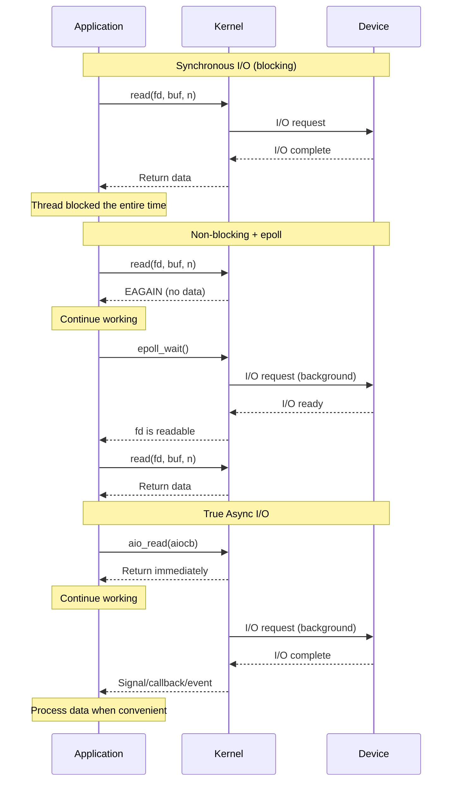
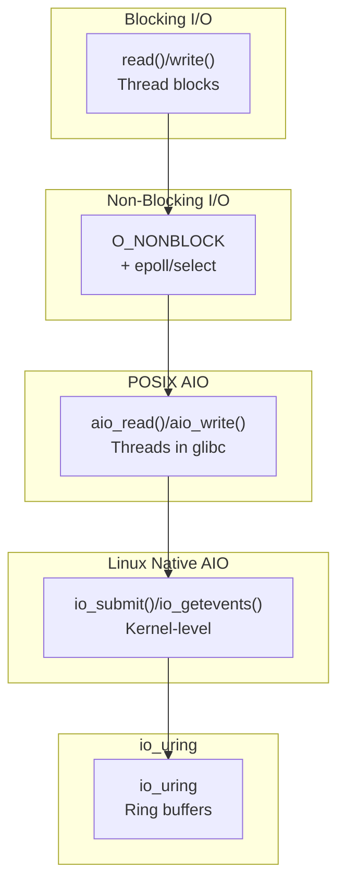
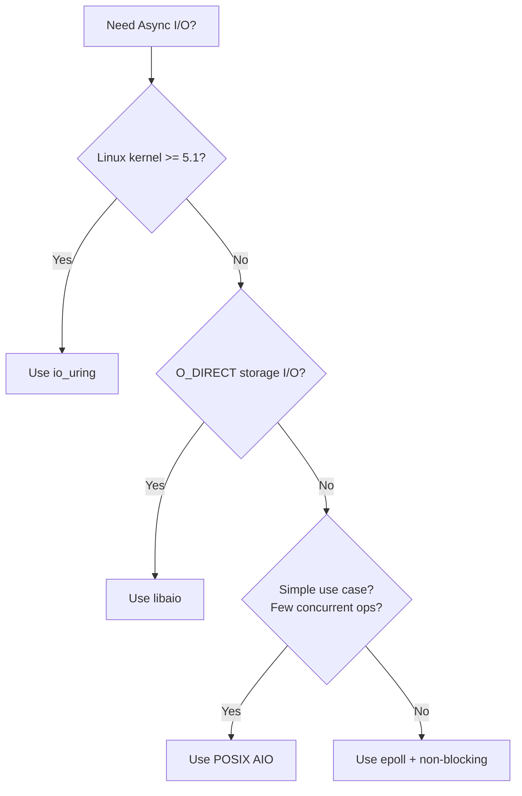
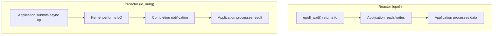

# Chapter 275: Async I/O

## 1. Introduction

Asynchronous I/O (AIO) allows applications to initiate I/O operations without blocking, continuing execution while the kernel performs the I/O in the background. This is fundamentally different from synchronous I/O (where the calling thread blocks) and even from non-blocking I/O (where the thread must poll or use select/epoll to check for completion).

This chapter covers the complete spectrum of async I/O on Linux: POSIX AIO, libaio (Linux native AIO), io_uring, and event-driven architectures. Understanding when to use each mechanism — and their trade-offs — is essential for building high-performance I/O systems.

## 2. Intuition: The Async I/O Spectrum

### 2.1 Synchronous vs. Asynchronous



### 2.2 The I/O Models on Linux



## 3. POSIX AIO (glibc Implementation)

### 3.1 Overview

POSIX AIO (`<aio.h>`) provides asynchronous I/O through a standardized interface. However, on Linux, glibc implements POSIX AIO using user-space threads — each AIO operation creates a new thread that performs blocking I/O. This makes POSIX AIO simple but not truly asynchronous at the kernel level.

### 3.2 API

```c
#include <aio.h>

// Submit async read
int aio_read(struct aiocb *aiocbp);

// Submit async write
int aio_write(struct aiocb *aiocbp);

// Submit async fsync
int aio_fsync(int op, struct aiocb *aiocbp);

// Cancel an AIO operation
int aio_cancel(int fd, struct aiocb *aiocbp);

// Check status of a single AIO operation
int aio_error(const struct aiocb *aiocbp);

// Get return value (after completion)
ssize_t aio_return(struct aiocb *aiocbp);

// Suspend until one or more AIO operations complete
int aio_suspend(const struct aiocb *const aiocbp_list[],
                int nitems, const struct timespec *timeout);

// List-based I/O
int lio_listio(int mode, struct aiocb *const aiocbp_list[],
               int nitems, struct sigevent *sig);
```

### 3.3 The aiocb Structure

```c
struct aiocb {
    int             aio_fildes;     // File descriptor
    off_t           aio_offset;     // File offset
    volatile void  *aio_buf;        // Buffer
    size_t          aio_nbytes;     // Number of bytes
    int             aio_reqprio;    // Request priority
    struct sigevent aio_sigevent;   // Notification method
    int             aio_lio_opcode; // For lio_listio

    // Internal fields
    // ...
};
```

### 3.4 Basic Example

```c
#include <stdio.h>
#include <stdlib.h>
#include <string.h>
#include <fcntl.h>
#include <aio.h>
#include <errno.h>
#include <unistd.h>

#define BUF_SIZE 4096

int main(void)
{
    int fd = open("/tmp/test.txt", O_RDONLY);
    if (fd == -1) {
        perror("open");
        return 1;
    }

    char buf[BUF_SIZE];
    struct aiocb cb;
    memset(&cb, 0, sizeof(cb));

    cb.aio_fildes = fd;
    cb.aio_buf = buf;
    cb.aio_nbytes = BUF_SIZE;
    cb.aio_offset = 0;

    // Submit async read
    if (aio_read(&cb) == -1) {
        perror("aio_read");
        return 1;
    }

    // Do other work while read is in progress
    printf("Read submitted, doing other work...\n");

    // Wait for completion
    while (aio_error(&cb) == EINPROGRESS)
        usleep(1000);

    // Get result
    ssize_t n = aio_return(&cb);
    if (n >= 0) {
        printf("Read %zd bytes: %.*s\n", (int)n, (int)n, buf);
    } else {
        printf("Read error: %s\n", strerror(errno));
    }

    close(fd);
    return 0;
}
```

### 3.5 Notification Methods

```c
// Signal-based notification
struct sigevent sev;
sev.sigev_notify = SIGEV_SIGNAL;
sev.sigev_signo = SIGUSR1;
sev.sigev_value.sival_ptr = &cb;
cb.aio_sigevent = sev;

// Thread-based notification
sev.sigev_notify = SIGEV_THREAD;
sev.sigev_notify_function = completion_callback;
sev.sigev_notify_attributes = NULL;
sev.sigev_value.sival_ptr = &cb;
```

### 3.6 lio_listio — Batch Submission

```c
#include <stdio.h>
#include <fcntl.h>
#include <aio.h>
#include <string.h>

#define NUM_FILES 4

int main(void)
{
    const char *files[] = {"/etc/hostname", "/etc/hosts", "/etc/resolv.conf", "/etc/mtab"};
    char bufs[NUM_FILES][4096];
    struct aiocb cbs[NUM_FILES];
    struct aiocb *cblist[NUM_FILES];

    for (int i = 0; i < NUM_FILES; i++) {
        int fd = open(files[i], O_RDONLY);
        memset(&cbs[i], 0, sizeof(cbs[i]));
        cbs[i].aio_fildes = fd;
        cbs[i].aio_buf = bufs[i];
        cbs[i].aio_nbytes = 4096;
        cbs[i].aio_offset = 0;
        cbs[i].aio_lio_opcode = LIO_READ;
        cblist[i] = &cbs[i];
    }

    // Submit all reads at once
    lio_listio(LIO_WAIT, cblist, NUM_FILES, NULL);

    // Collect results
    for (int i = 0; i < NUM_FILES; i++) {
        ssize_t n = aio_return(&cbs[i]);
        printf("File %s: %zd bytes\n", files[i], n);
        close(cbs[i].aio_fildes);
    }

    return 0;
}
```

### 3.7 POSIX AIO Limitations on Linux

1. **Thread-per-operation**: glibc creates a thread for each AIO operation.
2. **Not kernel-level**: The kernel doesn't know about the async nature.
3. **No O_DIRECT support well**: Works best with buffered I/O.
4. **Poor scalability**: Thread creation overhead limits concurrency.
5. **No kernel polling**: Can't use IOPOLL or SQPOLL.

## 4. Linux Native AIO (libaio)

### 4.1 Overview

Linux native AIO (`io_submit`/`io_getevents`) is a kernel-level async I/O interface. Unlike POSIX AIO, it actually submits I/O operations to the kernel's block layer asynchronously. However, it only works well with `O_DIRECT` I/O (bypassing the page cache).

### 4.2 API

```c
#include <libaio.h>

// Setup
int io_setup(int maxevents, io_context_t *ctxp);
int io_destroy(io_context_t ctx);

// Submit operations
int io_submit(io_context_t ctx, long nr, struct iocb *iocbpp[]);

// Get completions
int io_getevents(io_context_t ctx, long min_nr, long nr,
                 struct io_event *events, struct timespec *timeout);

// Cancel
int io_cancel(io_context_t ctx, struct iocb *iocb, struct io_event *event);
```

### 4.3 iocb Structure

```c
struct iocb {
    // Padding/data for kernel
    void *data;
    unsigned key;
    short aio_lio_opcode;
    short aio_reqprio;
    int aio_fildes;

    union {
        struct {
            void *buf;
            unsigned long nbytes;
            long long offset;
        } c;  // For read/write

        struct {
            struct iovec *iov;
            long iovcnt;
            long long offset;
        } v;  // For readv/writev

        // ...
    } u;
};
```

### 4.4 Complete Example

```c
#include <stdio.h>
#include <stdlib.h>
#include <string.h>
#include <fcntl.h>
#include <unistd.h>
#include <libaio.h>

#define QUEUE_DEPTH 4
#define BLOCK_SIZE 4096

int main(void)
{
    io_context_t ctx = 0;

    if (io_setup(QUEUE_DEPTH, &ctx) != 0) {
        perror("io_setup");
        return 1;
    }

    // Open with O_DIRECT for native AIO
    int fd = open("/tmp/testfile", O_RDONLY | O_DIRECT);
    if (fd == -1) {
        perror("open");
        return 1;
    }

    // Allocate aligned buffer (required for O_DIRECT)
    void *buf;
    posix_memalign(&buf, BLOCK_SIZE, BLOCK_SIZE);

    // Prepare iocb
    struct iocb cb;
    memset(&cb, 0, sizeof(cb));
    cb.aio_fildes = fd;
    cb.aio_lio_opcode = IO_CMD_PREAD;
    cb.u.c.buf = buf;
    cb.u.c.nbytes = BLOCK_SIZE;
    cb.u.c.offset = 0;
    cb.data = (void *)"my_context";

    struct iocb *cbs[1] = {&cb};

    // Submit
    int ret = io_submit(ctx, 1, cbs);
    if (ret != 1) {
        perror("io_submit");
        return 1;
    }

    printf("Submitted async read\n");

    // Get completion
    struct io_event events[1];
    ret = io_getevents(ctx, 1, 1, events, NULL);
    if (ret == 1) {
        printf("Read complete: %ld bytes\n", events[0].res);
        printf("Context: %s\n", (char *)events[0].data);
    }

    free(buf);
    close(fd);
    io_destroy(ctx);
    return 0;
}
```

### 4.5 Batched Operations

```c
#define NUM_IO 16

void *bufs[NUM_IO];
struct iocb cbs[NUM_IO];
struct iocb *cb_ptrs[NUM_IO];

for (int i = 0; i < NUM_IO; i++) {
    posix_memalign(&bufs[i], BLOCK_SIZE, BLOCK_SIZE);

    memset(&cbs[i], 0, sizeof(cbs[i]));
    cbs[i].aio_fildes = fd;
    cbs[i].aio_lio_opcode = IO_CMD_PREAD;
    cbs[i].u.c.buf = bufs[i];
    cbs[i].u.c.nbytes = BLOCK_SIZE;
    cbs[i].u.c.offset = i * BLOCK_SIZE;
    cb_ptrs[i] = &cbs[i];
}

// Submit all at once
io_submit(ctx, NUM_IO, cb_ptrs);

// Collect all completions
struct io_event events[NUM_IO];
int done = 0;
while (done < NUM_IO) {
    int n = io_getevents(ctx, 1, NUM_IO - done, events + done, NULL);
    done += n;
}
```

## 5. io_uring (See Chapter 274 for Deep Dive)

### 5.1 io_uring as Async I/O

io_uring is the most advanced async I/O mechanism on Linux:

```c
#include <liburing.h>

struct io_uring ring;
io_uring_queue_init(256, &ring, 0);

// Submit multiple async operations
for (int i = 0; i < NUM_FILES; i++) {
    struct io_uring_sqe *sqe = io_uring_get_sqe(&ring);
    io_uring_prep_read(sqe, fds[i], bufs[i], BLOCK_SIZE, 0);
    io_uring_sqe_set_data(sqe, &contexts[i]);
}

io_uring_submit(&ring);

// Process completions as they arrive
for (int i = 0; i < NUM_FILES; i++) {
    struct io_uring_cqe *cqe;
    io_uring_wait_cqe(&ring, &cqe);
    // Process completion
    io_uring_cqe_seen(&ring, cqe);
}
```

## 6. Comparison of Async I/O Mechanisms

| Feature | POSIX AIO | libaio | io_uring |
|---------|-----------|--------|----------|
| Kernel support | User-space threads | Kernel-level | Kernel-level |
| Buffered I/O | Yes | Poor | Yes |
| O_DIRECT | Not required | Required | Both |
| Network I/O | No | No | Yes |
| Submission batching | lio_listio | io_submit | Ring buffer |
| Completion polling | No | io_getevents | Ring buffer |
| Zero-copy | No | No | Yes (registered buffers) |
| SQPOLL | No | No | Yes |
| Scalability | Poor (threads) | Good | Excellent |
| Complexity | Low | Medium | Medium-High |
| Kernel version | 2.6+ | 2.5+ | 5.1+ |

### 6.1 When to Use What



## 8. Performance Considerations

### 8.1 Choosing the Right I/O Model

The choice of I/O model depends on several factors:

**Blocking I/O** is the simplest and works well for:
- Programs that handle one connection at a time
- Simple scripts and utilities
- Applications where latency is not critical
- Development and prototyping

**Non-blocking I/O with epoll** is ideal for:
- Network servers with many concurrent connections
- Applications that need to handle both network and timer events
- Code that needs to run on older kernels
- Applications where epoll is well-tested and understood

**io_uring** is best for:
- High-performance storage I/O
- Applications that need to minimize system call overhead
- Workloads that benefit from submission polling
- Modern kernels (5.1+) where io_uring is mature

### 8.2 The Cost of System Calls

Each system call has overhead:
- Mode transition (user → kernel → user): ~100ns
- Pipeline flush
- Potential TLB flush

Reducing system calls is often the key to performance:

```c
// Slow: One syscall per operation
for (int i = 0; i < N; i++) {
    read(fds[i], bufs[i], len);
}
// N system calls

// Fast: Batch with io_uring
for (int i = 0; i < N; i++) {
    sqe = io_uring_get_sqe(&ring);
    io_uring_prep_read(sqe, fds[i], bufs[i], len, 0);
}
io_uring_submit(&ring);
// 1 system call for all N operations
```

### 8.3 Memory-Mapped I/O vs. read/write

For file I/O, memory mapping can be faster for random access patterns:

```c
// read(): 1 syscall per access
pread(fd, buf, 4096, offset);

// mmap(): No syscall after initial mapping
void *addr = mmap(NULL, file_size, PROT_READ, MAP_SHARED, fd, 0);
char data = ((char *)addr)[offset];  // Direct memory access
```

However, memory mapping has its own overhead (page faults, TLB misses) and is not always faster. Always benchmark for your specific workload.

## 9. Event-Driven Architectures

### 9.1 The Reactor Pattern

The reactor pattern demultiplexes events and dispatches them to handlers:

```c
#include <sys/epoll.h>
#include <stdlib.h>

struct reactor {
    int epfd;
    int running;
    struct handler **handlers;  // Indexed by fd
    int max_fd;
};

struct handler {
    int fd;
    void (*on_read)(struct reactor *r, int fd, void *arg);
    void (*on_write)(struct reactor *r, int fd, void *arg);
    void (*on_error)(struct reactor *r, int fd, void *arg);
    void *arg;
};

void reactor_init(struct reactor *r, int max_fd)
{
    r->epfd = epoll_create1(EPOLL_CLOEXEC);
    r->running = 1;
    r->max_fd = max_fd;
    r->handlers = calloc(max_fd, sizeof(struct handler *));
}

void reactor_add(struct reactor *r, struct handler *h)
{
    r->handlers[h->fd] = h;
    struct epoll_event ev = {.events = EPOLLIN, .data.fd = h->fd};
    epoll_ctl(r->epfd, EPOLL_CTL_ADD, h->fd, &ev);
}

void reactor_run(struct reactor *r)
{
    struct epoll_event events[64];

    while (r->running) {
        int nfds = epoll_wait(r->epfd, events, 64, -1);

        for (int i = 0; i < nfds; i++) {
            int fd = events[i].data.fd;
            struct handler *h = r->handlers[fd];

            if (events[i].events & (EPOLLERR | EPOLLHUP)) {
                if (h->on_error)
                    h->on_error(r, fd, h->arg);
            } else {
                if (events[i].events & EPOLLIN && h->on_read)
                    h->on_read(r, fd, h->arg);
                if (events[i].events & EPOLLOUT && h->on_write)
                    h->on_write(r, fd, h->arg);
            }
        }
    }
}
```

### 7.2 The Proactor Pattern

The proactor pattern initiates async operations and processes completions:

```c
#include <liburing.h>

struct proactor {
    struct io_uring ring;
    void (*on_complete)(struct proactor *p, struct io_uring_cqe *cqe);
};

void proactor_init(struct proactor *p)
{
    io_uring_queue_init(256, &p->ring, 0);
}

void proactor_read(struct proactor *p, int fd, void *buf, size_t len,
                   off_t offset, void *ctx)
{
    struct io_uring_sqe *sqe = io_uring_get_sqe(&p->ring);
    io_uring_prep_read(sqe, fd, buf, len, offset);
    io_uring_sqe_set_data(sqe, ctx);
    io_uring_submit(&p->ring);
}

void proactor_run(struct proactor *p)
{
    while (1) {
        struct io_uring_cqe *cqe;
        io_uring_wait_cqe(&p->ring, &cqe);
        p->on_complete(p, cqe);
        io_uring_cqe_seen(&p->ring, cqe);
    }
}
```

### 7.3 Reactor vs. Proactor



| Feature | Reactor | Proactor |
|---------|---------|----------|
| I/O initiation | After readiness | Before I/O |
| I/O execution | Application | Kernel |
| Complexity | Higher (app manages I/O) | Lower (kernel manages I/O) |
| Examples | epoll, select, poll | io_uring, IOCP (Windows) |

## 8. Building an Async Framework

### 8.1 Combining epoll and io_uring

```c
#include <liburing.h>
#include <sys/epoll.h>

struct hybrid_loop {
    int epfd;            // For network I/O (readiness-based)
    struct io_uring ring; // For disk I/O (completion-based)
    int running;
};

void hybrid_init(struct hybrid_loop *loop)
{
    loop->epfd = epoll_create1(EPOLL_CLOEXEC);
    io_uring_queue_init(256, &loop->ring, 0);
    loop->running = 1;
}

void hybrid_run(struct hybrid_loop *loop)
{
    while (loop->running) {
        // Check for disk I/O completions (non-blocking)
        struct io_uring_cqe *cqe;
        while (io_uring_peek_cqe(&loop->ring, &cqe) == 0) {
            // Process disk I/O completion
            io_uring_cqe_seen(&loop->ring, cqe);
        }

        // Check for network events (with short timeout)
        struct epoll_event events[64];
        int nfds = epoll_wait(loop->epfd, events, 64, 1);  // 1ms timeout

        for (int i = 0; i < nfds; i++) {
            // Process network events
        }
    }
}
```

## 9. Common Pitfalls

### 9.1 Using POSIX AIO for Performance-Critical Code
glibc's POSIX AIO uses threads, not kernel-level async I/O. Use libaio or io_uring instead.

### 9.2 Not Using O_DIRECT with libaio
libaio falls back to synchronous I/O for buffered I/O. Always use `O_DIRECT`.

### 9.3 Buffer Alignment with O_DIRECT
`O_DIRECT` requires buffers to be aligned to the filesystem block size (typically 512 or 4096 bytes).

### 9.4 Mixing Sync and Async I/O
Mixing synchronous and asynchronous I/O on the same file descriptor can lead to ordering issues.

### 9.5 Not Handling Partial Completions
Async I/O operations may complete with fewer bytes than requested. Always check `res`.

## 10. Best Practices

1. **Use io_uring** for new code on modern kernels (5.1+).
2. **Use epoll** for network I/O on older kernels.
3. **Use libaio** only for O_DIRECT storage I/O on older kernels.
4. **Avoid POSIX AIO** for performance-critical code.
5. **Register buffers and files** with io_uring for maximum performance.
6. **Use SQPOLL** for latency-sensitive workloads.
7. **Use IOPOLL** for high-IOPS storage workloads.
8. **Batch operations** — submit multiple I/Os, then wait for completions.
9. **Use proper buffer alignment** for O_DIRECT operations.
10. **Profile and benchmark** — async I/O isn't always faster than synchronous.

## 11. Exercises

### Exercise 1: Async File Concatenation
Concatenate multiple files asynchronously using io_uring.

### Exercise 2: Async Database Loader
Build a data loader that reads multiple database files concurrently using libaio.

### Exercise 3: Event-Driven Web Server
Build a web server using the reactor pattern with epoll.

### Exercise 4: Async I/O Benchmark
Write a benchmark that compares sync I/O, epoll, libaio, and io_uring for random reads on a block device.

## 12. References

- **The Linux Programming Interface** by Michael Kerrisk — Chapter 63: Alternative I/O Models
- **"Efficient IO with io_uring"** by Jens Axboe — The io_uring design document
- **man pages**: `man 2 io_setup`, `man 2 io_submit`, `man 2 io_getevents`, `man 7 aio`
- **libaio source**: https://github.com/linux-iscsi/libaio
- **liburing source**: https://github.com/axboe/liburing
- **"Pattern-Oriented Software Architecture, Volume 2"** by Schmidt et al. — Reactor and Proactor patterns
- **"The Art of Computer Programming, Volume 1"** by Donald Knuth — Fundamental algorithms for async systems
