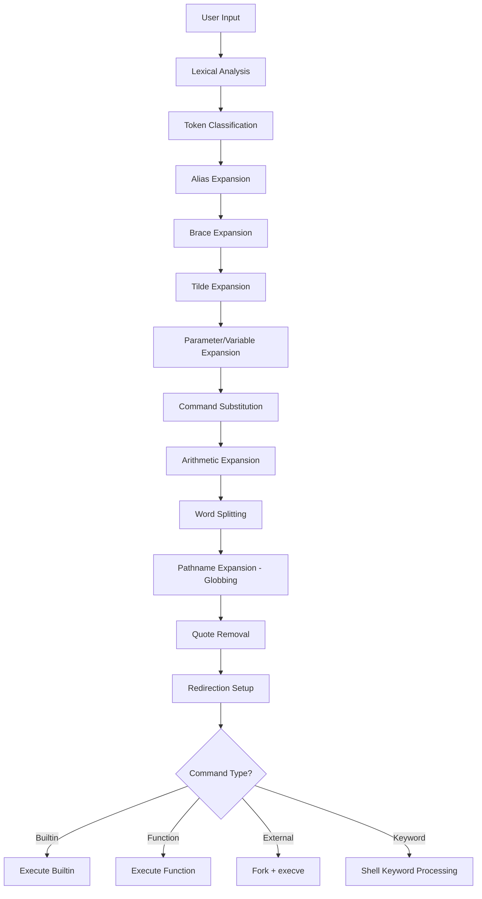

# Chapter 25: Bash — The Bourne Again Shell

## Overview

Bash (Bourne Again SHell) is the most widely used shell on Linux systems. Written by Brian Fox for the GNU Project and first released in 1989, it replaced the Bourne Shell (`sh`) as the default interactive and scripting shell on most distributions. Bash is both a powerful interactive command interpreter and a full-featured programming language, supporting variables, functions, arrays, arithmetic, string manipulation, and extensive I/O capabilities.

Understanding Bash deeply is essential for every Linux administrator, developer, and power user. It is the lingua franca of system automation, the glue that binds command-line tools together, and the default login shell on the vast majority of Linux and macOS systems.

## Intuition

Think of Bash as a translator sitting between you and the Linux kernel. When you type a command, Bash interprets it, performs expansions, resolves paths, manages I/O redirection, and ultimately asks the kernel to execute the resulting program. But Bash is more than a simple translator — it is a full programming environment with variables, loops, conditionals, functions, and a rich set of builtins that operate without spawning external processes.

The name "Bourne Again" is a pun: it is both a "rebirth" of the original Bourne Shell (`sh`) and a play on "born again." It was designed to be a free software replacement for `sh` that included the best features of the Korn Shell (`ksh`) and the C Shell (`csh`), while maintaining backward compatibility with the Bourne Shell's syntax.

## Architecture



### Key Components

| Component | Purpose |
|-----------|---------|
| **Parser** | Reads input, tokenizes, and builds command structures |
| **Expander** | Applies the seven expansion types in order |
| **Executor** | Dispatches builtins, functions, or external commands |
| **Job Control** | Manages foreground/background processes |
| **Readline** | Provides line editing, history, and completion |
| **Variables** | Shell variables, environment, positional parameters |
| **Signal Handler** | Processes traps and asynchronous events |

### Bash Version History

| Version | Year | Key Features |
|---------|------|-------------|
| 1.0 | 1989 | Initial release, Bourne Shell compatibility |
| 2.0 | 1996 | Arrays, `=~` regex operator, `select` |
| 3.0 | 2004 | `<<<` here-strings, `**` globstar, `=~` improvements |
| 4.0 | 2009 | Associative arrays, `coproc`, `|&` shorthand |
| 4.4 | 2016 | `${var@operator}` transformations, `mapfile -d` |
| 5.0 | 2019 | `EPOCHSECONDS`, `EPOCHREALTIME`, `BASH_ARGV0` |
| 5.1 | 2020 | `SRANDOM`, `FUNCNEST`, `|&` for `coproc` |
| 5.2 | 2022 | `${var@Q}` quoting, `printf -v` improvements |

## Features

### Variables and Parameters

```bash
# Simple variable assignment (no spaces around =)
name="Linux"
version=6

# Read-only variable
readonly PI=3.14159

# Environment variable (available to child processes)
export EDITOR=vim

# Unset a variable
unset name

# Default values
echo "${undefined_var:-default}"     # Use default if unset or empty
echo "${undefined_var:=default}"     # Assign and use default if unset or empty
echo "${undefined_var:?error msg}"   # Error if unset or empty
echo "${undefined_var:+alt_value}"   # Use alt_value if set and non-empty
```

### Arrays

```bash
# Indexed arrays
fruits=("apple" "banana" "cherry")
echo "${fruits[0]}"        # apple
echo "${fruits[@]}"        # all elements
echo "${#fruits[@]}"       # number of elements (3)

# Append to array
fruits+=("date")

# Slice
echo "${fruits[@]:1:2}"   # banana cherry

# Associative arrays (Bash 4+)
declare -A config
config[host]="localhost"
config[port]="8080"
echo "${config[host]}"

# Iterate
for key in "${!config[@]}"; do
    echo "$key = ${config[$key]}"
done
```

### String Operations

```bash
str="Hello, World!"

# Length
echo "${#str}"                # 13

# Substring
echo "${str:0:5}"             # Hello
echo "${str:7}"               # World!

# Pattern removal
filepath="/home/user/docs/file.tar.gz"
echo "${filepath##*/}"        # file.tar.gz (remove longest prefix matching */)
echo "${filepath%/*}"         # /home/user/docs (remove shortest suffix matching /*)
echo "${filepath%%.*}"        # /home/user/docs/file (remove longest suffix matching .*)
echo "${filepath#*/}"         # home/user/docs/file.tar.gz (remove shortest prefix matching */)

# Search and replace
text="foo bar foo baz"
echo "${text/foo/FOO}"        # FOO bar foo baz (first occurrence)
echo "${text//foo/FOO}"       # FOO bar FOO baz (all occurrences)

# Case modification (Bash 4+)
echo "${str^^}"               # HELLO, WORLD!
echo "${str,,}"               # hello, world!
echo "${str^}"                # Hello, World! (first char uppercase)
```

### Arithmetic

```bash
# Arithmetic expansion
echo $((2 + 3))              # 5
echo $((10 / 3))             # 3 (integer division)
echo $((2 ** 10))            # 1024

# Variables in arithmetic don't need $
a=5; b=3
echo $((a * b))              # 15

# Arithmetic command (returns exit status)
((a > b)) && echo "a is greater"

# let command
let "result = a + b"
echo "$result"

# Declare integer variable
declare -i count=0
count+=5                     # count is now 5 (integer addition, not string append)
```

### Control Structures

```bash
# if/elif/else
if [[ -f "/etc/passwd" ]]; then
    echo "File exists"
elif [[ -d "/etc" ]]; then
    echo "Directory exists"
else
    echo "Neither"
fi

# [[ vs [ vs test
# [[ is a Bash keyword with enhanced features (no word splitting, regex)
# [ is a builtin (POSIX compatible)
# [[ supports: &&, ||, <, >, =~ (regex), pattern matching
[[ $string =~ ^[0-9]+$ ]] && echo "numeric"
[[ $string == *.txt ]]     && echo "text file"

# for loops
for i in {1..10}; do
    echo "$i"
done

for ((i = 0; i < 10; i++)); do
    echo "$i"
done

for file in *.txt; do
    [[ -f "$file" ]] && echo "Processing $file"
done

# while/until
while read -r line; do
    echo "Line: $line"
done < /etc/passwd

# case
case "$1" in
    start)   echo "Starting" ;;
    stop)    echo "Stopping" ;;
    restart) echo "Restarting" ;;
    *)       echo "Usage: $0 {start|stop|restart}" ;;
esac

# select menu
select opt in "Option 1" "Option 2" "Quit"; do
    case "$opt" in
        "Option 1") echo "You chose 1" ;;
        "Option 2") echo "You chose 2" ;;
        "Quit")     break ;;
        *)          echo "Invalid" ;;
    esac
done
```

### Functions

```bash
# POSIX-style definition
greet() {
    local name="$1"
    echo "Hello, $name!"
    return 0
}

# Bash-style definition
function greet {
    local -n _greet_ref=$1   # nameref (Bash 4.3+)
    _greet_ref="Hello, $2!"
}

# Usage
greet "World"

# Return values via nameref
declare result
greet result "World"
echo "$result"               # Hello, World!
```

### Process Substitution and Coprocesses

```bash
# Process substitution
diff <(ls /dir1) <(ls /dir2)

# Coprocess (Bash 4+)
coproc myproc { bc -l; }
echo "scale=10; 4*a(1)" >&"${myproc[1]}"
read -r result <&"${myproc[0]}"
echo "Pi = $result"
```

### Builtins

Bash has over 50 builtin commands that execute within the shell process itself:

| Builtin | Purpose |
|---------|---------|
| `cd` | Change directory |
| `echo` | Print arguments |
| `printf` | Formatted output |
| `read` | Read input |
| `declare` / `typeset` | Declare variables with attributes |
| `local` | Local variable in function |
| `export` | Mark for environment |
| `source` / `.` | Execute file in current shell |
| `eval` | Evaluate string as command |
| `exec` | Replace shell or redirect fds |
| `set` | Set shell options |
| `shopt` | Set shell options (Bash-specific) |
| `trap` | Set signal handlers |
| `type` | Identify command type |
| `hash` | Cache command paths |
| `builtin` | Force builtin execution |
| `command` | Bypass functions/aliases |
| `enable` | Enable/disable builtins |
| `getopts` | Parse options in scripts |
| `mapfile` / `readarray` | Read lines into array |
| `printf` | Formatted output |

## POSIX Mode

Bash can operate in POSIX-compliant mode, which disables Bash-specific extensions:

```bash
#!/bin/bash --posix
# or
set -o posix
# or invoke as:
bash --posix script.sh
```

### What Changes in POSIX Mode

| Feature | Normal Bash | POSIX Mode |
|---------|------------|------------|
| `source` builtin | Searches `PATH` | Searches `PATH` |
| Array support | Full | Not available |
| `[[ ]]` | Enhanced test | Not available |
| `=~` regex | Available | Not available |
| `**` globstar | Available | Not available |
| `function` keyword | Available | Not available |
| `$RANDOM` | Available | Not available |
| `<<<` here-strings | Available | Not available |
| `<()` process substitution | Available | Not available |
| `|&` pipe stderr | Available | Not available |
| Word splitting on `$@` | Contextual | Strictly POSIX |

## Bashisms

"Bashisms" are features specific to Bash that are not portable to other POSIX shells. They are a common source of bugs when scripts written for Bash are run under `dash`, `ash`, or other minimal shells.

### Common Bashisms to Avoid in Portable Scripts

```bash
# ❌ Array syntax (not POSIX)
arr=(one two three)
echo "${arr[1]}"

# ✅ Portable alternative
set -- one two three
echo "$2"

# ❌ [[ ]] double bracket test
[[ -f "$file" && $var == "pattern" ]]

# ✅ Portable
[ -f "$file" ] && [ "$var" = "pattern" ]

# ❌ String manipulation
echo "${var^^}"        # Uppercase
echo "${var,,}"        # Lowercase
echo "${var:0:5}"      # Substring

# ✅ Portable
echo "$var" | tr '[:lower:]' '[:upper:]'
echo "$var" | tr '[:upper:]' '[:lower:]'
echo "$var" | cut -c1-5

# ❌ Here-strings
grep "pattern" <<< "$string"

# ✅ Portable
echo "$string" | grep "pattern"

# ❌ Process substitution
diff <(sort file1) <(sort file2)

# ✅ Portable
sort file1 > /tmp/file1.sorted
sort file2 > /tmp/file2.sorted
diff /tmp/file1.sorted /tmp/file2.sorted

# ❌ $RANDOM
echo "$RANDOM"

# ✅ Portable
echo "$(( $(od -An -tu4 -N4 /dev/urandom | tr -d ' ') % 32768 ))"

# ❌ $LINENO
echo "Error on line $LINENO"

# ✅ No direct portable equivalent

# ❌ &> redirect both stdout and stderr
command &> file

# ✅ Portable
command > file 2>&1

# ❌ Arithmetic with let
let "x = y + 1"

# ✅ Portable
x=$(( y + 1 ))

# ❌ Local arrays
local -a arr=()

# ✅ Avoid arrays in portable scripts

# ❌ function keyword
function my_func { ... }

# ✅ Portable
my_func() { ... }
```

### Checking for Bashisms

The `checkbashisms` tool (from the `devscripts` package) can scan scripts for non-POSIX constructs:

```bash
# Install
sudo apt install devscripts

# Check a script
checkbashisms myscript.sh

# Common output:
# possible bashism in myscript.sh line 5 (arrays):
#     arr=(a b c)
# possible bashism in myscript.sh line 10 (double-bracket test):
#     [[ -f "$file" ]]
```

## Shebang Lines

The shebang determines which interpreter runs a script:

```bash
#!/bin/bash          # Bash specifically
#!/bin/sh            # System default shell (often dash on Debian/Ubuntu)
#!/usr/bin/env bash  # Bash found via PATH (more portable)
#!/usr/bin/env sh    # System sh via PATH
```

**Best practice:** Use `#!/bin/bash` for Bash scripts, `#!/bin/sh` only for truly POSIX-compatible scripts. Using `#!/bin/sh` when you rely on Bashisms will cause silent failures on systems where `/bin/sh` is `dash`.

## Shell Options (set and shopt)

### `set` Options (POSIX-compatible)

```bash
set -e          # Exit on error
set -u          # Treat unset variables as errors
set -o pipefail # Pipeline fails if any command fails
set -x          # Print commands before execution (debugging)
set -n          # Read commands but don't execute (syntax check)
set -C          # Prevent file overwrite with > (use >| to override)
set -f          # Disable globbing
set -v          # Print input lines as read
```

### `shopt` Options (Bash-specific)

```bash
shopt -s globstar       # Enable ** for recursive globbing
shopt -s extglob        # Enable extended globbing patterns
shopt -s nullglob       # Glob with no matches expands to nothing
shopt -s failglob       # Glob with no matches produces error
shopt -s dotglob        # Include dotfiles in globbing
shopt -s nocaseglob     # Case-insensitive globbing
shopt -s nocasematch    # Case-insensitive pattern matching
shopt -s checkwinsize   # Update LINES/COLUMNS after each command
shopt -s histappend     # Append to history instead of overwriting
shopt -s cmdhist        # Save multi-line commands as single entry
shopt -s lithist        # Save with embedded newlines
shopt -s direxpand      # Expand ~ in directory names
shopt -s dirspell       # Correct directory typos
shopt -s cdspell        # Correct minor cd typos
shopt -s hostcomplete   # Complete hostnames with @
shopt -s complete_fullquote  # Quote all completions
```

## Debugging Bash Scripts

```bash
# Syntax check (no execution)
bash -n script.sh

# Trace execution
bash -x script.sh

# Partial tracing in script
set -x          # Enable tracing
# ... code to debug ...
set +x          # Disable tracing

# Debug trap
trap 'echo "DEBUG: $BASH_COMMAND"' DEBUG

# Error handling
trap 'echo "ERROR on line $LINENO: $BASH_COMMAND" >&2' ERR

# Strict mode (common idiom)
set -euo pipefail
IFS=$'\n\t'
```

## Performance Tips

```bash
# ❌ Calling external commands when builtins suffice
echo "$var" | grep "pattern"    # Spawns grep
[[ "$var" == *pattern* ]]       # Pure Bash

# ❌ Subshell in loop
for i in $(seq 1 1000); do      # seq is external
    echo "$i"
done

# ✅ Pure Bash
for i in {1..1000}; do
    echo "$i"
done

# ❌ cat piped to while
cat file | while read -r line; do
    echo "$line"
done
# (runs while in subshell, variable changes lost)

# ✅ Redirection
while read -r line; do
    echo "$line"
done < file

# ❌ String concatenation in loop
result=""
for i in {1..10000}; do
    result+="$i "    # Creates new string each iteration
done

# ✅ Array join
declare -a arr
for i in {1..10000}; do
    arr+=("$i")
done
result="${arr[*]}"
```

## Common Pitfalls

### 1. Word Splitting

```bash
# ❌ Unquoted variable subject to word splitting
files="my file.txt"
cat $files          # Tries to cat "my" and "file.txt" separately

# ✅ Always quote variables
cat "$files"

# ❌ Same issue with find
find /path -name *.txt    # Shell expands * before find sees it
find /path -name "*.txt"  # Correct
```

### 2. Subshell Variable Scope

```bash
# ❌ Variables in pipe subshell don't propagate
count=0
cat file | while read -r line; do
    ((count++))       # This count is in a subshell
done
echo "$count"         # Still 0!

# ✅ Use process substitution or redirection
while read -r line; do
    ((count++))
done < file
echo "$count"         # Correct
```

### 3. Command Injection

```bash
# ❌ Unsafe: user input in eval
read -r user_input
eval "$user_input"      # Executes arbitrary commands

# ❌ Unsafe: variable in arithmetic
eval "result=$user_input + 1"

# ✅ Safe: use (( )) for arithmetic
((result = user_input + 1))
```

### 4. Null Glob

```bash
# ❌ Default: glob with no matches keeps the pattern
rm *.nonexistent    # Tries to remove a file literally named "*.nonexistent"

# ✅ Enable nullglob
shopt -s nullglob
files=(*.nonexistent)
if [[ ${#files[@]} -eq 0 ]]; then
    echo "No matches"
fi
```

### 5. Array Iteration

```bash
# ❌ Iterating over $array (only first element)
for item in $array; do ...

# ✅ Use "${array[@]}"
for item in "${array[@]}"; do ...
```

## Best Practices

### Script Template

```bash
#!/bin/bash
#
# script_name.sh - Brief description
#
# Usage: script_name.sh [OPTIONS] ARGUMENTS
#
# Description:
#   Detailed description of what this script does.
#
# Options:
#   -h, --help    Show this help message
#   -v, --verbose Enable verbose output
#
# Author: Your Name
# Date: 2026-06-29
# Version: 1.0.0

set -euo pipefail
IFS=$'\n\t'

# Constants
readonly SCRIPT_DIR="$(cd "$(dirname "${BASH_SOURCE[0]}")" && pwd)"
readonly SCRIPT_NAME="$(basename "$0")"
readonly VERSION="1.0.0"

# Colors (check if terminal supports them)
if [[ -t 1 ]] && [[ -n "${TERM:-}" ]] && [[ "$TERM" != "dumb" ]]; then
    readonly RED='\033[0;31m'
    readonly GREEN='\033[0;32m'
    readonly YELLOW='\033[1;33m'
    readonly NC='\033[0m'
else
    readonly RED='' GREEN='' YELLOW='' NC=''
fi

# Logging functions
log_info()  { echo -e "${GREEN}[INFO]${NC}  $*" >&2; }
log_warn()  { echo -e "${YELLOW}[WARN]${NC}  $*" >&2; }
log_error() { echo -e "${RED}[ERROR]${NC} $*" >&2; }

# Cleanup
cleanup() {
    # Remove temporary files, restore state, etc.
    rm -f "${TEMP_FILE:-}"
}
trap cleanup EXIT

# Usage
usage() {
    sed -n '/^# Usage:/,/^$/p' "$0" | sed 's/^# *//' >&2
    exit "${1:-0}"
}

# Parse options
VERBOSE=false
while [[ $# -gt 0 ]]; do
    case "$1" in
        -h|--help)    usage 0 ;;
        -v|--verbose) VERBOSE=true; shift ;;
        --)           shift; break ;;
        -*)           log_error "Unknown option: $1"; usage 1 ;;
        *)            break ;;
    esac
done

# Validate arguments
if [[ $# -lt 1 ]]; then
    log_error "Missing required argument"
    usage 1
fi

# Main logic
main() {
    log_info "Starting $SCRIPT_NAME v$VERSION"
    # ... your code here ...
    log_info "Done"
}

main "$@"
```

### General Guidelines

1. **Always quote variables**: `"$var"` not `$var`
2. **Use `[[ ]]` over `[ ]` in Bash scripts**: fewer surprises with word splitting
3. **Set `set -euo pipefail` at the top**: catch errors early
4. **Use `local` in functions**: prevent variable leakage
5. **Use `readonly` for constants**: prevent accidental modification
6. **Use `printf` over `echo` for portability**: `echo` behavior varies
7. **Prefer `$(command)` over backticks**: nestable and more readable
8. **Use `${var:?}` to validate required variables**: fails with error message
9. **Clean up with `trap`**: always handle EXIT, INT, TERM
10. **Check `shellcheck` for issues**: automated static analysis

### ShellCheck

```bash
# Install
sudo apt install shellcheck

# Check a script
shellcheck myscript.sh

# Example output:
# In myscript.sh line 5:
# echo $name
#      ^---^ SC2086: Double quote to prevent globbing and word splitting.
```

ShellCheck catches hundreds of common mistakes: unquoted variables, missing shebangs, incorrect use of `[[ ]]`, missing error handling, and more.

## Exercises

### Exercise 1: Variable Manipulation
Write a script that takes a filename like `archive.tar.gz` and extracts:
- The directory path
- The full filename
- The filename without any extension
- The last extension only

### Exercise 2: Array Processing
Write a function that takes an array of numbers and returns (via nameref) the sorted array. Implement bubble sort in pure Bash.

### Exercise 3: Config Parser
Write a Bash function that reads an INI-style config file and populates an associative array with section.key=value entries.

### Exercise 4: Strict Mode Script
Write a template script with `set -euo pipefail`, proper error handling with `trap`, colored logging, and argument parsing with `getopts`.

### Exercise 5: Bashism Detection
Take the following script and make it POSIX-compatible:

```bash
#!/bin/bash
files=(*.txt)
declare -A counts
for f in "${files[@]}"; do
    if [[ -f "$f" ]]; then
        lines=$(wc -l < "$f")
        counts["$f"]=$lines
        echo "$f has $lines lines"
    fi
done
```

## References

- [Bash Reference Manual](https://www.gnu.org/software/bash/manual/bash.html)
- [Bash FAQ (Greg Wooledge)](https://mywiki.wooledge.org/BashFAQ)
- [Bash Pitfalls](https://mywiki.wooledge.org/BashPitfalls)
- [Bash Hackers Wiki](https://wiki.bash-hackers.org/)
- [Advanced Bash-Scripting Guide](https://tldp.org/LDP/abs/html/)
- [ShellCheck](https://www.shellcheck.net/)
- [checkbashisms](https://manpages.ubuntu.com/manpages/man1/checkbashisms.1.html)
- [POSIX Shell Command Language](https://pubs.opengroup.org/onlinepubs/9699919799/utilities/V3_chap02.html)
