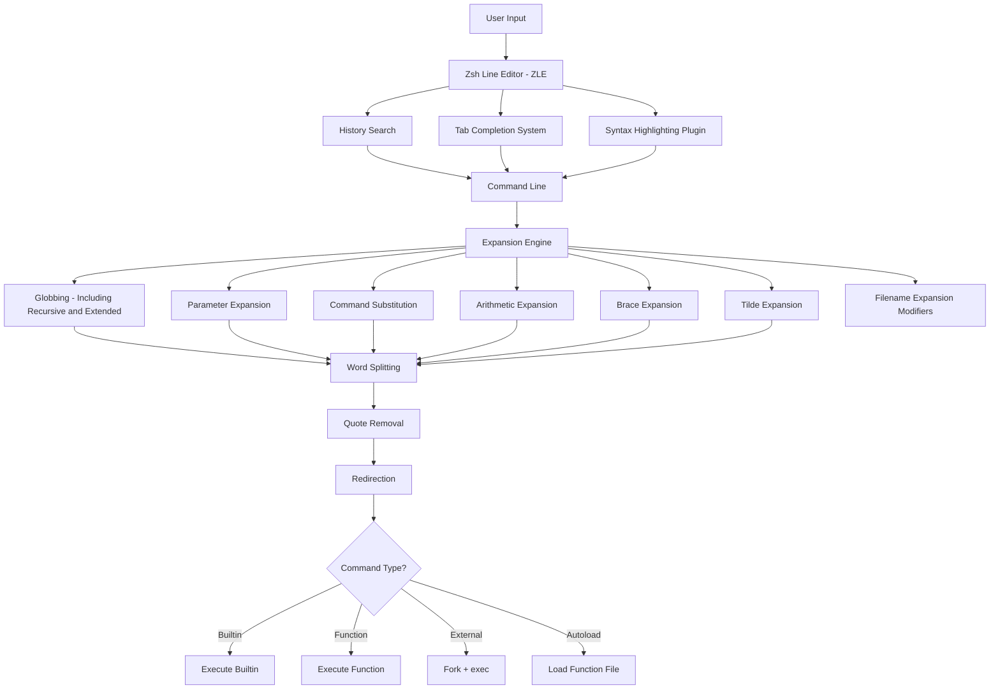
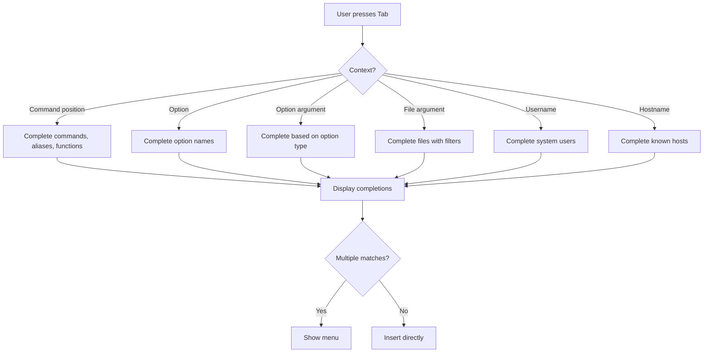

# Chapter 26: Zsh — The Z Shell

## Overview

Zsh (Z Shell) is a powerful interactive shell that combines features from Bash, ksh, and tcsh while adding its own innovations. Written by Paul Falstad in 1990 while he was a student at Princeton University, Zsh has evolved into one of the most feature-rich shells available. It offers superior tab completion, advanced globbing, spell correction, theming support, and an extensive plugin ecosystem through frameworks like Oh My Zsh.

Since 2019, Zsh is the default login shell on macOS, and it has become increasingly popular among Linux developers and power users. Its interactive features make it particularly well-suited for day-to-day terminal work, while its scripting capabilities are more than adequate for most automation tasks.

## Intuition

If Bash is a reliable sedan, Zsh is a luxury car with all the options. Both get you to your destination, but Zsh adds automatic spell correction (you type `sl` and it offers to run `ls`), superior tab completion that can navigate menus, powerful glob patterns that eliminate the need for `find` in many cases, and a theming system that makes your prompt informative and beautiful.

Zsh is highly configurable — almost every behavior can be customized through options, styles, and widgets. This flexibility is both its greatest strength and its steepest learning curve.

## Architecture



### Zsh vs Bash Architecture Differences

| Feature | Bash | Zsh |
|---------|------|-----|
| **Completion System** | `complete`/`compgen` builtins | Comprehensive `_compsys` framework |
| **Line Editor** | GNU Readline | ZLE (Zsh Line Editor) built-in |
| **Globbing** | Basic glob + `extglob` | Recursive `**`, extended globbing by default |
| **Expansion Order** | POSIX standard | Similar, with additional modifiers |
| **Spell Correction** | `cdspell`, `dirspell` only | Full command and argument correction |
| **Startup Files** | `.bashrc`, `.profile` | `.zshrc`, `.zshenv`, `.zprofile`, `.zlogin` |
| **Options System** | `set -o` and `shopt` | Unified `setopt`/`unsetopt` |

## Oh My Zsh

Oh My Zsh is a community-driven framework for managing Zsh configuration. It provides themes, plugins, functions, and helpers that transform Zsh into a productivity powerhouse.

### Installation

```bash
# Via curl
sh -c "$(curl -fsSL https://raw.githubusercontent.com/ohmyzsh/ohmyzsh/master/tools/install.sh)"

# Via wget
sh -c "$(wget https://raw.githubusercontent.com/ohmyzsh/ohmyzsh/master/tools/install.sh -O -)"

# Via package manager (some distributions)
sudo apt install zsh-oh-my-zsh    # Debian/Ubuntu (if available)
```

### Directory Structure

```
~/.oh-my-zsh/
├── cache/              # Cached data
├── custom/             # Your custom plugins and themes
│   ├── plugins/        # Custom plugins
│   └── themes/         # Custom themes
├── lib/                # Core library files
│   ├── completion.zsh
│   ├── git.zsh
│   ├── key-bindings.zsh
│   ├── theme-and-appearance.zsh
│   └── ...
├── plugins/            # Bundled plugins
│   ├── git/
│   ├── docker/
│   ├── kubectl/
│   ├── zsh-autosuggestions/
│   └── ...
├── templates/          # Templates
└── themes/             # Bundled themes
    ├── robbyrussell.zsh-theme
    ├── agnoster.zsh-theme
    └── ...
```

### Configuration

```bash
# ~/.zshrc - Main configuration file

# Theme
ZSH_THEME="agnoster"
# ZSH_THEME="robbyrussell"  # Default
# ZSH_THEME="powerlevel10k/powerlevel10k"  # Popular alternative

# Plugins (space-separated)
plugins=(
    git
    docker
    kubectl
    zsh-autosuggestions
    zsh-syntax-highlighting
    zsh-completions
    history-substring-search
    colored-man-pages
    command-not-found
    extract
    sudo
    web-search
)

# Oh My Zsh settings
ZSH="$HOME/.oh-my-zsh"
source $ZSH/oh-my-zsh.sh

# Plugin installation example (zsh-autosuggestions):
# git clone https://github.com/zsh-users/zsh-autosuggestions ${ZSH_CUSTOM:-~/.oh-my-zsh/custom}/plugins/zsh-autosuggestions
```

### Essential Plugins

| Plugin | Description |
|--------|------------|
| `git` | Aliases and functions for Git (`gst`, `gco`, `gp`, etc.) |
| `docker` | Completion and aliases for Docker |
| `kubectl` | Completion and aliases for Kubernetes |
| `zsh-autosuggestions` | Fish-like autosuggestions based on history |
| `zsh-syntax-highlighting` | Real-time syntax highlighting |
| `zsh-completions` | Additional completion definitions |
| `history-substring-search` | Search history with partial strings |
| `extract` | Universal archive extraction (`extract file.tar.gz`) |
| `sudo` | Double-tap ESC to prepend `sudo` |
| `colored-man-pages` | Colorize man pages |
| `command-not-found` | Suggest packages for missing commands |
| `web-search` | Search the web from the terminal |
| `copypath` | Copy current path to clipboard |
| `copyfile` | Copy file contents to clipboard |
| `jsontools` | JSON pretty-print and validation |

### Popular Themes

```bash
# Powerlevel10k (most popular, highly customizable)
git clone --depth=1 https://github.com/romkatv/powerlevel10k.git \
    ${ZSH_CUSTOM:-$HOME/.oh-my-zsh/custom}/themes/powerlevel10k
ZSH_THEME="powerlevel10k/powerlevel10k"
# Run `p10k configure` for interactive setup

# Starship (cross-shell, Rust-based)
# Install: curl -sS https://starship.rs/install.sh | sh
# Add to .zshrc: eval "$(starship init zsh)"
```

## Plugins Deep Dive

### zsh-autosuggestions

Shows suggestions as you type based on command history. Press the right arrow key (→) to accept the suggestion, or `Ctrl+E` to accept the full suggestion.

```bash
# Installation
git clone https://github.com/zsh-users/zsh-autosuggestions \
    ${ZSH_CUSTOM:-~/.oh-my-zsh/custom}/plugins/zsh-autosuggestions

# Configuration in .zshrc
ZSH_AUTOSUGGEST_HIGHLIGHT_STYLE="fg=8"          # Suggestion color
ZSH_AUTOSUGGEST_STRATEGY=(history completion)    # Suggestion source
ZSH_AUTOSUGGEST_BUFFER_MAX_SIZE=20               # Max suggestion length
ZSH_AUTOSUGGEST_USE_ASYNC=1                      # Async suggestions
ZSH_AUTOSUGGEST_MANUAL_REBIND=1                  # Performance optimization
```

### zsh-syntax-highlighting

Provides real-time syntax highlighting as you type. Commands turn green when valid, red when invalid. Strings and options are highlighted differently.

```bash
# Installation (must be loaded AFTER other plugins)
git clone https://github.com/zsh-users/zsh-syntax-highlighting.git \
    ${ZSH_CUSTOM:-~/.oh-my-zsh/custom}/plugins/zsh-syntax-highlighting

# Add as LAST plugin in the plugins array
plugins=(... zsh-syntax-highlighting)

# Custom highlight styles in .zshrc (after oh-my-zsh.sh)
ZSH_HIGHLIGHT_HIGHLIGHTERS=(main brackets pattern cursor)
ZSH_HIGHLIGHT_STYLES[command]='fg=green,bold'
ZSH_HIGHLIGHT_STYLES[alias]='fg=green,bold'
ZSH_HIGHLIGHT_STYLES[builtin]='fg=green,bold'
ZSH_HIGHLIGHT_STYLES[function]='fg=green,bold'
ZSH_HIGHLIGHT_STYLES[commandseparator]='fg=yellow'
ZSH_HIGHLIGHT_STYLES[redirection]='fg=cyan'
ZSH_HIGHLIGHT_STYLES[arg0]='fg=green'

# Pattern-based highlighting
ZSH_HIGHLIGHT_PATTERNS=('rm -rf *' 'fg=white,bold,bg=red')
```

### zsh-completions

Adds thousands of additional completion definitions for tools that don't ship Zsh completions.

```bash
git clone https://github.com/zsh-users/zsh-completions \
    ${ZSH_CUSTOM:-~/.oh-my-zsh/custom}/plugins/zsh-completions

# Add to plugins before compinit
plugins=(... zsh-completions ...)
```

## Advanced Completion System

Zsh's completion system (`compsys`) is the most powerful of any shell. It provides context-aware completions that understand command syntax, option relationships, file types, and more.

### How It Works



### Configuration with `zstyle`

```bash
# Enable completion system
autoload -Uz compinit && compinit

# Case-insensitive completion
zstyle ':completion:*' matcher-list 'm:{a-zA-Z}={A-Za-z}'

# Use menu selection
zstyle ':completion:*' menu select

# Group matches by category
zstyle ':completion:*' group-name ''
zstyle ':completion:*:descriptions' format '%F{yellow}-- %d --%f'

# Colorize completions
zstyle ':completion:*' list-colors ${(s.:.)LS_COLORS}

# Show descriptions for options
zstyle ':completion:*' verbose yes

# Cache completions for speed
zstyle ':completion:*' use-cache on
zstyle ':completion:*' cache-path ~/.zsh/cache

# Complete process IDs with command names
zstyle ':completion:*:*:kill:*:processes' list-colors '=(#b) #([0-9]#)*=0=01;31'
zstyle ':completion:*:*:kill:*' menu yes select
zstyle ':completion:*:kill:*' force-list always

# Don't complete backup files as executables
zstyle ':completion:*:complete:-command-::commands' ignored-patterns '*\~'

# Complete SSH hosts from ~/.ssh/config and known_hosts
zstyle ':completion:*:scp:*' tag-order files users:'hosts:_hosts hosts'
zstyle ':completion:*:scp:*' group-order files all-files users hosts-hosts hosts-ipaddr
zstyle ':completion:*:ssh:*' tag-order users:'hosts:_hosts hosts'
zstyle ':completion:*:ssh:*' group-order hosts-hosts hosts-ipaddr users

# cd will never select the parent directory
zstyle ':completion:*:cd:*' ignore-parents parent pwd

# Enable approximate completion (fuzzy matching)
zstyle ':completion:*' completer _complete _match _approximate
zstyle ':completion:*:match:*' original only
zstyle ':completion:*:approximate:*' max-errors 1 numeric

# Menu navigation with arrow keys
zstyle ':completion:*' menu select=2
```

### Custom Completion Functions

```bash
# Define a completion function for a custom command
_mycommand() {
    local -a subcmds
    subcmds=(
        'start:Start the service'
        'stop:Stop the service'
        'restart:Restart the service'
        'status:Show service status'
        'logs:Show service logs'
    )

    _arguments \
        '1:command:->subcmd' \
        '2:arg:->args' \
        '--verbose[Enable verbose output]' \
        '--config[Config file]:config file:_files -g "*.conf"' \
        '--port[Port number]:port:'

    case $state in
        subcmd)
            _describe 'command' subcmds
            ;;
        args)
            case $words[2] in
                start)   _files -g "*.conf" ;;
                stop)    ;;
                restart) ;;
                status)  ;;
                logs)    _files -g "*.log" ;;
            esac
            ;;
    esac
}

compdef _mycommand mycommand
```

## Advanced Globbing

Zsh extends traditional globbing with powerful patterns that often eliminate the need for `find`.

### Recursive Globbing

```bash
# ** matches any number of directory levels
ls **/*.txt              # All .txt files recursively
ls **/Makefile           # All Makefiles recursively
ls **/test/**/*.py       # All .py files under any test directory

# With qualifiers (see below)
ls **/*.txt(.)           # Only regular files
ls **/*.txt(.)[1,10]     # First 10 matches
```

### Glob Qualifiers

Qualifiers filter glob results by type, size, time, and more. They appear in parentheses after the pattern.

```bash
# File type qualifiers
ls *(.)    # Regular files only
ls *(/)    # Directories only
ls *(*)    # Executable files only
ls *(@)    # Symlinks only
ls *(=)    # Sockets
ls *(|)    # Named pipes (FIFOs)

# Size qualifiers
ls *(.Lk+100)     # Files larger than 100KB
ls *(.Lk-10)      # Files smaller than 10KB
ls *(.LM+1)       # Files larger than 1MB
ls *(.m-1)        # Files modified less than 1 day ago
ls *(.mM+7)       # Files modified more than 7 months ago

# Time qualifiers
ls *(.m-1)        # Modified in last 24 hours
ls *(.am-1)       # Accessed in last 24 hours
ls *(.cm-1)       # Changed in last 24 hours
ls *(.mM+30)      # Modified more than 30 months ago
ls *(.mw+2)       # Modified more than 2 weeks ago

# Permission qualifiers
ls *(w)           # World-writable
ls *(u:root:)     # Owned by root
ls *(g:wheel:)    # Owned by group wheel

# Sorting qualifiers
ls *(.om)         # Sort by modification time (newest first)
ls *(.Om)         # Sort by modification time (oldest first)
ls *(.oL)         # Sort by size (largest first)
ls *(.OL)         # Sort by size (smallest first)
ls *(.On)         # Sort by name (reverse)

# Limiting results
ls *(.[1])        # First match only
ls *(.[1,5])      # First 5 matches
ls *([-1])        # Last match only
ls *([1,-5])      # All but last 5

# Combining qualifiers
ls *(.Lk+100.m-1.om[1,5])  # 5 newest files > 100KB modified in last day

# Recursive with qualifiers
ls **/*.log(.m-1)           # All .log files modified in last 24h
du -sh **/*(/.om[1,10])     # 10 largest directories
```

### Extended Globbing

```bash
# Enable extended globbing (default in zsh)
setopt EXTENDED_GLOB

# Negation with ~
ls *(~*.txt)          # Everything except .txt files
ls ^*.txt             # Same (caret syntax)

# Intersection with #
ls *.*(txt&log)       # Files matching both *.txt AND *.log (won't match)

# Union - files matching either pattern
ls *.{txt,log,md}     # .txt, .log, or .md files

# Recursive glob with exclusion
ls **/*.txt~**/test/* # All .txt files except those in test directories

# Numeric range matching
ls file<1-10>.txt     # file1.txt through file10.txt
ls file<->.txt        # file<any_number>.txt

# Back-references
ls (#i)*.JPG          # Case-insensitive glob
```

## Parameter Expansion Enhancements

```bash
# Flag-based expansion
setopt EXTENDED_GLOB

# ${(f)var} - Split by newlines
lines="line1
line2
line3"
for l in ${(f)lines}; do echo "$l"; done

# ${(s.:.)var} - Split by custom delimiter
path="/usr/bin:/usr/local/bin:/home/user/bin"
for p in ${(s.:.)path}; do echo "$p"; done

# ${(j.:.)array} - Join array with delimiter
arr=(one two three)
echo ${(j.:.)arr}    # one:two:three

# ${(u)array} - Unique elements
arr=(a b a c b d)
echo ${(u)arr}       # a b c d

# ${(o)array} - Sort array
arr=(c a b)
echo ${(o)arr}       # a b c

# ${(O)array} - Reverse sort
echo ${(O)arr}       # c b a

# ${(i)array} - Case-insensitive sort
arr=(Banana apple Cherry)
echo ${(i)arr}       # apple Banana Cherry

# ${(l:width:)var} - Left-pad to width
echo ${(l:20:)var}

# ${(r:width:)var} - Right-pad to width
echo ${(r:20:)var}

# ${(U)var} - Uppercase
echo ${(U)var}

# ${(L)var} - Lowercase
echo ${(L)var}

# ${(C)var} - Capitalize first letter of each word
echo ${(C)var}

# ${(t)var} - Variable type info
declare -a arr=(1 2 3)
echo ${(t)arr}       # a  (array)

# Parameter expansion with flags for arrays
arr=(apple banana cherry)
echo ${(w)#arr}      # 3 (word count)
```

## Zsh Options

### Frequently Used Options

```bash
# Set options with setopt, unset with unsetopt
setopt AUTO_CD              # cd by typing directory name
setopt AUTO_PUSHD           # pushd on every cd
setopt PUSHD_IGNORE_DUPS    # Don't push duplicate directories
setopt PUSHD_MINUS          # Swap + and - meanings
setopt CORRECT              # Correct commands
setopt CORRECT_ALL          # Correct all arguments
setopt NO_CASE_GLOB         # Case-insensitive globbing
setopt GLOB_DOTS            # Match dotfiles without leading dot
setopt EXTENDED_GLOB        # Extended globbing features
setopt NUMERIC_GLOB_SORT    # Sort globs numerically
setopt NO_BEEP              # No beeps
setopt INTERACTIVE_COMMENTS # Allow # comments in interactive shell
setopt HIST_IGNORE_DUPS     # Don't record duplicate commands
setopt HIST_IGNORE_SPACE    # Don't record commands starting with space
setopt HIST_REDUCE_BLANKS   # Remove unnecessary blanks
setopt SHARE_HISTORY        # Share history between sessions
setopt APPEND_HISTORY       # Append to history file
setopt INC_APPEND_HISTORY   # Write history immediately
setopt HIST_EXPIRE_DUPS_FIRST # Expire duplicates first
setopt EXTENDED_HISTORY     # Timestamps in history
setopt COMPLETE_IN_WORD     # Complete from cursor position
setopt ALWAYS_TO_END        # Move cursor to end after completion
setopt MENU_COMPLETE        # Cycle through completions
setopt COMPLETE_ALIASES     # Complete aliases
setopt NOTIFY               # Report job status immediately
setopt LONG_LIST_JOBS       # List jobs in long format
setopt NO_HUP               # Don't send HUP to jobs on exit
setopt RM_STAR_WAIT         # Wait before rm *
setopt TRANSIENT_RPROMPT    # Clear right prompt after command
```

## Zsh Line Editor (ZLE)

ZLE is Zsh's built-in line editor, more powerful than Bash's Readline.

```bash
# Key bindings
bindkey -e              # Emacs key bindings (default on most systems)
bindkey -v              # Vi key bindings

# Custom key bindings
bindkey '^[[A' history-substring-search-up      # Up arrow
bindkey '^[[B' history-substring-search-down    # Down arrow
bindkey '^[[H' beginning-of-line                # Home
bindkey '^[[F' end-of-line                      # End
bindkey '^[[3~' delete-char                     # Delete
bindkey '^[b' backward-word                     # Alt+Left
bindkey '^[f' forward-word                      # Alt+Right
bindkey '^U' backward-kill-line                 # Ctrl+U
bindkey '^K' kill-line                          # Ctrl+K
bindkey '^W' backward-kill-word                 # Ctrl+W
bindkey '^[.' insert-last-word                  # Alt+. (insert last word)

# Custom widgets
function _sudo_widget() {
    if [[ -z $BUFFER ]]; then
        BUFFER="sudo !!"
        zle accept-line
    else
        BUFFER="sudo $BUFFER"
        CURSOR+=5
    fi
}
zle -N _sudo_widget
bindkey '^S' _sudo_widget

# Surround text with quotes/brackets (like vim-surround)
autoload -Uz surround
zle -N delete-surround surround
zle -N add-surround surround
zle -N change-surround surround
bindkey -M vicmd ds delete-surround
bindkey -M vicmd cs change-surround
bindkey -M vicmd ys add-surround
bindkey -M visual S add-surround
```

## Spell Correction

```bash
# Correct commands
setopt CORRECT
# % sl
# zsh: correct 'sl' to 'ls' [nyae]?
# n = no, y = yes, a = abort, e = edit

# Correct arguments too
setopt CORRECT_ALL
# % ecgo hello
# zsh: correct 'ecgo' to 'echo' [nyae]?

# Set correction prompt
SPROMPT="zsh: correct '%R' to '%r'? [nyae] "

# Alias correction
alias -g ...='../..'
alias -g ....='../../..'
```

## Zsh Scripting vs Bash

Zsh is also a capable scripting language, though some differences from Bash:

```bash
#!/usr/bin/env zsh

# Array differences
arr=(one two three)
echo $#arr                    # 3 (number of elements) - same as Bash
echo $arr                     # one (first element) - DIFFERENT from Bash ($arr = all)
echo ${arr[1]}                # one (1-indexed!) - Bash is 0-indexed
echo ${arr[-1]}               # three (last element)

# String splitting (no word splitting by default)
setopt SH_WORD_SPLIT          # Enable Bash-like word splitting
var="one two three"
echo $var                     # With SH_WORD_SPLIT: one two three
                              # Without (default): "one two three" as single word

# No need for quotes in many cases (no word splitting)
files="my file.txt"
cat $files                    # Works in zsh (no word splitting), fails in bash

# Arithmetic
echo $(( 2 + 3 ))            # Same as Bash
(( x = 5 ))                  # Same as Bash

# Globbing
setopt EXTENDED_GLOB          # Usually already set
for f in **/*.txt(.); do      # Note: qualifier syntax is zsh-specific
    echo "$f"
done
```

## Common Pitfalls

### 1. Array Indexing

```bash
# Zsh arrays are 1-indexed, Bash arrays are 0-indexed
arr=(a b c)
echo ${arr[1]}    # a (Zsh)
echo ${arr[0]}    # empty in Zsh, a in Bash
```

### 2. Word Splitting

```bash
# Zsh does NOT split unquoted variables by default
files="file1 file2 file3"
for f in $files; do
    echo "$f"
done
# Zsh: one iteration with "file1 file2 file3"
# Bash: three iterations with "file1", "file2", "file3"
```

### 3. Glob with No Matches

```bash
# Zsh: error by default when glob has no matches
echo *.nonexistent
# zsh: no matches found: *.nonexistent

# Bash: keeps the literal pattern
echo *.nonexistent
# *.nonexistent

# Zsh: set NULL_GLOB to get empty result
setopt NULL_GLOB
echo *.nonexistent
# (empty)

# Zsh: set NO_NOMATCH to behave like Bash
setopt NO_NOMATCH
```

### 4. Compatibility with Bash Scripts

```bash
# Don't run Bash scripts with zsh unless you've tested them
# Common issues:
# - 0-indexed vs 1-indexed arrays
# - Word splitting differences
# - Different expansion order
# - Different glob behavior on no match
```

## Best Practices

1. **Use Oh My Zsh or similar framework** for plugin management and sane defaults
2. **Enable `zsh-autosuggestions` and `zsh-syntax-highlighting`** for immediate productivity gains
3. **Customize completion with `zstyle`** rather than fighting the defaults
4. **Use `setopt` judiciously** — many options change fundamental behavior
5. **For scripts, prefer Bash unless you need Zsh-specific features** — Bash scripts are more portable
6. **Use `shellcheck` for Bash scripts, `zsh -n` for Zsh syntax checking**
7. **Learn the glob qualifiers** — they replace many `find` invocations
8. **Use `Ctrl+R` for history search** and bind history-substring-search for arrow key search
9. **Keep your `.zshrc` organized** — group related settings, use comments
10. **Back up your `.zshrc` and custom directory** — they represent significant configuration work

## Exercises

### Exercise 1: Oh My Zsh Setup
Install Oh My Zsh, enable the `git`, `docker`, `zsh-autosuggestions`, and `zsh-syntax-highlighting` plugins. Configure the `robbyrussell` theme. Test that all plugins work correctly.

### Exercise 2: Advanced Globbing
Using Zsh glob qualifiers, write one-liners to:
- Find all `.log` files larger than 10MB modified in the last week
- List the 5 largest files in `/var/log`
- Find all empty directories
- Find all symlinks that point to nonexistent targets

### Exercise 3: Custom Completion
Write a completion function for a `deploy` command that accepts subcommands (`build`, `test`, `deploy`, `rollback`), environment flags (`--env=dev|staging|prod`), and file arguments for the `deploy` subcommand.

### Exercise 4: ZLE Custom Widget
Write a ZLE widget that toggles the comment character at the beginning of the current line (useful for quickly disabling/re-enabling commands).

### Exercise 5: Parameter Expansion
Given a variable `PATH=/usr/bin:/usr/local/bin:/home/user/bin:/opt/tools/bin`, use Zsh parameter expansion flags to:
- Split it into an array
- Sort the array
- Filter to only directories containing "usr"
- Join them back with a comma separator

## References

- [Zsh Documentation](https://zsh.sourceforge.io/Doc/)
- [Zsh FAQ](https://zsh.sourceforge.io/FAQ/)
- [Zsh Users Mailing List Archive](https://www.zsh.org/mla/)
- [Oh My Zsh](https://ohmyz.sh/)
- [Powerlevel10k](https://github.com/romkatv/powerlevel10k)
- [Zsh Autosuggestions](https://github.com/zsh-users/zsh-autosuggestions)
- [Zsh Syntax Highlighting](https://github.com/zsh-users/zsh-syntax-highlighting)
- [Zsh Completions](https://github.com/zsh-users/zsh-completions)
- [A User's Guide to ZSH](https://zsh.sourceforge.io/Guide/)
- [Mastering Zsh](https://github.com/rothgar/mastering-zsh)
