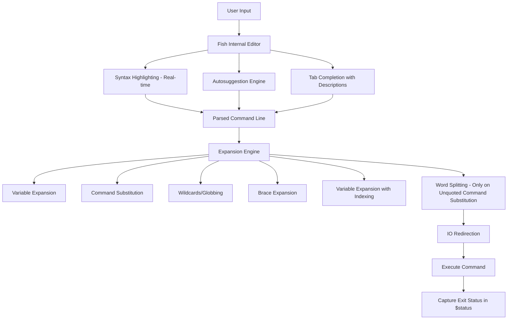
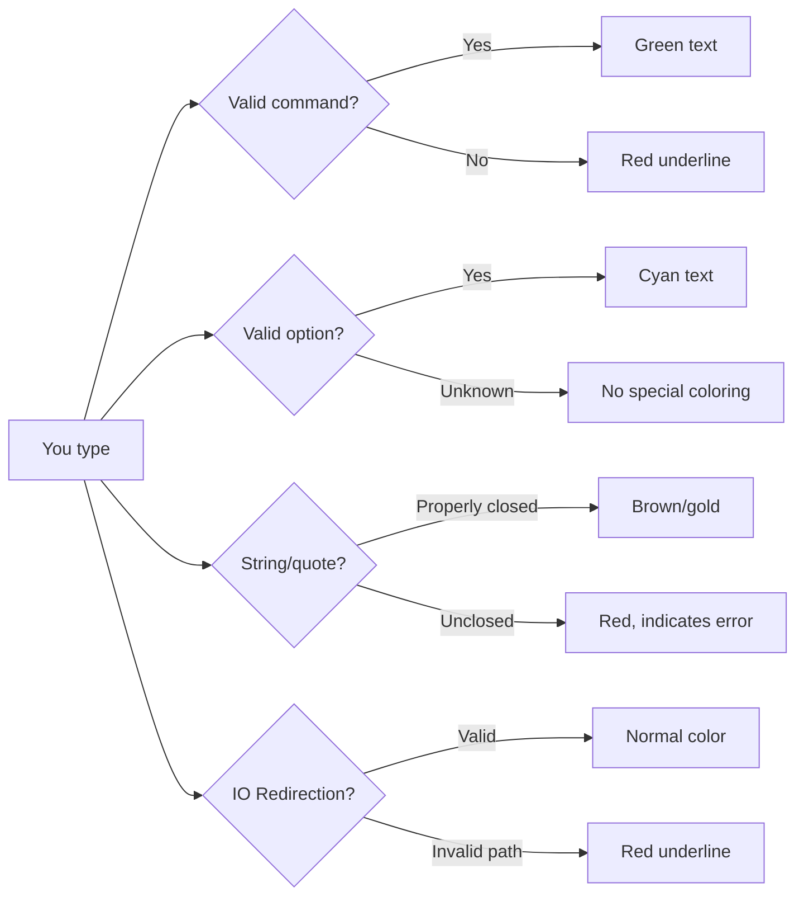

# Chapter 27: Fish — The Friendly Interactive Shell

## Overview

Fish (Friendly Interactive SHell) is a smart and user-friendly command-line shell designed to be discoverable, readable, and modern. Created by Axel Liljencrantz in 2005, Fish takes a radically different approach to shell design: rather than following POSIX conventions and adding features on top, Fish prioritizes usability out of the box. It includes syntax highlighting, autosuggestions, tab completions with descriptions, and a web-based configuration interface — all without any plugins or framework installations.

Fish is not POSIX-compatible, which is a deliberate design choice. This allows Fish to implement cleaner syntax, eliminate common shell pitfalls, and provide a better interactive experience at the cost of script portability. For interactive use, Fish is arguably the most productive shell available; for scripting, POSIX sh or Bash remains the standard.

## Intuition

If Bash is a text editor with keybindings you must memorize, Fish is an IDE with tooltips and autocomplete. It highlights errors before you press Enter, suggests commands based on your history as you type, and provides rich tab completions with descriptions pulled from man pages. The philosophy is that a shell should help you, not make you remember arcane syntax.

Fish's design principles:
- **Discoverable**: Features should be obvious, not buried in documentation
- **User-friendly**: Sensible defaults, not opt-in improvements
- **Readability**: Clean syntax that reads like English where possible
- **No configuration needed**: Works great out of the box

## Architecture



### Fish vs Bash/Zsh Architecture

| Feature | Fish | Bash | Zsh |
|---------|------|------|-----|
| **POSIX compatible** | No | Yes | Mostly |
| **Syntax highlighting** | Built-in | Plugin | Plugin |
| **Autosuggestions** | Built-in | Plugin | Plugin |
| **Completion with descriptions** | Built-in | Limited | Built-in |
| **Web configuration** | Built-in | No | No |
| **Configuration language** | Fish script | Bash script | Zsh script |
| **Startup files** | `config.fish` | `.bashrc`, etc. | `.zshrc`, etc. |
| **Variable types** | Universal, global, local, export | Global, local, export | Global, local, export |
| **Function files** | `~/.config/fish/functions/` | Inline or sourced | Inline or autoloaded |

## Installation

```bash
# Ubuntu/Debian
sudo apt install fish

# Fedora
sudo dnf install fish

# Arch Linux
sudo pacman -S fish

# openSUSE
sudo zypper install fish

# macOS
brew install fish

# From source
git clone https://github.com/fish-shell/fish-shell.git
cd fish-shell
cmake .
make
sudo make install

# Set as default shell (after installation)
chsh -s /usr/bin/fish
```

## Syntax Highlighting

Fish highlights commands as you type, not after execution. This is one of its most distinguishing features.

### How It Works



### Highlighting Rules

| Element | Color | Description |
|---------|-------|-------------|
| Valid commands | Green | Commands found in PATH or builtins |
| Invalid commands | Red underline | Not found in PATH |
| Options (flags) | Cyan | Command options like `--help` |
| Strings | Brown/gold | Quoted strings |
| Escapes | Green | Backslash-escaped characters |
| Errors | Red | Syntax errors, unclosed quotes |
| Comments | Gray | `# comments` |
| End statements | Blue | `end`, `else`, `case` |
| Operators | Purple | `;`, `&&`, `||`, `\|` |
| File paths | Underline | Valid file/directory paths |

### Custom Highlighting

```fish
# ~/.config/fish/config.fish

# Set custom colors (though defaults are usually excellent)
set -g fish_color_command green --bold
set -g fish_color_error red --underline
set -g fish_color_param cyan
set -g fish_color_comment brblack
set -g fish_color_quote brown
set -g fish_color_escape green
set -g fish_color_operator purple
set -g fish_color_end blue
set -g fish_color_redirection yellow
set -g fish_color_autosuggestion brblack
set -g fish_color_search_match --background=yellow
set -g fish_color_valid_path --underline
```

## Autosuggestions

Fish shows autosuggestions as gray text to the right of your cursor. These suggestions come from:
1. **Command history** — Previously executed commands
2. **Completions** — Known valid completions for the current command

### Using Autosuggestions

```
$ git com                          # You type this
$ git commit -m "initial commit"   # Gray text appears (suggestion)
# Press → (right arrow) to accept the suggestion
# Press Ctrl+F or End to accept one word at a time
# Press Alt+F to accept one word
```

### Configuration

```fish
# Set suggestion color
set -g fish_color_autosuggestion brblack

# Disable autosuggestions for specific commands
function disable_suggestions --on-event fish_command_not_found
    # Custom handling
end

# Custom history-based suggestion
set -g fish_autosuggestion_enabled 1
```

## Autosuggestion Strategies

Fish uses multiple strategies to generate suggestions:

```fish
# Default strategy: history first, then completions
# You can customize the strategy order:

# Only use history
set -g fish_autosuggestion_enabled 1

# Suggestion bindings
# → or End: Accept entire suggestion
# Alt+F or Ctrl+→: Accept one word
# Ctrl+F: Accept one character
# Alt+e: Accept and execute suggestion
```

## Tab Completion with Descriptions

Fish's tab completion is unique: it shows descriptions alongside completion candidates, pulled from man pages and documentation.

### Example

```
$ git <Tab>
add        -- Add file contents to the staging area
bisect     -- Use binary search to find the commit that introduced a bug
branch     -- List, create, or delete branches
checkout   -- Switch branches or restore working tree files
clone      -- Clone a repository into a new directory
commit     -- Record changes to the repository
diff       -- Show changes between commits, commit and working tree, etc
fetch      -- Download objects and references from another repository
grep       -- Print lines matching a pattern
init       -- Create an empty Git repository or reinitialize one
log        -- Show commit logs
merge      -- Join two or more development histories together
mv         -- Move or rename a file, a directory, or a symlink
pull       -- Fetch from and integrate with another repository or a local branch
push       -- Update remote refs along with associated objects
rebase     -- Reapply commits on top of another base tip
reset      -- Reset current HEAD to the specified state
rm         -- Remove files from the working tree and from the stash
show       -- Show various types of objects
status     -- Show the working tree status
tag        -- Create, list, delete or verify a tag object signed with GPG
```

### Writing Custom Completions

Fish completions are defined in `~/.config/fish/completions/` or programmatically:

```fish
# ~/.config/fish/completions/mycommand.fish

# Simple completion
complete -c mycommand -a "start stop restart status" -d "Service commands"

# File completions
complete -c mycommand -f                  # Disable file completion
complete -c mycommand -F                  # Enable file completion (default)

# Option completions
complete -c mycommand -s h -l help -d "Show help"
complete -c mycommand -s v -l verbose -d "Enable verbose output"
complete -c mycommand -s o -l output -d "Output file" -r  # Requires argument
complete -c mycommand -l format -d "Output format" -xa "json yaml csv"  # Exclusive arguments

# Condition-based completions
complete -c mycommand -n "__fish_use_subcommand" -a start -d "Start service"
complete -c mycommand -n "__fish_use_subcommand" -a stop -d "Stop service"
complete -c mycommand -n "__fish_seen_subcommand_from start" -l port -d "Port number"

# Using completion condition functions
complete -c mycommand -n "__fish_seen_subcommand_from deploy" -l env -xa "dev staging prod"
```

### Built-in Completion Functions

Fish ships completions for hundreds of commands. These are stored in `/usr/share/fish/completions/` and are auto-generated from man pages:

```fish
# Manually trigger completion generation for a command
fish_update_completions

# This parses man pages and creates completion files
# Run this after installing new tools
```

## Variables and Scoping

Fish has a unique variable scoping system with four levels:

```fish
# Universal variables (persist across sessions and restarts)
set -U myvar "universal value"

# Global variables (current session)
set -g myvar "global value"

# Local variables (current scope/block)
function myfunc
    set -l myvar "local value"
    echo $myvar
end

# Exported variables (available to child processes)
set -x EDITOR vim
# or
set -gx EDITOR vim

# Variable operations
set -e myvar              # Erase a variable
set --show myvar          # Show variable info (scope, value)
set -q myvar              # Check if variable exists (exit status)
```

### Variable Types and Lists

```fish
# Fish variables are always lists (arrays)
set colors red green blue

echo $colors              # red green blue
echo $colors[1]           # red
echo $colors[2..3]        # green blue
echo $colors[-1]          # blue (last element)
echo (count $colors)      # 3

# Append to a variable
set -a colors yellow      # Append
set -p colors black       # Prepend

# Special variables
echo $PATH                # PATH is a list
echo $fish_pid            # Current fish PID
echo $hostname            # Machine hostname
echo $HOME                # Home directory
echo $PWD                 # Current directory
echo $status              # Last command exit status
echo $version             # Fish version
echo $fish_color_command  # Command color setting
```

## Syntax Differences from Bash

Fish's syntax is deliberately different from POSIX shells. This eliminates many common shell pitfalls.

### Variable Assignment

```fish
# Fish: no = sign, no spaces issue
set name "John Doe"
set count 42

# Bash (for comparison)
# name="John Doe"
```

### Conditionals

```fish
# Fish: uses "if", "else if", "else", "end" (not fi)
if test -f /etc/passwd
    echo "File exists"
else if test -d /etc
    echo "Directory exists"
else
    echo "Neither"
end

# Alternative syntax with []
if [ -f /etc/passwd ]
    echo "File exists"
end

# String comparison
if test "$name" = "John"
    echo "Hello John"
end

# Numeric comparison
if test $count -gt 10
    echo "Count is greater than 10"
end

# Combine conditions
if test -f file1; and test -f file2
    echo "Both files exist"
end

if test -f file1; or test -f file2
    echo "At least one file exists"
end

if not test -f missing
    echo "File does not exist"
end
```

### Loops

```fish
# For loop
for i in (seq 1 10)
    echo $i
end

# Iterate over files
for file in *.txt
    echo "Processing $file"
end

# While loop
while true
    echo "Looping..."
    sleep 1
end

# While read
cat file.txt | while read -l line
    echo "Line: $line"
end

# Or read from file directly
while read -l line
    echo "Line: $line"
end < file.txt
```

### Functions

```fish
# Fish function (no function keyword needed for simple cases)
function greet
    echo "Hello, $argv[1]!"
end

# With description
function greet -d "Greet someone by name"
    echo "Hello, $argv[1]!"
end

# With arguments
function add -d "Add two numbers"
    math $argv[1] + $argv[2]
end

# Event handlers
function on_pwd_change --on-variable PWD
    echo "Directory changed to $PWD"
end

function on_exit --on-process-exit %self
    echo "Fish is exiting"
end

# Universal event
function on_universal --on-variable MY_UNIVERSAL_VAR
    echo "Universal variable changed to $MY_UNIVERSAL_VAR"
end
```

### Command Substitution

```fish
# Fish uses (command) instead of $(command)
set files (ls)
echo "Current date: (date)"
set line_count (wc -l < file.txt)

# No backticks in Fish
```

### Pipes and Redirection

```fish
# Pipes work the same
ls | grep ".txt" | sort

# Output redirection
echo "hello" > file.txt         # Redirect stdout
echo "hello" >> file.txt        # Append stdout
echo "error" ^ error.log        # Redirect stderr (Fish uses ^ not 2>)
echo "error" ^&1 error.log     # Redirect stderr to stdout

# Input redirection
sort < file.txt

# Redirect both stdout and stderr
command > all.log 2>&1          # Bash style (also works in Fish)
command &> all.log              # Bash shorthand
command > all.log ^&1           # Fish style
```

### Arithmetic

```fish
# Fish uses the math command
set result (math "2 + 3")
set result (math "10 * 5")
set result (math "2 ^ 10")

# Or in command substitution
echo (math "sqrt(144)")

# Increment
set count (math "$count + 1")

# Floating point
set pi (math "4 * a(1)")       # 3.14159...
```

### String Operations

```fish
# String manipulation with the string command
set str "Hello, World!"

string length $str              # 13
string sub -s 1 -l 5 $str      # Hello
string upper $str               # HELLO, WORLD!
string lower $str               # hello, world!
string trim $str                # Hello, World! (no leading/trailing spaces)
string replace "World" "Fish" $str  # Hello, Fish!
string match "*.txt" file.txt   # file.txt (pattern matching)
string match -r "(\d+)" "abc123def"  # 123 (regex)
string split "," "a,b,c"       # a b c (list)
string join ":" $PATH           # /usr/bin:/usr/local/bin:...
string collect $lines           # Join list into single string with newlines
```

## Web-Based Configuration

Fish includes a built-in web configuration interface:

```fish
# Launch the web config
fish_config

# This opens a browser where you can:
# - Choose and preview themes
# - View and edit functions
# - View and edit completions
# - View and edit variables
# - View command history
# - View color schemes

# Theme preview
fish_config theme choose "Dracula"
fish_config theme choose "Solarized Light"
fish_config theme save
```

## Oh My Fish (OMF)

Oh My Fish is a package manager for Fish, similar to Oh My Zsh:

```bash
# Install Oh My Fish
curl https://raw.githubusercontent.com/oh-my-fish/oh-my-fish/master/bin/install | fish

# Install packages
omf install bass          # Source Bash scripts in Fish
omf install foreign-env   # Run Bash commands and capture environment
omf install z             # Directory jumping
omf install bang-bang     # !! support
omf install fzf           # Fuzzy finder integration

# Install themes
omf install bobthefish
omf install agnoster
omf install spacefish

# List installed
omf list

# Remove packages
omf remove <package>
```

### Fisher (Alternative Package Manager)

```fish
# Install Fisher
curl -sL https://raw.githubusercontent.com/jorgebucaran/fisher/main/functions/fisher.fish | source && fisher install jorgebucaran/fisher

# Install plugins
fisher install jethrokuan/z           # z directory jumping
fisher install PatrickF1/fzf.fish     # fzf integration
fisher install franciscolourenco/done  # Notification when long commands finish
fisher install ilancosman/tide         # Modern prompt (like powerlevel10k)

# List installed
fisher list

# Update all
fisher update

# Remove
fisher remove <plugin>
```

## Common Pitfalls

### 1. Syntax Incompatibility

```fish
# ❌ Bash syntax in Fish
for i in {1..10}; do echo $i; done    # Invalid in Fish

# ✅ Fish syntax
for i in (seq 1 10); echo $i; end

# ❌ Bash variable assignment
name="John"    # Error in Fish

# ✅ Fish
set name "John"

# ❌ Bash command substitution
echo $(date)   # Error in Fish

# ✅ Fish
echo (date)

# ❌ Bash redirect stderr
command 2> error.log

# ✅ Fish
command ^ error.log
```

### 2. Sourcing Bash Scripts

```fish
# ❌ You cannot directly source .bashrc or bash scripts in Fish

# ✅ Use bass or foreign-env for environment variables
omf install bass
bass source ~/.bashrc

# Or use foreign-env
omf install foreign-env
fenv source ~/.bash_profile
```

### 3. PATH Manipulation

```fish
# ❌ Bash-style PATH addition
export PATH="$PATH:/new/path"    # Invalid in Fish

# ✅ Fish PATH manipulation
set -gx PATH $PATH /new/path

# Or use fish_add_path (preferred, idempotent)
fish_add_path /new/path
fish_add_path -g /global/path     # Global
fish_add_path -m /new/path        # Prepend instead of append
```

### 4. Quoting Differences

```fish
# Single quotes and double quotes work similarly to Bash
echo 'No $variable expansion'
echo "Variable: $variable"

# But Fish has no $"..." ANSI-C quoting
# And no $'...' syntax

# Escape sequences in double quotes
echo "Line1\nLine2"              # \n is literal in Fish
echo -e "Line1\nLine2"           # Use -e for escape interpretation
```

### 5. Exit Status

```fish
# Fish uses $status (not $?)
false
echo $status    # 1

# To use exit status in conditions
if command -q git
    echo "git is installed"
end

# test returns status directly
if test -f /etc/passwd
    echo "exists"
end
```

## Best Practices

1. **Use Fish for interactive work, Bash for scripts** — Fish's interactivity features are unmatched, but Bash scripts are more portable
2. **Learn the `string` command** — it replaces most external commands for string manipulation
3. **Use `fish_add_path`** — it's idempotent and handles duplicates
4. **Use universal variables** for settings that persist across sessions (`set -U`)
5. **Store functions in `~/.config/fish/functions/`** — Fish autoloads them
6. **Use `abbr` for common abbreviations** — they expand when typed, unlike aliases
7. **Run `fish_update_completions`** after installing new tools
8. **Use `funced` and `funcsave`** for quick function editing
9. **Use the web config** (`fish_config`) for theme exploration
10. **Use Fisher over Oh My Fish** — it's simpler and more actively maintained

### Abbreviations vs Aliases

```fish
# Aliases are syntactic sugar for functions
alias ll 'ls -la'
# Creates a function called ll

# Abbreviations expand inline (you see what's happening)
abbr -a ll ls -la
# When you type "ll " it expands to "ls -la " in the command line

# Abbreviations are preferred because:
# 1. You see the expanded command (transparency)
# 2. History shows the expanded command (clarity)
# 3. They can include pipes and redirections
abbr -a gc "git commit -m"
abbr -a gp "git push origin (git branch --show-current)"
```

## Exercises

### Exercise 1: Fish Installation and Configuration
Install Fish, configure it as your default shell, set up a color theme using `fish_config`, and create 5 useful abbreviations for your most common commands.

### Exercise 2: Custom Function
Write a Fish function called `mkcd` that creates a directory and immediately changes into it. Add appropriate error handling and a description.

### Exercise 3: Completion File
Write a completion file for a custom `deploy` command with subcommands `build`, `test`, `deploy`, and `rollback`. The `deploy` subcommand should accept `--env` with values `dev`, `staging`, `prod` and `--tag` with any string.

### Exercise 4: String Processing Pipeline
Using only Fish builtins and the `string` command, write a function that takes a filename and outputs:
- The filename without path
- The extension
- The filename without extension
- Whether it's a source file (`.c`, `.py`, `.rs`, `.go`)

### Exercise 5: Event-Based Function
Write a Fish function that automatically logs the current directory, timestamp, and command to a log file every time a command is executed (using the `fish_postexec` event).

## References

- [Fish Shell Documentation](https://fishshell.com/docs/current/)
- [Fish Shell Tutorial](https://fishshell.com/docs/current/tutorial.html)
- [Fish Shell FAQ](https://fishshell.com/docs/current/faq.html)
- [Oh My Fish](https://github.com/oh-my-fish/oh-my-fish)
- [Fisher Package Manager](https://github.com/jorgebucaran/fisher)
- [Fish Shell Cookbook](https://fishshell.com/docs/current/cmds/)
- [Awesome Fish](https://github.com/fisherman/awesome-fish)
- [Tide Prompt](https://github.com/IlanCosman/tide)
- [Bass - Source Bash in Fish](https://github.com/edc/bass)
