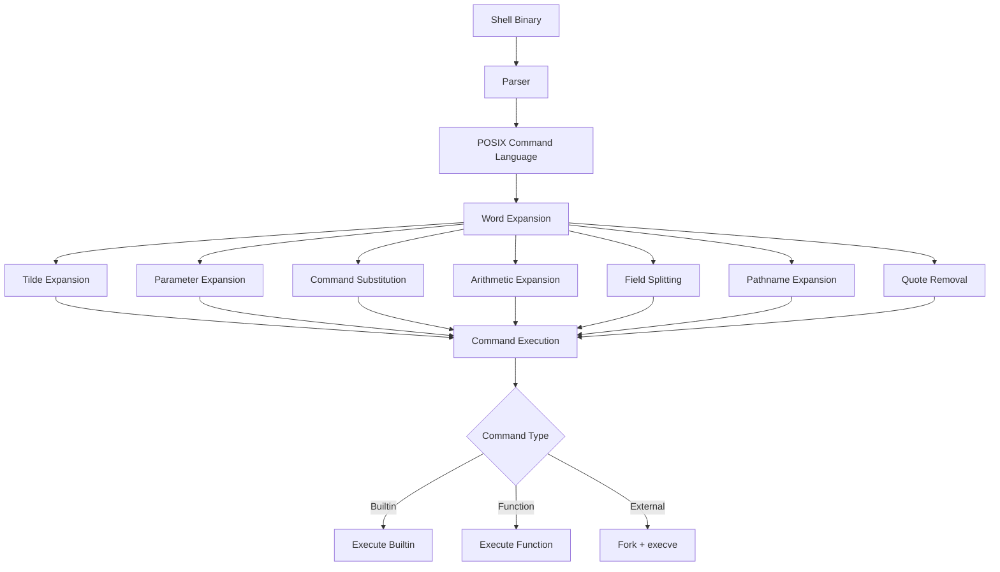
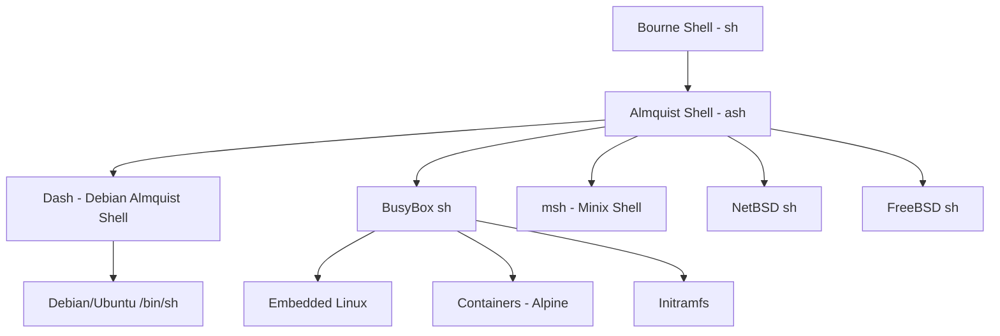

# Chapter 28: Dash, Ash, and BusyBox Shells

## Overview

Not every Linux environment has the luxury of a full-featured shell like Bash or Zsh. Embedded systems, containers, initramfs images, and minimal installations often rely on stripped-down POSIX shells that prioritize small size and fast execution over interactive features. The three most important minimal shells are:

- **Dash** (Debian Almquist Shell): The default `/bin/sh` on Debian and Ubuntu, optimized for fast script execution
- **Ash** (Almquist Shell): The original lightweight POSIX shell, ancestor of Dash and BusyBox sh
- **BusyBox sh**: The shell embedded in BusyBox, ubiquitous on embedded Linux, routers, and containers

Understanding these shells is critical for writing portable scripts, debugging boot issues, working with embedded systems, and understanding why `/bin/sh` behaves differently across distributions.

## Intuition

Think of these shells as the economy cars of the shell world. They get you from point A to point B (execute commands, run scripts) but lack the luxury features (arrays, `[[ ]]`, string manipulation, fancy prompts). This is by design: in a container that runs a single script, or on an embedded device with 4MB of flash, every kilobyte matters.

The key insight is that `/bin/sh` on many systems is NOT Bash. If you write a script with `#!/bin/sh` and use Bash-specific features, it will fail on Debian/Ubuntu (where `/bin/sh` is Dash), in Docker containers (often Alpine with BusyBox), and on embedded systems. This is one of the most common sources of shell script bugs.

## Architecture



### Shell Comparison Matrix

| Feature | Bash | Dash | Ash | BusyBox sh | POSIX sh |
|---------|------|------|-----|------------|----------|
| **Size** | ~1MB | ~120KB | ~100KB | ~30KB (part of BB) | Varies |
| **Arrays** | ✅ | ❌ | ❌ | ❌ | ❌ |
| `[[ ]]` | ✅ | ❌ | ❌ | ❌ | ❌ |
| `function` keyword | ✅ | ❌ | ❌ | ❌ | ❌ |
| `$RANDOM` | ✅ | ❌ | ❌ | ❌ | ❌ |
| `$LINENO` | ✅ | ✅ | ✅ | ✅ | ✅ |
| `local` keyword | ✅ | ✅ | ✅ | ✅ | ❌ (not POSIX) |
| `echo -e` | ✅ | ⚠️ | ⚠️ | ⚠️ | ❌ |
| `printf` | ✅ | ✅ | ✅ | ✅ | ✅ |
| Here-strings `<<<` | ✅ | ❌ | ❌ | ❌ | ❌ |
| Process substitution | ✅ | ❌ | ❌ | ❌ | ❌ |
| Arithmetic `$(( ))` | ✅ | ✅ | ✅ | ✅ | ✅ |
| `select` | ✅ | ❌ | ❌ | ❌ | ❌ |
| `read -p` | ✅ | ❌ | ❌ | ❌ | ❌ |
| `source` | ✅ | ✅ | ✅ | ✅ | `.` only |
| Line editing | ✅ | ❌ | ❌ | ❌ | N/A |
| Job control | ✅ | ✅ | ⚠️ | ❌ | ✅ |
| Tab completion | ✅ | ❌ | ❌ | ❌ | N/A |
| Startup speed | ~15ms | ~2ms | ~2ms | ~1ms | Varies |

## Dash

### History and Design

Dash was created by Herbert Xu in 1997 as a POSIX-compliant replacement for Ash on Debian systems. The name stands for **Debian Almquist Shell**. It became the default `/bin/sh` on Ubuntu in 2006 (Dapper Drake release) and on Debian in 2011 (Squeeze release).

The motivation was speed: boot scripts and package maintainer scripts run thousands of shell invocations, and each millisecond saved by using Dash instead of Bash adds up significantly during system startup.

### Performance

```bash
# Benchmark: running a simple script 1000 times
time for i in $(seq 1 1000); do /bin/dash -c 'echo hello' > /dev/null; done
# Typically: ~2 seconds

time for i in $(seq 1 1000); do /bin/bash -c 'echo hello' > /dev/null; done
# Typically: ~5-8 seconds

# Dash is 3-5x faster for script startup
```

The speed advantage comes from:
1. Smaller binary size (less to load)
2. Simpler parser (fewer features to check)
3. No interactive features overhead (line editing, completion)
4. Optimized for script execution, not interactive use

### Key Differences from Bash

```bash
# ❌ Arrays (not available in Dash)
arr=(one two three)
echo "${arr[1]}"

# ✅ Dash alternative using positional parameters
set -- one two three
echo "$2"

# ❌ [[ ]] double brackets
[[ -f "$file" && $var == "pattern" ]]

# ✅ Use [ ] with separate tests
[ -f "$file" ] && [ "$var" = "pattern" ]

# ❌ String manipulation
echo "${var^^}"           # Uppercase
echo "${var,,}"           # Lowercase
echo "${var:0:5}"         # Substring
echo "${var/pattern/rep}" # Replace

# ✅ Use external tools
echo "$var" | tr '[:lower:]' '[:upper:]'
echo "$var" | cut -c1-5
echo "$var" | sed 's/pattern/rep/'

# ❌ Here-strings
grep "pattern" <<< "$string"

# ✅ Use echo with pipe
echo "$string" | grep "pattern"

# ❌ Process substitution
diff <(sort file1) <(sort file2)

# ✅ Use temporary files
sort file1 > /tmp/f1.$$
sort file2 > /tmp/f2.$$
diff /tmp/f1.$$ /tmp/f2.$$
rm -f /tmp/f1.$$ /tmp/f2.$$

# ❌ $RANDOM
echo "$RANDOM"

# ✅ Use /dev/urandom
od -An -tu2 -N2 /dev/urandom | tr -d ' '

# ❌ read -p (prompt)
read -p "Enter name: " name

# ✅ Use printf + read
printf "Enter name: "
read name

# ❌ echo -e (behavior varies)
echo -e "line1\nline2"

# ✅ Use printf (portable)
printf "line1\nline2\n"

# ❌ ${var//pattern/replace} (global replace)
echo "${var//foo/bar}"

# ✅ Use sed
echo "$var" | sed 's/foo/bar/g'

# ❌ Arithmetic with let
let "x = y + 1"

# ✅ Use $(( ))
x=$((y + 1))

# ❌ &> redirect both
command &> file

# ✅ Use > file 2>&1
command > file 2>&1
```

### Dash-Specific Features

While Dash aims for POSIX compliance, it does have some extensions:

```bash
# local keyword (not POSIX, but supported by Dash)
myfunc() {
    local var="value"
    echo "$var"
}

# echo -e (supported in Dash, but behavior varies)
# Use printf for portability

# $LINENO (supported)
echo "Line: $LINENO"

# Arithmetic for loops (Dash extension, not POSIX)
# ❌ Not available in Dash
# for ((i=0; i<10; i++)); do ...

# ✅ Use while loop
i=0
while [ $i -lt 10 ]; do
    echo $i
    i=$((i + 1))
done
```

### Checking Your System's /bin/sh

```bash
# See what /bin/sh points to
ls -la /bin/sh
# lrwxrwxrwx 1 root root 4 Jan  1 00:00 /bin/sh -> dash

# Or
readlink -f /bin/sh
# /bin/dash

# On Debian/Ubuntu, switch between dash and bash as /bin/sh
sudo dpkg-reconfigure dash
# Select "No" to use bash as /bin/sh
# Select "Yes" to use dash as /bin/sh

# Test a script under dash explicitly
dash script.sh
```

## Ash

### History

Ash (Almquist Shell) was written by Kenneth Almquist in 1989 as a free replacement for the Bourne Shell. It was originally part of the BSD distributions and later became the basis for several other shells:



### Ash Features

Ash is a minimal POSIX shell with these characteristics:

```bash
# POSIX parameter expansion
${var:-default}    # ✅
${var:=default}    # ✅
${var:+alternate}  # ✅
${var:?error}      # ✅
${#var}            # ✅
${var%pattern}     # ✅
${var%%pattern}    # ✅
${var#pattern}     # ✅
${var##pattern}    # ✅

# POSIX command substitution
$(command)         # ✅
`command`          # ✅

# POSIX arithmetic
$((expression))    # ✅

# Job control (in interactive mode)
jobs, fg, bg       # ✅

# Builtins
echo, printf, test, [, eval, exec, set, unset
export, readonly, local (non-POSIX but supported)
cd, pwd, read, shift, trap, wait, kill
```

### Ash Limitations

```bash
# ❌ No arrays
# ❌ No [[ ]]
# ❌ No function keyword
# ❌ No select
# ❌ No $RANDOM
# ❌ No here-strings
# ❌ No process substitution
# ❌ No ${var/pattern/replace}
# ❌ No ${var:offset:length}
# ❌ No declare/typeset
# ❌ No readarray/mapfile
# ❌ No coproc
# ❌ No &> redirection
# ❌ No |& pipe stderr
```

## BusyBox sh

### BusyBox Overview

BusyBox combines tiny versions of many common UNIX utilities into a single small executable. It provides replacements for about 300 commands, including a shell (`ash`-based), in typically 1-2MB total. It's the backbone of embedded Linux, containers (Alpine Linux), rescue systems, and initramfs images.

```bash
# BusyBox applets (commands it provides)
busybox --list | head -20
# [
# [[
# acpid
# add-shell
# addgroup
# adduser
# adjtimex
# arch
# arp
# arping
# ash
# awk
# ...

# BusyBox shell is ash-based
busybox sh
# This is an ash-compatible shell
```

### BusyBox sh Specifics

```bash
#!/bin/sh
# BusyBox ash script

# Builtins available in BusyBox sh
echo "Hello"           # ✅ (but behavior may differ from Bash)
printf "%s\n" "Hello"  # ✅ (recommended over echo)
read var               # ✅
read -p "Input: " var  # ✅ (BusyBox supports -p)
test -f file           # ✅
[ -f file ]            # ✅
local var="value"      # ✅ (non-POSIX but supported)

# BusyBox-specific features
source file.sh         # ✅ (BusyBox supports source)
. file.sh              # ✅ (POSIX)

# Math
echo $((2 + 3))        # ✅

# Case conversion with BusyBox ash (varies by build)
# Some builds support ${var,,} but don't rely on it

# BusyBox-specific builtins
mknod                  # Create device nodes
mount                  # Mount filesystems
umount                 # Unmount
insmod                 # Insert kernel modules
rmmod                  # Remove kernel modules
modprobe               # Module loading
depmod                 # Module dependencies
switch_root            # Switch root filesystem (init)
poweroff               # Power off
reboot                 # Reboot
halt                   # Halt system
```

### Alpine Linux and BusyBox

Alpine Linux uses BusyBox for most of its userland, including the default shell:

```bash
# Alpine Docker image
docker run -it alpine sh

# Inside Alpine
ls -la /bin/sh
# lrwxrwxrwx    1 root     root           12 Jan  1 00:00 /bin/sh -> /bin/busybox

# Check BusyBox version
busybox
# BusyBox v1.36.1 (2023-05-xx) multi-call binary.

# Install bash if needed
apk add bash
bash
```

### Common BusyBox Quirks

```bash
# 1. echo behavior varies by build
echo -e "hello\n"
# Some BusyBox builds: hello\n (literal)
# Others: hello (interpreted)
# Always use printf for portability
printf "hello\n"

# 2. No local arrays (no arrays at all)
# Workaround: use positional parameters or temp files

# 3. test/[ behavior may differ
# Some builds support [[, others don't
# Always use [ for portability

# 4. mktemp may not be available
# Use: tempfile=/tmp/myapp.$$

# 5. Some common commands may be missing or limited
# grep -P (Perl regex) - usually not available
# sed -i (in-place) - usually available but behavior varies
# awk - may be mawk, gawk, or busybox awk

# 6. date command differences
date +%s              # Unix timestamp (usually works)
date -d "2024-01-01"  # May not work (BusyBox date is limited)
```

## Writing Portable Shell Scripts

### The Shebang Matters

```bash
#!/bin/sh
# This MUST be POSIX-compatible
# It will be run by dash on Debian/Ubuntu, busybox sh on Alpine
# DO NOT use bashisms

#!/bin/bash
# This requires bash specifically
# Use bash features freely
# Ensure bash is installed (not guaranteed on minimal systems)

#!/usr/bin/env bash
# More portable bash invocation
# Searches PATH for bash
```

### Portable Script Template

```bash
#!/bin/sh
#
# portable_script.sh - POSIX-compatible script template
#
# This script is guaranteed to work with dash, ash, busybox sh,
# and any POSIX-compliant shell.

# Strict error handling (POSIX-compatible)
set -eu

# Portable error reporting
error() {
    printf "%s: error: %s\n" "$(basename "$0")" "$1" >&2
    exit 1
}

# Portable warning
warn() {
    printf "%s: warning: %s\n" "$(basename "$0")" "$1" >&2
}

# Portable info
info() {
    printf "%s: %s\n" "$(basename "$0")" "$1"
}

# Check for required commands
require_cmd() {
    command -v "$1" >/dev/null 2>&1 || error "Required command not found: $1"
}

require_cmd "grep"
require_cmd "sed"
require_cmd "awk"

# Portable string operations
# Trim whitespace
trim() {
    var="$1"
    # Remove leading whitespace
    var="${var#"${var%%[![:space:]]*}"}"
    # Remove trailing whitespace
    var="${var%"${var##*[![:space:]]}"}"
    printf "%s" "$var"
}

# Convert to lowercase (POSIX)
to_lower() {
    echo "$1" | tr '[:upper:]' '[:lower:]'
}

# Convert to uppercase (POSIX)
to_upper() {
    echo "$1" | tr '[:lower:]' '[:upper:]'
}

# Portable read with prompt
prompt() {
    printf "%s" "$1" >&2
    read -r REPLY
    printf "%s" "$REPLY"
}

# Check if command exists (POSIX)
has_cmd() {
    command -v "$1" >/dev/null 2>&1
}

# Safe temporary file
make_temp() {
    tmpdir="${TMPDIR:-/tmp}"
    tmpfile="$tmpdir/tmp.$$.${1:-tmp}"
    # Create securely (if mktemp available)
    if has_cmd mktemp; then
        tmpfile=$(mktemp "$tmpdir/tmp.XXXXXXXXXX")
    else
        : > "$tmpfile"
    fi
    printf "%s" "$tmpfile"
}

# Cleanup trap
cleanup() {
    rm -f "$tmpfile" 2>/dev/null
}
trap cleanup EXIT INT TERM

# Main
main() {
    info "Starting..."
    # Your code here
    info "Done."
}

main "$@"
```

### Detecting Your Shell

```bash
# Script to detect which shell is running
detect_shell() {
    if [ -n "${BASH_VERSION:-}" ]; then
        echo "Bash $BASH_VERSION"
    elif [ -n "${ZSH_VERSION:-}" ]; then
        echo "Zsh $ZSH_VERSION"
    elif [ -n "${FISH_VERSION:-}" ]; then
        echo "Fish $FISH_VERSION"
    elif [ -n "${KSH_VERSION:-}" ]; then
        echo "Ksh"
    elif [ -n "${.sh.version}" ] 2>/dev/null; then
        echo "Ksh93"
    else
        # Check the binary
        shell=$(readlink -f /proc/$$/exe 2>/dev/null || echo "unknown")
        echo "Shell: $shell"
    fi
}

# Check for specific features
has_arrays() {
    # Try to use an array
    eval 'a=(test)' 2>/dev/null && return 0 || return 1
}

has_double_bracket() {
    eval '[[ 1 = 1 ]]' 2>/dev/null && return 0 || return 1
}

has_local() {
    eval 'f() { local x=1; }' 2>/dev/null && return 0 || return 1
}
```

## Use Cases

### Embedded Systems

```bash
#!/bin/sh
# Embedded system init script
# Runs under BusyBox ash

PATH=/sbin:/bin:/usr/sbin:/usr/bin

start() {
    printf "Starting services...\n"
    
    # Mount essential filesystems
    mount -t proc proc /proc
    mount -t sysfs sysfs /sys
    mount -t devtmpfs devtmpfs /dev
    
    # Configure network
    ifconfig eth0 192.168.1.100 netmask 255.255.255.0 up
    route add default gw 192.168.1.1
    
    # Start daemons
    syslogd
    klogd
    httpd -h /www
    
    printf "System ready.\n"
}

stop() {
    printf "Stopping services...\n"
    killall httpd
    killall klogd
    killall syslogd
    sync
    printf "System halted.\n"
}

case "$1" in
    start)   start ;;
    stop)    stop ;;
    restart) stop; start ;;
    *)       printf "Usage: %s {start|stop|restart}\n" "$0" ;;
esac
```

### Docker/Container Scripts

```bash
#!/bin/sh
# Docker entrypoint script (Alpine Linux)
# Must work with BusyBox ash

set -eu

# Environment with defaults
APP_PORT="${PORT:-8080}"
APP_HOST="${HOST:-0.0.0.0}"
LOG_LEVEL="${LOG_LEVEL:-info}"

# Wait for dependent service
wait_for() {
    host="$1"
    port="$2"
    timeout="${3:-30}"
    
    printf "Waiting for %s:%s (timeout: %ds)... " "$host" "$port" "$timeout"
    
    i=0
    while [ $i -lt "$timeout" ]; do
        if nc -z "$host" "$port" 2>/dev/null; then
            printf "ready!\n"
            return 0
        fi
        sleep 1
        i=$((i + 1))
    done
    
    printf "timeout!\n"
    return 1
}

# Database migration
run_migrations() {
    if [ -d "/app/migrations" ]; then
        printf "Running migrations...\n"
        for f in /app/migrations/*.sql; do
            [ -f "$f" ] || continue
            printf "  Applying: %s\n" "$(basename "$f")"
            psql -h "$DB_HOST" -U "$DB_USER" -d "$DB_NAME" -f "$f"
        done
    fi
}

# Main
main() {
    printf "Starting application on %s:%s\n" "$APP_HOST" "$APP_PORT"
    
    # Wait for database
    wait_for "${DB_HOST:-localhost}" "${DB_PORT:-5432}" 60
    
    # Run migrations
    run_migrations
    
    # Start application
    exec "$@"
}

# If first argument is a flag, run main with default command
if [ "${1#-}" != "$1" ]; then
    main /app/server --host "$APP_HOST" --port "$APP_PORT"
else
    main "$@"
fi
```

### Initramfs Scripts

```bash
#!/bin/sh
# initramfs hook script
# Runs under the most minimal shell possible

PATH=/sbin:/bin:/usr/sbin:/usr/bin

# Mount essentials
mount -t proc proc /proc
mount -t sysfs sysfs /sys
mount -t devtmpfs devtmpfs /dev

# Load essential modules
for mod in ext4 dm_mod; do
    modprobe "$mod" 2>/dev/null || true
done

# Find root device
rootdev=""
for arg in $(cat /proc/cmdline); do
    case "$arg" in
        root=*) rootdev="${arg#root=}" ;;
    esac
done

if [ -z "$rootdev" ]; then
    echo "No root device specified!"
    /bin/sh
    exit 1
fi

# Mount root
mkdir -p /newroot
mount "$rootdev" /newroot

# Switch to real root
exec switch_root /newroot /sbin/init
```

## Testing for Portability

```bash
# Test a script with dash
dash -n script.sh          # Syntax check
dash script.sh             # Execute

# Test with busybox sh
busybox sh -n script.sh    # Syntax check
busybox sh script.sh       # Execute

# checkbashisms tool (from devscripts)
sudo apt install devscripts
checkbashisms script.sh

# Automated testing with multiple shells
for shell in dash ash bash sh; do
    printf "Testing with %s... " "$shell"
    if "$shell" -n script.sh 2>/dev/null; then
        printf "OK\n"
    else
        printf "FAIL\n"
    fi
done
```

## Common Pitfalls

### 1. Assuming /bin/sh Is Bash

```bash
#!/bin/sh
# ❌ This might fail on Debian/Ubuntu
arr=(1 2 3)
echo "${arr[@]}"

# ✅ Use #!/bin/bash if you need bash features
#!/bin/bash
arr=(1 2 3)
echo "${arr[@]}"
```

### 2. Using echo for Portability

```bash
# ❌ echo behavior varies
echo -e "hello\n"
echo -n "no newline"

# ✅ Always use printf
printf "hello\n"
printf "no newline"
```

### 3. Assuming Common Tools Exist

```bash
# ❌ Not all tools exist on minimal systems
which git
mktemp

# ✅ Check first
command -v git >/dev/null 2>&1 || { echo "git not found"; exit 1; }
```

### 4. Using String Manipulation

```bash
# ❌ Bash-specific
echo "${var^^}"
echo "${var,,}"
echo "${var:0:5}"
echo "${var//old/new}"

# ✅ POSIX portable
echo "$var" | tr '[:lower:]' '[:upper:]'
echo "$var" | tr '[:upper:]' '[:lower:]'
echo "$var" | cut -c1-5
echo "$var" | sed 's/old/new/g'
```

## Best Practices

1. **Use `#!/bin/sh` only for POSIX scripts** — test with `dash` to verify
2. **Use `#!/bin/bash` when you need Bash features** — be explicit
3. **Use `printf` instead of `echo`** — portable across all shells
4. **Use `[ ]` instead of `[[ ]]`** in POSIX scripts
5. **Use `$(( ))` for arithmetic** — it's POSIX and works everywhere
6. **Avoid arrays in portable scripts** — use positional parameters
7. **Use `command -v` instead of `which`** — POSIX standard
8. **Quote everything** — even more important in minimal shells
9. **Test with `dash` and `busybox sh`** — catch portability issues early
10. **Use `checkbashisms`** — automated detection of non-POSIX constructs

## Exercises

### Exercise 1: Porting Script
Convert this Bash script to run under Dash/Ash:

```bash
#!/bin/bash
declare -A counts
for f in *.txt; do
    [[ -f "$f" ]] || continue
    lines=$(wc -l < "$f")
    counts["$f"]=$lines
    echo "$f: $lines lines"
done
echo "Total files: ${#counts[@]}"
```

### Exercise 2: BusyBox Container Script
Write an entrypoint script for an Alpine Linux container that:
- Waits for a MySQL database to be ready
- Runs SQL migration files from `/migrations/`
- Starts the application
- Handles graceful shutdown on SIGTERM

### Exercise 3: Shell Detection
Write a POSIX-compatible function that detects which shell is running and outputs its name and version, working correctly under Bash, Dash, Ash, BusyBox sh, and Zsh.

### Exercise 4: Portable Utility Functions
Write a POSIX-compatible library of portable utility functions:
- `trim()` — Remove leading/trailing whitespace
- `to_lower()` / `to_upper()` — Case conversion
- `contains()` — Check if string contains substring
- `replace()` — Replace first occurrence of pattern
- `join()` — Join array elements with delimiter

### Exercise 5: Initramfs Script
Write a minimal initramfs init script under 50 lines that:
- Mounts `/proc`, `/sys`, `/dev`
- Parses the kernel command line for `root=`
- Mounts the root filesystem
- Handles errors by dropping to a shell
- Uses `switch_root` to hand off to the real init

## References

- [Dash Shell](https://gondor.apana.org.au/~herbert/dash/)
- [Almquist Shell (Wikipedia)](https://en.wikipedia.org/wiki/Almquist_shell)
- [BusyBox Documentation](https://busybox.net/downloads/BusyBox.html)
- [POSIX Shell Command Language](https://pubs.opengroup.org/onlinepubs/9699919799/utilities/V3_chap02.html)
- [Alpine Linux](https://alpinelinux.org/)
- [checkbashisms](https://manpages.ubuntu.com/manpages/man1/checkbashisms.1.html)
- [Dash as /bin/sh (Ubuntu Wiki)](https://wiki.ubuntu.com/DashAsBinSh)
- [BusyBox Ash](https://busybox.net/downloads/BusyBox.html#ash)
- [ShellCheck](https://www.shellcheck.net/)
- [Bash vs Dash Comparison](https://wiki.archlinux.org/title/Dash)
