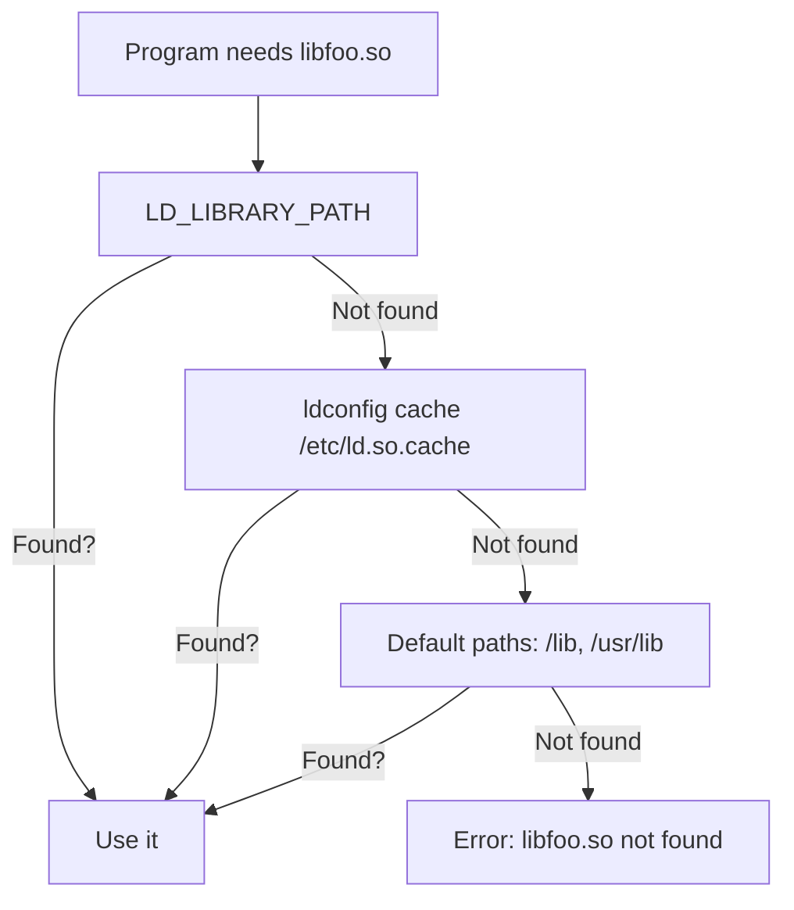
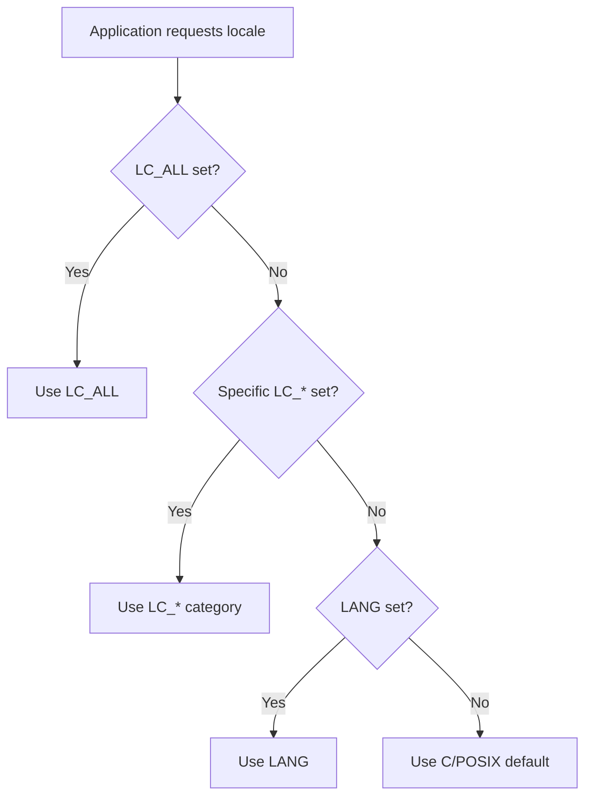

# Chapter 29: Environment Variables — export, env, printenv, PATH, LD_LIBRARY_PATH, locale

## Overview

Environment variables are the nervous system of a Linux session. They carry information from the shell to every child process, defining where to find programs, how to format dates and currency, which language to display messages in, and how shared libraries are located. Understanding environment variables is fundamental to configuring your system, debugging software, and writing robust scripts.

Every process on Linux inherits a copy of its parent's environment. This inheritance chain starts from the `init` process (PID 1) and flows through login shells, terminal emulators, and every command you run. The environment is a key-value store that bridges the gap between shell configuration and application behavior.

## Intuition

Think of environment variables as a company's internal memos. When you `export` a variable, you're posting a memo that every department (child process) can read. Variables without `export` are like notes on your personal desk — visible only to you (the current shell), not to anyone else.

The `PATH` variable is like the company directory: it tells the system where to look for programs. `LD_LIBRARY_PATH` is like the supplier list: it tells the linker where to find shared libraries. `locale` settings are like the company's language policy: they determine how dates, numbers, and messages are formatted.

## Architecture

```mermaid
graph TD
    A[Kernel Boot] --> B[init / systemd]
    B --> C[Login Process]
    C --> D[/etc/profile]
    C --> E[/etc/profile.d/*.sh]
    C --> F[~/.bash_profile or ~/.profile]
    F --> G[Bash Login Shell]
    G --> H[~/.bashrc]
    G --> I[Terminal Emulator]
    I --> J[Non-Login Shell]
    J --> H
    G --> K[Child Process]
    H --> K
    K --> K1[Inherits Environment]
    K1 --> K2[Can modify own environment]
    K2 --> K3[Changes lost when child exits]
```

### Environment vs Shell Variables

| Aspect | Shell Variable | Environment Variable |
|--------|---------------|---------------------|
| **Scope** | Current shell only | Current shell + all child processes |
| **Creation** | `VAR=value` | `export VAR=value` |
| **Visibility** | Not visible to child processes | Visible to child processes |
| **Inheritance** | Not inherited | Inherited (copied) by children |
| **Listed by** | `set` (includes both) | `env` or `printenv` |
| **Persistence** | Lost when shell exits | Lost when shell exits |

## Setting and Exporting Variables

### Basic Operations

```bash
# Set a shell variable (not exported)
name="Linux"

# Export it (now visible to child processes)
export name

# Set and export in one step
export name="Linux"

# Export multiple variables
export EDITOR=vim PAGER=less TERM=xterm-256color

# Declare with attributes
declare -x name="Linux"        # Same as export
declare -r CONST="immutable"   # Read-only
declare -i number=42           # Integer
declare -a arr=(1 2 3)         # Array
declare -A map=([key]=val)     # Associative array

# Unexport (remove from environment, keep as shell variable)
export -n name

# Unset entirely
unset name
```

### The export Command

```bash
# export makes a variable available to child processes
# Without export, the variable exists only in the current shell

# Demonstration:
MY_VAR="only in parent"
export EXPORTED_VAR="visible to children"

# Run a child process
bash -c 'echo "MY_VAR=$MY_VAR"'
# Output: MY_VAR=           (empty — not exported)

bash -c 'echo "EXPORTED_VAR=$EXPORTED_VAR"'
# Output: EXPORTED_VAR=visible to children

# export -p shows all exported variables with 'declare -x'
export -p
# declare -x HOME="/home/user"
# declare -x PATH="/usr/bin:/bin"
# declare -x EXPORTED_VAR="visible to children"
```

## PATH

`PATH` is the most important environment variable. It defines where the system searches for executable programs.

### Structure

```bash
echo "$PATH"
# /usr/local/bin:/usr/bin:/bin:/usr/local/games:/usr/games

# Directories are separated by colons
# Order matters: first match wins
```

### Modifying PATH

```bash
# Add to the end
export PATH="$PATH:/new/path"

# Add to the beginning (takes priority)
export PATH="/new/path:$PATH"

# Remove a path (using parameter replacement)
export PATH="${PATH/\/usr\/local\/games/}"

# Clean duplicate entries
clean_path() {
    export PATH=$(echo "$PATH" | tr ':' '\n' | awk '!seen[$0]++' | tr '\n' ':')
    export PATH="${PATH%:}"  # Remove trailing colon
}

# Check what a command resolves to
which python3
# /usr/bin/python3

type -a python3
# python3 is /usr/bin/python3
# python3 is /usr/local/bin/python3  (shows all matches)

command -v python3
# /usr/bin/python3
```

### PATH Best Practices

```bash
# ❌ Don't add . (current directory) to PATH
export PATH=".:$PATH"    # Security risk!

# ❌ Don't add directories with world-writable permissions
ls -ld /some/path        # Check permissions first

# ✅ Add user-specific paths in ~/.profile or ~/.bashrc
export PATH="$HOME/bin:$HOME/.local/bin:$PATH"

# ✅ System-wide paths go in /etc/environment or /etc/profile.d/
# /etc/environment:
# PATH="/usr/local/bin:/usr/bin:/bin:/usr/local/games:/usr/games"

# /etc/profile.d/custom.sh:
# export PATH="/opt/myapp/bin:$PATH"
```

### System PATH Configuration Files

| File | Purpose | Scope |
|------|---------|-------|
| `/etc/environment` | System-wide environment variables | All users, all sessions |
| `/etc/profile` | System-wide login shell config | All users, login shells |
| `/etc/profile.d/*.sh` | Modular system-wide config | All users, login shells |
| `/etc/bash.bashrc` | System-wide Bash config | All users, interactive Bash |
| `~/.profile` | User login shell config | Current user, login shells |
| `~/.bash_profile` | User Bash login config | Current user, Bash login |
| `~/.bashrc` | User Bash interactive config | Current user, interactive Bash |
| `~/.pam_environment` | PAM environment config | Current user, all sessions |

## LD_LIBRARY_PATH

`LD_LIBRARY_PATH` tells the dynamic linker where to find shared libraries (`.so` files) before checking the default paths.

### How the Linker Finds Libraries



### Usage

```bash
# Set library path for a single command
LD_LIBRARY_PATH=/opt/mylib/lib ./myprogram

# Set for the session
export LD_LIBRARY_PATH="/opt/mylib/lib:$LD_LIBRARY_PATH"

# Multiple paths
export LD_LIBRARY_PATH="/opt/lib1/lib:/opt/lib2/lib:$LD_LIBRARY_PATH"

# Check what libraries a program needs
ldd /usr/bin/python3
# linux-vdso.so.1 (0x00007ffd...)
# libpython3.11.so.1.0 => /usr/lib/libpython3.11.so.1.0 (0x00007f...)
# libc.so.6 => /lib/x86_64-linux-gnu/libc.so.6 (0x00007f...)
# /lib64/ld-linux-x86-64.so.2 (0x00007f...)

# Check if a specific library can be found
ldconfig -p | grep libfoo

# Verify library path resolution
LD_LIBRARY_PATH=/opt/lib ldd ./myprogram
```

### LD_LIBRARY_PATH Alternatives

```bash
# ❌ LD_LIBRARY_PATH is a runtime hack — avoid for production

# ✅ Option 1: RPATH (embedded in the binary)
# Compiled with: -Wl,-rpath,/opt/mylib/lib
# Or: patchelf --set-rpath /opt/mylib/lib ./myprogram

# ✅ Option 2: ldconfig (system-wide)
echo "/opt/mylib/lib" | sudo tee /etc/ld.so.conf.d/mylib.conf
sudo ldconfig

# ✅ Option 3: ld.so.preload
echo "/opt/mylib/lib/libfoo.so" | sudo tee /etc/ld.so.preload

# Check the search order
LD_DEBUG=libs ./myprogram 2>&1 | head -20
```

### LD_LIBRARY_PATH Pitfalls

```bash
# ❌ Don't set it globally in .bashrc
export LD_LIBRARY_PATH="/opt/lib"  # Can break system programs

# ❌ Don't use it for system libraries
# It overrides the system library versions, potentially breaking things

# ❌ Don't use it for setuid programs
# The dynamic linker ignores LD_LIBRARY_PATH for setuid/setgid programs

# ✅ Use it only for development/testing
# ✅ Prefer RPATH or ldconfig for production
# ✅ Use per-command: LD_LIBRARY_PATH=/opt/lib ./myprogram
```

## locale

The `locale` system controls language, territory, character encoding, and cultural conventions for formatting dates, numbers, currency, and messages.

### Locale Categories

| Category | Purpose | Example |
|----------|---------|---------|
| `LANG` | Default for all categories | `en_US.UTF-8` |
| `LC_CTYPE` | Character classification | `en_US.UTF-8` |
| `LC_NUMERIC` | Number formatting | `en_US.UTF-8` |
| `LC_TIME` | Date/time formatting | `en_US.UTF-8` |
| `LC_COLLATE` | Sort order | `en_US.UTF-8` |
| `LC_MONETARY` | Currency formatting | `en_US.UTF-8` |
| `LC_MESSAGES` | Message language | `en_US.UTF-8` |
| `LC_PAPER` | Paper size | `en_US.UTF-8` |
| `LC_NAME` | Name formatting | `en_US.UTF-8` |
| `LC_ADDRESS` | Address formatting | `en_US.UTF-8` |
| `LC_TELEPHONE` | Phone formatting | `en_US.UTF-8` |
| `LC_MEASUREMENT` | Measurement units | `en_US.UTF-8` |
| `LC_IDENTIFICATION` | Locale metadata | `en_US.UTF-8` |
| `LC_ALL` | Override everything | `en_US.UTF-8` |

### Locale Resolution Order



### Using Locale

```bash
# Show current locale settings
locale
# LANG=en_US.UTF-8
# LC_CTYPE="en_US.UTF-8"
# LC_NUMERIC="en_US.UTF-8"
# LC_TIME="en_US.UTF-8"
# LC_COLLATE="en_US.UTF-8"
# LC_MONETARY="en_US.UTF-8"
# LC_MESSAGES="en_US.UTF-8"
# LC_PAPER="en_US.UTF-8"
# LC_NAME="en_US.UTF-8"
# LC_ADDRESS="en_US.UTF-8"
# LC_TELEPHONE="en_US.UTF-8"
# LC_MEASUREMENT="en_US.UTF-8"
# LC_IDENTIFICATION="en_US.UTF-8"
# LC_ALL=

# Show available locales
locale -a

# Show locale definition
locale -ck LC_TIME
# LC_TIME
# abday="Sun;Mon;Tue;Wed;Thu;Fri;Sat"
# day="Sunday;Monday;Tuesday;Wednesday;Thursday;Friday;Saturday"
# abmon="Jan;Feb;Mar;Apr;May;Jun;Jul;Aug;Sep;Oct;Nov;Dec"
# ...

# Set locale for a session
export LANG=en_US.UTF-8

# Set specific category
export LC_TIME=de_DE.UTF-8    # German date format
export LC_MONETARY=ja_JP.UTF-8  # Japanese currency

# Override everything (usually for scripts)
export LC_ALL=C    # Classic POSIX behavior, fastest

# Generate missing locale
sudo locale-gen en_US.UTF-8
sudo dpkg-reconfigure locales    # Debian/Ubuntu

# Install locale on minimal systems
sudo apt install locales
sudo sed -i 's/# en_US.UTF-8/en_US.UTF-8/' /etc/locale.gen
sudo locale-gen
```

### Locale Effects

```bash
# Date formatting
LANG=en_US.UTF-8 date
# Mon Jun 29 13:24:00 UTC 2026

LANG=de_DE.UTF-8 date
# Mo 29. Jun 13:24:00 UTC 2026

LANG=ja_JP.UTF-8 date
# 2026年  6月 29日 月曜日 13:24:00 UTC

# Number formatting
LANG=en_US.UTF-8 printf "%'d\n" 1234567
# 1,234,567

LANG=de_DE.UTF-8 printf "%'d\n" 1234567
# 1.234.567

# Sort order
export LC_COLLATE=en_US.UTF-8
echo -e "apple\nApple\nbanana" | sort
# Apple
# apple
# banana

export LC_COLLATE=C
echo -e "apple\nApple\nbanana" | sort
# Apple
# apple
# banana  (but uppercase comes first in C locale)
```

### Common Locale Issues

```bash
# ❌ "perl: warning: Setting locale failed"
# Fix: install and generate the locale
sudo apt install locales
sudo locale-gen en_US.UTF-8
sudo update-locale LANG=en_US.UTF-8

# ❌ "LC_ALL: cannot change locale"
# Fix: the locale isn't generated
locale -a | grep en_US    # Check if it exists
sudo locale-gen en_US.UTF-8

# ❌ SSH locale forwarding issues
# In /etc/ssh/sshd_config:
# AcceptEnv LANG LC_*

# In /etc/ssh/ssh_config:
# SendEnv LANG LC_*

# ❌ Docker container missing locale
# In Dockerfile:
# RUN apt-get install -y locales && locale-gen en_US.UTF-8
# ENV LANG en_US.UTF-8
```

## Other Important Environment Variables

### System Variables

```bash
# Home directory
echo "$HOME"        # /home/user

# Current user
echo "$USER"        # user
echo "$LOGNAME"     # user (sometimes different)

# Current shell
echo "$SHELL"       # /bin/bash (login shell)
echo "$0"           # bash (current shell name)

# Terminal
echo "$TERM"        # xterm-256color
echo "$COLUMNS"     # Terminal width
echo "$LINES"       # Terminal height

# Process info
echo "$$"           # Current shell PID
echo "$PPID"        # Parent PID
echo "$BASHPID"     # Current Bash PID (differs in subshells)

# Working directory
echo "$PWD"         # Current directory
echo "$OLDPWD"      # Previous directory
```

### Development Variables

```bash
# Compiler flags
export CC=gcc
export CXX=g++
export CFLAGS="-O2 -Wall"
export CXXFLAGS="-O2 -Wall"
export LDFLAGS="-L/usr/local/lib"
export CPPFLAGS="-I/usr/local/include"

# pkg-config
export PKG_CONFIG_PATH="/usr/local/lib/pkgconfig:$PKG_CONFIG_PATH"

# Python
export PYTHONPATH="/my/modules:$PYTHONPATH"
export PYTHONSTARTUP="$HOME/.pythonrc"
export PIP_INDEX_URL="https://pypi.org/simple"
export VIRTUAL_ENV="$HOME/envs/myproject"

# Node.js
export NODE_PATH="/usr/local/lib/node_modules"
export NVM_DIR="$HOME/.nvm"

# Go
export GOPATH="$HOME/go"
export GOBIN="$GOPATH/bin"
export PATH="$GOBIN:$PATH"

# Rust
export CARGO_HOME="$HOME/.cargo"
export RUSTUP_HOME="$HOME/.rustup"
export PATH="$CARGO_HOME/bin:$PATH"

# Java
export JAVA_HOME="/usr/lib/jvm/java-17-openjdk"
export PATH="$JAVA_HOME/bin:$PATH"
```

### Proxy Variables

```bash
# HTTP/HTTPS proxy
export http_proxy="http://proxy.example.com:8080"
export https_proxy="http://proxy.example.com:8080"
export HTTP_PROXY="$http_proxy"      # Some programs use uppercase
export HTTPS_PROXY="$https_proxy"

# No proxy (hosts that bypass the proxy)
export no_proxy="localhost,127.0.0.1,*.internal.example.com"
export NO_PROXY="$no_proxy"

# FTP proxy
export ftp_proxy="http://proxy.example.com:8080"

# SOCKS proxy
export ALL_PROXY="socks5://proxy.example.com:1080"

# For apt
# /etc/apt/apt.conf.d/proxy.conf:
# Acquire::http::Proxy "http://proxy.example.com:8080";
# Acquire::https::Proxy "http://proxy.example.com:8080";
```

### Security-Related Variables

```bash
# GPG
export GNUPGHOME="$HOME/.gnupg"

# SSH
export SSH_AUTH_SOCK="$XDG_RUNTIME_DIR/ssh-agent.socket"
export SSH_AGENT_PID="..."

# XDG Base Directory
export XDG_CONFIG_HOME="$HOME/.config"
export XDG_DATA_HOME="$HOME/.local/share"
export XDG_CACHE_HOME="$HOME/.cache"
export XDG_RUNTIME_DIR="/run/user/$(id -u)"
export XDG_STATE_HOME="$HOME/.local/state"
```

## env and printenv

### env Command

```bash
# Show all environment variables
env

# Run a command with modified environment
env EDITOR=vim git commit

# Clear environment and run command
env -i HOME="$HOME" PATH="$PATH" bash -c 'env'
# Only HOME and PATH are set

# Ignore environment and run command
env -u EDITOR bash -c 'echo $EDITOR'
# (empty)

# Set variables and run
env LC_ALL=C sort file.txt

# Split string (useful in scripts)
env -0 | sort -z | tr '\0' '\n'
```

### printenv Command

```bash
# Show all environment variables
printenv

# Show specific variable
printenv PATH
printenv HOME

# Multiple variables
printenv PATH HOME USER

# With null delimiters (for safe parsing)
printenv -0 | sort -z
```

### set Command

```bash
# Show all variables (environment + shell + functions)
set

# Show only shell variables (not functions)
set | grep -v '^\w* ()'

# Set shell options
set -e          # Exit on error
set -u          # Error on unset variables
set -o pipefail # Pipeline failure propagation

# Show current options
set -o
# allexport       off
# braceexpand     on
# emacs           on
# errexit         off
# errtrace        off
# functrace       off
# hashall         on
# histexpand      on
# history         on
# ignoreeof       off
# interactive-comments    on
# keyword         off
# monitor         on
# noclobber       off
# noexec          off
# noglob          off
# nolog           off
# notify          off
# nounset         off
# onecmd          off
# physical        off
# pipefail        off
# posix           off
# privileged      off
# verbose         off
# vi              off
# xtrace          off
```

## Persistent Environment Variables

### System-Wide Configuration

```bash
# /etc/environment — Simple KEY=value format (no export, no shell syntax)
# Parsed by PAM, available to all sessions
PATH="/usr/local/bin:/usr/bin:/bin"
EDITOR="vim"
LANG="en_US.UTF-8"

# /etc/profile — Shell script, runs for login shells
# Good for: PATH additions, exports, shell settings
if [ -d /etc/profile.d ]; then
    for i in /etc/profile.d/*.sh; do
        if [ -r "$i" ]; then
            . "$i"
        fi
    done
fi

# /etc/profile.d/custom.sh — Modular additions
export PATH="/opt/myapp/bin:$PATH"
export MYAPP_CONFIG="/etc/myapp/config"

# /etc/bash.bashrc — System-wide Bash interactive config
# Good for: aliases, prompts, shell options
```

### User Configuration

```bash
# ~/.profile — User login shell config
# Read by sh, bash (if no .bash_profile), and other shells
export PATH="$HOME/bin:$HOME/.local/bin:$PATH"
export EDITOR="vim"
export LANG="en_US.UTF-8"

# ~/.bash_profile — User Bash login config
# If this exists, .profile is NOT read by Bash
# Common pattern: source .profile from here
if [ -f "$HOME/.profile" ]; then
    . "$HOME/.profile"
fi

# ~/.bashrc — User Bash interactive config
# Read for every interactive Bash shell
# Good for: aliases, functions, prompt, shell options
alias ll='ls -la'
export HISTSIZE=10000

# ~/.bash_logout — Runs on logout
# Good for: cleanup, clearing screen
clear
```

### Configuration File Loading Order

```mermaid
graph TD
    A[User logs in] --> B{Login shell?}
    B -->|Yes, Bash| C[/etc/profile]
    C --> D[/etc/profile.d/*.sh]
    D --> E{~/.bash_profile exists?}
    E -->|Yes| F[~/.bash_profile]
    E -->|No| G{~/.bash_login exists?}
    G -->|Yes| H[~/.bash_login]
    G -->|No| I[~/.profile]
    F --> J[Interactive shell started]
    H --> J
    I --> J
    B -->|No, interactive| J
    J --> K[~/.bashrc]
    B -->|Non-interactive| L[Check BASH_ENV]
```

## Common Pitfalls

### 1. Variable Not Available in Child

```bash
# ❌ Forgot to export
DB_HOST="localhost"
bash -c 'echo $DB_HOST'   # Empty!

# ✅ Export it
export DB_HOST="localhost"
bash -c 'echo $DB_HOST'   # localhost
```

### 2. PATH Pollution

```bash
# ❌ Adding to PATH in every script
echo 'export PATH="/opt/tool/bin:$PATH"' >> ~/.bashrc
echo 'export PATH="/opt/tool/bin:$PATH"' >> ~/.profile
echo 'export PATH="/opt/tool/bin:$PATH"' >> ~/.bash_profile
# Results in duplicates over time

# ✅ Add once in the right place
# For user: ~/.profile (login shell)
# For system: /etc/profile.d/tool.sh

# ✅ Use a helper function
add_to_path() {
    case ":$PATH:" in
        *":$1:"*) ;;  # Already present
        *) export PATH="$1:$PATH" ;;
    esac
}
add_to_path "/opt/tool/bin"
```

### 3. LD_LIBRARY_PATH Breaking System

```bash
# ❌ Setting globally
export LD_LIBRARY_PATH="/opt/oldlib/lib"
# Can cause system programs to use wrong library versions

# ✅ Set per-command
LD_LIBRARY_PATH=/opt/oldlib/lib ./myprogram
```

### 4. Locale Issues in Scripts

```bash
# ❌ Script depends on locale
ls | sort    # Sort order depends on LC_COLLATE
cut -f1      # Field separator depends on locale

# ✅ Force C locale in scripts
export LC_ALL=C
# Or per-command:
LC_ALL=C ls | LC_ALL=C sort
```

## Best Practices

1. **Export only what needs to be exported** — keep internal variables as shell variables
2. **Don't put `.` in PATH** — security risk
3. **Use `/etc/profile.d/` for system-wide additions** — modular and maintainable
4. **Use `~/.profile` for user PATH** — works across shells
5. **Avoid `LD_LIBRARY_PATH` in production** — use RPATH or ldconfig instead
6. **Set `LC_ALL=C` in scripts** — consistent behavior, faster execution
7. **Quote all variable references** — `"$VAR"` not `$VAR`
8. **Use XDG directories** — follow the XDG Base Directory Specification
9. **Don't store secrets in environment variables** — use files with proper permissions
10. **Document your environment** — keep comments explaining why variables are set

## Exercises

### Exercise 1: PATH Investigation
Write a script that:
- Lists all directories in PATH
- Checks if each directory exists
- Reports directories that don't exist
- Checks for duplicate entries
- Reports any world-writable directories

### Exercise 2: Environment Audit
Write a function that audits the current environment:
- Lists all exported variables with descriptions
- Identifies proxy variables
- Identifies development-related variables
- Reports any suspicious or unusual variables

### Exercise 3: Locale Playground
Write a script that demonstrates the same date and number formatting across 5 different locales, showing how LC_TIME and LC_NUMERIC affect output.

### Exercise 4: Portable PATH Manager
Write a POSIX-compatible library function that:
- Adds a directory to PATH (no duplicates)
- Removes a directory from PATH
- Lists PATH entries
- Validates that all PATH directories exist

### Exercise 5: Container Environment
Write a Docker entrypoint script that:
- Validates required environment variables are set
- Provides defaults for optional variables
- Exports computed variables
- Handles proxy configuration if present

## References

- [GNU Bash Manual: Shell Variables](https://www.gnu.org/software/bash/manual/bash.html#Shell-Variables)
- [GNU Bash Manual: Bourne Shell Variables](https://www.gnu.org/software/bash/manual/bash.html#Bourne-Shell-Variables)
- [Linux man pages: environ(7)](https://man7.org/linux/man-pages/man7/environ.7.html)
- [Linux man pages: locale(7)](https://man7.org/linux/man-pages/man7/locale.7.html)
- [Linux man pages: ld.so(8)](https://man7.org/linux/man-pages/man8/ld.so.8.html)
- [XDG Base Directory Specification](https://specifications.freedesktop.org/basedir-spec/latest/)
- [POSIX Environment Variables](https://pubs.opengroup.org/onlinepubs/9699919799/basedefs/V1_chap08.html)
- [Arch Wiki: Environment Variables](https://wiki.archlinux.org/title/Environment_variables)
