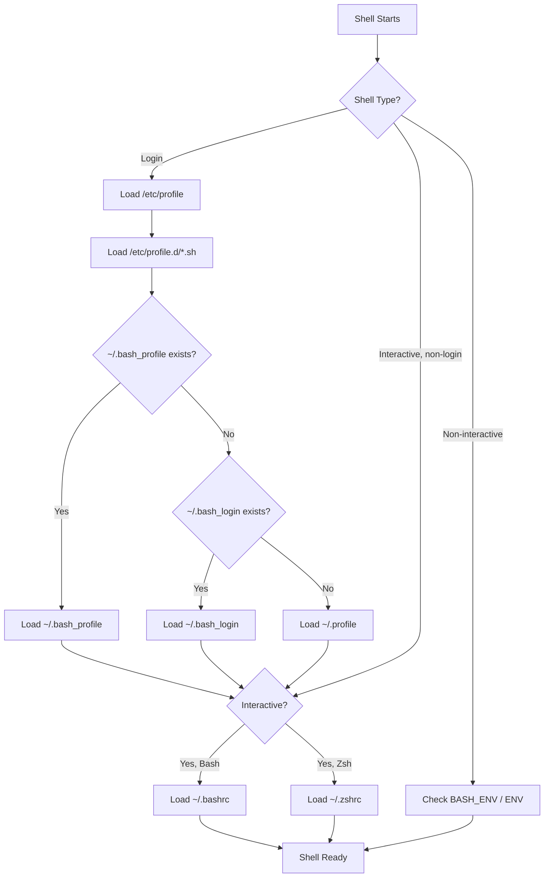
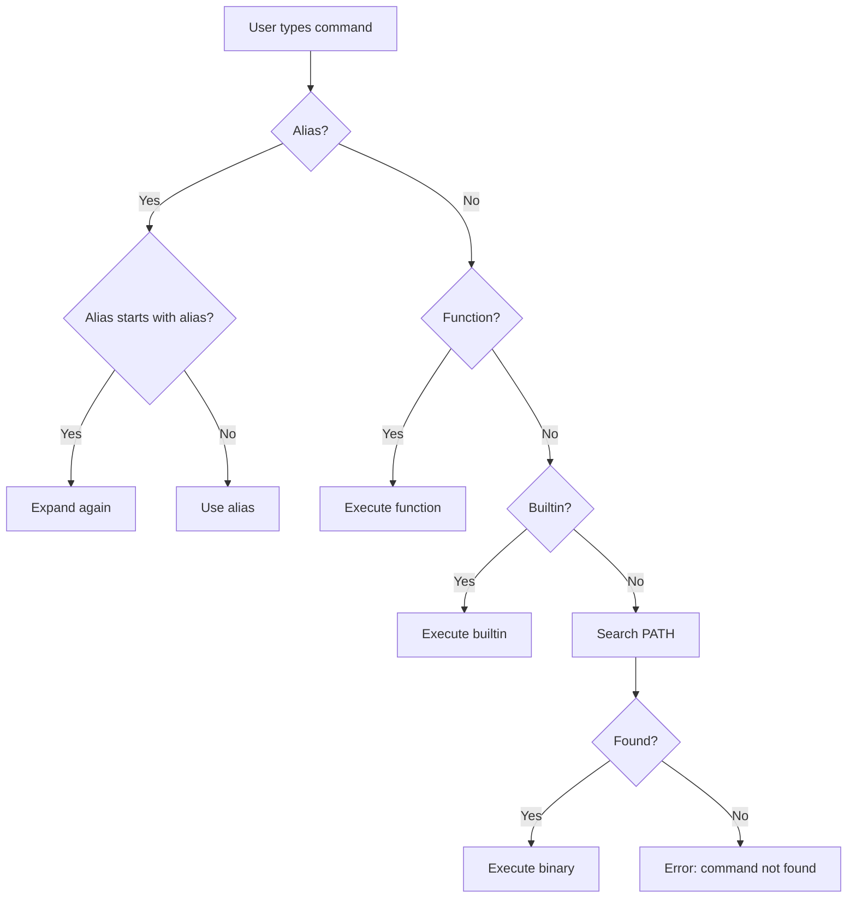

# Chapter 30: Aliases, Functions, and Startup Files — .bashrc, .profile, .bash_profile, .zshrc

## Overview

Aliases, functions, and startup files form the personalization layer of your shell environment. Aliases provide shorthand for frequently used commands, functions enable complex multi-step operations, and startup files ensure your customizations persist across sessions. Together, they transform a generic shell into a personalized productivity tool.

Understanding how these pieces interact — and how startup files load in different shell invocation scenarios — is essential for maintaining a clean, predictable shell configuration.

## Intuition

Aliases are like speed-dial numbers on your phone: one short name replaces a longer command. Functions are like custom apps: they can accept arguments, contain logic, and produce complex behavior. Startup files are like your phone's settings profile: they configure everything to your preferences every time you turn it on.

The challenge is organization. As your configuration grows, startup files can become tangled messes where changes in one file break behavior in another. Understanding the loading order and separation of concerns prevents this.

## Architecture



## Aliases

### Basic Syntax

```bash
# Simple alias
alias ll='ls -la'
alias la='ls -A'
alias l='ls -CF'

# Alias with pipes and redirections
alias today='date +%Y-%m-%d'
alias week='date +%Y-W%V'
alias ports='ss -tulnp'
alias meminfo='free -h'
alias cpuinfo='lscpu'

# Alias for safety
alias rm='rm -i'
alias cp='cp -i'
alias mv='mv -i'
alias ln='ln -i'

# Alias for common operations
alias ..='cd ..'
alias ...='cd ../..'
alias ....='cd ../../..'
alias ~='cd ~'
alias -- -='cd -'

# Alias with sudo
alias please='sudo'
alias apt-upgrade='sudo apt update && sudo apt upgrade'

# Git aliases
alias g='git'
alias gs='git status'
alias ga='git add'
alias gc='git commit'
alias gp='git push'
alias gl='git log --oneline --graph'
alias gd='git diff'
alias gco='git checkout'
alias gb='git branch'

# Docker aliases
alias d='docker'
alias dc='docker compose'
alias dps='docker ps'
alias dpsa='docker ps -a'
alias di='docker images'
alias dex='docker exec -it'

# K8s aliases
alias k='kubectl'
alias kgp='kubectl get pods'
alias kgs='kubectl get svc'
alias kgn='kubectl get nodes'
alias kgd='kubectl get deployments'
alias kaf='kubectl apply -f'
alias kdel='kubectl delete'
```

### Alias vs Command Resolution



### Alias Expansion Rules

```bash
# Alias expansion happens BEFORE the command is parsed
alias ls='ls --color=auto'
# Typing "ls" becomes "ls --color=auto"

# Aliases are NOT expanded in non-interactive shells by default
# (scripts don't use aliases unless you enable them)
shopt -s expand_aliases  # Enable in scripts (Bash)

# Aliases are expanded in the FIRST word of a simple command
# And after the first word if it's an alias itself (chaining)

# ❌ This doesn't work as expected
alias sudo='sudo '
sudo apt update
# Expands to: sudo apt update (correct because of trailing space)

# The trailing space in 'sudo ' causes the next word to also be checked for aliases
alias sudo='sudo '    # Note the trailing space
alias apt='apt -y'
sudo apt update        # Expands to: sudo apt -y update

# To bypass an alias, use:
\ls                   # Backslash
command ls            # command builtin
'ls'                  # Quoting
/bin/ls               # Full path
```

### Managing Aliases

```bash
# List all aliases
alias

# List specific alias
alias ll
# alias ll='ls -la'

# Remove alias
unalias ll

# Remove all aliases
unalias -a

# Check if a name is an alias
type ll
# ll is aliased to 'ls -la'

# Persist aliases (add to ~/.bashrc)
echo "alias ll='ls -la'" >> ~/.bashrc
```

## Functions

### Basic Functions

```bash
# POSIX-style definition (preferred for portability)
greet() {
    echo "Hello, $1!"
}

# Bash-style definition (not POSIX)
function greet {
    echo "Hello, $1!"
}

# Call the function
greet "World"
# Hello, World!
```

### Function Features

```bash
# Local variables
counter() {
    local count=0
    for i in $(seq 1 "$1"); do
        count=$((count + 1))
    done
    echo "Counted to $count"
}

# Return values (exit status)
is_even() {
    (( $1 % 2 == 0 ))
    return $?  # 0 = true, 1 = false
}
if is_even 4; then
    echo "4 is even"
fi

# Return strings via nameref (Bash 4.3+)
get_info() {
    local -n _result=$1
    _result="User: $USER, Host: $HOSTNAME, Date: $(date +%Y-%m-%d)"
}
declare info
get_info info
echo "$info"

# Return strings via stdout (most portable)
get_info() {
    echo "User: $USER, Host: $HOSTNAME, Date: $(date +%Y-%m-%d)"
}
info=$(get_info)

# Default arguments
greet() {
    local name="${1:-World}"
    echo "Hello, $name!"
}

# Argument validation
deploy() {
    if [[ $# -lt 1 ]]; then
        echo "Usage: deploy <environment>" >&2
        return 1
    fi
    
    local env="$1"
    case "$env" in
        dev|staging|prod) ;;
        *) echo "Invalid environment: $env" >&2; return 1 ;;
    esac
    
    echo "Deploying to $env..."
}
```

### Common Utility Functions

```bash
# Create directory and cd into it
mkcd() {
    mkdir -p "$1" && cd "$1"
}

# Extract any archive
extract() {
    if [[ -f "$1" ]]; then
        case "$1" in
            *.tar.bz2)   tar xjf "$1"   ;;
            *.tar.gz)    tar xzf "$1"   ;;
            *.tar.xz)    tar xJf "$1"   ;;
            *.bz2)       bunzip2 "$1"   ;;
            *.rar)       unrar x "$1"   ;;
            *.gz)        gunzip "$1"    ;;
            *.tar)       tar xf "$1"    ;;
            *.tbz2)      tar xjf "$1"   ;;
            *.tgz)       tar xzf "$1"   ;;
            *.zip)       unzip "$1"     ;;
            *.Z)         uncompress "$1";;
            *.7z)        7z x "$1"      ;;
            *.xz)        unxz "$1"      ;;
            *)           echo "'$1' cannot be extracted" ;;
        esac
    else
        echo "'$1' is not a valid file"
    fi
}

# Find file by name pattern
ff() {
    find . -type f -iname "*$1*" 2>/dev/null
}

# Find directory by name
fd() {
    find . -type d -iname "*$1*" 2>/dev/null
}

# Grep in files recursively
fgrep() {
    grep -rn "$1" . --include="*.$2" 2>/dev/null
}

# Quick backup
bak() {
    cp "$1"{,.bak.$(date +%Y%m%d_%H%M%S)}
}

# Get weather
weather() {
    curl -s "wttr.in/${1:-}"
}

# Quick HTTP server
serve() {
    local port="${1:-8000}"
    python3 -m http.server "$port"
}

# Colored man pages
man() {
    LESS_TERMCAP_mb=$'\e[1;32m' \
    LESS_TERMCAP_md=$'\e[1;32m' \
    LESS_TERMCAP_me=$'\e[0m' \
    LESS_TERMCAP_se=$'\e[0m' \
    LESS_TERMCAP_so=$'\e[01;33m' \
    LESS_TERMCAP_ue=$'\e[0m' \
    LESS_TERMCAP_us=$'\e[1;4;31m' \
    command man "$@"
}

# Git helper: commit with message
gcommit() {
    if [[ -z "$1" ]]; then
        echo "Usage: gcommit <message>" >&2
        return 1
    fi
    git add -A && git commit -m "$*"
}

# Docker cleanup
docker_cleanup() {
    echo "Removing stopped containers..."
    docker container prune -f
    echo "Removing unused images..."
    docker image prune -f
    echo "Removing unused volumes..."
    docker volume prune -f
    echo "Removing unused networks..."
    docker network prune -f
    echo "Done!"
}
```

### Function Best Practices

```bash
# ✅ Use local variables to prevent scope leakage
my_func() {
    local result
    local temp_file
    # ...
}

# ✅ Handle errors
my_func() {
    if ! command -v required_tool >/dev/null 2>&1; then
        echo "Error: required_tool not found" >&2
        return 1
    fi
}

# ✅ Document with comments
# Purpose: Deploy the application to the specified environment
# Args: $1 - environment (dev|staging|prod)
# Returns: 0 on success, 1 on failure
deploy() {
    # ...
}

# ✅ Use functions over aliases for complex logic
# ❌ Don't do this:
alias deploy='cd /app && git pull && docker compose build && docker compose up -d'

# ✅ Do this:
deploy() {
    local app_dir="/app"
    cd "$app_dir" || return 1
    git pull || return 1
    docker compose build || return 1
    docker compose up -d || return 1
    echo "Deployed successfully!"
}

# ❌ Don't use global variables in functions
result=""
my_func() {
    result="some value"  # Pollutes global scope
}

# ✅ Use stdout or namerefs
my_func() {
    echo "some value"  # Via stdout
    # or
    local -n _ref=$1   # Via nameref
    _ref="some value"
}
```

## Startup Files

### File Purposes

| File | Shell | When Loaded | Purpose |
|------|-------|-------------|---------|
| `/etc/profile` | sh/bash | Login | System-wide login config |
| `/etc/profile.d/*.sh` | sh/bash | Login | Modular system config |
| `/etc/bash.bashrc` | bash | Interactive | System-wide bash config |
| `/etc/zsh/zshenv` | zsh | Always | System-wide zsh env |
| `/etc/zsh/zprofile` | zsh | Login | System-wide zsh login |
| `/etc/zsh/zshrc` | zsh | Interactive | System-wide zsh config |
| `~/.profile` | sh/bash | Login | User login config |
| `~/.bash_profile` | bash | Login | User bash login config |
| `~/.bash_login` | bash | Login | Fallback if no .bash_profile |
| `~/.bashrc` | bash | Interactive | User bash config |
| `~/.bash_logout` | bash | Logout | Cleanup on logout |
| `~/.zshenv` | zsh | Always | User zsh env |
| `~/.zprofile` | zsh | Login | User zsh login |
| `~/.zshrc` | zsh | Interactive | User zsh config |
| `~/.zlogin` | zsh | Login (after zshrc) | User zsh login final |
| `~/.zlogout` | zsh | Logout | Cleanup on logout |
| `~/.pam_environment` | all | Login (PAM) | PAM environment |

### .profile

```bash
# ~/.profile — User login shell configuration
# This file is read by sh, bash (if no .bash_profile), and other shells
# Place PATH and environment variables here

# Don't do anything fancy here — just set environment variables

# PATH setup
if [ -d "$HOME/bin" ]; then
    PATH="$HOME/bin:$PATH"
fi

if [ -d "$HOME/.local/bin" ]; then
    PATH="$HOME/.local/bin:$PATH"
fi

# Environment
export EDITOR="vim"
export VISUAL="vim"
export PAGER="less"
export LESS="-R"
export LANG="en_US.UTF-8"

# XDG Base Directory
export XDG_CONFIG_HOME="$HOME/.config"
export XDG_DATA_HOME="$HOME/.local/share"
export XDG_CACHE_HOME="$HOME/.cache"

# Development
export GOPATH="$HOME/go"
export PATH="$GOPATH/bin:$PATH"
```

### .bash_profile

```bash
# ~/.bash_profile — Bash login shell configuration
# If this file exists, .profile is NOT read by Bash
# Best practice: source .profile from here

# Source .profile for shared settings
if [ -f "$HOME/.profile" ]; then
    . "$HOME/.profile"
fi

# Bash-specific login settings
# (Most settings should be in .bashrc)

# Source .bashrc for interactive settings
if [ -f "$HOME/.bashrc" ]; then
    . "$HOME/.bashrc"
fi
```

### .bashrc

```bash
# ~/.bashrc — Interactive Bash shell configuration
# This is the main configuration file for interactive Bash sessions

# If not running interactively, don't do anything
case $- in
    *i*) ;;
    *) return;;
esac

# History configuration
HISTSIZE=10000
HISTFILESIZE=20000
HISTCONTROL=ignoreboth:erasedups
HISTTIMEFORMAT="%F %T "
HISTIGNORE="ls:cd:pwd:exit:clear"
shopt -s histappend

# Shell options
shopt -s checkwinsize    # Update LINES/COLUMNS after each command
shopt -s globstar        # Enable ** recursive globbing
shopt -s autocd          # cd by typing directory name
shopt -s dirspell        # Correct directory typos
shopt -s cdspell         # Correct minor cd typos
shopt -s nocaseglob      # Case-insensitive globbing
shopt -s lithist         # Save multi-line commands with newlines

# Prompt
PS1='\[\033[01;32m\]\u@\h\[\033[00m\]:\[\033[01;34m\]\w\[\033[00m\]\$ '

# Aliases
alias ll='ls -alF'
alias la='ls -A'
alias l='ls -CF'
alias ls='ls --color=auto'
alias grep='grep --color=auto'
alias fgrep='fgrep --color=auto'
alias egrep='egrep --color=auto'
alias diff='diff --color=auto'

# Safety aliases
alias rm='rm -i'
alias cp='cp -i'
alias mv='mv -i'

# Navigation aliases
alias ..='cd ..'
alias ...='cd ../..'
alias ....='cd ../../..'

# Git aliases
alias gs='git status'
alias ga='git add'
alias gc='git commit'
alias gp='git push'
alias gl='git log --oneline --graph'

# Functions
mkcd() { mkdir -p "$1" && cd "$1"; }
extract() { /* ... see above ... */ }
bak() { cp "$1"{,.bak.$(date +%Y%m%d_%H%M%S)} }

# Enable programmable completion
if ! shopt -oq posix; then
    if [ -f /usr/share/bash-completion/bash_completion ]; then
        . /usr/share/bash-completion/bash_completion
    elif [ -f /etc/bash_completion ]; then
        . /etc/bash_completion
    fi
fi

# Enable color support
if [ -x /usr/bin/dircolors ]; then
    test -r ~/.dircolors && eval "$(dircolors -b ~/.dircolors)" || eval "$(dircolors -b)"
fi

# Lesspipe for colored less
if [ -x /usr/bin/lesspipe ]; then
    eval "$(SHELL=/bin/sh lesspipe)"
fi
```

### .zshrc

```bash
# ~/.zshrc — Interactive Zsh configuration

# Oh My Zsh configuration
export ZSH="$HOME/.oh-my-zsh"
ZSH_THEME="robbyrussell"

plugins=(
    git
    docker
    zsh-autosuggestions
    zsh-syntax-highlighting
    history-substring-search
)

source $ZSH/oh-my-zsh.sh

# User configuration
export LANG=en_US.UTF-8
export EDITOR=vim

# Aliases
alias ll='ls -alF'
alias la='ls -A'
alias l='ls -CF'
alias gs='git status'
alias gc='git commit'
alias gp='git push'

# Zsh-specific options
setopt AUTO_CD              # cd by typing directory name
setopt CORRECT              # Correct commands
setopt HIST_IGNORE_DUPS     # Ignore duplicate history
setopt HIST_REDUCE_BLANKS   # Remove unnecessary blanks
setopt SHARE_HISTORY        # Share history between sessions
setopt EXTENDED_GLOB        # Extended globbing

# Key bindings
bindkey '^[[A' history-substring-search-up
bindkey '^[[B' history-substring-search-down

# Completion
zstyle ':completion:*' matcher-list 'm:{a-zA-Z}={A-Za-z}'
zstyle ':completion:*' menu select
```

### Organizing Large Configurations

```bash
# ~/.bashrc — Modular approach

# Don't run for non-interactive shells
[[ $- != *i* ]] && return

# Source modular config files
BASHRC_DIR="$HOME/.bashrc.d"
if [[ -d "$BASHRC_DIR" ]]; then
    for file in "$BASHRC_DIR"/*.bash; do
        [[ -r "$file" ]] && source "$file"
    done
    unset file
fi

# ~/.bashrc.d/ structure:
# ~/.bashrc.d/
# ├── 00-history.bash      # History settings
# ├── 01-options.bash      # Shell options
# ├── 10-aliases.bash      # Aliases
# ├── 20-functions.bash    # Functions
# ├── 30-completion.bash   # Tab completion
# ├── 40-prompt.bash       # Prompt configuration
# ├── 50-ssh.bash          # SSH agent
# ├── 60-dev.bash          # Development tools
# └── 99-local.bash        # Machine-specific (not in git)
```

### Startup File Best Practices

```bash
# ✅ Check for interactivity in .bashrc
case $- in
    *i*) ;;
    *) return;;
esac

# ✅ Source .profile from .bash_profile
[[ -f ~/.profile ]] && source ~/.profile

# ✅ Source .bashrc from .bash_profile
[[ -f ~/.bashrc ]] && source ~/.bashrc

# ✅ Guard against double-sourcing
[[ -n "$_BASHRC_LOADED" ]] && return
_BASHRC_LOADED=1

# ✅ Use color codes safely
if [[ -t 1 ]] && [[ -n "$TERM" ]] && [[ "$TERM" != "dumb" ]]; then
    # Set colors
    RED='\033[0;31m'
    NC='\033[0m'
else
    RED=''
    NC=''
fi

# ✅ Keep .profile POSIX-compatible
# Use [ ] not [[ ]], no arrays, no Bashisms
```

## Common Pitfalls

### 1. .bash_profile Prevents .profile Loading

```bash
# ❌ If .bash_profile exists, Bash doesn't read .profile
# If you have settings in .profile that you need, source it:

# ~/.bash_profile
[[ -f ~/.profile ]] && source ~/.profile
[[ -f ~/.bashrc ]] && source ~/.bashrc
```

### 2. .bashrc Runs for Every Shell

```bash
# ❌ Expensive operations in .bashrc slow down every shell
# Including: scp, rsync, scripts that invoke bash

# ✅ Guard against non-interactive shells
case $- in
    *i*) ;;
    *) return;;
esac

# ✅ Don't put PATH modifications in .bashrc (use .profile)
# PATH changes in .bashrc cause duplicates with each new shell
```

### 3. Alias Not Working in Script

```bash
# ❌ Aliases are not expanded in non-interactive shells by default
#!/bin/bash
alias mycommand='echo hello'
mycommand  # Works only if expand_aliases is set

# ✅ Use functions in scripts
mycommand() {
    echo hello
}
mycommand  # Always works
```

### 4. Function Overriding Command

```bash
# ❌ Naming a function the same as a common command
ls() {
    command ls -la "$@"  # Must use 'command' to avoid recursion
}

# ✅ Use 'command' or 'builtin' to call the real command
cd() {
    builtin cd "$@" && ls
}
```

## Best Practices

1. **Keep `.profile` POSIX-compatible** — it's shared across shells
2. **Source `.profile` from `.bash_profile`** — single source of truth
3. **Source `.bashrc` from `.bash_profile`** — interactive settings for login shells
4. **Guard `.bashrc` against non-interactive use** — prevent slowdowns
5. **Use functions over aliases for complex logic** — easier to debug and extend
6. **Modularize large configurations** — use `~/.bashrc.d/` directory
7. **Use `command` in functions that shadow commands** — prevent infinite recursion
8. **Keep aliases short and memorable** — use functions for everything else
9. **Version control your dotfiles** — use a bare git repo or stow
10. **Test changes in a new shell** — don't modify your running shell's config without testing

## Exercises

### Exercise 1: Dotfile Management
Set up a version-controlled dotfile system using a bare git repository. Create `.bashrc`, `.bash_profile`, `.profile`, and `.bashrc.d/` with modular configuration files.

### Exercise 2: Function Library
Create a `~/.bashrc.d/functions.bash` file with at least 10 utility functions: `mkcd`, `extract`, `bak`, `ff`, `fd`, `serve`, `weather`, `cheat`, `colors`, and `path_info`.

### Exercise 3: Alias Audit
Write a script that:
- Lists all defined aliases
- Checks for aliases that shadow common commands
- Reports aliases that are defined in both `.bashrc` and `.bash_profile`
- Suggests which aliases should be functions instead

### Exercise 4: Startup File Loader Diagram
Write a script that traces which startup files are loaded for different shell invocations:
- Login interactive shell
- Non-login interactive shell
- Non-interactive shell (script)
- SSH command execution

### Exercise 5: Portable Profile
Write a `.profile` file that works correctly on Linux, macOS, and WSL, detecting the platform and adjusting PATH and settings accordingly.

## References

- [Bash Startup Files](https://www.gnu.org/software/bash/manual/bash.html#Bash-Startup-Files)
- [Zsh Startup/Shutdown Files](https://zsh.sourceforge.io/Doc/Release/Files.html)
- [Arch Wiki: Bash](https://wiki.archlinux.org/title/Bash)
- [Arch Wiki: Zsh](https://wiki.archlinux.org/title/Zsh)
- [Dotfiles Management](https://dotfiles.github.io/)
- [GNU Stow](https://www.gnu.org/software/stow/)
- [Bash Hackers: Startup Files](https://wiki.bash-hackers.org/scripting/bashchanges)
