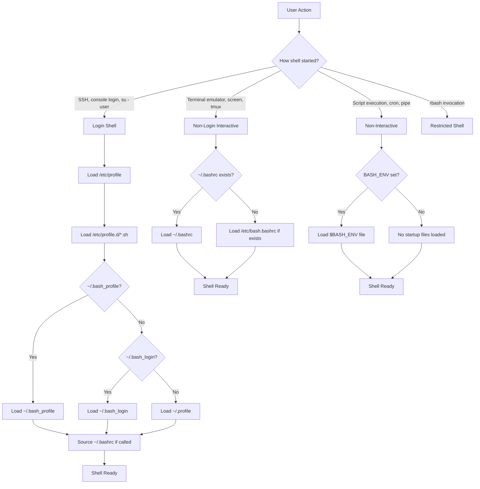
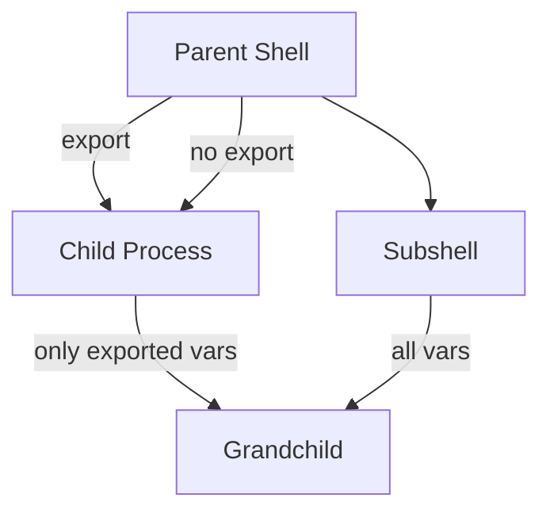

# Chapter 31: Login, Interactive, and Non-Interactive Shells — Invocation Differences, Startup Order

## Overview

Every time you open a terminal, run a script, or SSH into a server, a shell is involved — but not all shells are created equal. The type of shell invocation determines which startup files are loaded, what features are available, and how the shell behaves. Understanding the four fundamental shell types — login interactive, non-login interactive, non-interactive, and restricted — is essential for diagnosing configuration issues, writing robust scripts, and understanding why your `.bashrc` sometimes doesn't seem to work.

## Intuition

Think of shell types like different types of meetings:

- **Login interactive** = First day at a new job. You get the full orientation: company profile, department profile, your personal setup, and you can ask questions.
- **Non-login interactive** = Regular work session. You already know the company, so you just load your personal setup and start working.
- **Non-interactive** = Automated assembly line. No personal setup, just follow the script.
- **Restricted** = Visitor in a secure area. Limited access, can't change directories or set PATH.

## Architecture



## Shell Types in Detail

### Login Interactive Shells

A login shell is the first shell started when you authenticate to the system. It establishes your session environment.

**How they're created:**
- Console/TTY login (typing username and password)
- SSH login (`ssh user@host`)
- `su - user` or `su -l user`
- `bash --login`
- `bash -l`
- Virtual terminal login (Ctrl+Alt+F1-F6)

**Startup files loaded (Bash):**
1. `/etc/profile` (system-wide)
2. `/etc/profile.d/*.sh` (system-wide, modular)
3. First of: `~/.bash_profile`, `~/.bash_login`, `~/.profile` (user)
4. If `.bash_profile` sources `.bashrc`, then `.bashrc` is also loaded

**Key characteristics:**
- Reads `/etc/profile` (other shell types don't)
- Sets up the full user environment
- One-time setup that persists for the session
- Bash reads only ONE of `.bash_profile`, `.bash_login`, `.profile`

```bash
# Detect if running in a login shell
shopt -q login_shell && echo "Login shell" || echo "Not login shell"

# Or check the LOGIN_SH variable (not always available)
echo "$LOGIN_SH"

# Or check $0
echo "$0"
# -bash (leading dash indicates login shell)
# bash (no dash = not login shell)
```

### Non-Login Interactive Shells

A non-login interactive shell is started from within an existing session. It inherits the environment from its parent but applies its own configuration.

**How they're created:**
- Opening a new terminal tab/window (in most terminal emulators)
- Running `bash` without `--login`
- Subshells with `bash`
- `screen` or `tmux` (usually, unless configured otherwise)
- `su user` (without `-`)

**Startup files loaded (Bash):**
1. `~/.bashrc` (user)
2. `/etc/bash.bashrc` (system-wide, if sourced from `.bashrc` or configured)

**Key characteristics:**
- Does NOT read `/etc/profile`
- Does NOT read `.profile` or `.bash_profile`
- Inherits environment from parent shell
- Common source of confusion: changes to `.profile` don't take effect until next login

```bash
# Open a new terminal tab and check:
shopt -q login_shell && echo "Login" || echo "Non-login interactive"
# Usually: Non-login interactive

# Your .profile changes won't be visible here!
# Either: source ~/.profile
# Or: start a new login shell: bash --login
```

### Non-Interactive Shells

Non-interactive shells run scripts without user interaction. They load minimal configuration to avoid side effects.

**How they're created:**
- Running a script: `./script.sh`, `bash script.sh`
- Command substitution: `$(command)`, `` `command` ``
- Pipes: `command | bash`
- Cron jobs
- Shell scripts executed by other programs
- `bash -c 'command'`

**Startup files loaded (Bash):**
1. Only `$BASH_ENV` (if set) — the file it points to is sourced

**Key characteristics:**
- No `.bashrc`, no `.profile`, no `/etc/profile`
- Only `$BASH_ENV` is checked
- No interactive features (line editing, history, completion)
- `set -o posix` and `set -o nolog` have no effect
- Aliases are NOT expanded by default

```bash
# This script runs in a non-interactive shell
#!/bin/bash
echo "PID: $$"
echo "Shell type: $(shopt -oq login_shell && echo login || echo non-login)"

# Set BASH_ENV for non-interactive shell config
export BASH_ENV="$HOME/.bash_env"
# Contents of .bash_env will be sourced for every script
```

### Restricted Shells

A restricted shell limits what the user can do, providing a sandboxed environment.

**How they're created:**
- `rbash` invocation
- Setting the user's login shell to `/bin/rbash`
- `bash -r`

**Restrictions:**
- Cannot change directory (`cd` is disabled)
- Cannot change `PATH`, `SHELL`, `BASH_ENV`, `ENV`, `HISTFILE`
- Cannot redirect output with `>`, `>|`, `<>`, `>&`, `&>`
- Cannot use `exec` to replace the shell
- Cannot modify shell options with `set +r`
- Cannot use `/` in command names (no absolute/relative paths)
- Cannot use `source` with filenames containing `/`

```bash
# Start a restricted shell
rbash

# Or
bash -r

# Check if restricted
set -o | grep restricted
# restricted    on

# Setting up a restricted user
sudo useradd -m -s /bin/rbash restricted_user
sudo mkdir /home/restricted_user/bin
sudo ln -s /usr/bin/vi /home/restricted_user/bin/
sudo ln -s /usr/bin/ls /home/restricted_user/bin/
sudo chown root:root /home/restricted_user/.bash_profile
# Edit .bash_profile to set PATH to only ~/bin
```

## Shell Invocation Flags

```bash
# Common invocation flags
bash -l          # Login shell
bash -i          # Interactive shell
bash -r          # Restricted shell
bash -s          # Read from stdin
bash -c "cmd"    # Execute command string
bash file.sh     # Execute script file
bash < file.sh   # Execute from stdin

# Combined flags
bash -li         # Login + interactive
bash -lc "cmd"   # Login + command
bash -c "cmd"    # Non-interactive command

# Which startup files are read:
# bash           → .bashrc (non-login interactive)
# bash -l        → .bash_profile/.profile (login interactive)
# bash -i        → .bashrc (non-login interactive)
# bash -li       → .bash_profile/.profile + .bashrc (login interactive)
# bash -c "cmd"  → BASH_ENV only (non-interactive)
# bash file.sh   → BASH_ENV only (non-interactive)
# bash -lc "cmd" → .bash_profile/.profile (login non-interactive)
```

## Startup File Loading Matrix

| Invocation | `/etc/profile` | `/etc/profile.d/` | `.bash_profile` | `.profile` | `.bashrc` | `BASH_ENV` |
|-----------|----------------|--------------------|-----------------|-----------|-----------|----|
| Login interactive | ✅ | ✅ | ✅ (or `.bash_login` or `.profile`) | ✅ (if no `.bash_profile`) | ✅ (if sourced) | ❌ |
| Non-login interactive | ❌ | ❌ | ❌ | ❌ | ✅ | ❌ |
| Non-interactive (script) | ❌ | ❌ | ❌ | ❌ | ❌ | ✅ (if set) |
| `bash -c "cmd"` | ❌ | ❌ | ❌ | ❌ | ❌ | ✅ (if set) |
| `bash -lc "cmd"` | ✅ | ✅ | ✅ | ✅ (if no `.bash_profile`) | ✅ (if sourced) | ❌ |

## Zsh Startup Files

Zsh has a more granular startup file system:

| File | When Loaded | Purpose |
|------|-------------|---------|
| `/etc/zsh/zshenv` | Always, first | System-wide environment |
| `~/.zshenv` | Always | User environment |
| `/etc/zsh/zprofile` | Login | System-wide login config |
| `~/.zprofile` | Login | User login config |
| `/etc/zsh/zshrc` | Interactive | System-wide interactive config |
| `~/.zshrc` | Interactive | User interactive config |
| `/etc/zsh/zlogin` | Login (after zshrc) | System-wide login final |
| `~/.zlogin` | Login (after zshrc) | User login final |
| `~/.zlogout` | Logout | User cleanup |
| `/etc/zsh/zlogout` | Logout | System-wide cleanup |

```zsh
# Zsh startup order:
# Login interactive:  zshenv → zprofile → zshrc → zlogin
# Non-login interactive: zshenv → zshrc
# Non-interactive:    zshenv only (unless SHLVL check)
# Login non-interactive: zshenv → zprofile → zlogin
```

## Practical Scenarios

### Scenario 1: SSH Login

```bash
# SSH creates a login interactive shell
ssh user@host

# Loaded: /etc/profile → /etc/profile.d/*.sh → ~/.bash_profile (or ~/.profile)
# If .bash_profile sources .bashrc: ~/.bashrc is also loaded

# SSH command execution (non-interactive)
ssh user@host "ls -la"
# Loaded: ~/.bashrc on some systems (if SSH sends a command)
# Actually: depends on SSH configuration and shell type

# SSH with forced login shell
ssh user@host --login
# Loaded: same as console login
```

### Scenario 2: Screen/Tmux

```bash
# screen/tmux usually start non-login interactive shells
screen
tmux

# Loaded: ~/.bashrc only
# NOT loaded: .profile, .bash_profile, /etc/profile

# This means PATH changes in .profile won't be visible!

# Fix: configure screen/tmux to start login shells
# ~/.screenrc: shell -/bin/bash
# ~/.tmux.conf: set -g default-command "${SHELL}"
```

### Scenario 3: su vs su -

```bash
# su user — non-login interactive shell
su otheruser
# Loaded: ~/.bashrc only
# Inherits current environment

# su - user — login interactive shell
su - otheruser
# Loaded: /etc/profile → ~/.bash_profile (or ~/.profile)
# Fresh environment

# sudo -i — login shell as root
sudo -i
# Loaded: root's /etc/profile → root's .bash_profile

# sudo -s — non-login interactive shell as root
sudo -s
# Loaded: root's .bashrc
# Inherits current environment

# sudo su - — login shell as root
sudo su -
# Loaded: root's login startup files
```

### Scenario 4: Cron Jobs

```bash
# Cron runs non-interactive, non-login shells
# NO startup files are loaded
# Only BASH_ENV (if set in crontab)

# ❌ This won't work if your PATH is set in .bashrc
0 * * * * myscript.sh

# ✅ Option 1: Set PATH in crontab
PATH=/usr/local/bin:/usr/bin:/bin
0 * * * * myscript.sh

# ✅ Option 2: Source profile in the script
#!/bin/bash
source "$HOME/.profile" 2>/dev/null
myscript.sh

# ✅ Option 3: Use full paths
0 * * * * /usr/local/bin/myscript.sh

# ✅ Option 4: Set BASH_ENV
BASH_ENV=/home/user/.bash_env
0 * * * * myscript.sh
```

### Scenario 5: Script Execution

```bash
# Direct execution
./script.sh
# Non-interactive: only BASH_ENV

# With bash
bash script.sh
# Non-interactive: only BASH_ENV

# With bash --login
bash --login script.sh
# Login non-interactive: /etc/profile, .profile/.bash_profile
# But still non-interactive, so no .bashrc unless explicitly sourced

# With env
env bash script.sh
# Non-interactive: only BASH_ENV

# In a Makefile
target:
	bash -c 'source /etc/profile && ./script.sh'
```

## Detecting Shell Type

```bash
#!/bin/bash
# Comprehensive shell type detection

detect_shell_type() {
    local type=""
    
    # Check login shell
    if shopt -q login_shell 2>/dev/null; then
        type="login-"
    else
        type="non-login-"
    fi
    
    # Check interactive
    if [[ $- == *i* ]]; then
        type="${type}interactive"
    else
        type="${type}non-interactive"
    fi
    
    echo "$type"
}

# Usage
echo "Shell type: $(detect_shell_type)"

# Additional checks
echo "PID: $$"
echo "Parent PID: $PPID"
echo "Shell: $0"
echo "BASH_VERSION: $BASH_VERSION"
echo "SHLVL: $SHLVL"
echo "TERM: $TERM"
echo "SSH_CONNECTION: ${SSH_CONNECTION:-not set}"
echo "DISPLAY: ${DISPLAY:-not set}"

# Check if in a container
if [ -f /.dockerenv ] || grep -q docker /proc/1/cgroup 2>/dev/null; then
    echo "Running in Docker container"
fi

# Check if in a chroot
if [ "$(stat -c %d/%i /)" != "$(stat -c %d/%i /proc/1/root/.)" ]; then
    echo "Running in chroot"
fi

# Check if in screen/tmux
if [ -n "$STY" ]; then
    echo "Running in screen"
elif [ -n "$TMUX" ]; then
    echo "Running in tmux"
fi
```

## Environment Inheritance

```bash
# Parent shell
export PARENT_VAR="from parent"
LOCAL_VAR="only in parent"

# Child shell (inherits exported variables only)
bash -c 'echo "PARENT_VAR=$PARENT_VAR"'   # from parent
bash -c 'echo "LOCAL_VAR=$LOCAL_VAR"'      # (empty)

# Subshell (inherits everything, including non-exported)
(echo "PARENT_VAR=$PARENT_VAR")   # from parent
(echo "LOCAL_VAR=$LOCAL_VAR")     # only in parent

# Command substitution creates a subshell
echo "PARENT_VAR=$(echo $PARENT_VAR)"  # from parent
```



## Common Pitfalls

### 1. Changes to .profile Not Taking Effect

```bash
# ❌ Edit .profile, open new terminal tab, changes not visible
# Terminal tabs are usually non-login interactive shells

# ✅ Option 1: Start a login shell
bash --login

# ✅ Option 2: Source .profile
source ~/.profile

# ✅ Option 3: Put changes in .bashrc instead (for interactive use)

# ✅ Option 4: Configure terminal to start login shells
# In your terminal emulator settings
```

### 2. Aliases Not Working in Scripts

```bash
# ❌ Aliases defined in .bashrc aren't available in scripts
#!/bin/bash
ll  # "command not found"

# ✅ Source .bashrc (not recommended for scripts)
source ~/.bashrc

# ✅ Define the function/alias in the script
ll() { ls -la "$@"; }

# ✅ Use full command instead
ls -la
```

### 3. PATH Missing in Cron

```bash
# ❌ Cron has minimal PATH
0 * * * * mycommand  # "command not found"

# ✅ Set PATH in crontab
PATH=/usr/local/bin:/usr/bin:/bin
0 * * * * mycommand
```

### 4. Docker Container Missing Environment

```bash
# ❌ Dockerfile doesn't source .bashrc
RUN echo 'export MY_VAR=value' >> ~/.bashrc

# ✅ Use ENV directive
ENV MY_VAR=value

# ✅ Or set in entrypoint
#!/bin/sh
source ~/.bashrc
exec "$@"
```

## Best Practices

1. **Keep `.profile` for environment variables** — PATH, EDITOR, LANG
2. **Keep `.bashrc` for interactive features** — aliases, functions, prompt, completion
3. **Source `.bashrc` from `.bash_profile`** — ensures consistency
4. **Guard `.bashrc` against non-interactive use** — prevents slowdowns
5. **Use `BASH_ENV` for script-specific configuration** — if needed
6. **Test with login shells after changing `.profile`** — `bash --login`
7. **Set PATH in `.profile`, not `.bashrc`** — avoids duplicates
8. **Use `/etc/profile.d/` for system-wide additions** — modular and clean
9. **Document which file is for what** — comments at the top of each file
10. **Don't assume terminal tabs are login shells** — they usually aren't

## Exercises

### Exercise 1: Shell Type Detector
Write a script that detects and reports:
- Whether it's running in a login or non-login shell
- Whether it's interactive or non-interactive
- Which startup files would have been loaded
- The parent process information
- Whether it's running in SSH, screen, tmux, Docker, or cron

### Exercise 2: Startup File Audit
Write a script that:
- Checks if `.bash_profile` sources `.bashrc`
- Checks if `.bashrc` guards against non-interactive use
- Reports any environment variables set in `.bashrc` that should be in `.profile`
- Reports any aliases in `.profile` that should be in `.bashrc`

### Exercise 3: Environment Comparison
Write a script that runs the same command in four different shell types and compares the environment:
- Login interactive
- Non-login interactive
- Non-interactive
- Non-interactive with BASH_ENV set

### Exercise 4: Cron Environment
Create a cron job that logs its complete environment to a file. Compare this environment with your interactive shell's environment. Document the differences.

### Exercise 5: SSH Environment
Write a script that:
- Detects if it's running via SSH
- Sets up the environment correctly for both interactive and non-interactive SSH sessions
- Handles SSH agent forwarding
- Configures locale correctly for remote sessions

## References

- [Bash Manual: Invoking Bash](https://www.gnu.org/software/bash/manual/bash.html#Invoking-Bash)
- [Bash Manual: Bash Startup Files](https://www.gnu.org/software/bash/manual/bash.html#Bash-Startup-Files)
- [Zsh Manual: Startup/Shutdown Files](https://zsh.sourceforge.io/Doc/Release/Files.html)
- [Arch Wiki: Bash](https://wiki.archlinux.org/title/Bash#Configuration_files)
- [Stack Overflow: Difference between .bashrc and .bash_profile](https://stackoverflow.com/questions/415403/what-is-the-difference-between-bashrc-and-bash-profile)
- [Linux man pages: bash(1)](https://man7.org/linux/man-pages/man1/bash.1.html)
