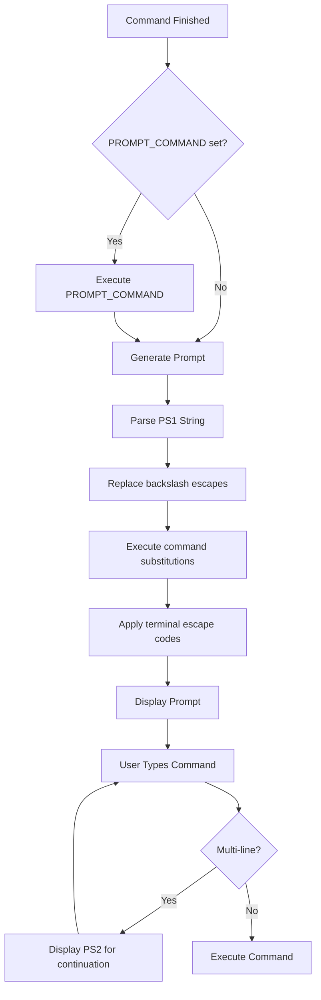

# Chapter 32: Prompt Customization — PS1, PS2, PROMPT_COMMAND, powerline, starship

## Overview

Your shell prompt is the most visible and frequently seen element of your terminal experience. It's the first thing you see when you open a terminal and the last thing you see before each command. A well-designed prompt provides essential context — your username, hostname, current directory, git branch, exit status, and more — without cluttering your screen.

Customizing your prompt is one of the first things Linux users do after installation. From simple text prompts to elaborate multi-line configurations with colors, icons, and real-time information, prompt customization ranges from trivial to deeply technical.

## Intuition

Think of your prompt as a heads-up display (HUD) for your terminal. Just as a pilot's HUD shows altitude, speed, and heading, your prompt shows the context you need most often: where you are (directory), who you are (user@host), what state your project is in (git branch), and whether the last command succeeded (exit status indicator).

The challenge is balancing information density with readability. Too little information and you're constantly running commands to check context. Too much and your screen becomes cluttered, leaving little room for actual commands.

## Architecture



### Prompt Variables

| Variable | Purpose | Default |
|----------|---------|---------|
| `PS1` | Primary prompt string | `\s-\v\$ ` |
| `PS2` | Continuation prompt | `> ` |
| `PS3` | `select` command prompt | `#? ` |
| `PS4` | `set -x` trace prefix | `+ ` |
| `PROMPT_COMMAND` | Command executed before PS1 | (empty) |

## PS1 Escape Sequences

### Bash Escape Sequences

| Sequence | Description | Example Output |
|----------|-------------|----------------|
| `\u` | Current username | `user` |
| `\h` | Short hostname (without domain) | `myhost` |
| `\H` | Full hostname (FQDN) | `myhost.example.com` |
| `\w` | Current working directory (full, with ~) | `~/projects` |
| `\W` | Basename of current directory | `projects` |
| `\d` | Date in "Weekday Month Day" format | `Mon Jun 29` |
| `\D{format}` | Custom date format | `\D{%Y-%m-%d}` → `2026-06-29` |
| `\t` | Time in 24-hour HH:MM:SS | `13:24:00` |
| `\T` | Time in 12-hour HH:MM:SS | `01:24:00` |
| `\@` | Time in 12-hour am/pm | `01:24pm` |
| `\A` | Time in 24-hour HH:MM | `13:24` |
| `\j` | Number of background jobs | `2` |
| `\l` | basename of terminal device | `pts/0` |
| `\s` | Shell name | `bash` |
| `\v` | Shell version (short) | `5.2` |
| `\V` | Shell version (full) | `5.2.15` |
| `\n` | Newline | |
| `\$` | `#` if root, `$` otherwise | `$` |
| `\nnn` | Character in octal | `\101` → `A` |
| `\\` | Literal backslash | `\` |
| `\[` | Begin non-printing sequence | |
| `\]` | End non-printing sequence | |
| `\e` | Escape character | |
| `\033` | Octal escape | |
| `\x1B` | Hex escape | |

### Color Codes

```bash
# Format: \[\033[COLORm\]
# Must be wrapped in \[...\] to avoid line wrapping issues

# Basic colors (foreground)
# 30=Black 31=Red 32=Green 33=Yellow 34=Blue 35=Magenta 36=Cyan 37=White

# Bright colors (foreground)
# 90=Bright Black 91=Bright Red 92=Bright Green 93=Bright Yellow
# 94=Bright Blue 95=Bright Magenta 96=Bright Cyan 97=Bright White

# Background colors
# 40=Black 41=Red 42=Green 43=Yellow 44=Blue 45=Magenta 46=Cyan 47=White

# Text attributes
# 0=Reset 1=Bold 2=Dim 3=Italic 4=Underline 5=Blink 7=Reverse 9=Strikethrough

# Examples
RED='\[\033[0;31m\]'
GREEN='\[\033[0;32m\]'
YELLOW='\[\033[0;33m\]'
BLUE='\[\033[0;34m\]'
PURPLE='\[\033[0;35m\]'
CYAN='\[\033[0;36m\]'
WHITE='\[\033[0;37m\]'
BOLD='\[\033[1m\]'
RESET='\[\033[0m\]'
```

## Prompt Examples

### Simple Prompts

```bash
# Basic: user@host:dir$
PS1='\u@\h:\w\$ '

# With colors
PS1='\[\033[01;32m\]\u@\h\[\033[00m\]:\[\033[01;34m\]\w\[\033[00m\]\$ '

# Minimal: just directory
PS1='\W \$ '

# Full path
PS1='\w \$ '

# With time
PS1='[\t] \u@\h:\w\$ '

# With date
PS1='[\D{%Y-%m-%d} \t] \u@\h:\w\$ '
```

### Git-Aware Prompt

```bash
# Function to get git branch
parse_git_branch() {
    git branch 2>/dev/null | sed -n 's/* \(.*\)/(\1)/p'
}

# Or faster: use git's built-in
parse_git_branch() {
    local branch
    branch=$(git symbolic-ref --short HEAD 2>/dev/null) || \
    branch=$(git rev-parse --short HEAD 2>/dev/null) || \
    return
    echo " ($branch)"
}

# Git status indicator
parse_git_status() {
    local status=""
    if git rev-parse --git-dir >/dev/null 2>&1; then
        # Check for uncommitted changes
        if ! git diff --quiet 2>/dev/null; then
            status="${status}*"    # Modified files
        fi
        # Check for staged changes
        if ! git diff --cached --quiet 2>/dev/null; then
            status="${status}+"    # Staged files
        fi
        # Check for untracked files
        if [[ -n $(git ls-files --others --exclude-standard 2>/dev/null) ]]; then
            status="${status}?"    # Untracked files
        fi
        # Check for stashes
        if [[ -n $(git stash list 2>/dev/null) ]]; then
            status="${status}$"    # Stashed changes
        fi
    fi
    echo "$status"
}

# Use in prompt
PS1='\[\033[01;32m\]\u@\h\[\033[00m\]:\[\033[01;34m\]\w\[\033[33m\]$(parse_git_branch)\[\033[00m\]\$ '
```

### Multi-Line Prompt

```bash
# Two-line prompt: info on top, command on bottom
PS1='\[\033[01;32m\]\u@\h\[\033[00m\]:\[\033[01;34m\]\w\[\033[33m\]$(parse_git_branch)\[\033[00m\]\n\$ '

# With exit status indicator
PS1='$(exit_code=$?; if [[ $exit_code -ne 0 ]]; then echo "\[\033[01;31m\]✗ $exit_code "; fi)\[\033[01;32m\]\u@\h\[\033[00m\]:\[\033[01;34m\]\w\[\033[33m\]$(parse_git_branch)\[\033[00m\]\n\$ '

# Powerline-style with Unicode
PS1='\[\033[01;32m\] \u@\h \[\033[01;34m\]\[\033[00;34m\] \w \[\033[01;33m\]$(parse_git_branch)\[\033[00m\]\n❯ '
```

### Advanced Prompt with PROMPT_COMMAND

```bash
# PROMPT_COMMAND runs before each prompt is displayed
# More flexible than PS1 for complex operations

prompt_command() {
    local exit_code=$?
    local git_info=""
    local jobs_count=""
    local venv_info=""
    
    # Git info
    if git rev-parse --git-dir >/dev/null 2>&1; then
        local branch
        branch=$(git symbolic-ref --short HEAD 2>/dev/null) || \
        branch=$(git rev-parse --short HEAD 2>/dev/null)
        git_info=" \[\033[33m\]($branch)\[\033[0m\]"
    fi
    
    # Background jobs
    local job_count=$(jobs -p | wc -l)
    if [[ $job_count -gt 0 ]]; then
        jobs_count=" \[\033[36m\][${job_count}j]\[\033[0m\]"
    fi
    
    # Virtual environment
    if [[ -n "${VIRTUAL_ENV:-}" ]]; then
        venv_info=" \[\033[32m\]($(basename "$VIRTUAL_ENV"))\[\033[0m\]"
    fi
    
    # Build PS1
    PS1=""
    
    # Exit status indicator
    if [[ $exit_code -ne 0 ]]; then
        PS1+="\[\033[01;31m\]✗ $exit_code\[\033[0m\] "
    else
        PS1+="\[\033[01;32m\]✓\[\033[0m\] "
    fi
    
    # User@Host
    PS1+="\[\033[01;32m\]\u@\h\[\033[00m\]:"
    
    # Directory
    PS1+="\[\033[01;34m\]\w\[\033[00m\]"
    
    # Git, jobs, venv
    PS1+="${git_info}${jobs_count}${venv_info}"
    
    # Newline and prompt character
    PS1+="\n\[\033[01;32m\]\$\[\033[00m\] "
}

PROMPT_COMMAND=prompt_command
```

## PS2 — Continuation Prompt

```bash
# PS2 is displayed when a command spans multiple lines
# Default: "> "

# Customize PS2
PS2='... '

# With color
PS2='\[\033[0;36m\]... \[\033[0m\]'

# Show line number
PS2='line $LINENO> '

# Examples of multi-line commands:
echo "line 1" \
     "line 2" \
     "line 3"
# PS2 displayed for each continuation line

if true; then
    echo "inside if"
fi
# PS2 displayed for "then" and "fi" lines
```

## PS3 — Select Prompt

```bash
# PS3 is used by the 'select' command
PS3="Choose an option: "

select opt in "Start" "Stop" "Restart" "Quit"; do
    case "$opt" in
        "Start")   echo "Starting..." ;;
        "Stop")    echo "Stopping..." ;;
        "Restart") echo "Restarting..." ;;
        "Quit")    break ;;
        *)         echo "Invalid option" ;;
    esac
done
```

## PS4 — Debug Trace Prompt

```bash
# PS4 is displayed before each command when using 'set -x'
# Default: "+ "

# Customize with more info
PS4='+${BASH_SOURCE}:${LINENO}:${FUNCNAME[0]:+${FUNCNAME[0]}():} '

# With color
PS4='\[\033[0;33m\]+${BASH_SOURCE}:${LINENO}: \[\033[0m\]'

# Example:
set -x
echo "hello"
# +/path/to/script:5: echo hello
# hello
```

## Zsh Prompt

### Zsh Escape Sequences

```zsh
# Zsh uses %{...%} for non-printing characters
# And %n, %m, %~ etc. for prompt info

# Common sequences
PS1='%n@%m:%~%# '                    # user@host:dir%
PS1='%F{green}%n@%m%f:%F{blue}%~%f%# '  # Colored

# Zsh-specific sequences
PS1='%n'       # Username
PS1='%m'       # Short hostname
PS1='%M'       # Full hostname
PS1='%~'       # Current dir (with ~ for home)
PS1='%d'       # Current dir (full)
PS1='%c'       # Basename of current dir
PS1='%l'       # Terminal device
PS1='%y'       # Terminal name
PS1='%T'       # Time (24h HH:MM)
PS1='%t'       # Time (12h am/pm)
PS1='%D'       # Date (YY-MM-DD)
PS1='%w'       # Day
PS1='%W'       # Date (MM/DD/YY)
PS1='%*'       # Time (HH:MM:SS)
PS1='%#'       # # if root, % otherwise
PS1='%?'       # Exit status of last command
PS1='%j'       # Number of jobs
PS1='%L'       # $SHLVL
PS1='%!'       # History number
PS1%'%i'       # Line number
PS1='%N'       # Script name
PS1='%x'       # Source file
PS1='%#'       # Privilege indicator

# Git info in Zsh (with vcs_info)
autoload -Uz vcs_info
precmd() { vcs_info }
zstyle ':vcs_info:git:*' formats '(%b)'
PS1='%n@%m:%~${vcs_info_msg_0_}%# '

# Colors in Zsh
PS1='%F{red}red%f %F{green}green%f %F{blue}blue%f'
PS1='%K{blue}%F{white} white on blue %f%k'
```

### Zsh Right Prompt

```zsh
# RPROMPT appears on the right side of the terminal
RPROMPT='%F{cyan}%T%f'              # Time on the right
RPROMPT='%F{8}%~%f'                  # Dim directory
RPROMPT='%(?.%F{green}✓%f.%F{red}✗%?%f)'  # Exit status

# Right prompt disappears after command is executed
setopt TRANSIENT_RPROMPT
```

## Powerline

Powerline is a statusline plugin that provides a visually appealing prompt with arrows, segments, and rich information.

### Installation

```bash
# Python powerline
pip install powerline-status

# Powerline for Bash
# Add to .bashrc:
if [ -f $(python3 -c "import powerline; print(powerline.__path__[0])")/bindings/bash/powerline.sh ]; then
    source $(python3 -c "import powerline; print(powerline.__path__[0])")/bindings/bash/powerline.sh
fi

# Powerline for Zsh
# Add to .zshrc:
if [ -f $(python3 -c "import powerline; print(powerline.__path__[0])")/bindings/zsh/powerline.zsh ]; then
    source $(python3 -c "import powerline; print(powerline.__path__[0])")/bindings/zsh/powerline.zsh
fi

# Powerline fonts (required for arrows and symbols)
# Nerd Fonts: https://www.nerdfonts.com/
sudo apt install fonts-powerline
# or install a Nerd Font manually
```

### Powerline Configuration

```json
// ~/.config/powerline/config.json
{
    "ext": {
        "shell": {
            "theme": "default_leftonly"
        }
    },
    "common": {
        "default_top_theme": "powerline",
        "dividers": {
            "left": {
                "hard": "\ue0b0",
                "soft": "\ue0b1"
            },
            "right": {
                "hard": "\ue0b2",
                "soft": "\ue0b3"
            }
        }
    }
}
```

## Starship

Starship is a modern, cross-shell prompt written in Rust. It's fast, customizable, and works with Bash, Zsh, Fish, PowerShell, and more.

### Installation

```bash
# Install
curl -sS https://starship.rs/install.sh | sh

# Or via package manager
sudo apt install starship    # Debian/Ubuntu (if available)
brew install starship        # macOS
```

### Setup

```bash
# Bash — add to ~/.bashrc
eval "$(starship init bash)"

# Zsh — add to ~/.zshrc
eval "$(starship init zsh)"

# Fish — add to ~/.config/fish/config.fish
starship init fish | source

# PowerShell — add to $PROFILE
Invoke-Expression (&starship init powershell)
```

### Starship Configuration

```toml
# ~/.config/starship.toml

# Format configuration
format = """
$directory\
$git_branch\
$git_status\
$python\
$nodejs\
$rust\
$docker_context\
$cmd_duration\
$line_break\
$character"""

# Directory
[directory]
truncation_length = 3
truncate_to_repo = true
style = "bold cyan"

# Git branch
[git_branch]
format = "[$symbol$branch]($style) "
symbol = " "
style = "bold purple"

# Git status
[git_status]
format = '([$all_status$ahead_behind]($style) )'
modified = "!"
staged = "+"
untracked = "?"
deleted = "✘"
style = "bold red"

# Character (prompt symbol)
[character]
success_symbol = "[❯](bold green)"
error_symbol = "[❯](bold red)"
vicmd_symbol = "[❮](bold green)"

# Command duration
[cmd_duration]
min_time = 2_000
format = "took [$duration]($style) "
style = "bold yellow"

# Python
[python]
format = "[$symbol$version]($style) "
symbol = " "
style = "bold yellow"

# Node.js
[nodejs]
format = "[$symbol$version]($style) "
symbol = " "
style = "bold green"

# Rust
[rust]
format = "[$symbol$version]($style) "
symbol = " "
style = "bold orange"

# Docker
[docker_context]
format = "[$symbol$context]($style) "
symbol = " "
style = "bold blue"

# Time
[time]
disabled = false
format = "[$time]($style) "
style = "bold dimmed white"
time_format = "%T"

# Battery
[[battery.display]]
threshold = 30
style = "bold red"

[[battery.display]]
threshold = 60
style = "bold yellow"

[[battery.display]]
threshold = 100
style = "bold green"
```

### Starship Presets

```bash
# Use a preset configuration
starship preset nerd-font-symbols -o ~/.config/starship.toml
starship preset plain-text-symbols -o ~/.config/starship.toml
starship preset no-nerd-font -o ~/.config/starship.toml
starship preset pastel-powerline -o ~/.config/starship.toml
starship preset tokyo-night -o ~/.config/starship.toml
starship preset gruvbox-rainbow -o ~/.config/starship.toml
```

## Prompt Performance

```bash
# ❌ Expensive command in PROMPT_COMMAND
PROMPT_COMMAND='git status'  # Runs git status before EVERY prompt

# ✅ Cache expensive operations
__git_ps1_cache=""
__git_ps1_cache_dir=""
__git_ps1() {
    if [[ "$PWD" != "$__git_ps1_cache_dir" ]]; then
        __git_ps1_cache_dir="$PWD"
        __git_ps1_cache=$(git branch 2>/dev/null | sed -n 's/* \(.*\)/(\1)/p')
    fi
    echo "$__git_ps1_cache"
}

# ✅ Use async prompt (Zsh)
# Zsh can run prompt functions asynchronously

# ✅ Starship is fast (written in Rust, caches aggressively)

# ✅ Limit PROMPT_COMMAND work
# Only do what's necessary, cache what you can
```

## Common Pitfalls

### 1. Line Wrapping Issues

```bash
# ❌ Colors without \[...\] cause line wrapping problems
PS1='\033[01;32m\u@\h\033[00m:\w\$ '
# The terminal doesn't know which characters are non-printing
# Long commands will wrap incorrectly

# ✅ Always wrap escape sequences in \[...\]
PS1='\[\033[01;32m\]\u@\h\[\033[00m\]:\w\$ '
```

### 2. Command Substitution in PS1

```bash
# ❌ Command substitution runs every time the prompt is displayed
# If the command is slow, your prompt will be slow

# ✅ Cache the result
__cached_git_info=""
__cached_git_dir=""
update_git_info() {
    if [[ "$PWD" != "$__cached_git_dir" ]]; then
        __cached_git_dir="$PWD"
        __cached_git_info=$(git branch 2>/dev/null | sed -n 's/* \(.*\)/(\1)/p')
    fi
}
PROMPT_COMMAND=update_git_info
PS1='\u@\h:\w\$ \[\033[33m\]${__cached_git_info}\[\033[0m\]\n\$ '
```

### 3. Escaping in Double Quotes

```bash
# ❌ PS1 in double quotes: escape sequences not interpreted correctly
PS1="\[\033[01;32m\]\u\[\033[00m\] "
# The \[ and \] are interpreted by bash, but \033 might not work

# ✅ Use single quotes or $'...' syntax
PS1='\[\033[01;32m\]\u\[\033[00m\] '
# or
PS1=$'\[\e[1;32m\]\u\[\e[0m\] '
```

### 4. Starship Not Found

```bash
# ❌ Starship not in PATH
eval "$(starship init bash)"
# "starship: command not found"

# ✅ Use full path
eval "$(/usr/local/bin/starship init bash)"
# Or ensure ~/.local/bin or /usr/local/bin is in PATH
```

## Best Practices

1. **Always use `\[...\]` around non-printing characters** — prevents line wrapping issues
2. **Use single quotes for PS1** — prevents unexpected expansion
3. **Cache expensive operations** — git status, directory listing
4. **Use PROMPT_COMMAND for dynamic prompts** — more flexible than embedding in PS1
5. **Show exit status** — knowing if the last command failed is invaluable
6. **Show git branch** — essential for development work
7. **Keep it readable** — don't sacrifice readability for information density
8. **Use a framework for complex prompts** — Starship, Powerline, oh-my-zsh
9. **Test in different terminal sizes** — make sure your prompt works at 80 columns
10. **Use Nerd Fonts for icons** — install a Nerd Font for Powerline and Starship symbols

## Exercises

### Exercise 1: Basic Prompt
Create a PS1 prompt that shows:
- Username in green
- Hostname in green
- Current directory in blue
- Git branch in yellow (if in a git repo)
- `$` for normal user, `#` for root
- A newline before the command input

### Exercise 2: Git-Aware Prompt
Write a prompt function that:
- Shows the current git branch
- Indicates modified files with `*`
- Indicates staged files with `+`
- Indicates untracked files with `?`
- Shows the number of stashed changes
- Updates only when the directory changes (caching)

### Exercise 3: Multi-Line Status Prompt
Create a two-line prompt where:
- Line 1: exit status (✓/✗), user@host, directory, git branch
- Line 2: `❯` for normal user, `#` for root
- Exit status changes color based on success/failure

### Exercise 4: Starship Configuration
Install Starship and create a custom `starship.toml` that:
- Shows Python, Node.js, and Rust versions when relevant
- Shows command duration for commands taking > 3 seconds
- Uses Nerd Font symbols
- Has a custom color scheme

### Exercise 5: Performance Benchmark
Write a script that benchmarks different prompt implementations:
- Simple PS1 with color codes
- Git-aware PS1 with command substitution
- PROMPT_COMMAND-based prompt
- Starship prompt
- Measure the time taken to generate each prompt 100 times

## References

- [Bash Manual: Controlling the Prompt](https://www.gnu.org/software/bash/manual/bash.html#Controlling-the-Prompt)
- [Zsh Manual: Prompt Expansion](https://zsh.sourceforge.io/Doc/Release/Prompt-Expansion.html)
- [Powerline](https://github.com/powerline/powerline)
- [Starship](https://starship.rs/)
- [Nerd Fonts](https://www.nerdfonts.com/)
- [Bash Prompt HOWTO](https://tldp.org/HOWTO/Bash-Prompt-HOWTO/)
- [Arch Wiki: Bash/Prompt Customization](https://wiki.archlinux.org/title/Bash/Prompt_customization)
- [Color Codes Reference](https://misc.flogisoft.com/bash/tip_colors_and_formatting)
