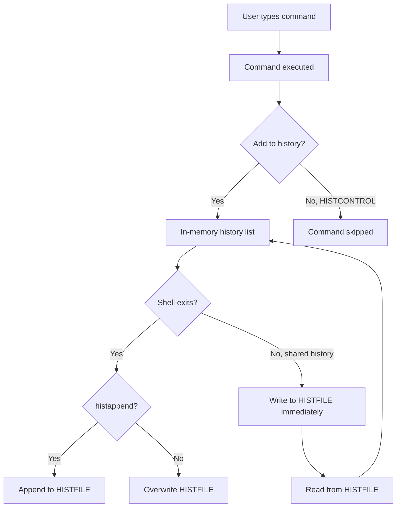

# Chapter 33: History Management — HISTSIZE, HISTCONTROL, shared history, histappend

## Overview

Shell history is your command-line memory. It records every command you type, allowing you to recall, search, edit, and re-execute previous commands. Proper history management transforms the shell from a stateless tool into a learning system that gets smarter with use.

Understanding history configuration is essential for productivity. A well-tuned history system lets you recall commands from weeks ago, avoid repeating mistakes, share history between terminal sessions, and build a searchable knowledge base of your command-line work.

## Intuition

Think of shell history as a journal of your command-line life. By default, it's a simple chronological log, but with proper configuration it becomes:
- A **searchable knowledge base** (Ctrl+R search)
- A **shared context** between terminal sessions (shared history)
- A **safety net** that records what you did and when (timestamps)
- A **productivity tool** that reduces typing (history expansion)

The key variables control how large this journal is, what gets recorded, where it's stored, and how it behaves across sessions.

## Architecture



## History Variables

### HISTSIZE

Controls how many commands are remembered in the current shell session's memory.

```bash
# Number of commands to remember in memory
HISTSIZE=10000    # Default is usually 500 or 1000

# Set to unlimited (not recommended — uses memory)
HISTSIZE=-1

# Check current value
echo "$HISTSIZE"
```

### HISTFILESIZE

Controls how many lines the history file can contain.

```bash
# Maximum lines in the history file
HISTFILESIZE=20000    # Default is usually 500

# Set to unlimited
HISTFILESIZE=-1

# Check current value
echo "$HISTFILESIZE"

# HISTFILESIZE should be >= HISTSIZE
# Otherwise, history is lost when the session ends
```

### HISTFILE

The file where history is stored.

```bash
# Default: ~/.bash_history
echo "$HISTFILE"
# /home/user/.bash_history

# Change to a different file
HISTFILE="$HOME/.bash_history_$(date +%Y)"

# Disable history file entirely
HISTFILE=/dev/null

# Use a different file for different projects
HISTFILE="$PWD/.bash_history"
```

### HISTCONTROL

Controls which commands are saved to history.

```bash
# Values (colon-separated):
HISTCONTROL=ignoreboth    # Same as ignorespace:ignoredups

# ignorespace: Don't save commands starting with a space
HISTCONTROL=ignorespace
# Type " secret_command" (leading space) — won't be saved

# ignoredups: Don't save duplicate consecutive commands
HISTCONTROL=ignoredups
# If you type "ls" three times, only the first is saved

# ignoreboth: Both ignorespace and ignoredups
HISTCONTROL=ignoreboth

# erasedups: Remove all previous duplicates (not just consecutive)
HISTCONTROL=erasedups
# If you type "ls" at commands 5, 10, and 15, only command 15 is kept

# Combine options
HISTCONTROL=ignoreboth:erasedups
```

### HISTIGNORE

Specifies patterns for commands to ignore.

```bash
# Colon-separated list of patterns
# Uses the same pattern matching as the shell

# Ignore common commands
HISTIGNORE="ls:cd:pwd:exit:clear:history"

# Ignore commands with leading space AND common commands
HISTIGNORE="&:ls:cd:pwd:exit:clear:[ \t]*"

# & means "ignore duplicates" (same as ignoredups)
HISTIGNORE="&"

# Pattern matching
HISTIGNORE="ls *:cd *:rm *:kill *"

# Ignore all single-character commands
HISTIGNORE="?:??:??"

# Ignore specific sensitive commands
HISTIGNORE="*password*:*secret*:*token*"
```

### HISTTIMEFORMAT

Adds timestamps to history entries.

```bash
# Format string (uses strftime format)
HISTTIMEFORMAT="%F %T "    # 2026-06-29 13:24:00
HISTTIMEFORMAT="%Y-%m-%d %H:%M:%S "    # Same
HISTTIMEFORMAT="%D %T "    # 06/29/26 13:24:00
HISTTIMEFORMAT="%H:%M:%S " # 13:24:00

# Disable timestamps (default)
HISTTIMEFORMAT=""

# With username
HISTTIMEFORMAT="%F %T %u " # 2026-06-29 13:24:00 user

# Check history with timestamps
history
# 1  2026-06-29 13:24:00 ls -la
# 2  2026-06-29 13:24:05 cd /tmp
# 3  2026-06-29 13:24:10 echo "hello"
```

## Shell Options (shopt)

### histappend

```bash
# Append to history file instead of overwriting
# Without this: each shell session overwrites the history file
# With this: each session appends to the file
shopt -s histappend

# This is critical for multiple terminal sessions!
# Without histappend: closing one terminal erases history from other terminals
```

### cmdhist

```bash
# Save multi-line commands as a single history entry
shopt -s cmdhist
# Commands like for loops are saved as one entry instead of multiple lines
```

### lithist

```bash
# Save multi-line commands with embedded newlines
shopt -s lithist
# Requires cmdhist to be enabled
# Without lithist: multi-line commands are joined with semicolons
# With lithist: multi-line commands preserve their original formatting
```

### histverify

```bash
# Edit history expansions before executing
shopt -s histverify
# When you type !! and press Enter, the expanded command is shown for editing
# Instead of immediately executing
```

### histreedit

```bash
# Allow re-editing a failed history expansion
shopt -s histreedit
```

## Shared History Between Sessions

### The Problem

By default, each Bash session has its own in-memory history. When you close a session, it writes its history to the file, potentially overwriting history from other sessions.

```bash
# Session 1: types "command_a"
# Session 2: types "command_b"
# Session 1 closes: writes "command_a" to file, overwriting "command_b"
# Session 2 closes: writes "command_b" to file, overwriting "command_a"
```

### The Solution: histappend + PROMPT_COMMAND

```bash
# In ~/.bashrc:

# Append to history file after each command
HISTSIZE=10000
HISTFILESIZE=20000
HISTCONTROL=ignoreboth:erasedups
HISTTIMEFORMAT="%F %T "
shopt -s histappend

# Save and reload history after each command
PROMPT_COMMAND="history -a; history -c; history -r; ${PROMPT_COMMAND}"
# history -a: Append new entries to HISTFILE
# history -c: Clear in-memory history
# history -r: Read HISTFILE into memory
```

### Alternative: Shared History with HISTFILE Sync

```bash
# More aggressive sharing — every command syncs
share_history() {
    history -a
    history -c
    history -r
}
PROMPT_COMMAND="share_history"
```

## History Expansion

### Event Designators

```bash
!!          # Last command
!n          # Command number n
!-n         # nth command before current
!string     # Most recent command starting with 'string'
!?string?   # Most recent command containing 'string'
!#          # Current command line (so far)
!$          # Last argument of previous command
!^          # First argument of previous command
!:n         # nth argument of previous command
!:n-m      # Arguments n through m of previous command
!*          # All arguments of previous command
!!:s/old/new/  # Substitute 'old' with 'new' in last command
```

### Word Designators

```bash
# !!:0    → Command name
# !!:^    → First argument
# !!:$    → Last argument
# !!:n    → nth argument
# !!:*    → All arguments
# !!:n-m  → Arguments n through m
# !!:n*   → Arguments n through last
# !!:n-   → Arguments n through second-to-last

# Examples:
echo one two three four
!!:0    # echo
!!:^    # one
!!:$    # four
!!:2    # two
!!:2-3  # two three
!!:*    # one two three four
!!:2*   # two three four
```

### Modifiers

```bash
# :h    → Remove trailing filename component (head)
# :t    → Remove leading directory components (tail)
# :r    → Remove trailing suffix (root)
# :e    → Remove all but suffix (extension)
# :p    → Print but don't execute
# :q    → Quote the word
# :x    → Quote each word separately

# Examples:
cat /etc/passwd
!!:h    # /etc
!!:t    # passwd
!!:r    # /etc/passwd (no extension to remove)

cat image.tar.gz
!!:e    # gz
!!:r    # image.tar
!!:r:r  # image

# Print without executing
!ls:p   # Shows the command but doesn't run it

# Quote
echo hello world
!!:q    # 'hello' 'world'
```

### Substitution

```bash
# Quick substitution: ^old^new^
echo hello
^hello^hi    # echo hi

# Global substitution
!!:gs/old/new/    # Replace all occurrences
!!:s/old/new/     # Replace first occurrence only

# With modifiers
ls /tmp/old_file.txt
!!:s/old/new/:t    # new_file.txt
```

## History Commands

```bash
# Show history
history            # Full history with numbers
history 20         # Last 20 commands
history | grep ssh # Search history

# Clear history
history -c         # Clear in-memory history
history -w         # Write in-memory history to file
history -d n       # Delete entry number n
history -d 100-200 # Delete range of entries

# Append/read
history -a         # Append new entries from memory to file
history -r         # Read file into memory
history -n         # Read new entries from file (not already in memory)
history -p arg     # Perform history expansion on arg and display
history -s arg     # Add arg to history list

# Search
history | grep "pattern"
!grep:p            # Print last grep command without executing
!?pattern?         # Execute most recent command containing pattern
```

## Interactive History Search

### Ctrl+R — Reverse Incremental Search

```bash
# Press Ctrl+R and start typing
# The shell searches backward through history for matches
# Press Ctrl+R again to cycle through matches
# Press Enter to execute
# Press Ctrl+G to cancel
# Press → or End to accept and edit

(reverse-i-search)`ssh': ssh user@host -p 2222
```

### Multi-Line History Search

```bash
# For multi-line commands saved with cmdhist
# Ctrl+R will match across lines
```

### History Navigation

```bash
# ↑/↓ arrows: Navigate through history
# Ctrl+P/Ctrl+N: Previous/Next (Emacs mode)
# Alt+.: Insert last argument (repeatable)
# Ctrl+T: Swap characters
# Ctrl+_: Undo

# In vi mode:
# j/k: Navigate history
# /pattern: Search history
# n/N: Next/Previous match
```

## Bash History Best Practices Configuration

```bash
# ~/.bashrc — Comprehensive history configuration

# ── History File ──────────────────────────────────────────
HISTFILE="$HOME/.bash_history"
HISTSIZE=50000                    # Commands in memory
HISTFILESIZE=100000               # Lines in history file

# ── What Gets Saved ───────────────────────────────────────
HISTCONTROL=ignoreboth:erasedups  # Ignore dups and space-prefixed
HISTIGNORE="ls:cd:pwd:exit:clear:history:jobs:bg:fg:ll:la"
HISTTIMEFORMAT="%F %T "          # Timestamps

# ── Shell Options ─────────────────────────────────────────
shopt -s histappend               # Append, don't overwrite
shopt -s cmdhist                  # Multi-line as single entry
shopt -s lithist                  # Preserve newlines in multi-line
shopt -s histverify               # Edit before executing
shopt -s histreedit               # Re-edit failed expansions

# ── Session Sync ──────────────────────────────────────────
# Save history after each command, sync between sessions
PROMPT_COMMAND="history -a; history -c; history -r; ${PROMPT_COMMAND}"

# ── Useful Aliases ────────────────────────────────────────
alias h='history'
alias hg='history | grep'
alias htop='history 50'
alias hc='history -c && history -w'  # Clear and save
```

## Zsh History

```zsh
# ~/.zshrc — Zsh history configuration

# History file
HISTFILE="$HOME/.zsh_history"
HISTSIZE=50000
SAVEHIST=50000

# Options
setopt EXTENDED_HISTORY          # Timestamps in history
setopt HIST_EXPIRE_DUPS_FIRST   # Expire duplicates first
setopt HIST_IGNORE_DUPS         # Don't record consecutive dups
setopt HIST_IGNORE_ALL_DUPS     # Remove older duplicate entries
setopt HIST_IGNORE_SPACE        # Don't record space-prefixed
setopt HIST_FIND_NO_DUPS        # Don't show dups in search
setopt HIST_SAVE_NO_DUPS        # Don't save dups to file
setopt HIST_REDUCE_BLANKS       # Remove unnecessary blanks
setopt HIST_VERIFY              # Edit before executing
setopt SHARE_HISTORY            # Share between sessions
setopt APPEND_HISTORY           # Append to history file
setopt INC_APPEND_HISTORY       # Write immediately
setopt INC_APPEND_HISTORY_TIME  # Write with time immediately

# History search
bindkey '^R' history-incremental-search-backward
bindkey '^[[A' history-substring-search-up
bindkey '^[[B' history-substring-search-down
```

## Security Considerations

```bash
# ❌ Sensitive commands in history
mysql -u root -pMySecretPassword
curl -H "Authorization: Bearer sk-12345" https://api.example.com

# ✅ Use space prefix to hide from history
 mysql -u root -p          # Won't be saved (with HISTCONTROL=ignorespace)

# ✅ Use HISTIGNORE for patterns
HISTIGNORE="*password*:*secret*:*token*:*key*"

# ✅ Clear specific entries
history -d $(history | grep "password" | awk '{print $1}')

# ✅ Use a password prompt instead of command line
mysql -u root -p            # Prompts for password

# ✅ Use environment variables
export DB_PASS="secret"
mysql -u root -p"$DB_PASS"  # Password not in history

# ✅ Use configuration files
mysql --defaults-file=/secure/my.cnf

# ❌ Don't store HISTFILE on shared filesystems
# Keep it in your home directory on local disk
```

## Common Pitfalls

### 1. History Lost Between Sessions

```bash
# ❌ Without histappend, last session to close wins
# Each session overwrites the history file

# ✅ Enable histappend
shopt -s histappend

# ✅ Sync with PROMPT_COMMAND
PROMPT_COMMAND="history -a; history -c; history -r; ${PROMPT_COMMAND}"
```

### 2. Duplicate Entries

```bash
# ❌ Without erasedups, history fills with repeated commands
ls
ls
ls
ls  # All four are saved

# ✅ Use erasedups
HISTCONTROL=ignoreboth:erasedups
# Only the most recent "ls" is kept
```

### 3. HISTSIZE vs HISTFILESIZE Confusion

```bash
# ❌ HISTFILESIZE < HISTSIZE
HISTSIZE=10000
HISTFILESIZE=1000
# When session ends, only 1000 entries are saved

# ✅ HISTFILESIZE >= HISTSIZE
HISTSIZE=10000
HISTFILESIZE=50000
```

### 4. Timestamps Not Working

```bash
# ❌ HISTTIMEFORMAT set but history shows no timestamps
# Cause: history file has old entries without timestamps

# ✅ Delete history file and start fresh
rm ~/.bash_history
# Or: the old entries will show incorrect timestamps
```

### 5. History Not Saving in Scripts

```bash
# ❌ Non-interactive shells don't save history by default
#!/bin/bash
# Commands here are not in history

# ✅ This is usually desired behavior
# Don't enable history for scripts
```

## Exercises

### Exercise 1: History Configuration
Write a comprehensive history configuration for `.bashrc` that:
- Sets appropriate HISTSIZE and HISTFILESIZE
- Enables timestamps
- Ignores duplicates and space-prefixed commands
- Enables session sharing
- Ignores common safe commands

### Exercise 2: History Analysis
Write a script that analyzes your history file and reports:
- Top 20 most used commands
- Commands used today
- Commands that failed (if timestamps are available)
- Average commands per day

### Exercise 3: History Cleanup
Write a function that:
- Removes duplicate entries from the history file
- Removes entries containing passwords or secrets
- Archives old history (older than 30 days) to a separate file
- Reports how many entries were cleaned

### Exercise 4: Secure History
Write a history configuration that:
- Prevents sensitive commands from being saved
- Encrypts the history file at rest
- Clears history on logout for specific users
- Logs history to a central server (for audit)

### Exercise 5: History Search Enhancement
Write a function that enhances Ctrl+R history search with:
- Fuzzy matching
- Filtering by directory (show only commands run in current directory)
- Filtering by time (show only commands from today/this week)
- Preview of the command before execution

## References

- [Bash Manual: Using History Interactively](https://www.gnu.org/software/bash/manual/bash.html#Using-History-Interactively)
- [Bash Manual: History Variables](https://www.gnu.org/software/bash/manual/bash.html#Bash-Variables)
- [Zsh Manual: History](https://zsh.sourceforge.io/Doc/Release/Options.html#History)
- [Arch Wiki: Bash](https://wiki.archlinux.org/title/Bash#History)
- [Bash History Cheat Sheet](https://github.com/denysdovhan/bash-handbook)
- [Greg's Wiki: Bash FAQ 088](https://mywiki.wooledge.org/BashFAQ/088)
