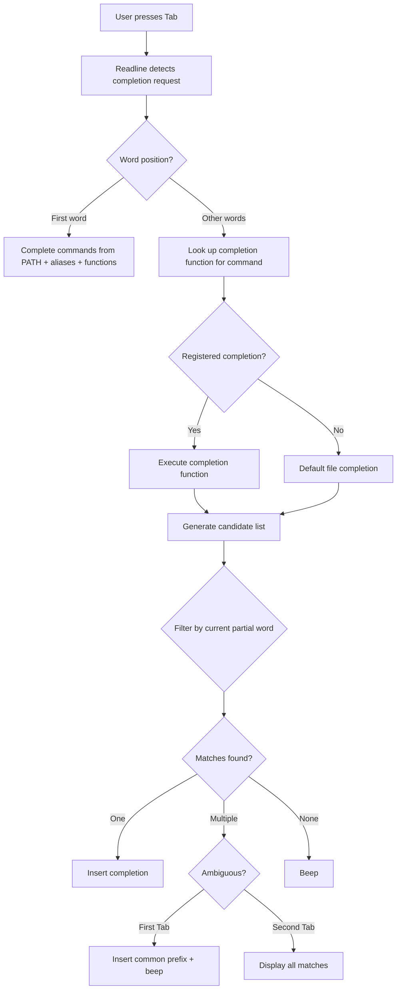

# Chapter 34: Tab Completion and Programmable Completion — complete, compgen, compdef

## Overview

Tab completion is one of the most powerful productivity features of modern shells. It reduces typing, prevents errors, and serves as a discoverability tool for commands, options, files, and arguments. Bash's programmable completion system allows developers to define custom completions for any command, making complex tools accessible and self-documenting.

Zsh takes completion further with its `compsys` framework, offering context-aware completions with descriptions, menu selection, and fuzzy matching. Fish provides automatic completions generated from man pages with no configuration needed.

Understanding programmable completion lets you build better tools and significantly speed up your command-line workflow.

## Intuition

Tab completion is like a smart autocomplete on your phone, but for the command line. When you press Tab, the shell looks at what you've typed so far and offers intelligent suggestions based on context: command names at the start of a line, file paths after commands that take files, usernames after `ssh`, branches after `git checkout`, and so on.

The power of programmable completion is that any tool can teach the shell how to complete its arguments. When you type `git checkout ` and press Tab, you see branch names — not because Bash knows about Git, but because Git's completion script teaches Bash what to show.

## Architecture



## Bash Programmable Completion

### The complete Command

The `complete` command registers completion specifications for commands.

```bash
# Basic syntax
complete [options] command

# Common options:
# -F function  → Use function to generate completions
# -G pattern   → Complete using glob pattern
# -W words     → Complete using word list
# -A action    → Complete using predefined action
# -o option    → Set completion option
# -p command   → Print existing completion for command
# -r command   → Remove completion for command
# -D           → Set default completion
# -E           → Complete for empty line
```

### Predefined Completion Actions

```bash
# -A option values:
complete -A alias      # Complete aliases
complete -A binding    # Complete Readline key binding names
complete -A builtin    # Complete shell builtins
complete -A command    # Complete commands
complete -A directory  # Complete directories
complete -A disabled   # Complete disabled shell builtins
complete -A enabled    # Complete enabled shell builtins
complete -A export     # Complete exported variables
complete -A file       # Complete files
complete -A function   # Complete shell functions
complete -A group      # Complete groups
complete -A hostname   # Complete hostnames from ~/.ssh/known_hosts
complete -A job        # Complete job names
complete -A keyword    # Complete shell keywords
complete -A running    # Complete running jobs
complete -A service    # Complete services
complete -A setopt     # Complete set options
complete -A shopt      # Complete shopt options
complete -A signal     # Complete signal names
complete -A stopped    # Complete stopped jobs
complete -A user       # Complete usernames
complete -A variable   # Complete shell variables
```

### Simple Completions

```bash
# Word list completion
complete -W "start stop restart status reload" myservice

# File completion (default for most commands)
complete -F _mycommand mycommand

# Directory-only completion
complete -A directory cd

# No file completion (for commands that don't take files)
complete -o nospace -F _mycommand mycommand

# Remove completion
complete -r mycommand
```

### Custom Completion Functions

```bash
# Define a completion function
_mycommand() {
    local cur prev opts
    COMPREPLY=()
    cur="${COMP_WORDS[COMP_CWORD]}"
    prev="${COMP_WORDS[COMP_CWORD-1]}"
    
    # Options for the command
    opts="start stop restart status logs config help"
    
    # Complete options
    if [[ ${cur} == -* ]]; then
        COMPREPLY=( $(compgen -W "--verbose --debug --config --help" -- ${cur}) )
        return 0
    fi
    
    # Context-aware completion
    case "${prev}" in
        --config)
            COMPREPLY=( $(compgen -f -X '!*.conf' -- ${cur}) )
            return 0
            ;;
        start|restart)
            COMPREPLY=( $(compgen -W "service1 service2 service3" -- ${cur}) )
            return 0
            ;;
    esac
    
    # Default: complete with opts
    COMPREPLY=( $(compgen -W "${opts}" -- ${cur}) )
}

# Register the completion function
complete -F _mycommand mycommand
```

### Completion Variables

```bash
# Variables available inside completion functions:

COMP_WORDS=()      # Array of words on the command line
COMP_CWORD=0       # Index of current word (the one being completed)
COMP_LINE=""       # The full command line
COMP_POINT=0       # Cursor position in COMP_LINE
COMPREPLY=()       # Array of completions (set this in your function)
COMP_WORDBREAKS=" \"'><=;|&("  # Word break characters

# Example: understanding COMP_WORDS
# Command line: "git checkout -b feature"
# COMP_WORDS: (git checkout -b feature)
# If cursor is on "feature": COMP_CWORD=3
```

### Advanced Completion Patterns

```bash
# Git-style subcommand completion
_deploy() {
    local cur prev subcmds
    COMPREPLY=()
    cur="${COMP_WORDS[COMP_CWORD]}"
    prev="${COMP_WORDS[COMP_CWORD-1]}"
    
    subcmds="build test deploy rollback status"
    
    # If we're completing the first argument (subcommand)
    if [[ $COMP_CWORD -eq 1 ]]; then
        COMPREPLY=( $(compgen -W "${subcmds}" -- ${cur}) )
        return 0
    fi
    
    # Subcommand-specific completion
    local subcmd="${COMP_WORDS[1]}"
    case "${subcmd}" in
        deploy)
            case "${prev}" in
                --env|-e)
                    COMPREPLY=( $(compgen -W "dev staging prod" -- ${cur}) )
                    return 0
                    ;;
                --tag|-t)
                    # Complete with git tags
                    COMPREPLY=( $(compgen -W "$(git tag 2>/dev/null)" -- ${cur}) )
                    return 0
                    ;;
            esac
            COMPREPLY=( $(compgen -W "--env --tag --force --dry-run" -- ${cur}) )
            ;;
        rollback)
            COMPREPLY=( $(compgen -W "--version --force" -- ${cur}) )
            ;;
        build)
            case "${prev}" in
                --target)
                    COMPREPLY=( $(compgen -W "linux/amd64 linux/arm64 darwin/amd64" -- ${cur}) )
                    return 0
                    ;;
            esac
            COMPREPLY=( $(compgen -W "--target --push --no-cache" -- ${cur}) )
            ;;
    esac
}
complete -F _deploy deploy
```

### Filtering Completions

```bash
# File completion with exclusion patterns
# -X pattern: exclude files matching pattern
complete -f -X '!*.@(jpg|png|gif)' view_image
complete -f -X '!*.py' python_runner
complete -f -X '!*.tar*' extract
complete -f -X '!*.@(tar|tar.gz|tar.bz2|zip|rar)' archive

# Directory completion
complete -d cd
complete -d rmdir

# Complete only directories matching pattern
_mycommand() {
    local cur
    COMPREPLY=()
    cur="${COMP_WORDS[COMP_CWORD]}"
    COMPREPLY=( $(compgen -d -W "$(ls -d /opt/*/bin 2>/dev/null)" -- ${cur}) )
}

# Complete with specific file types
complete -f -X '*.pyc' python

# Complete usernames
complete -u ssh su

# Complete groups
complete -g chgrp

# Complete variables
complete -v export set

# Complete services
complete -S service systemctl
```

### Completion Options

```bash
# -o nospace: Don't add trailing space after completion
complete -o nospace -F _mycommand mycommand

# -o default: Use default completion if function returns nothing
complete -o default -F _mycommand mycommand

# -o bashdefault: Use bash default completion
complete -o bashdefault -F _mycommand mycommand

# -o dirnames: Complete directory names
complete -o dirnames -F _mycommand mycommand

# -o filenames: Treat completions as filenames (add / to dirs)
complete -o filenames -F _mycommand mycommand

# -o plusdirs: Complete directories and then function results
complete -o plusdirs -F _mycommand mycommand
```

### The compgen Command

`compgen` generates completion candidates programmatically.

```bash
# Generate completions for a partial word
compgen -W "start stop restart" st
# start
# stop

# Generate command completions
compgen -c bi
# bind
# builtin
# bzip2

# Generate alias completions
compgen -a

# Generate function completions
compgen -A function

# Generate variable completions
compgen -v

# Generate hostname completions
compgen -A hostname

# Generate file completions
compgen -f /etc/hos
# /etc/hostname
# /etc/hosts

# Generate directory completions
compgen -d /etc

# Combine with glob patterns
compgen -f -X '!*.py' /usr/local/bin/

# Generate completions matching a prefix
compgen -W "apple apricot banana blueberry cherry" a
# apple
# apricot

# Use in scripts
compgen -W "$(git branch --format='%(refname:short)' 2>/dev/null)" -- "$cur"
```

### Loading System Completions

```bash
# Enable programmable completion
# In ~/.bashrc:

# Method 1: Source directly
if [[ -f /usr/share/bash-completion/bash_completion ]]; then
    source /usr/share/bash-completion/bash_completion
fi

# Method 2: Check for the file
if ! shopt -oq posix; then
    if [[ -f /usr/share/bash-completion/bash_completion ]]; then
        . /usr/share/bash-completion/bash_completion
    elif [[ -f /etc/bash_completion ]]; then
        . /etc/bash_completion
    fi
fi

# Individual completions are usually in:
# /usr/share/bash-completion/completions/
# /etc/bash_completion.d/
```

## Zsh Completion System

Zsh has a much more powerful and comprehensive completion system (`compsys`).

### Basic Setup

```zsh
# Load completion system
autoload -Uz compinit
compinit

# Enable menu selection
zstyle ':completion:*' menu select

# Case-insensitive completion
zstyle ':completion:*' matcher-list 'm:{a-zA-Z}={A-Za-z}'

# Group matches
zstyle ':completion:*' group-name ''
zstyle ':completion:*:descriptions' format '%F{yellow}-- %d --%f'

# Cache completions
zstyle ':completion:*' use-cache on
zstyle ':completion:*' cache-path ~/.zsh/cache
```

### Writing Zsh Completions

```zsh
# ~/.config/zsh/completions/_deploy

#compdef deploy

_deploy() {
    local -a subcmds
    local -a deploy_opts
    local -a rollback_opts
    
    subcmds=(
        'build:Build the application'
        'test:Run test suite'
        'deploy:Deploy to environment'
        'rollback:Rollback to previous version'
        'status:Show deployment status'
    )
    
    _arguments -C \
        '1:command:->subcmd' \
        '*::arg:->args'
    
    case $state in
        subcmd)
            _describe 'command' subcmds
            ;;
        args)
            case $words[1] in
                build)
                    _arguments \
                        '--target[Build target platform]:platform:(linux/amd64 linux/arm64 darwin/amd64)' \
                        '--push[Push after build]' \
                        '--no-cache[Build without cache]'
                    ;;
                deploy)
                    _arguments \
                        '--env[Deployment environment]:environment:(dev staging prod)' \
                        '--tag[Deployment tag]:tag:->tags' \
                        '--force[Force deployment]' \
                        '--dry-run[Simulate deployment]'
                    
                    case $state in
                        tags)
                            local -a tags
                            tags=(${(f)"$(git tag 2>/dev/null)"})
                            _describe 'tag' tags
                            ;;
                    esac
                    ;;
                rollback)
                    _arguments \
                        '--version[Version to rollback to]:version:' \
                        '--force[Force rollback]'
                    ;;
                test)
                    _arguments \
                        '--suite[Test suite]:suite:(unit integration e2e all)' \
                        '--verbose[Verbose output]' \
                        '--coverage[Generate coverage report]'
                    ;;
                status)
                    _arguments \
                        '--format[Output format]:format:(text json yaml)' \
                        '--watch[Watch for changes]'
                    ;;
            esac
            ;;
    esac
}

_deploy "$@"
```

### Installing Zsh Completions

```zsh
# Place completion files in:
# ~/.config/zsh/completions/ (user)
# /usr/share/zsh/functions/Completion/ (system)

# Add to .zshrc:
fpath=(~/.config/zsh/completions $fpath)
autoload -Uz compinit && compinit

# Or use Oh My Zsh plugins for common completions
# plugins=(docker kubectl git ...)
```

## Fish Completions

Fish generates completions automatically from man pages and supports easy custom completions.

```fish
# ~/.config/fish/completions/deploy.fish

# Simple completions
complete -c deploy -n "__fish_use_subcommand" -a build -d "Build the application"
complete -c deploy -n "__fish_use_subcommand" -a test -d "Run test suite"
complete -c deploy -n "__fish_use_subcommand" -a deploy -d "Deploy to environment"
complete -c deploy -n "__fish_use_subcommand" -a rollback -d "Rollback to previous version"

# Option completions
complete -c deploy -n "__fish_seen_subcommand_from deploy" -l env -d "Environment" -xa "dev staging prod"
complete -c deploy -n "__fish_seen_subcommand_from deploy" -l tag -d "Tag"
complete -c deploy -n "__fish_seen_subcommand_from deploy" -l force -d "Force deployment"
complete -c deploy -n "__fish_seen_subcommand_from deploy" -l dry-run -d "Simulate"

complete -c deploy -n "__fish_seen_subcommand_from build" -l target -d "Target platform" -xa "linux/amd64 linux/arm64 darwin/amd64"
complete -c deploy -n "__fish_seen_subcommand_from build" -l push -d "Push after build"
complete -c deploy -n "__fish_seen_subcommand_from build" -l no-cache -d "No cache"
```

## Real-World Completion Examples

### SSH Completion with Config Parsing

```bash
# Complete SSH hosts from ~/.ssh/config and known_hosts
_ssh() {
    local cur config_hosts known_hosts
    COMPREPLY=()
    cur="${COMP_WORDS[COMP_CWORD]}"
    
    # Parse ~/.ssh/config
    if [[ -f ~/.ssh/config ]]; then
        config_hosts=$(grep -i "^Host " ~/.ssh/config | awk '{print $2}' | grep -v '\*')
    fi
    
    # Parse known_hosts
    if [[ -f ~/.ssh/known_hosts ]]; then
        known_hosts=$(cut -d' ' -f1 ~/.ssh/known_hosts | cut -d',' -f1 | sort -u)
    fi
    
    # Combine and complete
    COMPREPLY=( $(compgen -W "${config_hosts} ${known_hosts}" -- ${cur}) )
}
complete -F _ssh ssh scp sftp rsync
```

### Systemctl Completion

```bash
# Systemctl already has completions installed on most systems
# But here's a simplified version showing the pattern:
_systemctl() {
    local cur prev
    COMPREPLY=()
    cur="${COMP_WORDS[COMP_CWORD]}"
    prev="${COMP_WORDS[COMP_CWORD-1]}"
    
    case $COMP_CWORD in
        1)
            COMPREPLY=( $(compgen -W "start stop restart reload status enable disable is-active is-enabled list-units list-unit-files" -- ${cur}) )
            ;;
        2)
            case $prev in
                start|stop|restart|reload|status|enable|disable|is-active|is-enabled)
                    local units=$(systemctl list-unit-files --type=service --no-legend 2>/dev/null | awk '{print $1}')
                    COMPREPLY=( $(compgen -W "${units}" -- ${cur}) )
                    ;;
            esac
            ;;
    esac
}
complete -F _systemctl systemctl
```

## Testing Completions

```bash
# Test what completions are registered
complete -p                  # Show all registered completions
complete -p mycommand        # Show completion for specific command

# Test completion function directly
COMP_LINE="deploy --env " COMP_CWORD=2 COMP_WORDS=(deploy --env "")
_mycommand
echo "${COMPREPLY[@]}"

# Debug completion
bind 'set show-all-if-ambiguous on'
bind 'set completion-ignore-case on'
bind 'set mark-directories on'
bind 'set mark-symlinked-directories on'
```

## Common Pitfalls

### 1. Completions Not Loading

```bash
# ❌ Completion loaded before bash-completion
source ~/.bashrc  # Completion functions not available

# ✅ Load bash-completion first
if [[ -f /usr/share/bash-completion/bash_completion ]]; then
    source /usr/share/bash-completion/bash_completion
fi
# Then define custom completions
```

### 2. COMPREPLY Not Set

```bash
# ❌ Function doesn't set COMPREPLY
_mycommand() {
    local cur="${COMP_WORDS[COMP_CWORD]}"
    compgen -W "start stop" -- ${cur}  # Output goes nowhere
}

# ✅ Set COMPREPLY
_mycommand() {
    local cur="${COMP_WORDS[COMP_CWORD]}"
    COMPREPLY=( $(compgen -W "start stop" -- ${cur}) )
}
```

### 3. Missing cur Variable

```bash
# ❌ Forgetting to extract current word
_mycommand() {
    COMPREPLY=( $(compgen -W "start stop" -- ${COMP_WORDS[COMP_CWORD]}) )
}

# ✅ Extract to local variable for readability
_mycommand() {
    local cur="${COMP_WORDS[COMP_CWORD]}"
    COMPREPLY=( $(compgen -W "start stop" -- ${cur}) )
}
```

## Best Practices

1. **Use bash-completion package** — provides completions for hundreds of commands
2. **Write completions for your own tools** — makes them more usable
3. **Use context-aware completions** — different completions based on position and previous arguments
4. **Include descriptions in Zsh** — helps users discover options
5. **Use caching** — for expensive completion generation
6. **Test completions** — verify they work before deploying
7. **Install completions in standard locations** — `/usr/share/bash-completion/completions/`
8. **Use `compgen` for generating candidates** — don't reinvent the wheel
9. **Handle empty COMPREPLY gracefully** — fall back to file completion if appropriate
10. **Document completion behavior** — include examples in your tool's help

## Exercises

### Exercise 1: Basic Completion
Write a completion function for a `task` command that accepts subcommands: `add`, `list`, `complete`, `delete`, and `edit`. The `add` subcommand should accept `--priority` with values `low`, `medium`, `high`. The `delete` subcommand should complete with task IDs (1-100).

### Exercise 2: Git Branch Completion
Write a completion function for a custom `deploy` command that completes git branches for the `--branch` option and git tags for the `--tag` option.

### Exercise 3: Docker Completion Enhancement
Write a completion function for `docker exec` that:
- Completes container names as the first argument
- Completes commands available inside the container as subsequent arguments

### Exercise 4: Multi-Level Completion
Write a completion function for a `kubectl`-style command with nested subcommands:
- `resource get <resource-type> <name>`
- `resource delete <resource-type> <name>`
- `resource apply -f <file>`
Where resource types are: pods, services, deployments, configmaps

### Exercise 5: Dynamic Completion
Write a completion function that queries an API or database for completion candidates (e.g., completing AWS EC2 instance IDs by running `aws ec2 describe-instances`).

## References

- [Bash Manual: Programmable Completion](https://www.gnu.org/software/bash/manual/bash.html#Programmable-Completion)
- [Bash Manual: Programmable Completion Builtins](https://www.gnu.org/software/bash/manual/bash.html#Programmable-Completion-Builtins)
- [Zsh Manual: Completion System](https://zsh.sourceforge.io/Doc/Release/Completion-System.html)
- [Fish Manual: Completions](https://fishshell.com/docs/current/completions.html)
- [bash-completion Project](https://github.com/scop/bash-completion)
- [Writing Bash Completions](https://www.debian-administration.org/article/316/An_introduction_to_bash_completion_part_1)
- [Zsh Completion System Tutorial](https://zsh.sourceforge.io/Guide/zshguide06.html)
