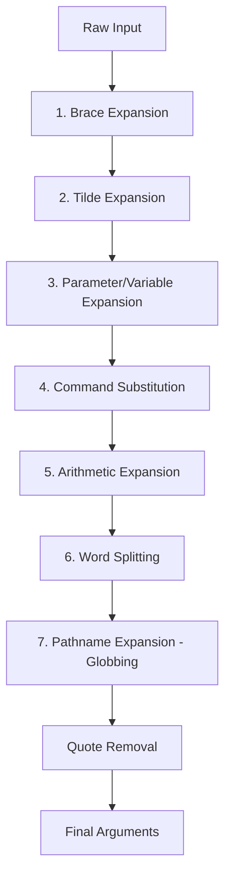

# Chapter 35: Shell Expansion — Globbing, Brace, Tilde, Variable, Command, Arithmetic, Pathname

## Overview

Shell expansion is the process by which the shell transforms your input before executing it. When you type a command, the shell doesn't simply pass your text to the kernel — it applies a series of expansions that can generate, modify, and filter the words on your command line. Understanding expansion order and behavior is essential for writing correct shell scripts and avoiding subtle bugs.

There are seven types of expansion in POSIX shells, applied in a specific order. Each type serves a different purpose, from simple variable substitution to complex pattern matching. The order matters because earlier expansions can affect later ones.

## Intuition

Think of shell expansion as a pipeline of text processors. Your command line enters at one end, and each processor transforms it in some way: brace expansion generates combinations, tilde expansion expands `~` to your home directory, variable expansion substitutes `$VAR` with its value, and so on. By the time the pipeline finishes, your simple command has become a fully resolved set of arguments ready for execution.

The key insight is that these expansions happen BEFORE the command runs. The command never sees `$HOME` or `*.txt` — it sees `/home/user` and `file1.txt file2.txt`. This is both powerful (you can compose expansions) and dangerous (unexpected expansion can break commands).

## Expansion Order



**Important**: This order is fixed and cannot be changed. Understanding it prevents bugs where one expansion interferes with another.

## 1. Brace Expansion

Brace expansion generates strings from patterns. It happens FIRST, before any other expansion.

### Basic Patterns

```bash
# Simple list
echo {one,two,three}
# one two three

# Numeric range
echo {1..10}
# 1 2 3 4 5 6 7 8 9 10

# Character range
echo {a..z}
# a b c d e f g h i j k l m n o p q r s t u v w x y z

# With increment (Bash 4+)
echo {0..20..5}
# 0 5 10 15 20

# Reverse range
echo {10..1}
# 10 9 8 7 6 5 4 3 2 1

# Zero-padded ranges
echo {01..10}
# 01 02 03 04 05 06 07 08 09 10

# Nested braces
echo {a,b{1,2,3},c}
# a b1 b2 b3 c

# Cross product (combination)
echo {a,b}{1,2}
# a1 a2 b1 b2

# String concatenation
echo file{1..3}.txt
# file1.txt file2.txt file3.txt

# Practical uses
mkdir -p project/{src,lib,bin,doc,test}
mkdir -p backup/{2024,2025}/{01..12}
cp file.txt{,.bak}
mv file.{txt,md}
touch file{A..Z}.txt
```

### Brace Expansion Limitations

```bash
# ❌ Brace expansion does NOT work with variables
n=5
echo {1..$n}    # {1..$n} (literal — not expanded)

# ❌ Brace expansion does NOT work in quotes
echo "{1,2,3}"  # {1,2,3} (literal)

# ❌ Brace expansion is NOT globbing
echo {*.txt}    # Does not glob — just passes *.txt to later expansion

# ✅ Brace expansion generates text, then other expansions process it
echo {a,b}*     # a* b* → then globbing expands a* and b*
```

## 2. Tilde Expansion

Tilde expansion replaces `~` with home directory paths.

```bash
# Current user's home
echo ~
# /home/user

# Specific user's home
echo ~root
# /root

echo ~postgres
# /var/lib/postgresql

# Tilde with path
echo ~/documents
# /home/user/documents

# ~+ is PWD (current directory)
echo ~+
# /home/user/projects

# ~- is OLDPWD (previous directory)
echo ~-
# /tmp

# Tilde in assignments (only at start, unquoted)
dir=~/projects    # ✅ Expanded
dir="~/projects"  # ❌ Not expanded (in quotes)
dir=~/docs/~/foo  # Only first ~ expanded

# Tilde in PATH-like variables
PATH=~/bin:$PATH  # ✅ ~ expanded
```

### When Tilde Expansion Does NOT Happen

```bash
# ❌ In double quotes
echo "~"          # Prints literal ~
echo "~user"      # Prints literal ~user

# ❌ In the middle of a word
echo /foo/~bar    # Literal

# ❌ With variables
dir=~/$subdir     # ~ expanded, but $subdir is variable expansion (order matters)

# ❌ In here-docs (behavior varies)
cat <<EOF
~  # May or may not be expanded depending on shell
EOF
```

## 3. Parameter/Variable Expansion

Variable expansion substitutes `$VAR` with its value. This is the most commonly used expansion.

### Basic Expansion

```bash
# Simple variable
name="Linux"
echo "$name"       # Linux
echo "${name}"     # Linux (braces for clarity)

# Positional parameters
echo "$1"          # First argument
echo "$@"          # All arguments
echo "$#"          # Number of arguments

# Special parameters
echo "$$"          # Current shell PID
echo "$!"          # PID of last background process
echo "$?"          # Exit status of last command
echo "$-"          # Current shell options
echo "$0"          # Shell/script name
```

### Parameter Expansion Modifiers

```bash
var="Hello, World! file.tar.gz"

# ── Length ─────────────────────────────────────────────
echo "${#var}"             # 24 (string length)

arr=(one two three)
echo "${#arr[@]}"          # 3 (array length)
echo "${#arr[0]}"          # 3 (length of first element)

# ── Default Values ─────────────────────────────────────
echo "${undefined:-default}"     # default (if unset or empty)
echo "${undefined:=default}"     # default, and assigns to undefined
echo "${undefined:?error msg}"   # Error if unset or empty
echo "${undefined:+alternate}"   # alternate if set and non-empty

# With set -u (nounset):
# ${undefined} → error
# ${undefined:-default} → default (safe)

# ── Pattern Removal ────────────────────────────────────
filepath="/home/user/docs/file.tar.gz"

# Remove shortest prefix matching pattern
echo "${filepath#*/}"            # home/user/docs/file.tar.gz

# Remove longest prefix matching pattern
echo "${filepath##*/}"           # file.tar.gz

# Remove shortest suffix matching pattern
echo "${filepath%/*}"            # /home/user/docs

# Remove longest suffix matching pattern
echo "${filepath%%.*}"           # /home/user/docs/file

# ── Search and Replace ────────────────────────────────
text="foo bar foo baz foo"

# Replace first occurrence
echo "${text/foo/FOO}"           # FOO bar foo baz foo

# Replace all occurrences
echo "${text//foo/FOO}"          # FOO bar FOO baz FOO

# Replace at beginning
echo "${text/#foo/FOO}"          # FOO bar foo baz foo

# Replace at end
echo "${text/%foo/FOO}"          # foo bar foo baz FOO

# ── Case Modification (Bash 4+) ───────────────────────
str="Hello World"

echo "${str^^}"                  # HELLO WORLD (all uppercase)
echo "${str,,}"                  # hello world (all lowercase)
echo "${str^}"                   # Hello World (first char uppercase)
echo "${str,}"                   # hello World (first char lowercase)
echo "${str~~}"                  # hELLO wORLD (swap case)

# Pattern-based case modification
echo "${str^^[h]}"               # Hello World (only H uppercase)
echo "${str,,[HW]}"              # hello world

# ── Substring ─────────────────────────────────────────
str="Hello, World!"

echo "${str:0:5}"                # Hello (offset 0, length 5)
echo "${str:7}"                  # World! (offset 7 to end)
echo "${str: -6}"                # World! (last 6 chars, note space before -)
echo "${str:(-6)}"               # World! (same, with parentheses)

# ── Variable Indirection ──────────────────────────────
varname="HOME"
echo "${!varname}"               # /home/user (indirect reference)

# ── Variable Type Info (Bash 4.3+) ────────────────────
declare -i num=42
echo "${num@A}"                  # declare -i num="42"
echo "${num@a}"                  # i (attribute flags)
echo "${num@Q}"                  # '42' (quoted for reuse)
echo "${num@E}"                  # 42 (escape sequences expanded)
echo "${num@P}"                  # 42 (prompt expansion)
```

### Array Expansion

```bash
arr=("apple pie" "banana split" "cherry tart")

# All elements
echo "${arr[@]}"         # apple pie banana split cherry tart

# Individual elements (double-quoted preserves spaces)
echo "${arr[@]}"         # "apple pie" "banana split" "cherry tart"

# Slice
echo "${arr[@]:1:2}"     # banana split cherry tart

# Indices
echo "${!arr[@]}"        # 0 1 2

# Length
echo "${#arr[@]}"        # 3

# Append
arr+=("date cake")

# ❌ Without quotes: word splitting on each element
for item in ${arr[@]}; do echo "$item"; done
# apple
# pie
# banana
# split
# ...

# ✅ With quotes: each element preserved
for item in "${arr[@]}"; do echo "$item"; done
# apple pie
# banana split
# cherry tart
```

## 4. Command Substitution

Command substitution replaces `$(command)` or `` `command` `` with its output.

```bash
# Modern syntax (preferred)
today=$(date +%Y-%m-%d)
files=$(ls)
line_count=$(wc -l < file.txt)

# Backtick syntax (legacy, harder to nest)
today=`date +%Y-%m-%d`

# Nesting (only works with $() syntax)
outer=$(echo "inner: $(hostname)")

# Preserve newlines (quote the substitution)
content=$(cat file.txt)        # Newlines preserved in quotes
echo "$content"

# Without quotes: newlines become spaces
echo $(cat file.txt)           # All on one line

# Command substitution in arithmetic
result=$(( $(wc -l < file1.txt) + $(wc -l < file2.txt) ))

# Process substitution (related but different)
diff <(sort file1) <(sort file2)
```

## 5. Arithmetic Expansion

Arithmetic expansion evaluates mathematical expressions.

```bash
# Basic arithmetic
echo $((2 + 3))         # 5
echo $((10 - 4))        # 6
echo $((3 * 7))         # 21
echo $((20 / 4))        # 5
echo $((17 % 5))        # 2 (modulo)
echo $((2 ** 10))       # 1024 (exponentiation)

# Variables (no $ needed inside $(()))
a=10; b=3
echo $((a + b))         # 13
echo $((a * b))         # 30

# Increment/decrement
echo $((a++))           # 10 (returns old value, a is now 11)
echo $((++a))           # 12 (returns new value)
echo $((a--))           # 12
echo $((--a))           # 10

# Comparison (returns 0 for true, 1 for false)
((a > b)) && echo "a is greater"
((a == 10)) && echo "a is 10"
((a != b)) && echo "a != b"

# Logical operators
((a > 5 && b < 10)) && echo "both true"
((a > 5 || b > 10)) && echo "at least one true"
((!(a > 5))) && echo "not true"

# Bitwise operations
echo $((0xFF))          # 255
echo $((a << 2))        # 40 (left shift)
echo $((a >> 1))        # 5 (right shift)
echo $((a & 0xF))       # 10 (AND)
echo $((a | 0xF))       # 15 (OR)
echo $((a ^ 0xF))       # 5 (XOR)
echo $((~a))            # -11 (NOT)

# Ternary operator
echo $((a > b ? a : b)) # 10

# Assignment
((result = a + b))
echo "$result"

# Base conversion
echo $((16#FF))         # 255 (hex to decimal)
echo $((2#1010))        # 10 (binary to decimal)
echo $((8#77))          # 63 (octal to decimal)

# printf for formatting
printf "%x\n" 255       # ff (decimal to hex)
printf "%o\n" 255       # 377 (decimal to octal)
printf "%b\n" 2#1010    # 10 (binary representation)
```

## 6. Word Splitting

Word splitting divides unquoted expansion results into separate words based on the `IFS` variable.

```bash
# Default IFS: space, tab, newline
IFS=$' \t\n'

# Word splitting happens on unquoted:
# - Variable expansion: $var
# - Command substitution: $(command)
# - Arithmetic expansion: $(( ))

# ❌ Unquoted variable: word splitting occurs
var="one two three"
for word in $var; do
    echo "[$word]"
done
# [one]
# [two]
# [three]

# ✅ Quoted variable: no word splitting
for word in "$var"; do
    echo "[$word]"
done
# [one two three]

# ❌ Unquoted command substitution
files=$(ls *.txt)
for f in $files; do    # Splits on spaces in filenames!
    echo "$f"
done

# ✅ Quoted command substitution
files=$(ls *.txt)
for f in $files; do
    echo "$f"
done

# Custom IFS
IFS=: read -ra parts <<< "one:two:three"
echo "${parts[0]}"    # one

# Temporarily change IFS
old_ifs="$IFS"
IFS=$'\n'
for line in $(cat file.txt); do
    echo "$line"
done
IFS="$old_ifs"
```

## 7. Pathname Expansion (Globbing)

Pathname expansion (globbing) matches filenames using patterns.

### Basic Glob Patterns

```bash
# * — Matches any string (including empty)
ls *.txt            # All .txt files
ls *                 # All files
ls file*             # Files starting with "file"
ls *.tar.gz          # All .tar.gz files

# ? — Matches any single character
ls file?.txt         # file1.txt, fileA.txt, etc.
ls file??.txt        # file12.txt, fileAB.txt, etc.

# [...] — Character class
ls file[0-9].txt     # file0.txt through file9.txt
ls file[abc].txt     # filea.txt, fileb.txt, filec.txt
ls file[a-z].txt     # filea.txt through filez.txt
ls file[!0-9].txt    # Not a digit
ls file[^0-9].txt    # Same as above

# Special character classes
ls *[[:alpha:]]*     # Files containing a letter
ls *[[:digit:]]*     # Files containing a digit
ls *[[:space:]]*     # Files containing whitespace
ls *[[:upper:]]*     # Files containing uppercase
ls *[[:lower:]]*     # Files containing lowercase
```

### Extended Globbing (Bash: shopt -s extglob)

```bash
# Enable extended globbing
shopt -s extglob

# ?(pattern) — Match 0 or 1 times
ls file?(.txt)       # file, file.txt

# *(pattern) — Match 0 or more times
ls file*(.txt)       # file, file.txt, file.txt.txt, ...

# +(pattern) — Match 1 or more times
ls +([0-9])          # Files that are all digits

# @(pattern) — Match exactly one
ls @(file|data).*    # file.* or data.*

# !(pattern) — Match anything except
ls !(*.txt)          # Everything except .txt files
ls !(file).*         # Everything not starting with "file"
```

### Recursive Globbing (Bash 4+: shopt -s globstar)

```bash
# Enable recursive globbing
shopt -s globstar

# ** — Matches any number of directory levels
ls **/*.txt          # All .txt files recursively
ls **/Makefile       # All Makefiles recursively
ls **/*.py           # All Python files recursively

# Combined with other patterns
ls **/test/**/*.py   # All .py files under any test directory
ls **/*.{js,ts}      # All .js and .ts files recursively
```

### Globbing Behavior

```bash
# Default: if no match, keep the literal pattern
echo *.nonexistent   # *.nonexistent (no match)

# With nullglob: if no match, expand to nothing
shopt -s nullglob
echo *.nonexistent   # (empty)

# With failglob: if no match, error
shopt -s failglob
echo *.nonexistent   # bash: no match: *.nonexistent

# With dotglob: include dotfiles
shopt -s dotglob
ls *                 # Includes .hidden files

# With nocaseglob: case-insensitive
shopt -s nocaseglob
ls *.TXT             # Matches .txt, .Txt, .TXT, etc.

# Quote to prevent globbing
echo "*.txt"         # Literal *.txt
echo '*.txt'         # Literal *.txt
echo \*.txt          # Literal *.txt
```

## Expansion Order Interactions

### Common Gotchas

```bash
# 1. Brace expansion happens before variable expansion
var="a,b"
echo {$var}          # {a,b} (brace expansion already happened)

# 2. Tilde expansion before variable expansion
dir="~/projects"
echo "$dir"          # ~/projects (tilde not expanded in quotes)
echo ~/"$dir"        # Wrong: ~ expanded but $dir is literal

# 3. Variable expansion before globbing
pattern="*.txt"
echo $pattern        # *.txt expanded by globbing (lists .txt files)
echo "$pattern"      # Literal *.txt (quotes prevent globbing)

# 4. Command substitution before word splitting
echo "$(ls *.txt)"   # Newlines preserved (quoted)
echo $(ls *.txt)     # Newlines become spaces (word splitting)

# 5. Arithmetic before word splitting
echo $((2 + 3))      # 5 (single word)
```

### Safe Practices

```bash
# Always quote variables to prevent word splitting and globbing
echo "$var"
echo "${arr[@]}"

# Use arrays for lists of files
files=(*.txt)
for f in "${files[@]}"; do
    echo "$f"
done

# Use find for complex file selection instead of globbing
find . -name "*.txt" -mtime -7 -type f

# Use read -r for safe line reading
while IFS= read -r line; do
    echo "$line"
done < file.txt
```

## Common Pitfalls

### 1. Globbing on Empty Results

```bash
# ❌ No .txt files: glob expands to literal "*.txt"
rm *.nonexistent     # Tries to remove a file named "*.nonexistent"

# ✅ Use nullglob
shopt -s nullglob
files=(*.txt)
if [[ ${#files[@]} -eq 0 ]]; then
    echo "No .txt files found"
fi
```

### 2. Word Splitting on Filenames with Spaces

```bash
# ❌ Filenames with spaces break
for f in $(ls *.txt); do    # Splits on spaces!
    echo "$f"
done

# ✅ Use glob directly
for f in *.txt; do
    [[ -f "$f" ]] && echo "$f"
done
```

### 3. Command Substitution Trailing Newlines

```bash
# Command substitution strips trailing newlines
var=$(printf "hello\n\n\n")
echo "${#var}"    # 5 (newlines stripped)

# Preserve with quoting trick
var=$(printf "hello\n\n\n"; echo x)
var="${var%x}"
echo "${#var}"    # 8 (newlines preserved)
```

## Best Practices

1. **Quote all variable references** — `"$var"` not `$var`
2. **Use `$(command)` not backticks** — nestable and readable
3. **Understand expansion order** — prevents subtle bugs
4. **Use arrays for file lists** — handles spaces correctly
5. **Enable `nullglob`** — prevents glob-with-no-match issues
6. **Use `extglob` for complex patterns** — more expressive than basic glob
7. **Use `**` for recursive operations** — but consider `find` for complex criteria
8. **Be careful with `eval`** — it re-processes expansions
9. **Test with filenames containing spaces** — common source of bugs
10. **Use `set -u` to catch unset variables** — catches typos

## Exercises

### Exercise 1: Brace Expansion
Using only brace expansion, generate:
- All months of the year with zero-padded numbers (01-12)
- All combinations of colors (red, green, blue) and sizes (S, M, L, XL)
- A set of backup directories for the last 12 months

### Exercise 2: Parameter Expansion
Given `filepath="/home/user/documents/report.tar.gz"`, extract:
- The directory path
- The filename
- The filename without extension
- The extension
- The filename with `.tar.gz` replaced by `.zip`

### Exercise 3: Expansion Order
Predict the output of these commands without running them:
```bash
var="a b"
echo {1,2,3}
echo $var
echo "$var"
echo ~/$var
echo $(echo hello)
echo $((2 + 3))
```

### Exercise 4: Safe Globbing
Write a script that:
- Enables `nullglob` and `dotglob`
- Lists all `.conf` files in `/etc` recursively
- Handles the case where no files match
- Handles filenames with spaces correctly

### Exercise 5: Arithmetic
Write a script that uses arithmetic expansion to:
- Convert a decimal number to binary, octal, and hex
- Calculate factorial of a number
- Find the greatest common divisor of two numbers

## References

- [Bash Manual: Shell Expansions](https://www.gnu.org/software/bash/manual/bash.html#Shell-Expansions)
- [POSIX: Word Expansions](https://pubs.opengroup.org/onlinepubs/9699919799/utilities/V3_chap02.html#tag_18_06)
- [Bash Hackers: Expansion](https://wiki.bash-hackers.org/syntax/expansion/intro)
- [Greg's Wiki: WordSplitting](https://mywiki.wooledge.org/WordSplitting)
- [Greg's Wiki: FilenameExpansion](https://mywiki.wooledge.org/PathnameExpansion)
- [Greg's Wiki: BashPitfalls](https://mywiki.wooledge.org/BashPitfalls)
