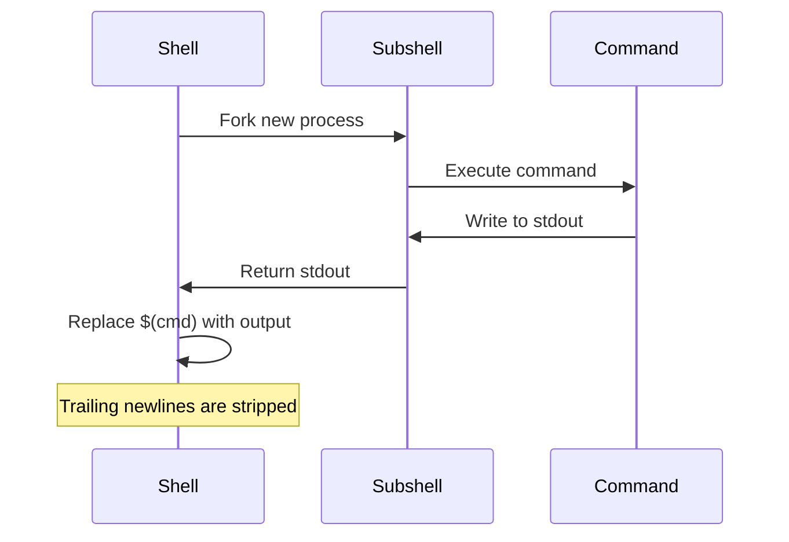
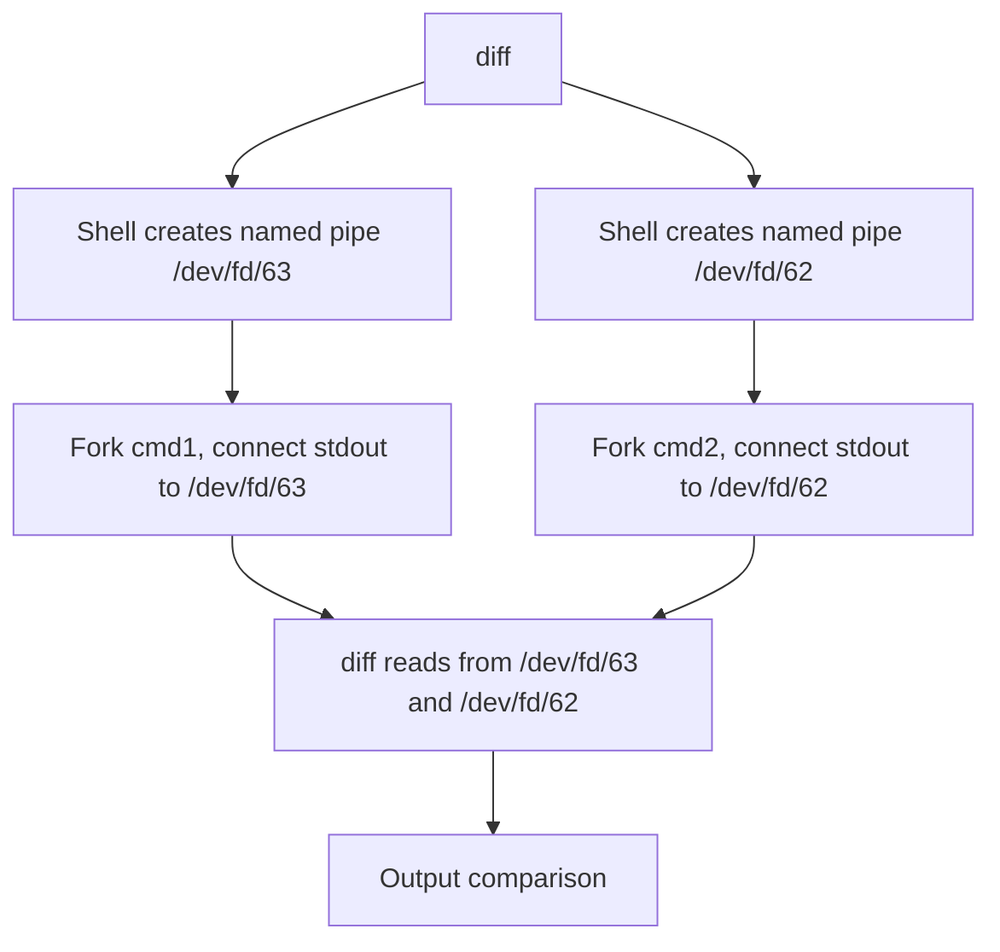

# Chapter 37: Substitution — Command Substitution $(), Process Substitution <(), Arithmetic $(())

## Overview

Substitution is the mechanism by which the shell replaces part of a command line with the result of some computation. There are three types of substitution in Bash:

- **Command substitution** (`$(command)` or `` `command` ``): Replaces with the output of a command
- **Process substitution** (`<(command)` or `>(command)`): Replaces with a filename connected to a command's I/O
- **Arithmetic substitution** (`$((expression))` or `$[expression]`): Replaces with the result of a mathematical expression

Understanding these substitutions is essential for composing complex commands, passing data between programs, and performing calculations within the shell.

## Intuition

Think of substitution as the shell's way of saying "compute this first, then use the result." Command substitution runs a program and captures its output. Process substitution creates a temporary virtual file connected to a program's input or output. Arithmetic substitution evaluates a mathematical expression and returns the result.

The key difference between command and process substitution: command substitution captures output as a string (like copying), while process substitution provides a live connection to a process's I/O (like a pipe disguised as a file).

## Architecture

```mermaid
graph TD
    A[Command Line] --> B{Substitution Type?}
    B -->|$(cmd) or `cmd`| C[Command Substitution]
    B -->|<(cmd) or >(cmd)| D[Process Substitution]
    B -->|$((expr))| E[Arithmetic Substitution]
    
    C --> C1[Fork subshell]
    C1 --> C2[Execute command]
    C2 --> C3[Capture stdout]
    C3 --> C4[Replace $(cmd) with output]
    
    D --> D1[Create named pipe or /dev/fd]
    D1 --> D2[Fork process]
    D2 --> D3[Connect pipe to process stdin/stdout]
    D3 --> D4[Replace <(cmd) with /dev/fd/N]
    
    E --> E1[Evaluate expression]
    E1 --> E2[Replace $((expr)) with result]
```

## Command Substitution

### Basic Syntax

```bash
# Modern syntax: $(command)
today=$(date +%Y-%m-%d)
echo "Today is $today"

# Legacy syntax: `command` (backticks)
today=`date +%Y-%m-%d`
echo "Today is $today"

# Nesting (only with $() syntax)
outer=$(echo "inner: $(hostname)")
# ❌ Nesting with backticks is ugly and error-prone:
# outer=`echo "inner: \`hostname\`"`

# Multi-line output
files=$(ls -la)
echo "$files"

# Command substitution in assignments
count=$(wc -l < file.txt)
dir=$(dirname /path/to/file.txt)
name=$(basename /path/to/file.txt)
```

### How It Works



### Key Behaviors

```bash
# 1. Trailing newlines are stripped
var=$(printf "hello\n\n\n")
echo "${#var}"    # 5 (newlines removed)

# 2. Output is subject to word splitting (if unquoted)
var=$(echo "one two three")
for word in $var; do    # Three iterations
    echo "$word"
done

# 3. Output preserves internal newlines (when quoted)
var=$(printf "one\ntwo\nthree")
echo "$var"
# one
# two
# three

# 4. Command substitution runs in a subshell
count=0
echo "$(count=5)"    # count is still 0 in parent
echo "$count"         # 0

# 5. Exit status is the exit status of the command
if $(true); then echo "OK"; fi
if $(false); then echo "Not reached"; fi
```

### Practical Examples

```bash
# File operations
backup_dir="backup_$(date +%Y%m%d_%H%M%S)"
mkdir "$backup_dir"

# System information
hostname=$(hostname)
kernel=$(uname -r)
uptime=$(uptime -p)

# Counting
file_count=$(find . -type f | wc -l)
line_count=$(wc -l < script.sh)

# Conditional execution
if [[ $(id -u) -eq 0 ]]; then
    echo "Running as root"
fi

# Command output in strings
echo "Host: $(hostname), Date: $(date +%F)"

# Capturing multiline output into an array (Bash)
mapfile -t lines < <(find . -name "*.txt")
# Or
IFS=$'\n' read -d '' -ra lines < <(find . -name "*.txt")

# Subshell for directory operations
original_dir=$(pwd)
(cd /tmp && ls)    # cd doesn't affect parent
echo "Still in: $original_dir"

# Using command substitution for file content
content=$(<file.txt)    # More efficient than $(cat file.txt)

# Command substitution in conditionals
if [[ $(grep -c "error" log.txt) -gt 0 ]]; then
    echo "Errors found"
fi
```

### Performance Considerations

```bash
# ❌ External command when builtin suffices
name=$(basename "$path")    # Forks a process
name="${path##*/}"           # Pure parameter expansion

# ❌ cat in command substitution
content=$(cat file.txt)     # Forks cat
content=$(<file.txt)        # Bash builtin, no fork

# ❌ Useless use of echo
result=$(echo "$var" | tr 'a-z' 'A-Z')
result="${var^^}"            # Pure Bash (4+)

# ✅ Use builtins when possible
length=${#var}              # Instead of $(echo -n "$var" | wc -c)
```

## Process Substitution

Process substitution creates a temporary file-like interface connected to a command's input or output. It's available in Bash, Zsh, and ksh, but NOT in POSIX sh or Dash.

### Input Process Substitution <()

```bash
# <(command) creates a readable file descriptor
# The command's output can be read from this "file"

# Compare output of two commands
diff <(ls /dir1) <(ls /dir2)

# Compare sorted files without creating temp files
diff <(sort file1.txt) <(sort file2.txt)

# Feed command output to a program that expects a file
wc -l <(find . -name "*.txt")

# Multiple inputs
paste <(cut -f1 file1) <(cut -f2 file2)

# Using with while read
while read -r line; do
    echo "Got: $line"
done < <(grep "pattern" file.txt)

# Nested process substitution
diff <(sort <(cat file1)) <(sort <(cat file2))
```

### Output Process Substitution >()

```bash
# >(command) creates a writable file descriptor
# Data written to this "file" is sent to the command's stdin

# Send output to two places simultaneously
echo "Hello" | tee >(gzip > output.gz) >(cat > output.txt)

# Log to file while processing
while read -r line; do
    echo "$line" > >(tee -a log.txt)
    echo "Processed: $line"
done < input.txt

# Write to multiple files
echo "data" | tee >(head -n5 > first5.txt) >(tail -n5 > last5.txt) > /dev/null
```

### How Process Substitution Works



On Linux, process substitution uses `/dev/fd/` file descriptors (named pipes or `/proc/self/fd/`). On some systems, it uses named pipes in `/tmp`.

### Practical Examples

```bash
# Database comparison
diff <(mysql -e "SELECT * FROM db1.table") \
     <(mysql -e "SELECT * FROM db2.table")

# Compare remote files
diff <(ssh host1 cat /etc/config) <(ssh host2 cat /etc/config)

# Merge sorted outputs
sort -m <(sort file1) <(sort file2) <(sort file3)

# Feed multiple files to a program
cat <(head -n5 file1) <(head -n5 file2)

# Redirect stderr to a command
command 2> >(tee error.log >&2)

# Capture both stdout and stderr separately
{ stdout=$(command); } 2> >(stderr=$(cat); )
# Note: stderr capture may not work as expected due to subshell

# Using with comm (compare sorted files)
comm <(sort file1) <(sort file2)

# Using with grep across multiple sources
grep "pattern" <(cat file1) <(cat file2)

# Using with awk
awk '{print NR, $0}' <(tac file.txt)
```

### Process Substitution vs Pipes

```bash
# ❌ Pipes create subshells for each command after the first
count=0
cat file.txt | while read -r line; do
    ((count++))
done
echo "$count"    # 0! (count was incremented in subshell)

# ✅ Process substitution runs the while loop in the current shell
count=0
while read -r line; do
    ((count++))
done < <(cat file.txt)
echo "$count"    # Correct!

# ❌ Pipes can't feed multiple inputs to one command
diff <(sort file1) <(sort file2)
# Can't do: sort file1 | sort file2 | diff  (doesn't work)

# ✅ Process substitution can
diff <(sort file1) <(sort file2)
```

### Limitations

```bash
# ❌ Not available in POSIX sh / Dash
#!/bin/sh
diff <(sort file1) <(sort file2)    # Syntax error!

# ✅ Use temporary files instead
#!/bin/sh
sort file1 > /tmp/sorted1.$$
sort file2 > /tmp/sorted2.$$
diff /tmp/sorted1.$$ /tmp/sorted2.$$
rm -f /tmp/sorted1.$$ /tmp/sorted2.$$

# ❌ Not available in all shells
# Bash, Zsh, ksh: ✅
# Dash, Ash, BusyBox sh: ❌
# Fish: Uses (command) pipe syntax instead
```

## Arithmetic Substitution

Arithmetic substitution evaluates mathematical expressions and returns the result.

### Basic Syntax

```bash
# $((expression))
echo $((2 + 3))         # 5
echo $((10 * 5))        # 50
echo $((100 / 7))       # 14 (integer division)
echo $((2 ** 10))       # 1024

# Variables (no $ needed inside)
a=10; b=3
echo $((a + b))         # 13
echo $((a * b))         # 30

# $[expression] (deprecated, don't use)
echo $[2 + 3]           # 5 (works but not recommended)
```

### Operators

```bash
# Arithmetic
echo $((a + b))         # Addition
echo $((a - b))         # Subtraction
echo $((a * b))         # Multiplication
echo $((a / b))         # Integer division
echo $((a % b))         # Modulo (remainder)
echo $((a ** b))        # Exponentiation

# Increment/Decrement
echo $((a++))           # Post-increment (returns old value)
echo $((++a))           # Pre-increment (returns new value)
echo $((a--))           # Post-decrement
echo $((--a))           # Pre-decrement

# Comparison (returns 0=true, 1=false)
((a == b)) && echo "equal"
((a != b)) && echo "not equal"
((a > b))  && echo "greater"
((a < b))  && echo "less"
((a >= b)) && echo "greater or equal"
((a <= b)) && echo "less or equal"

# Logical
((a > 0 && b > 0)) && echo "both positive"
((a > 0 || b > 0)) && echo "at least one positive"
((! (a > b)))      && echo "a not greater than b"

# Bitwise
echo $((a & b))         # AND
echo $((a | b))         # OR
echo $((a ^ b))         # XOR
echo $((~a))            # NOT
echo $((a << 2))        # Left shift
echo $((a >> 1))        # Right shift

# Ternary
echo $((a > b ? a : b)) # Max of a and b

# Assignment
((result = a + b))
((result += 5))
((result -= 2))
((result *= 3))
((result /= 2))
((result %= 7))
((result &= 0xFF))
((result |= 0x80))
((result <<= 2))
((result >>= 1))
```

### Base Conversion

```bash
# Input in different bases
echo $((16#FF))         # 255 (hex)
echo $((2#1010))        # 10 (binary)
echo $((8#77))          # 63 (octal)
echo $((36#ZZ))         # 1295 (base 36)

# With variables
hex="FF"
echo $((16#$hex))       # 255

# Output in different bases (using printf)
printf "%x\n" 255       # ff (hex)
printf "%o\n" 255       # 377 (octal)
printf "%b\n" "2#1010"  # 10 (binary)

# Convert hex to decimal
echo $((16#DEADBEEF))   # 3735928559

# Convert decimal to binary
dec=42
binary=""
temp=$dec
while ((temp > 0)); do
    binary="$((temp % 2))$binary"
    ((temp /= 2))
done
echo "$dec in binary: $binary"    # 101010
```

### Arithmetic Command (( ))

```bash
# Arithmetic command — similar to $(( )) but as a standalone command
# Returns exit status: 0 if expression is non-zero, 1 if zero

# Test conditions
((a > b)) && echo "a is greater"
((a == 0)) && echo "a is zero"

# Increment
((count++))
((count += 5))

# In loops
for ((i = 0; i < 10; i++)); do
    echo "$i"
done

# While with arithmetic
while ((count > 0)); do
    echo "$count"
    ((count--))
done

# C-style for loop
for ((i = 0, j = 10; i < j; i++, j--)); do
    echo "i=$i, j=$j"
done
```

### Practical Examples

```bash
# Calculate percentage
total=100
current=75
pct=$((current * 100 / total))
echo "$pct%"    # 75%

# Calculate with floating point (using bc)
result=$(echo "scale=2; 10 / 3" | bc)
echo "$result"  # 3.33

# Random number
echo $((RANDOM % 100 + 1))    # Random 1-100

# File size calculations
size_bytes=$(stat -c%s file.txt)
size_kb=$((size_bytes / 1024))
size_mb=$((size_kb / 1024))

# Date arithmetic
current_epoch=$(date +%s)
one_day_ago=$((current_epoch - 86400))
date -d "@$one_day_ago"

# Bit manipulation
flags=0
flags=$((flags | (1 << 0)))    # Set bit 0
flags=$((flags | (1 << 3)))    # Set bit 3
if ((flags & (1 << 0))); then
    echo "Bit 0 is set"
fi

# Check if number is even/odd
n=42
if ((n % 2 == 0)); then
    echo "$n is even"
else
    echo "$n is odd"
fi
```

## Combining Substitutions

```bash
# Command substitution inside arithmetic
count=$(($(wc -l < file1.txt) + $(wc -l < file2.txt)))

# Arithmetic inside command substitution
echo "Result: $((2 + 3))"

# Process substitution with command substitution
diff <(sort "$(find . -name '*.py' -print)") \
     <(sort "$(find . -name '*.js' -print)")

# Nested command substitution
echo "Today: $(date +%A, $(date +%B) $(date +%d))"

# Command substitution in process substitution
while read -r line; do
    echo "$line"
done < <(grep "$(hostname)" /var/log/syslog)
```

## Common Pitfalls

### 1. Command Subshell Variable Scope

```bash
# ❌ Variables set in command substitution don't persist
count=0
echo "$(count=5)"
echo "$count"    # 0

# ✅ Use a subshell or process substitution
count=0
((count = 5))
echo "$count"    # 5
```

### 2. Word Splitting in Command Substitution

```bash
# ❌ Unquoted: word splitting occurs
files=$(ls *.txt)
for f in $files; do    # Breaks on spaces in filenames
    echo "$f"
done

# ✅ Quoted: preserves whitespace
files=$(ls *.txt)
for f in $files; do
    echo "$f"
done

# ✅ Better: use glob directly
for f in *.txt; do
    echo "$f"
done
```

### 3. Process Subshell in Pipe

```bash
# ❌ Pipe creates subshell for while loop
count=0
cat file.txt | while read -r line; do
    ((count++))
done
echo "$count"    # 0!

# ✅ Use process substitution
count=0
while read -r line; do
    ((count++))
done < <(cat file.txt)
echo "$count"    # Correct!
```

### 4. Integer Overflow

```bash
# Bash integers are 64-bit signed
echo $((2**63))        # -9223372036854775808 (overflow!)

# Use bc for arbitrary precision
echo "2^64" | bc       # 18446744073709551616
```

### 5. Arithmetic with Non-Integers

```bash
# ❌ Bash arithmetic is integer only
echo $((10 / 3))       # 3, not 3.333

# ✅ Use bc for floating point
echo "scale=2; 10 / 3" | bc    # 3.33

# ✅ Or awk
awk 'BEGIN { printf "%.2f\n", 10/3 }'    # 3.33
```

## Best Practices

1. **Use `$()` not backticks** — nestable, readable, standard
2. **Quote command substitutions** — prevent word splitting
3. **Use `<()` for comparing command outputs** — no temp files needed
4. **Use `$(( ))` for integer arithmetic** — fast, no external commands
5. **Use `bc` for floating point** — `$(( ))` is integer only
6. **Prefer builtins over command substitution** — `${var##*/}` over `$(basename $var)`
7. **Use process substitution to avoid subshell issues** — variables persist
8. **Use `(( ))` for arithmetic conditions** — cleaner than `[ $a -gt $b ]`
9. **Understand trailing newline stripping** — can cause issues with binary data
10. **Check shell compatibility** — process substitution is not POSIX

## Exercises

### Exercise 1: Command Substitution
Write a script that uses command substitution to:
- Get the current user, hostname, date, and uptime
- Count files in the current directory
- Find the largest file
- Display all information in a formatted report

### Exercise 2: Process Substitution
Write a script that uses process substitution to:
- Compare the contents of two directories
- Merge three sorted files into one sorted output
- Feed the output of `find` to `grep` without a pipe

### Exercise 3: Arithmetic
Write a script that uses arithmetic substitution to:
- Calculate factorial of a number
- Convert between binary, octal, decimal, and hex
- Implement a simple calculator with +, -, *, /

### Exercise 4: Combining Substitutions
Write a script that:
- Uses command substitution to get system info
- Uses arithmetic to calculate memory usage percentage
- Uses process substitution to diff two config files
- Formats everything into a system report

### Exercise 5: Performance Comparison
Benchmark these approaches and compare:
- `$(cat file)` vs `$(<file)`
- `$(basename $path)` vs `${path##*/}`
- `$(echo $var | wc -c)` vs `${#var}`
- `expr` vs `$(( ))` for arithmetic

## References

- [Bash Manual: Command Substitution](https://www.gnu.org/software/bash/manual/bash.html#Command-Substitution)
- [Bash Manual: Process Substitution](https://www.gnu.org/software/bash/manual/bash.html#Process-Substitution)
- [Bash Manual: Arithmetic Expansion](https://www.gnu.org/software/bash/manual/bash.html#Arithmetic-Expansion)
- [POSIX: Command Substitution](https://pubs.opengroup.org/onlinepubs/9699919799/utilities/V3_chap02.html#tag_18_06_03)
- [Greg's Wiki: Command Substitution](https://mywiki.wooledge.org/CommandSubstitution)
- [Greg's Wiki: Process Substitution](https://mywiki.wooledge.org/ProcessSubstitution)
- [Bash Hackers: Arithmetic](https://wiki.bash-hackers.org/syntax/expansion/arith)
