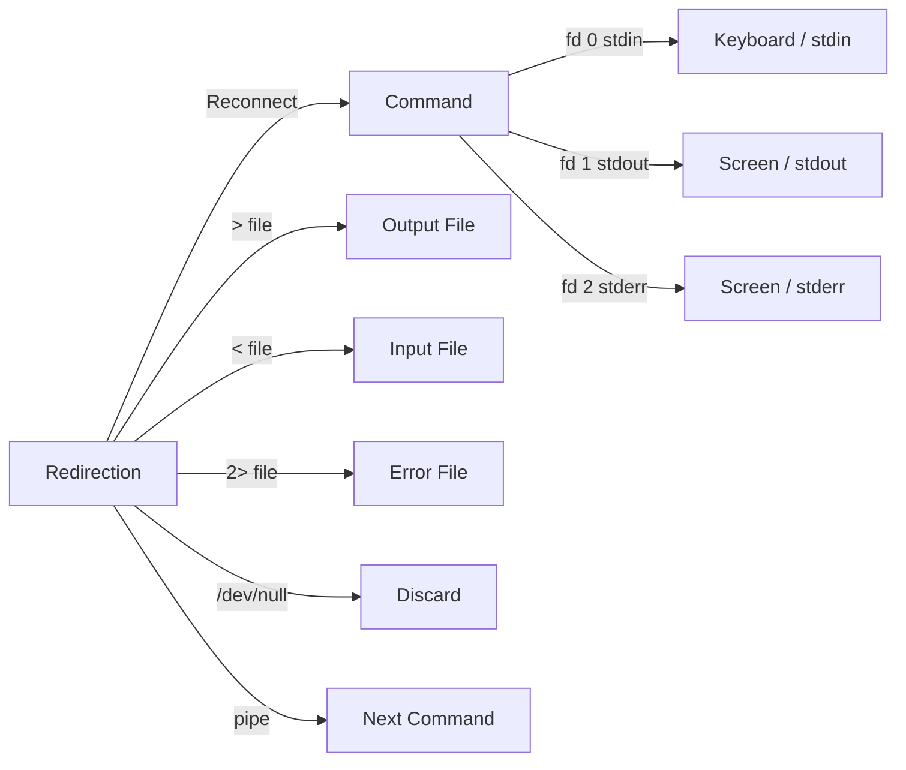

# Chapter 38: Redirection and File Descriptors — >, >>, 2>, &>, /dev/null, here-strings, exec

## Overview

Redirection is the mechanism that controls where a program's input comes from and where its output goes. By default, programs read from standard input (stdin, file descriptor 0) and write to standard output (stdout, fd 1) and standard error (stderr, fd 2). Redirection lets you send output to files, read input from files, merge streams, discard output, and create custom file descriptors.

Understanding redirection is fundamental to shell scripting. It's how you capture command output, suppress unwanted messages, chain programs together, and manage I/O in complex scripts.

## Intuition

Think of file descriptors as numbered pipes. Every program starts with three: pipe 0 (input), pipe 1 (normal output), and pipe 2 (error output). By default, pipe 0 connects to your keyboard, and pipes 1 and 2 connect to your screen. Redirection reconnects these pipes to files, other pipes, or the void (`/dev/null`).

The `>` operator is like plugging pipe 1 into a file. `2>` plugs pipe 2 into a file. `&>` plugs both pipes into a file. `<` plugs a file into pipe 0. The `|` operator connects pipe 1 of one program to pipe 0 of another.

## Architecture



### Standard File Descriptors

| FD | Name | Symbol | Default | Description |
|----|------|--------|---------|-------------|
| 0 | stdin | `<` | Keyboard | Standard input |
| 1 | stdout | `>` | Screen | Standard output |
| 2 | stderr | `2>` | Screen | Standard error |
| 3+ | custom | | | Additional file descriptors |

## Output Redirection

### Basic Output Redirection

```bash
# Redirect stdout to file (overwrite)
echo "Hello" > file.txt
ls > file.txt

# Redirect stdout to file (append)
echo "Hello" >> file.txt
date >> file.txt

# ❌ Overwrite creates empty file if command produces no output
> empty.txt           # Creates empty file
: > empty.txt         # Same, using : (no-op command)

# ✅ Create empty file safely
touch empty.txt
```

### Error Redirection

```bash
# Redirect stderr to file
command 2> error.log

# Redirect stderr to file (append)
command 2>> error.log

# Redirect stderr to /dev/null (suppress)
command 2>/dev/null

# Redirect stderr to stdout
command 2>&1
# Now stderr goes to wherever stdout is going

# Redirect both stdout and stderr to file
command > all.log 2>&1    # POSIX way
command &> all.log         # Bash shorthand
command &>> all.log        # Bash shorthand (append)

# ⚠️ Order matters!
command > file 2>&1    # ✅ Both to file
command 2>&1 > file    # ❌ stderr to current stdout, stdout to file
```

### Redirect to /dev/null

```bash
# Suppress all output
command > /dev/null 2>&1
command &>/dev/null          # Bash shorthand

# Suppress only stdout
command > /dev/null

# Suppress only stderr
command 2>/dev/null

# Common uses
grep "pattern" file 2>/dev/null    # Suppress "file not found"
find / -name "*.log" 2>/dev/null   # Suppress permission denied
```

### File Descriptor Manipulation

```bash
# Open file descriptor 3 for writing
exec 3> output.txt
echo "Hello" >&3
echo "World" >&3
exec 3>&-    # Close fd 3

# Open file descriptor 4 for reading
exec 4< input.txt
read -r line <&4
echo "$line"
exec 4<&-    # Close fd 4

# Open fd 5 for append
exec 5>> log.txt
echo "Log entry" >&5
exec 5>&-

# Duplicate file descriptors
exec 6>&1      # fd 6 now points to where fd 1 (stdout) points
exec 1>file.txt # Redirect stdout to file
echo "To file"
exec 1>&6      # Restore stdout from fd 6
exec 6>&-      # Close fd 6
echo "To screen"

# Redirect stdout, use original stdout later
exec 7>&1
{
    echo "This goes to file"
    echo "This also to file"
    echo "This to original stdout" >&7
} > output.txt
exec 7>&-
```

## Input Redirection

### Basic Input Redirection

```bash
# Read from file
wc -l < file.txt
sort < file.txt
grep "pattern" < file.txt

# Read into variable
read -r line < file.txt
echo "$line"

# Read into array
mapfile -t lines < file.txt

# Use file as stdin for loop
while read -r line; do
    echo "$line"
done < file.txt
```

### Here-Docs (<<)

```bash
# Multi-line input
cat <<EOF
Line 1
Line 2
Line 3
EOF

# With variable expansion
name="World"
cat <<EOF
Hello, $name!
Today is $(date +%A).
EOF

# Without expansion (quoted delimiter)
cat <<'EOF'
$name is literal.
$(command) is literal.
EOF

# Strip leading tabs (<<-)
if true; then
    cat <<-EOF
    This has no leading tabs.
    EOF
fi

# Here-doc to file
cat > config.txt <<EOF
key1=value1
key2=value2
EOF

# Here-doc append
cat >> config.txt <<EOF
key3=value3
EOF
```

### Here-Strings (<<<)

```bash
# Feed string to stdin
cat <<< "Hello, World!"
grep "pattern" <<< "$variable"

# Read into variables
read -r first last <<< "John Doe"
echo "$first $last"

# Feed to awk
awk '{print $2}' <<< "one two three"

# Feed to while read
while read -r word; do
    echo "Word: $word"
done <<< "one two three"
```

## Pipes and Stream Combination

### Basic Pipes

```bash
# Connect stdout of one command to stdin of another
ls | grep ".txt"
cat file.txt | sort | uniq
ps aux | grep nginx

# Multiple pipes
cat /var/log/syslog | grep "error" | awk '{print $5}' | sort | uniq -c
```

### Pipe Both stdout and stderr

```bash
# Bash shorthand
command |& grep "pattern"
# Same as:
command 2>&1 | grep "pattern"

# Pipe only stderr
command 2>&1 >/dev/null | grep "pattern"
# stderr goes to pipe, stdout goes to /dev/null
```

### tee — Read from stdin, write to stdout AND file

```bash
# Write to both stdout and file
echo "Hello" | tee file.txt
# Output appears on screen AND in file.txt

# Append mode
echo "Hello" | tee -a file.txt

# Write to multiple files
echo "Hello" | tee file1.txt file2.txt file3.txt

# Suppress stdout, write only to file
echo "Hello" | tee file.txt > /dev/null

# Pipe through tee
ls | tee file.txt | grep ".txt"
# All output goes to file.txt, filtered output to screen

# Capture both stdout and stderr
command 2>&1 | tee output.log
```

## exec Redirection

The `exec` command can redirect I/O for the entire shell or script.

### Redirect Script Output

```bash
#!/bin/bash
# Redirect all output to a log file
exec > /var/log/myscript.log 2>&1

echo "Script started"    # Goes to log
ls /nonexistent          # Error goes to log
echo "Script finished"   # Goes to log
```

### Redirect Script Input

```bash
#!/bin/bash
# Read from a file for the entire script
exec < input.txt

while read -r line; do
    echo "Line: $line"
done
```

### Save and Restore File Descriptors

```bash
#!/bin/bash
# Save original stdout
exec 3>&1

# Redirect stdout to file
exec > output.txt

echo "This goes to file"

# Restore stdout
exec 1>&3
exec 3>&-

echo "This goes to screen"
```

### Open Custom File Descriptors

```bash
#!/bin/bash
# Open fd 3 for writing
exec 3> output.txt

# Open fd 4 for reading
exec 4< input.txt

# Open fd 5 for append
exec 5>> log.txt

# Use them
echo "Output" >&3
read -r line <&4
echo "Log entry" >&5

# Close them
exec 3>&-
exec 4<&-
exec 5>&-
```

### Redirect for Specific Blocks

```bash
# Redirect a group of commands
{
    echo "Line 1"
    echo "Line 2"
    echo "Line 3"
} > output.txt

# Redirect stdout and stderr separately for a block
{
    echo "Normal output"
    echo "Error output" >&2
} > output.txt 2> error.log

# Redirect with subshell
(
    echo "In subshell"
    ls /nonexistent
) > all.log 2>&1
```

## Advanced Redirection Patterns

### Redirect stderr to a Variable

```bash
# Capture stderr in a variable
error=$(command 2>&1 >/dev/null)
# stderr goes to $error, stdout goes to /dev/null

# Alternative: using process substitution
{ error=$(cat); } < <(command 2>&1 >/dev/null)

# Capture both stdout and stderr separately
stdout=$(command)
stderr=$(command 2>&1 >/dev/null)

# More reliable method using file descriptors
exec 3>&1
stderr=$(command 2>&1 1>&3 | tee /dev/fd/2)
exec 3>&-
```

### Redirect to Multiple Destinations

```bash
# Write to stdout AND a file
echo "Hello" | tee file.txt

# Write to stdout AND append to file
echo "Hello" | tee -a file.txt

# Write to multiple files
echo "Hello" | tee file1.txt file2.txt

# Redirect to a file and stderr
echo "Hello" | tee /dev/fd/2    # Copy to stderr
echo "Hello" | tee >(cat >&2)   # Process substitution
```

### Redirect with Temporary Files

```bash
# Using process substitution instead of temp files
diff <(sort file1) <(sort file2)

# Using named pipes (FIFOs)
mkfifo /tmp/mypipe
command1 > /tmp/mypipe &
command2 < /tmp/mypipe
rm /tmp/mypipe
```

### noclobber

```bash
# Prevent accidental file overwriting
set -o noclobber

# This will fail:
echo "Hello" > existing_file.txt
# bash: existing_file.txt: cannot overwrite existing file

# Force overwrite with >|
echo "Hello" >| existing_file.txt

# Disable noclobber
set +o noclobber
```

## Special Redirection Files

```bash
# /dev/null — Discard everything
command > /dev/null 2>&1

# /dev/zero — Read null bytes
dd if=/dev/zero of=file.txt bs=1M count=10

# /dev/random — Random bytes (blocking)
dd if=/dev/random of=random.bin bs=16 count=1

# /dev/urandom — Random bytes (non-blocking)
dd if=/dev/urandom of=random.bin bs=16 count=1

# /dev/full — Always returns "no space left"
command > /dev/full    # Tests error handling

# /dev/stdin, /dev/stdout, /dev/stderr
echo "Hello" > /dev/stderr    # Write to stderr
cat /dev/stdin                 # Read from stdin

# TCP/UDP redirection (Bash with /dev/tcp)
exec 3<>/dev/tcp/example.com/80
echo -e "GET / HTTP/1.0\r\nHost: example.com\r\n\r\n" >&3
cat <&3
exec 3>&-
```

## Common Pitfalls

### 1. Order of Redirection

```bash
# ❌ Wrong order: stderr goes to current stdout, stdout goes to file
command 2>&1 > file.txt

# ✅ Correct order: both go to file
command > file.txt 2>&1
# Or: command &> file.txt
```

### 2. Overwriting vs Appending

```bash
# ❌ Accidentally overwriting
echo "First" > file.txt
echo "Second" > file.txt    # Overwrites "First"!

# ✅ Append
echo "First" > file.txt
echo "Second" >> file.txt    # Appends after "First"
```

### 3. Redirection in Loops

```bash
# ❌ Redirect inside loop: opens/closes file each iteration
for i in {1..1000}; do
    echo "$i" > file.txt    # Overwrites each time!
done

# ✅ Redirect the entire loop
for i in {1..1000}; do
    echo "$i"
done > file.txt
```

### 4. Pipe and Variable Scope

```bash
# ❌ Pipe creates subshell: variable changes lost
count=0
cat file.txt | while read -r line; do
    ((count++))
done
echo "$count"    # 0!

# ✅ Use process substitution
count=0
while read -r line; do
    ((count++))
done < <(cat file.txt)
echo "$count"    # Correct!
```

### 5. Redirection and set -e

```bash
# ❌ set -e may not catch errors in redirected commands
set -e
false > file.txt    # May not cause exit!

# ✅ Check exit status explicitly
false > file.txt
if [[ $? -ne 0 ]]; then
    echo "Command failed"
    exit 1
fi
```

## Best Practices

1. **Use `&>` for redirecting both streams** — cleaner than `> file 2>&1`
2. **Use `/dev/null` to suppress output** — not just ignoring it
3. **Use `tee` when you need output in two places** — file and screen
4. **Use `exec` for script-wide redirection** — clean and efficient
5. **Use process substitution over temp files** — no cleanup needed
6. **Set `noclobber` to prevent accidental overwrites** — safety net
7. **Redirect the loop, not the command inside** — better performance
8. **Check exit status after redirection** — `set -e` may not catch it
9. **Close file descriptors when done** — prevent resource leaks
10. **Use custom file descriptors for complex I/O** — more flexible than 0, 1, 2

## Exercises

### Exercise 1: Output Splitting
Write a script that runs a command and:
- Sends stdout to `output.log`
- Sends stderr to `error.log`
- Sends both to `combined.log`
- Displays both on the terminal

### Exercise 2: Log Rotation
Write a script using redirection that:
- Appends output to a log file
- Rotates the log when it exceeds 1MB
- Keeps 5 old log files
- Uses exec for script-wide redirection

### Exercise 3: File Descriptor Manipulation
Write a script that:
- Opens a file descriptor for writing
- Writes to both the file and stdout simultaneously
- Saves and restores stdout
- Uses at least 3 custom file descriptors

### Exercise 4: Error Capture
Write a function that:
- Captures stdout and stderr separately
- Returns the exit status
- Stores stderr in a variable
- Handles the case where stderr is empty

### Exercise 5: Network Redirection
Write a script that uses Bash's `/dev/tcp` to:
- Connect to a web server
- Send an HTTP request
- Read the response
- Extract the status code

## References

- [Bash Manual: Redirections](https://www.gnu.org/software/bash/manual/bash.html#Redirections)
- [POSIX: Redirections](https://pubs.opengroup.org/onlinepubs/9699919799/utilities/V3_chap02.html#tag_18_07)
- [Greg's Wiki: Redirection](https://mywiki.wooledge.org/Redirection)
- [Bash Hackers: Redirection](https://wiki.bash-hackers.org/howto/redirection_tutorial)
- [Advanced Bash-Scripting Guide: I/O Redirection](https://tldp.org/LDP/abs/html/io-redirection.html)
- [Bash Pitfalls: Redirection](https://mywiki.wooledge.org/BashPitfalls)
