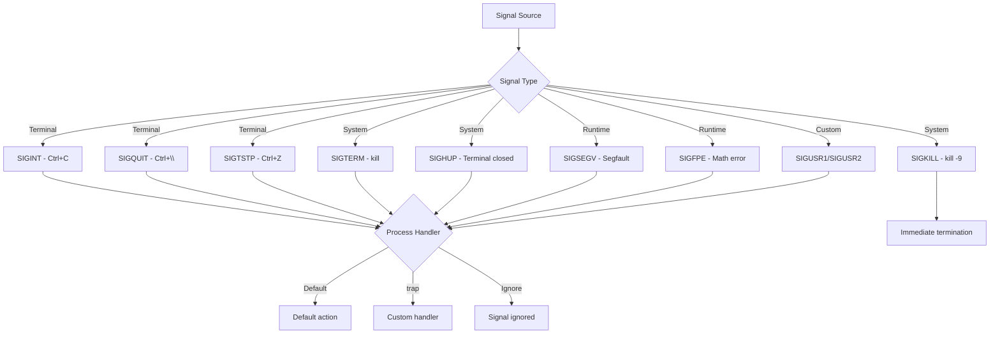

# Chapter 40: Signals and Job Control — SIGINT, SIGTERM, trap, fg, bg, jobs, wait, disown

## Overview

Signals are the Unix mechanism for asynchronous communication between processes. When you press Ctrl+C, the kernel sends SIGINT to the foreground process. When a system shuts down, init sends SIGTERM to all processes. When a program accesses invalid memory, the kernel sends SIGSEGV. Understanding signals is essential for writing robust scripts, managing background processes, and handling graceful shutdowns.

Job control is the shell's mechanism for managing multiple processes within a single terminal session. It allows you to suspend processes, resume them in the foreground or background, and manage their lifecycle. Combined with signal handling via `trap`, you have complete control over process behavior.

## Intuition

Think of signals as urgent messages delivered to a process's mailbox. Most signals cause the process to terminate by default, but processes can choose to handle signals differently (like catching SIGTERM to do cleanup before exiting) or ignore them entirely.

Job control is like a TV remote with pause, resume, and channel-switch buttons. You can pause the current program (Ctrl+Z), switch to another channel (run a different command), and come back later (fg). You can also run programs in the background (bg or &) while continuing to use the terminal.

## Architecture



## Common Signals

| Signal | Number | Default Action | Description |
|--------|--------|---------------|-------------|
| `SIGHUP` | 1 | Terminate | Terminal hangup, config reload |
| `SIGINT` | 2 | Terminate | Interrupt (Ctrl+C) |
| `SIGQUIT` | 3 | Core dump | Quit (Ctrl+\\) |
| `SIGILL` | 4 | Core dump | Illegal instruction |
| `SIGTRAP` | 5 | Core dump | Trace/breakpoint trap |
| `SIGABRT` | 6 | Core dump | Abort |
| `SIGBUS` | 7 | Core dump | Bus error |
| `SIGFPE` | 8 | Core dump | Floating-point exception |
| `SIGKILL` | 9 | Terminate | **Cannot be caught or ignored** |
| `SIGUSR1` | 10 | Terminate | User-defined signal 1 |
| `SIGSEGV` | 11 | Core dump | Segmentation fault |
| `SIGUSR2` | 12 | Terminate | User-defined signal 2 |
| `SIGPIPE` | 13 | Terminate | Broken pipe |
| `SIGALRM` | 14 | Terminate | Timer alarm |
| `SIGTERM` | 15 | Terminate | Graceful termination request |
| `SIGCHLD` | 17 | Ignore | Child process changed state |
| `SIGCONT` | 18 | Continue | Continue if stopped |
| `SIGSTOP` | 19 | Stop | **Cannot be caught or ignored** |
| `SIGTSTP` | 20 | Stop | Terminal stop (Ctrl+Z) |
| `SIGTTIN` | 21 | Stop | Background read from terminal |
| `SIGTTOU` | 22 | Stop | Background write to terminal |

## The trap Command

The `trap` command sets signal handlers in shell scripts.

### Basic Syntax

```bash
trap 'command' SIGNAL
trap 'command' SIGNAL1 SIGNAL2 ...
trap '' SIGNAL         # Ignore signal
trap - SIGNAL          # Reset to default
trap -p                # Print current traps
trap -l                # List all signals
```

### Common Signal Handlers

```bash
# Handle SIGINT (Ctrl+C)
trap 'echo "Caught Ctrl+C, cleaning up..."; exit 1' INT

# Handle SIGTERM (kill)
trap 'echo "Terminating..."; exit 0' TERM

# Handle SIGHUP (terminal closed)
trap 'echo "Terminal closed, saving state..."; save_state; exit 0' HUP

# Handle EXIT (script exit — always runs)
trap 'cleanup' EXIT

# Handle multiple signals
trap 'echo "Signal caught!"; exit 1' INT TERM HUP

# Handle ERR (command fails, if set -E or errtrace)
trap 'echo "Error on line $LINENO"; exit 1' ERR
```

### The EXIT Trap

```bash
#!/bin/bash

# Cleanup function
cleanup() {
    rm -f "$TEMP_FILE" 2>/dev/null
    echo "Cleanup complete"
}

# Set trap for EXIT — runs when script exits (any reason)
trap cleanup EXIT

# Create temp file
TEMP_FILE=$(mktemp)

# Do work
echo "Working..."
# If script exits here (error, Ctrl+C, normal exit), cleanup runs
```

### The ERR Trap

```bash
#!/bin/bash

# Enable ERR trap inheritance by functions and subshells
set -E  # or set -o errtrace

# Error handler
error_handler() {
    local line="$1"
    local command="$2"
    local code="$3"
    echo "Error at line $line: command '$command' exited with code $code" >&2
    exit "$code"
}

trap 'error_handler ${LINENO} "$BASH_COMMAND" $?' ERR

# Now any command that fails triggers the handler
false    # Triggers error handler
echo "This won't print"
```

### The DEBUG Trap

```bash
#!/bin/bash

# Execute before each command
trap 'echo "DEBUG: $BASH_COMMAND"' DEBUG

echo "Hello"
ls /tmp
echo "Done"
# Output:
# DEBUG: echo "Hello"
# Hello
# DEBUG: ls /tmp
# ...
# DEBUG: echo "Done"
# Done

# Selective debugging
trap 'echo "DEBUG [line $LINENO]: $BASH_COMMAND"' DEBUG
```

### The RETURN Trap

```bash
#!/bin/bash

# Execute when a function or sourced script returns
trap 'echo "Returned from function"' RETURN

my_function() {
    echo "Inside function"
    return 0
}

my_function
# Output:
# Inside function
# Returned from function
```

### Advanced Trap Patterns

```bash
# Save and restore traps
original_trap=$(trap -p INT)
trap 'echo "temporary handler"' INT
# ... do something ...
eval "$original_trap"    # Restore original trap

# Chain traps
previous_trap=$(trap -p INT)
trap 'echo "new handler"; eval "$previous_trap"' INT

# Temporary trap
{
    trap 'echo "temporary"' INT
    # ... code that needs temporary trap ...
}
# Trap reverts after block (in some shells)

# Ignore signal temporarily
trap '' INT    # Ignore Ctrl+C
# ... critical section ...
trap - INT     # Restore default

# Cleanup with multiple temp files
declare -a TEMP_FILES=()
trap 'rm -f "${TEMP_FILES[@]}"' EXIT

add_temp_file() {
    TEMP_FILES+=("$1")
}

tmpfile=$(mktemp)
add_temp_file "$tmpfile"
```

## Job Control

### Background Processes

```bash
# Run command in background
command &
echo "Background PID: $!"

# Multiple background commands
command1 &
command2 &
command3 &
wait    # Wait for all background jobs to finish

# Background with output redirection
command > output.log 2>&1 &
```

### The jobs Command

```bash
# List current jobs
jobs
# [1]   Running                 command1 &
# [2]-  Running                 command2 &
# [3]+  Stopped                 vim file.txt

# With PIDs
jobs -l
# [1]   1234 Running                 command1 &
# [2]-  1235 Running                 command2 &
# [3]+  1236 Stopped                 vim file.txt

# With process group IDs
jobs -p
# 1234
# 1235
# 1236

# Only running jobs
jobs -r

# Only stopped jobs
jobs -s

# Job identifiers
# %n    Job number n
# %str  Job whose command starts with str
# %?str Job whose command contains str
# %%    Current job (marked with +)
# %+    Current job
# %-    Previous job (marked with -)
```

### Foreground and Background

```bash
# Suspend current foreground process
# Press Ctrl+Z
# [1]+  Stopped                 vim file.txt

# Resume in foreground
fg
fg %1
fg %vim

# Resume in background
bg
bg %1
bg %vim

# Start in background
sleep 100 &
# [1] 12345
```

### The wait Command

```bash
# Wait for all background jobs
wait

# Wait for specific job
wait %1
wait %vim

# Wait for specific PID
wait 12345

# Wait and get exit status
command &
pid=$!
wait $pid
echo "Exit status: $?"

# Wait with timeout (Bash 4.3+)
wait -n    # Wait for any one job to finish (Bash 4.3+)
wait -n %1 %2    # Wait for either job 1 or 2

# Wait for all, collect statuses
pids=()
command1 & pids+=($!)
command2 & pids+=($!)
command3 & pids+=($!)

for pid in "${pids[@]}"; do
    wait $pid
    echo "PID $pid exited with status $?"
done
```

### The disown Command

```bash
# Remove job from job table (won't receive SIGHUP on shell exit)
command &
disown

# Disown specific job
command1 &
command2 &
disown %1

# Disown all jobs
disown -a

# Disown but keep exit status reporting
command &
disown -h %1    # Won't receive SIGHUP but stays in job table

# Common use: long-running command that survives shell exit
nohup command &
disown
# Or
command > /dev/null 2>&1 &
disown
```

### nohup

```bash
# Run command immune to SIGHUP
nohup command &

# Output goes to nohup.out by default
nohup long_running_command &

# Redirect output
nohup command > output.log 2>&1 &

# nohup + disown for maximum independence
nohup command > output.log 2>&1 &
disown
```

## Signal Sending

### The kill Command

```bash
# Send signal to PID
kill 12345              # Sends SIGTERM (default)
kill -TERM 12345        # Same
kill -15 12345          # Same

# Send specific signals
kill -INT 12345         # SIGINT (like Ctrl+C)
kill -HUP 12345         # SIGHUP (reload config)
kill -KILL 12345        # SIGKILL (force kill, cannot be caught)
kill -9 12345           # Same as SIGKILL
kill -USR1 12345        # SIGUSR1 (user-defined)
kill -USR2 12345        # SIGUSR2 (user-defined)
kill -STOP 12345        # Stop process
kill -CONT 12345        # Continue stopped process

# Send to job
kill %1                 # Kill job 1
kill -TERM %1

# Send to process group
kill -TERM -12345       # Negative PID = process group

# List available signals
kill -l
kill -l SIGTERM
```

### killall and pkill

```bash
# Kill by name
killall firefox
killall -9 firefox

# Kill by pattern
pkill -f "python script.py"
pkill -u username
pkill -t pts/0            # Kill processes on specific terminal

# Send specific signal
pkill -USR1 mydaemon      # Send SIGUSR1 to mydaemon

# Find processes (dry run)
pgrep -f "pattern"
pgrep -l -f "pattern"     # With command name
```

## Practical Signal Handling

### Graceful Shutdown Script

```bash
#!/bin/bash
# Graceful shutdown handler

RUNNING=true

shutdown() {
    echo "Received shutdown signal, cleaning up..."
    RUNNING=false
    
    # Stop child processes gracefully
    if [[ -n "${child_pid:-}" ]]; then
        kill -TERM "$child_pid" 2>/dev/null
        wait "$child_pid" 2>/dev/null
    fi
    
    # Remove temp files
    rm -f "${temp_file:-}"
    
    echo "Shutdown complete"
    exit 0
}

trap shutdown TERM INT HUP

# Create temp file
temp_file=$(mktemp)

# Main loop
echo "Starting service (PID: $$)..."
while $RUNNING; do
    # Do work
    sleep 1 &
    child_pid=$!
    wait $child_pid
done
```

### Reload Configuration on SIGHUP

```bash
#!/bin/bash
# Service that reloads config on SIGHUP

CONFIG_FILE="/etc/myapp/config"
PID_FILE="/var/run/myapp.pid"

load_config() {
    if [[ -f "$CONFIG_FILE" ]]; then
        source "$CONFIG_FILE"
        echo "Configuration loaded from $CONFIG_FILE"
    else
        echo "Warning: Config file not found: $CONFIG_FILE" >&2
    fi
}

cleanup() {
    rm -f "$PID_FILE"
    echo "Service stopped"
    exit 0
}

# Write PID file
echo $$ > "$PID_FILE"

# Set up signal handlers
trap cleanup TERM INT
trap 'load_config' HUP

# Load initial config
load_config

# Main loop
echo "Service running (PID: $$)"
while true; do
    # Service logic here
    sleep 10
done
```

### Progress Monitoring with SIGUSR1

```bash
#!/bin/bash
# Script that reports progress on SIGUSR1

PROGRESS=0
TOTAL=100

report_progress() {
    local pct=$((PROGRESS * 100 / TOTAL))
    echo "Progress: $pct% ($PROGRESS/$TOTAL)" >&2
}

trap report_progress USR1

echo "Starting work (PID: $$). Send SIGUSR1 to check progress."
echo "  kill -USR1 $$"

for ((i = 0; i < TOTAL; i++)); do
    PROGRESS=$((i + 1))
    # Simulate work
    sleep 0.1
done

echo "Complete!"
```

### Timeout with SIGALRM

```bash
#!/bin/bash
# Command with timeout

timeout_handler() {
    echo "Command timed out!" >&2
    kill -TERM "$child_pid" 2>/dev/null
    exit 124
}

run_with_timeout() {
    local timeout=$1
    shift
    
    trap timeout_handler ALRM
    
    "$@" &
    child_pid=$!
    
    (sleep "$timeout" && kill -ALRM $$) &
    timer_pid=$!
    
    wait "$child_pid"
    exit_code=$?
    
    kill "$timer_pid" 2>/dev/null
    wait "$timer_pid" 2>/dev/null
    
    return $exit_code
}

run_with_timeout 10 long_running_command
```

### Trap-Based Lock File

```bash
#!/bin/bash
# Script with lock file and cleanup

LOCK_FILE="/var/lock/myscript.lock"

acquire_lock() {
    if [[ -f "$LOCK_FILE" ]]; then
        local pid
        pid=$(cat "$LOCK_FILE")
        if kill -0 "$pid" 2>/dev/null; then
            echo "Script already running (PID: $pid)" >&2
            exit 1
        else
            echo "Removing stale lock file" >&2
            rm -f "$LOCK_FILE"
        fi
    fi
    
    echo $$ > "$LOCK_FILE"
    trap 'rm -f "$LOCK_FILE"' EXIT
}

acquire_lock

echo "Running (PID: $$)..."
# ... your script logic ...
```

## Job Control Best Practices

```bash
# 1. Use nohup for long-running background tasks
nohup long_task > output.log 2>&1 &

# 2. Use disown to detach from shell
command > /dev/null 2>&1 &
disown

# 3. Use wait for parallel processing
for file in *.txt; do
    process_file "$file" &
done
wait    # Wait for all to finish

# 4. Use wait -n for task queue (Bash 4.3+)
max_jobs=4
running=0
for file in *.txt; do
    process_file "$file" &
    ((running++))
    if ((running >= max_jobs)); then
        wait -n
        ((running--))
    fi
done
wait

# 5. Always clean up background processes
pids=()
command1 & pids+=($!)
command2 & pids+=($!)

cleanup() {
    for pid in "${pids[@]}"; do
        kill "$pid" 2>/dev/null
    done
}
trap cleanup EXIT
```

## Common Pitfalls

### 1. Missing Cleanup on Exit

```bash
# ❌ Temp files left behind on error
tmpfile=$(mktemp)
do_work
rm -f "$tmpfile"

# ✅ Use trap for reliable cleanup
tmpfile=$(mktemp)
trap 'rm -f "$tmpfile"' EXIT
do_work
# Cleanup happens automatically
```

### 2. Zombie Processes

```bash
# ❌ Not waiting for background processes
command1 &
command2 &
exit    # Zombie processes!

# ✅ Wait for children
command1 &
command2 &
wait
exit
```

### 3. SIGKILL Cannot Be Caught

```bash
# ❌ Trying to trap SIGKILL
trap 'echo "Caught"' KILL    # Does nothing! SIGKILL cannot be trapped

# ✅ Use SIGTERM for graceful shutdown
trap 'echo "Shutting down..."; cleanup; exit' TERM
kill -TERM $pid    # Graceful
kill -9 $pid       # Force (only as last resort)
```

### 4. Background Jobs and Terminal

```bash
# ❌ Background job output clutters terminal
long_command &

# ✅ Redirect background job output
long_command > /dev/null 2>&1 &
long_command > output.log 2>&1 &
```

### 5. Trap in Subshells

```bash
# ❌ Traps are not inherited by subshells by default
trap 'echo "caught"' INT
(sleep 10)    # Subshell doesn't have the trap

# ✅ Use set -E (errtrace) for ERR trap inheritance
set -E
trap 'echo "error"' ERR
(some_command)    # ERR trap is inherited
```

## Best Practices

1. **Always set an EXIT trap for cleanup** — temp files, lock files, child processes
2. **Use SIGTERM for graceful shutdown** — not SIGKILL
3. **Use `trap ''` to ignore signals temporarily** — during critical sections
4. **Use `wait` after background commands** — prevent zombies
5. **Use `disown` or `nohup` for detached processes** — survive shell exit
6. **Use `set -E` to inherit ERR traps** — in functions and subshells
7. **Clean up child processes in trap handlers** — prevent orphans
8. **Use job control for interactive multitasking** — fg, bg, jobs
9. **Use `wait -n` for parallel job management** — task queue pattern
10. **Test signal handling** — send signals to your script and verify behavior

## Exercises

### Exercise 1: Graceful Shutdown
Write a script that:
- Starts a background worker process
- Handles SIGTERM and SIGINT gracefully
- Stops the worker and waits for it to finish
- Cleans up temp files and lock files
- Reports shutdown status

### Exercise 2: Reloadable Service
Write a daemon script that:
- Runs in an infinite loop
- Reloads configuration on SIGHUP
- Reports status on SIGUSR1
- Gracefully shuts down on SIGTERM
- Writes a PID file

### Exercise 3: Parallel Job Manager
Write a script that:
- Runs up to N commands in parallel
- Uses `wait -n` to manage the job queue
- Collects exit statuses from all jobs
- Reports summary of successes and failures

### Exercise 4: Timeout Wrapper
Write a function that:
- Runs a command with a configurable timeout
- Uses SIGALRM for the timeout
- Returns the command's exit status if it completes
- Returns 124 if it times out (like the `timeout` command)
- Cleans up the timed-out process

### Exercise 5: Trap Library
Write a library of reusable trap functions:
- `setup_cleanup()` — Sets up EXIT trap for temp file cleanup
- `setup_lockfile()` — Creates and manages a lock file
- `setup_logging()` — Logs all commands to a file via DEBUG trap
- `setup_graceful_shutdown()` — Handles TERM/INT/HUP signals
- `with_timeout()` — Runs a command with a timeout

## References

- [Bash Manual: Signals](https://www.gnu.org/software/bash/manual/bash.html#Signals)
- [Bash Manual: Job Control](https://www.gnu.org/software/bash/manual/bash.html#Job-Control)
- [Bash Manual: Bourne Shell Builtins: trap](https://www.gnu.org/software/bash/manual/bash.html#index-trap)
- [Linux man pages: signal(7)](https://man7.org/linux/man-pages/man7/signal.7.html)
- [Linux man pages: kill(1)](https://man7.org/linux/man-pages/man1/kill.1.html)
- [Greg's Wiki: Signal](https://mywiki.wooledge.org/Signal)
- [Greg's Wiki: Process Management](https://mywiki.wooledge.org/ProcessManagement)
- [Bash Hackers: Signal](https://wiki.bash-hackers.org/commands/builtin/trap)
- [Advanced Bash-Scripting Guide: Signals](https://tldp.org/LDP/abs/html/debugging.html)
