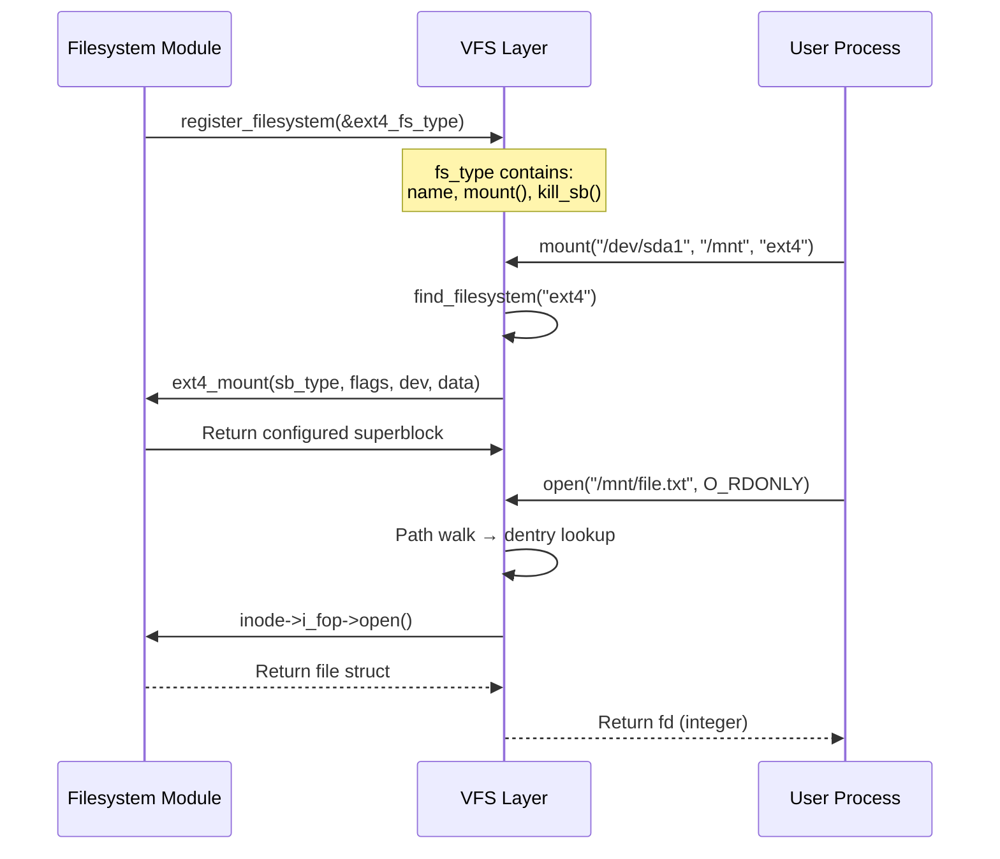
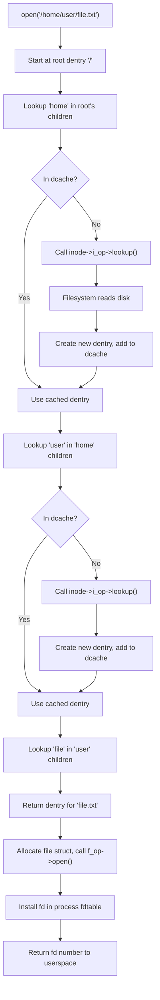
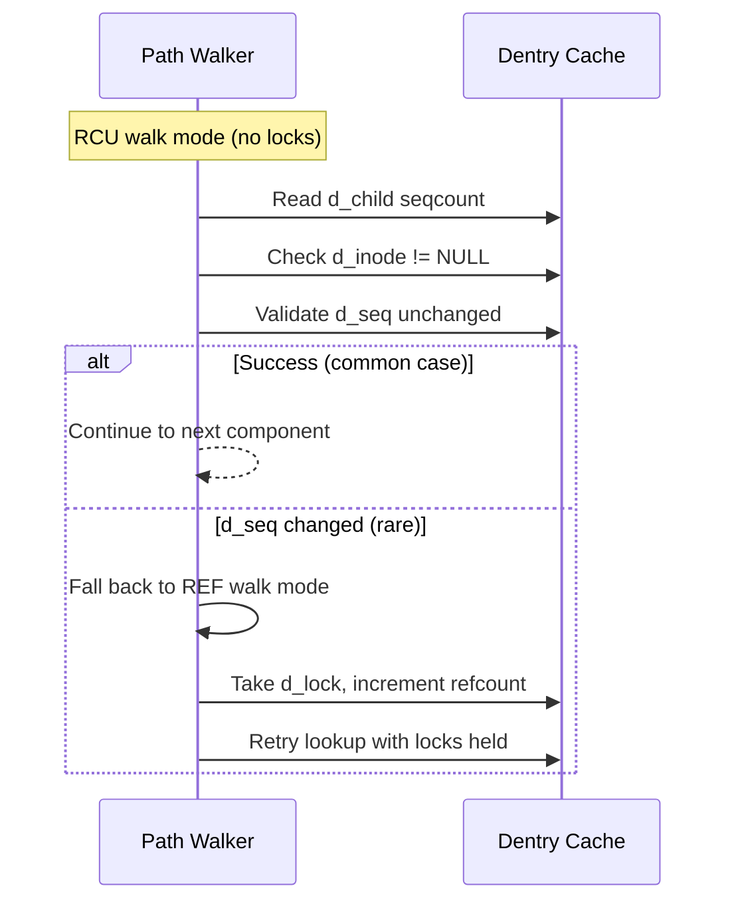
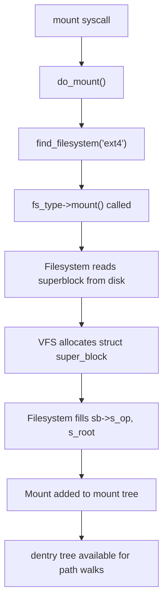

# Chapter 67: VFS — The Virtual Filesystem

## 1. Intuition

Imagine a city with dozens of different neighborhoods, each with its own street layout, address system, and building codes. Without a unified postal system, delivering mail would be chaos. The Virtual Filesystem (VFS) is Linux's unified postal system — it provides a single, consistent interface for every filesystem type, whether it's ext4 on a spinning disk, tmpfs in RAM, an NFS mount over the network, or procfs exposing kernel data.

When you call `open("/home/user/file.txt", O_RDONLY)`, the kernel doesn't care whether that path lives on ext4, XFS, Btrfs, or a FUSE filesystem. The VFS layer translates the system call into the correct filesystem-specific operations. This abstraction is the reason Linux can support dozens of filesystem types without rewriting every system call for each one.

The VFS is not a filesystem itself. It's a layer — a set of data structures and interfaces that sit between system calls and the actual filesystem implementations. Every filesystem "registers" itself with the VFS by providing implementations of a standard set of operations: read, write, create, delete, mount, unmount, and so on.

## 2. Architecture

The VFS architecture revolves around four core object types:

```
┌─────────────────────────────────────────────────────┐
│                   User Space                        │
│   open() / read() / write() / stat() / mount()     │
└──────────────────────┬──────────────────────────────┘
                       │ System Call Interface
┌──────────────────────▼──────────────────────────────┐
│                    VFS Layer                         │
│  ┌──────────┐ ┌──────────┐ ┌────────┐ ┌──────────┐ │
│  │ Superblock│ │  Inode   │ │ Dentry │ │   File   │ │
│  │  Object   │ │  Object  │ │ Object │ │  Object  │ │
│  └──────────┘ └──────────┘ └────────┘ └──────────┘ │
│  ┌─────────────────────────────────────────────────┐│
│  │           Filesystem Registration               ││
│  └─────────────────────────────────────────────────┘│
└──────────────────────┬──────────────────────────────┘
                       │
┌──────────────────────▼──────────────────────────────┐
│            Filesystem Implementations               │
│   ext4  │  XFS  │  Btrfs  │  NFS  │  FUSE  │ ...  │
└──────────────────────┬──────────────────────────────┘
                       │
┌──────────────────────▼──────────────────────────────┐
│              Block Layer / Network                   │
└─────────────────────────────────────────────────────┘
```

### 2.1 The Four Core Objects

| Object | Represents | Lifetime | Key Structure |
|--------|-----------|----------|---------------|
| **Superblock** | A mounted filesystem | Mount → Unmount | `struct super_block` |
| **Inode** | A filesystem object (file, dir, symlink) | Open/active use | `struct inode` |
| **Dentry** | A directory entry (name → inode mapping) | Cached | `struct dentry` |
| **File** | An open file descriptor | open() → close() | `struct file` |

### 2.2 Registration Flow



## 3. Source Code References

The VFS implementation spans several key files in the kernel source tree:

| File | Purpose |
|------|---------|
| `include/linux/fs.h` | Core VFS data structures (`super_block`, `inode`, `file`, `dentry`) |
| `include/linux/dcache.h` | Dentry cache structures and operations |
| `include/linux/mount.h` | Mount-related structures |
| `fs/namei.c` | Path lookup (name resolution) implementation |
| `fs/inode.c` | Inode management, allocation, and lifecycle |
| `fs/dcache.c` | Dentry cache implementation |
| `fs/super.c` | Superblock management |
| `fs/file_table.c` | File object allocation |
| `fs/open.c` | `open()`, `close()`, `truncate()` implementations |
| `fs/read_write.c` | `read()`, `write()`, `lseek()` implementations |
| `fs/namespace.c` | Mount/umount implementation |
| `include/linux/file_operations.h` | The `file_operations` function table |

## 4. Data Structures

### 4.1 Superblock (`struct super_block`)

The superblock represents a mounted filesystem instance. It holds filesystem-wide metadata and pointers to operations that act on the filesystem as a whole.

```c
struct super_block {
    struct list_head    s_list;           /* list of all superblocks */
    dev_t               s_dev;            /* device identifier */
    unsigned char       s_blocksize_bits; /* block size in bits */
    unsigned long       s_blocksize;      /* block size in bytes */
    loff_t              s_maxbytes;       /* max file size */
    struct file_system_type *s_type;      /* filesystem type */
    const struct super_operations *s_op;  /* superblock operations */
    struct dentry       *s_root;          /* root dentry */
    struct mutex        s_umount;         /* unmount semaphore */
    atomic_t            s_active;         /* active reference count */
    const struct dentry_operations *s_d_op; /* default dentry ops */
    struct block_device *s_bdev;          /* underlying block device */
    void               *s_fs_info;       /* filesystem-specific data */
    /* ... many more fields ... */
};
```

**Key operations (`super_operations`):**

```c
struct super_operations {
    struct inode *(*alloc_inode)(struct super_block *sb);
    void (*destroy_inode)(struct inode *);
    void (*dirty_inode)(struct inode *, int flags);
    int (*write_inode)(struct inode *, struct writeback_control *wbc);
    void (*evict_inode)(struct inode *);
    void (*put_super)(struct super_block *);
    int (*sync_fs)(struct super_block *sb, int wait);
    int (*statfs)(struct dentry *, struct kstatfs *);
    int (*remount_fs)(struct super_block *, int *, char *);
    void (*umount_begin)(struct super_block *);
    /* ... */
};
```

### 4.2 Inode (`struct inode`)

The inode represents a filesystem object. It contains metadata (permissions, timestamps, size) and pointers to operations.

```c
struct inode {
    umode_t             i_mode;       /* file type and permissions */
    unsigned short      i_opflags;
    kuid_t              i_uid;        /* owner UID */
    kgid_t              i_gid;        /* owner GID */
    unsigned int        i_flags;      /* filesystem flags */

    const struct inode_operations   *i_op;   /* inode operations */
    struct super_block              *i_sb;   /* owning superblock */
    struct address_space            *i_mapping; /* page cache mapping */

    unsigned long       i_ino;        /* inode number */
    dev_t               i_rdev;       /* real device (for special files) */
    loff_t              i_size;       /* file size in bytes */
    struct timespec64   __i_atime;    /* access time */
    struct timespec64   __i_mtime;    /* modification time */
    struct timespec64   __i_ctime;    /* change time */

    unsigned short      i_bytes;      /* bytes used in last block */
    blkcnt_t            i_blocks;     /* number of blocks */

    union {
        const struct file_operations *i_fop; /* file operations */
        void (*free_inode)(struct inode *);
    };

    struct address_space i_data;      /* embedded address_space */
    /* ... */
};
```

**Key operations (`inode_operations`):**

```c
struct inode_operations {
    struct dentry *(*lookup)(struct inode *, struct dentry *, unsigned int);
    int (*create)(struct mnt_idmap *, struct inode *, struct dentry *, umode_t, bool);
    int (*link)(struct dentry *, struct inode *, struct dentry *);
    int (*unlink)(struct inode *, struct dentry *);
    int (*symlink)(struct mnt_idmap *, struct inode *, struct dentry *, const char *);
    int (*mkdir)(struct mnt_idmap *, struct inode *, struct dentry *, umode_t);
    int (*rmdir)(struct inode *, struct dentry *);
    int (*rename)(struct mnt_idmap *, struct inode *, struct dentry *,
                  struct inode *, struct dentry *, unsigned int);
    int (*setattr)(struct mnt_idmap *, struct dentry *, struct iattr *);
    int (*getattr)(struct mnt_idmap *, const struct path *, struct kstat *, u32, unsigned int);
    ssize_t (*listxattr)(struct dentry *, char *, size_t);
    /* ... */
};
```

### 4.3 Dentry (`struct dentry`)

A dentry connects a name to an inode. The dentry cache (dcache) is one of Linux's most important performance structures.

```c
struct dentry {
    unsigned int                d_flags;      /* dentry flags */
    seqcount_spinlock_t         d_seq;        /* per-dentry seqlock */
    struct hlist_bl_node        d_hash;       /* hash table entry */
    struct dentry               *d_parent;    /* parent directory */
    struct qstr                 d_name;       /* name (hash, len, string) */
    struct inode                *d_inode;     /* associated inode */
    unsigned char               d_iname[DNAME_INLINE_LEN]; /* inline name */
    struct lockref              d_lockref;    /* lock + refcount */
    const struct dentry_operations *d_op;     /* dentry operations */
    struct super_block          *d_sb;        /* owning superblock */
    unsigned long               d_time;       /* revalidate time */
    void                        *d_fsdata;    /* filesystem-specific */
    union {
        struct list_head        d_lru;        /* LRU list */
        wait_queue_head_t       *d_wait;      /* in-lookup waiters */
    };
    struct hlist_node           d_sib;        /* sibling list */
    struct hlist_head           d_children;   /* child dentries */
    /* ... */
};
```

### 4.4 File (`struct file`)

Represents an open file. Created by `open()`, destroyed by `close()`.

```c
struct file {
    union {
        struct llist_node   f_llist;
        struct rcu_head     f_rcuhead;
    };
    struct path             f_path;       /* path (vfsmount + dentry) */
    struct inode            *f_inode;     /* cached inode */
    const struct file_operations *f_op;   /* file operations */

    spinlock_t              f_lock;
    atomic_long_t           f_count;      /* reference count */
    unsigned int            f_flags;      /* O_RDONLY, O_NONBLOCK, etc. */
    fmode_t                 f_mode;       /* FMODE_READ, FMODE_WRITE */
    struct mutex            f_pos_lock;
    loff_t                  f_pos;        /* current file offset */
    struct fown_struct      f_owner;      /* owner for SIGIO */
    void                    *private_data; /* filesystem-specific */
    struct address_space    *f_mapping;   /* page cache mapping */
    /* ... */
};
```

**Key operations (`file_operations`):**

```c
struct file_operations {
    struct module *owner;
    loff_t (*llseek)(struct file *, loff_t, int);
    ssize_t (*read)(struct file *, char __user *, size_t, loff_t *);
    ssize_t (*write)(struct file *, const char __user *, size_t, loff_t *);
    ssize_t (*read_iter)(struct kiocb *, struct iov_iter *);
    ssize_t (*write_iter)(struct kiocb *, struct iov_iter *);
    int (*iterate_shared)(struct file *, struct dir_context *);
    __poll_t (*poll)(struct file *, struct poll_table_struct *);
    long (*unlocked_ioctl)(struct file *, unsigned int, unsigned long);
    int (*mmap)(struct file *, struct vm_area_struct *);
    int (*open)(struct inode *, struct file *);
    int (*flush)(struct file *, fl_owner_t id);
    int (*release)(struct inode *, struct file *);
    int (*fsync)(struct file *, loff_t, loff_t, int datasync);
    int (*fasync)(int, struct file *, int);
    int (*lock)(struct file *, int, struct file_lock *);
    ssize_t (*splice_read)(struct file *, loff_t *, struct pipe_inode_info *, size_t, unsigned int);
    ssize_t (*splice_write)(struct pipe_inode_info *, struct file *, loff_t *, size_t, unsigned int);
    /* ... */
};
```

## 5. Path Lookup Deep Dive

Path resolution is one of the most frequently executed VFS operations. When you call `open("/home/user/file.txt")`, the kernel walks the path component by component.

### 5.1 The Lookup Algorithm



### 5.2 Mount Point Crossing

When the path crosses a mount point, the VFS transparently follows the mount:

```c
/* Simplified mount point resolution */
struct mount *lookup_mnt(struct path *path)
{
    struct hlist_head *head = m_hash(path->mnt, path->dentry);
    struct mount *p;

    hlist_for_each_entry_rcu(p, head, mnt_hash) {
        if (p->mnt_parent == path->mnt &&
            p->mnt_mountpoint == path->dentry)
            return p;
    }
    return NULL;
}
```

### 5.3 Symlink Resolution

Symlinks add complexity. The kernel maintains a recursion counter (`MAXSYMLINKS = 40`) to prevent infinite loops:

```c
/* Simplified symlink following */
static const char *pick_link(struct nameidata *nd, struct path *link,
                             struct inode *inode, int flags)
{
    if (nd->total_link_count++ >= MAXSYMLINKS)
        return ERR_PTR(-ELOOP);
    /* ... push symlink body onto nameidata stack ... */
}
```

### 5.4 RCU Walk

Modern Linux uses an optimistic lockless path walk called "RCU walk" that avoids taking dentry locks:



## 6. Filesystem Registration and Mount

### 6.1 Registering a Filesystem

Every filesystem module registers itself:

```c
static struct file_system_type ext4_fs_type = {
    .owner      = THIS_MODULE,
    .name       = "ext4",
    .mount      = ext4_mount,
    .kill_sb    = kill_block_super,
    .fs_flags   = FS_REQUIRES_DEV,
};

static int __init ext4_init(void)
{
    return register_filesystem(&ext4_fs_type);
}
```

### 6.2 The Mount Process



## 7. Examples

### 7.1 Tracing VFS Operations

Using `strace` to observe VFS system calls:

```bash
# Trace all filesystem-related syscalls
strace -e trace=file ls -la /home/user/

# Typical output:
# openat(AT_FDCWD, "/home/user/", O_RDONLY|O_NONBLOCK|O_CLOEXEC|O_DIRECTORY) = 3
# getdents64(3, /* 15 entries */, 32768)     = 480
# stat("/home/user/file.txt", {st_mode=S_IFREG|0644, st_size=1024, ...}) = 0
# close(3)                                   = 0
```

### 7.2 Inspecting VFS Structures via /proc

```bash
# View open files for a process
ls -la /proc/$$/fd/

# View filesystem types registered
cat /proc/filesystems

# View mount information
cat /proc/mounts
cat /proc/self/mountinfo

# View superblock information
cat /proc/superblocks

# View dentry cache statistics
cat /proc/slabinfo | grep dentry
```

### 7.3 Writing a Minimal Filesystem

A minimal filesystem demonstrates VFS integration:

```c
#include <linux/module.h>
#include <linux/fs.h>
#include <linux/pagemap.h>

#define MINFS_MAGIC 0x19940116

static const struct super_operations minfs_sops = {
    .statfs     = simple_statfs,
    .drop_inode = generic_drop_inode,
};

static int minfs_fill_super(struct super_block *sb, void *data, int silent)
{
    struct inode *root;

    sb->s_magic = MINFS_MAGIC;
    sb->s_op = &minfs_sops;

    root = new_inode(sb);
    if (!root)
        return -ENOMEM;

    root->i_ino = 1;
    inode_init_owner(&nop_mnt_idmap, root, NULL, S_IFDIR | 0755);
    root->i_atime = root->i_mtime = root->i_ctime = current_time(root);
    root->i_op = &simple_dir_inode_operations;
    root->i_fop = &simple_dir_operations;

    sb->s_root = d_make_root(root);
    if (!sb->s_root)
        return -ENOMEM;

    return 0;
}

static struct dentry *minfs_mount(struct file_system_type *fs_type,
    int flags, const char *dev, void *data)
{
    return mount_bdev(fs_type, flags, dev, data, minfs_fill_super);
}

static struct file_system_type minfs_type = {
    .owner  = THIS_MODULE,
    .name   = "minfs",
    .mount  = minfs_mount,
    .kill_sb = kill_block_super,
    .fs_flags = FS_REQUIRES_DEV,
};

static int __init minfs_init(void)
{
    return register_filesystem(&minfs_type);
}

static void __exit minfs_exit(void)
{
    unregister_filesystem(&minfs_type);
}

module_init(minfs_init);
module_exit(minfs_exit);
MODULE_LICENSE("GPL");
```

### 7.4 Observing VFS with ftrace

```bash
# Enable VFS tracing
echo 1 > /sys/kernel/debug/tracing/events/vfs/enable

# Perform a file operation
cat /tmp/test.txt

# View trace
cat /sys/kernel/debug/tracing/trace
# Output includes: do_sys_open, vfs_read, ext4_file_read_iter, etc.
```

## 8. Performance

### 8.1 Dentry Cache (dcache)

The dcache is critical for path lookup performance:

```bash
# View dcache statistics
grep dentry /proc/slabinfo

# Typical output:
# dentry            128456 130020    192   21    1 : tunables ... : slabdata ...

# View cache pressure (how aggressively to reclaim)
cat /proc/sys/fs/dentry-state
# Output: 128456 115000 45 0 0 0
#         ^total  ^num_unused  ^age_limit

# Adjust reclaim aggressiveness (lower = more aggressive)
echo 50 > /proc/sys/fs/vfs_cache_pressure
```

### 8.2 Inode Cache

```bash
# View inode cache
grep inode_cache /proc/slabinfo

# View inode state
cat /proc/sys/fs/inode-state
# Output: 65536 3000 0 0 0 0 0
#         ^total ^free
```

### 8.3 Path Lookup Performance

| Optimization | Impact |
|-------------|--------|
| RCU walk | Avoids lock contention on hot paths |
| Dentry cache | Eliminates disk I/O for cached paths |
| Mount hash | Fast mount point resolution |
| Inode cache | Avoids repeated disk reads for metadata |

### 8.4 Measuring VFS Latency

```bash
# Using BPF/bcc to trace VFS latency
sudo /usr/share/bcc/tools/ext4slower 1   # ext4 ops slower than 1ms
sudo /usr/share/bcc/tools/vfsstat         # VFS operation counts
sudo /usr/share/bcc/tools/vfsopslatency   # VFS operation latency histogram
```

## 9. Common Pitfalls

### 9.1 Stale Dentries

A dentry can become "stale" when the underlying inode is deleted but the dentry remains in cache:

```bash
# dcache entries without valid inodes show as negative dentries
# They speed up "file not found" lookups
# But can waste memory with many non-existent path lookups
```

### 9.2 Inode Aliasing

Hard links create multiple dentries pointing to the same inode. The VFS handles this via the inode's `i_dentry` list:

```bash
# Create hard link
ln /tmp/file1 /tmp/file2
# Both dentries point to the same inode
ls -i /tmp/file1 /tmp/file2
# 1234567 /tmp/file1
# 1234567 /tmp/file2
```

### 9.3 Mount Namespace Confusion

Different processes can see different mount trees:

```bash
# View your mount namespace
ls -la /proc/self/ns/mnt
# Compare with another process
ls -la /proc/1/ns/mnt
```

### 9.4 Blocking in File Operations

VFS operations can block. Holding locks during VFS calls risks deadlock:

```c
/* BAD: Holding a lock while doing VFS I/O */
mutex_lock(&my_lock);
vfs_read(file, buf, count, &pos);  /* may block! */
mutex_unlock(&my_lock);

/* GOOD: Copy data, release lock, then do I/O */
mutex_lock(&my_lock);
memcpy(local_buf, my_data, count);
mutex_unlock(&my_lock);
vfs_read(file, local_buf, count, &pos);
```

## 10. Best Practices

1. **Understand the operation table pattern.** Every VFS object delegates to a function table (`s_op`, `i_op`, `f_op`, `d_op`). This is the extension point for filesystem implementations.

2. **Leverage the dcache.** The dentry cache is one of Linux's best-optimized structures. Design filesystems to work well with it (implement `d_hash`, `d_compare` if needed).

3. **Use `simple_*` helpers.** For simple filesystems, the kernel provides `simple_dir_operations`, `simple_readpage`, `simple_write_begin`, and other helpers that implement common patterns.

4. **Understand RCU path walk.** The fast path for path lookup is lockless. Ensure your `d_compare` and `d_hash` operations are safe for RCU access.

5. **Distinguish inode, file, and dentry lifetimes.** An inode exists as long as it's on disk or in use. A dentry exists as long as cached. A file exists only between `open()` and `close()`.

6. **Use `mmap` for large reads.** The VFS `mmap` operation maps file pages directly into user address space, avoiding `read()` copies.

7. **Know your `file_operations` return conventions.** `read()` returns bytes read (not 0 for success). `open()` returns 0 for success. `llseek()` returns the new position.

## 11. Exercises

### Exercise 1: Trace a Path Walk
Use `strace` to trace `ls /usr/share/doc/`. Count the number of `stat()` and `openat()` calls. Explain each one.

### Exercise 2: Inspect the Dentry Cache
Write a shell script that:
1. Creates a directory with 10,000 files
2. Records dentry cache statistics from `/proc/slabinfo`
3. Runs `find` on the directory
4. Records statistics again
5. Reports the dentry cache growth

### Exercise 3: Mount and Observe
Mount a tmpfs filesystem, create files in it, and use `/proc/self/mountinfo` to understand the mount representation. Then create a mount namespace with `unshare -m` and observe the differences.

### Exercise 4: Read the Source
Read `fs/namei.c` function `link_path_walk()`. Trace the logic for:
- How it handles `.` and `..`
- How it handles symlinks
- Where it falls back from RCU walk to REF walk

### Exercise 5: Simple Filesystem
Compile and load the minimal filesystem from Section 7.3. Mount it on a loopback device. Create files and observe what happens when `write()` is called (it should return an error since we didn't implement write operations).

## 12. References

1. **Linux kernel source** — `fs/` directory, especially `namei.c`, `inode.c`, `dcache.c`, `super.c`
2. *Linux Kernel Development*, Robert Love — Chapter 12: The Virtual Filesystem
3. *Understanding the Linux Kernel*, Bovet & Cesati — Chapter 12: The Virtual Filesystem
4. **LWN articles on VFS** — "A new VFS API" series (2020-2022)
5. **Documentation** — `Documentation/filesystems/vfs.rst` in the kernel tree
6. *Linux Device Drivers*, Corbet, Rubini, Kroah-Hartman — Chapter on filesystem operations
7. **man pages** — `open(2)`, `stat(2)`, `mount(2)`, `path_resolution(7)`
