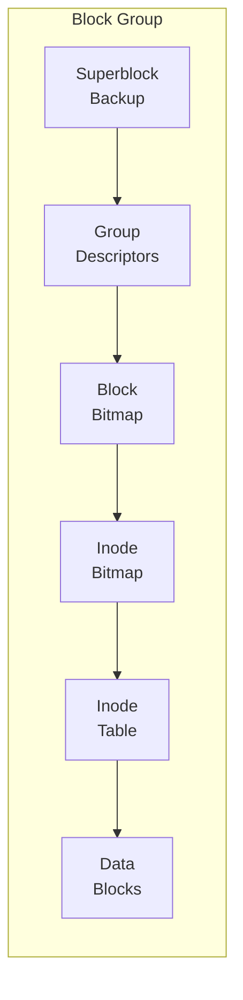
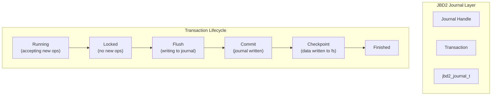
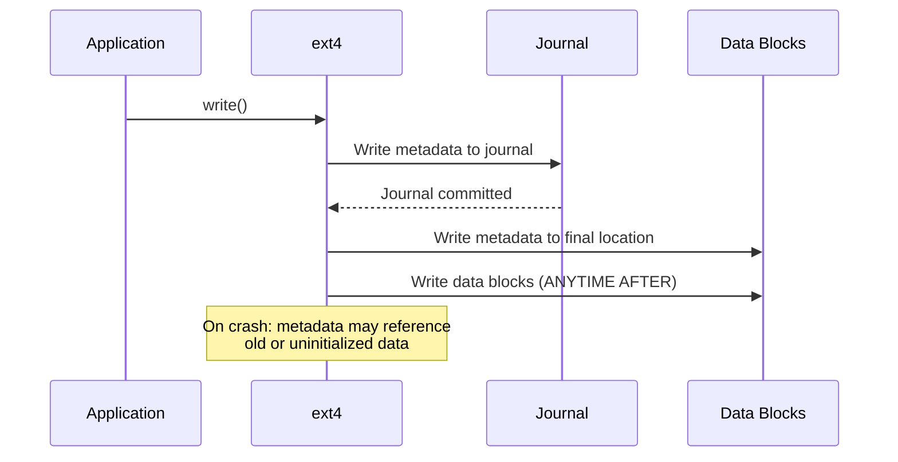
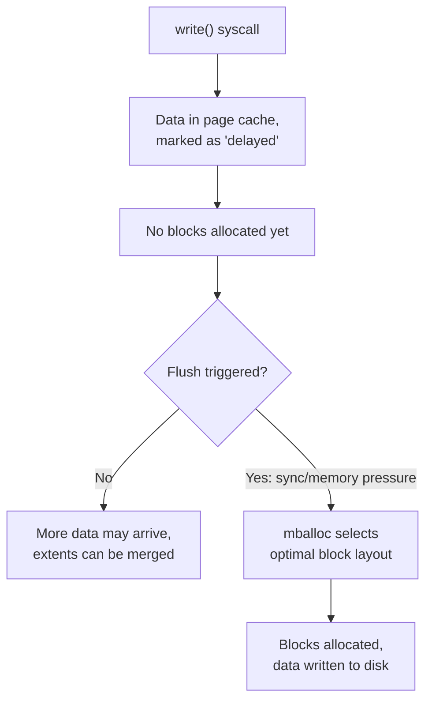

# Chapter 68: ext2/ext3/ext4 — The Extended Filesystem Family

## 1. Intuition

The ext filesystem family is Linux's most enduring storage technology. Born in 1992 when Rémy Card extended the original MINIX filesystem, ext2 was the first filesystem designed specifically for Linux. ext3 added journaling in 2001, and ext4 arrived in 2008 with extents, delayed allocation, and support for massive volumes. Together, they tell the story of how Linux storage evolved from a hobbyist system to an enterprise platform.

Think of ext4 as a well-organized filing cabinet. The cabinet has numbered drawers (block groups), each with its own index card (group descriptor). Each file has an index card (inode) that lists which shelves (blocks) hold its contents. The journal is like a notepad where you jot down what you're about to do before you do it — if the power goes out, you can replay the notepad to restore consistency.

## 2. Architecture

### 2.1 Evolution Timeline

```
1992  ext   — Extended filesystem (replaced MINIX fs)
1993  ext2  — Second extended filesystem (no journaling)
2001  ext3  — Third extended (journaling, HTree indexing)
2006  ext4  — Fourth extended (extents, 64-bit, delayed alloc)
```

### 2.2 On-Disk Layout

```
┌─────────────────────────────────────────────────────────────────┐
│                    ext4 Filesystem Layout                       │
├────────┬──────────┬──────────┬──────────┬──────────┬───────────┤
│ Boot   │  Group   │  Group   │  Group   │  Group   │           │
│ Block  │  Desc 0  │  Desc 1  │  Desc 2  │  Desc N  │  ...      │
│ (1KB)  │          │          │          │          │           │
├────────┴──────────┴──────────┴──────────┴──────────┴───────────┤

┌─────────────────────────────────────────────────────────────────┐
│                    Block Group N Layout                         │
├────────┬──────────┬────────┬────────┬────────┬─────────────────┤
│ Super  │ Group    │ Block  │ Inode  │ Inode  │   Data          │
│ Block  │ Desc     │ Bitmap │ Bitmap │ Table  │   Blocks        │
│ Copy   │ Copy     │        │        │        │                 │
└────────┴──────────┴────────┴────────┴────────┴─────────────────┘
```

### 2.3 Block Groups

The filesystem is divided into block groups, each containing a contiguous set of blocks. Each block group has:



## 3. Source Code References

| File | Purpose |
|------|---------|
| `fs/ext4/ext4.h` | Core data structures, on-disk formats |
| `fs/ext4/super.c` | Superblock operations, mount/umount |
| `fs/ext4/inode.c` | Inode operations, read/write |
| `fs/ext4/namei.c` | Directory operations, HTree |
| `fs/ext4/extents.c` | Extent tree management |
| `fs/ext4/ialloc.c` | Inode allocation |
| `fs/ext4/balloc.c` | Block allocation |
| `fs/ext4/jbd2.c` | Journal (JBD2) integration |
| `fs/ext4/resize.c` | Online resize |
| `fs/ext4/migrate.c` | Extent migration (indirect → extents) |
| `include/linux/jbd2.h` | Journal data structures |
| `fs/jbd2/` | JBD2 journal implementation |

## 4. Data Structures

### 4.1 Superblock

The ext4 superblock is 1024 bytes and sits at offset 1024 from the start of the volume:

```c
struct ext4_super_block {
    __le32  s_inodes_count;         /* total inodes */
    __le32  s_blocks_count_lo;      /* total blocks (low 32 bits) */
    __le32  s_r_blocks_count_lo;    /* reserved blocks (low 32) */
    __le32  s_free_blocks_count_lo; /* free blocks (low 32) */
    __le32  s_free_inodes_count;    /* free inodes */
    __le32  s_first_data_block;     /* first data block */
    __le32  s_log_block_size;       /* block size = 1024 << s_log_block_size */
    __le32  s_log_cluster_size;     /* cluster size */
    __le32  s_blocks_per_group;     /* blocks per group */
    __le32  s_clusters_per_group;   /* clusters per group */
    __le32  s_inodes_per_group;     /* inodes per group */
    __le32  s_mtime;               /* last mount time */
    __le32  s_wtime;               /* last write time */
    __le16  s_mnt_count;           /* mount count */
    __le16  s_max_mnt_count;       /* max mounts before check */
    __le16  s_magic;               /* magic number: 0xEF53 */
    __le16  s_state;               /* filesystem state */
    __le16  s_errors;              /* error behavior */
    __le16  s_minor_rev_level;     /* minor revision */
    __le32  s_lastcheck;           /* last check time */
    __le32  s_checkinterval;       /* max time between checks */
    __le32  s_creator_os;          /* OS */
    __le32  s_rev_level;           /* revision level */
    __le16  s_def_resuid;          /* default reserved UID */
    __le16  s_def_resgid;          /* default reserved GID */

    /* EXT4_DYNAMIC_REV fields */
    __le32  s_first_ino;           /* first non-reserved inode */
    __le16  s_inode_size;          /* inode size */
    __le16  s_block_group_nr;      /* block group of this superblock */
    __le32  s_feature_compat;      /* compatible features */
    __le32  s_feature_incompat;    /* incompatible features */
    __le32  s_feature_ro_compat;   /* read-only compatible features */
    __u8    s_uuid[16];            /* volume UUID */
    char    s_volume_name[16];     /* volume label */
    char    s_last_mounted[64];    /* last mount point */
    __le32  s_algorithm_usage_bitmap;

    /* Performance hints */
    __u8    s_prealloc_blocks;
    __u8    s_prealloc_dir_blocks;
    __le16  s_reserved_gdt_blocks;

    /* Journaling support */
    __u8    s_journal_uuid[16];
    __le32  s_journal_inum;        /* journal inode number */
    __le32  s_journal_dev;
    __le32  s_last_orphan;
    __le32  s_hash_seed[4];
    __u8    s_def_hash_version;
    __u8    s_jnl_backup_type;

    /* Size handling */
    __le32  s_desc_size;           /* group descriptor size */
    __le32  s_default_mount_opts;
    __le32  s_first_meta_bg;
    __le32  s_mkfs_time;
    __le32  s_jnl_blocks[17];

    /* 64-bit support */
    __le64  s_blocks_count_hi;     /* total blocks (high 32 bits) */
    __le64  s_r_blocks_count_hi;   /* reserved blocks (high 32) */
    __le64  s_free_blocks_count_hi;
    __le16  s_min_extra_isize;
    __le16  s_want_extra_isize;
    __le32  s_flags;
    __le16  s_raid_stride;
    __le16  s_mmp_update_interval;
    __le64  s_mmp_block;
    __le32  s_raid_stripe_width;
    __u8    s_log_groups_per_flex;
    __u8    s_checksum_type;
    __u8    s_encryption_level;
    __u8    s_reserved_pad;
    __le64  s_kbytes_written;
    __le32  s_snapshot_inum;
    __le32  s_snapshot_id;
    __le64  s_snapshot_r_blocks_count;
    __le32  s_snapshot_list;
    __le32  s_error_count;
    __le32  s_first_error_time;
    __le32  s_first_error_ino;
    __le64  s_first_error_block;
    __u8    s_first_error_func[32];
    __le32  s_first_error_line;
    __le32  s_last_error_time;
    __le32  s_last_error_ino;
    __le32  s_last_error_line;
    __le64  s_last_error_block;
    __u8    s_last_error_func[32];
    __u8    s_mount_opts[64];
    __le32  s_usr_quota_inum;
    __le32  s_grp_quota_inum;
    __le32  s_overhead_blocks;
    __le32  s_backup_bgs[2];
    __u8    s_encrypt_algos[4];
    __u8    s_encrypt_pw_salt[16];
    __le32  s_lpf_ino;
    __le32  s_prj_quota_inum;
    __le32  s_checksum_seed;
    __u8    s_wtime_hi;
    __u8    s_mtime_hi;
    __u8    s_mkfs_time_hi;
    __u8    s_lastcheck_hi;
    __u8    s_first_error_time_hi;
    __u8    s_last_error_time_hi;
    __u8    s_pad[2];
    __le32  s_reserved[96];
    __le32  s_checksum;            /* superblock checksum */
};
```

### 4.2 Inode

```c
struct ext4_inode {
    __le16  i_mode;                /* file mode */
    __le16  i_uid;                 /* owner UID (low 16 bits) */
    __le32  i_size_lo;             /* file size (low 32 bits) */
    __le32  i_atime;               /* access time */
    __le32  i_ctime;               /* inode change time */
    __le32  i_mtime;               /* modification time */
    __le32  i_dtime;               /* deletion time */
    __le16  i_gid;                 /* group ID (low 16 bits) */
    __le16  i_links_count;         /* hard link count */
    __le32  i_blocks_lo;           /* blocks count (512-byte units) */
    __le32  i_flags;               /* file flags */
    union {
        struct {
            __le32  l_i_version;
        } linux1;
        struct {
            __u32  h_i_translator;
        } hurd1;
        struct {
            __u32  m_i_reserved1;
        } masix1;
    } osd1;
    __le32  i_block[EXT4_N_BLOCKS]; /* block pointers (15 entries) */
    __le32  i_generation;          /* file version */
    __le32  i_file_acl_lo;         /* extended attributes block */
    __le32  i_size_high;           /* file size (high 32 bits) */
    __le32  i_obso_faddr;
    union {
        struct {
            __le16  l_i_blocks_high;
            __le16  l_i_file_acl_high;
            __le16  l_i_uid_high;
            __le16  l_i_gid_high;
            __le16  l_i_checksum_lo;
            __le16  l_i_reserved;
        } linux2;
        /* ... other OS-specific ... */
    } osd2;
    __le16  i_extra_isize;
    __le16  i_checksum_hi;
    __le32  i_ctime_extra;
    __le32  i_mtime_extra;
    __le32  i_atime_extra;
    __le32  i_crtime;
    __le32  i_crtime_extra;
    __le32  i_version_hi;
    __le32  i_projid;
};
```

### 4.3 The i_block Array

The 15-element `i_block` array uses a clever dual-purpose design:

```
i_block[0..11]  → Direct block pointers (blocks 0-11)
i_block[12]     → Single indirect block pointer
i_block[13]     → Double indirect block pointer
i_block[14]     → Triple indirect block pointer

With 4KB blocks:
  Direct:      12 × 4KB     = 48KB
  Single:      1024 × 4KB   = 4MB
  Double:      1024² × 4KB  = 4GB
  Triple:      1024³ × 4KB  = 4TB
```

When extents are enabled (ext4 default), the `i_block` array stores extent tree nodes instead:

```c
struct ext4_extent_header {
    __le16  eh_magic;      /* 0xF30A */
    __le16  eh_entries;    /* number of valid entries */
    __le16  eh_max;        /* capacity of entries */
    __le16  eh_depth;      /* depth (0 = leaf node) */
    __le32  eh_generation;
};

struct ext4_extent {
    __le32  ee_block;      /* first logical block */
    __le16  ee_len;        /* number of blocks */
    __le16  ee_start_hi;   /* physical block (high 16 bits) */
    __le32  ee_start_lo;   /* physical block (low 32 bits) */
};

struct ext4_extent_idx {
    __le32  ei_block;      /* logical block covered */
    __le32  ei_leaf_lo;    /* physical block of child node */
    __le16  ei_leaf_hi;    /* physical block (high 16 bits) */
    __u16   ei_unused;
};
```

## 5. Journaling (ext3/JBD2)

### 5.1 Journal Architecture



### 5.2 Journal Modes

#### data=ordered (default)

```mermaid
sequenceDiagram
    participant App as Application
    participant FS as ext4
    participant J as Journal
    participant Disk as Data Blocks

    App->>FS: write()
    FS->>Disk: Write data blocks (FIRST)
    Disk-->>FS: Data on disk
    FS->>J: Write metadata to journal
    J-->>FS: Journal committed
    FS->>Disk: Write metadata to final location
    Note over FS: On crash: journal replay restores<br/>metadata; data blocks were<br/>written before metadata commit
```

**Guarantee:** Data blocks hit disk before metadata. Prevents the "stale data" problem where metadata points to uninitialized blocks.

#### data=writeback



**Trade-off:** Faster, but can expose stale data after a crash.

#### data=journal

```mermaid
sequenceDiagram
    participant App as Application
    participant FS as ext4
    participant J as Journal
    participant Disk as Data Blocks

    App->>FS: write()
    FS->>J: Write BOTH data and metadata to journal
    J-->>FS: Journal committed
    FS->>Disk: Write data to final location
    FS->>Disk: Write metadata to final location
    Note over FS: On crash: everything is in<br/>journal; most consistent but slowest
```

**Trade-off:** Most consistent, but every byte is written twice (once to journal, once to final location).

### 5.3 Journal Block Descriptor

```c
struct journal_header_s {
    __be32  h_magic;        /* 0xC03B3998 */
    __be32  h_blocktype;    /* descriptor block, commit block, etc. */
    __be32  h_sequence;     /* transaction sequence number */
};

struct journal_block_tag3_s {
    __be32  t_blocknr;      /* target block number on disk */
    __be32  t_flags;        /* flags: escape, same_uuid, deleted, last */
    __be32  t_blocknr_high; /* high 32 bits of block number */
    __be32  t_checksum;     /* checksum of the journal entry */
    __u8    t_uuid[16];     /* UUID of the target filesystem */
};
```

## 6. ext4 Extent-Based Allocation

### 6.1 Extent Tree Structure

```
┌─────────────────────────────────────────┐
│          Inode i_block[60 bytes]        │
│  ┌─────────────────────────────────────┐│
│  │  ext4_extent_header                 ││
│  │  magic=0xF30A, entries=3, depth=1   ││
│  ├─────────────────────────────────────┤│
│  │  ext4_extent_idx[0]                 ││
│  │  ei_block=0, → leaf node A          ││
│  ├─────────────────────────────────────┤│
│  │  ext4_extent_idx[1]                 ││
│  │  ei_block=262144, → leaf node B     ││
│  ├─────────────────────────────────────┤│
│  │  ext4_extent_idx[2]                 ││
│  │  ei_block=524288, → leaf node C     ││
│  └─────────────────────────────────────┘│
└─────────────────────────────────────────┘

         ┌──────────────────┐
         │   Leaf Node A    │
         │  ┌──────────────┐│
         │  │ Header       ││
         │  │ depth=0      ││
         │  ├──────────────┤│
         │  │ Extent 0:    ││
         │  │ block=0      ││
         │  │ len=32768    ││
         │  │ start=1000   ││
         │  ├──────────────┤│
         │  │ Extent 1:    ││
         │  │ block=32768  ││
         │  │ len=16384    ││
         │  │ start=50000  ││
         │  └──────────────┘│
         └──────────────────┘
```

### 6.2 Advantages Over Indirect Blocks

| Feature | Indirect Blocks | Extents |
|---------|----------------|---------|
| Contiguous file | 1 pointer per block | 1 extent for millions of blocks |
| Max file (4KB blocks) | ~4TB | 16TB (with 64-bit) |
| Metadata overhead | High for large files | Very low |
| Allocation speed | O(blocks) | O(extents) |
| Fragmentation tracking | Not tracked | Explicit in extent |

### 6.3 Delayed Allocation

ext4 uses delayed allocation (delalloc) to improve write performance:



## 7. Multi-Block Allocator (mballoc)

The multi-block allocator replaced the old block allocator in ext4:

```c
struct ext4_allocation_request {
    struct inode *inode;       /* target inode */
    __u32 logical;            /* logical block number */
    __u32 lleft;              /* logical block of left neighbor */
    __u32 lright;             /* logical block of right neighbor */
    __u32 goal;               /* preferred physical block */
    __u32 lstart;             /* logical start block */
    __u32 len;                /* desired length in blocks */
    __u32 flags;              /* allocation flags */
};
```

**Allocation strategy:**
1. Try to allocate near the goal block (locality)
2. Try to allocate in the same block group as related blocks
3. Use buddy allocator within a group for contiguous allocation
4. Fall back to other groups if needed

## 8. Bigalloc

Bigalloc clusters multiple blocks into allocation units:

```bash
# Create filesystem with 64KB cluster size
mkfs.ext4 -C 65536 /dev/sdb1

# Advantages:
# - Reduced bitmap overhead
# - Better allocation for large files
# - Smaller metadata footprint

# Disadvantages:
# - Internal fragmentation for small files
# - Minimum allocation = cluster size
# - Not compatible with data=journal mode
```

## 9. Online Resize

ext4 supports growing a mounted filesystem:

```bash
# First, resize the underlying device (e.g., LVM)
lvextend -L +10G /dev/vg0/lv1

# Then resize the filesystem (online!)
resize2fs /dev/vg0/lv1

# resize2fs automatically detects the new size
# For RAID, specify the RAID stride:
resize2fs -E stride=128,stripe_width=384 /dev/vg0/lv1
```

## 10. Examples

### 10.1 Creating and Inspecting ext4

```bash
# Create filesystem
mkfs.ext4 -L "mydata" -b 4096 -I 256 /dev/sdb1

# Tune parameters
tune2fs -l /dev/sdb1  # List superblock info

# Key fields:
# Filesystem features: has_journal ext_attr resize_inode dir_index
#                     filetype extent flex_bg sparse_super large_file
#                     huge_file uninit_bg dir_nlink extra_isize
# Block count:         13107200
# Block size:          4096
# Blocks per group:    32768
# Inodes per group:    8192
# Inode size:          256
```

### 10.2 Journal Configuration

```bash
# Disable journal (convert to ext2-like)
tune2fs -O ^has_journal /dev/sdb1

# Create journal
tune2fs -j /dev/sdb1

# Set journal mode
mount -o data=writeback /dev/sdb1 /mnt
mount -o data=journal /dev/sdb1 /mnt
mount -o data=ordered /dev/sdb1 /mnt

# View journal status
tune2fs -l /dev/sdb1 | grep -i journal
# Journal inode:            8
# Journal backup:           inode blocks
# Journal features:         journal_incompat_revoke journal_64bit
# Journal size:             128M
# Journal length:           32768
```

### 10.3 Debugging with debugfs

```bash
# Interactive ext4 debugger
debugfs /dev/sdb1

# Useful commands:
# stat <inode>        — show inode details
# dump <inode> file   — dump file contents
# htree <inode>       — show directory hash tree
# extents <inode>     — show extent tree
# blocks <inode>      — show block map
# icheck <block>      — which inode uses this block
# bmap <inode> <blk>  — logical to physical block mapping
```

### 10.4 Filesystem Check

```bash
# Check filesystem
e2fsck -f /dev/sdb1

# Force check even if clean
e2fsck -f -y /dev/sdb1

# View check history
dumpe2fs -h /dev/sdb1 | grep -i "check\|state"
# Filesystem state:         clean
# Last checked:             Mon Jun 15 10:30:00 2025
# Check interval:           15552000 (6 months)
```

## 11. Performance

### 11.1 Mount Options for Performance

```bash
# Optimal performance (with some risk)
mount -o noatime,nodiratime,data=writeback,commit=60 /dev/sdb1 /mnt

# Explanation:
# noatime       — don't update access time on reads
# nodiratime    — don't update access time on directory reads
# data=writeback — fastest journal mode
# commit=60     — journal commit interval (default 5s)
```

### 11.2 Allocator Tuning

```bash
# View allocation statistics
cat /proc/fs/ext4/sdb1/mb_groups

# Tune allocation
# Stride and stripe_width for RAID arrays:
mkfs.ext4 -E stride=128,stripe_width=384 /dev/sdb1

# stride  = RAID chunk size / block size
# stripe_width = stride × data disks
```

### 11.3 Benchmark Comparison

```bash
# Compare journal modes
# Using fio for testing
fio --name=test --ioengine=libaio --direct=1 --bs=4k \
    --size=1G --numjobs=4 --rw=randwrite --runtime=60

# Typical results (IOPS, approximate):
# data=ordered:    15,000-25,000
# data=writeback:  20,000-35,000
# data=journal:    5,000-12,000
```

## 12. Common Pitfalls

### 12.1 Reserved Blocks

By default, 5% of blocks are reserved for root:

```bash
# Check reserved percentage
tune2l /dev/sdb1 | grep "Reserved block"
# Reserved block count:     655360

# Adjust for large data volumes (usually 1% is enough)
tune2fs -m 1 /dev/sdb1

# For non-root-owned filesystems, consider 0%
tune2fs -m 0 /dev/sdb1
```

### 12.2 inode Exhaustion

Running out of inodes while having free space:

```bash
# Check inode usage
df -i /dev/sdb1
# Filesystem     Inodes  IUsed  IFree IUse% Mounted on
# /dev/sdb1      819200 819200      0  100% /mnt

# Create filesystem with more inodes
mkfs.ext4 -i 4096 /dev/sdb1  # one inode per 4096 bytes (default: 16384)

# Warning: cannot add inodes to existing filesystem!
```

### 12.3 Fragmentation

ext4 can fragment over time:

```bash
# Check fragmentation
e4defrag -c /dev/sdb1

# Defragment
e4defrag /mnt/data

# Defragment a single file
e4defrag /mnt/data/largefile.db
```

### 12.4 32-bit Limitations

On 32-bit systems, large filesystem support requires:

```bash
# Ensure 64-bit feature is enabled
mkfs.ext4 -O 64bit /dev/sdb1

# Note: 32-bit kernels cannot mount filesystems > 2^32 blocks (16TB with 4KB blocks)
```

## 13. Best Practices

1. **Use data=ordered for general workloads.** It prevents stale data exposure without the performance penalty of full journaling.

2. **Use noatime for read-heavy workloads.** Access time updates generate unnecessary write I/O.

3. **Align RAID parameters.** Always set stride and stripe_width during `mkfs.ext4` — they cannot be changed later.

4. **Monitor inode usage.** Check `df -i` regularly, especially on filesystems with many small files.

5. **Set appropriate reserved blocks.** For data-only filesystems, reduce to 1% or 0%.

6. **Run e2fsck periodically.** Use the check interval to ensure filesystem integrity.

7. **Use extents (default).** Never disable the `extent` feature — it dramatically improves large file performance.

8. **Consider bigalloc for large files.** If most files are > 64KB, bigalloc reduces metadata overhead.

9. **Use lazy_itable_init for fast mkfs.** The `-E lazy_itable_init` option defers inode table initialization.

10. **Prefer ext4 over ext3.** ext4 is a superset — there's no reason to use ext3 for new filesystems.

## 14. Exercises

### Exercise 1: On-Disk Inspection
Create an ext4 filesystem on a 100MB loopback device. Use `debugfs` to examine:
- The superblock fields
- The root inode structure
- The block bitmap and inode bitmap
- The extent tree of a large file

### Exercise 2: Journal Mode Comparison
Create three ext4 filesystems and mount each with a different journal mode. Run `fio` random write benchmarks on each. Compare throughput, latency, and consistency after simulated power failure (using `dmsetup` to create a flakey device).

### Exercise 3: Extent Analysis
Create a 1GB file, then use `filefrag` and `debugfs` to examine its extent tree. Delete the middle 50% of the file, rewrite it, and observe how the extent tree changes.

### Exercise 4: inode Exhaustion
Create a small filesystem (50MB) with few inodes. Write a script that creates files until inodes are exhausted. Then demonstrate recovery by deleting files and verifying inode reuse.

### Exercise 5: Bigalloc vs Normal
Create two filesystems — one normal and one with bigalloc. Compare metadata overhead (`dumpe2fs`), performance for large sequential writes, and space efficiency for small files.

## 15. References

1. **ext4 Wiki** — https://ext4.wiki.kernel.org/
2. **ext4 Disk Layout** — https://ext4.wiki.kernel.org/index.php/Ext4_Disk_Layout
3. **Kernel documentation** — `Documentation/filesystems/ext4/`
4. **JBD2 design document** — `Documentation/filesystems/ext4/journal.rst`
5. *Linux Kernel Development*, Robert Love — Chapter 12 (ext2/ext3 coverage)
6. **The ext2/ext3/ext4 source code** — `fs/ext4/` in the Linux kernel
7. **e2fsprogs source** — https://git.kernel.org/pub/scm/fs/ext2/e2fsprogs.git
8. *Design and Implementation of the Second Extended Filesystem*, Rémy Card, et al.
