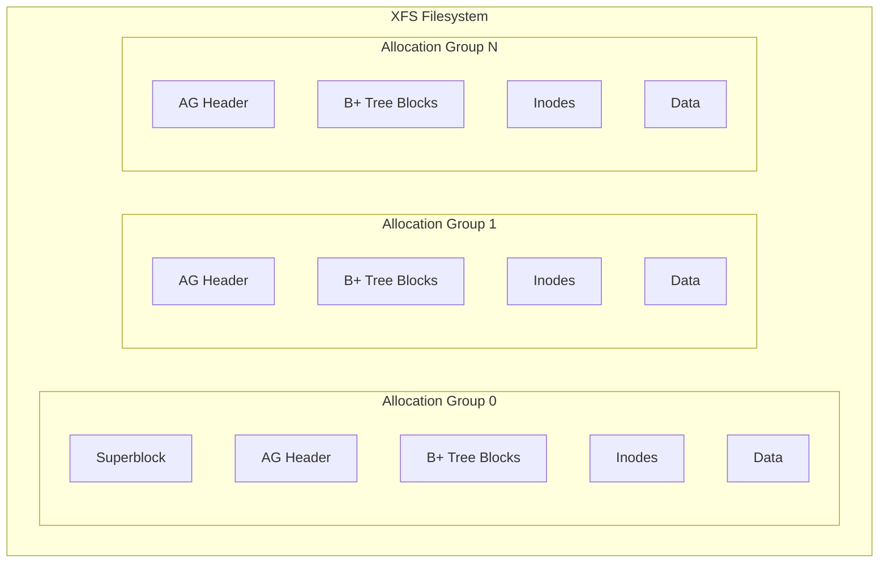
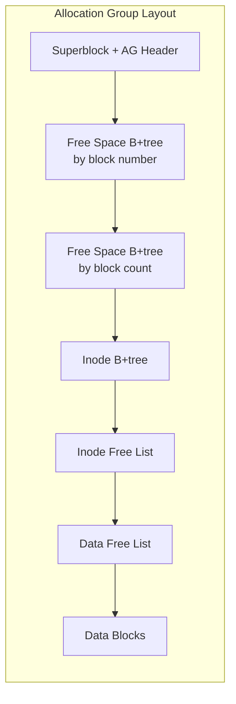
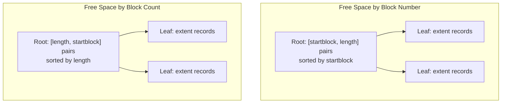
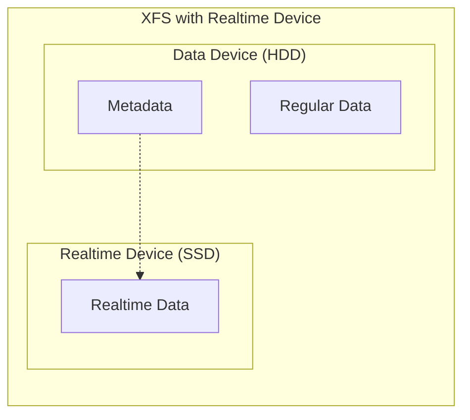
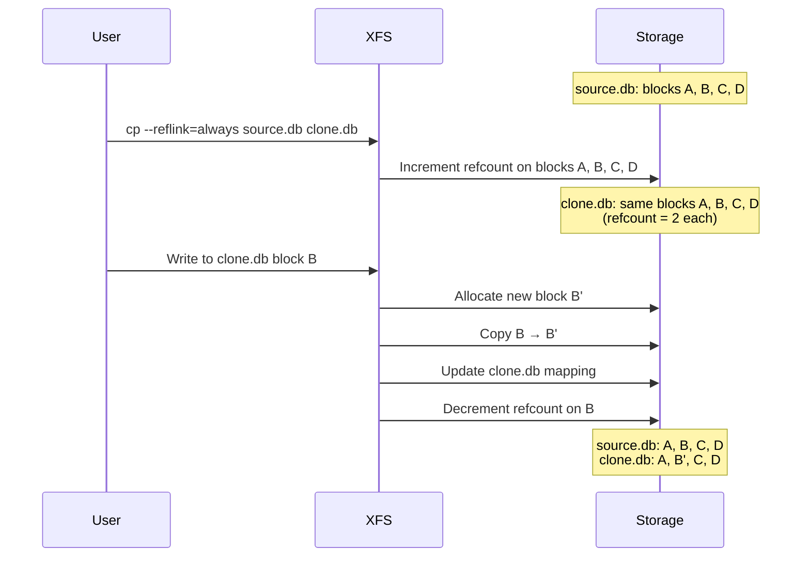
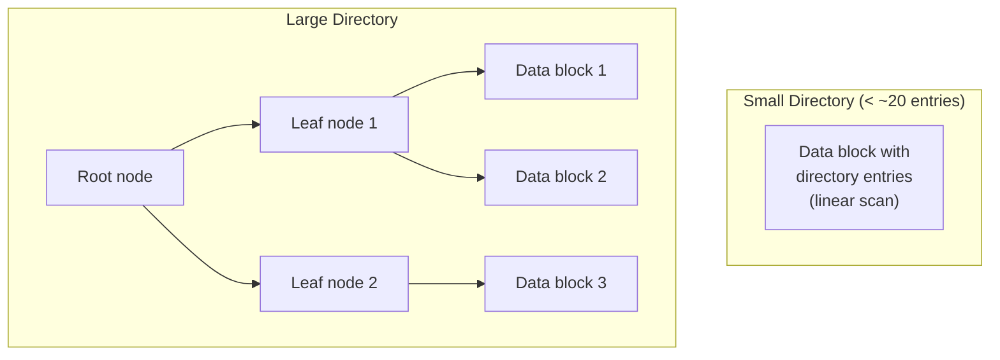

# Chapter 69: XFS — The High-Performance Filesystem

## 1. Intuition

XFS is the Formula 1 car of Linux filesystems. Originally developed by Silicon Graphics International (SGI) in 1993 for IRIX, it was ported to Linux in 2001 and became the default filesystem for RHEL/CentOS 7. XFS is designed for massive scalability — it handles filesystems up to 18 exabytes and files up to 8 exabytes, with performance that scales linearly across multiple CPUs and storage devices.

If ext4 is a reliable sedan, XFS is built for the highway. Its allocation group architecture allows parallel operations across different parts of the filesystem, making it the go-to choice for large databases, video editing, high-performance computing, and any workload that demands high throughput on large volumes.

## 2. Architecture

### 2.1 High-Level Structure



### 2.2 Allocation Groups (AGs)

The key architectural innovation of XFS is the allocation group. The filesystem is divided into equally-sized regions, each with its own:

- Free space B+ tree (by block number)
- Free space B+ tree (by block count)
- Inode B+ tree
- Inode allocation structures



**Why AGs matter:** Each AG has its own lock. Multiple threads can allocate/free blocks in different AGs simultaneously — this is what gives XFS its legendary parallel performance.

```bash
# View AG information
xfs_db -r /dev/sdb1
xfs_db> freesp
xfs_db> agf 0     # AG free space header for AG 0
xfs_db> agi 0     # AG inode header for AG 0
```

### 2.3 The AG Header

```c
struct xfs_agf {
    __be32  agf_magicnum;       /* XFS_AGF_MAGIC */
    __be32  agf_versionnum;     /* AGF version */
    __be32  agf_seqno;          /* AG sequence number */
    __be32  agf_length;         /* AG size in blocks */
    __be32  agf_roots[XFS_BTNUM_AGF]; /* B+ tree roots */
    __be32  agf_levels[XFS_BTNUM_AGF]; /* B+ tree levels */
    __be32  agf_flfirst;        /* first free list block */
    __be32  agf_fllast;         /* last free list block */
    __be32  agf_flcount;        /* free list block count */
    __be32  agf_freeblks;       /* free blocks */
    __be32  agf_longest;        /* longest free extent */
    __be32  agf_btreeblks;      /* blocks used by B+ trees */
    uuid_t  agf_uuid;           /* filesystem UUID */
    __be32  agf_rmap_blocks;    /* reverse mapping blocks */
    __be32  agf_refc_blocks;    /* reference count blocks */
    /* ... */
};
```

## 3. Source Code References

| File | Purpose |
|------|---------|
| `fs/xfs/libxfs/xfs_format.h` | On-disk format definitions |
| `fs/xfs/libxfs/xfs_types.h` | Type definitions |
| `fs/xfs/xfs_mount.h` | Mount-time structures |
| `fs/xfs/libxfs/xfs_alloc.c` | Block allocation (AG allocator) |
| `fs/xfs/libxfs/xfs_bmap.c` | Block mapping (extents) |
| `fs/xfs/libxfs/xfs_ialloc.c` | Inode allocation |
| `fs/xfs/libxfs/xfs_btree.c` | Generic B+ tree implementation |
| `fs/xfs/libxfs/xfs_da_btree.c` | Directory/attribute B+ tree |
| `fs/xfs/xfs_super.c` | VFS superblock operations |
| `fs/xfs/xfs_inode.c` | Inode operations |
| `fs/xfs/xfs_file.c` | File operations |
| `fs/xfs/xfs_reflink.c` | Reflink (CoW) support |
| `fs/xfs/repair/xfs_repair.c` | Filesystem repair |

## 4. Data Structures

### 4.1 B+ Trees

XFS uses B+ trees extensively — for free space tracking, inode indexing, directory entries, and extended attributes.

```c
struct xfs_btree_block {
    __be32  bb_magic;       /* magic number */
    __be16  bb_level;       /* level (0 = leaf) */
    __be16  bb_numrecs;     /* number of records */
    union {
        struct xfs_btree_block_shdr {  /* short form */
            __be32  bb_leftsib;
            __be32  bb_rightsib;
        } s;
        struct xfs_btree_block_lhdr {  /* long form */
            __be64  bb_leftsib;
            __be64  bb_rightsib;
            __be64  bb_blkno;
            __be64  bb_lsn;
            uuid_t  bb_uuid;
            __be64  bb_owner;
            __be32  bb_crc;
        } l;
    } bb_u;
};
```

**Free space B+ trees (two per AG):**



### 4.2 Inode Structure

XFS inodes are 512 bytes by default (vs 256 for ext4):

```c
struct xfs_dinode {
    __be16  di_magic;          /* XFS_DINODE_MAGIC */
    __be16  di_mode;           /* file mode */
    __u8    di_version;        /* inode version (2 or 3) */
    __u8    di_format;         /* data format */
    __be16  di_onlink;         /* old number of links */
    __be32  di_uid;            /* owner UID */
    __be32  di_gid;            /* owner GID */
    __be16  di_flushiter;      /* flush iteration count */
    __be32  di_atime;          /* access time (sec) */
    __be32  di_atime_t;        /* access time (nsec) */
    __be32  di_mtime;          /* modification time (sec) */
    __be32  di_mtime_t;        /* modification time (nsec) */
    __be32  di_ctime;          /* inode change time (sec) */
    __be32  di_ctime_t;        /* inode change time (nsec) */
    __be64  di_size;           /* file size in bytes */
    __be64  di_nblocks;        /* total blocks */
    __be32  di_extsize;        /* extent size hint */
    __be32  di_nextents;       /* data extents */
    __be16  di_anextents;      /* attr extents */
    __u8    di_forkoff;        /* attr fork offset */
    __u8    di_aformat;        /* attr format */
    __be32  di_dmevmask;       /* DMAPI event mask */
    __be16  di_dmstate;        /* DMAPI state */
    __be16  di_flags;          /* flags */
    __be32  di_gen;            /* generation number */

    /* Version 3 additions */
    __be32  di_changecount;    /* change count */
    __be64  di_lsn;            /* last LSN */
    __be64  di_flags2;         /* additional flags */
    __be32  di_cowextsize;     /* CoW extent size */
    __u8    di_pad2[12];
    xfs_timestamp_t di_crtime; /* creation time */
    __be64  di_ino;            /* inode number */
    uuid_t  di_uuid;           /* inode UUID */
    __be64  di_flushiter_v3;   /* CRC: flush iteration */
    /* ... */
};
```

### 4.3 Data Fork Formats

XFS supports multiple data formats:

```c
enum xfs_dinode_fmt {
    XFS_DINODE_FMT_DEV,     /* device file */
    XFS_DINODE_FMT_LOCAL,   /* inline data (small files) */
    XFS_DINODE_FMT_EXTENTS, /* extent list */
    XFS_DINODE_FMT_BTREE,   /* B+ tree (very large files) */
    XFS_DINODE_FMT_UUID,    /* DMAPI */
    XFS_DINODE_FMT_RMAP,    /* reverse mapping */
};
```

**Extent format:**
```c
struct xfs_bmbt_rec {
    __be64  l0;  /* packed: startoff(54) + startblock(52) + blockcount(21) + extentflag(1) */
};

/* Unpacked representation */
struct xfs_bmbt_irec {
    xfs_fileoff_t  br_startoff;   /* logical offset */
    xfs_fsblock_t  br_startblock; /* physical offset */
    xfs_filblks_t  br_blockcount; /* extent length */
    unsigned int   br_state;      /* unwritten flag */
};
```

## 5. Realtime Devices

XFS supports a realtime device — a separate device (often an SSD or fast RAID) for file data, while metadata goes to the regular device:

```bash
# Create filesystem with realtime device
mkfs.xfs -r rtdev=/dev/nvme0n1 /dev/sdb1

# Mount
mount /dev/sdb1 /mnt

# Set realtime flag on a file
xfs_io -c "chattr +t" /mnt/rtfile.dat

# View realtime device info
xfs_db -r /dev/sdb1
xfs_db> rtfree
```



**Use cases:** Video editing, real-time data acquisition, any workload requiring predictable I/O latency.

## 6. Reflinks and Copy-on-Write

XFS gained reflink support in Linux 4.9 (xfsprogs 4.9+):

```bash
# Enable reflink (mkfs.xfs >= 5.1.0 enables by default)
mkfs.xfs -m reflink=1 /dev/sdb1

# Create a reflink copy (instant, space-efficient)
cp --reflink=always /mnt/source.db /mnt/clone.db

# Verify shared extents
xfs_bmap -v /mnt/clone.db

# Check reference counts
xfs_db -r /dev/sdb1
xfs_db> refcountbt
```

**How reflinks work:**



## 7. Online Repair

XFS supports online repair (no unmount needed) for many metadata structures:

```bash
# Online scrub (check without repair)
xfs_scrub /dev/sdb1

# Online repair
xfs_repair /dev/sdb1  # This requires unmount

# For online repair (kernel 5.15+):
xfs_scrub -r /dev/sdb1  # Scrub and repair online

# What can be repaired online:
# - AG headers
# - B+ trees (inode, free space, reference count, reverse mapping)
# - Directories
# - Extended attributes
# - Symlinks
# - Parent pointers
```

### 7.1 Reverse Mapping (rmap)

XFS's reverse mapping feature maps physical blocks back to the files that own them:

```bash
# Enable reflink (requires rmap)
mkfs.xfs -m rmapbt=1,reflink=1 /dev/sdb1

# Query reverse mapping
xfs_db -r /dev/sdb1
xfs_db> blockget -n
xfs_db> ncheck
```

**Why rmap matters:** It enables reliable online repair by allowing the repair tool to determine which file owns any given physical block.

## 8. Directory Structure

XFS uses a B+ tree for large directories:



```c
struct xfs_dir2_data_hdr {
    __be32  magic;      /* XFS_DIR2_DATA_MAGIC */
    xfs_dir2_data_free_t bestfree[3]; /* 3 best free regions */
};

struct xfs_dir2_data_entry {
    __be64  inumber;    /* inode number */
    __u8    namelen;    /* name length */
    __u8    name[];     /* name bytes (padded to 4-byte boundary) */
    __be16  tag;        /* offset of this entry */
};
```

## 9. Examples

### 9.1 Creating and Tuning XFS

```bash
# Basic creation
mkfs.xfs /dev/sdb1

# With custom parameters
mkfs.xfs -f \
    -d agcount=32 \         # 32 allocation groups
    -l size=256m \          # 256MB log
    -b size=4096 \          # 4KB block size
    -i size=512 \           # 512-byte inodes
    -n size=8192 \          # 8KB directory block size
    /dev/sdb1

# View filesystem geometry
xfs_info /dev/sdb1
# meta-data=/dev/sdb1     isize=512    agcount=32, agsize=819200 blks
#          =               sectsz=512   attr=2, projid32bit=1
#          =               crc=1        finobt=1, sparse=1, rmapbt=1
#          =               reflink=1    bigtime=1 inobtcount=1
# data     =               bsize=4096   blocks=26214400, imaxpct=25
#          =               sunit=0      swidth=0 blks
# naming   =version 2      bsize=8192   ascii-ci=0, ftype=1
# log      =internal log    bsize=4096   blocks=65536, version=2
#          =               sectsz=512   sunit=0 blks, lazy-count=1
# realtime =none            extsz=4096   blocks=0, rtextents=0
```

### 9.2 Online Management

```bash
# Online grow
xfs_growfs /mnt

# Online defragment
xfs_fsr /dev/sdb1  # Defragment entire filesystem
xfs_fsr /mnt/file  # Defragment single file

# Quotas
xfs_quota -x -c "limit bsoft=5g bhard=6g user1" /mnt
xfs_quota -x -c "report -h" /mnt

# Filesystem UUID
xfs_admin -U generate /dev/sdb1  # New UUID
xfs_admin -U clear /dev/sdb1     # Clear UUID
```

### 9.3 Backup with xfsdump

```bash
# Full backup
xfsdump -l 0 -f /backup/dump0 /mnt

# Incremental backup
xfsdump -l 1 -f /backup/dump1 /mnt

# Restore
xfsrestore -f /backup/dump0 /mnt-restore

# Interactive restore
xfsrestore -I
```

### 9.4 Monitoring

```bash
# View allocation group statistics
xfs_db -r /dev/sdb1 -c "freesp -s" -c "quit"

# View inode allocation
xfs_db -r /dev/sdb1 -c "inodes" -c "quit"

# I/O statistics
xfsstats.pl  # Real-time XFS statistics

# View internal log usage
xfs_logprint -l /dev/sdb1
```

## 10. Performance

### 10.1 Tuning for Databases

```bash
# Mount options for database workloads
mount -o noatime,logbufs=8,logbsize=256k,swalloc /dev/sdb1 /mnt

# logbufs=8      — 8 log buffers (default 8)
# logbsize=256k  — 256KB log buffer size (default 32K)
# swalloc        — stripe-width allocation for new files
```

### 10.2 RAID Alignment

```bash
# Proper RAID alignment
mkfs.xfs -d su=128k,sw=4 /dev/sdb1
# su = stripe unit (chunk size)
# sw = stripe width (number of data disks)

# For RAID 5/6:
mkfs.xfs -d su=64k,sw=3 /dev/md0
# su = chunk size
# sw = data disks only (not parity)
```

### 10.3 AG Count Tuning

```bash
# More AGs = better parallelism (up to a point)
# Default: 1 AG per ~1GB, max 65536 AGs
mkfs.xfs -d agcount=64 /dev/sdb1

# For very large filesystems:
mkfs.xfs -d agcount=128 /dev/sdb1

# Rule of thumb:
# - Small FS (< 1TB): 16-32 AGs
# - Medium FS (1-10TB): 32-64 AGs
# - Large FS (> 10TB): 64-128 AGs
```

### 10.4 Benchmark Results

```
Typical performance characteristics (approximate):

Sequential Write (large file):
  XFS:     2-3 GB/s (direct I/O)
  ext4:    1.5-2.5 GB/s

Random 4K Write (database):
  XFS:     25,000-50,000 IOPS
  ext4:    20,000-40,000 IOPS

Directory Operations (1M files):
  XFS:     2-5x faster than ext4
  (B+ tree vs htree)

Parallel I/O (64 threads):
  XFS:     Scales linearly (AG architecture)
  ext4:    Bottlenecks on single allocation
```

## 11. Common Pitfalls

### 11.1 Cannot Shrink XFS

XFS filesystems can only grow, never shrink:

```bash
# This works:
xfs_growfs /mnt

# This does NOT work:
# There is no xfs_shrinkfs

# Workaround: create new, smaller XFS, copy data
```

### 11.2 No Online fsck (until recently)

Traditional `xfs_repair` requires unmount:

```bash
# Requires unmount
umount /mnt
xfs_repair /dev/sdb1
mount /dev/sdb1 /mnt

# Online scrub/repair (kernel 5.15+)
xfs_scrub /dev/sdb1  # Online
```

### 11.3 Metadata Write Amplification

XFS's journaling can cause write amplification:

```bash
# Monitor journal utilization
xfs_logprint -l /dev/sdb1 | tail -20

# Increase log size for heavy metadata workloads
mkfs.xfs -l size=1g /dev/sdb1
```

### 11.4 Directory Name Limits

XFS directory names are limited to 255 bytes:

```bash
# This fails:
touch /mnt/$(python3 -c "print('a'*256)")
# File name too long
```

### 11.5 AG Size and Alignment

Improper AG sizing can waste space:

```bash
# View AG information
xfs_info /dev/sdb1 | grep agcount

# Minimum AG size: 16MB
# AG size must be a multiple of the stripe width
```

## 12. Best Practices

1. **Use reflinks.** They're enabled by default in modern mkfs.xfs. Use `cp --reflink=auto` for space-efficient copies.

2. **Align RAID properly.** Always specify `su` and `sw` during `mkfs.xfs`. This cannot be changed later.

3. **Use direct I/O for databases.** Bypass the page cache with `O_DIRECT` for database workloads.

4. **Size the log appropriately.** For metadata-heavy workloads, use a larger log (`-l size=512m` or larger).

5. **Monitor AG utilization.** Uneven AG allocation can cause performance issues. Use `xfs_db -c freesp` to check.

6. **Use `xfsdump`/`xfsrestore` for backups.** They're aware of XFS internals and can do incremental backups.

7. **Enable `inode64` for large filesystems.** On filesystems > 1TB, use `mount -o inode64` to avoid inode allocation in the first 1TB.

8. **Prefer XFS for large files.** Its extent-based allocation and parallel AG architecture excel with large files.

9. **Use `noatime` for read-heavy workloads.** Eliminates unnecessary metadata writes.

10. **Plan for no shrink.** Since XFS cannot be shrunk, allocate conservatively or use LVM.

## 13. Exercises

### Exercise 1: AG Analysis
Create an XFS filesystem with 8 AGs. Use `xfs_db` to examine each AG's free space B+ tree. Write files of varying sizes and observe how they're distributed across AGs.

### Exercise 2: Reflink Experiment
Create a 1GB file on an XFS filesystem with reflinks. Make 10 reflink copies. Use `xfs_bmap` to verify shared extents. Modify different portions of each copy and observe CoW behavior.

### Exercise 3: Directory Performance
Create two test directories — one with 100,000 files on XFS and one on ext4. Benchmark `ls -l` and `find` operations. Explain the performance difference.

### Exercise 4: RAID Alignment
Create three XFS filesystems on a software RAID 5 array: one without alignment, one with correct `su`/`sw`, and one with `sunit`/`swidth`. Benchmark sequential write performance with `fio`.

### Exercise 5: Log Sizing
Create XFS filesystems with different log sizes (64K, 1M, 256M). Run a metadata-heavy workload (creating/deleting many small files). Compare performance and journal utilization.

## 14. References

1. **XFS.org** — https://xfs.org/
2. **XFS on-disk format** — https://xfs.org/index.php/Runtime_Disk_Format
3. **Kernel documentation** — `Documentation/filesystems/xfs-self-describing-metadata.rst`
4. **xfsprogs source** — https://git.kernel.org/pub/scm/fs/xfs/xfsprogs-dev.git
5. **XFS kernel source** — `fs/xfs/` in the Linux kernel
6. *Scalability in the XFS Filesystem*, SGI technical report
7. **Dave Chinner's XFS talks** — Various LCA and Linux Plumbers Conference presentations
8. **man pages** — `xfs_admin(8)`, `xfs_db(8)`, `xfs_growfs(8)`, `xfs_info(8)`, `xfs_repair(8)`
