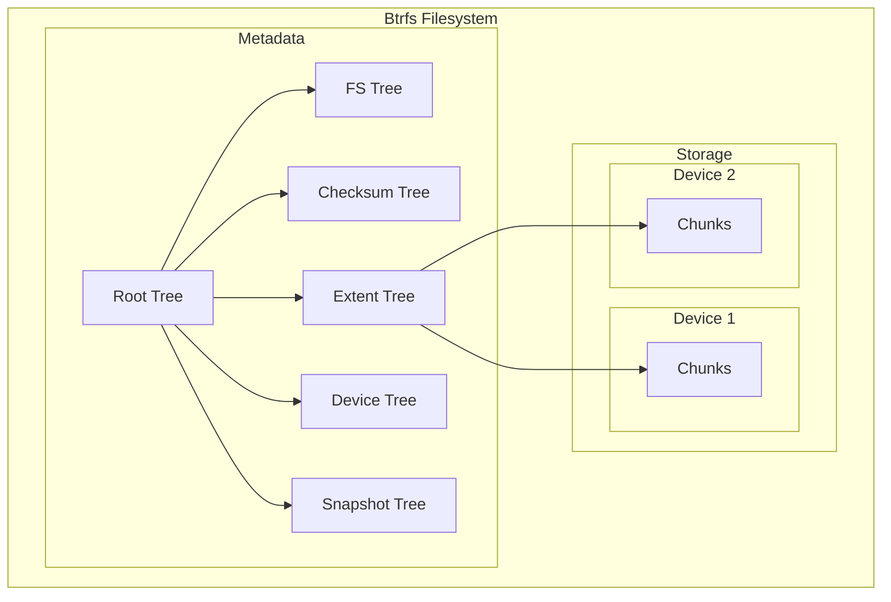
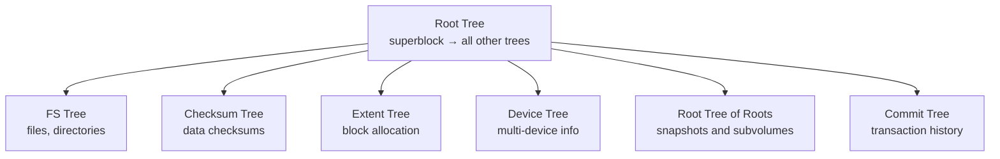
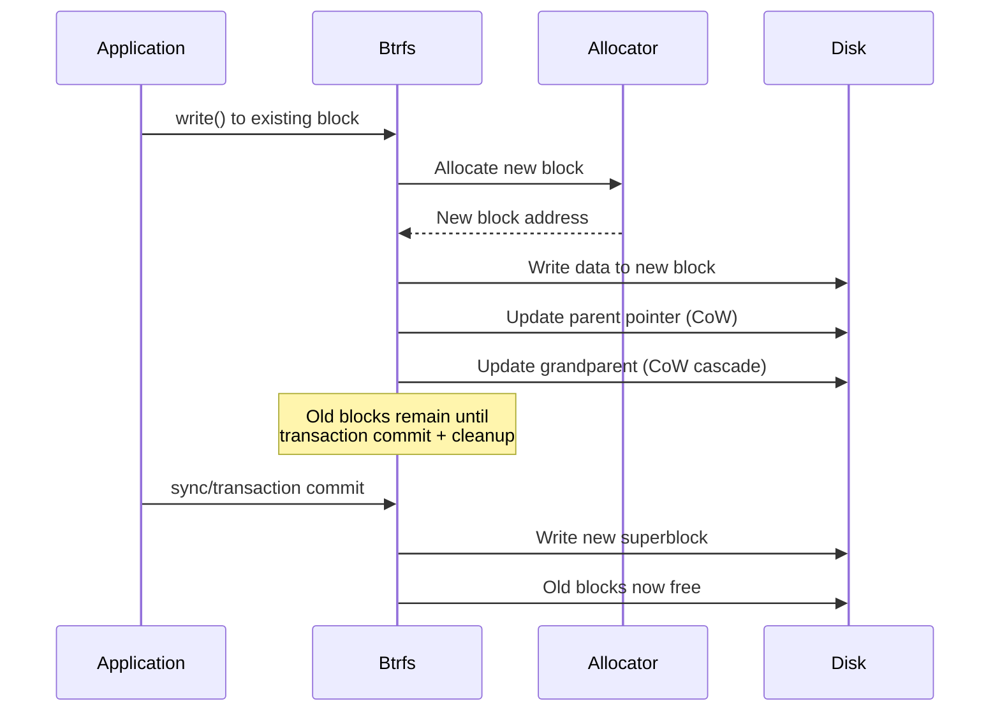
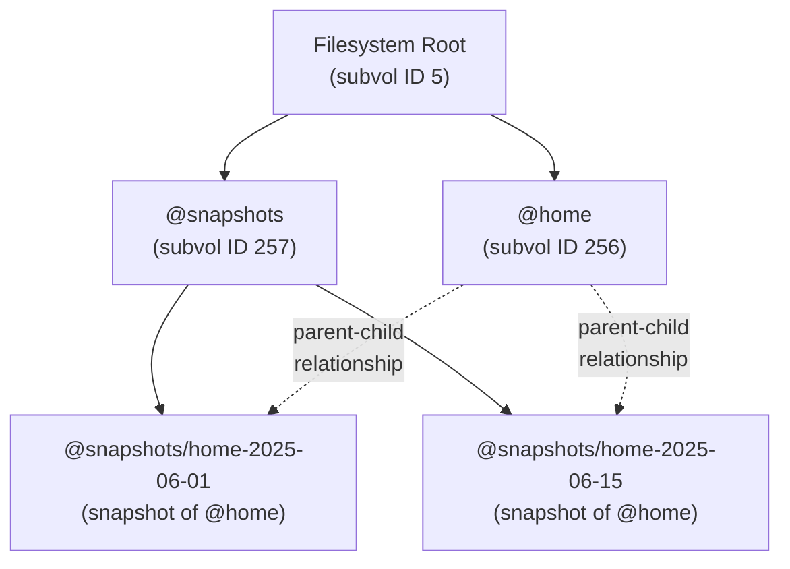
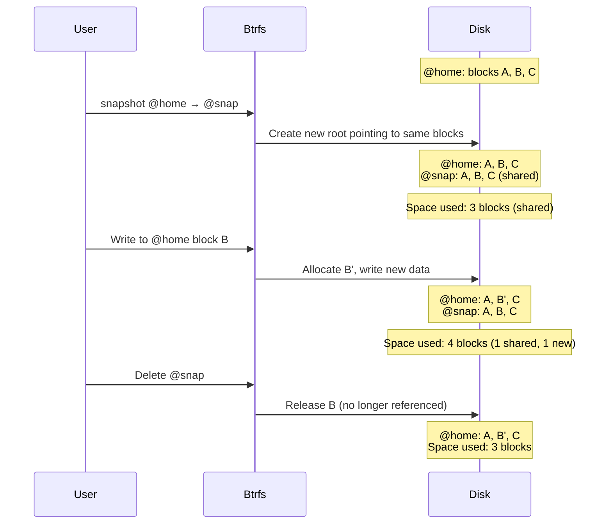
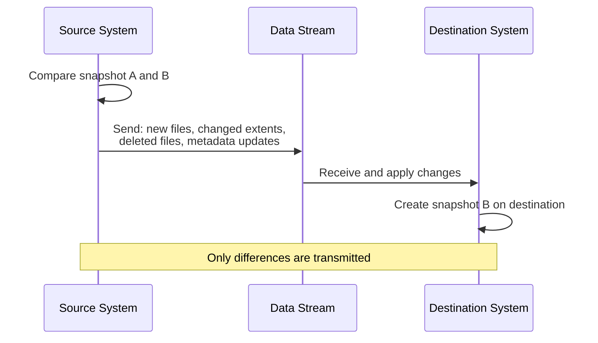
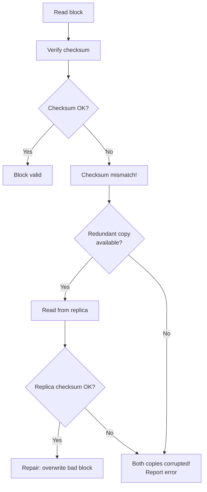

# Chapter 70: Btrfs — The B-Tree Filesystem

## 1. Intuition

Btrfs (pronounced "butter FS" or "b-tree FS") is Linux's most ambitious filesystem — a complete rethinking of storage management that brings enterprise features to everyday Linux. Developed by Oracle starting in 2007 and now maintained by a community of contributors, Btrfs treats the filesystem and volume manager as one unified system.

Think of traditional filesystems as filing cabinets with separate building managers (LVM, mdadm) for expanding storage. Btrfs is a smart building that manages its own rooms, copies its own documents, and even checks its own filing integrity — all without external tools. Its copy-on-write design means it never overwrites data in place, enabling instant snapshots, efficient cloning, and built-in RAID that actually works.

## 2. Architecture

### 2.1 High-Level Design



### 2.2 The B-Tree Foundation

Everything in Btrfs is a B-tree. Unlike ext4 where different data structures serve different purposes, Btrfs uses a single B-tree implementation for everything:



## 3. Source Code References

| File | Purpose |
|------|---------|
| `fs/btrfs/ctree.h` | Core B-tree data structures |
| `fs/btrfs/ctree.c` | B-tree implementation |
| `fs/btrfs/super.c` | VFS superblock operations |
| `fs/btrfs/inode.c` | Inode operations |
| `fs/btrfs/file.c` | File operations |
| `fs/btrfs/disk-io.c` | Disk I/O, superblock handling |
| `fs/btrfs/volumes.c` | Multi-device management |
| `fs/btrfs/extent_io.c` | Extent-based I/O |
| `fs/btrfs/extent-tree.c` | Extent allocation |
| `fs/btrfs/qgroup.c` | Quota groups |
| `fs/btrfs/send.c` | Send/receive implementation |
| `fs/btrfs/compression.c` | Compression (zlib, zstd, lzo) |
| `fs/btrfs/scrub.c` | Online scrub/repair |
| `fs/btrfs/raid56.c` | RAID 5/6 implementation |
| `fs/btrfs/free-space-cache.c` | Free space tracking |
| `fs/btrfs/relocation.c` | Snapshot-aware defragmentation |

## 4. Data Structures

### 4.1 The B-Tree Node

```c
struct btrfs_header {
    u8 csum[BTRFS_CSUM_SIZE];       /* checksum of everything after this */
    u8 fsid[BTRFS_FSID_SIZE];       /* filesystem UUID */
    __le64 bytenr;                   /* logical address of this node */
    __le64 flags;                    /* flags */
    u8 chunk_tree_uuid[BTRFS_UUID_SIZE];
    __le64 generation;               /* transaction generation */
    __le64 owner;                    /* owning tree ID */
    __le32 nritems;                  /* number of items */
    u8 level;                        /* 0 = leaf, higher = internal */
};

struct btrfs_node {
    struct btrfs_header header;
    struct btrfs_key_ptr ptrs[];     /* keys + pointers to children */
};

struct btrfs_key_ptr {
    struct btrfs_disk_key key;
    __le64 blockptr;                 /* physical block address */
    __le64 generation;               /* transaction generation */
};

struct btrfs_leaf {
    struct btrfs_header header;
    struct btrfs_item items[];       /* items in this leaf */
};

struct btrfs_item {
    struct btrfs_disk_key key;
    __le32 offset;                   /* offset within leaf */
    __le32 size;                     /* data size */
};
```

### 4.2 Key Types

Btrfs uses typed keys to identify items in B-trees:

```c
struct btrfs_disk_key {
    __le64 objectid;   /* identifies the object (inode, tree, etc.) */
    u8 type;           /* item type */
    __le64 offset;     /* type-specific offset */
};

/* Key types */
#define BTRFS_INODE_ITEM_KEY        1
#define BTRFS_INODE_REF_KEY         12
#define BTRFS_INODE_EXTREF_KEY      13
#define BTRFS_DIR_ITEM_KEY          84
#define BTRFS_DIR_INDEX_KEY         96
#define BTRFS_EXTENT_DATA_KEY       108
#define BTRFS_EXTENT_CSUM_KEY       128
#define BTRFS_ROOT_ITEM_KEY         132
#define BTRFS_ROOT_BACKREF_KEY      144
#define BTRFS_EXTENT_ITEM_KEY       168
#define BTRFS_METADATA_ITEM_KEY     169
#define BTRFS_TREE_BLOCK_REF_KEY    176
#define BTRFS_EXTENT_DATA_REF_KEY   178
#define BTRFS_SHARED_BLOCK_REF_KEY  182
#define BTRFS_SHARED_DATA_REF_KEY   184
#define BTRFS_BLOCK_GROUP_ITEM_KEY  192
#define BTRFS_DEV_ITEM_KEY          216
#define BTRFS_CHUNK_ITEM_KEY        228
```

### 4.3 Copy-on-Write Mechanism



**The CoW cascade:**

```
Original state:
  Root → Internal → Leaf → [data block A]

After write to data block A:
  Root → Internal → Leaf → [data block A']  (new copy)
                          → [data block A]   (old, still valid)

After commit:
  Root' → Internal' → Leaf' → [data block A']  (new tree)
  Root  → Internal  → Leaf  → [data block A]   (old snapshot, if kept)
```

## 5. Subvolumes and Snapshots

### 5.1 Subvolumes

Subvolumes are independent B-tree roots that act like separate filesystems:

```bash
# Create subvolumes
btrfs subvolume create /mnt/@home
btrfs subvolume create /mnt/@snapshots

# List subvolumes
btrfs subvolume list /mnt

# Set default subvolume
btrfs subvolume set-default 256 /mnt

# Mount a specific subvolume
mount -o subvol=@home /dev/sdb1 /home
```



### 5.2 Snapshots

Snapshots are instant, space-efficient copies of subvolumes:

```bash
# Create snapshot (read-only)
btrfs subvolume snapshot -r /mnt/@home /mnt/@snapshots/home-$(date +%F)

# Create snapshot (read-write)
btrfs subvolume snapshot /mnt/@home /mnt/@snapshots/home-working

# Delete snapshot
btrfs subvolume delete /mnt/@snapshots/home-2025-06-01
```

**How snapshots work with CoW:**



## 6. RAID Support

Btrfs has built-in RAID that works at the chunk level:

### 6.1 Supported Profiles

```bash
# RAID levels (metadata and data can use different profiles)
btrfs balance start -dprofiles=single -mprofiles=dup /mnt
btrfs balance start -dprofiles=raid1 -mprofiles=raid1 /mnt
btrfs balance start -dprofiles=raid1c3 -mprofiles=raid1c3 /mnt
btrfs balance start -dprofiles=raid1c4 -mprofiles=raid1c4 /mnt
btrfs balance start -dprofiles=raid0 -mprofiles=dup /mnt
btrfs balance start -dprofiles=raid10 -mprofiles=raid10 /mnt
btrfs balance start -dprofiles=raid5 -mprofiles=raid1 /mnt
btrfs balance start -dprofiles=raid6 -mprofiles=raid1 /mnt
```

### 6.2 RAID 5/6 Status

⚠️ **Important:** Btrfs RAID 5/6 has known issues (write hole, parity inconsistencies). Use with caution:

```bash
# RAID 5 (EXPERIMENTAL - use at your own risk)
mkfs.btrfs -d raid5 -m raid1 /dev/sdb /dev/sdc /dev/sdd

# Recommended alternative: RAID 1c3 or RAID 1c4 for 3-4 disk redundancy
mkfs.btrfs -d raid1c3 -m raid1c3 /dev/sdb /dev/sdc /dev/sdd
```

### 6.3 Multi-Device Management

```bash
# Create multi-device filesystem
mkfs.btrfs /dev/sdb /dev/sdc /dev/sdd

# Add device
btrfs device add /dev/sde /mnt

# Remove device (relocates data first)
btrfs device remove /dev/sdb /mnt

# Replace device
btrfs replace start /dev/sdb /dev/sdf /mnt

# View device stats
btrfs device stats /mnt
```

## 7. Send/Receive

Btrfs can send incremental differences between snapshots as a data stream:

```bash
# Create base snapshot
btrfs subvolume snapshot -r /mnt/@data /mnt/@snap/base

# ... some time later, changes happen ...

# Create incremental snapshot
btrfs subvolume snapshot -r /mnt/@data /mnt/@snap/incr1

# Send incremental stream
btrfs send -p /mnt/@snap/base /mnt/@snap/incr1 > /backup/incr1.stream

# On backup machine, receive
btrfs receive /backup/ /backup/incr1.stream

# Full send (no parent)
btrfs send /mnt/@snap/base > /backup/base.stream
btrfs receive /backup/ /backup/base.stream
```

**How send/receive works:**



## 8. Compression

Btrfs supports transparent compression:

```bash
# Mount with compression
mount -o compress=zstd:3 /dev/sdb1 /mnt
mount -o compress=lzo /dev/sdb1 /mnt
mount -o compress=zlib /dev/sdb1 /mnt

# Force compression on existing files
btrfs filesystem defragment -r -czstd /mnt

# Check compression ratio
btrfs filesystem df /mnt

# Per-file compression control
chattr +c /mnt/file        # Enable compression
chattr -c /mnt/file        # Disable compression
```

**Compression comparison:**

| Algorithm | Ratio | Speed | CPU Usage |
|-----------|-------|-------|-----------|
| zlib | Best | Slowest | High |
| zstd | Good | Fast | Medium |
| lzo | Fair | Fastest | Low |

## 9. Checksums and Scrubbing

Btrfs checksums all data and metadata:

```bash
# View checksum type
btrfs filesystem show /mnt | grep UUID

# Online scrub (verify all data)
btrfs scrub start /mnt
btrfs scrub status /mnt

# View scrub results
btrfs scrub status -d /mnt
```

**Scrub detects and repairs:**



## 10. Quota Groups (qgroups)

```bash
# Enable quota
btrfs quota enable /mnt

# Create subvolume with quota
btrfs subvolume create /mnt/@home
btrfs qgroup create 1/256 /mnt

# Set limits
btrfs qgroup limit 50G 1/256 /mnt

# View usage
btrfs qgroup show /mnt
```

## 11. Examples

### 11.1 Filesystem Creation

```bash
# Single device
mkfs.btrfs -L "data" /dev/sdb1

# Multi-device RAID1
mkfs.btrfs -d raid1 -m raid1 -L "mirror" /dev/sdb1 /dev/sdc1

# With specific nodesize
mkfs.btrfs -n 16384 /dev/sdb1  # 16KB nodes (default: 16KB)

# Mixed metadata+data (for small devices)
mkfs.btrfs --mixed /dev/sdb1
```

### 11.2 Filesystem Monitoring

```bash
# View filesystem usage
btrfs filesystem usage /mnt
# Overall:
#     Device size:                  100.00GiB
#     Device allocated:              50.00GiB
#     Device unallocated:            50.00GiB
#     Device missing:                  0.00B
#     Used:                          30.00GiB
#     Free (estimated):              68.00GiB      (min: 43.00GiB)
#     Free (statfs, current):        68.00GiB
#     Data ratio:                       1.00
#     Metadata ratio:                   2.00
#     Global reserve:                 256.00MiB      (used: 0.00B)
#     Multiple profiles:                  no

# Device statistics
btrfs device stats /mnt

# Show filesystem info
btrfs filesystem show
```

### 11.3 Snapshot Management Script

```bash
#!/bin/bash
# Automated Btrfs snapshot management

SUBVOL="/mnt/@home"
SNAPDIR="/mnt/@snapshots"
KEEP_DAILY=7
KEEP_WEEKLY=4
KEEP_MONTHLY=12

DATE=$(date +%F)
SNAPSHOT="$SNAPDIR/home-$DATE"

# Create daily snapshot
btrfs subvolume snapshot -r "$SUBVOL" "$SNAPSHOT"

# Remove old daily snapshots (keep $KEEP_DAILY)
ls -1d "$SNAPDIR"/home-????-??-?? | sort | head -n -$KEEP_DAILY | \
    xargs -I{} btrfs subvolume delete {}

# Weekly snapshot (every Sunday)
if [ $(date +%u) -eq 7 ]; then
    btrfs subvolume snapshot -r "$SUBVOL" "$SNAPDIR/home-weekly-$DATE"
fi

# Monthly snapshot (first day of month)
if [ $(date +%d) -eq 01 ]; then
    btrfs subvolume snapshot -r "$SUBVOL" "$SNAPDIR/home-monthly-$DATE"
fi
```

## 12. Performance

### 12.1 Mount Options

```bash
# High-performance mount options
mount -o noatime,compress=zstd:1,ssd,discard=async /dev/sdb1 /mnt

# For HDDs
mount -o noatime,nossd,commit=30 /dev/sdb1 /mnt

# For databases (no compression, direct I/O)
mount -o noatime,nodatasum,nodatacow /dev/sdb1 /mnt
```

### 12.2 SSD Optimizations

```bash
# Enable SSD-specific optimizations
mount -o ssd,discard=async /dev/sdb1 /mnt

# Verify SSD detection
btrfs property get /mnt/ ssd
```

### 12.3 Balance Operations

```bash
# Rebalance data (useful after device add/remove)
btrfs balance start /mnt

# Rebalance only metadata
btrfs balance start -musage=50 /mnt

# Rebalance only heavily used chunks
btrfs balance start -dusage=75 /mnt

# View balance status
btrfs balance status /mnt
```

## 13. Common Pitfalls

### 13.1 ENOSPC (No Space)

The most common Btrfs issue:

```bash
# Check allocation
btrfs filesystem usage /mnt

# If "Device allocated" is much larger than "Used", try:
btrfs balance start -dusage=5 /mnt

# Prevention: keep 10-20% free space
# Btrfs needs room for CoW operations and metadata
```

### 13.2 RAID 5/6 Write Hole

Btrfs RAID 5/6 has a known write hole issue:

```bash
# Problem: Power loss during parity write can leave
# inconsistent parity. Next read may return corrupt data.

# Mitigation: Use RAID 1/10/1c3/1c4 for critical data
# Status: As of kernel 6.x, RAID 5/6 is still not recommended
# for production use
```

### 13.3 Deduplication Limitations

Btrfs has online dedup via tools like `duperemove`:

```bash
# Install duperemove
apt install duperemove

# Deduplicate files
duperemove -r /mnt/data/

# Note: Btrfs does NOT have inline dedup (like ZFS).
# Dedup is post-process and tool-assisted.
```

### 13.4 Fragmentation

Btrfs CoW can cause fragmentation:

```bash
# Check fragmentation
filefrag /mnt/largefile

# Defragment (breaks CoW, loses reflink/snapshot sharing)
btrfs filesystem defragment /mnt/largefile

# Defragment without breaking compression
btrfs filesystem defragment -czstd /mnt/largefile
```

## 14. Best Practices

1. **Use appropriate RAID profiles.** RAID 1/1c3/1c4 for redundancy, RAID 0 for performance. Avoid RAID 5/6 in production.

2. **Keep 10-20% free space.** Btrfs needs headroom for CoW, snapshots, and metadata.

3. **Use zstd compression.** It offers the best ratio of compression to CPU cost. Start with level 1 or 3.

4. **Scrub regularly.** Schedule monthly scrubs to detect bit rot early.

5. **Use snapshots wisely.** Don't keep too many — they prevent space reclamation and increase metadata overhead.

6. **Separate subvolumes for different data.** Use `@home`, `@var`, `@snapshots` as separate subvolumes.

7. **Avoid `nodatacow` unless necessary.** It disables checksums and compression for those files. Only use for databases.

8. **Use send/receive for backups.** Incremental backups are space-efficient and fast.

9. **Monitor `btrfs device stats`.** Check for I/O errors regularly.

10. **Use SSD optimizations.** Enable `ssd` and `discard=async` for SSDs.

## 15. Exercises

### Exercise 1: Snapshot Workflow
Create a Btrfs filesystem with subvolumes for root, home, and snapshots. Create daily snapshots for a week. Demonstrate restoring a file from a snapshot.

### Exercise 2: Multi-Device RAID
Create a Btrfs RAID 1 filesystem with two devices. Simulate a device failure (using loopback devices and dmsetup). Verify data integrity and replace the failed device.

### Exercise 3: Send/Receive Backup
Set up a backup workflow using Btrfs send/receive. Create an initial full backup, then three incremental backups after modifications. Verify the backup integrity.

### Exercise 4: Compression Comparison
Create test files of different types (text, binary, database dumps). Mount with different compression algorithms (none, lzo, zstd:1, zstd:3, zlib). Compare space usage and I/O performance.

### Exercise 5: ENOSPC Recovery
Fill a small Btrfs filesystem to near capacity. Demonstrate the ENOSPC condition. Show how to recover using balance and snapshot deletion.

## 16. References

1. **Btrfs Wiki** — https://btrfs.wiki.kernel.org/
2. **Kernel documentation** — `Documentation/filesystems/btrfs/`
3. **Btrfs source code** — `fs/btrfs/` in the Linux kernel
4. **btrfs-progs source** — https://github.com/kdave/btrfs-progs
5. **Btrfs design document** — https://btrfs.wiki.kernel.org/index.php/Btrfs_design
6. *Btrfs: The Linux B-tree Filesystem*, Ohad Rodeh, ACM Transactions on Storage, 2013
7. **man pages** — `btrfs(8)`, `btrfs-subvolume(8)`, `btrfs-balance(8)`, `btrfs-scrub(8)`
8. **Status page** — https://btrfs.readthedocs.io/en/latest/Status.html
