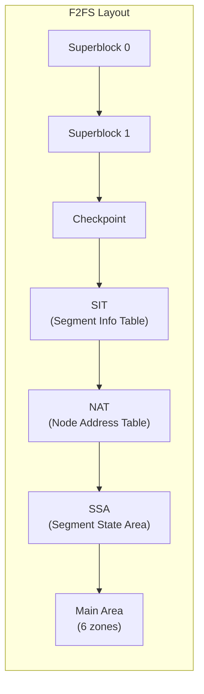
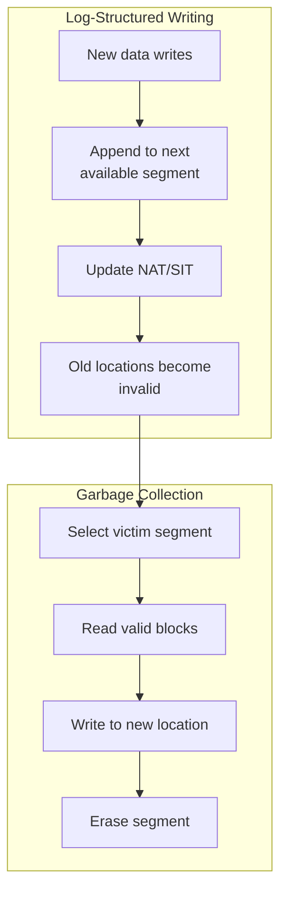
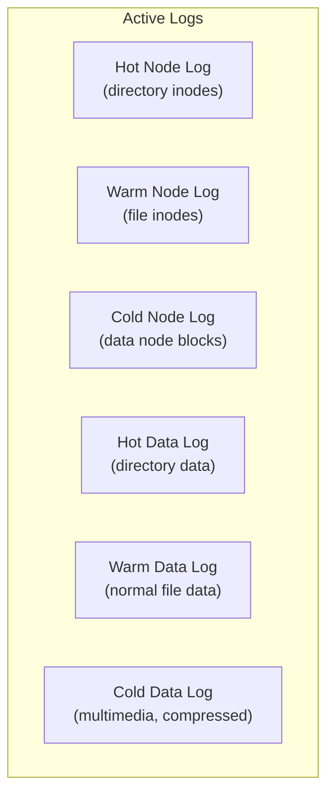
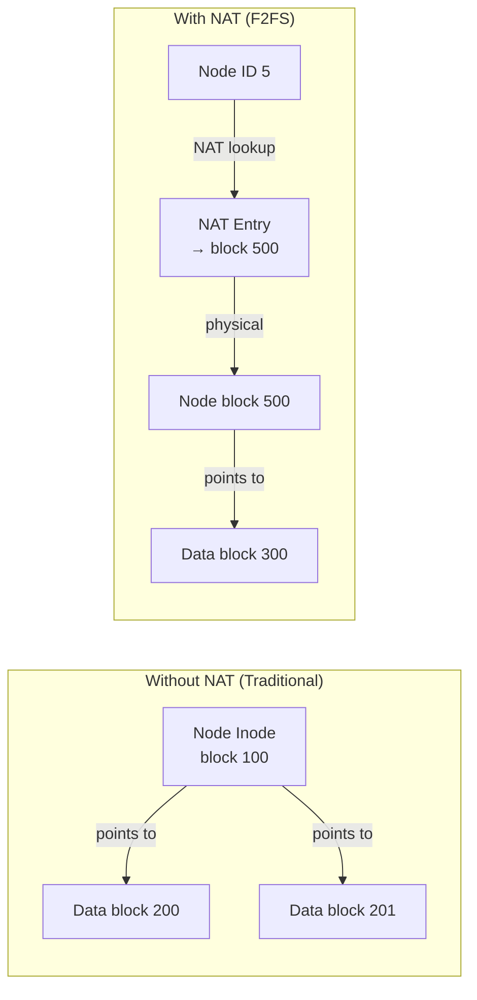
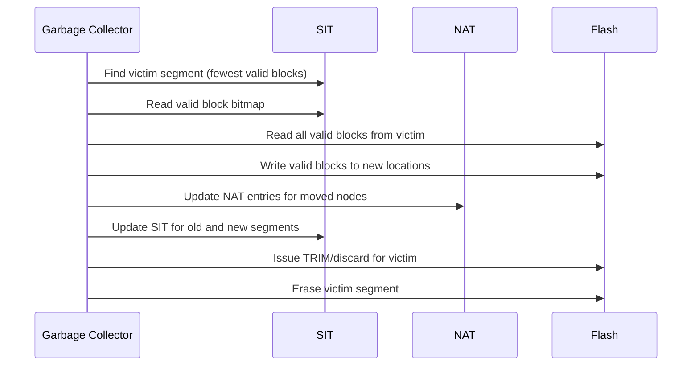

# Chapter 71: F2FS — Flash-Friendly File System

## 1. Intuition

F2FS (Flash-Friendly File System) is a log-structured filesystem designed specifically for NAND flash storage — SSDs, eMMC, SD cards, and USB drives. Created by Jaegeuk Kim at Samsung and merged into Linux 3.8 (2013), F2FS understands that flash storage has fundamentally different characteristics than spinning disks: no seek time, but expensive erase operations and limited write cycles.

Traditional filesystems like ext4 were designed for magnetic disks and treat all storage the same. F2FS takes a different approach: it writes data sequentially (like a log), manages garbage collection to minimize write amplification, and uses a unique Node Address Table (NAT) to decouple logical and physical addresses. The result is better performance and longer life for flash devices.

## 2. Architecture

### 2.1 On-Disk Layout



### 2.2 Log-Structured Design



### 2.3 Six Active Logs

F2FS maintains six active logs to separate different types of writes:



**Why six logs?** Separating hot (frequently modified) from cold (rarely modified) data reduces garbage collection overhead. A segment containing only cold data rarely needs GC.

## 3. Source Code References

| File | Purpose |
|------|---------|
| `fs/f2fs/f2fs.h` | Core data structures |
| `fs/f2fs/super.c` | VFS superblock operations |
| `fs/f2fs/inode.c` | Inode operations |
| `fs/f2fs/file.c` | File operations |
| `fs/f2fs/node.c` | NAT and node management |
| `fs/f2fs/segment.c` | Segment management, GC |
| `fs/f2fs/gc.c` | Garbage collection |
| `fs/f2fs/checkpoint.c` | Checkpoint implementation |
| `fs/f2fs/data.c` | Data block I/O |
| `fs/f2fs/dir.c` | Directory operations |
| `fs/f2fs/extent_cache.c` | Extent cache |
| `fs/f2fs/compress.c` | Inline compression |
| `fs/f2fs/sysfs.c` | sysfs tuning interface |

## 4. Data Structures

### 4.1 Superblock

```c
struct f2fs_super_block {
    __le32  magic;              /* F2FS_SUPER_MAGIC */
    __le16  major_ver;          /* major version */
    __le16  minor_ver;          /* minor version */
    __le32  log_sectorsize;     /* log2(sector size) */
    __le32  log_sectors_per_block; /* log2(sectors per block) */
    __le32  log_blocksize;      /* log2(block size) */
    __le32  log_blocks_per_seg; /* log2(blocks per segment) */
    __le32  segs_per_sec;       /* segments per section */
    __le32  secs_per_zone;      /* sections per zone */
    __le32  checksum_offset;    /* checksum offset in superblock */
    __le64  block_count;        /* total blocks */
    __le32  section_count;      /* total sections */
    __le32  segment_count;      /* total segments */
    __le32  segment_count_ckpt; /* checkpoint segments */
    __le32  segment_count_sit;  /* SIT segments */
    __le32  segment_count_nat;  /* NAT segments */
    __le32  segment_count_ssa;  /* SSA segments */
    __le32  segment_count_main; /* main area segments */
    __le32  segment0_blkaddr;   /* start block of segment 0 */
    __le32  cp_blkaddr;         /* checkpoint start block */
    __le32  sit_blkaddr;        /* SIT start block */
    __le32  nat_blkaddr;        /* NAT start block */
    __le32  ssa_blkaddr;        /* SSA start block */
    __le32  main_blkaddr;       /* main area start block */
    __le32  root_ino;           /* root inode number */
    __le32  node_ino;           /* node inode number */
    __le32  meta_ino;           /* meta inode number */
    __le32  cp_payload;
    __u8    version[VERSION_LEN]; /* kernel version */
    __u8    init_version[VERSION_LEN]; /* mkfs version */
    /* ... */
};
```

### 4.2 Node Address Table (NAT)

The NAT is F2FS's key innovation — it maps node IDs to physical block addresses:



```c
struct f2fs_nat_entry {
    __u8    version;        /* latest version */
    __le32  ino;            /* inode number */
    __le32  block_addr;     /* physical block address */
};

struct f2fs_nat_block {
    struct f2fs_nat_entry entries[NAT_ENTRY_PER_BLOCK];
};
```

**Why NAT matters:** In a log-structured filesystem, blocks move during garbage collection. Without NAT, every move would require updating all parent pointers. With NAT, only the NAT entry needs updating.

### 4.3 Segment Information Table (SIT)

```c
struct f2fs_sit_entry {
    __le16  vblocks;        /* valid block count */
    __u8    valid_map[64];  /* bitmap of valid blocks */
    __le64  mtime;          /* last modification time */
};

struct f2fs_sit_block {
    struct f2fs_sit_entry entries[SIT_ENTRY_PER_BLOCK];
};
```

### 4.4 Checkpoint

```c
struct f2fs_checkpoint {
    __le64  checkpoint_ver;     /* checkpoint version */
    __le64  user_block_count;   /* user block count */
    __le64  valid_block_count;  /* valid block count */
    __le32  rsvd_segment_count; /* reserved segment count */
    __le32  free_segment_count; /* free segment count */
    __le32  cur_node_segno[MAX_ACTIVE_NODE_LOGS];
    __le16  cur_node_blkoff[MAX_ACTIVE_NODE_LOGS];
    __le32  cur_data_segno[MAX_ACTIVE_DATA_LOGS];
    __le16  cur_data_blkoff[MAX_ACTIVE_DATA_LOGS];
    __le32  ckpt_flags;         /* checkpoint flags */
    __le32  cp_pack_total_block_count;
    __le32  sit_ver_bitmap_bytesize;
    __le32  nat_ver_bitmap_bytesize;
    __le32  checksum_offset;
    __le64  elapsed_time;       /* elapsed time */
    /* ... */
};
```

## 5. Garbage Collection

### 5.1 GC Algorithms

F2FS supports two GC strategies:


```bash
# View GC statistics
cat /sys/fs/f2fs/<device>/gc_* 2>/dev/null

# Trigger manual GC
echo 1 > /sys/fs/f2fs/<device>/gc_urgent

# Set GC policy
# 0 = cost-benefit (default)
# 1 = greedy
echo 1 > /sys/fs/f2fs/<device>/gc_policy
```

### 5.2 GC Process



### 5.3 Discard Management

F2FS manages TRIM/discard operations:

```bash
# View discard queue
cat /sys/fs/f2fs/<device>/discard_* 2>/dev/null

# Configure discard
echo 1 > /sys/fs/f2fs/<device>/discard  # Enable/disable
echo 64 > /sys/fs/f2fs/<device>/max_discard  # Max discards per round
echo 1 > /sys/fs/f2fs/<device>/discard_granularity
```

## 6. Examples

### 6.1 Creating F2FS

```bash
# Basic creation
mkfs.f2fs /dev/sdb1

# With options
mkfs.f2fs -l mydata -s 8 /dev/sdb1
# -l: label
# -s: segments per section (default 1)

# Enable extra features
mkfs.f2fs -O encrypt,extra_attr,inode_checksum /dev/sdb1

# For SD cards / eMMC
mkfs.f2fs -a 0 /dev/mmcblk0p1
# -a 0: disable discard during format
```

### 6.2 Mount Options

```bash
# Standard mount
mount -t f2fs /dev/sdb1 /mnt

# Optimized for SSD
mount -o noatime,compress_algorithm=zstd,compress_log_size=4 /dev/sdb1 /mnt

# Key mount options:
# noatime          — don't update access time
# compress_algorithm — enable inline compression
# compress_log_size  — compression cluster size (2^N blocks)
# nogc             — disable background GC
# discard          — enable TRIM (default)
# noextent_cache   — disable extent cache
# inlinecrypt      — use inline encryption hardware
```

### 6.3 Inline Compression

F2FS supports transparent compression:

```bash
# Mount with zstd compression
mount -o compress_algorithm=zstd,compress_log_size=4 /dev/sdb1 /mnt

# Per-file compression control
chattr +c /mnt/compressed_file
chattr -c /mnt/uncompressed_file

# Check compression status
fileattr -l /mnt/compressed_file
```

### 6.4 Encryption

F2FS supports filesystem-level encryption (fscrypt):

```bash
# Create encrypted directory
mkdir /mnt/encrypted
fscryptctl set_policy /mnt/encrypted <key_id>

# Or using fscrypt tool
fscrypt setup
fscrypt encrypt /mnt/encrypted
```

### 6.5 Monitoring

```bash
# View F2FS status
cat /sys/fs/f2fs/<device>/status

# Key metrics:
# - GC calls (foreground/background)
# - Valid blocks / Total blocks
# - Dirty segments
# - Free segments
# - Discard count

# View segment allocation
cat /sys/fs/f2fs/<device>/segment_count
cat /sys/fs/f2fs/<device>/free_segment_count
```

## 7. Performance

### 7.1 GC Tuning

```bash
# Reduce GC impact
echo 100 > /sys/fs/f2fs/<device>/gc_min_sleep_time    # ms
echo 30000 > /sys/fs/f2fs/<device>/gc_max_sleep_time   # ms

# For heavy workloads, increase GC aggressiveness
echo 500 > /sys/fs/f2fs/<device>/gc_min_sleep_time
echo 10000 > /sys/fs/f2fs/<device>/gc_max_sleep_time

# Urgent GC threshold
echo 10 > /sys/fs/f2fs/<device>/urgent_free_segments
```

### 7.2 Write Amplification

F2FS minimizes write amplification through:

```bash
# Hot/cold data separation
# - Hot data: directory entries, frequently modified metadata
# - Warm data: normal file data
# - Cold data: multimedia, rarely modified data

# The kernel auto-classifies, but you can hint:
# Sequential writes → cold
# Random writes → hot/warm
# Read-only data → cold
```

### 7.3 Benchmark Comparison

```
Typical performance on consumer SSD (approximate):

Sequential Write:
  F2FS:     450-500 MB/s
  ext4:     400-480 MB/s
  XFS:      420-490 MB/s

Random 4K Write (high queue depth):
  F2FS:     55,000-70,000 IOPS
  ext4:     45,000-60,000 IOPS
  XFS:      50,000-65,000 IOPS

Small File Creation (10,000 files):
  F2FS:     2-3x faster than ext4
  (NAT reduces metadata overhead)

GC Impact:
  F2FS:     Stutter possible during GC
  ext4:     No GC overhead
```

### 7.4 Tuning for Specific Workloads

```bash
# Database workload
mount -o noatime,nodiscard,noinline_data /dev/sdb1 /mnt

# Mobile/embedded (low memory)
mount -o noatime,noinline_data,inline_xattr /dev/sdb1 /mnt

# Sequential write (video recording)
mount -o noatime,nogc,compress_algorithm=lzo /dev/sdb1 /mnt
```

## 8. Common Pitfalls

### 8.1 GC Stalls

Background GC can cause latency spikes:

```bash
# Monitor GC activity
watch -n 1 cat /sys/fs/f2fs/<device>/gc_* 2>/dev/null

# Mitigation: adjust GC timing
echo 5000 > /sys/fs/f2fs/<device>/gc_min_sleep_time
echo 60000 > /sys/fs/f2fs/<device>/gc_max_sleep_time
```

### 8.2 Space Efficiency

F2FS wastes some space on metadata:

```bash
# View overhead
dump.f2fs /dev/sdb1 | grep -i "segment\|block"

# F2FS reserves ~5% for metadata and GC
# Actual usable space is less than total device size
```

### 8.3 fsck.f2fs Limitations

F2FS fsck is slower than ext4's:

```bash
# Offline check (requires unmount)
umount /mnt
fsck.f2fs /dev/sdb1

# Note: fsck.f2fs can be very slow on large filesystems
# It must scan the entire SIT and NAT
```

### 8.4 Inode Limits

F2FS has a fixed inode table:

```bash
# Cannot add inodes after creation
# Plan inode needs at mkfs time
mkfs.f2fs -n 1000000 /dev/sdb1  # Not supported
# Inodes are allocated dynamically, but limited by space
```

### 8.5 Encryption Overhead

F2FS encryption adds CPU overhead:

```bash
# Encryption adds ~10-20% CPU overhead per I/O
# Use hardware encryption if available
mount -o inlinecrypt /dev/sdb1 /mnt
```

## 9. Best Practices

1. **Use F2FS only on flash storage.** It's designed for SSDs, eMMC, and SD cards — not HDDs.

2. **Enable inline compression.** Use `compress_algorithm=zstd` for read-heavy workloads.

3. **Avoid filling to capacity.** Keep 10-15% free space for GC operations.

4. **Use discard cautiously.** On some SSDs, continuous TRIM can cause performance issues. Use `nodiscard` and periodic batch TRIM instead.

5. **Monitor GC activity.** Watch for GC stalls that can cause latency spikes.

6. **Use appropriate data classification.** Let the kernel classify hot/cold data, or use hints for specific workloads.

7. **Enable encryption for sensitive data.** F2FS's fscrypt integration is efficient on modern hardware.

8. **Don't use F2FS on HDDs.** The log-structured design causes excessive seeking on rotating media.

9. **Keep the kernel updated.** F2FS improves significantly with each kernel release.

10. **Use `noatime` for read-heavy workloads.** Reduces unnecessary metadata writes.

## 10. Exercises

### Exercise 1: F2FS vs ext4 on SSD
Create two partitions on an SSD. Format one with F2FS and one with ext4. Run `fio` benchmarks for sequential write, random write, and mixed read/write. Compare performance and write amplification.

### Exercise 2: GC Impact
Fill an F2FS filesystem to 80% capacity. Then write 10% more data (triggering GC). Monitor GC activity via sysfs and measure I/O latency during GC vs. non-GC periods.

### Exercise 3: Compression Analysis
Create test files of different types (text, binary, database dumps, images). Mount with different compression algorithms and measure space savings and I/O throughput.

### Exercise 4: Hot/Cold Separation
Monitor F2FS's data classification by examining the active logs. Write hot data (random small writes) and cold data (sequential large writes) and observe how they're distributed across different logs.

### Exercise 5: Checkpoint Recovery
Use `dmsetup` to create a flakey device that fails writes after N operations. Force a crash and observe F2FS recovery via checkpoint replay.

## 11. References

1. **F2FS documentation** — `Documentation/filesystems/f2fs.rst` in the kernel tree
2. **F2FS design paper** — *F2FS: A New File System for Flash Storage*, Jaegeuk Kim, FAST 2013
3. **Kernel source** — `fs/f2fs/` in the Linux kernel
4. **f2fs-tools source** — https://git.kernel.org/pub/scm/linux/kernel/git/jaegeuk/f2fs-tools.git
5. **F2FS Wiki** — https://en.wikipedia.org/wiki/F2FS
6. **Samsung F2FS page** — https://www.samsung.com/semiconductor/essd/technology/f2fs/
7. **man pages** — `mkfs.f2fs(8)`, `fsck.f2fs(8)`, `dump.f2fs(8)`
