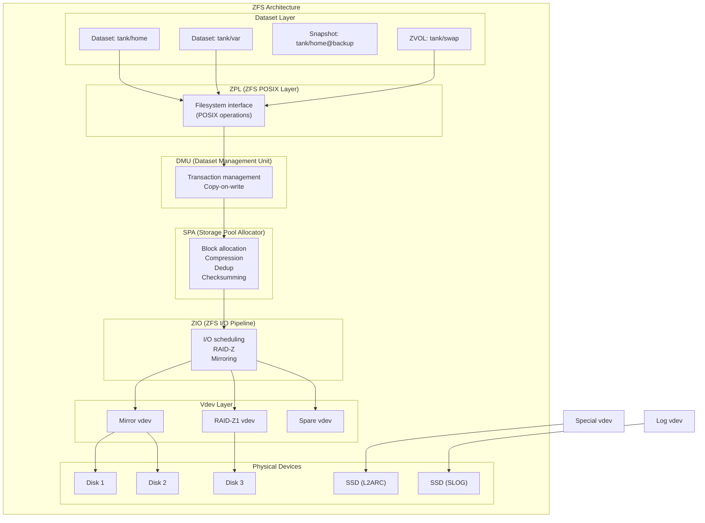
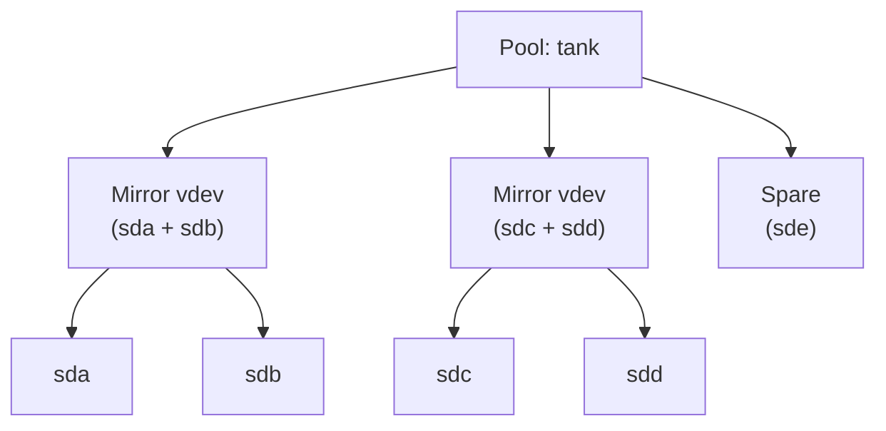
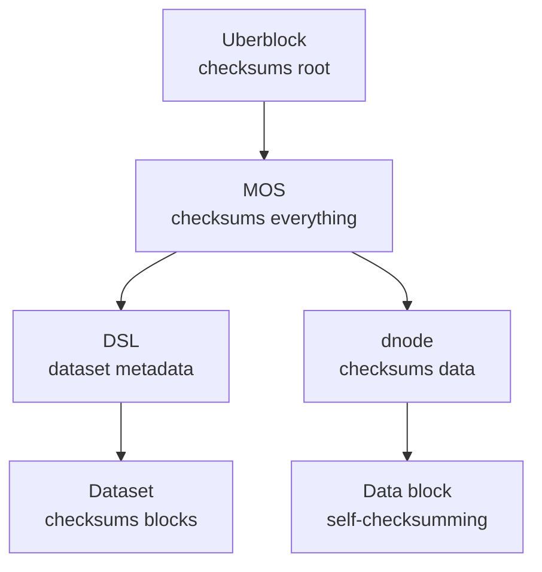
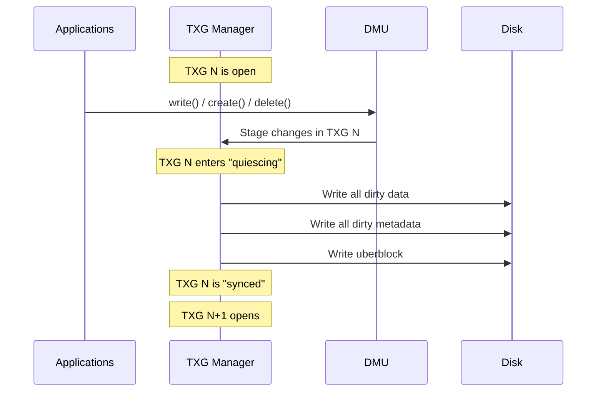
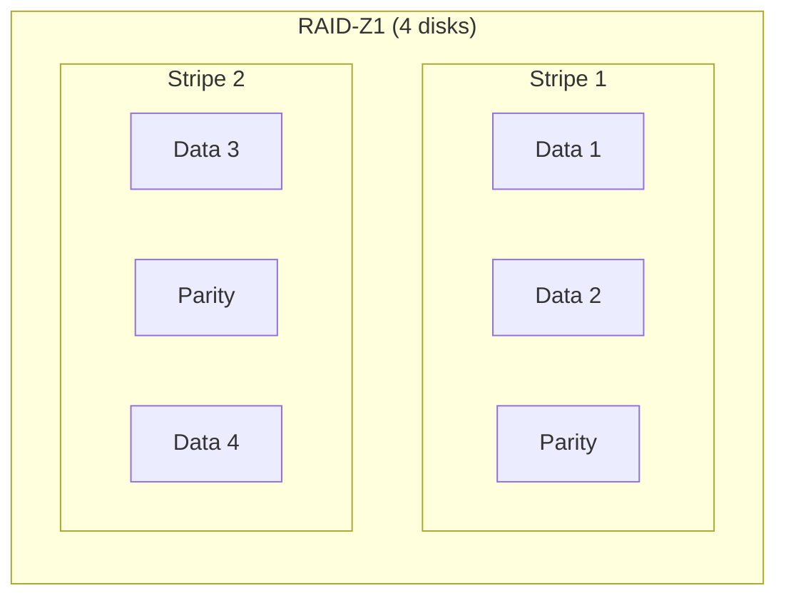
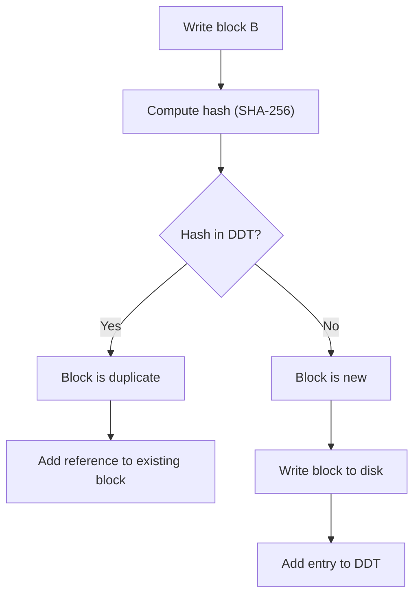
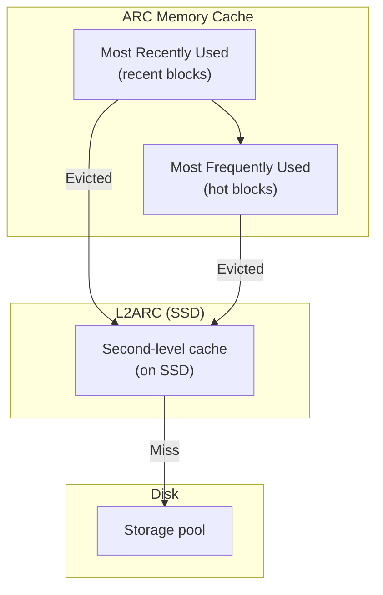

# Chapter 72: ZFS — Pools, vdevs, RAID-Z, and Enterprise Storage

## 1. Intuition

ZFS is the Swiss Army knife of storage — a combined filesystem and volume manager that brings enterprise-grade features to any system. Originally developed by Sun Microsystems in 2005, ZFS was designed to solve the fundamental problem of data corruption: silent bit rot, phantom writes, and RAID rebuild failures that plague traditional storage systems.

Think of ZFS as a paranoid librarian. Every book (block) gets a checksum. Every time you read a book, the librarian verifies the checksum. If a book is damaged, the librarian fetches a copy from another shelf (redundancy). The librarian also keeps a log of every change (transaction groups), so if the library catches fire, you can restore to the last known good state.

ZFS combines volume management (like LVM) and filesystem (like ext4) into one coherent system. You don't create partitions, then filesystems — you create a "pool" of storage and carve out "datasets" from it. This eliminates the classic problem of partitioning your disk wrong.

## 2. Architecture

### 2.1 High-Level Architecture



### 2.2 Pools and vdevs



## 3. Source Code References (OpenZFS on Linux)

| File | Purpose |
|------|---------|
| `module/zfs/zfs_znode.c` | ZFS inode/znode operations |
| `module/zfs/dsl_dataset.c` | Dataset (filesystem/snapshot) management |
| `module/zfs/dsl_pool.c` | Pool management |
| `module/zfs/dmu_objset.c` | Object set management |
| `module/zfs/spa.c` | Storage Pool Allocator |
| `module/zfs/zio.c` | ZFS I/O pipeline |
| `module/zfs/vdev.c` | Virtual device operations |
| `module/zfs/vdev_mirror.c` | Mirror implementation |
| `module/zfs/vdev_raidz.c` | RAID-Z implementation |
| `module/zfs/zfs_vnops.c` | VFS file operations |
| `module/zfs/zap.c` | ZFS Attribute Processor |
| `module/zfs/zil.c` | ZFS Intent Log |
| `module/zfs/arc.c` | Adaptive Replacement Cache |
| `module/zfs/ddt.c` | Deduplication table |
| `module/zfs/lz4.c` | LZ4 compression |

## 4. Data Structures

### 4.1 The Uberblock

The uberblock is ZFS's equivalent of a superblock — it points to the root of the metadata tree:

```c
typedef struct uberblock {
    uint64_t ub_magic;          /* UBERBLOCK_MAGIC */
    uint64_t ub_version;        /* uberblock version */
    uint64_t ub_txg;            /* transaction group number */
    uint64_t ub_guid_sum;       /* sum of all vdev GUIDs */
    uint64_t ub_timestamp;      /* time of last sync */
    zio_cksum_t ub_root_bp;     /* block pointer to MOS */
    /* ... */
} uberblock_t;
```

### 4.2 Block Pointer

ZFS block pointers are the fundamental unit of data referencing:

```c
typedef struct blkptr {
    /* DVA (Device Virtual Address) — 3 copies */
    dva_t   blk_dva[SPA_DVAS_PER_BP];  /* 3 DVAs */

    /* Metadata */
    uint64_t blk_prop;          /* properties (size, type, etc.) */
    uint64_t blk_pad[2];
    uint64_t blk_birth;         /* birth transaction group */
    uint64_t blk_fill;          /* fill count */

    /* Checksum */
    zio_cksum_t blk_cksum;     /* 256-bit checksum */
} blkptr_t;

/* DVA: Device Virtual Address */
typedef struct dva {
    uint64_t dva_word[2];
    /* Encodes: vdev ID, offset, size */
} dva_t;
```

**Key property: self-validating block pointers.** Every block pointer contains a checksum of the block it points to. This creates a Merkle tree of trust:



### 4.3 Transaction Groups (TXGs)

ZFS uses transaction groups for crash consistency:



## 5. RAID-Z

### 5.1 RAID-Z Levels

```bash
# RAID-Z1 (single parity, like RAID 5)
zpool create tank raidz1 sdb sdc sdd sde

# RAID-Z2 (double parity, like RAID 6)
zpool create tank raidz2 sdb sdc sdd sde sdf

# RAID-Z3 (triple parity)
zpool create tank raidz3 sdb sdc sdd sde sdf sdg

# Mirror (like RAID 1)
zpool create tank mirror sdb sdc

# Stripe (like RAID 0, no redundancy)
zpool create tank sdb sdc
```

### 5.2 RAID-Z vs Traditional RAID

| Feature | RAID-Z | Traditional RAID 5/6 |
|---------|--------|---------------------|
| Write hole | Eliminated (transactional) | Present (needs journal) |
| Resilver | Only used blocks | Entire disk |
| Checksum | Per-block | None |
| Partial stripe | Handled gracefully | Problematic |

### 5.3 RAID-Z Striping



## 6. Deduplication

### 6.1 How Dedup Works



### 6.2 Enabling Dedup

```bash
# Enable dedup on a dataset
zfs set dedup=on tank/data
zfs set dedup=sha256 tank/data  # Explicit hash
zfs set dedup=verify tank/data  # Verify after write

# Check dedup statistics
zpool status tank
zdb -DD tank  # Dedup statistics

# Dedup is VERY memory-hungry:
# ~320 bytes per unique block in the DDT
# For 1TB of unique 128KB blocks = ~2.5GB of DDT
```

### 6.3 Dedup Caveats

⚠️ **Dedup is rarely worth it.** The memory and CPU overhead is enormous:

```bash
# Only use dedup if:
# 1. You have very high dedup ratios (> 3x)
# 2. You have plenty of RAM (1GB per 1TB of data, minimum)
# 3. You can tolerate slower writes

# Better alternative: offline dedup tools
# Or use compression instead (often saves similar space)
```

## 7. Compression

```bash
# Enable compression
zfs set compression=lz4 tank/data     # Default, fast
zfs set compression=zstd tank/data    # Better ratio, moderate speed
zfs set compression=zstd-3 tank/data  # Compression level 3
zfs set compression=gzip tank/data    # Good ratio, slow
zfs set compression=gzip-9 tank/data  # Best gzip, very slow

# Check compression ratio
zfs get compressratio tank/data
# NAME        PROPERTY       VALUE  SOURCE
# tank/data   compressratio  2.15x  -
```

**Compression comparison:**

| Algorithm | Ratio | Speed | Best For |
|-----------|-------|-------|----------|
| lz4 | 1.5-2.5x | Fastest | General use (default) |
| zstd | 2-3x | Fast | Good balance |
| gzip-1 | 2-3x | Moderate | Log files |
| gzip-9 | 2.5-4x | Slowest | Cold storage |

## 8. Snapshots and Clones

```bash
# Create snapshot
zfs snapshot tank/home@2025-06-01

# List snapshots
zfs list -t snapshot

# Rollback to snapshot
zfs rollback tank/home@2025-06-01

# Create clone (writable snapshot)
zfs clone tank/home@2025-06-01 tank/home-clone

# Send snapshot (for backup)
zfs send tank/home@2025-06-01 > /backup/home.snap

# Send incremental
zfs send -i tank/home@2025-06-01 tank/home@2025-06-15 > /backup/incr.snap

# Receive on backup system
zfs receive tank/backup < /backup/home.snap
```

## 9. ARC and L2ARC

### 9.1 Adaptive Replacement Cache (ARC)



```bash
# View ARC statistics
arcstat
# or
cat /proc/spl/kstat/zfs/arcstats

# Key metrics:
# size      — current ARC size
# c         — target ARC size
# hits      — cache hits
# misses    — cache misses
# l2_hits   — L2ARC hits
# l2_misses — L2ARC misses

# Set ARC size limit
echo 8589934592 > /sys/module/zfs/parameters/zfs_arc_max  # 8GB

# Add L2ARC device
zpool add tank cache /dev/nvme0n1
```

### 9.2 SLOG (ZFS Intent Log)

```bash
# Add SLOG device (for synchronous write performance)
zpool add tank log /dev/nvme1n1

# SLOG is used for:
# - Synchronous writes (fsync, O_SYNC)
# - Database workloads
# - NFS server exports

# SLOG devices:
# - Should be fast (NVMe or Optane)
# - Should have power-loss protection
# - Size: 10-60 seconds of write throughput
```

## 10. Examples

### 10.1 Pool Creation

```bash
# Simple mirror
zpool create tank mirror sdb sdc

# RAID-Z2 with hot spares
zpool create tank \
    raidz2 sdb sdc sdd sde sdf \
    raidz2 sdg sdh sdi sdj sdk \
    spare sdl sdm

# Add SLOG and L2ARC
zpool add tank log mirror nvme0n1 nvme1n1
zpool add tank cache nvme2n1

# View pool status
zpool status tank
zpool list tank
```

### 10.2 Dataset Configuration

```bash
# Create datasets
zfs create tank/home
zfs create tank/home/alice
zfs create tank/home/bob
zfs create tank/var
zfs create tank/var/log

# Set properties
zfs set quota=100G tank/home/alice
zfs set reservation=50G tank/home/alice
zfs set compression=zstd tank/home
zfs set atime=off tank
zfs set recordsize=1M tank/media     # For large files
zfs set recordsize=4K tank/databases  # For databases
zfs set primarycache=all tank/databases
zfs set logbias=throughput tank/media
```

### 10.3 Monitoring and Maintenance

```bash
# Pool health
zpool status tank
zpool list -v tank

# Scrub (verify all data)
zpool scrub tank
zpool status tank  # View scrub progress

# View I/O statistics
zpool iostat tank 1

# View properties
zfs get all tank/home
zfs get used,available,referenced,mounted tank/home
```

### 10.4 Backup with Send/Receive

```bash
#!/bin/bash
# ZFS backup script

SOURCE="tank/home"
BACKUP="backup/home"
SNAP_NAME="daily-$(date +%F)"

# Create snapshot
zfs snapshot "$SOURCE@$SNAP_NAME"

# Send incremental if previous exists
PREV=$(zfs list -t snapshot -o name -S creation | grep "$SOURCE@" | sed -n '2p')
if [ -n "$PREV" ]; then
    zfs send -i "$PREV" "$SOURCE@$SNAP_NAME" | zfs receive "$BACKUP"
else
    zfs send "$SOURCE@$SNAP_NAME" | zfs receive "$BACKUP"
fi

# Cleanup old snapshots (keep 7)
zfs list -t snapshot -o name -S creation | \
    grep "$SOURCE@" | \
    tail -n +8 | \
    xargs -n1 zfs destroy
```

## 11. Performance

### 11.1 Record Size

```bash
# Default recordsize: 128KB
# Tune based on workload:

# Databases (small random I/O)
zfs set recordsize=8K tank/postgres

# Large files (video, archives)
zfs set recordsize=1M tank/media

# VMs
zfs set recordsize=64K tank/vms
```

### 11.2 Synchronous Write Performance

```bash
# Without SLOG, sync writes go to pool (slow)
# With SLOG, sync writes go to fast SSD (fast)

# Check sync behavior
zfs get sync tank/data
# sync=standard (default) — honor application request
# sync=always — treat all writes as sync
# sync=disabled — ignore sync (data loss risk!)

# For NFS, always use SLOG
```

### 11.3 Memory Requirements

```bash
# ZFS loves RAM:
# Minimum: 1GB base + 1GB per 1TB of storage
# Recommended: 2GB base + 1-2GB per 1TB

# View ARC size
arcstat -s size

# Set ARC max (in /etc/modprobe.d/zfs.conf)
options zfs zfs_arc_max=17179869184  # 16GB
```

### 11.4 Benchmark Results

```
Typical performance (4-disk RAID-Z2, 7200RPM):

Sequential Read:   400-600 MB/s
Sequential Write:  200-400 MB/s
Random 4K Read:    5,000-15,000 IOPS (with ARC hit)
Random 4K Write:   3,000-8,000 IOPS

With L2ARC (NVMe):
Random 4K Read:    50,000-100,000 IOPS

With SLOG (Optane):
Sync 4K Write:     20,000-50,000 IOPS
```

## 12. Common Pitfalls

### 12.1 Memory Pressure

ZFS can consume too much memory:

```bash
# Monitor ARC eviction
arcstat -s evict,l2_evict

# Reduce ARC size if system is swapping
echo 4294967296 > /sys/module/zfs/parameters/zfs_arc_max  # 4GB
```

### 12.2 Dedup Memory

Dedup can exhaust memory:

```bash
# Check DDT size
zdb -DD tank

# If DDT is too large, disable dedup
zfs set dedup=off tank/data
# Note: existing dedup data is NOT removed!
# You must copy data to a new dataset without dedup
```

### 12.3 Pool Performance Degradation

Pools slow down when >80% full:

```bash
# Monitor pool usage
zpool list tank
# Keep pool below 80% for best performance

# If over 80%, add more storage or delete data
zpool add tank mirror sde sdf
```

### 12.4 RAID-Z Expansion

RAID-Z vdevs cannot be expanded by adding disks (until OpenZFS 2.2+):

```bash
# Traditional way: add new vdev
zpool add tank raidz2 sdh sdi sdj sdl

# OpenZFS 2.2+ supports raidz expansion:
zpool attach tank raidz1-0 sde  # Adds one disk to raidz1

# WARNING: Cannot remove vdevs from a pool (except mirrors)
```

### 12.5 Boot Pool

ZFS as root filesystem requires special setup:

```bash
# Ubuntu: use zfsutils-linux
apt install zfsutils-linux

# Create boot pool
zpool create -o ashift=12 -o autotrim=on \
    -O compression=lz4 \
    -O acltype=posixacl \
    -O xattr=sa \
    -O relatime=on \
    -o compatibility=grub2 \
    bpool mirror sdb sdc

# Root pool
zpool create -o ashift=12 -o autotrim=on \
    -O compression=lz4 \
    -O acltype=posixacl \
    -O xattr=sa \
    -O relatime=on \
    rpool mirror sdb2 sdc2
```

## 13. Best Practices

1. **Use mirrors for performance, RAID-Z for capacity.** Mirrors rebuild faster and perform better for random I/O.

2. **Enable compression (lz4 by default).** It's essentially free and saves space.

3. **Scrub monthly.** Schedule regular scrubs to detect bit rot early.

4. **Keep pool below 80%.** ZFS performance degrades significantly when pools are nearly full.

5. **Use SLOG for sync-heavy workloads.** Database and NFS workloads benefit enormously.

6. **Size ARC appropriately.** More RAM = better performance. 1GB per TB minimum.

7. **Avoid dedup unless you have very high ratios and plenty of RAM.** Compression is usually better.

8. **Use snapshots for backup.** Send/receive with incremental snapshots is efficient and reliable.

9. **Use `atime=off` for read-heavy workloads.** Eliminates unnecessary metadata writes.

10. **Test recovery before you need it.** Practice `zpool replace`, `zpool resilver`, and `zfs rollback`.

## 14. Exercises

### Exercise 1: Pool Creation
Create a ZFS pool with a RAID-Z2 vdev, add a SLOG and L2ARC device. Configure datasets for different workloads (home, databases, media). Set appropriate properties for each.

### Exercise 2: Snapshot Workflow
Create a dataset, populate it with data, create snapshots, modify data, and demonstrate rollback. Send an incremental snapshot to a backup pool.

### Exercise 3: Compression Comparison
Create datasets with different compression algorithms (off, lz4, zstd, gzip). Write the same data to each. Compare space usage and write throughput.

### Exercise 4: Failure Simulation
Create a RAID-Z1 pool using loopback devices. Simulate a disk failure with `dd if=/dev/zero of=/dev/loop1 bs=1M count=100`. Observe ZFS detection, replace the device, and monitor resilver.

### Exercise 5: ARC Tuning
Monitor ARC hit rates under different workloads. Adjust ARC size and observe the impact on I/O performance. Compare with and without L2ARC.

## 15. References

1. **OpenZFS documentation** — https://openzfs.github.io/openzfs-docs/
2. **ZFS on Linux** — https://zfsonlinux.org/
3. **OpenZFS source** — https://github.com/openzfs/zfs
4. *ZFS: The Last Word in File Systems*, Jeff Bonwick, Sun Microsystems
5. **ZFS Design Documents** — https://github.com/openzfs/zfs/wiki/Design-Documents
6. **man pages** — `zpool(8)`, `zfs(8)`, `zdb(8)`, `zed(8)`
7. **Matt Ahrens' ZFS talks** — Various OpenZFS Developer Summit presentations
8. **FreeBSD ZFS documentation** — https://docs.freebsd.org/en/books/handbook/zfs/
