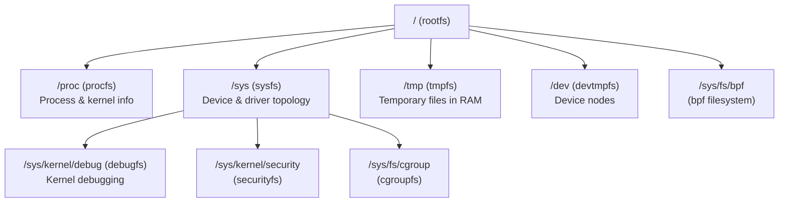

# Chapter 73: Virtual Filesystems — tmpfs, procfs, sysfs, and debugfs

## 1. Intuition

Not all filesystems live on disks. Linux's virtual filesystems are kernel interfaces that present kernel data and control mechanisms as files and directories. They exist only in memory, consume no disk space (or only RAM), and provide a elegant, unified way to interact with the kernel.

Imagine the kernel as a complex machine hidden behind a wall. Virtual filesystems are windows into that machine — `procfs` shows you process information, `sysfs` exposes device topology, `debugfs` lets kernel developers peek at internal state, and `tmpfs` provides fast temporary storage that evaporates on reboot.

The genius of this design is that instead of requiring custom system calls for every kernel data query, the kernel presents everything as files. Want to know a process's memory map? Read `/proc/1234/maps`. Want to change a kernel parameter? Write to `/proc/sys/net/ipv4/ip_forward`. Want to see your USB device tree? Browse `/sys/bus/usb/`.

## 2. Architecture

### 2.1 Virtual Filesystem Hierarchy



### 2.2 Comparison of Virtual Filesystems

| Feature | procfs | sysfs | tmpfs | debugfs |
|---------|--------|-------|-------|---------|
| Mount point | `/proc` | `/sys` | `/tmp`, `/dev/shm` | `/sys/kernel/debug` |
| Content | Processes, kernel | Devices, drivers, buses | Temporary files | Kernel internals |
| Persistence | Kernel lifetime | Kernel lifetime | Until unmount/reboot | Kernel lifetime |
| RAM usage | Minimal | Minimal | User data | Minimal |
| Security | 0444/0644 | 0444/0644 | 01777 | 0700 (root only) |
| Users | Everyone | Everyone | Everyone | Developers only |

## 3. Source Code References

| File | Purpose |
|------|---------|
| `fs/proc/` | procfs implementation |
| `fs/proc/base.c` | `/proc/PID/` entries |
| `fs/proc/meminfo.c` | `/proc/meminfo` |
| `fs/proc/stat.c` | `/proc/stat` |
| `fs/proc/sysctl.c` | `/proc/sys/` interface |
| `fs/sysfs/` | sysfs implementation |
| `fs/sysfs/dir.c` | sysfs directory operations |
| `fs/sysfs/file.c` | sysfs file operations |
| `fs/sysfs/group.c` | sysfs attribute groups |
| `mm/shmem.c` | tmpfs/shmem implementation |
| `fs/debugfs/` | debugfs implementation |
| `fs/debugfs/inode.c` | debugfs core |
| `fs/debugfs/file.c` | debugfs file helpers |
| `fs/kernfs/` | kernfs (shared by sysfs/cgroupfs) |
| `include/linux/proc_fs.h` | procfs API |
| `include/linux/sysfs.h` | sysfs API |

## 4. procfs (/proc)

### 4.1 Process Information

```bash
# Process-specific entries
ls /proc/1/
# attr/      cgroup     comm       cwd ->      environ    exe ->
# fd/        fdinfo/    gid_map    io         limits     maps
# mem        mountinfo  mounts     net/       ns/        oom_adj
# oom_score  oom_score_adj  pagemap  root ->   smaps      stat
# statm      status     syscall    task/      uid_map    wchan

# Process status
cat /proc/1/status
# Name:   systemd
# Umask:  0000
# State:  S (sleeping)
# Tgid:   1
# Ngid:   0
# Pid:    1
# PPid:   0
# TracerPid:  0
# Uid:    0   0   0   0
# Gid:    0   0   0   0
# FDSize: 256
# Groups:  
# VmPeak:   168436 kB
# VmSize:   168436 kB
# VmLck:         0 kB
# VmPin:         0 kB
# VmHWM:     12340 kB
# VmRSS:     12340 kB
```

### 4.2 Key /proc Files

```bash
# System-wide information
cat /proc/cpuinfo          # CPU information
cat /proc/meminfo          # Memory statistics
cat /proc/version          # Kernel version
cat /proc/uptime           # System uptime
cat /proc/loadavg          # Load averages
cat /proc/stat             # CPU statistics
cat /proc/vmstat           # Virtual memory statistics
cat /proc/filesystems      # Registered filesystems
cat /proc/mounts           # Mounted filesystems
cat /proc/partitions       # Partition table
cat /proc/modules          # Loaded kernel modules
cat /proc/cmdline          # Kernel command line
cat /proc/devices          # Character and block devices
cat /proc/interrupts       # Interrupt counters
cat /proc/softirqs         # Soft IRQ counters
cat /proc/net/dev          # Network device statistics
```

### 4.3 /proc/sys — Kernel Parameters

```bash
# Network parameters
cat /proc/sys/net/ipv4/ip_forward
echo 1 > /proc/sys/net/ipv4/ip_forward

# Virtual memory
cat /proc/sys/vm/swappiness
echo 10 > /proc/sys/vm/swappiness

# Filesystem
cat /proc/sys/fs/file-max
echo 1000000 > /proc/sys/fs/file-max

# Kernel
cat /proc/sys/kernel/hostname
echo "myserver" > /proc/sys/kernel/hostname

# Use sysctl for persistent changes
sysctl -w net.ipv4.ip_forward=1
sysctl -a  # List all parameters
```

### 4.4 Process File Descriptors

```bash
# View open files for a process
ls -la /proc/$$/fd/
# lrwx------ 1 root root 64 Jun 29 10:00 0 -> /dev/pts/0
# lrwx------ 1 root root 64 Jun 29 10:00 1 -> /dev/pts/0
# lrwx------ 1 root root 64 Jun 29 10:00 2 -> /dev/pts/0
# lrwx------ 1 root root 64 Jun 29 10:00 255 -> /home/user/.bashrc

# View file descriptor info
cat /proc/$$/fdinfo/0
# pos:    0
# flags:  0100000
# mnt_id: 23

# View memory maps
cat /proc/$$/maps

# View memory usage details
cat /proc/$$/smaps

# View I/O statistics
cat /proc/$$/io
# rchar: 1234567
# wchar: 2345678
# syscr: 1000
# syscw: 2000
# read_bytes: 4096
# write_bytes: 8192
# cancelled_write_bytes: 0
```

### 4.5 Implementing /proc Entries

```c
#include <linux/proc_fs.h>
#include <linux/seq_file.h>

/* Simple read-only /proc entry */
static int my_proc_show(struct seq_file *m, void *v)
{
    seq_printf(m, "Hello from kernel!\n");
    seq_printf(m, "Jiffies: %lu\n", jiffies);
    return 0;
}

static int my_proc_open(struct inode *inode, struct file *file)
{
    return single_open(file, my_proc_show, NULL);
}

static const struct proc_ops my_proc_ops = {
    .proc_open    = my_proc_open,
    .proc_read    = seq_read,
    .proc_lseek   = seq_lseek,
    .proc_release = single_release,
};

static int __init my_proc_init(void)
{
    proc_create("my_info", 0444, NULL, &my_proc_ops);
    return 0;
}

static void __exit my_proc_exit(void)
{
    remove_proc_entry("my_info", NULL);
}
```

## 5. sysfs (/sys)

### 5.1 sysfs Hierarchy

```bash
ls /sys/
# block/    bus/    class/   dev/    devices/   firmware/
# fs/       kernel/ module/  power/  hypervisor/

# Key directories:
# /sys/devices/    — Device tree (physical topology)
# /sys/bus/        — Bus types (pci, usb, scsi)
# /sys/class/      — Device classes (net, block, tty)
# /sys/block/      — Block devices
# /sys/module/     — Loaded kernel modules
# /sys/firmware/   — Firmware interfaces
# /sys/fs/         — Filesystem information
# /sys/kernel/     — Kernel parameters
```

### 5.2 Device Information

```bash
# View PCI devices
ls /sys/bus/pci/devices/
# 0000:00:00.0  0000:00:1f.2  0000:00:1f.3  ...

# View specific device
cat /sys/bus/pci/devices/0000:00:1f.2/vendor
cat /sys/bus/pci/devices/0000:00:1f.2/device
cat /sys/bus/pci/devices/0000:00:1f.2/class

# View network devices
ls /sys/class/net/
# eth0  lo  wlan0

cat /sys/class/net/eth0/address    # MAC address
cat /sys/class/net/eth0/mtu        # MTU
cat /sys/class/net/eth0/operstate  # up/down
cat /sys/class/net/eth0/speed      # Speed in Mbps

# View block devices
ls /sys/block/
# sda  sdb  nvme0n1

cat /sys/block/sda/size           # Size in sectors
cat /sys/block/sda/queue/scheduler # I/O scheduler
cat /sys/block/sda/queue/nr_requests # Queue depth
```

### 5.3 Kernel Module Parameters

```bash
# View module parameters
ls /sys/module/zfs/parameters/
# zfs_arc_max  zfs_arc_min  zfs_vdev_max_active  ...

cat /sys/module/zfs/parameters/zfs_arc_max

# Change parameter (if writable)
echo 8589934592 > /sys/module/zfs/parameters/zfs_arc_max
```

### 5.4 Implementing sysfs Attributes

```c
#include <linux/sysfs.h>
#include <linux/kobject.h>

static int my_value = 0;

static ssize_t my_value_show(struct kobject *kobj,
                             struct kobj_attribute *attr, char *buf)
{
    return sysfs_emit(buf, "%d\n", my_value);
}

static ssize_t my_value_store(struct kobject *kobj,
                              struct kobj_attribute *attr,
                              const char *buf, size_t count)
{
    int ret;
    ret = kstrtoint(buf, 10, &my_value);
    if (ret < 0)
        return ret;
    return count;
}

static struct kobj_attribute my_attr =
    __ATTR(my_value, 0644, my_value_show, my_value_store);

static struct kobject *my_kobj;

static int __init my_sysfs_init(void)
{
    int ret;
    my_kobj = kobject_create_and_add("my_module", kernel_kobj);
    if (!my_kobj)
        return -ENOMEM;

    ret = sysfs_create_file(my_kobj, &my_attr.attr);
    if (ret) {
        kobject_put(my_kobj);
        return ret;
    }
    return 0;
}

static void __exit my_sysfs_exit(void)
{
    sysfs_remove_file(my_kobj, &my_attr.attr);
    kobject_put(my_kobj);
}
```

## 6. tmpfs

### 6.1 tmpfs Basics

```bash
# Mount tmpfs
mount -t tmpfs -o size=1G tmpfs /mnt/ramdisk

# Mount with options
mount -t tmpfs \
    -o size=2G,nr_inodes=100k,mode=1777 \
    tmpfs /mnt/ramdisk

# Common tmpfs mounts:
# /tmp        — temporary files
# /dev/shm    — shared memory (POSIX)
# /run        — runtime data
# /var/tmp    — temporary files (persistent across reboots on some systems)

# View tmpfs usage
df -h /tmp
# Filesystem      Size  Used Avail Use% Mounted on
# tmpfs           3.9G  1.2M  3.9G   1% /tmp
```

### 6.2 tmpfs Options

```bash
# size=N       — Maximum size (default: 50% of RAM)
# nr_inodes=N  — Maximum number of inodes
# mode=0777    — Default permissions
# uid=N        — Default owner
# gid=N        — Default group
# huge=always  — Use huge pages (if available)
# mpol=bind:N  — NUMA memory policy
```

### 6.3 tmpfs vs ramfs

| Feature | tmpfs | ramfs |
|---------|-------|-------|
| Size limit | Yes (configurable) | No (grows until OOM) |
| Swap | Yes (can be swapped) | No |
| Permissions | Configurable | Inherits mount point |
| Use case | General purpose | Legacy/special |

### 6.4 Shared Memory

```bash
# POSIX shared memory uses /dev/shm (tmpfs)
ls -la /dev/shm/

# Create shared memory segment
python3 -c "
import mmap
import os
# Create a shared memory object
shm = mmap.mmap(-1, 1024, tagname='my_shm')
shm.write(b'Hello from process 1')
shm.close()
"

# View shared memory
ls -la /dev/shm/
# -rw------- 1 user user 1024 Jun 29 10:00 my_shm
```

## 7. debugfs

### 7.1 Overview

debugfs is a simple RAM-based filesystem for kernel developers to export debugging information:

```bash
# Mount debugfs (usually auto-mounted)
mount -t debugfs none /sys/kernel/debug

# View contents
ls /sys/kernel/debug/
# bdi/          dma_buf/    gpio/     mmc/     slabinfo
# block/        dri/        hid/      pwm/     suspend_stats
# bluetooth/    extfrag     iio/      regmap/  tracing/
# cleancache/   fault_      kprobes   regmap/  usb/
# devcoredump/  gpio/       kvm/      sched/   wakeup_sources
```

### 7.2 Common debugfs Entries

```bash
# View slab allocator statistics
cat /sys/kernel/debug/slabinfo

# View block device I/O stats
cat /sys/kernel/debug/block/sda/stat

# View filesystem-specific debug info
ls /sys/kernel/debug/ext4/
# sda1/  sdb1/
ls /sys/kernel/debug/ext4/sda1/
# mb_groups  es_shk  es_stats  fc_info

# View ftrace configuration
ls /sys/kernel/debug/tracing/
# available_events   current_tracer   trace
# available_tracers  set_event        trace_pipe
# buffer_size_kb     options/         tracing_on
```

### 7.3 Implementing debugfs Files

```c
#include <linux/debugfs.h>
#include <linux/uaccess.h>

static struct dentry *debugfs_dir;
static u32 my_debug_value = 42;

/* Simple read/write value */
DEFINE_SIMPLE_ATTRIBUTE(my_fops, my_get, my_put, "%llu\n");

static int my_get(void *data, u64 *val)
{
    *val = *(u32 *)data;
    return 0;
}

static int my_put(void *data, u64 val)
{
    *(u32 *)data = val;
    return 0;
}

static int __init my_debugfs_init(void)
{
    debugfs_dir = debugfs_create_dir("my_module", NULL);
    if (IS_ERR(debugfs_dir))
        return PTR_ERR(debugfs_dir);

    debugfs_create_u32("value", 0644, debugfs_dir, &my_debug_value);
    debugfs_create_file("fancy_value", 0644, debugfs_dir,
                        &my_debug_value, &my_fops);
    debugfs_create_bool("enabled", 0644, debugfs_dir, &my_enabled);
    debugfs_create_blob("data", 0444, debugfs_dir, &my_blob);
    return 0;
}

static void __exit my_debugfs_exit(void)
{
    debugfs_remove_recursive(debugfs_dir);
}
```

## 8. Other Virtual Filesystems

### 8.1 securityfs

```bash
# Security module interface
mount -t securityfs none /sys/kernel/security

# SELinux
ls /sys/kernel/security/selinux/
# access        booleans/     enforce       policyvers

# AppArmor
ls /sys/kernel/security/apparmor/
# profiles  remove  replace
```

### 8.2 cgroupfs

```bash
# cgroup v2
mount -t cgroup2 none /sys/fs/cgroup

# View cgroup tree
systemd-cgls

# Create a cgroup
mkdir /sys/fs/cgroup/mygroup
echo $$ > /sys/fs/cgroup/mygroup/cgroup.procs

# Set memory limit
echo 512M > /sys/fs/cgroup/mygroup/memory.max

# Set CPU limit
echo "50000 100000" > /sys/fs/cgroup/mygroup/cpu.max  # 50% of one CPU
```

### 8.3 tracefs

```bash
# Trace filesystem (often mounted at /sys/kernel/debug/tracing)
mount -t tracefs nodev /sys/kernel/tracing

# Trace VFS operations
echo 1 > /sys/kernel/tracing/events/vfs/enable
cat /sys/kernel/tracing/trace_pipe
```

### 8.4 bpf filesystem

```bash
# BPF filesystem for pinned maps
mount -t bpf none /sys/fs/bpf

# Pin a BPF map
bpftool map pin id 123 /sys/fs/bpf/my_map
```

### 8.5 devtmpfs

```bash
# Automatic device node management
mount -t devtmpfs devtmpfs /dev

# Device nodes are created automatically by udev/devtmpfs
ls -la /dev/sda
# brw-rw---- 1 root disk 8, 0 Jun 29 10:00 /dev/sda
```

### 8.6 hugetlbfs

```bash
# Huge pages filesystem
mount -t hugetlbfs none /mnt/hugepages

# Use with huge pages
echo 1024 > /proc/sys/vm/nr_hugepages
```

### 8.7 pstore

```bash
# Persistent storage for crash logs
mount -t pstore none /sys/fs/pstore

# View crash logs
ls /sys/fs/pstore/
# dmesg-ramoops-0  console-ramoops-0
cat /sys/fs/pstore/dmesg-ramoops-0
```

## 9. Examples

### 9.1 System Monitoring with /proc

```bash
#!/bin/bash
# Monitor CPU usage per core
while true; do
    clear
    echo "=== CPU Usage ==="
    grep '^cpu' /proc/stat | head -5

    echo ""
    echo "=== Memory ==="
    free -h

    echo ""
    echo "=== Top 5 Memory Processes ==="
    ps aux --sort=-%mem | head -6

    sleep 1
done
```

### 9.2 Network Configuration via /proc/sys

```bash
# Enable IP forwarding
echo 1 > /proc/sys/net/ipv4/ip_forward

# Increase connection tracking
echo 131072 > /proc/sys/net/netfilter/nf_conntrack_max

# TCP buffer sizes
echo "4096 87380 16777216" > /proc/sys/net/ipv4/tcp_rmem
echo "4096 65536 16777216" > /proc/sys/net/ipv4/tcp_wmem

# View all network parameters
sysctl -a | grep net
```

### 9.3 Device Information from sysfs

```bash
#!/bin/bash
# List all USB devices
for dev in /sys/bus/usb/devices/*/; do
    if [ -f "$dev/product" ]; then
        echo "Device: $(cat $dev/product)"
        echo "  Manufacturer: $(cat $dev/manufacturer 2>/dev/null)"
        echo "  Serial: $(cat $dev/serial 2>/dev/null)"
        echo "  Speed: $(cat $dev/speed 2>/dev/null)"
        echo ""
    fi
done
```

### 9.4 tmpfs for Build Directory

```bash
# Speed up compilations with tmpfs
mount -t tmpfs -o size=4G,nr_inodes=100k tmpfs /tmp/build

# Build in RAM
cd /tmp/build
git clone https://github.com/example/project
cd project
make -j$(nproc)
```

## 10. Performance

### 10.1 tmpfs Performance

```bash
# tmpfs is essentially RAM speed
# Benchmark:
dd if=/dev/zero of=/tmp/testfile bs=1M count=1000
# 1000+ MB/s (limited by memory bandwidth)

# vs disk filesystem:
dd if=/dev/zero of=/mnt/disk/testfile bs=1M count=1000
# 200-500 MB/s (limited by disk speed)
```

### 10.2 /proc Read Overhead

```bash
# /proc files are generated on-the-fly
# Frequent reads can cause CPU overhead

# Example: reading /proc/stat every 100ms
# This is fine. Reading it every 1ms wastes CPU.

# Use /proc/PID/smaps carefully — it's expensive to generate
```

### 10.3 sysfs Notification

```bash
# sysfs supports poll/select for change notification
# This is more efficient than polling

# Example: wait for network state change
python3 -c "
import select, os
fd = os.open('/sys/class/net/eth0/operstate', os.O_RDONLY)
# Use inotify or poll to watch for changes
"
```

## 11. Common Pitfalls

### 10.1 /proc/sys Not Persistent

Changes to `/proc/sys/` are lost on reboot:

```bash
# Wrong: just write to /proc/sys
echo 1 > /proc/sys/net/ipv4/ip_forward  # Lost on reboot

# Right: use sysctl.conf
echo "net.ipv4.ip_forward = 1" >> /etc/sysctl.d/99-custom.conf
sysctl -p /etc/sysctl.d/99-custom.conf
```

### 10.2 tmpfs Swapping

tmpfs can swap, which defeats the purpose of RAM storage:

```bash
# Disable swap for tmpfs (not directly possible)
# Mitigation: limit tmpfs size
mount -t tmpfs -o size=1G tmpfs /tmp

# Or use mlock (requires privileges)
```

### 10.3 debugfs Security

debugfs should not be mounted in production:

```bash
# debugfs exposes sensitive kernel internals
# It should only be mounted for debugging

# Check if mounted
mount | grep debugfs

# Unmount in production
umount /sys/kernel/debug
```

### 10.4 /proc/PID Race Conditions

PID directories can disappear between operations:

```bash
# Wrong:
cat /proc/1234/status  # Process may have exited

# Right: use pidfd_open() or check for errors
```

### 10.5 sysfs File Permissions

Some sysfs files are root-only:

```bash
# Permission denied
cat /sys/kernel/debug/tracing/trace

# Need root
sudo cat /sys/kernel/debug/tracing/trace
```

## 12. Best Practices

1. **Use sysctl.conf for persistent changes.** Never rely on `/proc/sys/` writes surviving a reboot.

2. **Size tmpfs appropriately.** Default is 50% of RAM — adjust based on your needs.

3. **Don't parse /proc for automation.** Use proper APIs (netlink, ioctl) when available.

4. **Mount debugfs only when needed.** It's a security risk in production.

5. **Use sysfs notifications.** Poll/select is more efficient than busy-waiting.

6. **Understand /proc/PID lifecycle.** Process directories can disappear at any time.

7. **Use /proc/meminfo for memory monitoring.** It's the authoritative source.

8. **Be careful with /proc/sys/vm/.** Wrong values can destabilize the system.

9. **Use cgroupfs for resource control.** It's the modern way to limit process resources.

10. **Document /proc and sysfs usage.** These interfaces change between kernel versions.

## 13. Exercises

### Exercise 1: Process Investigation
Write a script that reads `/proc/PID/status`, `/proc/PID/maps`, `/proc/PID/io`, and `/proc/PID/fd/` for a given process. Present the information in a human-readable format.

### Exercise 2: Kernel Parameter Tuning
Create a sysctl configuration file that optimizes a Linux system for a web server workload (network buffers, connection tracking, file descriptors). Apply and verify.

### Exercise 3: tmpfs Benchmark
Compare file creation and I/O performance on tmpfs vs ext4 vs XFS. Use `fio` with different block sizes and I/O patterns.

### Exercise 4: sysfs Device Enumeration
Write a program that enumerates all PCI devices using sysfs, collecting vendor, device, class, and driver information. Output a formatted device list.

### Exercise 5: debugfs Exploration
Mount debugfs and explore the filesystem-specific debug entries for ext4. Create a file, examine its debug information, and explain what each field means.

## 14. References

1. **Kernel documentation** — `Documentation/filesystems/proc.rst`, `Documentation/filesystems/sysfs.rst`
2. **Kernel documentation** — `Documentation/admin-guide/sysctl/`
3. **Linux kernel source** — `fs/proc/`, `fs/sysfs/`, `mm/shmem.c`, `fs/debugfs/`
4. *Linux Kernel Development*, Robert Love — Chapter on /proc and sysfs
5. *Understanding the Linux Kernel*, Bovet & Cesati — Chapter 12
6. **man pages** — `proc(5)`, `sysfs(5)`, `tmpfs(5)`, `debugfs(4)`
7. **LWN articles** — "The sysfs filesystem", "debugfs"
8. **kernel.org documentation** — `Documentation/filesystems/`
