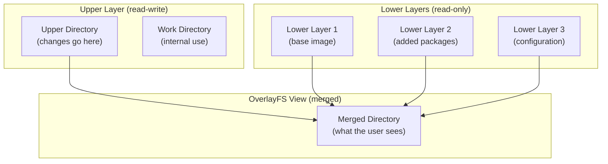
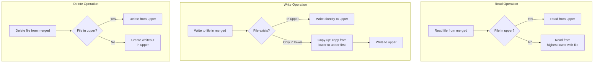
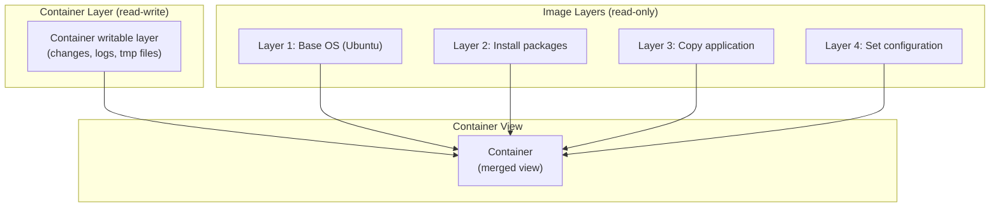
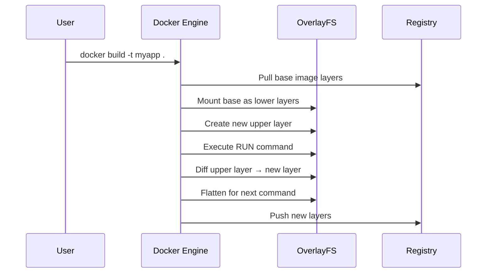

# Chapter 74: OverlayFS — Union Mount and Container Filesystems

## 1. Intuition

OverlayFS is a union filesystem — it merges multiple directories into a single coherent view. Imagine stacking transparent sheets of paper on top of each other. The top sheet (upper layer) can be written to, while the sheets below (lower layers) are read-only. When you read a file, you see the topmost version. When you write, the change goes to the top sheet. This is exactly how OverlayFS works.

This design is the foundation of modern container technology. Docker, Podman, and other container runtimes use OverlayFS to share base image layers between containers while giving each container its own writable layer. A container image is a stack of read-only lower layers, and each running container gets a thin writable upper layer on top.

## 2. Architecture

### 2.1 Layer Structure



### 2.2 How Operations Work



### 2.3 Whiteouts and Opaque Directories

OverlayFS uses special marker files to handle deletions:

```bash
# Whiteout file: character device with 0/0 major/minor
# Marks a file as deleted (hides lower layer version)
mknod /upper/deleted_file c 0 0

# Opaque directory: directory with trusted.overlay.opaque=y
# Hides lower layer directory contents
setfattr -n trusted.overlay.opaque -v y /upper/dir/
```

## 3. Source Code References

| File | Purpose |
|------|---------|
| `fs/overlayfs/super.c` | Superblock operations, mount |
| `fs/overlayfs/inode.c` | Inode operations |
| `fs/overlayfs/dir.c` | Directory operations |
| `fs/overlayfs/file.c` | File operations |
| `fs/overlayfs/copy_up.c` | Copy-up implementation |
| `fs/overlayfs/util.c` | Utility functions |
| `fs/overlayfs/namei.c` | Path lookup |
| `fs/overlayfs/readdir.c` | Directory reading (merging) |
| `fs/overlayfs/params.c` | Mount parameter parsing |
| `include/linux/overlayfs.h` | Internal header |

## 4. Data Structures

### 4.1 OverlayFS Inode

```c
struct ovl_inode {
    struct inode vfs_inode;          /* VFS inode */
    struct dentry *__upperdentry;    /* upper layer dentry */
    struct ovl_entry *oe;            /* overlay entry */
    const struct cred *creator_cred; /* creator credentials */

    /* Copy-up state */
    bool copying_up;                 /* copy-up in progress */
    bool opaque;                     /* directory is opaque */

    /* Redirect */
    char *redirect;                  /* redirect path */

    /* Version for NFS file handle */
    u64 version;
};

struct ovl_entry {
    union {
        struct {
            unsigned long flags;
        };
        struct rcu_head rcu;
    };
    unsigned numlower;               /* number of lower layers */
    struct path lowerstack[];        /* lower layer paths */
};
```

### 4.2 Copy-Up Process

```c
/* Simplified copy-up logic */
int ovl_copy_up(struct dentry *dentry)
{
    struct path lowerpath, upperpath;
    int err;

    /* 1. Copy up parent directory first (recursive) */
    err = ovl_copy_up(dentry->d_parent);
    if (err)
        return err;

    /* 2. Create upper file */
    err = ovl_copy_up_file(dentry, &upperpath);
    if (err)
        return err;

    /* 3. Copy metadata (permissions, timestamps) */
    err = ovl_copy_up_metadata(dentry, &upperpath);
    if (err)
        return err;

    /* 4. Update inode to point to upper */
    ovl_set_upper(dentry, &upperpath);

    return 0;
}
```

## 5. Examples

### 5.1 Basic OverlayFS Mount

```bash
# Create directory structure
mkdir -p /overlay/{lower1,lower2,upper,work,merged}

# Populate lower layers
echo "file from lower1" > /overlay/lower1/file1.txt
echo "file from lower2" > /overlay/lower2/file2.txt
echo "shared file" > /overlay/lower1/shared.txt
echo "overridden" > /overlay/lower2/shared.txt

# Mount overlay
mount -t overlay overlay \
    -o lowerdir=/overlay/lower2:/overlay/lower1,upperdir=/overlay/upper,workdir=/overlay/work \
    /overlay/merged

# View merged contents
ls /overlay/merged/
# file1.txt  file2.txt  shared.txt

cat /overlay/merged/shared.txt
# overridden (from lower2, which is higher priority)

cat /overlay/merged/file1.txt
# file from lower1 (only in lower1)
```

### 5.2 Write Operations

```bash
# Create new file (goes to upper)
echo "new file" > /overlay/merged/new.txt
ls /overlay/upper/
# new.txt

# Modify existing file (triggers copy-up)
echo "modified" >> /overlay/merged/file1.txt
ls /overlay/upper/
# file1.txt  new.txt
# file1.txt was copied from lower1 to upper, then modified

# Delete file (creates whiteout)
rm /overlay/merged/file2.txt
ls -la /overlay/upper/
# c--------- 1 root root 0, 0 Jun 29 10:00 file2.txt  ← whiteout
```

### 5.3 Multiple Lower Layers

```bash
# Mount with multiple lower layers (colon-separated)
mount -t overlay overlay \
    -o lowerdir=/overlay/lower3:/overlay/lower2:/overlay/lower1,upperdir=/overlay/upper,workdir=/overlay/work \
    /overlay/merged

# Priority: lower3 > lower2 > lower1
# Files in lower3 shadow same-named files in lower2 and lower1
```

### 5.4 Read-Only Overlay

```bash
# No upper directory = read-only overlay
mount -t overlay overlay \
    -o lowerdir=/overlay/lower2:/overlay/lower1 \
    /overlay/merged

# Cannot write to merged
touch /overlay/merged/test.txt
# touch: cannot touch '/overlay/merged/test.txt': Read-only file system
```

## 6. Container Integration

### 6.1 Docker Image Layers



### 6.2 Docker Storage Driver

```bash
# Check Docker storage driver
docker info | grep "Storage Driver"
# Storage Driver: overlay2

# View image layers
docker inspect ubuntu:latest | jq '.[0].RootFS.Layers'
# [
#   "sha256:abc123...",
#   "sha256:def456..."
# ]

# View container's overlay mount
mount | grep overlay
# overlay on /var/lib/docker/overlay2/.../merged type overlay
#   (rw,relatime,lowerdir=...,upperdir=...,workdir=...)

# Docker's overlay2 directory structure
ls /var/lib/docker/overlay2/
# abc123.../  def456.../  ...
# Each directory is a layer
```

### 6.3 Container Image Building



### 6.4 Copy-on-Write in Action

```bash
# Running two containers from same image
docker run -d --name c1 ubuntu sleep 3600
docker run -d --name c2 ubuntu sleep 3600

# Both containers share the same lower layers
# Each has its own upper layer

# Write in container 1
docker exec c1 touch /tmp/newfile

# Only c1's upper layer is modified
# c2's view is unchanged

# Disk usage
docker system df
# TYPE        TOTAL   ACTIVE  SIZE    RECLAIMABLE
# Images      1       1       72.8MB  0B
# Containers  2       2       12B     0B
# (shared layers mean low total usage)
```

## 7. Advanced Features

### 7.1 Redirects (Metadata-Only Copy-Up)

```bash
# In newer kernels, OverlayFS can do metadata-only copy-up
# This avoids copying the entire file data when only metadata changes

# Check kernel support
cat /proc/filesystems | grep overlay
# nodev   overlay

# Redirects are enabled by default in kernel 5.8+
```

### 7.2 Directory Indexing

```bash
# Enable directory indexing for better readdir performance
mount -t overlay overlay \
    -o index=on,lowerdir=...,upperdir=...,workdir=... \
    /merged
```

### 7.3 NFS Export

```bash
# OverlayFS supports NFS export (kernel 5.11+)
mount -t overlay overlay \
    -o nfs_export=on,lowerdir=...,upperdir=...,workdir=... \
    /merged

# Then export via NFS
echo "/merged *(rw,sync,no_subtree_check)" >> /etc/exports
exportfs -a
```

### 7.4 Metacopy

```bash
# Copy only metadata on first write (not data)
mount -t overlay overlay \
    -o metacopy=on,lowerdir=...,upperdir=...,workdir=... \
    /merged

# Data is copied up only when actually modified
# Saves space for metadata-only changes (chmod, chown)
```

## 8. Examples

### 8.1 Build System with OverlayFS

```bash
#!/bin/bash
# Use OverlayFS for clean build environments

BASE="/opt/buildbase"
BUILD="/tmp/build-$$"
mkdir -p "$BUILD"/{upper,work,merged}

# Mount overlay with clean base
mount -t overlay overlay \
    -o lowerdir=$BASE,upperdir=$BUILD/upper,workdir=$BUILD/work \
    $BUILD/merged

# Build in the merged directory
cd $BUILD/merged
git clone https://github.com/example/project
cd project
make -j$(nproc)

# Copy artifacts
cp build/output /opt/artifacts/

# Cleanup (everything in upper is ephemeral)
umount $BUILD/merged
rm -rf $BUILD
```

### 8.2 Development Sandboxes

```bash
#!/bin/bash
# Create an isolated development environment

DEVBASE="/opt/dev-base"
SANDBOX="/tmp/sandbox-$(whoami)"
mkdir -p "$SANDBOX"/{upper,work,merged}

mount -t overlay overlay \
    -o lowerdir=$DEVBASE,upperdir=$SANDBOX/upper,workdir=$SANDBOX/work \
    $SANDBOX/merged

echo "Sandbox ready at $SANDBOX/merged"
echo "All changes are in $SANDBOX/upper"
echo "Run 'umount $SANDBOX/merged' to clean up"

# Enter sandbox
cd $SANDBOX/merged
$SHELL
```

### 8.3 Live System Customization

```bash
# Overlay a live system's root
mount -t overlay overlay \
    -o lowerdir=/,upperdir=/tmp/overlay-upper,workdir=/tmp/overlay-work \
    /tmp/overlay-merged

# Make changes in /tmp/overlay-merged
# Original root is untouched
```

### 8.4 Combining Multiple Sources

```bash
# Merge configuration from multiple sources
# Priority: local > site > global > defaults

mount -t overlay overlay \
    -o lowerdir=/config/local:/config/site:/config/global:/config/defaults \
    /etc/app

# Files in /config/local/ override all others
# Falls through to defaults if not found in any layer
```

## 9. Performance

### 9.1 Copy-Up Overhead

```bash
# First write to a lower file triggers copy-up
# This can be expensive for large files

# Example: modifying a 1GB file
time bash -c 'echo "x" >> /overlay/merged/largefile.bin'
# Real: 2-5 seconds (copy-up of 1GB + write)

# Subsequent writes are fast (file is now in upper)
time bash -c 'echo "y" >> /overlay/merged/largefile.bin'
# Real: <0.01 seconds
```

### 9.2 Directory Listing Performance

```bash
# OverlayFS must merge directory entries from all layers
# This is slower than native filesystems

# Benchmark: listing 100,000 files
# ext4:        0.1s
# overlay2:    0.3-0.5s (depends on number of layers)

# Mitigation: enable index=on (default in modern kernels)
```

### 9.3 Multiple Lower Layers

```bash
# More layers = slower lookups
# Each lookup must check each layer

# Docker typically uses 5-15 layers
# This is acceptable for most workloads

# For performance-critical containers:
# - Squash images to fewer layers
# - Use --squash in docker build (experimental)
```

### 9.4 Storage Overhead

```bash
# OverlayFS adds minimal overhead:
# - Whiteout files (small)
# - Opaque directory xattrs (small)
# - Work directory (temporary)
# - Upper directory data (actual changes)

# View overlay disk usage
du -sh /var/lib/docker/overlay2/*/upper
```

## 10. Common Pitfalls

### 10.1 Whiteout Visibility

```bash
# Whiteouts are visible in the upper directory
ls -la /overlay/upper/
# c--------- 1 root root 0, 0 Jun 29 10:00 deleted_file

# They're hidden in the merged view
ls /overlay/merged/
# deleted_file is NOT shown
```

### 10.2 Hard Links Across Layers

```bash
# Hard links don't work across layers
# If a file in lower has hard links, copy-up breaks the link

# In lower:
# inode 12345 → file1.txt, file2.txt (hard links)

# After copy-up of file1.txt:
# upper: inode 67890 → file1.txt (new inode)
# lower: inode 12345 → file2.txt (original)

# They're no longer hard-linked in the merged view
```

### 10.3 Filesystem-Specific Issues

```bash
# Some filesystems don't support xattrs (needed for whiteouts)
# Use xattr=off for such filesystems
mount -t overlay overlay -o xattr=off,...

# Some don't support device nodes
# OverlayFS needs the underlying filesystem to support mknod
```

### 10.4 Work Directory Requirements

```bash
# Work directory MUST be on the same filesystem as upperdir
# And must be empty before mount

# Wrong:
mount -t overlay overlay \
    -o upperdir=/tmpfs/upper,workdir=/disk/work,...

# Right:
mount -t overlay overlay \
    -o upperdir=/tmpfs/upper,workdir=/tmpfs/work,...
```

### 10.5 Recursive Copy-Up

```bash
# Copy-up is recursive for directories
# Modifying /a/b/c/file triggers copy-up of /a, /a/b, /a/b/c, and file

# This can be expensive for deep directory trees
```

## 11. Best Practices

1. **Minimize layers.** Each layer adds lookup overhead. Squash images when possible.

2. **Use index=on.** It improves readdir performance by caching directory entries.

3. **Size upper appropriately.** The upper layer needs enough space for all container changes.

4. **Use metacopy=on.** It reduces copy-up overhead for metadata-only changes.

5. **Clean up unused containers.** Docker's `docker system prune` removes unused upper layers.

6. **Monitor overlay disk usage.** Containers can grow their upper layers over time.

7. **Use tmpfs for upper in ephemeral containers.** If you don't need persistence, use tmpfs.

8. **Understand layer sharing.** Multiple containers from the same image share lower layers.

9. **Test with realistic workloads.** Copy-up behavior can surprise you with large files.

10. **Keep lower layers immutable.** Never modify lower layers while overlay is mounted.

## 12. Exercises

### Exercise 1: Manual Overlay Setup
Create an OverlayFS manually with two lower layers and one upper layer. Demonstrate read-through, copy-up, and whiteout behavior.

### Exercise 2: Docker Layer Analysis
Pull a Docker image and inspect its layers. Mount each layer individually and examine the filesystem changes. Then mount the full overlay and verify the merged view.

### Exercise 3: Copy-Up Performance
Measure copy-up latency for files of different sizes (1KB, 1MB, 100MB, 1GB). Compare with direct writes on the upper filesystem.

### Exercise 4: Build Sandboxing
Create a build system using OverlayFS that provides a clean base for each build. Demonstrate that builds are isolated from each other.

### Exercise 5: Multi-Layer Merging
Create three lower layers with overlapping files. Mount the overlay and verify that the correct (highest priority) version of each file is shown. Test with files, directories, and symlinks.

## 13. References

1. **Kernel documentation** — `Documentation/filesystems/overlayfs.rst`
2. **OverlayFS kernel source** — `fs/overlayfs/` in the Linux kernel
3. **Docker storage drivers** — https://docs.docker.com/storage/storagedriver/
4. **OverlayFS design** — Miklos Szeredi, Red Hat Summit
5. **man pages** — `overlay(5)` (not yet available on all systems)
6. **LWN articles** — "A union filesystem for Linux"
7. **Opencontainers image spec** — https://github.com/opencontainers/image-spec
8. **Podman rootless containers** — https://podman.io/
