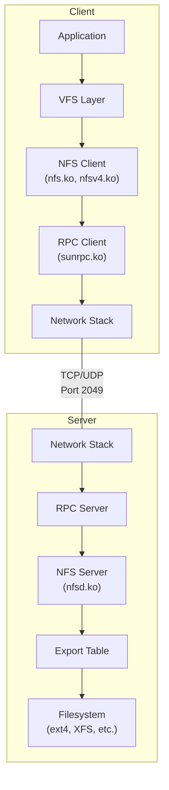
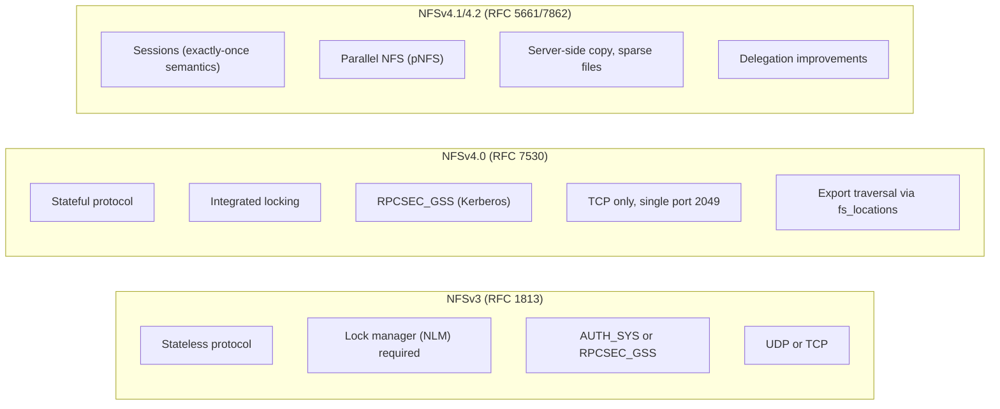
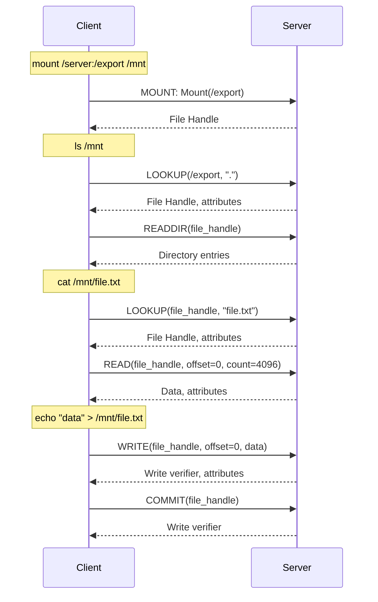
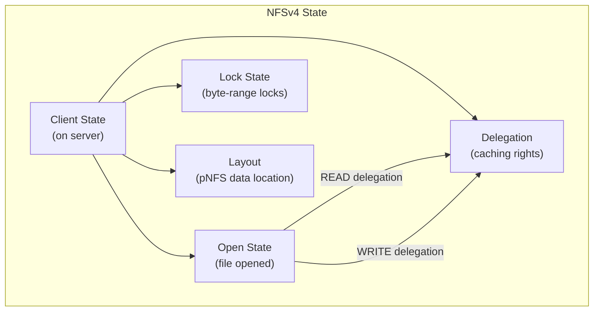
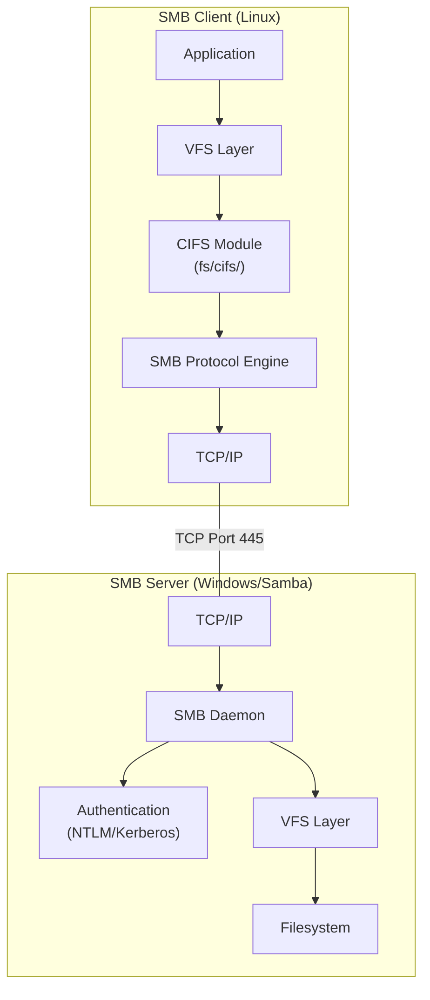
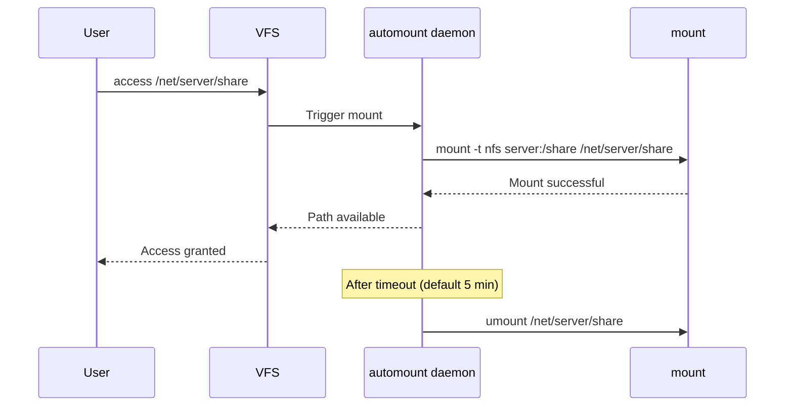

# Chapter 75: Network Filesystems — NFS, CIFS/SMB, and Autofs

## 1. Intuition

Network filesystems extend the filesystem paradigm across the network — files on a remote server appear as if they're on your local disk. This is one of the most powerful abstractions in computing: applications don't need to know (or care) that a file lives on a server in another building. They just use `open()`, `read()`, and `write()` as usual.

NFS (Network File System) was created by Sun Microsystems in 1984 and remains the dominant Unix/Linux network filesystem. CIFS/SMB (Common Internet File System / Server Message Block) is Microsoft's protocol, essential for cross-platform file sharing. Autofs adds automatic mounting — filesystems mount on demand when accessed and unmount after idle periods.

## 2. Architecture

### 2.1 NFS Architecture



### 2.2 NFS Version Comparison



## 3. Source Code References

| File | Purpose |
|------|---------|
| `fs/nfs/` | NFS client implementation |
| `fs/nfs/client.c` | NFS client initialization |
| `fs/nfs/super.c` | NFS mount/umount |
| `fs/nfs/file.c` | NFS file operations |
| `fs/nfs/read.c` | NFS read operations |
| `fs/nfs/write.c` | NFS write operations |
| `fs/nfs/delegation.c` | NFS delegation handling |
| `fs/nfs/nfs4proc.c` | NFSv4 procedures |
| `fs/nfsd/` | NFS server (nfsd) |
| `fs/nfsd/nfs4proc.c` | NFSv4 server procedures |
| `fs/nfsd/export.c` | Export table management |
| `fs/nfsd/nfs4state.c` | NFSv4 state management |
| `net/sunrpc/` | RPC implementation |
| `fs/autofs/` | autofs implementation |
| `fs/cifs/` | CIFS/SMB client |

## 4. NFS

### 4.1 NFSv3 Protocol Flow



### 4.2 NFSv4 State Model



### 4.3 NFS Server Configuration

```bash
# Install NFS server
apt install nfs-kernel-server  # Debian/Ubuntu
yum install nfs-utils          # RHEL/CentOS

# Configure exports
cat /etc/exports
# /data/share    192.168.1.0/24(rw,sync,no_subtree_check)
# /data/readonly 10.0.0.0/8(ro,async,no_subtree_check)
# /data/home     *.example.com(rw,sync,root_squash,no_subtree_check)

# Export options:
# rw/ro           — Read-write or read-only
# sync/async      — Sync writes before reply / async
# no_subtree_check — Disable subtree checking (recommended)
# root_squash     — Map root to anonymous (default, security!)
# no_root_squash  — Allow root access (dangerous!)
# all_squash      — Map all users to anonymous
# anonuid/anongid — Anonymous UID/GID

# Apply exports
exportfs -a              # Export all
exportfs -r              # Re-export all
exportfs -v              # Verbose output

# Start NFS server
systemctl start nfs-kernel-server
systemctl enable nfs-kernel-server

# View exports
showmount -e localhost
```

### 4.4 NFS Client Configuration

```bash
# Install NFS client
apt install nfs-common

# Mount NFS share
mount -t nfs server:/data/share /mnt/nfs

# Mount with options
mount -t nfs -o rw,hard,intr,rsize=32768,wsize=32768 server:/data/share /mnt/nfs

# NFSv4 specific mount
mount -t nfs4 server:/data/share /mnt/nfs

# Mount with Kerberos authentication
mount -t nfs -o sec=krb5 server:/data/share /mnt/nfs

# Persistent mount (fstab)
echo "server:/data/share /mnt/nfs nfs defaults,_netdev 0 0" >> /etc/fstab
```

### 4.5 NFS Mount Options

```bash
# Hard vs Soft mount
# hard: Retry indefinitely (default, recommended for data integrity)
# soft: Return error after timeout (can cause data corruption)

# rsize/wsize
# Read/write buffer sizes (default: 1MB for NFSv4)
# Larger = better throughput, more memory per connection
mount -t nfs -o rsize=1048576,wsize=1048576 server:/data /mnt

# Timeouts
mount -t nfs -o timeo=150,retrans=5 server:/data /mnt
# timeo: Initial timeout (in tenths of second)
# retrans: Number of retries before soft mount fails

# Caching
mount -t nfs -o actimeo=3600 server:/data /mnt
# actimeo: Attribute cache timeout (seconds)

# NFSv4.1/4.2 session parameters
mount -t nfs -o minorversion=2 server:/data /mnt
```

### 4.6 NFS Performance Tuning

```bash
# Server-side tuning (/etc/nfs.conf or /etc/default/nfs-kernel-server)

# Number of nfsd threads
echo 16 > /proc/fs/nfsd/threads

# TCP buffer sizes
echo "4096 131072 16777216" > /proc/sys/net/ipv4/tcp_rmem
echo "4096 65536 16777216" > /proc/sys/net/ipv4/tcp_wmem

# NFS over RDMA (for high-performance networks)
mount -t nfs -o proto=rdma server:/data /mnt

# Benchmark
fio --name=nfs-test --ioengine=libaio --direct=1 \
    --bs=1M --size=1G --numjobs=4 --rw=write \
    --filename=/mnt/nfs/testfile
```

## 5. CIFS/SMB

### 5.1 SMB Protocol Overview



### 5.2 Samba Server Configuration

```bash
# Install Samba
apt install samba

# Basic configuration (/etc/samba/smb.conf)
cat /etc/samba/smb.conf
# [global]
#     workgroup = WORKGROUP
#     security = user
#     map to guest = Bad User
#
# [share]
#     path = /srv/samba/share
#     browsable = yes
#     writable = yes
#     guest ok = no
#     valid users = @smbgroup
#     create mask = 0664
#     directory mask = 0775
#
# [public]
#     path = /srv/samba/public
#     browsable = yes
#     writable = yes
#     guest ok = yes

# Create Samba user
useradd -M -s /sbin/nologin smbuser
smbpasswd -a smbuser

# Start Samba
systemctl start smbd nmbd
systemctl enable smbd nmbd

# Test configuration
testparm
```

### 5.3 CIFS Client Mount

```bash
# Mount SMB share
mount -t cifs //server/share /mnt/smb -o username=user,password=pass

# With options
mount -t cifs //server/share /mnt/smb \
    -o username=user,password=pass,vers=3.0,iocharset=utf8,file_mode=0664,dir_mode=0775

# SMB protocol versions
# vers=1.0  — SMB1 (insecure, avoid!)
# vers=2.0  — SMB2
# vers=3.0  — SMB3 (recommended)
# vers=3.1.1 — SMB 3.1.1 (most secure)

# Using credentials file
echo "username=user" > /root/.smbcredentials
echo "password=pass" >> /root/.smbcredentials
chmod 600 /root/.smbcredentials

mount -t cifs //server/share /mnt/smb \
    -o credentials=/root/.smbcredentials,vers=3.0

# fstab entry
echo "//server/share /mnt/smb cifs credentials=/root/.smbcredentials,_netdev 0 0" >> /etc/fstab
```

### 5.4 SMB Performance Tuning

```bash
# Mount options for performance
mount -t cifs //server/share /mnt/smb \
    -o vers=3.0,rsize=1048576,wsize=1048576,cache=strict

# rsize/wsize: Buffer sizes (1MB is max for SMB3)
# cache=strict: Client-side caching policy
#   strict — no caching (default, safe)
#   loose  — allow caching (faster, less safe)

# Multi-channel (SMB3, kernel 5.8+)
mount -t cifs //server/share /mnt/smb \
    -o vers=3.0,multichannel

# Encryption (SMB3)
mount -t cifs //server/share /mnt/smb \
    -o vers=3.0,seal  # Enable encryption
```

## 6. Autofs

### 6.1 Autofs Architecture



### 6.2 Autofs Configuration

```bash
# Install autofs
apt install autofs

# Master map (/etc/auto.master)
cat /etc/auto.master
# /net    -hosts           # Browse network shares
# /home   /etc/auto.home   # Home directories
# /misc   /etc/auto.misc   # Miscellaneous mounts

# Direct map (/etc/auto.home)
cat /etc/auto.home
# *       -rw,soft,intr   server:/home/&

# Indirect map (/etc/auto.misc)
cat /etc/auto.misc
# cdrom   -fstype=iso9660,ro   :/dev/cdrom
# data    -rw,soft,intr        server:/data
# share   -rw,vers=3.0        //server/share

# Start autofs
systemctl start autofs
systemctl enable autofs

# Test: access triggers mount
ls /net/server/share    # Mounts on demand
# After 5 minutes of inactivity, unmounts automatically
```

### 6.3 Advanced Autofs

```bash
# Wildcard map
cat /etc/auto.home
# * -rw,soft server:/home/&
# & is replaced by the key (username)

# Executable map
cat /etc/auto.dynamic
#!/bin/bash
# Dynamic mount generation
echo "-rw server:/data/$1"

# LDAP-based maps
# autofs can read maps from LDAP
# Configure in /etc/autofs.conf:
# LDAP_URI = ldap://ldap.example.com
# SEARCH_BASE = ou=autofs,dc=example,dc=com
```

### 6.4 Autofs Options

```bash
# /etc/autofs.conf options
# timeout = 300           # Idle timeout (seconds)
# browse_mode = no        # Don't show unmounted entries
# mount_nfs_default_protocol = 4  # Default NFS version
# logging = none          # Logging level

# Per-mount options in maps
# -fstype=nfs4            # Filesystem type
# -rw,soft,intr           # Mount options
# -timeo=15,retrans=5     # Timeout and retry
# --timeout=60            # Per-mount timeout
```

## 7. Examples

### 7.1 NFSv4 with Kerberos

```bash
# Server setup
# 1. Install Kerberos
apt install krb5-kdc krb5-admin-server

# 2. Create NFS service principal
kadmin -q "addprinc -randkey nfs/nfs-server.example.com"
kadmin -q "ktadd nfs/nfs-server.example.com"

# 3. Configure exports with security
cat /etc/exports
# /data *(rw,sec=krb5:krb5i:krb5p,sync,no_subtree_check)

# 4. Start services
systemctl start nfs-kernel-server rpc-gssd

# Client setup
# 1. Get Kerberos ticket
kinit user@EXAMPLE.COM

# 2. Mount with Kerberos
mount -t nfs4 -o sec=krb5p nfs-server.example.com:/data /mnt
```

### 7.2 NFS High Availability

```bash
# Using NFS with DRBD + Pacemaker
# 1. Configure DRBD for data replication
# 2. Configure Pacemaker cluster
# 3. Create NFS resource

pcs resource create nfs-server systemd:nfs-server \
    op monitor interval=30s

pcs resource create nfs-ocf ocf:heartbeat:exportfs \
    clientspec="10.0.0.0/8" \
    directory="/data" \
    fsid=1

pcs resource group add nfs-group nfs-ocf nfs-server
```

### 7.3 Cross-Platform Sharing

```bash
# Samba share accessible from Windows, Mac, and Linux

# Server (Linux)
cat >> /etc/samba/smb.conf << 'EOF'
[shared]
    path = /srv/shared
    browsable = yes
    writable = yes
    valid users = @users
    force group = users
    create mask = 0664
    directory mask = 0775
    vfs objects = recycle
    recycle:repository = .recycle
    recycle:keeptree = yes
EOF

# Windows client
# net use Z: \\server\shared /user:user password

# Mac client
# mount_smb3 //user@server/shared /mnt/shared

# Linux client
mount -t cifs //server/shared /mnt/shared -o username=user,vers=3.0
```

### 7.4 Autofs Home Directories

```bash
# /etc/auto.master
/home /etc/auto.home --timeout=600

# /etc/auto.home
# Map each user to their home on the NFS server
* -rw,soft,intr,nfsvers=4 nfsserver:/export/home/&

# Now accessing /home/alice automatically mounts
# nfsserver:/export/home/alice
ls /home/alice/  # Triggers mount
# After 10 minutes idle, auto-unmounts
```

## 8. Performance

### 8.1 NFS Performance Comparison

```
Typical performance (1GbE network, sequential I/O):

NFSv3 (UDP):      80-100 MB/s read, 60-80 MB/s write
NFSv3 (TCP):      90-110 MB/s read, 70-90 MB/s write
NFSv4.0:          85-105 MB/s read, 65-85 MB/s write
NFSv4.2:          90-110 MB/s read, 70-90 MB/s write

NFS over RDMA:    3-5 GB/s (100GbE)

Local ext4:       500+ MB/s (SSD)
```

### 8.2 Buffer Size Tuning

```bash
# Increase rsize/wsize for throughput
mount -t nfs -o rsize=1048576,wsize=1048576 server:/data /mnt

# Verify effective size
nfsstat -m
# /mnt from server:/data
#  Flags: rw,relatime,vers=4.2,rsize=1048576,wsize=1048576,...
```

### 8.3 Caching

```bash
# NFS attribute cache (actimeo)
mount -t nfs -o actimeo=3600 server:/data /mnt
# Cache attributes for 1 hour (reduces metadata traffic)

# fscache (client-side data caching)
mount -t nfs -o fsc server:/data /mnt
# Requires cachefilesd daemon
apt install cachefilesd
echo "RUN=yes" > /etc/default/cachefilesd
systemctl start cachefilesd
```

## 9. Common Pitfalls

### 9.1 NFS Stale File Handles

```bash
# Happens when file is deleted on server while client has it open
# Or server filesystem changes (reformatted, snapshot rollback)

# Recovery: unmount and remount
umount -l /mnt/nfs  # Lazy unmount (if stuck)
mount -t nfs server:/data /mnt/nfs
```

### 9.2 NFS Locking Issues

```bash
# NFSv3 requires separate lock daemon (rpc.statd, rpc.lockd)
# NFSv4 has integrated locking

# Check lock status
showmount -a server

# Force unlock (NFSv3)
rpcinfo -p server | grep -i lock
```

### 9.3 Security: root_squash

```bash
# Default: root_squash maps root to nobody
# This prevents remote root from accessing files as root

# DANGEROUS: no_root_squash allows remote root access
# Only use in trusted environments
cat /etc/exports
# /data *(rw,no_root_squash)  ← NEVER DO THIS
```

### 9.4 Firewall Configuration

```bash
# NFSv4 uses only port 2049
ufw allow from 192.168.1.0/24 to any port 2049

# NFSv3 also needs ports for:
# - rpcbind (111)
# - mountd (dynamic, configure in /etc/nfs.conf)
# - statd (dynamic)
# - lockd (dynamic)

# Configure fixed ports in /etc/nfs.conf
# [mountd]
# port = 20048
```

### 9.5 SMB Protocol Version

```bash
# SMB1 is insecure (vulnerable to EternalBlue)
# Always use SMB3 or later

# Server: disable SMB1
# /etc/samba/smb.conf
# [global]
#     min protocol = SMB2
#     max protocol = SMB3

# Client: specify version
mount -t cifs //server/share /mnt -o vers=3.0
```

## 10. Best Practices

1. **Use NFSv4.2 when possible.** It has the best features and security.

2. **Use `hard` mount for data integrity.** `soft` mounts can cause data corruption.

3. **Enable Kerberos for NFS in enterprise environments.** `sec=krb5p` provides integrity and privacy.

4. **Use `no_subtree_check` on NFS exports.** It's more reliable and faster.

5. **Use SMB3 for Windows shares.** Never use SMB1.

6. **Set appropriate `actimeo`.** Longer attribute cache reduces metadata traffic but delays visibility of changes.

7. **Use autofs for large environments.** It reduces mount management overhead.

8. **Monitor NFS statistics.** Use `nfsstat` and `nfsiostat` regularly.

9. **Use TCP, not UDP.** TCP is more reliable and performs better for most workloads.

10. **Test failover.** If using HA NFS, test the failover process regularly.

## 11. Exercises

### Exercise 1: NFSv4 Setup
Configure an NFSv4 server with Kerberos authentication. Create exports with different security flavors. Test from a client and verify authentication.

### Exercise 2: Samba Cross-Platform
Set up a Samba server accessible from Linux, Windows, and macOS. Configure user authentication, share permissions, and recycle bin.

### Exercise 3: Autofs Dynamic Mounts
Configure autofs with executable maps that dynamically generate mount entries. Test with user home directories on an NFS server.

### Exercise 4: NFS Performance Tuning
Benchmark NFS performance with different `rsize/wsize`, mount options, and protocol versions. Use `fio` to test sequential and random I/O.

### Exercise 5: NFS Failover
Set up a basic NFS high-availability configuration using DRBD and Pacemaker. Simulate a server failure and verify automatic failover.

## 12. References

1. **NFS RFCs** — RFC 1813 (v3), RFC 7530 (v4.0), RFC 5661 (v4.1), RFC 7862 (v4.2)
2. **Samba documentation** — https://www.samba.org/samba/docs/
3. **Linux NFS-HOWTO** — https://nfs.sourceforge.net/
4. **Kernel documentation** — `Documentation/filesystems/nfs/`
5. **man pages** — `nfs(5)`, `exports(5)`, `nfsstat(8)`, `mount.cifs(8)`, `autofs(5)`
6. **SMB3 specification** — MS-SMB2
7. **autofs documentation** — https://www.autofs.org/
8. **Red Hat NFS Guide** — https://access.redhat.com/documentation/en-us/red_hat_enterprise_linux/
