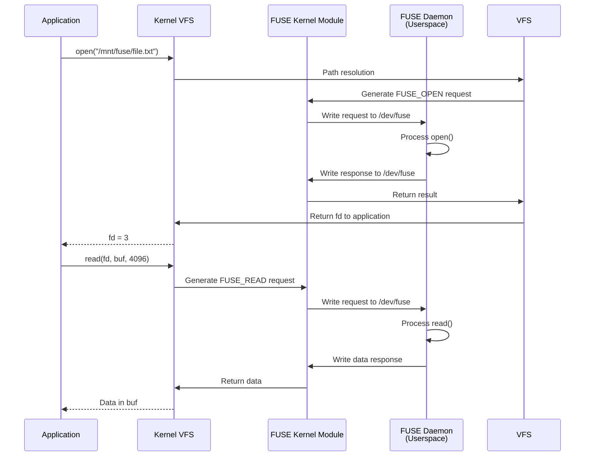
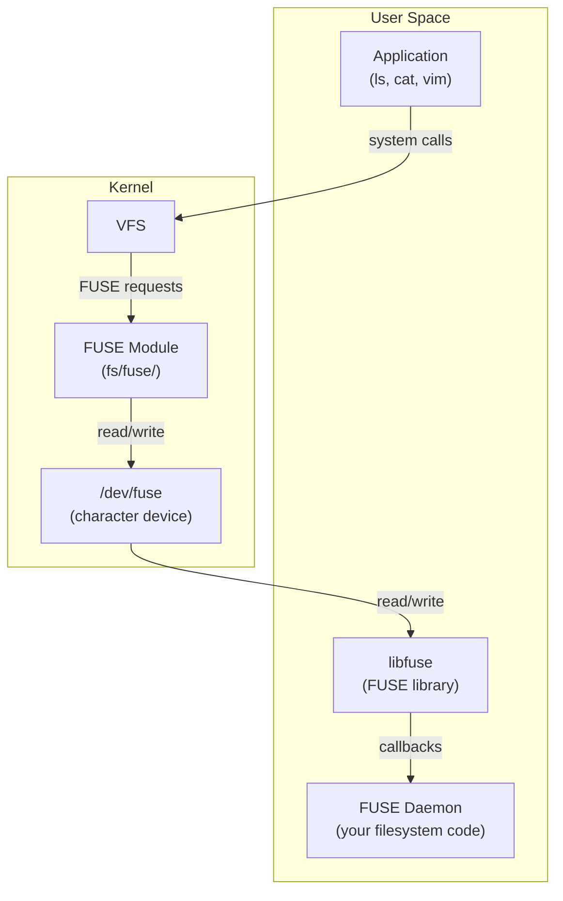

# Chapter 76: FUSE — Filesystem in Userspace

## 1. Intuition

FUSE (Filesystem in Userspace) flips the filesystem model inside out. Instead of implementing a filesystem in the kernel (where bugs can crash the entire system), FUSE lets you write a filesystem as a regular userspace program. When a process accesses a FUSE mount point, the kernel forwards the request to your userspace program, which handles it and sends the response back.

This is revolutionary because it democratized filesystem development. You no longer need kernel programming expertise to create a filesystem. FUSE powers some of the most innovative storage systems: SSHFS (mount remote directories via SSH), GlusterFS (distributed storage), NTFS-3G (read/write NTFS), and many more. Any language that can handle file descriptors can implement a FUSE filesystem.

## 2. Architecture

### 2.1 FUSE Request Flow



### 2.2 FUSE Components



## 3. Source Code References

| File | Purpose |
|------|---------|
| `fs/fuse/dev.c` | `/dev/fuse` device implementation |
| `fs/fuse/dir.c` | FUSE directory operations |
| `fs/fuse/file.c` | FUSE file operations |
| `fs/fuse/inode.c` | FUSE inode/superblock operations |
| `fs/fuse/readdir.c` | FUSE readdir implementation |
| `fs/fuse/fuse_i.h` | FUSE internal data structures |
| `include/uapi/linux/fuse.h` | FUSE protocol header (userspace API) |
| `libfuse/` | libfuse source (separate project) |

## 4. Data Structures

### 4.1 FUSE Protocol Messages

```c
/* FUSE request header */
struct fuse_in_header {
    __u32 len;       /* total length including header */
    __u32 opcode;    /* FUSE_OPEN, FUSE_READ, etc. */
    __u64 unique;    /* request identifier */
    __u64 nodeid;    /* inode number */
    __u32 uid;       /* requester UID */
    __u32 gid;       /* requester GID */
    __u32 pid;       /* requester PID */
    /* ... */
};

/* FUSE response header */
struct fuse_out_header {
    __u32 len;       /* total length including header */
    __s32 error;     /* 0 for success, -errno for error */
    __u64 unique;    /* matching request identifier */
};

/* FUSE operations (opcodes) */
enum fuse_opcode {
    FUSE_LOOKUP      = 1,
    FUSE_FORGET      = 2,  /* no reply */
    FUSE_GETATTR     = 3,
    FUSE_SETATTR     = 4,
    FUSE_READLINK    = 5,
    FUSE_SYMLINK     = 6,
    FUSE_MKNOD       = 8,
    FUSE_MKDIR       = 9,
    FUSE_UNLINK      = 10,
    FUSE_RMDIR       = 11,
    FUSE_RENAME      = 12,
    FUSE_LINK        = 13,
    FUSE_OPEN        = 14,
    FUSE_READ        = 15,
    FUSE_WRITE       = 16,
    FUSE_STATFS      = 17,
    FUSE_RELEASE     = 18,
    FUSE_FSYNC       = 20,
    FUSE_SETXATTR    = 21,
    FUSE_GETXATTR    = 22,
    FUSE_LISTXATTR   = 23,
    FUSE_REMOVEXATTR = 24,
    FUSE_FLUSH       = 25,
    FUSE_INIT        = 26,
    FUSE_OPENDIR     = 27,
    FUSE_READDIR     = 28,
    FUSE_RELEASEDIR  = 29,
    FUSE_FSYNCDIR    = 30,
    FUSE_GETLK       = 31,
    FUSE_SETLK       = 32,
    FUSE_SETLKW      = 33,
    FUSE_ACCESS      = 34,
    FUSE_CREATE       = 35,
    FUSE_INTERRUPT    = 36,
    FUSE_BMAP        = 37,
    FUSE_DESTROY     = 38,
    /* ... many more ... */
};
```

### 4.2 FUSE Mount Options

```c
/* FUSE init arguments */
struct fuse_init_in {
    __u32 major;        /* kernel FUSE major version */
    __u32 minor;        /* kernel FUSE minor version */
    __u32 max_readahead; /* max readahead */
    __u32 flags;        /* FUSE_* flags */
};

struct fuse_init_out {
    __u32 major;        /* library FUSE major version */
    __u32 minor;        /* library FUSE minor version */
    __u32 max_readahead; /* max readahead */
    __u32 flags;        /* FUSE_* flags */
    __u32 unused;
    __u32 max_write;    /* max write buffer size */
    __u32 max_background; /* max background requests */
    __u32 congestion_threshold; /* congestion threshold */
    __u32 max_pages;    /* max pages per request */
};
```

## 5. libfuse — The FUSE Library

### 5.1 libfuse API

```c
/* The two key structures */
struct fuse_operations {
    int (*getattr)(const char *, struct stat *, struct fuse_file_info *);
    int (*readlink)(const char *, char *, size_t);
    int (*mknod)(const char *, mode_t, dev_t);
    int (*mkdir)(const char *, mode_t);
    int (*unlink)(const char *);
    int (*rmdir)(const char *);
    int (*symlink)(const char *, const char *);
    int (*rename)(const char *, const char *, unsigned int);
    int (*link)(const char *, const char *);
    int (*chmod)(const char *, mode_t, struct fuse_file_info *);
    int (*chown)(const char *, uid_t, gid_t, struct fuse_file_info *);
    int (*truncate)(const char *, off_t, struct fuse_file_info *);
    int (*open)(const char *, struct fuse_file_info *);
    int (*read)(const char *, char *, size_t, off_t, struct fuse_file_info *);
    int (*write)(const char *, const char *, size_t, off_t, struct fuse_file_info *);
    int (*statfs)(const char *, struct statvfs *);
    int (*flush)(const char *, struct fuse_file_info *);
    int (*release)(const char *, struct fuse_file_info *);
    int (*fsync)(const char *, int, struct fuse_file_info *);
    int (*readdir)(const char *, void *, fuse_fill_dir_t, off_t,
                   struct fuse_file_info *, enum fuse_readdir_flags);
    int (*init)(struct fuse_conn_info *conn, struct fuse_config *cfg);
    void (*destroy)(void *private_data);
    int (*access)(const char *, int);
    int (*create)(const char *, mode_t, struct fuse_file_info *);
    /* ... many more ... */
};
```

### 5.2 Writing a FUSE Filesystem

Here's a complete "hello world" FUSE filesystem:

```c
/*
 * hello.c — A minimal FUSE filesystem
 * Compile: gcc -Wall hello.c -o hello -lfuse3
 * Run: ./hello /mnt/hello
 */

#define FUSE_USE_VERSION 31
#include <fuse3/fuse.h>
#include <stdio.h>
#include <string.h>
#include <errno.h>
#include <fcntl.h>
#include <stddef.h>
#include <assert.h>

static const char *hello_str = "Hello, FUSE!\n";
static const char *hello_path = "/hello.txt";

static int hello_getattr(const char *path, struct stat *stbuf,
                         struct fuse_file_info *fi)
{
    (void) fi;
    memset(stbuf, 0, sizeof(struct stat));

    if (strcmp(path, "/") == 0) {
        stbuf->st_mode = S_IFDIR | 0755;
        stbuf->st_nlink = 2;
    } else if (strcmp(path, hello_path) == 0) {
        stbuf->st_mode = S_IFREG | 0444;
        stbuf->st_nlink = 1;
        stbuf->st_size = strlen(hello_str);
    } else
        return -ENOENT;

    return 0;
}

static int hello_readdir(const char *path, void *buf, fuse_fill_dir_t filler,
                         off_t offset, struct fuse_file_info *fi,
                         enum fuse_readdir_flags flags)
{
    (void) offset;
    (void) fi;
    (void) flags;

    if (strcmp(path, "/") != 0)
        return -ENOENT;

    filler(buf, ".", NULL, 0, 0);
    filler(buf, "..", NULL, 0, 0);
    filler(buf, hello_path + 1, NULL, 0, 0);

    return 0;
}

static int hello_open(const char *path, struct fuse_file_info *fi)
{
    if (strcmp(path, hello_path) != 0)
        return -ENOENT;

    if ((fi->flags & O_ACCMODE) != O_RDONLY)
        return -EACCES;

    return 0;
}

static int hello_read(const char *path, char *buf, size_t size, off_t offset,
                      struct fuse_file_info *fi)
{
    (void) fi;
    size_t len;

    if (strcmp(path, hello_path) != 0)
        return -ENOENT;

    len = strlen(hello_str);
    if (offset >= len)
        return 0;

    if (offset + size > len)
        size = len - offset;

    memcpy(buf, hello_str + offset, size);
    return size;
}

static const struct fuse_operations hello_oper = {
    .getattr = hello_getattr,
    .readdir = hello_readdir,
    .open    = hello_open,
    .read    = hello_read,
};

int main(int argc, char *argv[])
{
    return fuse_main(argc, argv, &hello_oper, NULL);
}
```

### 5.3 Compiling and Running

```bash
# Install libfuse development files
apt install libfuse3-dev  # FUSE 3
apt install libfuse-dev   # FUSE 2

# Compile
gcc -Wall hello.c -o hello -lfuse3 -D_FILE_OFFSET_BITS=64

# Create mount point
mkdir -p /mnt/hello

# Run (foreground, with debug output)
./hello -f -d /mnt/hello

# In another terminal, test
ls /mnt/hello/
# hello.txt
cat /mnt/hello/hello.txt
# Hello, FUSE!

# Unmount
fusermount3 -u /mnt/hello
```

## 6. Practical FUSE Filesystems

### 6.1 SSHFS — Mount Remote Directories

```bash
# Install SSHFS
apt install sshfs

# Mount remote directory
sshfs user@server:/home/user /mnt/remote

# With options
sshfs user@server:/home/user /mnt/remote \
    -o reconnect,ServerAliveInterval=15,ServerAliveCountMax=3

# Unmount
fusermount3 -u /mnt/remote
```

### 6.2 ntfs-3g — NTFS Read/Write

```bash
# Install ntfs-3g
apt install ntfs-3g

# Mount NTFS partition
mount -t ntfs-3g /dev/sdb1 /mnt/windows

# With options
mount -t ntfs-3g /dev/sdb1 /mnt/windows \
    -o rw,uid=1000,gid=1000,dmask=022,fmask=133
```

### 6.3 EncFS — Encrypted Filesystem

```bash
# Install EncFS
apt install encfs

# Create encrypted directory
encfs ~/encrypted ~/decrypted
# Follow prompts to set encryption options

# Files in ~/decrypted are transparently encrypted in ~/encrypted
echo "secret data" > ~/decrypted/file.txt
# ~/encrypted/ contains encrypted version

# Unmount
fusermount -u ~/decrypted
```

### 6.4 go-fuse and Python FUSE

```python
#!/usr/bin/env python3
# pip install fuse-python
# A minimal FUSE filesystem in Python

import os
import errno
import fuse

class MyFS(fuse.Fuse):
    def getattr(self, path):
        st = fuse.Stat()
        if path == '/':
            st.st_mode = 0o40755
            st.st_nlink = 2
        elif path == '/hello.txt':
            st.st_mode = 0o100444
            st.st_nlink = 1
            st.st_size = 14
        else:
            return -errno.ENOENT
        return st

    def readdir(self, path, offset):
        yield fuse.Direntry('.')
        yield fuse.Direntry('..')
        yield fuse.Direntry('hello.txt')

    def open(self, path, flags):
        if path != '/hello.txt':
            return -errno.ENOENT
        return 0

    def read(self, path, size, offset):
        data = b"Hello, Python FUSE!\n"
        return data[offset:offset+size]

if __name__ == '__main__':
    fs = MyFS()
    fs.parse(errex=1)
    fs.main()
```

## 7. Advanced FUSE Features

### 7.1 FUSE Direct I/O

```c
/* Enable direct I/O (bypass page cache) */
static int my_open(const char *path, struct fuse_file_info *fi)
{
    fi->direct_io = 1;    /* Bypass page cache */
    fi->keep_cache = 0;   /* Don't keep cache after close */
    return 0;
}
```

### 7.2 FUSE Writeback Cache

```c
/* Enable writeback cache (kernel buffers writes) */
static void *my_init(struct fuse_conn_info *conn,
                     struct fuse_config *cfg)
{
    conn->want |= FUSE_CAP_WRITEBACK_CACHE;
    cfg->writeback_cache = 1;
    return NULL;
}
```

### 7.3 FUSE Parallel Processing

```c
/* Handle requests in parallel */
static void *my_init(struct fuse_conn_info *conn,
                     struct fuse_config *cfg)
{
    /* Enable parallel operations */
    conn->want |= FUSE_CAP_PARALLEL_DIROPS;
    conn->max_background = 64;
    conn->congestion_threshold = 48;
    return NULL;
}
```

### 7.4 FUSE Low-Level API

```c
/* Low-level API gives more control */
#include <fuse3/fuse_lowlevel.h>

static void ll_lookup(fuse_req_t req, fuse_ino_t parent,
                      const char *name)
{
    struct fuse_entry_param e;
    /* Look up 'name' in 'parent' directory */
    /* Fill in e.ino, e.attr, e.attr_timeout, e.entry_timeout */
    fuse_reply_entry(req, &e);
}

static void ll_read(fuse_req_t req, fuse_ino_t ino,
                    size_t size, off_t off,
                    struct fuse_file_info *fi)
{
    /* Read 'size' bytes at offset 'off' from inode 'ino' */
    fuse_reply_buf(req, buf, size);
}

static const struct fuse_lowlevel_ops ll_oper = {
    .lookup = ll_lookup,
    .read   = ll_read,
    /* ... */
};
```

## 8. Examples

### 8.1 Memory Filesystem

```c
/*
 * memfs.c — A simple in-memory filesystem
 * Supports create, read, write, delete
 */

#define FUSE_USE_VERSION 31
#include <fuse3/fuse.h>
#include <stdio.h>
#include <stdlib.h>
#include <string.h>
#include <errno.h>
#include <fcntl.h>
#include <time.h>

struct memfs_entry {
    char *name;
    char *data;
    size_t size;
    mode_t mode;
    time_t mtime;
    struct memfs_entry *next;
};

static struct memfs_entry *entries = NULL;

static struct memfs_entry *find_entry(const char *name)
{
    struct memfs_entry *e = entries;
    while (e) {
        if (strcmp(e->name, name) == 0)
            return e;
        e = e->next;
    }
    return NULL;
}

static int memfs_getattr(const char *path, struct stat *stbuf,
                         struct fuse_file_info *fi)
{
    (void) fi;
    memset(stbuf, 0, sizeof(struct stat));

    if (strcmp(path, "/") == 0) {
        stbuf->st_mode = S_IFDIR | 0755;
        stbuf->st_nlink = 2;
        return 0;
    }

    struct memfs_entry *e = find_entry(path + 1);
    if (!e)
        return -ENOENT;

    stbuf->st_mode = e->mode;
    stbuf->st_nlink = 1;
    stbuf->st_size = e->size;
    stbuf->st_mtime = e->mtime;
    return 0;
}

static int memfs_readdir(const char *path, void *buf,
                         fuse_fill_dir_t filler, off_t offset,
                         struct fuse_file_info *fi,
                         enum fuse_readdir_flags flags)
{
    (void) offset; (void) fi; (void) flags;

    if (strcmp(path, "/") != 0)
        return -ENOENT;

    filler(buf, ".", NULL, 0, 0);
    filler(buf, "..", NULL, 0, 0);

    struct memfs_entry *e = entries;
    while (e) {
        filler(buf, e->name, NULL, 0, 0);
        e = e->next;
    }
    return 0;
}

static int memfs_create(const char *path, mode_t mode,
                        struct fuse_file_info *fi)
{
    (void) fi;
    struct memfs_entry *e = malloc(sizeof(*e));
    if (!e) return -ENOMEM;

    e->name = strdup(path + 1);
    e->data = NULL;
    e->size = 0;
    e->mode = S_IFREG | mode;
    e->mtime = time(NULL);
    e->next = entries;
    entries = e;
    return 0;
}

static int memfs_write(const char *path, const char *buf,
                       size_t size, off_t offset,
                       struct fuse_file_info *fi)
{
    (void) fi;
    struct memfs_entry *e = find_entry(path + 1);
    if (!e) return -ENOENT;

    size_t newsize = offset + size;
    if (newsize > e->size) {
        e->data = realloc(e->data, newsize);
        if (!e->data) return -ENOMEM;
        e->size = newsize;
    }
    memcpy(e->data + offset, buf, size);
    e->mtime = time(NULL);
    return size;
}

static int memfs_read(const char *path, char *buf, size_t size,
                      off_t offset, struct fuse_file_info *fi)
{
    (void) fi;
    struct memfs_entry *e = find_entry(path + 1);
    if (!e) return -ENOENT;

    if (offset >= e->size)
        return 0;
    if (offset + size > e->size)
        size = e->size - offset;

    memcpy(buf, e->data + offset, size);
    return size;
}

static int memfs_unlink(const char *path)
{
    struct memfs_entry **prev = &entries;
    struct memfs_entry *e = entries;
    while (e) {
        if (strcmp(e->name, path + 1) == 0) {
            *prev = e->next;
            free(e->name);
            free(e->data);
            free(e);
            return 0;
        }
        prev = &e->next;
        e = e->next;
    }
    return -ENOENT;
}

static const struct fuse_operations memfs_oper = {
    .getattr = memfs_getattr,
    .readdir = memfs_readdir,
    .create  = memfs_create,
    .write   = memfs_write,
    .read    = memfs_read,
    .unlink  = memfs_unlink,
};

int main(int argc, char *argv[])
{
    return fuse_main(argc, argv, &memfs_oper, NULL);
}
```

### 8.2 Logging Filesystem

```bash
# A FUSE filesystem that logs all operations
# Useful for debugging and auditing

# Using fuseflt (passthrough with logging)
apt install fuseflt

# Or write your own wrapper that logs all FUSE operations
```

### 8.3 Cloud Storage

```bash
# gcsfuse — Mount Google Cloud Storage
gcsfuse my-bucket /mnt/gcs

# s3fs — Mount Amazon S3
s3fs mybucket /mnt/s3 -o passwd_file=/etc/passwd-s3fs

# blobfuse — Mount Azure Blob Storage
blobfuse /mnt/azure --container-name=mycontainer
```

## 9. Performance

### 9.1 FUSE Overhead

```
FUSE adds overhead from kernel-userspace context switches:

Local ext4:       500,000 IOPS (4K random read)
FUSE passthrough: 100,000-200,000 IOPS
SSHFS:            10,000-50,000 IOPS (network limited)

Sequential read:
Local ext4:       3,000 MB/s
FUSE passthrough: 1,000-2,000 MB/s
```

### 9.2 Reducing FUSE Overhead

```bash
# 1. Enable writeback cache
# 2. Increase max_write buffer size
# 3. Use direct_io for bypassing page cache
# 4. Enable parallel operations
# 5. Use FUSE 3 (improved over FUSE 2)
```

### 9.3 FUSE 2 vs FUSE 3

| Feature | FUSE 2 | FUSE 3 |
|---------|--------|--------|
| API version | 2.6-2.9 | 3.0+ |
| Parallel ops | Limited | Full support |
| Writeback cache | No | Yes |
| max_write | 128KB | 1MB+ |
| readdirplus | No | Yes |

## 10. Common Pitfalls

### 10.1 Permission Issues

```bash
# FUSE mounts default to the mounting user
# Other users can't access by default

# Allow other users
mount -o allow_other /mnt/fuse
# Requires user_allow_other in /etc/fuse.conf

# Or run as root
```

### 10.2 Stale Mounts

```bash
# If FUSE daemon crashes, mount becomes stale

# Force unmount
fusermount3 -uz /mnt/fuse

# Or lazy unmount
umount -l /mnt/fuse
```

### 10.3 No File Locking by Default

```bash
# FUSE doesn't support file locking unless implemented
# Many FUSE filesystems return ENOSYS for lock operations

# If your application needs locking, ensure the FUSE FS supports it
```

### 10.4 Signal Handling

```bash
# FUSE daemons should handle SIGTERM gracefully
# Use fuse_session_exit() to trigger clean shutdown

# Otherwise, stale mounts and data loss can occur
```

### 10.5 Security

```bash
# FUSE filesystems run in userspace — they can lie
# Don't trust FUSE filesystems for security-critical operations

# The kernel trusts FUSE responses for file permissions
# A malicious FUSE daemon can return arbitrary data
```

## 11. Best Practices

1. **Use libfuse 3.** It has better performance and features than libfuse 2.

2. **Handle signals properly.** Implement clean shutdown on SIGTERM/SIGINT.

3. **Set appropriate timeouts.** Use `attr_timeout` and `entry_timeout` to reduce round-trips.

4. **Use writeback cache for write-heavy workloads.** It significantly improves performance.

5. **Implement `readdirplus` for directory-heavy operations.** It combines readdir and getattr.

6. **Handle errors gracefully.** Return proper errno values, not just -1.

7. **Support file capabilities.** Implement `getxattr` for security.capability.

8. **Test with real workloads.** FUSE behavior can be surprising under concurrent access.

9. **Consider kernel filesystems for production.** FUSE has overhead — use it for prototyping or specialized use cases.

10. **Document limitations.** Be clear about what your FUSE filesystem doesn't support.

## 12. Exercises

### Exercise 1: Hello World FUSE
Compile and run the hello world FUSE filesystem. Test with `ls`, `cat`, and try to write to the file. Verify read-only behavior.

### Exercise 2: Memory Filesystem
Implement the memory filesystem from Section 8.1. Add support for `mkdir`, `rmdir`, and `rename`. Test with standard tools.

### Exercise 3: Passthrough Filesystem
Write a FUSE filesystem that passes all operations through to a real directory (like a transparent proxy). Add logging of all operations.

### Exercise 4: Encrypted Filesystem
Write a FUSE filesystem that encrypts data before writing to disk and decrypts on read. Use a simple XOR cipher for demonstration.

### Exercise 5: Performance Comparison
Compare I/O performance of a FUSE passthrough filesystem vs native ext4. Test with `fio` for sequential read, random read, and metadata operations.

## 13. References

1. **FUSE documentation** — https://libfuse.github.io/doc/
2. **libfuse source** — https://github.com/libfuse/libfuse
3. **Kernel FUSE source** — `fs/fuse/` in the Linux kernel
4. **FUSE header** — `include/uapi/linux/fuse.h`
5. **FUSE examples** — https://github.com/libfuse/libfuse/tree/master/example
6. **SSHFS** — https://github.com/libfuse/sshfs
7. **man pages** — `fuse(4)`, `fusermount3(1)`, `mount.fuse3(8)`
8. *Writing a FUSE Filesystem*, various tutorials
