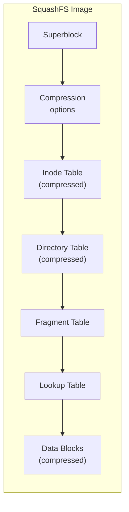
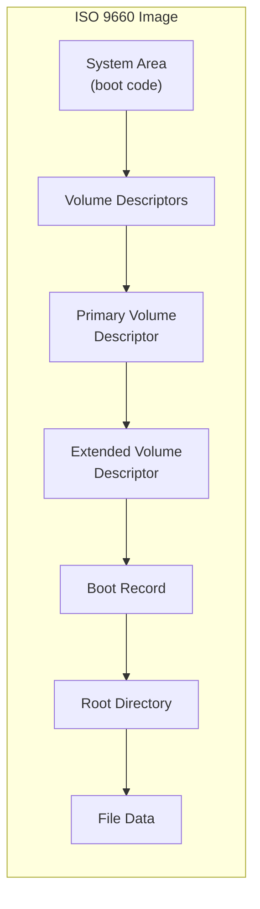

# Chapter 77: SquashFS and ISO 9660 — Read-Only Compressed Filesystems

## 1. Intuition

SquashFS and ISO 9660 are read-only filesystems optimized for distribution. They're the backbone of Linux live CDs, embedded systems, firmware images, and software distribution. When you download a Linux ISO, boot a live USB, or update your router's firmware, you're almost certainly using one of these formats.

Think of them as zip files you can mount. The data is compressed and packed into a single file that can be mounted as a filesystem. SquashFS is Linux-native with excellent compression. ISO 9660 is the universal standard for optical media, supported by every operating system on the planet.

## 2. Architecture

### 2.1 SquashFS Layout



### 2.2 ISO 9660 Layout



## 3. Source Code References

| File | Purpose |
|------|---------|
| `fs/squashfs/` | SquashFS kernel implementation |
| `fs/squashfs/super.c` | Superblock operations |
| `fs/squashfs/inode.c` | Inode operations |
| `fs/squashfs/file.c` | File data handling |
| `fs/squashfs/dir.c` | Directory operations |
| `fs/squashfs/decompressor.c` | Decompression |
| `fs/squashfs/lz4_wrapper.c` | LZ4 decompression |
| `fs/squashfs/zstd_wrapper.c` | ZSTD decompression |
| `fs/isofs/` | ISO 9660 implementation |
| `fs/isofs/inode.c` | ISO 9660 inode operations |
| `fs/isofs/dir.c` | Directory operations |
| `fs/isofs/rock.c` | Rock Ridge extensions |
| `fs/isofs/joliet.c` | Joliet extensions |

## 4. SquashFS

### 4.1 Data Structures

```c
/* SquashFS superblock */
struct squashfs_super_block {
    __le32  s_magic;           /* SQUASHFS_MAGIC: 0x73717368 */
    __le32  inodes;            /* number of inodes */
    __le32  mkfs_time;         /* creation timestamp */
    __le32  block_size;        /* data block size (default 128KB) */
    __le32  fragments;         /* number of fragments */
    __le16  compression;       /* compression algorithm */
    __le16  block_log;         /* log2(block_size) */
    __le16  flags;             /* flags */
    __le16  no_ids;            /* number of id entries */
    __le16  s_major;           /* major version */
    __le16  s_minor;           /* minor version */
    __le64  root_inode;        /* root inode block */
    __le64  bytes_used;        /* bytes used in image */
    __le64  id_table_start;    /* id table start */
    __le64  xattr_id_table_start; /* xattr table start */
    __le64  inode_table_start; /* inode table start */
    __le64  directory_table_start; /* directory table start */
    __le64  fragment_table_start; /* fragment table start */
    __le64  lookup_table_start; /* lookup table start */
};

/* SquashFS inode (base) */
struct squashfs_base_inode {
    __le16  inode_type;
    __le16  mode;
    __le16  uid;
    __le16  gid;
    __le32  mtime;
    __le32  inode_number;
};

/* SquashFS regular file inode */
struct squashfs_reg_inode {
    __le16  inode_type;
    __le16  mode;
    __le16  uid;
    __le16  gid;
    __le32  mtime;
    __le32  inode_number;
    __le32  start_block;       /* data block start */
    __le32  fragment;          /* fragment block index */
    __le32  offset;            /* offset in fragment block */
    __le32  file_size;
    /* Block sizes follow (for non-fragment data) */
};
```

### 4.2 Compression Algorithms

| Algorithm | Ratio | Speed | Kernel Support |
|-----------|-------|-------|----------------|
| gzip | Good | Moderate | Always |
| lzo | Fair | Fast | Config option |
| lz4 | Fair | Fastest | Kernel 4.6+ |
| xz | Best | Slow | Kernel 4.7+ |
| zstd | Excellent | Fast | Kernel 5.1+ |

### 4.3 Creating SquashFS Images

```bash
# Install squashfs-tools
apt install squashfs-tools

# Create basic SquashFS image
mksquashfs /source/directory /output/image.squashfs

# With compression options
mksquashfs /source /output/image.squashfs -comp zstd -Xcompression-level 6

# Different algorithms
mksquashfs /source /output/image.squashfs -comp gzip
mksquashfs /source /output/image.squashfs -comp xz
mksquashfs /source /output/image.squashfs -comp lz4
mksquashfs /source /output/image.squashfs -comp lzo

# Block size (default: 128K)
mksquashfs /source /output/image.squashfs -b 256K

# Exclude files
mksquashfs /source /output/image.squashfs -e "*.tmp" -e "*.log"

# Pseudo-file definitions (modify attributes)
echo "/etc/shadow m 0640 root shadow" > pseudo.txt
mksquashfs /source /output/image.squashfs -pf pseudo.txt

# View image contents
unsquashfs -l image.squashfs

# Extract image
unsquashfs image.squashfs

# Mount
mount -t squashfs image.squashfs /mnt/squashfs
```

### 4.4 SquashFS in Live CDs

```bash
# Typical live CD structure
# /casper/filesystem.squashfs  — Root filesystem
# /casper/vmlinuz              — Kernel
# /casper/initrd               — Initial ramdisk

# The boot process:
# 1. Bootloader loads kernel and initrd
# 2. initrd mounts the SquashFS image
# 3. OverlayFS creates writable layer on top
# 4. System boots from the merged filesystem

# Ubuntu live CD example
mount -o loop /path/to/ubuntu.iso /mnt/iso
ls /mnt/iso/casper/
# filesystem.squashfs  filesystem.manifest  vmlinuz  initrd

mount -t squashfs /mnt/iso/casper/filesystem.squashfs /mnt/squash
```

### 4.5 SquashFS Performance

```bash
# Compression ratios (typical):
# gzip:     2.5-3.5x
# xz:       3.5-5x
# zstd:     3-4.5x
# lz4:      1.5-2.5x

# Read performance:
# SquashFS (SSD):   200-500 MB/s (depends on decompression)
# SquashFS (HDD):   50-150 MB/s
# ext4 (SSD):       500+ MB/s

# Decompression CPU cost:
# lz4:   Minimal
# zstd:  Low-moderate
# gzip:  Moderate
# xz:    High

# Benchmark decompression
dd if=/mnt/squashfs/largefile of=/dev/null bs=1M
# Compare with:
dd if=/mnt/ext4/largefile of=/dev/null bs=1M
```

### 4.6 SquashFS Fragment Blocks

```bash
# SquashFS stores small files (< block_size) in fragment blocks
# Multiple small files share a single compressed block

# This dramatically improves compression ratio for many small files

# View fragment information
unsquashfs -s image.squashfs
# Filesystem size: 234.56M (1024.00M uncompressed)
# Compression ratio: 4.36x
# Block size: 131072
# Fragments: 1234
# ...
```

## 5. ISO 9660

### 5.1 ISO 9660 Structure

```c
/* Volume Descriptor */
struct iso_volume_descriptor {
    __u8  type;              /* 1=primary, 2=supplementary, 255=terminator */
    char  id[5];             /* "CD001" */
    __u8  version;           /* 1 */
    union {
        struct iso_primary_descriptor {
            __u8  unused1;
            char  system_id[32];
            char  volume_id[32];
            __u8  unused2[8];
            __le32 volume_space_size_le;
            __be32 volume_space_size_be;
            __u8  unused3[32];
            __le16 volume_set_size_le;
            __le16 volume_sequence_number_le;
            __le16 logical_block_size_le;
            __le32 path_table_size_le;
            __le32 type_l_path_table;
            __le32 opt_type_l_path_table;
            __le32 type_m_path_table;
            __le32 opt_type_m_path_table;
            struct iso_directory_record root_directory_record;
            char  volume_set_id[128];
            char  publisher_id[128];
            char  preparer_id[128];
            char  application_id[128];
            char  copyright_file_id[37];
            char  abstract_file_id[37];
            char  bibliographic_file_id[37];
            /* ... dates, etc. ... */
        } primary;
        /* ... supplementary (Joliet), boot, terminator ... */
    } type_data;
};

/* Directory Record */
struct iso_directory_record {
    __u8  length;            /* record length */
    __u8  ext_attr_length;
    __le32 extent_le;        /* location of data (logical blocks) */
    __be32 extent_be;
    __le32 size_le;          /* data size in bytes */
    __be32 size_be;
    __u8  date[7];           /* recording date */
    __u8  flags;             /* file flags */
    __u8  file_unit_size;
    __u8  interleave;
    __le16 volume_sequence_number;
    __u8  name_len;
    char  name[];            /* filename (not null-terminated) */
};
```

### 5.2 ISO 9660 Extensions

| Extension | Feature |
|-----------|---------|
| **Rock Ridge** | POSIX permissions, symlinks, long filenames |
| **Joliet** | Unicode filenames (Windows) |
| **El Torito** | Bootable CD/DVD |
| **UDF** | Universal Disk Format (DVD, Blu-ray) |

### 5.3 Creating ISO Images

```bash
# Basic ISO 9660
genisoimage -o output.iso -J -R /source/directory
# -J: Joliet (Windows compatibility)
# -R: Rock Ridge (Unix permissions)

# With El Torito boot
genisoimage -o boot.iso \
    -b isolinux/isolinux.bin \
    -c isolinux/boot.cat \
    -no-emul-boot \
    -boot-load-size 4 \
    -boot-info-table \
    -J -R \
    /source/

# xorriso (modern alternative)
xorriso -as mkisofs \
    -o output.iso \
    -isohybrid-mbr /usr/lib/ISOLINUX/isohdpfx.bin \
    -c isolinux/boot.cat \
    -b isolinux/isolinux.bin \
    -no-emul-boot \
    -boot-load-size 4 \
    -boot-info-table \
    -J -R \
    /source/

# Mount ISO
mount -o loop,ro image.iso /mnt/iso

# Extract ISO contents
7z x image.iso -o/tmp/extracted
isoinfo -l -i image.iso  # List contents
```

### 5.4 Bootable ISO Creation

```bash
#!/bin/bash
# Create a bootable Linux ISO

WORK_DIR=$(mktemp -d)
ISO_DIR="$WORK_DIR/iso"

# Create directory structure
mkdir -p "$ISO_DIR"/{boot,isolinux,LiveOS}

# Copy kernel and initrd
cp /boot/vmlinuz "$ISO_DIR/boot/vmlinuz"
cp /boot/initrd.img "$ISO_DIR/boot/initrd.img"

# Create SquashFS root filesystem
mksquashfs / "$ISO_DIR/LiveOS/squashfs.img" \
    -comp xz -e proc sys dev run tmp

# Create isolinux configuration
cat > "$ISO_DIR/isolinux/isolinux.cfg" << 'EOF'
DEFAULT linux
LABEL linux
  KERNEL /boot/vmlinuz
  APPEND initrd=/boot/initrd.img root=live:/LiveOS/squashfs.img
EOF

# Copy isolinux binaries
cp /usr/lib/ISOLINUX/isolinux.bin "$ISO_DIR/isolinux/"
cp /usr/lib/syslinux/modules/bios/ldlinux.c32 "$ISO_DIR/isolinux/"

# Generate ISO
genisoimage -o custom-linux.iso \
    -b isolinux/isolinux.bin \
    -c isolinux/boot.cat \
    -no-emul-boot \
    -boot-load-size 4 \
    -boot-info-table \
    -J -R -V "CUSTOM_LINUX" \
    "$ISO_DIR"

# Make hybrid (bootable from USB too)
isohybrid custom-linux.iso

rm -rf "$WORK_DIR"
```

### 5.5 ISO 9660 Levels

```bash
# Level 1: 8.3 filenames, uppercase only
genisoimage -iso-level 1 -o level1.iso /source

# Level 2: 31-character filenames
genisoimage -iso-level 2 -o level2.iso /source

# Level 3: Like level 2 but allows files > 4GB
genisoimage -iso-level 3 -o level3.iso /source

# Level 4: Like level 3 with relaxed constraints
genisoimage -iso-level 4 -o level4.iso /source
```

## 6. erofs (Enhanced Read-Only File System)

### 6.1 Overview

erofs is a modern read-only filesystem in the Linux kernel, optimized for Android and embedded systems:

```bash
# Create erofs image
mkfs.erofs -zlz4 image.erofs /source/directory

# Mount
mount -t erofs image.erofs /mnt/erofs

# Advantages over SquashFS:
# - Random access friendly (fixed-size compression clusters)
# - Better for Android (used in system/vendor partitions)
# - Chunk-based deduplication
# - Inline data support
```

## 7. Examples

### 7.1 SquashFS Root Filesystem

```bash
#!/bin/bash
# Create a minimal SquashFS root filesystem

ROOTFS="/tmp/rootfs"
IMAGE="rootfs.squashfs"

mkdir -p "$ROOTFS"/{bin,etc,lib,proc,sys,dev,tmp,var,usr}

# Install minimal system
debootstrap --variant=minbase bullseye "$ROOTFS"

# Clean up
chroot "$ROOTFS" apt clean
rm -rf "$ROOTFS"/var/cache/apt/*
rm -rf "$ROOTFS"/tmp/*

# Create SquashFS image
mksquashfs "$ROOTFS" "$IMAGE" -comp xz -b 1M

# Test
mkdir -p /mnt/test
mount -t squashfs "$IMAGE" /mnt/test
ls /mnt/test/
umount /mnt/test
```

### 7.2 Custom Live CD

```bash
# Create custom Ubuntu-based live CD

# 1. Create working directory
WORK=$(mktemp -d)
cd "$WORK"

# 2. Extract Ubuntu ISO
mkdir iso-extract
mount -o loop ubuntu-22.04.iso /mnt/iso
cp -a /mnt/iso iso-extract/
umount /mnt/iso

# 3. Extract SquashFS
mkdir squashfs-root
unsquashfs -d squashfs-root iso-extract/casper/filesystem.squashfs

# 4. Customize
chroot squashfs-root bash -c "
    apt update
    apt install -y vim tmux htop
    apt clean
"

# 5. Repack SquashFS
rm iso-extract/casper/filesystem.squashfs
mksquashfs squashfs-root iso-extract/casper/filesystem.squashfs -comp xz

# 6. Generate new ISO
cd iso-extract
genisoimage -o ../custom-ubuntu.iso \
    -b isolinux/isolinux.bin \
    -c isolinux/boot.cat \
    -no-emul-boot \
    -boot-load-size 4 \
    -boot-info-table \
    -J -R .

# 7. Make hybrid
isohybrid ../custom-ubuntu.iso
```

### 7.3 Firmware Image

```bash
# Create router firmware image

# Build SquashFS root
mksquashfs /path/to/rootfs firmware-root.squashfs \
    -comp lz4 -b 256K -no-xattrs

# Combine with kernel and bootloader
dd if=bootloader.bin of=firmware.bin bs=1K
dd if=kernel.bin of=firmware.bin bs=1K seek=256
dd if=firmware-root.squashfs of=firmware.bin bs=1K seek=2048
```

### 7.4 Docker Image Layers

```bash
# Docker images use layers that are essentially tarballs
# But SquashFS can be used for compressed image distribution

# Export container as SquashFS
docker export container_id | mksquashfs - container.squashfs -tar

# Or build a SquashFS-based rootfs
mkdir -p rootfs
docker export container_id | tar -xf - -C rootfs
mksquashfs rootfs image.squashfs -comp zstd
```

## 8. Performance

### 8.1 Compression Comparison

```
Test data: Linux kernel source tree (1.2GB uncompressed)

SquashFS gzip:     320MB  (3.75x ratio)
SquashFS xz:       210MB  (5.71x ratio)
SquashFS zstd:     250MB  (4.80x ratio)
SquashFS lz4:      480MB  (2.50x ratio)
ISO 9660:          1200MB (1.00x, no compression)
tar.gz:            330MB  (3.64x ratio)
tar.xz:            220MB  (5.45x ratio)
```

### 8.2 Read Performance

```
Sequential read (SSD, 4GB file):

ext4 (uncompressed):  520 MB/s
SquashFS lz4:         450 MB/s (minimal CPU overhead)
SquashFS zstd:        380 MB/s (moderate CPU)
SquashFS gzip:        280 MB/s (more CPU)
SquashFS xz:          180 MB/s (heavy CPU)

Random read (4K blocks):

ext4:                 50,000 IOPS
SquashFS lz4:         30,000 IOPS
SquashFS zstd:        25,000 IOPS
```

### 8.3 Block Size Impact

```bash
# Larger blocks = better compression, worse random access
# Smaller blocks = worse compression, better random access

# Default: 128K
mksquashfs /source image-128k.squashfs -b 128K

# Larger blocks for sequential data
mksquashfs /source image-1m.squashfs -b 1M

# Smaller blocks for random access
mksquashfs /source image-4k.squashfs -b 4K
```

## 9. Common Pitfalls

### 9.1 SquashFS Fragmentation

```bash
# SquashFS fragments can be inefficient for many small files
# Mitigation: use -no-fragments for many small files
mksquashfs /source image.squashfs -no-fragments
```

### 9.2 ISO 9660 Filename Limitations

```bash
# ISO 9660 Level 1: 8.3 uppercase filenames
# Use Rock Ridge or Joliet for long filenames

# Without extensions:
genisoimage -o bad.iso /source  # Filenames truncated

# With extensions:
genisoimage -J -R -o good.iso /source  # Full filenames
```

### 9.3 SquashFS No Write Support

```bash
# SquashFS is strictly read-only
# Cannot modify files, add files, or delete files

# Workaround: unsquash, modify, re-squash
unsquashfs image.squashfs
# Modify files in squashfs-root/
mksquashfs squashfs-root new-image.squashfs
```

### 9.4 Large ISO Images

```bash
# ISO 9660 without extensions limits file size to 4GB
# Use ISO level 3 or UDF for larger files

genisoimage -iso-level 3 -o large.iso /source
# Or
mkudffs large.udf 2G  # UDF for > 4GB
```

### 9.5 Boot Issues

```bash
# Some BIOS/UEFI require specific boot structures
# Use isohybrid for USB boot capability
isohybrid image.iso

# For UEFI boot:
xorriso -as mkisofs \
    -eltorito-alt-boot \
    -e EFI/BOOT/BOOTx64.EFI \
    -no-emul-boot \
    -isohybrid-gpt-basdat \
    ...
```

## 10. Best Practices

1. **Use zstd for SquashFS.** It offers the best compression/speed tradeoff.

2. **Use Rock Ridge for ISOs.** It preserves Unix permissions and long filenames.

3. **Make ISOs hybrid.** Use `isohybrid` for USB boot capability.

4. **Test before distribution.** Mount and verify the image contents.

5. **Use appropriate block sizes.** 128K for general use, 1M for large files.

6. **Sign images.** Use GPG or dm-verity for integrity verification.

7. **Use erofs for Android.** It's optimized for mobile/embedded use cases.

8. **Consider compression level.** Higher levels give better compression but take longer to create.

9. **Clean source before compression.** Remove unnecessary files to reduce image size.

10. **Document image contents.** Include manifests and version information.

## 11. Exercises

### Exercise 1: SquashFS Compression Comparison
Create SquashFS images of the same data with different compression algorithms. Compare file size, creation time, and read performance.

### Exercise 2: Bootable ISO
Create a bootable Linux ISO from scratch using SquashFS, a kernel, and an initrd. Test it in a VM.

### Exercise 3: Live CD Customization
Customize an Ubuntu live CD by adding packages, changing configuration, and modifying the boot menu. Repackage and test.

### Exercise 4: SquashFS Root
Create a minimal SquashFS root filesystem and boot it with an initrd. Measure boot time and memory usage.

### Exercise 5: erofs vs SquashFS
Compare erofs and SquashFS for the same dataset. Test compression ratio, random access performance, and metadata operations.

## 12. References

1. **SquashFS source** — `fs/squashfs/` in the Linux kernel
2. **squashfs-tools** — https://github.com/plougher/squashfs-tools
3. **ISO 9660 specification** — ECMA-119
4. **Rock Ridge specification** — IEEE P1282
5. **erofs documentation** — `Documentation/filesystems/erofs.rst`
6. **genisoimage man page** — `genisoimage(1)`
7. **xorriso documentation** — https://www.gnu.org/software/xorriso/
8. **Live CD HOWTO** — Various distribution-specific guides
