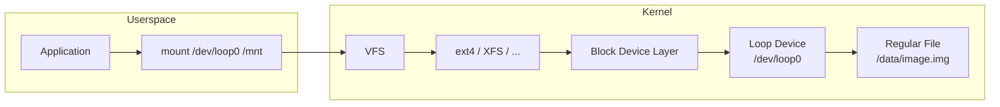
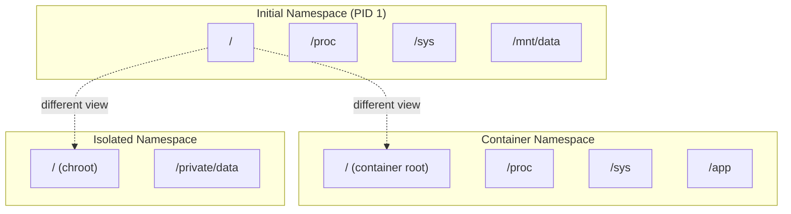

# Chapter 78: Loop Devices and Mount Namespaces

## 1. Intuition

Loop devices and mount namespaces are two of Linux's most powerful storage abstractions. A loop device makes a regular file look like a block device — you can format it, mount it, and use it like a disk partition. Mount namespaces let different processes see completely different mount trees — the foundation for containers, chroot jails, and secure environments.

Together, they enable incredible flexibility. Want to create a filesystem image without a real disk? Loop device. Want to give a process its own view of the filesystem? Mount namespace. Want a container with its own root filesystem? Both, working together.

## 2. Architecture

### 2.1 Loop Device



### 2.2 Mount Namespaces



## 3. Source Code References

| File | Purpose |
|------|---------|
| `drivers/block/loop.c` | Loop device driver |
| `fs/namespace.c` | Mount namespace implementation |
| `fs/proc_namespace.c` | `/proc/*/mounts` |
| `include/linux/loop.h` | Loop device structures |
| `include/linux/mount.h` | Mount structures |
| `include/linux/mnt_namespace.h` | Namespace structures |
| `include/uapi/linux/loop.h` | Loop ioctl definitions |
| `include/uapi/linux/nsfs.h` | Namespace filesystem |

## 4. Loop Devices

### 4.1 Loop Device Data Structures

```c
struct loop_device {
    int                 lo_number;      /* loop device number */
    int                 lo_state;       /* LO_UNBOUND, LO_BOUND, etc. */
    struct file         *lo_backing_file; /* backing file */
    struct block_device *lo_device;     /* block device */
    int                 lo_offset;      /* data offset in backing file */
    int                 lo_sizelimit;   /* size limit */
    int                 lo_flags;       /* LO_FLAGS_* */
    struct loop_info64  lo_info;        /* loop info */
    struct gendisk      *lo_disk;       /* generic disk */
    /* ... */
};

struct loop_info64 {
    __u64           lo_device;          /* ioctl r/o */
    __u64           lo_inode;           /* ioctl r/o */
    __u64           lo_rdevice;         /* ioctl r/o */
    __le64          lo_offset;          /* data offset */
    __le64          lo_sizelimit;       /* size limit */
    __le32          lo_number;          /* ioctl r/o */
    __le32          lo_encrypt_type;    /* encryption type */
    __le32          lo_encrypt_key_size; /* key size */
    __le32          lo_flags;           /* LO_FLAGS_* */
    __u8            lo_file_name[LO_NAME_SIZE];
    __u8            lo_crypt_name[LO_NAME_SIZE];
    __u8            lo_encrypt_key[LO_KEY_SIZE];
    /* ... */
};
```

### 4.2 Basic Loop Device Operations

```bash
# Create a loop device from a file
dd if=/dev/zero of=/data/image.img bs=1M count=1024
losetup /dev/loop0 /data/image.img

# Or use losetup with find/create
losetup -f                    # Find first unused loop device
losetup -f /data/image.img    # Attach to first unused

# Create filesystem on loop device
mkfs.ext4 /dev/loop0

# Mount
mount /dev/loop0 /mnt/image

# View loop device info
losetup -a
# /dev/loop0: [08:01]:12345 (/data/image.img)

# Detach
umount /mnt/image
losetup -d /dev/loop0
```

### 4.3 Loop Device with Offset and Size

```bash
# Create an image with a partition table
dd if=/dev/zero of=/data/disk.img bs=1M count=100
parted /data/disk.img mklabel msdos
parted /data/disk.img mkpart primary ext4 1MiB 50MiB
parted /data/disk.img mkpart primary ext4 50MiB 100MiB

# Mount the first partition (offset 1MiB)
losetup -o $((1 * 1024 * 1024)) --sizelimit $((49 * 1024 * 1024)) \
    /dev/loop0 /data/disk.img

mkfs.ext4 /dev/loop0
mount /dev/loop0 /mnt/part1

# Or use kpartx to automatically create loop devices for partitions
apt install kpartx
kpartx -av /data/disk.img
# Creates /dev/mapper/loop0p1, /dev/mapper/loop0p2
mount /dev/mapper/loop0p1 /mnt/part1
```

### 4.4 Loop Device with Direct I/O

```bash
# Use direct I/O (bypass page cache)
losetup --direct-io=on /dev/loop0 /data/image.img

# Useful for:
# - Databases on loop devices
# - Avoiding double caching
# - Testing with O_DIRECT semantics
```

### 4.5 Loop Device Autoclear

```bash
# Autoclear: loop device is automatically detached when unmounted
losetup -o 0 --sizelimit 0 --autoclear /dev/loop0 /data/image.img

# This is used by mount -o loop
mount -o loop /data/image.img /mnt
# Creates loop device, mounts, and sets autoclear
```

### 4.6 Loop Device Control via ioctl

```c
#include <linux/loop.h>
#include <sys/ioctl.h>

/* Attach a file to a loop device */
int loop_attach(int fd, const char *file, int offset)
{
    struct loop_info64 info = {0};
    int file_fd;

    file_fd = open(file, O_RDWR);
    if (file_fd < 0)
        return -1;

    /* Set backing file */
    if (ioctl(fd, LOOP_SET_FD, file_fd) < 0) {
        close(file_fd);
        return -1;
    }

    /* Set offset */
    info.lo_offset = offset;
    if (ioctl(fd, LOOP_SET_STATUS64, &info) < 0) {
        ioctl(fd, LOOP_CLR_FD);
        close(file_fd);
        return -1;
    }

    close(file_fd);
    return 0;
}

/* Detach loop device */
int loop_detach(int fd)
{
    return ioctl(fd, LOOP_CLR_FD);
}

/* Configure encryption (legacy) */
int loop_set_encrypt(int fd, const char *key, int key_size)
{
    struct loop_info64 info = {0};
    info.lo_encrypt_type = LO_CRYPT_AES;
    info.lo_encrypt_key_size = key_size;
    memcpy(info.lo_encrypt_key, key, key_size);
    return ioctl(fd, LOOP_SET_STATUS64, &info);
}
```

### 4.7 Loop Device in systemd

```systemd
# systemd can manage loop devices via .loop units
# /etc/systemd/data-images.mount

[Unit]
Description=Data Image Mount

[Mount]
What=/data/image.img
Where=/mnt/data
Type=ext4
Options=loop

[Install]
WantedBy=multi-user.target
```

## 5. Mount Namespaces

### 5.1 Namespace Types

Linux has several namespace types:

```bash
# View namespace types
ls -la /proc/1/ns/
# lrwxrwxrwx 1 root root 0 Jun 29 10:00 cgroup -> 'cgroup:[4026531835]'
# lrwxrwxrwx 1 root root 0 Jun 29 10:00 ipc -> 'ipc:[4026531839]'
# lrwxrwxrwx 1 root root 0 Jun 29 10:00 mnt -> 'mnt:[4026531841]'
# lrwxrwxrwx 1 root root 0 Jun 29 10:00 net -> 'net:[4026531969]'
# lrwxrwxrwx 1 root root 0 Jun 29 10:00 pid -> 'pid:[4026531836]'
# lrwxrwxrwx 1 root root 0 Jun 29 10:00 pid_for_children -> 'pid:[4026531836]'
# lrwxrwxrwx 1 root root 0 Jun 29 10:00 user -> 'user:[4026531837]'
# lrwxrwxrwx 1 root root 0 Jun 29 10:00 uts -> 'uts:[4026531838]'
```

| Namespace | Flag | Isolates |
|-----------|------|----------|
| Mount | CLONE_NEWNS | Mount points |
| UTS | CLONE_NEWUTS | Hostname, domain |
| IPC | CLONE_NEWIPC | System V IPC, POSIX MQs |
| PID | CLONE_NEWPID | Process IDs |
| Network | CLONE_NEWNET | Network stack |
| User | CLONE_NEWUSER | UID/GID mappings |
| Cgroup | CLONE_NEWCGROUP | Cgroup root |
| Time | CLONE_NEWTIME | Boot time, monotonic time |

### 5.2 Mount Propagation

Mount events can propagate between mount namespaces:

```mermaid
graph TD
    subgraph "Shared Mount (propagates)"
        S1["Mount A (shared)"]
        S2["Mount B (shared)"]
        S1 <-.->|"mount/umount<br/>propagates"| S2
    end

    subgraph "Private Mount (isolated)"
        P1["Mount C (private)"]
        P2["Mount D (private)"]
    end

    subgraph "Slave Mount (one-way)"
        SL1["Master Mount"]
        SL2["Slave Mount"]
        SL1 -.->|"propagates to"| SL2
        SL2 -.-✗|"no propagation"| SL1
    end
```

```bash
# View mount propagation
cat /proc/self/mountinfo | grep "shared:\|private:\|slave:\|unbindable:"

# Make mount shared
mount --make-shared /mnt

# Make mount private
mount --make-private /mnt

# Make mount slave
mount --make-slave /mnt

# Make mount unbindable
mount --make-unbindable /mnt
```

### 5.3 Creating Mount Namespaces

```bash
# Create a new mount namespace with unshare
unshare -m bash

# In the new namespace, mount changes are invisible to parent
mount -t tmpfs tmpfs /mnt
# Only visible in this namespace

# Create namespace with new root
unshare -m --mount-proc bash
# /proc shows only processes in this namespace (if combined with -p)

# Using mount --bind with namespaces
mount --bind /source /target
# Creates a bind mount
```

### 5.4 Mount Namespace Propagation Types

```bash
# Mount event propagation:
# shared    — Events propagate to/from peer group
# private   — No propagation
# slave     — Receives from master, doesn't propagate back
# unbindable — Cannot be bind-mounted

# Set propagation recursively
mount --make-rshared /    # Make entire tree shared
mount --make-rprivate /   # Make entire tree private
mount --make-rslave /     # Make entire tree slave

# Typical container setup
mount --make-rprivate /   # Isolate container mounts
```

### 5.5 /proc/PID/mountinfo

```bash
# View mount info for a process
cat /proc/self/mountinfo
# 36 35 98:0 /mnt1 /mnt2 rw,noatime shared:1 - ext4 /dev/sda1 rw

# Fields:
# 1: mount ID
# 2: parent ID
# 3: major:minor device
# 4: root (mount point in the filesystem)
# 5: mount point (in the process view)
# 6: mount options
# 7: optional fields (shared:N, master:N, etc.)
# 8: separator (-)
# 9: filesystem type
# 10: mount source
# 11: super options

# Compare mount views of different processes
diff /proc/1/mountinfo /proc/$$/mountinfo
```

## 6. chroot

### 6.1 chroot Basics

```bash
# chroot changes the apparent root directory
chroot /path/to/newroot /bin/bash

# Common uses:
# 1. System recovery
# 2. Building packages
# 3. Running old distributions
# 4. Security isolation (weak)

# Set up a chroot environment
mkdir -p /chroot/{bin,lib,lib64,proc,sys,dev,etc}

# Copy essential binaries
cp /bin/bash /chroot/bin/
cp /bin/ls /chroot/bin/

# Copy required libraries
ldd /bin/bash | awk '{print $3}' | xargs -I{} cp {} /chroot/lib/

# Mount essential filesystems
mount -t proc proc /chroot/proc
mount -t sysfs sysfs /chroot/sys
mount -o bind /dev /chroot/dev

# Enter chroot
chroot /chroot /bin/bash
```

### 6.2 chroot vs Mount Namespace

```bash
# chroot is simple but weak:
# - Can escape with root privileges
# - Doesn't isolate mount points
# - Doesn't isolate PIDs

# Mount namespace is stronger:
# - Full mount isolation
# - Combined with other namespaces for containers
# - Cannot easily escape

# Best: use unshare with mount namespace
unshare --mount --uts --ipc --net --pid --fork chroot /chroot /bin/bash
```

## 7. Examples

### 7.1 Loop Device Filesystem Image

```bash
#!/bin/bash
# Create and manage a filesystem image

IMAGE="/data/myimage.img"
SIZE="1G"
MOUNT="/mnt/image"

# Create image
dd if=/dev/zero of="$IMAGE" bs=1M count=1024

# Create filesystem
mkfs.ext4 -L "myimage" "$IMAGE"

# Mount using loop device
mkdir -p "$MOUNT"
mount -o loop "$IMAGE" "$MOUNT"

# Use it
echo "Hello from loop device" > "$MOUNT/hello.txt"

# View loop device
losetup -a
# /dev/loop0: [08:01]:12345 (/data/myimage.img)

# Unmount
umount "$MOUNT"
```

### 7.2 Encrypted Loop Device

```bash
#!/bin/bash
# Create an encrypted filesystem on a loop device

IMAGE="/data/encrypted.img"
MOUNT="/mnt/encrypted"
SIZE="512"

# Create image
dd if=/dev/zero of="$IMAGE" bs=1M count=$SIZE

# Set up encrypted loop device
losetup /dev/loop0 "$IMAGE"
cryptsetup luksFormat /dev/loop0
cryptsetup luksOpen /dev/loop0 encrypted

# Create filesystem
mkfs.ext4 /dev/mapper/encrypted

# Mount
mkdir -p "$MOUNT"
mount /dev/mapper/encrypted "$MOUNT"

# Use...

# Cleanup
umount "$MOUNT"
cryptsetup luksClose encrypted
losetup -d /dev/loop0
```

### 7.3 Mount Namespace Isolation

```bash
#!/bin/bash
# Create an isolated environment using mount namespaces

# Create new mount namespace
unshare --mount bash << 'EOF'
# Make all existing mounts private
mount --make-rprivate /

# Set up new root
NEWROOT=$(mktemp -d)
mount -t tmpfs tmpfs "$NEWROOT"

# Create minimal filesystem
mkdir -p "$NEWROOT"/{bin,lib,lib64,proc,sys,dev,etc,tmp}
mount -t proc proc "$NEWROOT/proc"
mount -t sysfs sysfs "$NEWROOT/sys"
mount -o bind /dev "$NEWROOT/dev"

# Copy essential binaries and libraries
cp /bin/{bash,ls,cat,echo,mount} "$NEWROOT/bin/"
for bin in bash ls cat echo mount; do
    ldd "/bin/$bin" 2>/dev/null | awk '{print $3}' | \
        grep -v '^$' | xargs -I{} cp {} "$NEWROOT/lib/"
done

# Enter the isolated environment
chroot "$NEWROOT" /bin/bash

# Cleanup (when you exit)
umount "$NEWROOT"/{proc,sys,dev}
umount "$NEWROOT"
rmdir "$NEWROOT"
EOF
```

### 7.4 Container-Like Environment

```bash
#!/bin/bash
# Create a container-like environment with namespaces

ROOTFS="/var/lib/containers/test"
mkdir -p "$ROOTFS"

# Create minimal rootfs
debootstrap --variant=minbase bullseye "$ROOTFS"

# Create container with namespaces
unshare --mount --uts --ipc --net --pid --fork \
    --mount-proc="$ROOTFS/proc" \
    chroot "$ROOTFS" /bin/bash << 'CONTAINER'
# Inside container
mount -t proc proc /proc
mount -t sysfs sysfs /sys

# Set hostname
hostname mycontainer

# The container sees its own:
# - Mount points (mount namespace)
# - Hostname (UTS namespace)
# - IPC (IPC namespace)
# - Network (network namespace, if configured)
# - PIDs (PID namespace)

echo "Container is running!"
ps aux
CONTAINER
```

### 7.5 Loop Device for Swap

```bash
# Create a swap file using loop device
dd if=/dev/zero of=/swapfile bs=1M count=4096
chmod 600 /swapfile

# Format as swap
mkswap /swapfile

# Enable
swapon /swapfile

# Or in fstab
echo "/swapfile none swap sw 0 0" >> /etc/fstab
```

### 7.6 Loop Device for Testing

```bash
#!/bin/bash
# Test different filesystem types without real devices

IMAGES=()
MOUNTS=()

for fs in ext4 xfs btrfs; do
    IMG="/tmp/test-${fs}.img"
    MNT="/mnt/test-${fs}"

    # Create image
    dd if=/dev/zero of="$IMG" bs=1M count=100

    # Create filesystem
    mkfs."$fs" "$IMG" 2>/dev/null || mkfs."$fs" -f "$IMG"

    # Mount
    mkdir -p "$MNT"
    mount -o loop "$IMG" "$MNT"

    # Run tests
    fio --name=test --directory="$MNT" --size=50M \
        --bs=4k --rw=randwrite --ioengine=libaio --direct=1

    # Cleanup
    umount "$MNT"
    rm "$IMG"
    rmdir "$MNT"
done
```

## 8. Performance

### 8.1 Loop Device Overhead

```
Loop device adds minimal overhead:

Direct I/O on file:   500 MB/s (SSD)
Loop device (buffered): 480 MB/s
Loop device (direct):   490 MB/s

Random 4K read:
Direct:               50,000 IOPS
Loop buffered:        45,000 IOPS
Loop direct:          48,000 IOPS

# Loop device overhead is typically < 5%
```

### 8.2 Loop Device with Direct I/O

```bash
# Direct I/O avoids double caching
losetup --direct-io=on /dev/loop0 /data/image.img

# Without direct I/O:
# File page cache → Loop → Filesystem page cache
# Double memory usage

# With direct I/O:
# File → Loop → Filesystem (single cache layer)
```

### 8.3 Mount Namespace Overhead

```
Mount namespaces have minimal overhead:
- Creating namespace: < 1ms
- Mount operations: Same speed as without namespace
- Path lookup: Negligible additional overhead
```

## 9. Common Pitfalls

### 9.1 Loop Device Limits

```bash
# Default: 8 loop devices
cat /proc/devices | grep loop
#  7 loop

# Increase limit
echo "options loop max_loop=64" > /etc/modprobe.d/loop.conf
modprobe -r loop && modprobe loop

# Or at boot
echo "loop.max_loop=64" >> /etc/default/grub
update-grub

# Modern kernels create loop devices on demand
# No need to pre-create them
```

### 9.2 Loop Device Leaks

```bash
# If mount fails, loop device may remain attached

# Check for leaked loop devices
losetup -a

# Clean up
losetup -D  # Detach all loop devices

# Or specific device
losetup -d /dev/loop0
```

### 9.3 Mount Namespace Confusion

```bash
# Different processes can see different mount trees
# This can cause confusion

# Check which namespace you're in
readlink /proc/self/ns/mnt

# Compare with another process
readlink /proc/1/ns/mnt

# If different numbers, different namespaces
```

### 9.4 Mount Propagation Surprises

```bash
# Mounts can propagate unexpectedly
# If root is shared, mount in one namespace appears in another

# Fix: make mounts private
mount --make-rprivate /

# This is critical for containers
# Docker does this automatically
```

### 9.5 chroot Escape

```bash
# chroot is NOT a security boundary
# A root user can escape:

# Classic escape technique
mkdir -p /tmp/escape
cd /tmp/escape
# ... (various techniques)

# Use mount namespaces + other namespaces for real isolation
# Or use containers (Docker, LXC)
```

### 9.6 /proc Visibility

```bash
# In a PID namespace, /proc shows only namespace PIDs
# But if you mount the host's /proc, you see host PIDs

# Correct: mount proc after entering PID namespace
unshare --pid --fork --mount-proc bash
# Now /proc shows only this namespace's processes
```

## 10. Best Practices

1. **Use `mount -o loop` for simple cases.** It handles loop device creation automatically.

2. **Check loop device limits.** Increase `max_loop` if you need many loop devices.

3. **Use direct I/O for databases.** Avoid double caching with `losetup --direct-io=on`.

4. **Make mounts private for containers.** Use `mount --make-rprivate /` to prevent propagation.

5. **Combine namespaces for isolation.** Mount + PID + UTS + Network = effective container.

6. **Use `unshare` for testing.** It's the easiest way to create namespaces.

7. **Clean up loop devices.** Always detach with `losetup -d` when done.

8. **Document namespace requirements.** Some applications need specific namespace configurations.

9. **Use `lsns` to list namespaces.** It shows all namespaces on the system.

10. **Consider tmpfs for ephemeral loop devices.** Create images in tmpfs for speed.

## 11. Exercises

### Exercise 1: Loop Device Filesystem
Create a 100MB filesystem image on a loop device. Format it with ext4, mount it, copy files, unmount, and verify the image contains the data.

### Exercise 2: Encrypted Loop Device
Create an encrypted filesystem using LUKS on a loop device. Mount it, write data, unmount, and verify that the data is inaccessible without the key.

### Exercise 3: Mount Namespace Isolation
Create a mount namespace where the process sees a completely different filesystem tree. Demonstrate that mount/unmount operations are invisible to the parent namespace.

### Exercise 4: Container Environment
Build a minimal container using `unshare` with mount, PID, UTS, and network namespaces. Set up a rootfs with debootstrap and run a process inside.

### Exercise 5: Loop Device Performance
Benchmark loop device performance with and without direct I/O. Compare with native filesystem performance. Test with different filesystems (ext4, XFS, btrfs).

## 12. References

1. **Kernel documentation** — `Documentation/block/loop.rst`
2. **Kernel documentation** — `Documentation/filesystems/sharedsubtree.rst`
3. **Kernel documentation** — `Documentation/admin-guide/namespaces/`
4. **man pages** — `losetup(8)`, `mount(8)`, `unshare(1)`, `chroot(2)`, `namespaces(7)`
5. **Linux kernel source** — `drivers/block/loop.c`, `fs/namespace.c`
6. **LXC/LXD documentation** — https://linuxcontainers.org/
7. **Docker documentation** — https://docs.docker.com/
8. **man7.org namespaces** — https://man7.org/linux/man-pages/man7/namespaces.7.html
