# Chapter 79: Inodes, Journaling, and Page Cache

## 1. Intuition

Three fundamental mechanisms make Linux filesystems work: inodes provide the metadata backbone, journaling ensures crash consistency, and the page cache delivers blazing-fast I/O. Together, they solve the three hardest problems in filesystem design: how to track files efficiently, how to survive power failures, and how to make storage feel as fast as memory.

Think of inodes as index cards in a library — each card describes a book (file) without being the book itself. Journaling is like a notepad where you jot down what you're about to do before doing it — if you're interrupted, you can replay the notepad. The page cache is like a librarian who remembers which books you've recently read and keeps them on your desk for quick access.

## 2. Architecture

### 2.1 The Three Pillars

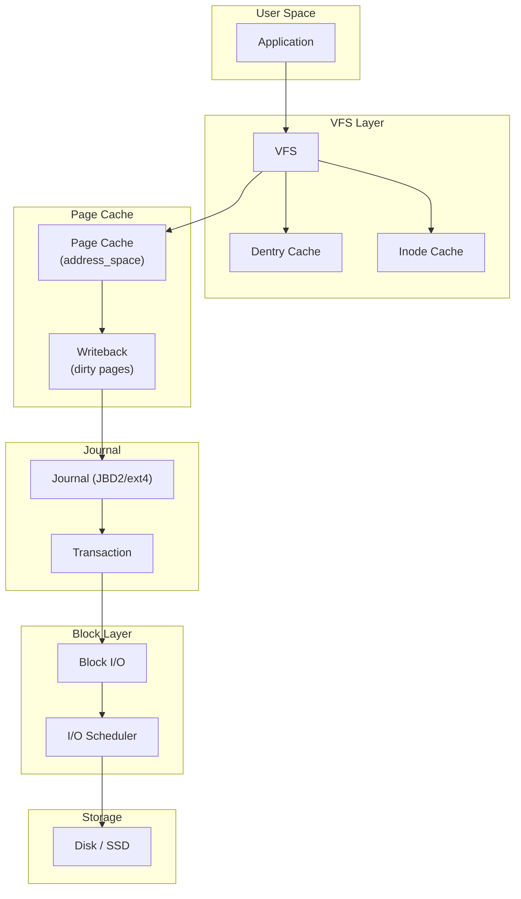

## 3. Inodes In-Depth

### 3.1 Inode Lifecycle

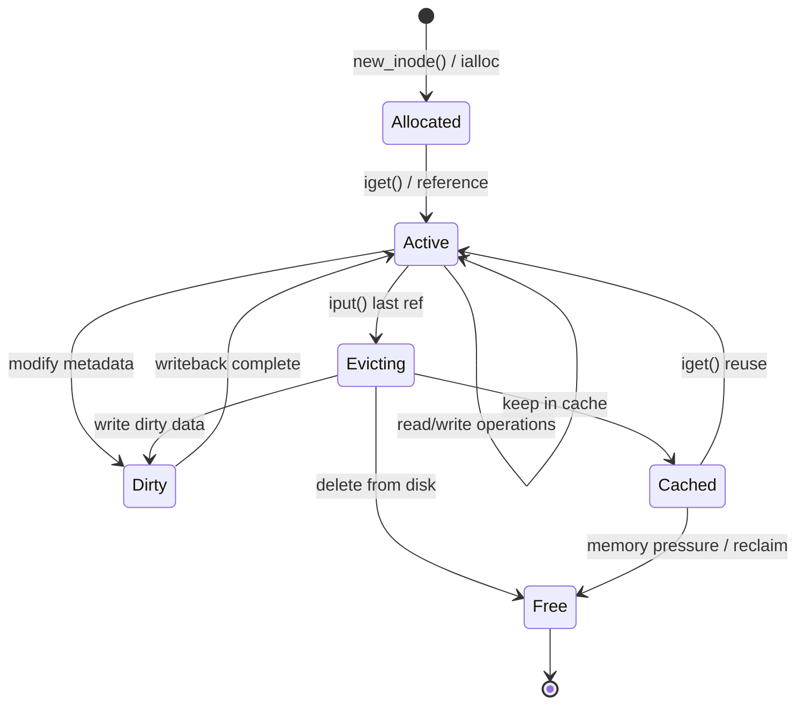

### 3.2 Inode Cache

The inode cache (`struct inode`) is managed by a combination of a hash table (for lookup by inode number) and an LRU list (for reclaim):

```c
/* Inode cache management in fs/inode.c */

/* Hash table for inode lookup */
static struct hlist_head *inode_hashtable;
static unsigned long i_hash_shift;

/* LRU list for reclaim */
static LIST_HEAD(inode_lru);
static int nr_lru;

/* Hash function */
static unsigned long hash(struct super_block *sb, unsigned long hashval)
{
    unsigned long tmp;
    tmp = (hashval * (unsigned long)sb) ^ (GOLDEN_RATIO_PRIME + hashval);
    return tmp & ((1UL << i_hash_shift) - 1);
}

/* Find inode in cache */
struct inode *ilookup(struct super_block *sb, unsigned long ino)
{
    struct inode *inode;
    struct hlist_head *head = inode_hashtable + hash(sb, ino);

    spin_lock(&inode_hash_lock);
    inode = find_inode_fast(sb, head, ino);
    if (inode) {
        spin_unlock(&inode_hash_lock);
        wait_on_inode(inode);
        return inode;
    }
    spin_unlock(&inode_hash_lock);
    return NULL;
}
```

### 3.3 Inode States

```c
/* Inode flags (inode->i_state) */
#define I_DIRTY_SYNC       (1 << 0)  /* Metadata dirty */
#define I_DIRTY_DATASYNC   (1 << 1)  /* Data dirty */
#define I_DIRTY_PAGES      (1 << 2)  /* Pages dirty */
#define I_NEW              (1 << 3)  /* Being initialized */
#define I_FREEING          (1 << 4)  /* Being freed */
#define I_CLEAR            (1 << 5)  /* Being cleared */
#define I_WILL_FREE        (1 << 6)  /* Will be freed soon */
#define I_SYNC             (1 << 7)  /* Being synced */
#define __I_DIRTY_TIME     10         /* Timestamps dirty */

/* Dirty inode tracking */
#define I_DIRTY (I_DIRTY_SYNC | I_DIRTY_DATASYNC | I_DIRTY_PAGES | I_DIRTY_TIME)
```

### 3.4 Inode Writeback

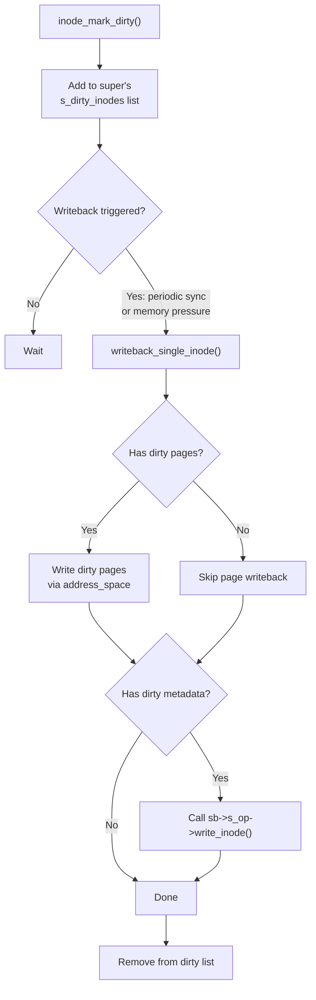

### 3.5 Hard Links and Inode Sharing

```bash
# Multiple directory entries can point to the same inode
ln /tmp/file /tmp/link

# View inode
ls -i /tmp/file /tmp/link
# 1234567 /tmp/file
# 1234567 /tmp/link

# Inode tracks link count
stat /tmp/file
#   File: /tmp/file
#   Size: 1024        Blocks: 8          IO Block: 4096   regular file
# Links: 2

# When link count reaches 0 AND no open file descriptors:
# - inode is deallocated
# - data blocks are freed

# If link count is 0 but file is open:
# - data remains until last fd is closed
# - useful for temporary files (mkstemp pattern)
```

## 4. Journaling Deep Dive

### 4.1 JBD2 Architecture

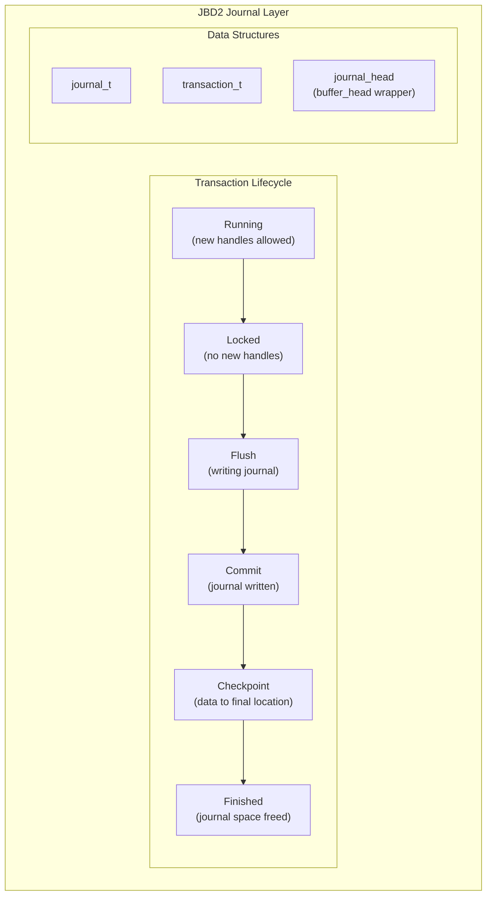

### 4.2 Transaction Structure

```c
struct transaction_s {
    journal_t        *t_journal;       /* owning journal */
    tid_t            t_tid;            /* transaction ID */
    enum t_state     t_state;          /* transaction state */
    unsigned long    t_flags;          /* transaction flags */

    /* Buffer lists */
    struct journal_head  *t_buffers;   /* all buffers in transaction */
    struct journal_head  *t_sync_datalist; /* data buffers */
    struct journal_head  *t_for_commit; /* buffers to commit */
    struct journal_head  *t_reserved_list; /* reserved buffers */

    /* Transaction management */
    unsigned int     t_outstanding_credits; /* outstanding handles */
    unsigned int     t_max_buffers;    /* max buffers */
    unsigned long    t_expires;        /* commit timeout */
    tid_t            t_next_data_flush_tid; /* next data flush */

    /* Checkpoint */
    struct journal_head  *t_checkpoint_list;
    struct journal_head  *t_checkpoint_io_list;

    ktime_t          t_start_time;     /* start time */
    unsigned long    t_request;        /* request time */
};
```

### 4.3 Journal Modes in Detail

#### data=ordered

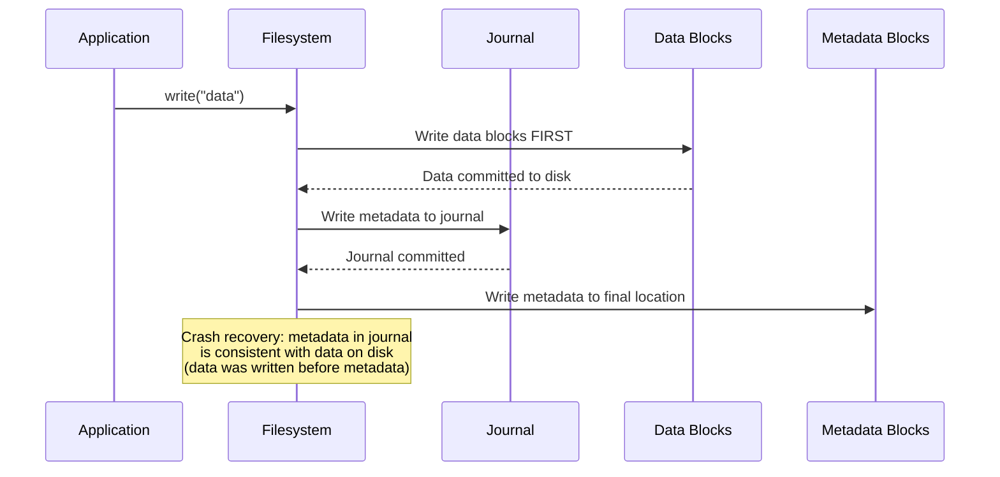

#### data=writeback

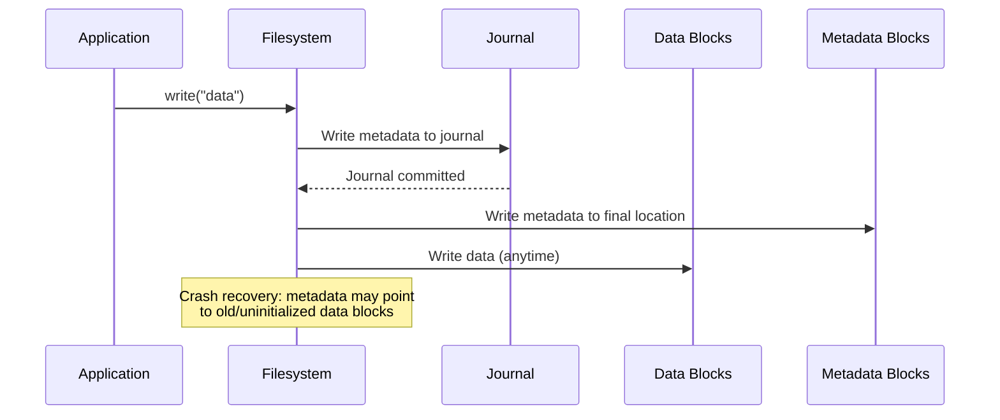

#### data=journal

```mermaid
sequenceDiagram
    participant App as Application
    participant FS as Filesystem
    participant J as Journal
    participant Data as Data Blocks
    participant Meta as Metadata Blocks

    App->>FS: write("data")
    FS->>J: Write data AND metadata to journal
    J-->>FS: Journal committed
    FS->>Data: Write data to final location
    FS->>Meta: Write metadata to final location
    Note over FS: Crash recovery: everything is in<br/>journal; most consistent but slowest
```

### 4.4 Journal Checkpointing

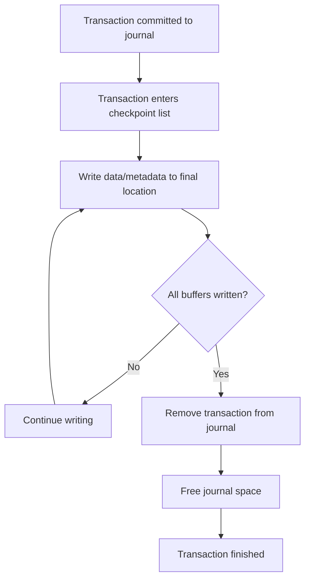

### 4.5 Crash Recovery

```bash
# During mount, filesystem replays the journal
# ext4 replay:
# 1. Read journal superblock
# 2. Find last valid transaction
# 3. Replay all committed transactions
# 4. Discard uncommitted transactions
# 5. Mark journal as clean

# Manual journal inspection
tune2fs -l /dev/sdb1 | grep -i journal
# Journal inode:            8
# Journal backup:           inode blocks
# Journal features:         journal_incompat_revoke journal_64bit
# Journal size:             128M
# Journal length:           32768

# View journal contents (debugfs)
debugfs -R "logdump -a<8>" /dev/sdb1
```

## 5. Page Cache Deep Dive

### 5.1 Page Cache Architecture

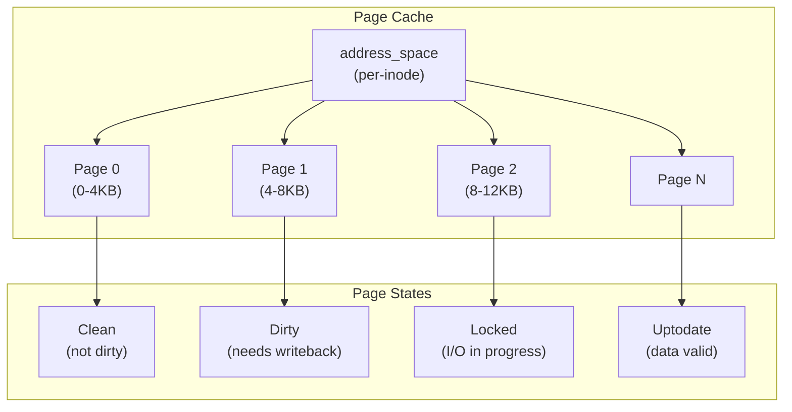

### 5.2 address_space Structure

```c
struct address_space {
    struct inode        *host;          /* owning inode */
    struct xarray       i_pages;        /* page cache xarray */
    spinlock_t          i_pages_lock;   /* page lock */
    atomic_t            i_mmap_writable; /* VM_SHARED mappings */
    struct rb_root_cached i_mmap;      /* VMA tree */
    unsigned long       nrpages;        /* total pages */
    pgoff_t             writeback_index; /* writeback position */
    const struct address_space_operations *a_ops; /* operations */
    unsigned long       flags;          /* error flags */
    errseq_t            wb_err;         /* writeback error */
    spinlock_t          i_private_lock;
    struct list_head    i_private_list;
    /* ... */
};

struct address_space_operations {
    int (*writepage)(struct page *, struct writeback_control *);
    int (*readpage)(struct file *, struct page *);
    int (*writepages)(struct address_space *, struct writeback_control *);
    int (*set_page_dirty)(struct page *);
    int (*readahead)(struct readahead_control *);
    int (*write_begin)(struct file *, struct address_space *, loff_t,
                       unsigned, struct page **, void **);
    int (*write_end)(struct file *, struct address_space *, loff_t,
                     unsigned, unsigned, struct page *, void *);
    sector_t (*bmap)(struct address_space *, sector_t);
    int (*swap_activate)(struct swap_info_struct *, struct file *, sector_t *);
    /* ... */
};
```

### 5.3 Read Path

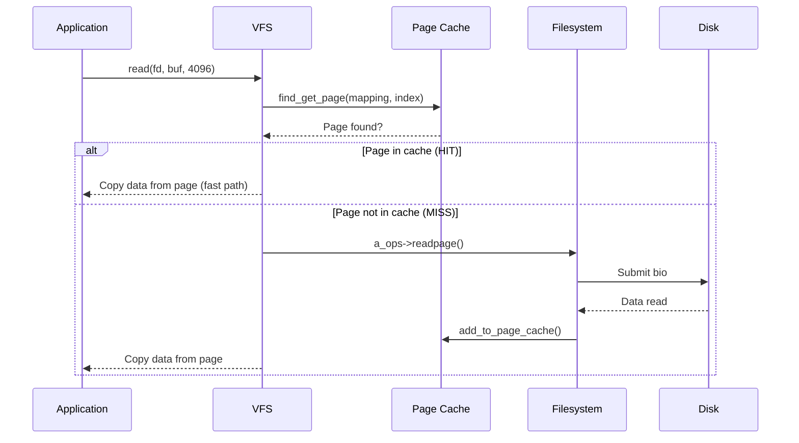

### 5.4 Write Path

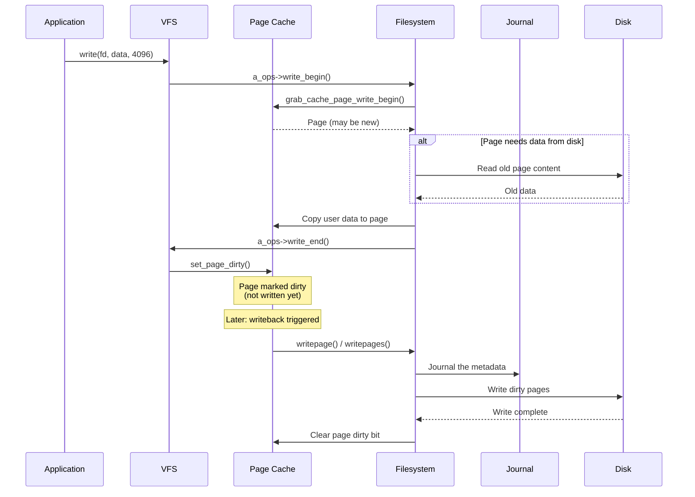

### 5.5 Writeback Triggers

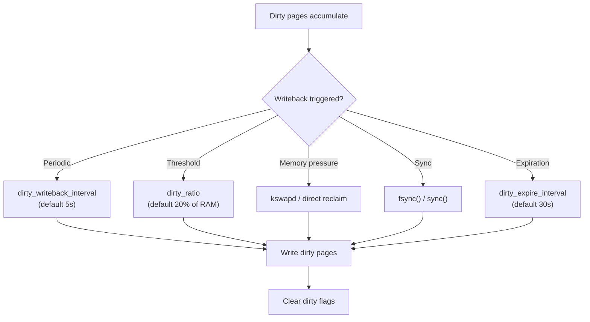

### 5.6 Writeback Tuning

```bash
# View current writeback settings
cat /proc/sys/vm/dirty_ratio
# 20

cat /proc/sys/vm/dirty_background_ratio
# 10

cat /proc/sys/vm/dirty_writeback_centisecs
# 500

cat /proc/sys/vm/dirty_expire_centisecs
# 3000

# Tune for different workloads
# For databases (low latency, frequent sync):
echo 5 > /proc/sys/vm/dirty_ratio
echo 2 > /proc/sys/vm/dirty_background_ratio
echo 100 > /proc/sys/vm/dirty_writeback_centisecs
echo 500 > /proc/sys/vm/dirty_expire_centisecs

# For throughput (batch writes):
echo 40 > /proc/sys/vm/dirty_ratio
echo 10 > /proc/sys/vm/dirty_background_ratio
echo 500 > /proc/sys/vm/dirty_writeback_centisecs
echo 3000 > /proc/sys/vm/dirty_expire_centisecs

# View current dirty page stats
grep -i dirty /proc/meminfo
# Dirty:           123456 kB
# Writeback:         1234 kB
# WritebackTmp:         0 kB
```

### 5.7 Readahead

```bash
# Linux performs readahead for sequential access
# Pre-reading data before it's requested

# View readahead settings per device
blockdev --getra /dev/sda
# 256 (sectors = 128KB)

# Set readahead
blockdev --setra 2048 /dev/sda
# 2048 sectors = 1MB readahead

# Or via udev rule
echo 'ACTION=="add", KERNEL=="sda", ATTR{queue/read_ahead_kb}="1024"' > \
    /etc/udev/rules.d/99-readahead.rules
```

## 6. Examples

### 6.1 Monitoring Inode Cache

```bash
# View inode cache statistics
cat /proc/sys/fs/inode-state
# 65536    3000    0       0       0       0       0
# ^total   ^free   ^nr_negative

# View inode cache pressure
cat /proc/sys/fs/inode-nr
# 50000    1500
# ^total   ^free

# High inode cache hit rate is good
# Low free count with high total = good caching

# Monitor with vmstat
vmstat 1
# procs -----memory----- ---swap-- -----io---- -system-- ----cpu----
#  r  b  swpd  free  buff  cache   si   so    bi    bo   in   cs  us sy id
#  1  0     0 1234M  56M  2048M    0    0     0     0  100  200   5  2 93
```

### 6.2 Monitoring Journal Activity

```bash
# View journal statistics (ext4)
cat /proc/fs/ext4/sdb1/journal_write
# Total journal writes: 123456
# Journal blocks written: 789012

# View journal inode
debugfs -R "stat <8>" /dev/sdb1

# Monitor journal with blktrace
blktrace -d /dev/sdb1 -o - | blkparse -i -
# Look for journal writes to understand commit patterns
```

### 6.3 Page Cache Monitoring

```bash
# View page cache statistics
cat /proc/meminfo | grep -i "cache\|dirty\|writeback"
# Buffers:          123456 kB
# Cached:          2048000 kB
# SwapCached:            0 kB
# Dirty:              1234 kB
# Writeback:             0 kB
# Cached: refers to page cache

# Per-file page cache information
cat /proc/PID/smaps | grep -A5 "filename"

# View cached files (pcstat)
# Install: go install github.com/tobert/pcstat@latest
pcstat /var/lib/mysql/ibdata1
# |---------------------+----------------+------------+-----------+---------|
# | Name                | Size           | Pages      | Cached    | Percent |
# |---------------------+----------------+------------+-----------+---------|
# | /var/lib/mysql/ibdata1 | 78643200    | 19200      | 19200     | 100.00  |

# Drop page cache (testing)
echo 1 > /proc/sys/vm/drop_caches  # Drop page cache
echo 2 > /proc/sys/vm/drop_caches  # Drop dentries and inodes
echo 3 > /proc/sys/vm/drop_caches  # Drop all
```

### 6.4 Filesystem Consistency Testing

```bash
#!/bin/bash
# Test journal recovery

# Create test filesystem
dd if=/dev/zero of=/tmp/test.img bs=1M count=100
mkfs.ext4 -O journal_dev /tmp/test.img

# Create flakey device (fails writes after N operations)
dmsetup create flakey --table "0 204800 flakey /dev/loop0 0 100"

# Mount and write
mount /dev/mapper/flakey /mnt/test
dd if=/dev/zero of=/mnt/test/data bs=1M count=50

# Simulate crash (device fails)
dmsetup suspend flakey
umount -f /mnt/test

# Remount — journal should recover
mount /dev/loop0 /mnt/test-recovery
# ext4 replay: journal recovered
```

## 7. Performance

### 7.1 Page Cache Hit Rate

```bash
# Monitor cache hit rate
cachestat  # BPF tool
# HITS   MISSES  DIRTIES  READ_HIT%  WRITE_HIT%
# 12345  100     50       99.2       95.3

# High hit rate = good performance
# Low hit rate = need more RAM or better access patterns
```

### 7.2 Journal Performance Impact

```
Journal mode performance impact (4K random writes):

data=journal:    5,000-12,000 IOPS (every byte journaled)
data=ordered:    15,000-25,000 IOPS (metadata only)
data=writeback:  20,000-35,000 IOPS (metadata, no ordering)

# Ordered is the best balance for most workloads
```

### 7.3 Writeback Tuning Impact

```bash
# Test with different dirty ratios
for ratio in 5 10 20 40; do
    echo $ratio > /proc/sys/vm/dirty_ratio
    fio --name=test --ioengine=libaio --direct=0 --bs=4k \
        --size=1G --numjobs=4 --rw=randwrite --runtime=30
done

# Lower dirty_ratio: more frequent writeback, lower latency
# Higher dirty_ratio: batched writes, higher throughput
```

## 8. Common Pitfalls

### 8.1 Inode Exhaustion

```bash
# Running out of inodes while having free space
df -i /dev/sdb1
# Filesystem     Inodes  IUsed  IFree IUse% Mounted on
# /dev/sdb1      65536  65536      0  100% /mnt

# Prevention: use appropriate inode ratio
mkfs.ext4 -i 4096 /dev/sdb1  # One inode per 4KB
# Cannot change after creation!
```

### 8.2 Journal Bottleneck

```bash
# Journal can be a bottleneck for metadata-heavy workloads

# Solution: place journal on fast device
mke2fs -O journal_dev /dev/nvme0n1
mkfs.ext4 -J device=/dev/nvme0n1 /dev/sdb1

# Or use external journal
mkfs.ext4 -J device=/dev/nvme0n1,size=512 /dev/sdb1
```

### 8.3 Page Cache Memory Pressure

```bash
# Page cache can consume most of RAM
# This is usually GOOD (unused RAM is wasted RAM)

# But if applications need memory, cache is reclaimed
# Monitor with vmstat

# Force cache drop (testing only!)
echo 3 > /proc/sys/vm/drop_caches
```

### 8.4 Dirty Page Explosion

```bash
# Too many dirty pages = write stall when writeback starts

# Monitor
cat /proc/meminfo | grep Dirty

# Fix: lower dirty_ratio
echo 5 > /proc/sys/vm/dirty_ratio
```

### 8.5 fsync Performance

```bash
# fsync() forces data AND metadata to disk
# Can be very slow on HDDs (multiple seeks)

# Use fdatasync() instead (doesn't flush metadata unless needed)
# Use O_DSYNC for per-write sync
# Consider barriers=off for battery-backed write cache
```

## 9. Best Practices

1. **Use data=ordered journal mode.** It prevents stale data exposure with minimal performance impact.

2. **Monitor inode usage.** Check `df -i` regularly, especially on filesystems with many small files.

3. **Tune writeback for your workload.** Lower `dirty_ratio` for latency-sensitive applications.

4. **Use fdatasync() over fsync().** It's faster when you don't need metadata flushed.

5. **Understand page cache behavior.** The page cache is your friend — don't drop it unnecessarily.

6. **Place journals on fast devices.** External journals on NVMe can dramatically improve metadata performance.

7. **Use O_DIRECT for databases.** It bypasses the page cache for direct disk access.

8. **Monitor writeback latency.** Use `iostat` and `biolatency` to detect writeback stalls.

9. **Size journal appropriately.** Larger journals handle bursty metadata workloads better.

10. **Test crash recovery.** Verify that your journal configuration actually recovers data after crashes.

## 10. Exercises

### Exercise 1: Inode Lifecycle
Create a file, observe its inode number, create hard links, delete the original, and verify the inode persists until all references are removed. Use `stat` and `ls -i`.

### Exercise 2: Journal Mode Comparison
Create three ext4 filesystems with different journal modes. Run `fio` random write benchmarks. Then simulate a crash using `dmsetup flakey` and verify data consistency in each mode.

### Exercise 3: Page Cache Monitoring
Write a program that reads a large file. Monitor page cache growth using `/proc/meminfo` and `pcstat`. Drop the cache and observe the performance impact of re-reading.

### Exercise 4: Writeback Tuning
Experiment with different `dirty_ratio` and `dirty_writeback_centisecs` values. Use `fio` to measure the impact on write latency and throughput.

### Exercise 5: Journal Recovery
Use `dmsetup` to create a device that fails writes at a specific point. Write data, force a crash, and verify that the journal correctly recovers the filesystem.

## 11. References

1. **Kernel documentation** — `Documentation/filesystems/ext4/journal.rst`
2. **Kernel documentation** — `Documentation/admin-guide/sysctl/vm.rst`
3. **Linux kernel source** — `fs/inode.c`, `fs/jbd2/`, `mm/filemap.c`, `mm/page-writeback.c`
4. *Understanding the Linux Kernel*, Bovet & Cesati — Chapters 15, 17
5. *Linux Kernel Development*, Robert Love — Chapter 15 (Page Cache)
6. **man pages** — `fsync(2)`, `fdatasync(2)`, `sync(2)`, `mount(8)`
7. **LWN articles** — "A new approach to writeback", "The page cache"
8. **USENIX paper** — *Journaling the Linux ext2fs Filesystem*, Stephen Tweedie
