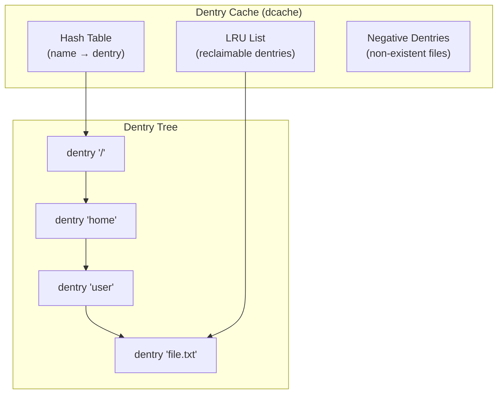
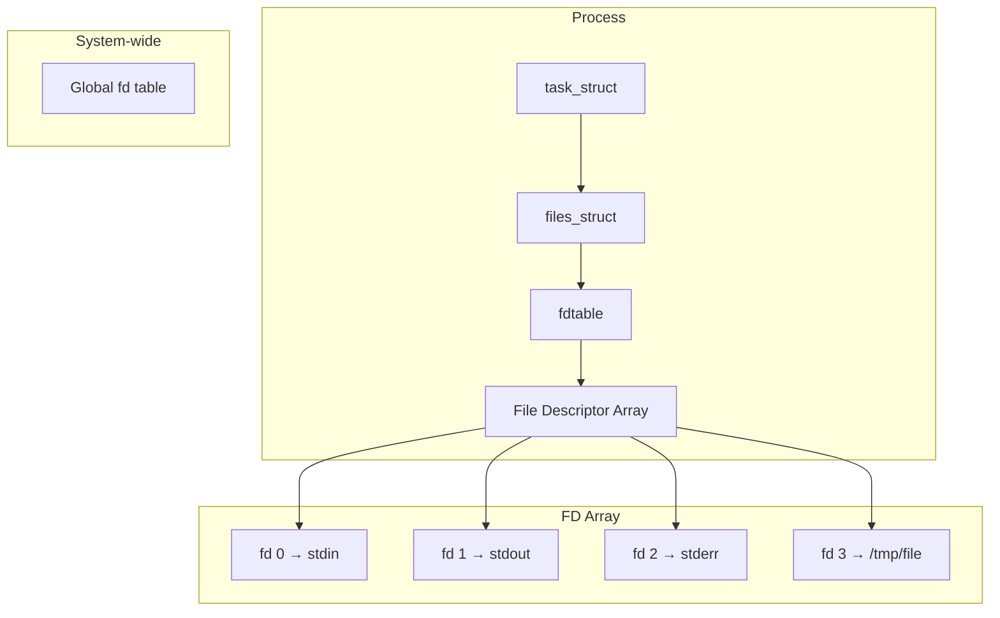
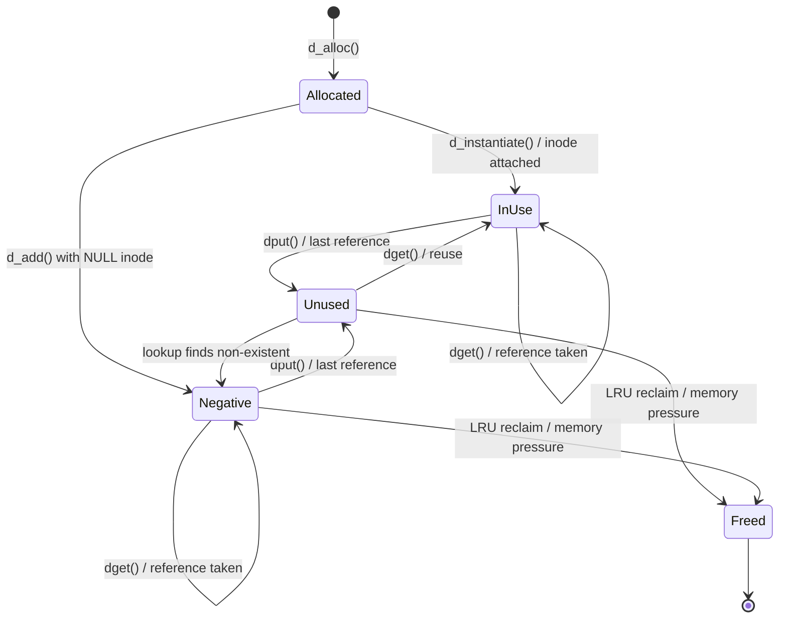
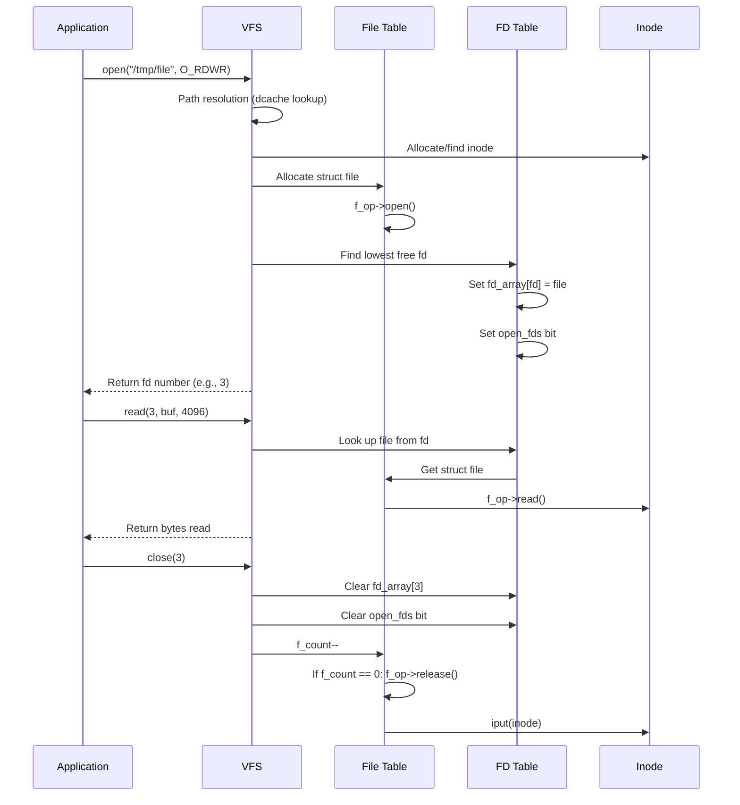

# Chapter 80: Dentries and File Descriptors

## 1. Intuition

Every time you type a filename in the terminal, two critical data structures come into play. The dentry cache translates path names to inodes — it's the phone book of the filesystem. The file descriptor table maps integers to open files — it's how your process keeps track of what it's reading and writing.

The dentry cache (dcache) is one of Linux's most heavily optimized structures. Every `open()`, `stat()`, and `access()` call goes through it. When you `ls /usr/bin/`, the dcache makes subsequent lookups nearly free. File descriptors are the fundamental I/O abstraction — `stdin` (0), `stdout` (1), and `stderr` (2) are just file descriptors. Understanding these two structures is essential for system programming, performance tuning, and debugging.

## 2. Architecture

### 2.1 Dentry Cache



### 2.2 File Descriptor Table



## 3. Source Code References

| File | Purpose |
|------|---------|
| `include/linux/dcache.h` | Dentry data structures |
| `fs/dcache.c` | Dentry cache implementation |
| `fs/namei.c` | Path lookup (uses dcache) |
| `include/linux/fs.h` | File and file descriptor structures |
| `fs/file_table.c` | File table management |
| `include/linux/fdtable.h` | File descriptor table structures |
| `fs/file.c` | File descriptor operations |
| `fs/open.c` | open() system call |
| `fs/read_write.c` | read()/write() system calls |
| `include/linux/fs_struct.h` | FS info per-process (root, pwd) |

## 4. Dentries In-Depth

### 4.1 Dentry Structure

```c
struct dentry {
    unsigned int                d_flags;       /* dentry flags */
    seqcount_spinlock_t         d_seq;         /* per-dentry seqlock */
    struct hlist_bl_node        d_hash;        /* hash list node */
    struct dentry               *d_parent;     /* parent directory */
    struct qstr                 d_name;        /* name (hash, len, name) */
    struct inode                *d_inode;      /* associated inode */

    /* Short name stored inline */
    unsigned char               d_iname[DNAME_INLINE_LEN]; /* 32 bytes */

    struct lockref              d_lockref;     /* lock + refcount */
    const struct dentry_operations *d_op;      /* dentry operations */
    struct super_block          *d_sb;         /* owning superblock */
    unsigned long               d_time;        /* revalidate time */
    void                        *d_fsdata;     /* filesystem-specific */

    union {
        struct list_head        d_lru;         /* LRU list */
        wait_queue_head_t       *d_wait;       /* in-lookup waiters */
    };
    struct hlist_node           d_sib;         /* sibling list */
    struct hlist_head           d_children;    /* child dentries */
    /* ... */
};

struct qstr {
    union {
        struct {
            HASH_LEN_DECLARE;
        };
        u64 hash_len;
    };
    const unsigned char *name;
};
```

### 4.2 Dentry Flags

```c
#define DCACHE_OP_HASH          (1 << 0)  /* d_hash defined */
#define DCACHE_OP_COMPARE       (1 << 1)  /* d_compare defined */
#define DCACHE_OP_DELETE        (1 << 3)  /* d_delete defined */
#define DCACHE_OP_PRUNE         (1 << 4)  /* d_prune defined */
#define DCACHE_ENTRY_TYPE       (0xF << 8) /* entry type mask */
#define DCACHE_MISS_TYPE        (0 << 8)   /* negative dentry */
#define DCACHE_WHITEOUT_TYPE    (1 << 8)   /* whiteout dentry */
#define DCACHE_DIRECTORY_TYPE   (2 << 8)   /* directory */
#define DCACHE_AUTODIR_TYPE     (3 << 8)   /* autodir */
#define DCACHE_REGULAR_TYPE     (4 << 8)   /* regular file */
#define DCACHE_SPECIAL_TYPE     (5 << 8)   /* special (device) */
#define DCACHE_SYMLINK_TYPE     (6 << 8)   /* symlink */

#define DCACHE_PAR_LOOKUP       (1 << 16)  /* parallel lookup in progress */
#define DCACHE_DONTCACHE        (1 << 26)  /* don't cache on eviction */
#define DCACHE_NFSFS_RENAMED    (1 << 29)  /* NFS renamed */
#define DCACHE_DISCONNECTED     (1 << 30)  /* disconnected from tree */
```

### 4.3 Dentry Hash Table

```c
/* Hash table implementation */
#define D_HASHBITS  d_hash_shift
#define D_HASHMASK  d_hash_mask

static struct hlist_bl_head *dentry_hashtable;
static unsigned int d_hash_shift;

/* Hash function for dentry names */
static inline unsigned long dentry_hash(struct dentry *parent,
                                         struct qstr *name)
{
    unsigned long hash;

    hash = init_name_hash(parent);
    hash = partial_name_hash(tolower(name->name[0]), hash);
    /* ... hash the rest of the name ... */
    hash = end_name_hash(hash);

    return hash & D_HASHMASK;
}

/* Hash lookup */
static struct dentry *__d_lookup_rcu(const struct dentry *parent,
                                      struct qstr *name,
                                      unsigned *seqp)
{
    unsigned int hash = dentry_hash(parent, name);
    struct hlist_bl_head *b = dentry_hashtable + hash;
    struct hlist_bl_node *node;
    struct dentry *dentry;

    hlist_bl_for_each_entry_rcu(dentry, node, b, d_hash) {
        if (dentry->d_name.hash != hash)
            continue;
        if (dentry->d_parent != parent)
            continue;
        if (dentry->d_name.len != name->len)
            continue;
        /* Slow path: full name comparison */
        if (dentry->d_op && dentry->d_op->d_compare) {
            if (dentry->d_op->d_compare(parent, dentry, name))
                continue;
        } else {
            if (memcmp(dentry->d_name.name, name->name, name->len))
                continue;
        }
        *seqp = read_seqcount_begin(&dentry->d_seq);
        return dentry;
    }
    return NULL;
}
```

### 4.4 Dentry Operations

```c
struct dentry_operations {
    int (*d_revalidate)(struct dentry *, unsigned int);
    int (*d_weak_revalidate)(struct dentry *, unsigned int);
    int (*d_hash)(const struct dentry *, struct qstr *);
    int (*d_compare)(const struct dentry *, unsigned int,
                     const char *, const struct qstr *);
    int (*d_delete)(const struct dentry *);
    int (*d_init)(struct dentry *);
    void (*d_release)(struct dentry *);
    void (*d_iput)(struct dentry *, struct inode *);
    char *(*d_dname)(struct dentry *, char *, int);
    struct vfsmount *(*d_automount)(struct path *);
    int (*d_manage)(const struct path *, bool);
    struct dentry *(*d_real)(struct dentry *, const struct inode *);
};
```

### 4.5 Dentry States



### 4.6 Negative Dentries

```bash
# Negative dentries cache "file not found" lookups
# This speeds up repeated lookups of non-existent files

# Example:
ls /tmp/nonexistent  # Creates negative dentry
ls /tmp/nonexistent  # Cached "not found" — no disk I/O

# Negative dentries are reclaimed under memory pressure
# They can be a problem if you're testing for many non-existent files
```

### 4.7 Dentry Cache Statistics

```bash
# View dentry cache statistics
cat /proc/slabinfo | grep dentry
# dentry            128456  130020    192   21    1 : tunables ...

# Fields:
# 128456: active objects
# 130020: total objects
# 192: object size
# 21: objects per slab

# View cache pressure
cat /proc/sys/fs/vfs_cache_pressure
# 100 (default: equal reclaim of dentries/inodes vs page cache)

# Lower = keep more dentries in cache
echo 50 > /proc/sys/fs/vfs_cache_pressure

# Higher = reclaim dentries more aggressively
echo 200 > /proc/sys/fs/vfs_cache_pressure
```

### 4.8 Dentry Operations Examples

```bash
# Case-insensitive filesystems (FAT, NTFS)
# d_compare converts both names to lowercase before comparison

# Case-sensitive (ext4, XFS)
# d_compare does direct memcmp

# View dentry operations for a mounted filesystem
# (Requires kernel debugging tools)
```

## 5. File Descriptors In-Depth

### 5.1 Data Structures

```c
/* Per-process file descriptor table */
struct files_struct {
    atomic_t count;             /* reference count */
    struct fdtable __rcu *fdt;  /* current fd table */
    struct fdtable fdtab;       /* embedded fd table */

    spinlock_t file_lock;
    unsigned int next_fd;       /* next free fd */
    unsigned long close_on_exec_init[1]; /* close-on-exec bitmap */
    unsigned long open_fds_init[1];      /* open fds bitmap */
    unsigned long full_fds_bits_init[1]; /* full fds bitmap */
    struct file __rcu *fd_array[NR_OPEN_DEFAULT]; /* fd array */
};

/* File descriptor table */
struct fdtable {
    unsigned int max_fds;       /* max file descriptors */
    struct file __rcu **fd;     /* file pointer array */
    unsigned long *close_on_exec; /* close-on-exec bitmap */
    unsigned long *open_fds;    /* open fds bitmap */
    unsigned long *full_fds_bits;
    struct rcu_head rcu;
};

/* Open file representation */
struct file {
    struct path             f_path;       /* path (vfsmount + dentry) */
    struct inode            *f_inode;     /* cached inode */
    const struct file_operations *f_op;   /* file operations */

    spinlock_t              f_lock;
    atomic_long_t           f_count;      /* reference count */
    unsigned int            f_flags;      /* O_RDONLY, O_NONBLOCK, etc. */
    fmode_t                 f_mode;       /* FMODE_READ, FMODE_WRITE */
    loff_t                  f_pos;        /* current file offset */
    struct fown_struct      f_owner;      /* owner for SIGIO */
    void                    *private_data; /* filesystem-specific */
    struct address_space    *f_mapping;   /* page cache mapping */
    /* ... */
};

/* Per-process filesystem info */
struct fs_struct {
    int users;
    spinlock_t lock;
    seqcount_t seq;
    int umask;
    int in_exec;
    struct path root;           /* root directory */
    struct path pwd;            /* current working directory */
};
```

### 5.2 File Descriptor Lifecycle



### 5.3 File Descriptor Flags

```c
/* File descriptor flags (per-fd) */
#define FD_CLOEXEC  1   /* Close on exec */

/* File flags (per-file, shared across dup'd fds) */
#define O_RDONLY    00000000
#define O_WRONLY    00000001
#define O_RDWR      00000002
#define O_CREAT     00000100
#define O_EXCL      00000200
#define O_TRUNC     00001000
#define O_APPEND    00002000
#define O_NONBLOCK  00004000
#define O_DSYNC     00010000
#define O_DIRECT    00040000
#define O_LARGEFILE 00100000
#define O_NOATIME   01000000
#define O_CLOEXEC   02000000
#define O_SYNC      04000000
#define O_PATH     010000000
```

### 5.4 File Descriptor Duplication

```c
/* dup() and dup2() implementation */
static int __x64_sys_dup2(struct pt_regs *regs)
{
    unsigned int oldfd = regs->di;
    unsigned int newfd = regs->si;
    return ksys_dup3(oldfd, newfd, 0);
}

static int ksys_dup3(unsigned int oldfd, unsigned int newfd, int flags)
{
    struct fd old = fdget(oldfd);
    struct file *newfile;

    if (!old.file)
        return -EBADF;

    /* Allocate new fd */
    newfile = fget(oldfd);
    if (!newfile)
        return -EBADF;

    /* Install at specific fd number */
    return __fd_install(current->files, newfd, newfile);
}
```

### 5.5 Close-on-Exec

```bash
# Close-on-exec flag prevents fd inheritance across exec()

# Set close-on-exec
fcntl(fd, F_SETFD, FD_CLOEXEC);

# Or at open time
fd = open(path, O_RDONLY | O_CLOEXEC);

# View close-on-exec status
ls -la /proc/$$/fd/
# Note: no direct way to see CLOEXEC flag

# View with /proc/PID/fdinfo
cat /proc/$$/fdinfo/0
# pos:    0
# flags:  0100000
# ^ O_RDONLY

cat /proc/$$/fdinfo/3
# pos:    0
# flags:  0200002
# ^ O_RDWR | O_CLOEXEC
```

## 6. /proc/PID/fd and /proc/PID/fdinfo

### 6.1 Inspecting File Descriptors

```bash
# List open file descriptors
ls -la /proc/$$/fd/
# lrwx------ 1 user user 64 Jun 29 10:00 0 -> /dev/pts/0
# lrwx------ 1 user user 64 Jun 29 10:00 1 -> /dev/pts/0
# lrwx------ 1 user user 64 Jun 29 10:00 2 -> /dev/pts/0
# lrwx------ 1 user user 64 Jun 29 10:00 3 -> /tmp/test.txt

# View fd details
cat /proc/$$/fdinfo/0
# pos:    0
# flags:  0100000
# mnt_id: 23

# pos:    Current file offset
# flags:  File status flags (O_*)
# mnt_id: Mount ID

# View file descriptor count
cat /proc/$$/limits | grep "open files"
# Max open files            1024                 1048576              files

# Increase limit
ulimit -n 65536
# Or permanently in /etc/security/limits.conf
# user  soft  nofile  65536
# user  hard  nofile  1048576
```

### 6.2 File Descriptor Inheritance

```bash
# File descriptors are inherited across fork()
# Unless FD_CLOEXEC is set (cleared on exec)

# Example: pipe between parent and child
# Parent creates pipe: fd[0] (read), fd[1] (write)
# Fork: child inherits both fds
# Child closes fd[0], writes to fd[1]
# Parent closes fd[1], reads from fd[0]

# View inherited fds
ls -la /proc/$$/fd/
# After exec, only non-CLOEXEC fds survive
```

### 6.3 Special File Descriptors

```bash
# /proc/self/fd/ directory contains symlinks to open files
# fd 0: stdin
# fd 1: stdout
# fd 2: stderr

# Useful for:
# 1. Finding what files a process has open
lsof -p $$

# 2. Finding deleted files still held open
ls -la /proc/*/fd/ 2>/dev/null | grep deleted

# 3. Sending file descriptors over Unix sockets
# (SCM_RIGHTS)

# 4. Opening files by fd
cat /proc/self/fd/3  # Read from fd 3
```

## 7. Examples

### 7.1 Dentry Cache Investigation

```bash
#!/bin/bash
# Investigate dentry cache behavior

# Clear dcache (testing)
echo 2 > /proc/sys/vm/drop_caches

# Record initial dentry count
BEFORE=$(grep dentry /proc/slabinfo | awk '{print $2}')

# Perform many lookups
find /usr -type f > /dev/null 2>&1

# Record after lookups
AFTER=$(grep dentry /proc/slabinfo | awk '{print $2}')

echo "Dentries before: $BEFORE"
echo "Dentries after:  $AFTER"
echo "Growth: $((AFTER - BEFORE))"
```

### 7.2 File Descriptor Leak Detection

```bash
#!/bin/bash
# Find processes with many open files

for pid in /proc/[0-9]*; do
    name=$(cat "$pid/comm" 2>/dev/null)
    count=$(ls "$pid/fd" 2>/dev/null | wc -l)
    if [ "$count" -gt 100 ]; then
        echo "$name (PID ${pid##*/}): $count open files"
    fi
done
```

### 7.3 Dentry Operations in Code

```c
#include <linux/dcache.h>
#include <linux/fs.h>

/* Custom dentry operations for case-insensitive filesystem */
static int myfs_d_compare(const struct dentry *dentry,
                          unsigned int len,
                          const char *str,
                          const struct qstr *name)
{
    /* Case-insensitive comparison */
    return strncasecmp(str, name->name, len);
}

static int myfs_d_hash(const struct dentry *dentry,
                       struct qstr *name)
{
    /* Case-insensitive hash */
    unsigned long hash = init_name_hash(dentry);
    const unsigned char *p = name->name;
    int i;

    for (i = 0; i < name->len; i++)
        hash = partial_name_hash(tolower(*p++), hash);

    name->hash = end_name_hash(hash);
    return 0;
}

static const struct dentry_operations myfs_dentry_ops = {
    .d_hash    = myfs_d_hash,
    .d_compare = myfs_d_compare,
};
```

### 7.4 File Descriptor Manipulation

```c
#include <unistd.h>
#include <fcntl.h>
#include <stdio.h>
#include <stdlib.h>

int main(void)
{
    int fd1, fd2, fd3;

    /* Open a file */
    fd1 = open("/tmp/test.txt", O_RDWR | O_CREAT, 0644);
    printf("fd1 = %d\n", fd1);  /* Usually 3 */

    /* Duplicate fd */
    fd2 = dup(fd1);
    printf("fd2 = %d\n", fd2);  /* Usually 4 */

    /* Duplicate to specific fd */
    fd3 = dup2(fd1, 10);
    printf("fd3 = %d\n", fd3);  /* 10 */

    /* Set close-on-exec */
    fcntl(fd1, F_SETFD, FD_CLOEXEC);

    /* Get fd flags */
    int flags = fcntl(fd2, F_GETFD);
    printf("fd2 flags: %d\n", flags);

    /* Get file flags */
    int file_flags = fcntl(fd2, F_GETFL);
    printf("fd2 file flags: %d\n", file_flags);

    /* Set non-blocking */
    fcntl(fd2, F_SETFL, O_NONBLOCK);

    /* Close */
    close(fd1);
    close(fd2);
    close(fd3);

    return 0;
}
```

### 7.5 Monitoring File Descriptors

```bash
# View system-wide fd usage
cat /proc/sys/fs/file-nr
# 9216    0    9223372036854775807
# ^used   ^free  ^max

# View per-process fd limits
cat /proc/$$/limits | grep "open files"

# View fd table size
cat /proc/$$/status | grep FDSize
# FDSize: 256

# Monitor with inotifywait (for fd-related events)
inotifywait -m /proc/$$/fd/
```

## 8. Performance

### 8.1 Dentry Cache Performance

```
Path lookup performance:

Cached (dcache hit):    < 1µs
Uncached (disk read):   100-1000µs

# The dcache is critical for performance
# Most operations hit the cache after initial access

# Benchmark path lookup
strace -e trace=openat -c ls -la /usr/bin/ 2>&1 | tail -5
```

### 8.2 File Descriptor Table Resizing

```bash
# FD table starts small (NR_OPEN_DEFAULT = 64)
# Grows when more fds are needed

# fdtable allocation:
# - Initial: embedded in files_struct
# - Beyond 64: separate allocation (fd array)
# - Beyond 1024: separate bitmap allocation

# View fd table size
cat /proc/$$/status | grep FDSize
```

### 8.3 Cache Pressure Tuning

```bash
# vfs_cache_pressure controls dentry/inode reclaim
# 100 = balanced (default)
# 0   = never reclaim (dangerous, can OOM)
# 200 = reclaim aggressively

# For file servers (many paths):
echo 50 > /proc/sys/fs/vfs_cache_pressure

# For memory-constrained systems:
echo 200 > /proc/sys/fs/vfs_cache_pressure
```

## 9. Common Pitfalls

### 9.1 File Descriptor Exhaustion

```bash
# Too many open files
# Error: "Too many open files" (EMFILE)

# Check limits
ulimit -n

# Increase limit
ulimit -n 65536

# Or in /etc/security/limits.conf
# user soft nofile 65536
# user hard nofile 65536

# Check system-wide limit
cat /proc/sys/fs/file-max
```

### 9.2 Dentry Cache Bloat

```bash
# Dentry cache can grow very large
# Each dentry is ~192 bytes

# View cache size
grep dentry /proc/slabinfo | awk '{print $2 * 192 " bytes"}'

# Reclaim with cache pressure
echo 300 > /proc/sys/fs/vfs_cache_pressure

# Or drop caches (testing)
echo 2 > /proc/sys/vm/drop_caches
```

### 9.3 Close-on-Exec Race

```bash
# Without O_CLOEXEC, there's a race between open() and exec()
# Another thread could fork() and inherit the fd

# Wrong:
fd = open(path, O_RDONLY);
fcntl(fd, F_SETFD, FD_CLOEXEC);  /* Race window! */

# Right:
fd = open(path, O_RDONLY | O_CLOEXEC);
```

### 9.4 File Descriptor Leaks

```bash
# Common: opening files without closing them
# Each leak consumes memory and a fd slot

# Detection:
lsof -p PID | wc -l

# Find leaked fds
ls -la /proc/PID/fd/ | grep deleted
# deleted files still held open
```

### 9.5 Dentry Revalidation

```bash
# Network filesystems need dentry revalidation
# Cached dentries may become stale

# NFS revalidation:
# - Check attribute cache timeout (actimeo)
# - If expired, revalidate from server

# CIFS revalidation:
# - Similar to NFS
# - Can be forced with "cache=strict"
```

### 9.6 Negative Dentry Cache Poisoning

```bash
# Negative dentries cache "file not found"
# If the file appears later (e.g., NFS server update),
# the negative dentry may prevent detection

# Fix: reduce dentry revalidation timeout
# Or use "noac" mount option (NFS)
```

## 10. Best Practices

1. **Use O_CLOEXEC.** Always set close-on-exec at open time, not after.

2. **Check fd limits.** Monitor `/proc/sys/fs/file-nr` and adjust `ulimit -n` as needed.

3. **Tune vfs_cache_pressure.** Lower it for file servers, higher for memory-constrained systems.

4. **Monitor dentry cache.** Use `/proc/slabinfo` to track dentry cache size.

5. **Close file descriptors promptly.** Don't rely on process exit to clean up.

6. **Use dup2() over dup()** when you need a specific fd number.

7. **Understand fd inheritance.** Forked processes inherit open file descriptors.

8. **Use /proc/PID/fd for debugging.** It's invaluable for diagnosing file descriptor issues.

9. **Revalidate dentries on network filesystems.** Set appropriate timeouts for your use case.

10. **Design for cache friendliness.** Access files in patterns that benefit from dentry caching.

## 11. Exercises

### Exercise 1: Dentry Cache Experiment
Create 10,000 files in a directory. Measure dentry cache growth. Then delete them and observe that negative dentries remain. Verify by looking up a deleted file name and checking that no disk I/O occurs.

### Exercise 2: File Descriptor Inheritance
Write a C program that opens a file, forks, and demonstrates that the child inherits the file descriptor. Then add O_CLOEXEC and verify that the fd is closed in the child after exec.

### Exercise 3: Path Lookup Performance
Write a benchmark that measures path lookup time for cached vs. uncached paths. Use `open()` on the same file repeatedly and compare with `open()` on different files.

### Exercise 4: File Descriptor Leak Detection
Write a script that monitors a process and detects file descriptor leaks. Track fd count over time and alert if it exceeds a threshold.

### Exercise 5: Dentry Cache Pressure
Experiment with different `vfs_cache_pressure` values. Use a workload that creates many files and measure the impact on path lookup performance and memory usage.

## 12. References

1. **Kernel documentation** — `Documentation/filesystems/vfs.rst`
2. **Linux kernel source** — `fs/dcache.c`, `fs/namei.c`, `fs/file.c`, `fs/file_table.c`
3. *Understanding the Linux Kernel*, Bovet & Cesati — Chapter 12 (Dentry Cache)
4. *Linux Kernel Development*, Robert Love — Chapter 12 (VFS)
5. **man pages** — `open(2)`, `close(2)`, `dup(2)`, `fcntl(2)`, `proc(5)`
6. **LWN articles** — "A new approach to dcache locking", "Rethinking the dcache"
7. **man7.org** — https://man7.org/linux/man-pages/man2/open.2.html
8. **Kernel API documentation** — `Documentation/driver-api/` (relevant VFS sections)
