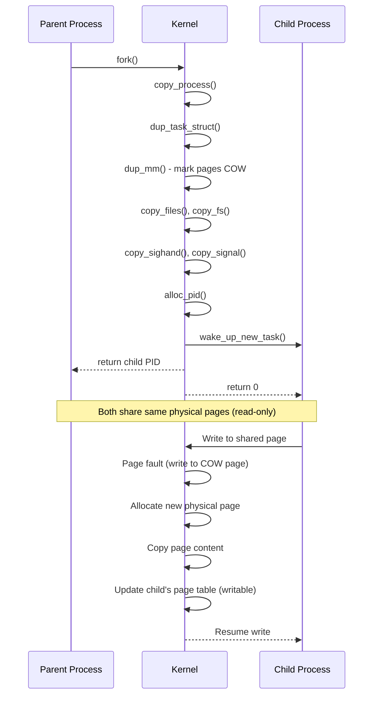
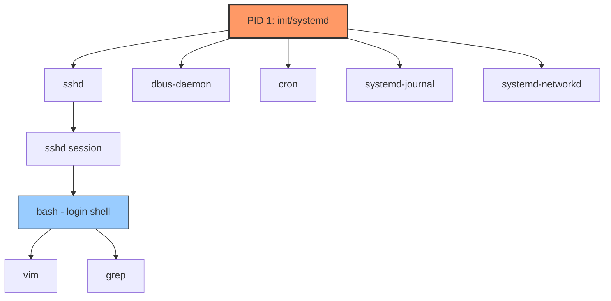
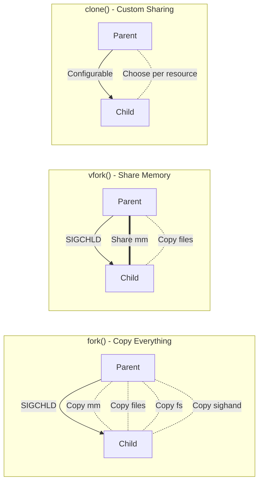
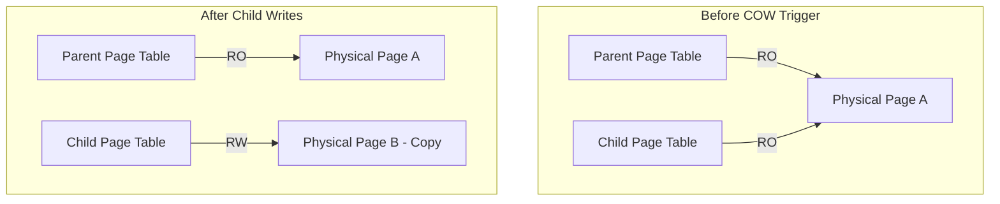

# Chapter 81: Process Creation — fork(), vfork(), clone(), clone3()

## 1. Intuition

When a Unix system boots, the kernel creates a single process — PID 1, traditionally `init` (or `systemd` on modern systems). From that single ancestor, every other process on the system is born through a simple yet profound mechanism: **forking**. The `fork()` system call creates a near-identical copy of the calling process, and from there, the child can transform into something entirely different via `exec()`.

This design philosophy — "create a copy, then specialize" — is elegant in its simplicity. Rather than requiring complex process templates or configuration structures, Unix lets any running process spawn a child that inherits its memory, file descriptors, signal handlers, and execution state. The child then typically calls `exec()` to replace itself with a new program.

Understanding process creation is fundamental to understanding Linux. Every command you type, every daemon that runs, every container that starts — all begin with a fork.

## 2. Architecture

### 2.1 The Process Creation Family

Linux provides several system calls for creating processes, each with different trade-offs:

| System Call | Description | Introduced |
|-------------|-------------|------------|
| `fork()` | Full copy of parent process | Original Unix |
| `vfork()` | Shared memory, parent suspended | BSD, for exec optimization |
| `clone()` | Fine-grained control over sharing | Linux 2.0 |
| `clone3()` | Extended clone with structured args | Linux 5.3 |

### 2.2 High-Level Flow

```
Parent Process
    │
    ├── fork() / clone() called
    │       │
    │       ├── Kernel allocates new task_struct
    │       ├── Copies/shares mm_struct, files, fs, signals, etc.
    │       ├── Sets up child kernel stack
    │       ├── Returns 0 to child (in child's context)
    │       └── Returns child PID to parent
    │
    ├── Child calls execve()
    │       │
    │       ├── Kernel loads new ELF binary
    │       ├── Replaces mm_struct (new address space)
    │       └── Transfers control to new program entry point
    │
    └── Both processes continue independently
```

### 2.3 Copy-on-Write (COW) Strategy

The key optimization that makes `fork()` practical is **Copy-on-Write**. Rather than immediately duplicating all memory pages, the kernel marks both parent and child pages as read-only and shared. Only when one process attempts to write to a page does the kernel create a private copy.

This means `fork()` is relatively cheap when followed by `exec()` — which is the most common pattern. The child doesn't modify most pages; it simply discards them when `exec()` replaces the address space.

## 3. Kernel Implementation

### 3.1 fork() Implementation

The `fork()` system call in Linux is implemented through `clone()` internally. The glibc wrapper for `fork()` calls `clone()` with flags that specify copying everything (no sharing):

```c
/* glibc/sysdeps/unix/sysv/linux/fork.c */
pid_t fork(void) {
    return clone(NULL, 0, 0, NULL, NULL, 0);
}
```

The actual kernel entry point is `kernel/fork.c`:

```c
/* kernel/fork.c - simplified */
SYSCALL_DEFINE0(fork) {
    return _do_fork(SIGCHLD, 0, 0, NULL, NULL, 0);
}
```

The `_do_fork()` function (later refactored to `kernel_clone()`) does the heavy lifting:

```c
/* kernel/fork.c - kernel_clone() simplified */
pid_t kernel_clone(struct kernel_clone_args *args) {
    u64 clone_flags = args->flags;
    struct task_struct *p;
    pid_t pid;

    /* Allocate new task_struct and kernel stack */
    p = copy_process(NULL, trace, NUMA_NO_NODE, args);

    /* Wake up the new process */
    wake_up_new_task(p);

    return pid_vnr(pid);  /* Return PID to parent */
}
```

### 3.2 copy_process() — The Heart of Process Creation

`copy_process()` is the core function that builds the new process. It performs the following major operations:

```c
/* kernel/fork.c - copy_process() simplified */
static struct task_struct *copy_process(struct pid *pid, ...) {
    struct task_struct *p;

    /* 1. Allocate task_struct */
    p = dup_task_struct(current, node);

    /* 2. Copy/check clone flags */
    /* Determines which resources to share vs. copy */

    /* 3. Copy credentials (uid, gid, capabilities) */
    copy_creds(p, clone_flags);

    /* 4. Copy or share mm_struct (memory descriptor) */
    if (clone_flags & CLONE_VM) {
        p->mm = current->mm;           /* Share */
        atomic_inc(&p->mm->mm_users);
    } else {
        p->mm = dup_mm(current->mm, p); /* Copy (COW) */
    }

    /* 5. Copy file descriptor table */
    if (clone_flags & CLONE_FILES) {
        p->files = current->files;
        atomic_inc(&p->files->count);
    } else {
        p->files = dup_fd(current->files, ...);
    }

    /* 6. Copy file system info (cwd, root) */
    copy_fs(clone_flags, p);

    /* 7. Copy signal handling */
    if (clone_flags & CLONE_THREAD) {
        p->sighand = current->sighand;  /* Share */
    } else {
        p->sighand = copy_sighand(current); /* Copy */
    }
    copy_signal(clone_flags, p);

    /* 8. Copy namespace info */
    copy_namespaces(clone_flags, p);

    /* 9. Allocate PID */
    pid = alloc_pid(p->nsproxy->pid_ns_for_children);

    /* 10. Set up child's return state */
    p->pid = pid_nr(pid);
    p->exit_signal = args->exit_signal;

    return p;
}
```

### 3.3 dup_task_struct() — Duplicating the Task

```c
/* kernel/fork.c */
static struct task_struct *dup_task_struct(struct task_struct *orig, int node) {
    struct task_struct *tsk;
    struct thread_info *ti;

    /* Allocate task_struct */
    tsk = alloc_task_struct_node(node);

    /* Allocate kernel stack + thread_info */
    ti = alloc_thread_stack_node(tsk, node);

    /* Copy the task_struct fields */
    *tsk = *orig;

    tsk->stack = ti;
    tsk->thread_info = *ti;

    /* Reference counting, etc. */
    refcount_set(&tsk->usage, 1);

    return tsk;
}
```

### 3.4 dup_mm() — Copying the Address Space with COW

```c
/* kernel/fork.c */
static struct mm_struct *dup_mm(struct mm_struct *oldmm, struct task_struct *tsk) {
    struct mm_struct *mm;

    /* Allocate new mm_struct */
    mm = allocate_mm();

    /* Copy the mm_struct */
    memcpy(mm, oldmm, sizeof(*mm));

    /* Copy page tables — this is where COW happens */
    if (!dup_mmap(mm, oldmm))
        goto fail_nomem;

    return mm;
}
```

The COW magic happens in `dup_mmap()` → `copy_page_range()` → `copy_pte_range()`:

```c
/* mm/memory.c - copy_pte_range() simplified */
static int copy_pte_range(struct mm_struct *dst_mm, struct mm_struct *src_mm,
                          pmd_t *dst_pmd, pmd_t *src_pmd, ...) {
    pte_t *src_pte, *dst_pte;

    dst_pte = pte_alloc_map(dst_mm, dst_pmd, addr);
    src_pte = pte_offset_map(src_pmd, addr);

    do {
        pte_t pte = *src_pte;

        if (pte_present(pte)) {
            /* Mark both pages as read-only for COW */
            ptep_set_wrprotect(src_mm, addr, src_pte);
            pte = pte_wrprotect(pte);
        }

        set_pte_at(dst_mm, addr, dst_pte, pte);
    } while (dst_pte++, src_pte++, addr += PAGE_SIZE, addr != end);

    return 0;
}
```

When either process later writes to a shared page, a page fault occurs, and the kernel allocates a private copy:

```c
/* mm/memory.c - do_wp_page() simplified */
static vm_fault_t do_wp_page(struct vm_fault *vmf) {
    struct page *old_page = vmf->page;

    if (page_count(old_page) == 1) {
        /* Only one reference — just make it writable */
        ptep_set_access_flags(vmf->vma, vmf->address, vmf->pte,
                              mk_pte(old_page, vmf->vma->vm_page_prot), 1);
    } else {
        /* Multiple references — copy the page */
        struct page *new_page = alloc_page_vma(GFP_HIGHUSER_MOVABLE, vmf->vma, vmf->address);
        copy_user_highpage(new_page, old_page, vmf->address, vmf->vma);
        /* Update page table to point to new page */
        flush_cache_page(vmf->vma, vmf->address, pte_pfn(*vmf->pte));
        ptep_clear_flush(vmf->vma, vmf->address, vmf->pte);
        set_pte_at(vmf->vma->mm, vmf->address, vmf->pte,
                   mk_pte(new_page, vmf->vma->vm_page_prot));
    }

    return 0;
}
```

### 3.5 vfork() Implementation

`vfork()` creates a child that shares the parent's address space entirely. The parent is suspended until the child either calls `exec()` or `_exit()`:

```c
/* kernel/fork.c */
SYSCALL_DEFINE0(vfork) {
    struct kernel_clone_args args = {
        .flags		= CLONE_VFORK | CLONE_VM | SIGCHLD,
        .exit_signal	= SIGCHLD,
    };
    return kernel_clone(&args);
}
```

`CLONE_VFORK` causes the parent to be put to sleep via `wait_for_vfork_done()`:

```c
/* kernel/fork.c */
static void wait_for_vfork_done(struct task_struct *child,
                                struct completion *vfork) {
    /* Put parent to sleep */
    freezer_do_not_count();
    cgroup_enter_frozen();
    wait_for_completion(vfork);
    cgroup_leave_frozen();
    freezer_count();
}
```

The child signals completion via `vfork_done` when it calls `exec()` or `_exit()`.

### 3.6 clone() Implementation

`clone()` gives fine-grained control over what is shared between parent and child:

```c
/* kernel/fork.c */
SYSCALL_DEFINE5(clone, unsigned long, clone_flags,
                unsigned long, newsp, int __user *, parent_tidptr,
                int __user *, child_tidptr, unsigned long, tls) {
    struct kernel_clone_args args = {
        .flags		= (lower_32_bits(clone_flags) & ~CSIGNAL),
        .exit_signal	= (lower_32_bits(clone_flags) & CSIGNAL),
        .stack		= newsp,
        .parent_tid	= parent_tidptr,
        .child_tid	= child_tidptr,
        .tls		= tls,
    };
    return kernel_clone(&args);
}
```

### 3.7 clone3() Implementation

`clone3()` uses a structured argument passed via a pointer:

```c
/* include/uapi/linux/sched.h */
struct clone_args {
    __aligned_u64 flags;        /* Flags bit mask */
    __aligned_u64 pidfd;        /* Where to store PID file descriptor */
    __aligned_u64 child_tid;    /* Where to store child TID */
    __aligned_u64 parent_tid;   /* Where to store parent TID */
    __aligned_u64 exit_signal;  /* Signal to deliver to parent on exit */
    __aligned_u64 stack;        /* Pointer to start of stack */
    __aligned_u64 stack_size;   /* Size of stack */
    __aligned_u64 tls;          /* Location of new TLS */
    __aligned_u64 set_tid;      /* Pointer to PID to assign */
    __aligned_u64 set_tid_size; /* Number of elements in set_tid */
    __aligned_u64 cgroup;       /* File descriptor for target cgroup */
    __aligned_u64 io_uring_flags;
};
```

```c
/* kernel/fork.c */
SYSCALL_DEFINE2(clone3, struct clone_args __user *, uargs, size_t, size) {
    struct kernel_clone_args kargs;
    /* Copy args from user space */
    copy_clone_args_from_user(&kargs, uargs, size);
    return kernel_clone(&kargs);
}
```

## 4. Source Code References

| File | Description |
|------|-------------|
| `kernel/fork.c` | Core process creation implementation |
| `mm/memory.c` | Page fault handling, COW implementation |
| `include/linux/sched.h` | `task_struct` definition |
| `kernel/sched/core.c` | `wake_up_new_task()` — scheduling new process |
| `mm/mmap.c` | Memory mapping management |
| `fs/exec.c` | `execve()` implementation (tied to fork) |
| `include/uapi/linux/sched.h` | Clone flags, `clone_args` |
| `include/linux/sched/task.h` | Task lifecycle declarations |

## 5. Data Structures

### 5.1 task_struct (Simplified)

```c
/* include/linux/sched.h - heavily simplified */
struct task_struct {
    /* Process state */
    unsigned int            __state;    /* TASK_RUNNING, TASK_STOPPED, etc. */

    /* Scheduling */
    int                     prio;       /* Dynamic priority */
    int                     static_prio; /* Nice-based priority */
    const struct sched_class *sched_class;
    struct sched_entity     se;
    struct sched_rt_entity  rt;
    struct sched_dl_entity  dl;

    /* Process relationships */
    struct task_struct      *parent;
    struct list_head        children;
    struct list_head        sibling;
    pid_t                   pid;        /* Process ID */
    pid_t                   tgid;       /* Thread group ID */

    /* Memory management */
    struct mm_struct        *mm;        /* Memory descriptor */
    struct mm_struct        *active_mm;

    /* File system */
    struct fs_struct        *fs;        /* cwd, root */

    /* Open files */
    struct files_struct     *files;

    /* Signal handling */
    struct signal_struct    *signal;
    struct sighand_struct   *sighand;
    sigset_t                blocked;
    struct sigpending       pending;

    /* Credentials */
    const struct cred       *cred;
    const struct cred       *real_cred;

    /* Namespaces */
    struct nsproxy          *nsproxy;

    /* Kernel stack */
    void                    *stack;

    /* Exit */
    int                     exit_state;
    int                     exit_code;
    int                     exit_signal;

    /* ... hundreds more fields ... */
};
```

### 5.2 mm_struct (Simplified)

```c
/* include/linux/mm_types.h */
struct mm_struct {
    struct vm_area_struct   *mmap;      /* List of VMAs */
    struct rb_root          mm_rb;      /* Red-black tree of VMAs */
    pgd_t                   *pgd;       /* Page global directory */
    atomic_t                mm_users;   /* Number of address space users */
    atomic_t                mm_count;   /* Number of references to mm */
    int                     map_count;  /* Number of VMAs */
    unsigned long           start_code, end_code;
    unsigned long           start_data, end_data;
    unsigned long           start_brk, brk;
    unsigned long           start_stack;
    unsigned long           arg_start, arg_end;
    unsigned long           env_start, env_end;
    /* ... */
};
```

### 5.3 Clone Flags

```c
/* include/uapi/linux/sched.h */
#define CSIGNAL              0x000000ff  /* Signal mask to exit */
#define CLONE_VM             0x00000100  /* Share virtual memory */
#define CLONE_FS             0x00000200  /* Share file system info */
#define CLONE_FILES          0x00000400  /* Share file descriptors */
#define CLONE_SIGHAND        0x00000800  /* Share signal handlers */
#define CLONE_PIDFD          0x00001000  /* Create pidfd */
#define CLONE_PTRACE         0x00002000  /* Continue being traced */
#define CLONE_VFORK          0x00004000  /* Parent sleeps until child exit/exec */
#define CLONE_PARENT         0x00008000  /* Share parent */
#define CLONE_THREAD         0x00010000  /* Same thread group */
#define CLONE_NEWNS          0x00020000  /* New mount namespace */
#define CLONE_SYSVSEM        0x00040000  /* Share System V sem undo */
#define CLONE_SETTLS         0x00080000  /* Set TLS */
#define CLONE_PARENT_SETTID  0x00100000  /* Set parent TID */
#define CLONE_CHILD_CLEARTID 0x00200000  /* Clear child TID on exit */
#define CLONE_DETACHED        0x00400000  /* Unused */
#define CLONE_UNTRACED        0x00800000  /* Not traceable */
#define CLONE_CHILD_SETTID   0x01000000  /* Set child TID */
#define CLONE_NEWCGROUP       0x02000000  /* New cgroup namespace */
#define CLONE_NEWUTS          0x04000000  /* New UTS namespace */
#define CLONE_NEWIPC          0x08000000  /* New IPC namespace */
#define CLONE_NEWUSER         0x10000000  /* New user namespace */
#define CLONE_NEWPID          0x20000000  /* New PID namespace */
#define CLONE_NEWNET          0x40000000  /* New network namespace */
#define CLONE_IO              0x80000000  /* Share I/O context */
```

## 6. C/Assembly Examples

### 6.1 Basic fork() Example

```c
#include <stdio.h>
#include <stdlib.h>
#include <unistd.h>
#include <sys/wait.h>

int main(void) {
    pid_t pid;

    printf("Before fork: PID=%d, PPID=%d\n", getpid(), getppid());

    pid = fork();

    if (pid < 0) {
        perror("fork failed");
        exit(1);
    } else if (pid == 0) {
        /* Child process */
        printf("Child:  PID=%d, PPID=%d, fork returned=%d\n",
               getpid(), getppid(), pid);

        /* Replace with a different program */
        execlp("ls", "ls", "-la", NULL);
        perror("exec failed");
        _exit(1);
    } else {
        /* Parent process */
        printf("Parent: PID=%d, child PID=%d\n", getpid(), pid);

        int status;
        waitpid(pid, &status, 0);

        if (WIFEXITED(status)) {
            printf("Child exited with status %d\n", WEXITSTATUS(status));
        }
    }

    return 0;
}
```

### 6.2 Demonstrating Copy-on-Write

```c
#include <stdio.h>
#include <stdlib.h>
#include <unistd.h>
#include <sys/mman.h>
#include <sys/wait.h>
#include <string.h>

int main(void) {
    /* Allocate shared memory region */
    size_t size = 4096 * 100;  /* 400 KB */
    char *mem = mmap(NULL, size, PROT_READ | PROT_WRITE,
                     MAP_PRIVATE | MAP_ANONYMOUS, -1, 0);

    if (mem == MAP_FAILED) {
        perror("mmap");
        exit(1);
    }

    /* Fill with data */
    memset(mem, 'A', size);

    printf("Before fork: Memory at %p\n", (void*)mem);

    /* Check RSS before fork */
    system("grep VmRSS /proc/self/status");

    pid_t pid = fork();

    if (pid == 0) {
        /* Child — just read (no COW triggered) */
        printf("Child (before write): RSS from /proc/self/status:\n");
        system("grep VmRSS /proc/self/status");

        /* Now write — triggers COW */
        memset(mem, 'B', size);

        printf("Child (after write): RSS from /proc/self/status:\n");
        system("grep VmRSS /proc/self/status");
        _exit(0);
    } else {
        waitpid(pid, NULL, 0);
        printf("Parent: RSS from /proc/self/status:\n");
        system("grep VmRSS /proc/self/status");
    }

    munmap(mem, size);
    return 0;
}
```

### 6.3 clone() with Custom Stack

```c
#define _GNU_SOURCE
#include <sched.h>
#include <stdio.h>
#include <stdlib.h>
#include <unistd.h>
#include <sys/wait.h>
#include <signal.h>

#define STACK_SIZE (1024 * 1024)  /* 1 MB */

static int child_func(void *arg) {
    char *msg = (char *)arg;
    printf("Child (PID=%d): %s\n", getpid(), msg);
    printf("Child: my parent PID is %d\n", getppid());
    return 0;
}

int main(void) {
    char *stack = malloc(STACK_SIZE);
    if (!stack) {
        perror("malloc");
        exit(1);
    }

    /* Stack grows downward */
    char *stack_top = stack + STACK_SIZE;

    printf("Parent (PID=%d): Creating child with clone()\n", getpid());

    /* Create child with its own stack, sharing nothing */
    pid_t pid = clone(child_func, stack_top,
                      SIGCHLD | CLONE_NEWPID,  /* New PID namespace */
                      "Hello from parent!");

    if (pid == -1) {
        perror("clone");
        exit(1);
    }

    printf("Parent: clone() returned child PID=%d\n", pid);

    waitpid(pid, NULL, 0);
    free(stack);

    return 0;
}
```

### 6.4 clone3() Example

```c
#define _GNU_SOURCE
#include <linux/sched.h>
#include <sched.h>
#include <stdio.h>
#include <stdlib.h>
#include <unistd.h>
#include <sys/wait.h>
#include <sys/syscall.h>
#include <signal.h>

static int child_func(void *arg) {
    printf("Child: PID=%d\n", getpid());
    return 0;
}

int main(void) {
    /* Allocate stack for child */
    void *stack = malloc(1024 * 1024);
    if (!stack) {
        perror("malloc");
        exit(1);
    }

    struct clone_args args = {
        .flags       = CLONE_VM | CLONE_VFORK,
        .exit_signal = SIGCHLD,
        .stack       = (unsigned long)stack,
        .stack_size  = 1024 * 1024,
    };

    printf("Parent: calling clone3()\n");

    pid_t pid = syscall(SYS_clone3, &args, sizeof(args));

    if (pid == -1) {
        perror("clone3");
        exit(1);
    }

    if (pid == 0) {
        /* Child */
        child_func(NULL);
        _exit(0);
    }

    printf("Parent: child PID=%d\n", pid);
    waitpid(pid, NULL, 0);

    free(stack);
    return 0;
}
```

### 6.5 Assembly: fork() on x86-64

```asm
; x86-64 Linux fork() syscall
; fork() has no arguments
; Returns: child PID in parent, 0 in child

section .text
global _start

_start:
    ; Call fork (syscall number 57 on x86-64)
    mov     rax, 57         ; __NR_fork
    syscall

    ; After fork, both parent and child continue here
    test    rax, rax
    jz      .child

.parent:
    ; rax = child PID
    mov     rdi, rax        ; Use child PID as exit status (for demo)
    mov     rax, 60         ; __NR_exit
    syscall

.child:
    ; rax = 0 (we're the child)
    mov     rdi, 0
    mov     rax, 60         ; __NR_exit
    syscall
```

### 6.6 Assembly: fork() on ARM64

```asm
// ARM64 Linux fork() syscall
// syscall number 57 for fork on aarch64

.section .text
.global _start

_start:
    // Call fork
    mov     x8, #57         // __NR_fork
    svc     #0

    // x0 = 0 in child, child PID in parent
    cbz     x0, .child

.parent:
    // x0 = child PID
    mov     x8, #93         // __NR_exit
    svc     #0

.child:
    mov     x0, #0
    mov     x8, #93
    svc     #0
```

## 7. Diagrams

### 7.1 Fork and COW Flow



### 7.2 Process Creation Hierarchy



### 7.3 Clone Flags Resource Sharing



### 7.4 COW Memory Layout



## 8. Performance

### 8.1 fork() Performance Characteristics

- **Time complexity**: O(n) where n = number of memory pages (for page table copy), but COW makes actual memory copying deferred
- **Typical latency**: 100-500 μs for a process with moderate memory footprint
- **COW benefit**: If followed by `exec()`, most pages are never copied

### 8.2 Measuring fork() Performance

```c
#include <stdio.h>
#include <stdlib.h>
#include <unistd.h>
#include <sys/wait.h>
#include <time.h>

int main(void) {
    struct timespec start, end;
    int iterations = 10000;

    clock_gettime(CLOCK_MONOTONIC, &start);

    for (int i = 0; i < iterations; i++) {
        pid_t pid = fork();
        if (pid == 0) {
            _exit(0);
        }
        waitpid(pid, NULL, 0);
    }

    clock_gettime(CLOCK_MONOTONIC, &end);

    double elapsed = (end.tv_sec - start.tv_sec) +
                     (end.tv_nsec - start.tv_nsec) / 1e9;

    printf("fork+wait: %.2f μs average (%d iterations)\n",
           (elapsed / iterations) * 1e6, iterations);

    return 0;
}
```

### 8.3 fork() vs. vfork() vs. clone() Performance

| Operation | Typical Latency | Memory Overhead |
|-----------|----------------|-----------------|
| `fork()` | 100-500 μs | Page table copy |
| `vfork()` | 10-50 μs | Minimal (shared mm) |
| `clone(CLONE_VM)` | 10-50 μs | Shared mm |
| `posix_spawn()` | Varies | Optimized internally |

### 8.4 fork() Performance Issues

1. **Large address spaces**: Even with COW, page table copying is O(n)
2. **TLB pressure**: After fork, TLB entries for COW pages need updating
3. **Memory overcommit**: COW can lead to memory overcommit situations
4. **Fork bombs**: Uncontrolled forking can exhaust PID space and memory

### 8.5 vfork() Caveats

- **Dangerous**: Child must not modify any data (except the variable used for `_exit()`)
- **Parent suspended**: Parent is blocked until child exits or exec's
- **Rarely needed**: Modern `posix_spawn()` is preferred

## 9. Security

### 9.1 Fork-Related Security Concerns

1. **PID recycling**: PIDs can be recycled, leading to TOCTOU races
   - Solution: Use `pidfd` (via `clone3()` with `CLONE_PIDFD`)

2. **Privilege inheritance**: Child inherits parent's credentials
   - Mitigated by `exec()` which can change credentials

3. **Resource leaks**: If parent has sensitive data in memory, COW copies preserve it
   - Mitigation: `mlock()` + `memset()` before fork, or `MADV_DONTFORK`

4. **Fork bombs**: Can exhaust system resources
   - Mitigation: PID limits via cgroups, ulimits

```c
/* Using pidfd for race-free process identification */
#define _GNU_SOURCE
#include <linux/sched.h>
#include <sys/syscall.h>
#include <unistd.h>
#include <stdio.h>

int create_child_with_pidfd(void) {
    struct clone_args args = {
        .flags   = CLONE_PIDFD,
        .pidfd   = (unsigned long)&pidfd,
        .exit_signal = SIGCHLD,
    };
    int pidfd;
    args.pidfd = (unsigned long)&pidfd;

    pid_t pid = syscall(SYS_clone3, &args, sizeof(args));
    if (pid == -1)
        return -1;

    return pidfd;  /* Race-free reference to child */
}
```

### 9.2 Seccomp and Fork

Modern systems use seccomp to restrict `fork()`, `clone()`, and `clone3()`:

```json
{
    "defaultAction": "SCMP_ACT_ALLOW",
    "syscalls": [{
        "names": ["fork", "vfork"],
        "action": "SCMP_ACT_ERRNO"
    }]
}
```

## 10. Common Pitfalls

### Pitfall 1: Forgetting That fork() Returns Twice

```c
/* WRONG: Buffer flush happens twice */
printf("About to fork\n");  /* May print twice if buffered */
fork();

/* RIGHT: Flush before fork */
printf("About to fork\n");
fflush(stdout);
fork();
```

### Pitfall 2: Not Reaping Children

```c
/* WRONG: Creates zombies */
for (int i = 0; i < 100; i++) {
    if (fork() == 0) {
        do_work();
        _exit(0);
    }
    /* Never calls waitpid() — zombies accumulate */
}

/* RIGHT: Reap children */
for (int i = 0; i < 100; i++) {
    pid_t pid = fork();
    if (pid == 0) {
        do_work();
        _exit(0);
    }
    waitpid(pid, NULL, 0);
}

/* BETTER: Use SIGCHLD handler or waitpid(-1, ...) loop */
```

### Pitfall 3: Using vfork() Incorrectly

```c
/* WRONG: Modifying variables after vfork */
int x = 0;
if (vfork() == 0) {
    x = 42;  /* Undefined behavior! */
    _exit(0);
}
printf("%d\n", x);  /* Could be 0 or 42 — UB */

/* RIGHT: Only call exec() or _exit() after vfork() */
```

### Pitfall 4: File Descriptor Leaks

```c
/* WRONG: Child inherits all FDs including sensitive ones */
int secret_fd = open("/etc/shadow", O_RDONLY);
fork();
/* Child still has secret_fd open! */

/* RIGHT: Set FD_CLOEXEC */
fcntl(secret_fd, F_SETFD, FD_CLOEXEC);
```

### Pitfall 5: Signal Handler Races

```c
/* WRONG: Signal can arrive between fork() and exec() */
signal(SIGCHLD, SIG_IGN);
fork();
/* Child inherits SIG_IGN for SIGCHLD — may not be reaped */
```

## 11. Best Practices

1. **Use `posix_spawn()` when possible**: It's optimized and safer than manual fork+exec
2. **Always reap children**: Use `waitpid()` or set `SIGCHLD` to `SIG_IGN` (Linux-specific)
3. **Set `FD_CLOEXEC`** on all file descriptors that shouldn't survive exec
4. **Use `pidfd`** for race-free process management
5. **Avoid `vfork()`**: Use `posix_spawn()` or `clone()` instead
6. **Flush stdio buffers** before forking
7. **Consider threads** instead of processes for concurrent work within the same program
8. **Use `clone3()`** for modern, future-proof process/thread creation

## 12. Exercises

### Exercise 1: Implement a Simple Shell

Write a shell that supports:
- Running commands (fork + exec)
- Background processes (`&`)
- Waiting for foreground processes
- Built-in commands (`cd`, `exit`)

### Exercise 2: COW Memory Experiment

Write a program that:
1. Allocates 1 GB of memory
2. Forks
3. Measures RSS of parent and child before and after child writes to memory
4. Plots the relationship between bytes written and RSS increase

### Exercise 3: Process Tree Visualizer

Write a program that reads `/proc` to build and display the process tree, showing parent-child relationships.

### Exercise 4: Fork Bomb Simulator (Sandboxed)

In a container or cgroup with PID limits, implement a fork bomb and observe the failure modes. What error codes appear? How does the system recover?

### Exercise 5: Implement `popen()` using `fork()` and `pipe()`

Write your own version of `popen()` that:
- Creates a pipe
- Forks
- Connects the pipe to the child's stdin or stdout
- Returns a `FILE*` to the parent

## 13. References

1. **Linux kernel source**: `kernel/fork.c` — https://github.com/torvalds/linux/blob/master/kernel/fork.c
2. **Linux kernel source**: `mm/memory.c` — COW page fault handling
3. **man pages**: `fork(2)`, `vfork(2)`, `clone(2)`, `clone3(2)`
4. **"Understanding the Linux Kernel"** by Daniel P. Bovet and Marco Cesati, Chapter 3
5. **"Linux Kernel Development"** by Robert Love, Chapter 3
6. **"Advanced Programming in the UNIX Environment"** by W. Richard Stevens, Chapter 8
7. **POSIX.1-2017**: `fork()` specification — https://pubs.opengroup.org/onlinepubs/9699919799/
8. **LWN.net**: "The clone3() system call" — https://lwn.net/Articles/791307/
9. **LWN.net**: "Copy-on-write and fork()" — https://lwn.net/Articles/211505/
10. **Brendan Gregg**: Performance analysis of fork — https://www.brendangregg.com/
