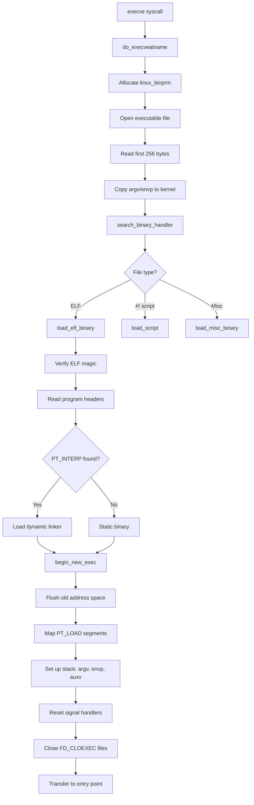
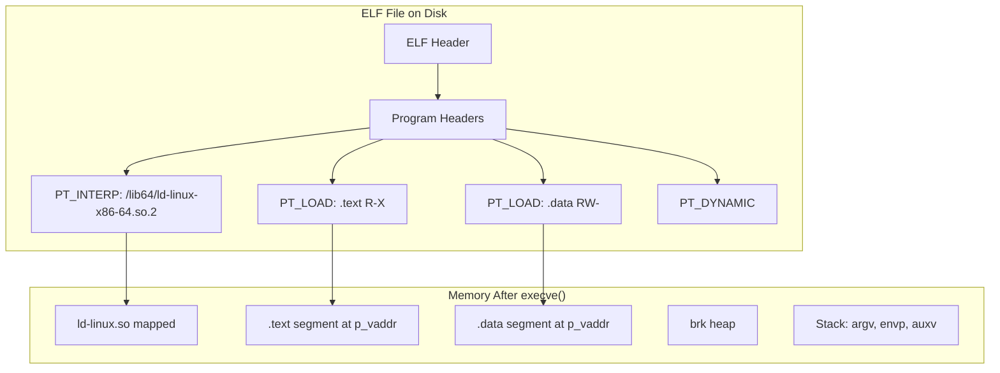
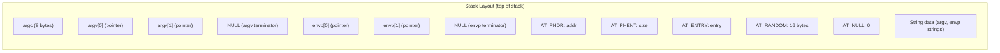

# Chapter 82: Program Execution — execve(), ELF Loading, Interpreter, argv/envp

## 1. Intuition

After a process is created via `fork()`, it typically needs to run a different program. The `execve()` system call is the mechanism that transforms the current process into a new one — replacing its memory image, resetting signal handlers, and transferring control to the entry point of a new executable.

The `execve()` call is the "metamorphosis" step of process creation. While `fork()` clones the caterpillar, `exec()` turns it into a butterfly. The process identity (PID) remains the same, but everything else — code, data, stack, heap — is replaced.

Understanding ELF loading, dynamic linking, and the `exec` family of functions is essential for understanding how Linux programs actually start.

## 2. Architecture

### 2.1 The exec Family

| Function | Interface | Description |
|----------|-----------|-------------|
| `execve()` | Syscall | Full control: path, argv, envp |
| `execl()` | Library | List-based arguments |
| `execlp()` | Library | Searches PATH |
| `execle()` | Library | Explicit environment |
| `execv()` | Library | Vector-based arguments |
| `execvp()` | Library | Searches PATH, vector |
| `execvpe()` | Library | Searches PATH, vector, explicit env |

All library functions eventually call `execve()`.

### 2.2 High-Level execve() Flow

```
User calls execve("/bin/ls", argv, envp)
    │
    ├── Kernel resolves path (namei/lookup)
    │
    ├── Checks permissions (execute access)
    │
    ├── Determines file format:
    │   ├── ELF binary → load_elf_binary()
    │   ├── Script (#!) → load_script()
    │   ├── Flat binary → load_flat_binary()
    │   └── Misc format → format-specific loader
    │
    ├── Flush old address space
    │   ├── exit_mmap() — release all VMAs
    │   ├── deactivate_mm() — remove from active
    │   └── mmput() — drop mm reference
    │
    ├── Load new program
    │   ├── Read ELF headers
    │   ├── Map PT_LOAD segments
    │   ├── Set up interpreter (ld-linux.so)
    │   ├── Set up stack (argv, envp, auxv)
    │   └── Set up brk (heap)
    │
    ├── Reset signal handlers (SIG_DFL)
    │
    ├── Close FD_CLOEXEC file descriptors
    │
    └── Transfer control to entry point
        ├── If interpreter: interpreter entry
        └── If static: program _start
```

## 3. Kernel Implementation

### 3.1 execve() System Call

```c
/* fs/exec.c */
SYSCALL_DEFINE3(execve,
                const char __user *, filename,
                const char __user *const __user *, argv,
                const char __user *const __user *, envp) {
    return do_execveatname(AT_FDCWD, filename, argv, envp);
}
```

### 3.2 do_execveatname() and do_execveat_common()

```c
/* fs/exec.c - simplified */
static int do_execveat_common(int fd, struct filename *filename,
                              struct user_arg_ptr argv,
                              struct user_arg_ptr envp, int flags) {
    struct linux_binprm *bprm;
    struct file *file;
    int retval;

    /* Count arguments and environment entries */
    retval = count(argv, MAX_ARG_STRINGS);
    retval = count(envp, MAX_ARG_STRINGS);

    /* Allocate binary parameter structure */
    bprm = kzalloc(sizeof(*bprm), GFP_KERNEL);

    /* Open the executable file */
    file = do_open_execat(fd, filename, flags);
    bprm->file = file;

    /* Initialize bprm */
    bprm->filename = filename->name;
    bprm->interp = filename->name;

    /* Read first 256 bytes for format detection */
    retval = kernel_read(bprm->file, bprm->buf, BINPRM_BUF_SIZE, &bprm->pos);

    /* Copy argv and envp from user space */
    retval = copy_strings(bprm->envc, envp, bprm);
    retval = copy_strings(bprm->argc, argv, bprm);

    /* Find and execute the binary handler */
    retval = exec_binprm(bprm);

    /* On success, we never return here */
    return retval;
}
```

### 3.3 exec_binprm() — Finding the Right Loader

```c
/* fs/exec.c */
static int exec_binprm(struct linux_binprm *bprm) {
    struct linux_binfmt *fmt;
    int ret;

    /* Iterate through registered binary formats */
    list_for_each_entry(fmt, &formats, lh) {
        ret = search_binary_handler(bprm);
        if (ret == 0)
            return 0;  /* Success */
    }

    return ret;
}
```

### 3.4 search_binary_handler()

```c
/* fs/exec.c */
int search_binary_handler(struct linux_binprm *bprm) {
    struct linux_binfmt *fmt;
    int retval;

    list_for_each_entry(fmt, &formats, lh) {
        retval = fmt->load_binary(bprm);
        if (retval == 0) {
            /* Successfully loaded */
            return 0;
        }
        if (retval != -ENOEXEC)
            break;
        /* -ENOEXEC means "not my format", try next */
    }

    return retval;
}
```

### 3.5 ELF Loading: load_elf_binary()

This is the most important binary handler for modern Linux:

```c
/* fs/binfmt_elf.c - heavily simplified */
static int load_elf_binary(struct linux_binprm *bprm) {
    struct elfhdr *elf_ex = (struct elfhdr *)bprm->buf;
    struct elfhdr *elf_interpreter = NULL;
    struct elf_phdr *elf_ppnt, *elf_phdata;
    struct mm_struct *mm;
    int retval, i;

    /* 1. Verify ELF magic number */
    if (memcmp(elf_ex->e_ident, ELFMAG, SELFMAG) != 0)
        return -ENOEXEC;

    /* 2. Check architecture compatibility */
    if (elf_ex->e_machine != EM_X86_64 && ...)
        return -ENOEXEC;

    /* 3. Read program headers */
    elf_phdata = load_elf_phdrs(elf_ex, bprm->file);
    if (!elf_phdata)
        return -ENOMEM;

    /* 4. Look for PT_INTERP (dynamic linker) */
    elf_ppnt = elf_phdata;
    for (i = 0; i < elf_ex->e_phnum; i++, elf_ppnt++) {
        if (elf_ppnt->p_type == PT_INTERP) {
            /* Read interpreter path */
            char *elf_interpreter = kmalloc(elf_ppnt->p_filesz, GFP_KERNEL);
            kernel_read(bprm->file, elf_interpreter,
                       elf_ppnt->p_filesz, &elf_ppnt->p_offset);

            /* Open and verify interpreter */
            interpreter = open_exec(elf_interpreter);
            /* Read interpreter ELF header */
        }
    }

    /* 5. Flush old address space */
    retval = begin_new_exec(bprm);

    /* 6. Set up new mm_struct */
    mm = mm_alloc();
    /* ... */

    /* 7. Map PT_LOAD segments */
    elf_ppnt = elf_phdata;
    for (i = 0; i < elf_ex->e_phnum; i++, elf_ppnt++) {
        if (elf_ppnt->p_type != PT_LOAD)
            continue;

        /* Create VMA for this segment */
        error = elf_map(bprm->file, load_bias + elf_ppnt->p_vaddr,
                        elf_ppnt, elf_prot, elf_flags, total_size);
    }

    /* 8. Set up interpreter (if dynamic) */
    if (elf_interpreter) {
        /* Map interpreter segments */
        /* Set entry point to interpreter */
        elf_entry = load_elf_interp(elf_interpreter, ...);
    } else {
        elf_entry = elf_ex->e_entry;
    }

    /* 9. Create auxiliary vector, set up stack */
    create_elf_tables(bprm, elf_ex, interp_load_addr, ...);

    /* 10. Set up brk (heap start) */
    current->mm->start_brk = current->mm->brk = /* after data segment */;

    /* 11. Set entry point */
    START_THREAD(elf_ex, elf_entry, bprm->p);

    return 0;
}
```

### 3.6 The Auxiliary Vector (auxv)

The kernel passes the auxiliary vector to the new program, providing essential runtime information:

```c
/* include/uapi/linux/auxvec.h */
#define AT_NULL      0   /* End of vector */
#define AT_IGNORE    1   /* Entry should be ignored */
#define AT_PHDR      3   /* Program headers address */
#define AT_PHENT     4   /* Size of program header entry */
#define AT_PHNUM     5   /* Number of program headers */
#define AT_PAGESZ    6   /* System page size */
#define AT_BASE      7   /* Base address of interpreter */
#define AT_FLAGS     8   /* Flags */
#define AT_ENTRY     9   /* Entry point address */
#define AT_UID       11  /* Real user ID */
#define AT_EUID      12  /* Effective user ID */
#define AT_GID       13  /* Real group ID */
#define AT_EGID      14  /* Effective group ID */
#define AT_CLKTCK    17  /* Frequency of times() */
#define AT_HWCAP     16  /* Machine-dependent CPU capabilities */
#define AT_HWCAP2    26  /* Extended CPU capabilities */
#define AT_SECURE    23  /* Secure mode */
#define AT_BASE_PLATFORM 24  /* Platform string */
#define AT_RANDOM    25  /* Random bytes */
#define AT_EXECFN    31  /* Filename of executable */
```

### 3.7 Script Handling (#!)

```c
/* fs/binfmt_script.c */
static int load_script(struct linux_binprm *bprm) {
    char *cp;
    char *i_name, *i_arg;
    struct file *file;
    int retval;

    /* Check for #! magic */
    if ((bprm->buf[0] != '#') || (bprm->buf[1] != '!'))
        return -ENOEXEC;

    /* Parse interpreter line */
    cp = bprm->buf + 2;
    while ((cp < bprm->buf + BINPRM_BUF_SIZE) && (*cp == ' '))
        cp++;
    i_name = cp;

    /* Find end of interpreter name */
    while ((cp < bprm->buf + BINPRM_BUF_SIZE) && (*cp) && (*cp != ' ') && (*cp != '\n'))
        cp++;
    /* Split name and argument */
    /* ... */

    /* Open the interpreter */
    file = open_exec(i_name);

    /* Rewrite bprm to call: interpreter [arg] script */
    /* ... */

    return search_binary_handler(bprm);  /* Re-scan with new bprm */
}
```

## 4. Source Code References

| File | Description |
|------|-------------|
| `fs/exec.c` | Core `execve()` implementation |
| `fs/binfmt_elf.c` | ELF binary loader |
| `fs/binfmt_script.c` | Script (`#!`) handler |
| `fs/binfmt_misc.c` | Misc binary format handler |
| `include/linux/binfmts.h` | `linux_binprm` structure |
| `include/uapi/linux/elf.h` | ELF format definitions |
| `include/uapi/linux/auxvec.h` | Auxiliary vector types |
| `mm/mmap.c` | VMA management during exec |

## 5. Data Structures

### 5.1 linux_binprm

```c
/* include/linux/binfmts.h */
struct linux_binprm {
    struct vm_area_struct *vma;
    unsigned long vma_pages;

    struct mm_struct *mm;           /* New mm being built */
    unsigned long p;                /* Current stack pointer */
    unsigned long arg_start, arg_end;
    unsigned long env_start, env_end;

    struct file *file;              /* Executable file */
    struct file *interpreter;       /* Dynamic linker */

    char buf[BINPRM_BUF_SIZE];     /* First bytes of file (for magic) */
    loff_t pos;                     /* Read position */

    int argc, envc;                 /* Argument/environment counts */

    const char *filename;           /* Name of executable */
    const char *interp;             /* Name of interpreter */

    struct cred *cred;              /* New credentials */
    int unsafe;                     /* Various security flags */

    unsigned int recursion_depth;

    /* ... */
};
```

### 5.2 ELF Header (64-bit)

```c
/* include/uapi/linux/elf.h */
typedef struct elf64_hdr {
    unsigned char e_ident[EI_NIDENT]; /* ELF identification */
    Elf64_Half e_type;                /* Object file type */
    Elf64_Half e_machine;             /* Architecture */
    Elf64_Word e_version;             /* Object file version */
    Elf64_Addr e_entry;               /* Entry point address */
    Elf64_Off  e_phoff;               /* Program header offset */
    Elf64_Off  e_shoff;               /* Section header offset */
    Elf64_Word e_flags;               /* Processor-specific flags */
    Elf64_Half e_ehsize;              /* ELF header size */
    Elf64_Half e_phentsize;           /* Program header entry size */
    Elf64_Half e_phnum;               /* Number of program headers */
    Elf64_Half e_shentsize;           /* Section header entry size */
    Elf64_Half e_shnum;               /* Number of section headers */
    Elf64_Half e_shstrndx;            /* Section name string table index */
} Elf64_Ehdr;
```

### 5.3 ELF Program Header

```c
typedef struct elf64_phdr {
    Elf64_Word p_type;    /* Segment type */
    Elf64_Word p_flags;   /* Segment flags */
    Elf64_Off  p_offset;  /* Segment file offset */
    Elf64_Addr p_vaddr;   /* Segment virtual address */
    Elf64_Addr p_paddr;   /* Segment physical address */
    Elf64_Xword p_filesz; /* Segment size in file */
    Elf64_Xword p_memsz;  /* Segment size in memory */
    Elf64_Xword p_align;  /* Segment alignment */
} Elf64_Phdr;

/* Segment types */
#define PT_NULL    0
#define PT_LOAD    1     /* Loadable segment */
#define PT_DYNAMIC 2     /* Dynamic linking info */
#define PT_INTERP  3     /* Interpreter path */
#define PT_NOTE    4     /* Auxiliary info */
#define PT_PHDR    5     /* Program header table */
#define PT_GNU_EH_FRAME 0x6474e550  /* Exception handling */
#define PT_GNU_STACK    0x6474e551  /* Stack executability */
#define PT_GNU_RELRO    0x6474e552  /* Read-only after relocation */
```

## 6. C/Assembly Examples

### 6.1 Basic execve() Usage

```c
#include <stdio.h>
#include <stdlib.h>
#include <unistd.h>
#include <sys/wait.h>

int main(void) {
    pid_t pid = fork();

    if (pid == 0) {
        /* Child: replace with /bin/ls */
        char *argv[] = {"ls", "-la", "/tmp", NULL};
        char *envp[] = {"PATH=/bin:/usr/bin", NULL};

        execve("/bin/ls", argv, envp);

        /* Only reached if exec fails */
        perror("execve failed");
        _exit(1);
    }

    int status;
    waitpid(pid, &status, 0);

    if (WIFEXITED(status)) {
        printf("Child exited with status %d\n", WEXITSTATUS(status));
    }

    return 0;
}
```

### 6.2 Printing the Auxiliary Vector

```c
#include <stdio.h>
#include <elf.h>

/* The auxiliary vector is placed on the stack by the kernel */
/* It follows envp in memory */

int main(int argc, char *argv[], char *envp[]) {
    /* Skip past environment to find auxv */
    char **p = envp;
    while (*p != NULL) p++;
    p++;  /* Skip NULL terminator */

    Elf64_auxv_t *auxv = (Elf64_auxv_t *)p;

    printf("Auxiliary Vector:\n");
    printf("%-20s %-20s %s\n", "Type", "Value", "Description");

    for (; auxv->a_type != AT_NULL; auxv++) {
        const char *desc;
        switch (auxv->a_type) {
            case AT_PHDR:     desc = "Program headers address"; break;
            case AT_PHENT:    desc = "Program header entry size"; break;
            case AT_PHNUM:    desc = "Number of program headers"; break;
            case AT_PAGESZ:   desc = "Page size"; break;
            case AT_BASE:     desc = "Interpreter base address"; break;
            case AT_ENTRY:    desc = "Entry point"; break;
            case AT_UID:      desc = "Real UID"; break;
            case AT_EUID:     desc = "Effective UID"; break;
            case AT_GID:      desc = "Real GID"; break;
            case AT_EGID:     desc = "Effective GID"; break;
            case AT_SECURE:   desc = "Secure mode"; break;
            case AT_RANDOM:   desc = "Random bytes"; break;
            case AT_HWCAP:    desc = "Hardware capabilities"; break;
            case AT_CLKTCK:   desc = "Clock ticks per second"; break;
            case AT_EXECFN:   desc = "Executable filename"; break;
            default:          desc = "Unknown"; break;
        }

        printf("%-20lu 0x%-18lx %s\n",
               auxv->a_type, auxv->a_un.a_val, desc);
    }

    return 0;
}
```

### 6.3 Inspecting ELF Headers

```c
#include <stdio.h>
#include <stdlib.h>
#include <elf.h>
#include <fcntl.h>
#include <unistd.h>
#include <sys/mman.h>
#include <sys/stat.h>

int main(int argc, char *argv[]) {
    if (argc != 2) {
        fprintf(stderr, "Usage: %s <elf-file>\n", argv[0]);
        return 1;
    }

    int fd = open(argv[1], O_RDONLY);
    if (fd < 0) { perror("open"); return 1; }

    struct stat st;
    fstat(fd, &st);

    void *map = mmap(NULL, st.st_size, PROT_READ, MAP_PRIVATE, fd, 0);
    if (map == MAP_FAILED) { perror("mmap"); return 1; }

    Elf64_Ehdr *ehdr = (Elf64_Ehdr *)map;

    /* Verify ELF magic */
    if (memcmp(ehdr->e_ident, ELFMAG, SELFMAG) != 0) {
        fprintf(stderr, "Not an ELF file\n");
        return 1;
    }

    printf("ELF Header:\n");
    printf("  Class:     %d-bit\n", ehdr->e_ident[EI_CLASS] == ELFCLASS64 ? 64 : 32);
    printf("  Data:      %s\n", ehdr->e_ident[EI_DATA] == ELFDATA2LSB ? "Little Endian" : "Big Endian");
    printf("  Type:      %d\n", ehdr->e_type);
    printf("  Machine:   %d\n", ehdr->e_machine);
    printf("  Entry:     0x%lx\n", ehdr->e_entry);
    printf("  PH Offset: 0x%lx\n", ehdr->e_phoff);
    printf("  PH Entries: %d\n", ehdr->e_phnum);
    printf("  PH Size:   %d bytes\n", ehdr->e_phentsize);

    /* Read program headers */
    Elf64_Phdr *phdr = (Elf64_Phdr *)((char *)map + ehdr->e_phoff);

    printf("\nProgram Headers:\n");
    printf("%-12s %-18s %-18s %-18s %-18s %s\n",
           "Type", "Offset", "VirtAddr", "FileSize", "MemSize", "Flags");

    for (int i = 0; i < ehdr->e_phnum; i++) {
        const char *type;
        switch (phdr[i].p_type) {
            case PT_LOAD:    type = "LOAD"; break;
            case PT_DYNAMIC: type = "DYNAMIC"; break;
            case PT_INTERP:  type = "INTERP"; break;
            case PT_NOTE:    type = "NOTE"; break;
            case PT_PHDR:    type = "PHDR"; break;
            case PT_GNU_STACK: type = "GNU_STACK"; break;
            case PT_GNU_RELRO: type = "GNU_RELRO"; break;
            default: type = "UNKNOWN"; break;
        }

        char flags[4] = "---";
        if (phdr[i].p_flags & PF_R) flags[0] = 'R';
        if (phdr[i].p_flags & PF_W) flags[1] = 'W';
        if (phdr[i].p_flags & PF_X) flags[2] = 'X';

        printf("%-12s 0x%016lx 0x%016lx 0x%016lx 0x%016lx %s\n",
               type, phdr[i].p_offset, phdr[i].p_vaddr,
               phdr[i].p_filesz, phdr[i].p_memsz, flags);

        /* If INTERP, print interpreter path */
        if (phdr[i].p_type == PT_INTERP) {
            printf("  Interpreter: %s\n", (char *)map + phdr[i].p_offset);
        }
    }

    munmap(map, st.st_size);
    close(fd);
    return 0;
}
```

### 6.4 execve() Assembly (x86-64)

```asm
; x86-64: execve("/bin/sh", ["/bin/sh", NULL], NULL)
; Syscall number: 59

section .data
    db "/bin/sh", 0

section .text
global _start

_start:
    ; Build argv array on stack
    push    0                   ; NULL terminator
    lea     rsi, [rel binsh]    ; "/bin/sh" address
    push    rsi                 ; argv[0] = "/bin/sh"
    mov     rsi, rsp            ; rsi = &argv[0]

    ; execve(path, argv, envp)
    lea     rdi, [rel binsh]    ; path = "/bin/sh"
    xor     rdx, rdx            ; envp = NULL
    mov     rax, 59             ; __NR_execve
    syscall

    ; If execve fails, exit
    mov     rdi, 1
    mov     rax, 60
    syscall

section .data
binsh:  db "/bin/sh", 0
```

### 6.5 Demonstrating FD_CLOEXEC

```c
#include <stdio.h>
#include <stdlib.h>
#include <unistd.h>
#include <fcntl.h>
#include <sys/wait.h>

int main(void) {
    /* Open a file */
    int fd = open("/etc/passwd", O_RDONLY);
    printf("Opened fd=%d\n", fd);

    /* Set FD_CLOEXEC */
    fcntl(fd, F_SETFD, FD_CLOEXEC);

    pid_t pid = fork();
    if (pid == 0) {
        /* Child: try to read from fd */
        char buf[16];
        ssize_t n = read(fd, buf, sizeof(buf));
        printf("Child: read returned %zd (expected -1 after exec)\n", n);

        /* Now exec — fd should be closed */
        execl("/bin/cat", "cat", "/proc/self/fd", NULL);
        perror("exec failed");
        _exit(1);
    }

    waitpid(pid, NULL, 0);
    close(fd);
    return 0;
}
```

### 6.6 Implementing execvp() with PATH Search

```c
#include <stdio.h>
#include <stdlib.h>
#include <string.h>
#include <unistd.h>
#include <errno.h>

int my_execvp(const char *file, char *const argv[]) {
    /* If file contains '/', execute directly */
    if (strchr(file, '/')) {
        execv(file, argv);
        return -1;
    }

    /* Search PATH */
    const char *path = getenv("PATH");
    if (!path)
        path = "/usr/bin:/bin";

    char *path_copy = strdup(path);
    char *dir = strtok(path_copy, ":");

    while (dir) {
        char full_path[4096];
        snprintf(full_path, sizeof(full_path), "%s/%s", dir, file);

        execv(full_path, argv);

        /* Only continue if error is ENOENT or EACCES */
        if (errno != ENOENT && errno != EACCES) {
            free(path_copy);
            return -1;
        }

        dir = strtok(NULL, ":");
    }

    free(path_copy);
    errno = ENOENT;
    return -1;
}
```

## 7. Diagrams

### 7.1 execve() Flow



### 7.2 ELF Loading Process



### 7.3 argv/envp/auxv Stack Layout



## 8. Performance

### 8.1 execve() Performance Characteristics

- **Time complexity**: Depends on binary size, number of segments, and whether dynamic linking is needed
- **Typical latency**: 50-500 μs for small static binaries; 1-10 ms for large dynamic programs
- **Dynamic linking overhead**: The dynamic linker (`ld-linux.so`) adds significant startup time

### 8.2 Optimization Techniques

1. **Static linking**: Eliminates dynamic linker overhead
2. **Prelink/AutoFDO**: Reduces relocation time
3. **Readahead**: Pre-loading binary pages
4. **Filesystem caching**: Keep frequently-used binaries in page cache

### 8.3 Measuring execve() Time

```bash
# Time execve() overhead with strace
strace -c -e trace=execve /bin/ls /tmp

# Measure fork+exec time
time (for i in $(seq 1000); do /bin/true; done)
```

## 9. Security

### 9.1 Security Implications of execve()

1. **Setuid/setgid bits**: Can change effective UID/GID
   - Kernel clears capabilities on setuid exec

2. **AT_SECURE**: Dynamic linker checks this for secure mode
   - LD_PRELOAD, LD_LIBRARY_PATH are ignored in secure mode

3. **No-new-privileges**: `prctl(PR_SET_NO_NEW_PRIVS)` prevents privilege escalation

4. **Seccomp**: Can restrict execve() and related syscalls

5. **SELinux/AppArmor**: Label-based mandatory access control on exec

### 9.2 Exec Sandboxing

```c
#include <seccomp.h>

/* Restrict execve to only allow specific binaries */
void setup_exec_sandbox(void) {
    scmp_filter_ctx ctx = seccomp_init(SCMP_ACT_ALLOW);

    /* Deny execve entirely */
    seccomp_rule_add(ctx, SCMP_ACT_ERRNO(EPERM), SCMP_SYS(execve), 0);

    seccomp_load(ctx);
    seccomp_release(ctx);
}
```

## 10. Common Pitfalls

### Pitfall 1: Not Checking execve() Return

```c
/* WRONG: exec failures silently continue */
fork();
if (pid == 0) {
    execve("/bin/nonexistent", argv, envp);
    /* This code runs if exec fails — no error handling! */
}

/* RIGHT: Always check and handle failure */
fork();
if (pid == 0) {
    execve("/bin/ls", argv, envp);
    perror("execve");  /* Only reached on failure */
    _exit(127);
}
```

### Pitfall 2: Forgetting NULL Termination

```c
/* WRONG: Missing NULL terminator */
char *argv[] = {"ls", "-la", "/tmp"};
execve("/bin/ls", argv, NULL);  /* Undefined behavior! */

/* RIGHT: Always NULL-terminate */
char *argv[] = {"ls", "-la", "/tmp", NULL};
```

### Pitfall 3: Dangling Pointers After exec()

```c
/* WRONG: Pointers to old address space are invalid */
char *msg = malloc(100);
sprintf(msg, "hello");
fork();
if (pid == 0) {
    /* msg is still valid (COW), but after exec, it's gone */
    execve("/bin/ls", argv, NULL);
    /* msg is now invalid */
}
```

### Pitfall 4: Environment Variable Leaks

```c
/* WRONG: Sensitive env vars survive exec */
setenv("SECRET_KEY", "abc123", 1);
execve("/bin/ls", argv, environ);  /* SECRET_KEY visible to ls! */

/* RIGHT: Clean environment for exec */
char *clean_env[] = {"PATH=/usr/bin:/bin", NULL};
execve("/bin/ls", argv, clean_env);
```

## 11. Best Practices

1. **Use `execvpe()` or `execvp()`** for PATH searching instead of manual implementation
2. **Always NULL-terminate** argv and envp arrays
3. **Set FD_CLOEXEC** on file descriptors that shouldn't survive exec
4. **Sanitize environment** before exec, especially for setuid programs
5. **Use `posix_spawn()`** for simple fork+exec patterns
6. **Check return values** — exec only returns on failure
7. **Flush stdio** before exec to avoid duplicate output
8. **Consider static linking** for embedded or performance-critical scenarios

## 12. Exercises

### Exercise 1: Implement a Simple Dynamic Linker

Write a minimal ELF loader that:
1. Reads an ELF binary
2. Maps PT_LOAD segments
3. Handles PT_INTERP by loading the interpreter
4. Sets up the stack and transfers control

### Exercise 2: Exec Tracing

Write a program using `ptrace()` that traces all `execve()` calls made by a child process, printing the filename and arguments.

### Exercise 3: Environment Sanitizer

Write a `safe_exec()` function that:
- Strips sensitive environment variables (containing KEY, TOKEN, SECRET, PASSWORD)
- Logs the exec attempt
- Handles errors gracefully

### Exercise 4: ELF Section Reader

Extend the ELF header reader from Section 6.3 to also read and display section headers, including section names.

### Exercise 5: Binary Format Detector

Write a program that determines the type of a binary file (ELF, script, etc.) by reading its magic bytes, similar to the kernel's format detection.

## 13. References

1. **Linux kernel source**: `fs/exec.c` — https://github.com/torvalds/linux/blob/master/fs/exec.c
2. **Linux kernel source**: `fs/binfmt_elf.c` — ELF loader
3. **man pages**: `execve(2)`, `exec(3)`
4. **ELF specification**: System V ABI — https://refspecs.linuxfoundation.org/elf/elf.pdf
5. **"Understanding the Linux Kernel"** by Bovet & Cesati, Chapter 20
6. **"Linkers and Loaders"** by John R. Levine
7. **"Advanced Programming in the UNIX Environment"** by Stevens & Rago, Chapter 8
8. **LWN.net**: "How programs get run" — https://lwn.net/Articles/631631/
9. **man pages**: `ld-linux.so(8)` — dynamic linker
10. **Oracle**: "Linker and Libraries Guide" — https://docs.oracle.com/cd/E53394_01/html/E54813/
