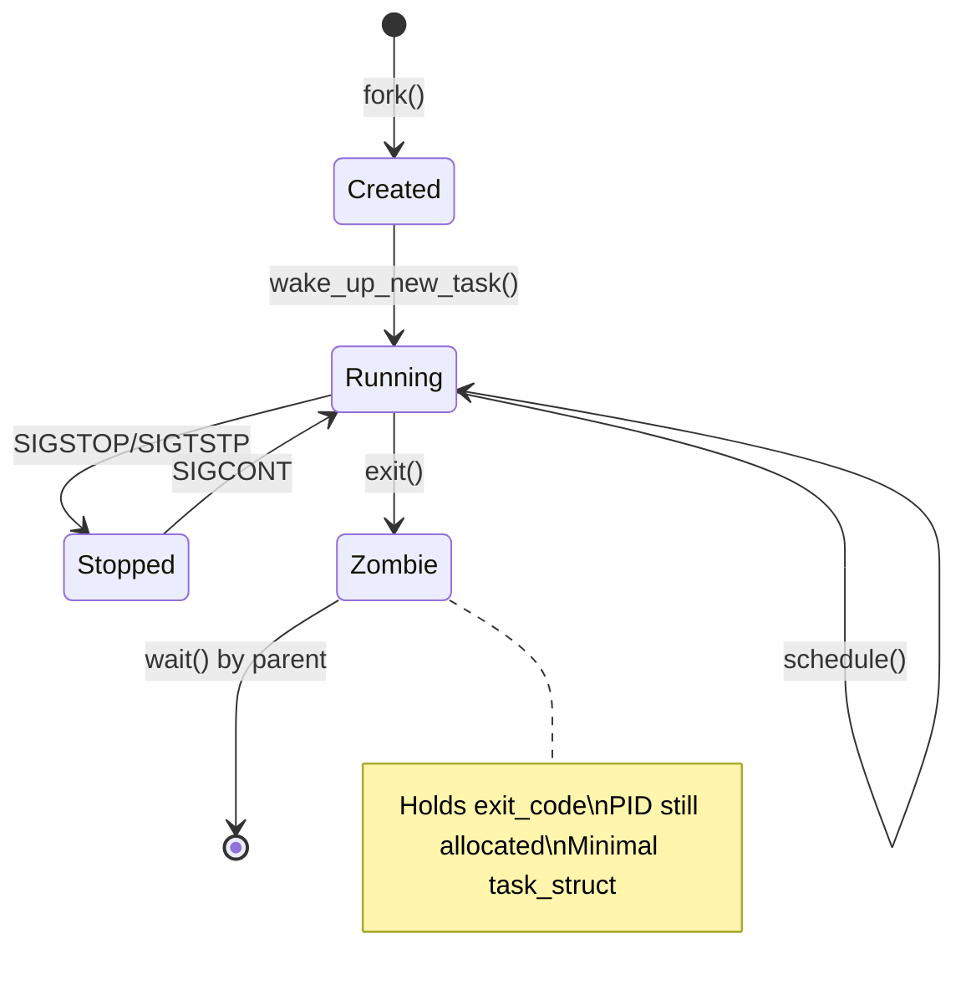
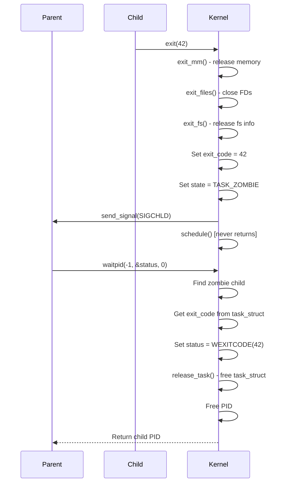
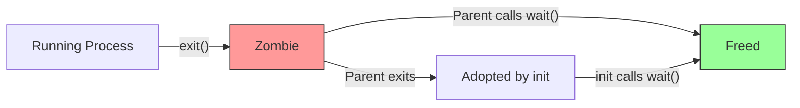

# Chapter 83: Process Termination and wait — exit(), exit_group(), wait4(), waitpid()

## 1. Intuition

Every process must eventually end. The Linux kernel provides a well-defined protocol for process termination: the process signals its completion through `exit()`, and the parent acknowledges receipt of that signal through `wait()`. This handshake ensures that resources are properly reclaimed and that the parent can learn the outcome of the child's execution.

The termination protocol has several stages: the process cleans up its resources (closing files, freeing memory), notifies its parent, and enters a zombie state — a minimal record that holds the exit code until the parent calls `wait()`. If the parent doesn't call `wait()`, the zombie lingers, leaking a PID slot.

Understanding process termination is crucial for writing robust programs that don't leak resources or leave zombie processes.

## 2. Architecture

### 2.1 The Termination Pipeline

```
Process calls exit(code)
    │
    ├── exit_mm()        — Release address space
    ├── exit_files()     — Close file descriptors
    ├── exit_fs()        — Release filesystem info
    ├── exit_sighand()   — Clean up signal handlers
    ├── exit_notify()    — Notify parent via SIGCHLD
    │
    ├── Set exit_code in task_struct
    │
    └── TASK_ZOMBIE state
        │
        └── Parent calls wait()
            │
            ├── Retrieve exit code
            ├── Release task_struct
            └── PID freed for reuse
```

### 2.2 Exit Functions Family

| Function | Description |
|----------|-------------|
| `exit(status)` | Terminate calling thread, run atexit handlers |
| `_exit(status)` | Terminate without atexit handlers |
| `exit_group(status)` | Terminate all threads in the group |
| `abort()` | Terminate with SIGABRT |
| `wait(status)` | Wait for any child |
| `waitpid(pid, status, options)` | Wait for specific child |
| `waitid(idtype, id, infop, options)` | Extended wait |
| `wait4(pid, status, options, rusage)` | Wait with resource usage |

## 3. Kernel Implementation

### 3.1 exit() System Call

```c
/* kernel/exit.c */
void __noreturn do_exit(long code) {
    struct task_struct *tsk = current;

    /* Set PF_EXITING flag */
    tsk->flags |= PF_EXITING;

    /* Run exit handlers registered with atexit() */
    exit_mm_release(tsk, current->mm);

    /* Release memory management */
    exit_mm(tsk);

    /* Release file system info */
    if (tsk->fs) {
        exit_fs(tsk);
    }

    /* Close open files */
    if (tsk->files) {
        exit_files(tsk);
    }

    /* Release signal handling */
    exit_signals(tsk);

    /* Release namespaces */
    exit_task_namespaces(tsk);

    /* Notify parent and other processes */
    exit_notify(tsk, code);

    /* Become a zombie */
    tsk->state = TASK_DEAD;
    tsk->exit_code = code;

    /* Schedule away — never returns */
    do_task_dead();
}
```

### 3.2 exit_group() — Terminating All Threads

```c
/* kernel/exit.c */
SYSCALL_DEFINE1(exit_group, int, error_code) {
    /* Signal all threads in the group to exit */
    do_group_exit((error_code & 0xff) << 8);
    /* NOTREACHED */
    return 0;
}

void do_group_exit(int exit_code) {
    struct signal_struct *sig = current->signal;

    /* If already exiting, just use existing code */
    if (sig->flags & SIGNAL_GROUP_EXIT)
        exit_code = sig->group_exit_code;

    /* Set group exit code */
    sig->group_exit_code = exit_code;
    sig->flags = SIGNAL_GROUP_EXIT;

    /* Send SIGKILL to all threads in group */
    zap_other_threads(current);

    /* Exit the current thread */
    do_exit(exit_code);
}
```

### 3.3 exit_notify() — Notifying the Parent

```c
/* kernel/exit.c */
static void exit_notify(struct task_struct *tsk, int group_dead) {
    bool autoreap;
    bool group_dead = atomic_read(&tsk->signal->live) == 0;

    /* Forget about ptrace */
    forget_original_parent(tsk);

    /* Send notification to parent */
    tsk->exit_state = EXIT_ZOMBIE;

    /* Determine if we should send SIGCHLD */
    do_notify_parent(tsk, tsk->exit_signal);

    /* If parent has SIGCHLD set to SIG_IGN, auto-reap */
    /* If parent has SA_NOCLDWAIT, auto-reap */
    /* Otherwise, become zombie and wait for wait() */

    /* Thread group leader handles group exit */
    if (group_dead && thread_group_leader(tsk))
        do_notify_parent(tsk, tsk->exit_signal);
}
```

### 3.4 do_notify_parent() — Sending SIGCHLD

```c
/* kernel/signal.c */
bool do_notify_parent(struct task_struct *tsk, int sig) {
    struct kernel_siginfo info;
    unsigned long flags;
    bool autoreap = false;

    /* Build siginfo structure */
    clear_siginfo(&info);
    info.si_signo = sig;
    info.si_errno = 0;
    info.si_code = SI_USER;
    info.si_pid = task_pid_vnr(tsk);
    info.si_uid = from_kuid_munged(current_user_ns(), task_uid(tsk));
    info.si_status = tsk->exit_code;

    /* If SIG_IGN for SIGCHLD, auto-reap */
    if (sig == SIGCHLD &&
        (tsk->parent->sighand->sa[SIGCHLD - 1].sa_handler == SIG_IGN ||
         (tsk->parent->sighand->sa[SIGCHLD - 1].sa_flags & SA_NOCLDWAIT))) {
        autoreap = true;
    }

    /* Send the signal */
    __send_signal_locked(sig, &info, tsk->parent, PIDTYPE_PID);

    return autoreap;
}
```

### 3.5 wait4() System Call

```c
/* kernel/exit.c */
SYSCALL_DEFINE4(wait4, pid_t, upid, int __user *, stat_addr,
                int, options, struct rusage __user *, ru) {
    struct rusage r;
    struct wait_opts wo;
    int ret;

    /* Set up wait options */
    wo.wo_type   = PIDTYPE_PID;
    wo.wo_pid    = find_get_pid(upid);
    wo.wo_flags  = options;
    wo.wo_info   = NULL;

    if (ru)
        wo.wo_rusage = &r;

    /* Perform the wait */
    ret = kernel_wait4(-1, &wo);

    /* Copy results to user space */
    if (ret > 0 && stat_addr)
        put_user(wo.wo_stat, stat_addr);
    if (ru && copy_to_user(ru, &r, sizeof(struct rusage)))
        ret = -EFAULT;

    return ret;
}
```

### 3.6 kernel_wait4() — The Core Wait Logic

```c
/* kernel/exit.c */
static long kernel_wait4(pid_t upid, struct wait_opts *wo) {
    struct task_struct *tsk;
    int ret;

    /* Add current process to wait queue */
    init_waitqueue_entry(&wait, current);
    add_wait_queue(&current->signal->wait_chldexit, &wait);

repeat:
    /* Scan children for matching exited process */
    tsk = current;
    list_for_each_entry(p, &tsk->children, sibling) {
        if (wo->wo_pid && p->pid != wo->wo_pid)
            continue;

        /* Check if child has exited */
        if (p->exit_state == EXIT_ZOMBIE) {
            ret = wait_task_zombie(wo, p);
            if (ret)
                goto end;
        }

        /* Check if child is stopped */
        if (p->state == TASK_STOPPED && (wo->wo_flags & WUNTRACED)) {
            ret = wait_task_stopped(wo, p);
            if (ret)
                goto end;
        }
    }

    /* No matching child found */
    if (wo->wo_flags & WNOHANG) {
        ret = 0;
        goto end;
    }

    /* Sleep until a child changes state */
    schedule();
    goto repeat;

end:
    remove_wait_queue(&current->signal->wait_chldexit, &wait);
    return ret;
}
```

### 3.7 wait_task_zombie() — Collecting Zombie Exit Status

```c
/* kernel/exit.c */
static int wait_task_zombie(struct wait_opts *wo, struct task_struct *p) {
    unsigned long state;
    int retval, status;

    /* Read exit code */
    status = (p->exit_code & 0xff) << 8;

    /* Set status based on how the process exited */
    if (p->exit_state == EXIT_ZOMBIE) {
        /* Normal exit */
        if (p->exit_code & 0x80)
            status |= 0x7f;  /* Coredump */
        else
            status = p->exit_code & 0xff;  /* Normal exit */
    }

    /* Copy exit status to user space */
    wo->wo_stat = status;

    /* Release the zombie task */
    release_task(p);

    return retval;
}
```

### 3.8 release_task() — Final Cleanup

```c
/* kernel/exit.c */
void release_task(struct task_struct *p) {
    struct task_struct *leader;
    int zap_leader;

    /* Remove from parent's children list */
    list_del_init(&p->sibling);

    /* Decrement signal counts */
    atomic_dec(&p->signal->live);

    /* Free PID */
    put_pid(p->thread_pid);

    /* Free task_struct and kernel stack */
    free_task(p);
}
```

## 4. Source Code References

| File | Description |
|------|-------------|
| `kernel/exit.c` | Core exit and wait implementation |
| `kernel/signal.c` | Signal delivery (SIGCHLD) |
| `include/linux/wait.h` | Wait queue structures |
| `include/uapi/linux/wait.h` | Wait flags (WNOHANG, WUNTRACED, etc.) |
| `mm/mmap.c` | `exit_mm()` — address space cleanup |
| `fs/file.c` | `exit_files()` — file descriptor cleanup |

## 5. Data Structures

### 5.1 Exit States

```c
/* include/linux/sched.h */
#define EXIT_ZOMBIE     1   /* Waiting for parent to collect exit status */
#define EXIT_DEAD       2   /* Final state — about to be freed */

/* Exit code encoding */
#define EXIT_CODE_SHIFT 8
#define EXIT_CODE(status)   (((status) & 0xff) << EXIT_CODE_SHIFT)
```

### 5.2 Wait Options

```c
/* include/uapi/linux/wait.h */
#define WNOHANG         0x00000001  /* Don't block */
#define WUNTRACED       0x00000002  /* Report stopped children */
#define WSTOPPED        WUNTRACED
#define WEXITED         0x00000004  /* Report exited children */
#define WCONTINUED      0x00000008  /* Report continued children */
#define WNOWAIT         0x01000000  /* Don't reap, just poll */
#define __WNOTHREAD     0x20000000  /* Don't wait on children of other threads */
#define __WALL          0x40000000  /* Wait on all children */
#define __WCLONE        0x80000000  /* Wait only on non-SIGCHLD children */
```

### 5.3 wait_opts Structure

```c
/* kernel/exit.c - internal */
struct wait_opts {
    enum pid_type   wo_type;    /* PIDTYPE_PID or PIDTYPE_TGID */
    int             wo_flags;   /* WNOHANG, etc. */
    struct pid      *wo_pid;    /* PID to wait for */
    struct waitid_info *wo_info; /* For waitid() */
    struct rusage   *wo_rusage; /* For wait4() */
    int             wo_stat;    /* Exit status (output) */
    struct task_struct *wo_task; /* Found task (output) */
};
```

## 6. C/Assembly Examples

### 6.1 Basic waitpid() Usage

```c
#include <stdio.h>
#include <stdlib.h>
#include <unistd.h>
#include <sys/wait.h>

int main(void) {
    pid_t pid = fork();

    if (pid == 0) {
        /* Child */
        printf("Child (PID=%d): doing work...\n", getpid());
        sleep(2);
        printf("Child: exiting with code 42\n");
        exit(42);
    }

    /* Parent */
    printf("Parent: waiting for child %d...\n", pid);

    int status;
    pid_t result = waitpid(pid, &status, 0);

    if (result == -1) {
        perror("waitpid");
    } else {
        printf("Parent: child %d reaped\n", result);

        if (WIFEXITED(status)) {
            printf("  Normal exit, code = %d\n", WEXITSTATUS(status));
        } else if (WIFSIGNALED(status)) {
            printf("  Killed by signal %d\n", WTERMSIG(status));
        } else if (WIFSTOPPED(status)) {
            printf("  Stopped by signal %d\n", WSTOPSIG(status));
        } else if (WIFCONTINUED(status)) {
            printf("  Continued\n");
        }
    }

    return 0;
}
```

### 6.2 Wait for All Children

```c
#include <stdio.h>
#include <stdlib.h>
#include <unistd.h>
#include <sys/wait.h>

int main(void) {
    int num_children = 5;

    for (int i = 0; i < num_children; i++) {
        pid_t pid = fork();
        if (pid == 0) {
            /* Child */
            sleep(i + 1);
            printf("Child %d (PID=%d) exiting\n", i, getpid());
            exit(i);
        }
        printf("Parent: spawned child %d (PID=%d)\n", i, pid);
    }

    /* Wait for all children */
    int remaining = num_children;
    while (remaining > 0) {
        int status;
        pid_t pid = waitpid(-1, &status, 0);

        if (pid == -1) {
            perror("waitpid");
            break;
        }

        if (WIFEXITED(status)) {
            printf("Parent: child %d exited with code %d\n",
                   pid, WEXITSTATUS(status));
        }
        remaining--;
    }

    printf("All children reaped\n");
    return 0;
}
```

### 6.3 Non-blocking Wait (WNOHANG)

```c
#include <stdio.h>
#include <stdlib.h>
#include <unistd.h>
#include <sys/wait.h>
#include <time.h>

int main(void) {
    pid_t pid = fork();

    if (pid == 0) {
        sleep(3);
        exit(0);
    }

    /* Parent: poll with WNOHANG */
    int status;
    struct timespec start, now;
    clock_gettime(CLOCK_MONOTONIC, &start);

    while (1) {
        pid_t result = waitpid(pid, &status, WNOHANG);

        if (result > 0) {
            printf("Child %d has exited\n", result);
            break;
        } else if (result == 0) {
            /* Child still running */
            clock_gettime(CLOCK_MONOTONIC, &now);
            double elapsed = (now.tv_sec - start.tv_sec) +
                             (now.tv_nsec - start.tv_nsec) / 1e9;
            printf("Child still running (%.1fs elapsed)...\n", elapsed);
            usleep(500000);  /* Sleep 500ms */
        } else {
            perror("waitpid");
            break;
        }
    }

    return 0;
}
```

### 6.4 Using waitid() with siginfo_t

```c
#include <stdio.h>
#include <stdlib.h>
#include <unistd.h>
#include <sys/wait.h>
#include <signal.h>

int main(void) {
    pid_t pid = fork();

    if (pid == 0) {
        printf("Child (PID=%d): exiting\n", getpid());
        exit(77);
    }

    siginfo_t info;
    int ret = waitid(P_PID, pid, &info, WEXITED);

    if (ret == -1) {
        perror("waitid");
        return 1;
    }

    printf("Child info:\n");
    printf("  PID:    %d\n", info.si_pid);
    printf("  UID:    %d\n", info.si_uid);
    printf("  Code:   %d (CLD_EXITED=%d)\n", info.si_code, CLD_EXITED);
    printf("  Status: %d\n", info.si_status);

    return 0;
}
```

### 6.5 exit() Assembly (x86-64)

```asm
; x86-64: exit(42)
; Syscall number 60

section .text
global _start

_start:
    mov     rdi, 42         ; Exit code
    mov     rax, 60         ; __NR_exit
    syscall
```

### 6.6 Demonstrating exit() vs _exit()

```c
#include <stdio.h>
#include <stdlib.h>
#include <unistd.h>
#include <sys/wait.h>

int main(void) {
    printf("Testing exit() — runs atexit handlers\n");

    pid_t pid = fork();
    if (pid == 0) {
        atexit_func();
        exit(0);  /* Calls atexit handlers, flushes stdio */
    }
    waitpid(pid, NULL, 0);

    printf("Testing _exit() — no atexit handlers\n");
    pid = fork();
    if (pid == 0) {
        atexit_func();
        _exit(0);  /* Does NOT call atexit handlers */
    }
    waitpid(pid, NULL, 0);

    return 0;
}

void atexit_func(void) {
    /* This only runs if exit() is used, not _exit() */
    /* But we can't register it from child... */
}
```

## 7. Diagrams

### 7.1 Process Lifecycle



### 7.2 Exit and Wait Sequence



### 7.3 Zombie Lifecycle



## 8. Performance

### 8.1 wait() Performance

- **WNOHANG**: Returns immediately if no child has exited
- **Blocking wait**: Puts parent to sleep until child exits
- **Scanning children**: O(n) where n = number of children

### 8.2 Zombie Overhead

- **PID slot**: Each zombie holds a PID until reaped
- **task_struct**: ~10 KB per zombie (minimal)
- **Kernel memory**: Small but can accumulate with many children

### 8.3 Optimizing Wait Patterns

```c
/* Efficient: SIGCHLD handler */
volatile sig_atomic_t child_count = 0;

void sigchld_handler(int sig) {
    int saved_errno = errno;
    /* Reap all zombies */
    while (waitpid(-1, NULL, WNOHANG) > 0)
        child_count++;
    errno = saved_errno;
}

/* Use SA_RESTART for automatic restart of interrupted syscalls */
struct action sa = {
    .sa_handler = sigchld_handler,
    .sa_flags = SA_RESTART | SA_NOCLDSTOP,
};
sigemptyset(&sa.sa_mask);
sigaction(SIGCHLD, &sa, NULL);
```

## 9. Security

### 9.1 Exit Code Information Leaks

- Exit codes can reveal information about internal state
- In setuid programs, be careful what exit codes you use

### 9.2 Wait-related Security Issues

1. **PID recycling race**: Between `fork()` and `waitpid()`, PID can be recycled
2. **Signal injection**: SIGCHLD can be spoofed in some configurations
3. **Resource exhaustion**: Not reaping children creates zombies that exhaust PID space

### 9.3 Secure Exit

```c
/* For sensitive programs, wipe memory before exit */
void secure_exit(int status) {
    /* Wipe sensitive data */
    explicit_bzero(sensitive_buffer, sizeof(sensitive_buffer));

    /* Close all file descriptors */
    for (int fd = sysconf(_SC_OPEN_MAX); fd > 2; fd--)
        close(fd);

    _exit(status);
}
```

## 10. Common Pitfalls

### Pitfall 1: Not Reaping Children

```c
/* WRONG: Creates zombies */
while (1) {
    int client = accept(...);
    if (fork() == 0) {
        handle_client(client);
        exit(0);
    }
    /* Never waits — zombies accumulate */
}

/* RIGHT: Handle SIGCHLD */
signal(SIGCHLD, SIG_IGN);  /* Linux: auto-reap */
/* OR */
void handler(int sig) {
    while (waitpid(-1, NULL, WNOHANG) > 0);
}
```

### Pitfall 2: Checking Wrong Status Macros

```c
/* WRONG: Checking exit code without verifying exit type */
waitpid(pid, &status, 0);
int code = WEXITSTATUS(status);  /* Wrong if killed by signal! */

/* RIGHT: Check how the process ended first */
if (WIFEXITED(status)) {
    int code = WEXITSTATUS(status);
} else if (WIFSIGNALED(status)) {
    int sig = WTERMSIG(status);
}
```

### Pitfall 3: Race Condition with Wait

```c
/* WRONG: Race between fork and wait */
pid_t pid = fork();
/* ... do some work ... */
waitpid(pid, &status, 0);  /* Child may have already exited and been reaped */

/* RIGHT: Design for proper sequencing */
```

## 11. Best Practices

1. **Always reap children**: Use `SIGCHLD` handler or `wait()` in a loop
2. **Use `_exit()` in children after `fork()`**: Avoid running parent's atexit handlers
3. **Use `WNOHANG` for non-blocking waits** when you need to do other work
4. **Check exit type before reading status**: Use `WIFEXITED()` before `WEXITSTATUS()`
5. **Use `waitid()` for more information**: Provides UID, PID, and signal info
6. **Consider `PR_SET_CHILD_SUBREAPER`**: For process management daemons
7. **Handle `EINTR`**: `wait()` can be interrupted by signals
8. **Use `waitpid(-1, ...)` in loops**: Reap all children, not just specific ones
9. **Document exit codes**: Define and document the exit codes your program uses
10. **Use `atexit()` for cleanup**: Register cleanup handlers before forking
11. **Flush stdio buffers before exit**: `fflush(NULL)` or use `exit()` instead of `_exit()`
12. **Consider `posix_spawn()`**: For simple fork+exec patterns

### Exit Code Conventions

Following standard exit code conventions helps with debugging and integration:

```c
/* Standard exit codes (from sysexits.h) */
#define EX_OK       0   /* Successful termination */
#define EX_ERROR    1   /* General error */
#define EX_USAGE    64  /* Command line usage error */
#define EX_DATAERR  65  /* Data format error */
#define EX_NOINPUT  66  /* Cannot open input */
#define EX_NOUSER   67  /* Addressee unknown */
#define EX_NOHOST   68  /* Host name unknown */
#define EX_UNAVAILABLE 69 /* Service unavailable */
#define EX_SOFTWARE 70  /* Internal software error */
#define EX_OSERR    71  /* System error */
#define EX_OSFILE   72  /* Critical OS file missing */
#define EX_CANTCREAT 73 /* Can't create output file */
#define EX_IOERR    74  /* Input/output error */
#define EX_TEMPFAIL 75  /* Temp failure, retry */
#define EX_PROTOCOL 76  /* Remote error in protocol */
#define EX_NOPERM   77  /* Permission denied */
#define EX_CONFIG   78  /* Configuration error */

/* Shell convention: 126 = command not executable, 127 = command not found */
/* Signal death: 128 + signal_number */
```

### Error Handling After fork()

A common pattern is to use the exit code to communicate the nature of failures:

```c
pid_t pid = fork();
if (pid == 0) {
    /* Child */
    execvp(argv[0], argv);
    /* If we get here, exec failed */
    if (errno == ENOENT) {
        fprintf(stderr, "%s: command not found\n", argv[0]);
        _exit(127);
    } else if (errno == EACCES) {
        fprintf(stderr, "%s: permission denied\n", argv[0]);
        _exit(126);
    } else {
        perror(argv[0]);
        _exit(1);
    }
}
```

### Zombie-Free Design Patterns

Several patterns exist for avoiding zombies without explicit `wait()` calls:

1. **Double fork**: Fork twice, grandchild is reparented to init
2. **SIG_IGN SIGCHLD**: Linux-specific auto-reap
3. **SA_NOCLDWAIT**: POSIX flag to prevent zombie creation
4. **Event-driven wait**: Use signalfd + epoll to reap in event loops
5. **Dedicated reaper thread**: One thread dedicated to calling `waitpid(-1)`

## 12. Exercises

### Exercise 1: Zombie Monitor

Write a program that spawns 10 children, leaves them as zombies for 10 seconds, then reaps them. Use `ps` to show the zombie state.

### Exercise 2: Process Status Analyzer

Write a function that takes a `wait()` status and prints a human-readable description of how the process ended (exit code, signal name, core dump flag).

### Exercise 3: Asynchronous Process Manager

Write a server that handles multiple child processes asynchronously using `SIGCHLD` and `waitpid(WNOHANG)`, logging each child's exit status.

### Exercise 4: exit() vs _exit() Demo

Write a program that demonstrates the difference between `exit()` and `_exit()` by showing that atexit handlers and stdio flushing behave differently.

### Exercise 5: Resource Usage Collection

Write a program that uses `wait4()` to collect resource usage (CPU time, memory) of child processes.

## 13. References

1. **Linux kernel source**: `kernel/exit.c` — https://github.com/torvalds/linux/blob/master/kernel/exit.c
2. **man pages**: `exit(2)`, `wait(2)`, `waitpid(2)`, `waitid(2)`, `wait4(2)`
3. **"Understanding the Linux Kernel"** by Bovet & Cesati
4. **"Advanced Programming in the UNIX Environment"** by Stevens & Rago, Chapter 8
5. **POSIX.1-2017**: `exit()` specification
6. **LWN.net**: "Process termination" — https://lwn.net/
7. **The Linux Documentation Project**: Process management
8. **man pages**: `signal(7)`, `SIGCHLD` documentation
