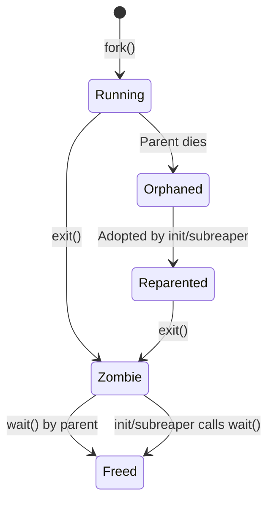
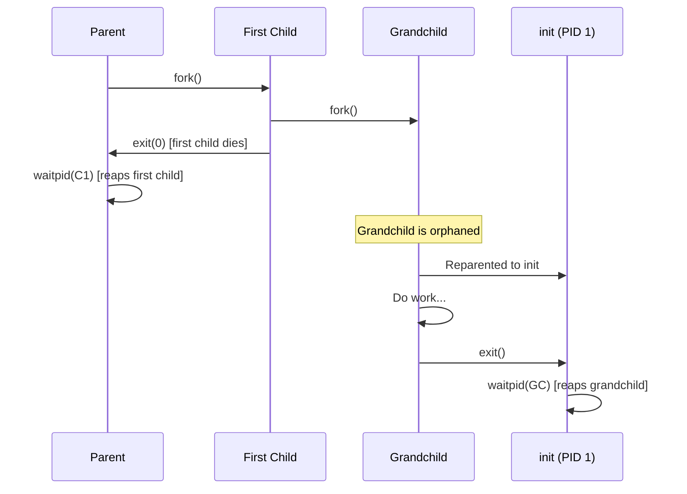
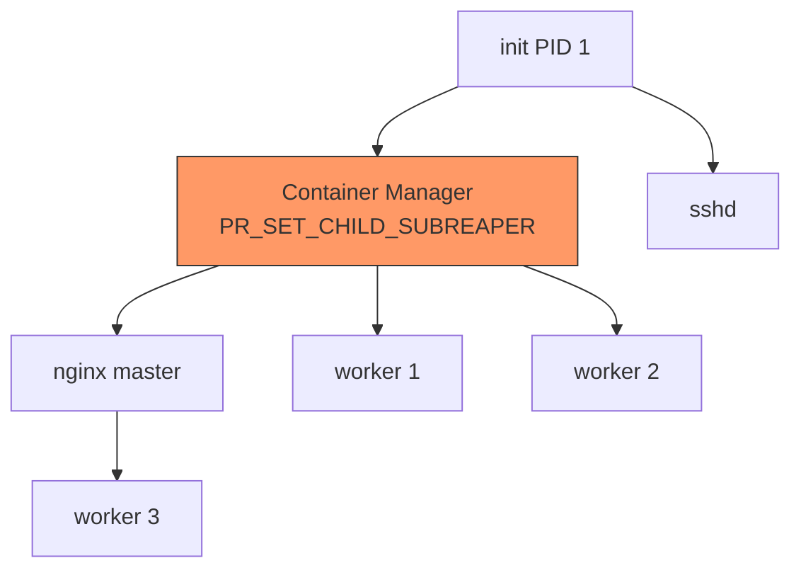
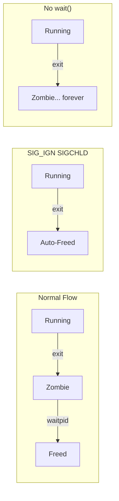

# Chapter 84: Zombies and Orphans — Zombie State, init Adoption, SIGCHLD, Double Fork

## 1. Intuition

When a process terminates, it doesn't immediately vanish from the system. Instead, it enters a **zombie state** — a ghostly remnant that retains its process ID and exit status until its parent acknowledges its death by calling `wait()`. This design ensures that the parent can always learn the outcome of its children.

An **orphan** is a process whose parent has died. When this happens, the orphan is adopted by a special process — traditionally `init` (PID 1) or a designated subreaper — which then becomes responsible for reaping it when it eventually exits.

These two concepts are intertwined: zombies exist because parents haven't called `wait()`, and orphans exist because parents died before their children. Understanding both is essential for writing robust daemon code and process management utilities.

## 2. Architecture

### 2.1 Process States Related to Zombies

```
Running → exit() → Zombie → wait() → Freed
                    ↑
Orphan → Adopted by init → Eventually becomes zombie → init reaps
```

### 2.2 The Zombie Lifecycle

1. Process calls `exit()` (or is killed by a signal)
2. Kernel cleans up most resources (memory, files, etc.)
3. Process enters `TASK_ZOMBIE` state
4. Kernel sends `SIGCHLD` to parent
5. Parent calls `wait()` and reads exit status
6. Kernel frees `task_struct` and PID

### 2.3 The Orphan Lifecycle

1. Parent process exits before child
2. Child becomes orphaned
3. Kernel reparents child to `init` (PID 1) or subreaper
4. Child continues running normally
5. When child exits, new parent reaps it

## 3. Kernel Implementation

### 3.1 Zombie Creation in do_exit()

```c
/* kernel/exit.c - simplified */
static void exit_notify(struct task_struct *tsk, int group_dead) {
    /* Set zombie state */
    tsk->exit_state = EXIT_ZOMBIE;

    /* Notify parent */
    do_notify_parent(tsk, tsk->exit_signal);

    /* If parent has SIG_IGN for SIGCHLD, auto-reap */
    /* Otherwise, stay as zombie */
}
```

### 3.2 Orphan Reparenting

When a process exits, the kernel must reparent all its children:

```c
/* kernel/exit.c */
static void forget_original_parent(struct task_struct *father) {
    struct task_struct *p, *t, *reaper;

    /* Find a suitable new parent */
    if (unlikely(pid_ns_has_reaper(father->nsproxy->pid_ns_for_children)))
        reaper = father->nsproxy->pid_ns_for_children->child_reaper;
    else
        reaper = &init_task;  /* PID 1 */

    /* Reparent all children */
    list_for_each_entry(p, &father->children, sibling) {
        /* Change parent pointer */
        p->real_parent = reaper;

        /* If child is zombie, notify new parent */
        if (p->exit_state == EXIT_ZOMBIE)
            do_notify_parent(p, p->exit_signal);

        /* Also reparent children of traced processes */
        if (same_thread_group(p->parent, father))
            p->parent = reaper;
    }

    /* Move children list to new parent */
    list_for_each_entry_safe(p, n, &father->children, sibling) {
        list_move(&p->sibling, &reaper->children);
    }
}
```

### 3.3 PR_SET_CHILD_SUBREAPER

A process can designate itself as a subreaper, receiving orphans instead of `init`:

```c
/* kernel/sys.c */
SYSCALL_DEFINE1(prctl, int, option, unsigned long, arg2, ...) {
    switch (option) {
    case PR_SET_CHILD_SUBREAPER:
        me->child_subreaper = !!arg2;
        break;
    case PR_GET_CHILD_SUBREAPER:
        /* ... */
        break;
    }
}
```

### 3.4 Finding the Reaper

```c
/* kernel/exit.c */
static struct task_struct *find_new_reaper(struct task_struct *father,
                                           struct task_struct *child_reaper) {
    struct task_struct *thread, *reaper;

    /* Check if father is a subreaper for any of its children */
    if (father->signal->has_child_subreaper) {
        /* Walk up the process tree to find subreaper */
        thread = father;
        while_each_thread(father, thread) {
            if (thread->child_subreaper)
                return thread;
        }
    }

    /* Fall back to init */
    return child_reaper;
}
```

### 3.5 Auto-reap on SIG_IGN

```c
/* kernel/signal.c */
bool do_notify_parent(struct task_struct *tsk, int sig) {
    struct kernel_siginfo info;
    bool autoreap = false;

    /* Check if parent ignores SIGCHLD */
    if (sig == SIGCHLD &&
        (tsk->parent->sighand->sa[SIGCHLD - 1].sa_handler == SIG_IGN ||
         (tsk->parent->sighand->sa[SIGCHLD - 1].sa_flags & SA_NOCLDWAIT))) {
        autoreap = true;
        tsk->exit_state = EXIT_DEAD;  /* Skip zombie */
    }

    /* Send SIGCHLD to parent */
    __send_signal_locked(sig, &info, tsk->parent, PIDTYPE_PID);

    return autoreap;
}
```

## 4. Source Code References

| File | Description |
|------|-------------|
| `kernel/exit.c` | Zombie creation, orphan reparenting |
| `kernel/signal.c` | SIGCHLD delivery, auto-reap |
| `include/linux/sched.h` | `task_struct` exit states |
| `init/main.c` | `init` process (PID 1) behavior |
| `kernel/sys.c` | `PR_SET_CHILD_SUBREAPER` |

## 5. Data Structures

### 5.1 Exit States

```c
/* include/linux/sched.h */
#define EXIT_ZOMBIE     1   /* Waiting for parent to call wait() */
#define EXIT_DEAD       2   /* Final state, about to be freed */

/* In task_struct */
struct task_struct {
    /* ... */
    int exit_state;         /* EXIT_ZOMBIE or EXIT_DEAD */
    int exit_code;          /* Exit code (shifted) */
    int exit_signal;        /* Signal to send to parent (SIGCHLD) */
    /* ... */
};
```

### 5.2 Parent-Child Relationships

```c
struct task_struct {
    /* ... */
    struct task_struct *real_parent;  /* Biological parent */
    struct task_struct *parent;       /* Tracer or real_parent */
    struct list_head children;        /* List of children */
    struct list_head sibling;         /* Linkage in parent's children list */
    /* ... */
};
```

## 6. C/Assembly Examples

### 6.1 Creating a Zombie (Intentionally)

```c
#include <stdio.h>
#include <stdlib.h>
#include <unistd.h>
#include <sys/wait.h>

int main(void) {
    printf("Parent PID: %d\n", getpid());

    pid_t pid = fork();

    if (pid == 0) {
        /* Child: exit immediately */
        printf("Child (PID=%d): exiting to become zombie\n", getpid());
        exit(42);
    }

    /* Parent: sleep without calling wait() */
    printf("Parent: child %d created, sleeping 30 seconds\n", pid);
    printf("Parent: run 'ps aux | grep Z' in another terminal\n");
    sleep(30);

    /* Now reap the zombie */
    int status;
    waitpid(pid, &status, 0);

    if (WIFEXITED(status)) {
        printf("Parent: reaped zombie, exit code = %d\n", WEXITSTATUS(status));
    }

    return 0;
}
```

### 6.2 Demonstrating Orphan Adoption

```c
#include <stdio.h>
#include <stdlib.h>
#include <unistd.h>

int main(void) {
    pid_t pid = fork();

    if (pid > 0) {
        /* Parent: exit immediately */
        printf("Parent (PID=%d): exiting, child %d becomes orphan\n",
               getpid(), pid);
        exit(0);
    }

    /* Child: sleep to see orphan behavior */
    sleep(5);

    printf("Orphan child (PID=%d): my new parent is PPID=%d (should be 1)\n",
           getpid(), getppid());

    sleep(5);
    printf("Orphan child: exiting normally\n");

    return 0;
}
```

### 6.3 SIGCHLD Handler for Reaping

```c
#include <stdio.h>
#include <stdlib.h>
#include <unistd.h>
#include <sys/wait.h>
#include <signal.h>
#include <errno.h>

volatile sig_atomic_t children_reaped = 0;

void sigchld_handler(int sig) {
    int saved_errno = errno;

    /* Reap all exited children (non-blocking) */
    pid_t pid;
    int status;
    while ((pid = waitpid(-1, &status, WNOHANG)) > 0) {
        children_reaped++;

        if (WIFEXITED(status)) {
            fprintf(stderr, "Reaped child %d, exit code %d\n",
                    pid, WEXITSTATUS(status));
        } else if (WIFSIGNALED(status)) {
            fprintf(stderr, "Reaped child %d, killed by signal %d\n",
                    pid, WTERMSIG(status));
        }
    }

    errno = saved_errno;
}

int main(void) {
    /* Install SIGCHLD handler */
    struct sigaction sa;
    sa.sa_handler = sigchld_handler;
    sigemptyset(&sa.sa_mask);
    sa.sa_flags = SA_RESTART | SA_NOCLDSTOP;
    sigaction(SIGCHLD, &sa, NULL);

    /* Spawn multiple children */
    for (int i = 0; i < 5; i++) {
        pid_t pid = fork();
        if (pid == 0) {
            sleep(i + 1);
            printf("Child %d (PID=%d) done\n", i, getpid());
            exit(i);
        }
    }

    /* Wait for all children to be reaped */
    while (children_reaped < 5) {
        pause();  /* Wait for signals */
    }

    printf("All %d children reaped\n", children_reaped);
    return 0;
}
```

### 6.4 Double Fork Technique

The double fork trick creates a child that's immediately reparented to `init`, avoiding zombie creation without needing a SIGCHLD handler:

```c
#include <stdio.h>
#include <stdlib.h>
#include <unistd.h>
#include <sys/wait.h>

int main(void) {
    printf("Parent PID: %d\n", getpid());

    pid_t pid1 = fork();

    if (pid1 == 0) {
        /* First child */
        printf("First child (PID=%d), parent=%d\n", getpid(), getppid());

        pid_t pid2 = fork();

        if (pid2 == 0) {
            /* Grandchild: will be orphaned and adopted by init */
            printf("Grandchild (PID=%d), parent=%d\n", getpid(), getppid());
            sleep(10);
            printf("Grandchild: exiting\n");
            _exit(0);
        }

        /* First child: exit immediately */
        printf("First child: exiting (grandchild becomes orphan)\n");
        _exit(0);
    }

    /* Parent: wait for first child only */
    int status;
    waitpid(pid1, &status, 0);
    printf("Parent: first child reaped\n");

    /* Grandchild is now orphaned, adopted by init */
    printf("Parent: grandchild is now managed by init\n");
    printf("Parent: run 'ps' to see grandchild with PPID=1\n");

    sleep(15);

    return 0;
}
```

### 6.5 Subreaper Example

```c
#define _GNU_SOURCE
#include <stdio.h>
#include <stdlib.h>
#include <unistd.h>
#include <sys/prctl.h>
#include <sys/wait.h>

int main(void) {
    /* Make this process a child subreaper */
    if (prctl(PR_SET_CHILD_SUBREAPER, 1) == -1) {
        perror("prctl");
        return 1;
    }

    printf("Subreaper PID: %d\n", getpid());

    pid_t pid = fork();

    if (pid == 0) {
        /* Child */
        printf("Child PID: %d, parent: %d\n", getpid(), getppid());

        /* Grandchild will be reparented to us (subreaper) */
        pid_t grandchild = fork();
        if (grandchild == 0) {
            printf("Grandchild PID: %d, parent: %d\n", getpid(), getppid());
            sleep(5);
            printf("Grandchild: exiting\n");
            _exit(0);
        }

        /* Child exits */
        printf("Child: exiting\n");
        _exit(0);
    }

    /* Parent (subreaper): reap all children */
    int status;
    pid_t reaped;
    while ((reaped = waitpid(-1, &status, 0)) > 0) {
        printf("Subreaper: reaped PID %d\n", reaped);
    }

    return 0;
}
```

### 6.6 Monitoring Zombies with /proc

```c
#include <stdio.h>
#include <stdlib.h>
#include <string.h>
#include <dirent.h>
#include <ctype.h>

int count_zombies(void) {
    DIR *proc = opendir("/proc");
    struct dirent *entry;
    int zombie_count = 0;

    while ((entry = readdir(proc)) != NULL) {
        /* Skip non-PID entries */
        if (!isdigit(entry->d_name[0]))
            continue;

        char path[256];
        char state;

        snprintf(path, sizeof(path), "/proc/%s/stat", entry->d_name);

        FILE *f = fopen(path, "r");
        if (!f)
            continue;

        /* Read PID and state from /proc/PID/stat */
        /* Format: pid (comm) state ppid ... */
        int pid;
        char comm[256];
        if (fscanf(f, "%d %s %c", &pid, comm, &state) == 3) {
            if (state == 'Z') {
                zombie_count++;
                printf("Zombie: PID %d %s\n", pid, comm);
            }
        }
        fclose(f);
    }

    closedir(proc);
    return zombie_count;
}

int main(void) {
    int zombies = count_zombies();
    printf("Total zombies found: %d\n", zombies);
    return 0;
}
```

## 7. Diagrams

### 7.1 Zombie and Orphan Lifecycle



### 7.2 Double Fork Technique



### 7.3 Subreaper Process Tree



### 7.4 Zombie State Transitions



## 8. Performance

### 8.1 Zombie Overhead

| Resource | Cost per Zombie |
|----------|----------------|
| PID slot | 1 PID (until reaped) |
| task_struct | ~10 KB kernel memory |
| Kernel lists | Minimal |

### 8.2 Impact of Many Zombies

```bash
# Check current zombies
ps aux | awk '$8=="Z" {print}'

# Count zombies
ps aux | awk '$8=="Z"' | wc -l

# Check PID usage
cat /proc/sys/kernel/pid_max
```

### 8.3 Performance Implications

1. **PID exhaustion**: Each zombie holds a PID until reaped
2. **Wait queue overhead**: Large children lists slow down `wait()` scanning
3. **Kernel memory**: While small per zombie, can accumulate

## 9. Security

### 9.1 Security Implications of Zombies

1. **Information leakage**: Zombie retains exit code (may contain sensitive info)
2. **PID squatting**: Attacker can observe PID reuse patterns
3. **Resource denial**: Zombie flooding can exhaust PID space

### 9.2 Secure Zombie Handling

```c
/* Use SA_NOCLDWAIT to prevent zombies entirely */
struct sigaction sa;
sa.sa_handler = SIG_DFL;
sa.sa_flags = SA_NOCLDWAIT;
sigaction(SIGCHLD, &sa, NULL);

/* OR: ignore SIGCHLD (Linux-specific auto-reap) */
signal(SIGCHLD, SIG_IGN);
```

### 9.3 Container Considerations

In containers, PID 1 is often the application, not `init`. If PID 1 doesn't reap zombies, they accumulate:

```dockerfile
# Use tini as PID 1 for proper zombie reaping
RUN apt-get install tini
ENTRYPOINT ["tini", "--"]
CMD ["myapp"]
```

## 10. Common Pitfalls

### Pitfall 1: Not Reaping in Daemon Code

```c
/* WRONG: Daemon that forgets to reap */
void daemon_loop(void) {
    while (1) {
        int client = accept(...);
        if (fork() == 0) {
            handle(client);
            exit(0);
        }
        /* Zombies accumulate! */
    }
}

/* RIGHT: Daemon with proper reaping */
void daemon_loop(void) {
    /* Install SIGCHLD handler */
    signal(SIGCHLD, SIG_IGN);  /* Linux auto-reap */

    while (1) {
        int client = accept(...);
        if (fork() == 0) {
            handle(client);
            exit(0);
        }
    }
}
```

### Pitfall 2: Double Waitpid Race

```c
/* WRONG: Multiple threads calling waitpid */
/* Thread 1 and Thread 2 both call waitpid(-1, ...) */
/* One will succeed, other gets ECHILD */

/* RIGHT: Use a single reaper thread or signal handler */
```

### Pitfall 3: Assuming Parent is Always init

```c
/* WRONG: Assuming getppid() == 1 for orphans */
if (getppid() == 1) {
    /* I'm an orphan — but what about containers? */
}

/* RIGHT: Use PR_GET_CHILD_SUBREAPER to find actual reaper */
```

### Pitfall 4: SIG_IGN Behavior Differences

```c
/* WRONG: Assuming SIG_IGN for SIGCHLD works everywhere */
signal(SIGCHLD, SIG_IGN);  /* Linux: auto-reap */
/* Other Unix: behavior may differ! */

/* RIGHT: Use SA_NOCLDWAIT for portable behavior */
struct sigaction sa;
sa.sa_handler = SIG_DFL;
sa.sa_flags = SA_NOCLDWAIT;
sigaction(SIGCHLD, &sa, NULL);
```

### Pitfall 5: Zombie After Double Fork

```c
/* WRONG: First child not reaped */
pid_t pid1 = fork();
if (pid1 == 0) {
    pid_t pid2 = fork();
    if (pid2 == 0) {
        /* Grandchild — orphaned, adopted by init */
        _exit(0);
    }
    _exit(0);  /* First child exits */
}
/* Parent didn't wait for pid1 — zombie! */

/* RIGHT: Wait for first child */
waitpid(pid1, NULL, 0);
```

### Pitfall 6: Container PID 1 Without Reaping

```c
/* WRONG: Application as PID 1 without reaping */
/* Dockerfile: ENTRYPOINT ["myapp"] */
/* myapp doesn't handle SIGCHLD — zombies accumulate! */

/* RIGHT: Use tini or handle SIGCHLD */
/* Dockerfile: ENTRYPOINT ["tini", "--", "myapp"] */
```

## 11. Best Practices

1. **Always reap children**: Use `SIGCHLD` handler or `signal(SIGCHLD, SIG_IGN)`
2. **Use `SA_NOCLDWAIT`** if you don't need exit status
3. **Use double fork** for daemonization
4. **Set `PR_SET_CHILD_SUBREAPER`** for process managers
5. **Use `tini` or `dumb-init`** as PID 1 in containers
6. **Monitor zombies** in production with `/proc` scanning
7. **Use `WNOHANG` in loops** to avoid missing multiple exits

### Daemon Patterns

The traditional Unix daemon pattern uses double fork to avoid zombie accumulation:

```c
/* Proper daemon initialization */
void daemonize(const char *name) {
    /* First fork — parent exits */
    pid_t pid = fork();
    if (pid > 0) exit(0);
    if (pid < 0) { perror("fork"); exit(1); }

    /* Create new session — detach from terminal */
    if (setsid() < 0) { perror("setsid"); exit(1); }

    /* Second fork — not session leader, can't acquire terminal */
    pid = fork();
    if (pid > 0) exit(0);
    if (pid < 0) { perror("fork"); exit(1); }

    /* Set file creation mask */
    umask(0);

    /* Change to root directory */
    chdir("/");

    /* Close and redirect standard FDs */
    close(STDIN_FILENO);
    close(STDOUT_FILENO);
    close(STDERR_FILENO);
    open("/dev/null", O_RDONLY);  /* stdin  → /dev/null */
    open("/dev/null", O_WRONLY);  /* stdout → /dev/null */
    open("/dev/null", O_WRONLY);  /* stderr → /dev/null */

    /* Write PID file */
    char pid_str[16];
    snprintf(pid_str, sizeof(pid_str), "%d\n", getpid());
    int fd = open("/var/run/" name ".pid", O_WRONLY|O_CREAT, 0644);
    if (fd >= 0) {
        write(fd, pid_str, strlen(pid_str));
        close(fd);
    }
}
```

### Container PID 1 Best Practices

In containers, the entrypoint process runs as PID 1. This has special responsibilities:

1. **Must reap zombies**: PID 1 inherits all orphaned processes
2. **Must handle signals**: SIGTERM for graceful shutdown
3. **Should forward signals**: To child processes
4. **Should not exit prematurely**: Container stops when PID 1 exits

```c
/* Minimal container PID 1 */
int main(int argc, char *argv[]) {
    /* Set up signal handling */
    signal(SIGCHLD, sigchld_handler);
    signal(SIGTERM, sigterm_handler);

    /* Start the actual application */
    pid_t app_pid = fork();
    if (app_pid == 0) {
        execvp(argv[1], &argv[1]);
        perror("exec");
        _exit(1);
    }

    /* Reap zombies and wait for app */
    while (1) {
        int status;
        pid_t pid = waitpid(-1, &status, 0);
        if (pid == app_pid) {
            /* Main app exited */
            if (WIFEXITED(status))
                return WEXITSTATUS(status);
            return 1;
        }
    }
}
```

### Zombie Detection and Monitoring

Monitoring zombie processes is important for production systems:

```bash
#!/bin/bash
# Zombie process monitor

while true; do
    ZOMBIE_COUNT=$(ps aux | awk '$8=="Z"' | wc -l)
    
    if [ "$ZOMBIE_COUNT" -gt 0 ]; then
        echo "WARNING: $ZOMBIE_COUNT zombie processes found"
        ps aux | awk '$8=="Z" {print $2, $11, $12}'
        
        # Find parent processes that aren't reaping
        ps aux | awk '$8=="Z" {print $3}' | sort | uniq -c | sort -rn
    fi
    
    sleep 10
done
```

### Process Adoption Chains

When processes are reparented, they follow a chain:

1. **Direct parent**: Normal case, parent reaps child
2. **Subreaper**: If parent dies and a subreaper exists
3. **init (PID 1)**: Ultimate fallback

In namespaces, the PID 1 of the namespace acts as the reaper, not the host init. This is why containers need a proper init process.

## 12. Exercises

### Exercise 1: Zombie Flood

Write a program that creates 100 zombies without reaping them. Observe the system behavior and PID usage.

### Exercise 2: Zombie Monitor Dashboard

Write a program that continuously monitors `/proc` and displays a live count of zombie processes, their PIDs, and their parents.

### Exercise 3: Double Fork Daemon

Write a proper daemon using the double fork technique that:
1. Forks and parent exits
2. Child calls `setsid()`
3. Child forks again
4. Grandchild continues as daemon

### Exercise 4: Container PID 1 Simulator

Write a program that acts as PID 1 in a PID namespace, properly reaping all orphaned children.

### Exercise 5: Subreaper Process Tree

Write a program that uses `PR_SET_CHILD_SUBREAPER` to manage a tree of processes, properly reaping all descendants.

### Exercise 6: Zombie State Analysis

Write a program that:
1. Creates a zombie process
2. Reads `/proc/ZOMBIE_PID/status` to examine its state
3. Verifies the zombie shows as `Z` state
4. Reaps the zombie and confirms it's gone

### Exercise 7: Signal-based Reaping vs Polling

Compare two approaches to reaping children:
1. SIGCHLD handler with `waitpid(WNOHANG)`
2. Polling `waitpid(-1, &status, WNOHANG)` in a loop

Measure the latency of each approach and discuss trade-offs.

### Exercise 8: Orphan Adoption Chain

Write a program that creates a chain of processes (parent → child → grandchild → great-grandchild), then kills the parent. Verify that all descendants are properly reparented to init (or the subreaper).

## 13. References

1. **Linux kernel source**: `kernel/exit.c` — https://github.com/torvalds/linux/blob/master/kernel/exit.c
2. **man pages**: `wait(2)`, `exit(2)`, `prctl(2)`
3. **"Understanding the Linux Kernel"** by Bovet & Cesati
4. **man pages**: `signal(7)`, `SIGCHLD`
5. **Docker best practices**: Using `tini` for PID 1
6. **LWN.net**: "Subreaper" — https://lwn.net/Articles/532767/
7. **Stack Overflow**: "Double fork to become daemon"
8. **The Art of Unix Programming** by Eric S. Raymond
