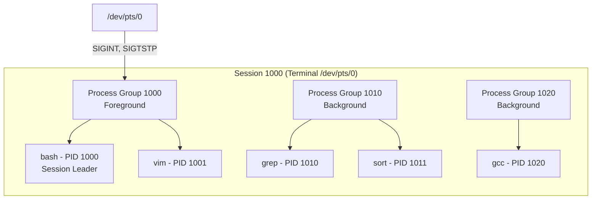
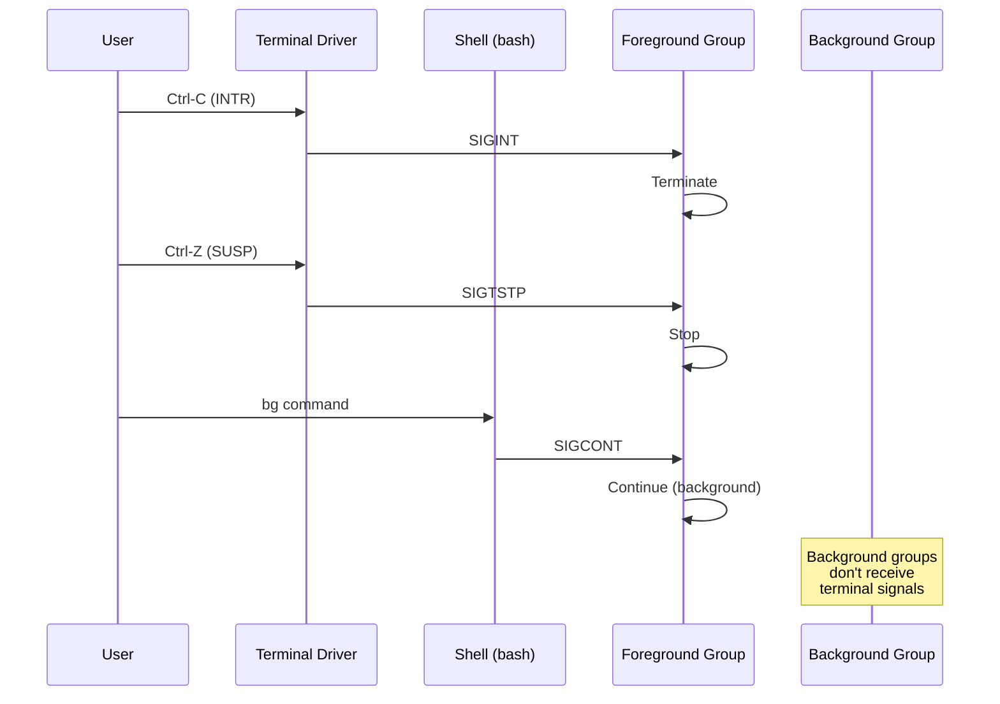
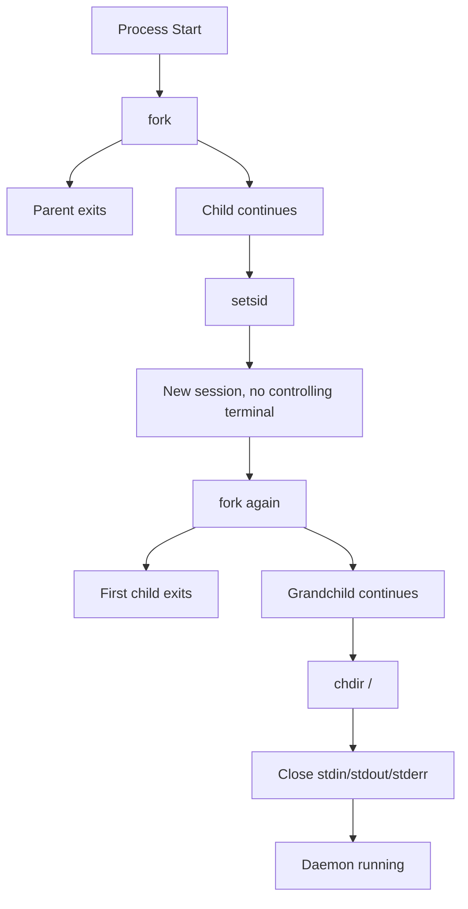

# Chapter 85: Sessions and Process Groups — setsid(), setpgid(), Controlling Terminal, Job Control

## 1. Intuition

Unix was designed from the start to support **multiple users sharing a single computer**, each with their own terminal session. The concepts of **sessions** and **process groups** provide the organizational structure for this sharing, enabling features like **job control** — the ability to suspend, resume, and background processes.

A **session** is a collection of processes associated with a login. It has a **controlling terminal** — the terminal device where the user types commands and sees output. Within a session, processes are organized into **process groups** (also called **jobs**). The shell creates a new process group for each command pipeline it runs, enabling the user to control foreground and background jobs with signals like `SIGTSTP` (Ctrl-Z), `SIGCONT` (fg/bg), and `SIGINT` (Ctrl-C).

Understanding sessions and process groups is essential for writing shells, terminal emulators, daemons, and any program that needs to manage its relationship with a terminal.

## 2. Architecture

### 2.1 Hierarchy

```
Session (SID)
    │
    ├── Controlling Terminal (/dev/ttyN or /dev/pts/N)
    │
    ├── Foreground Process Group (one per session)
    │   └── Processes in foreground receive terminal signals
    │
    ├── Background Process Group 1
    │   └── Processes don't receive terminal signals directly
    │
    └── Background Process Group 2
        └── ...
```

### 2.2 Key System Calls

| Function | Description |
|----------|-------------|
| `setsid()` | Create a new session (caller becomes session leader) |
| `getsid(pid)` | Get session ID of process |
| `setpgid(pid, pgid)` | Set process group of process |
| `getpgid(pid)` | Get process group ID |
| `getpgrp()` | Get process group of calling process |
| `tcsetpgrp(fd, pgrp)` | Set foreground process group on terminal |
| `tcgetpgrp(fd)` | Get foreground process group on terminal |
| `tcgetsid(fd)` | Get session ID from terminal fd |

### 2.3 Relationships

- Each process belongs to exactly one **process group**
- Each process group belongs to exactly one **session**
- Each session has at most one **controlling terminal**
- Each controlling terminal has exactly one **foreground process group**
- Background process groups don't receive terminal signals (SIGINT, SIGQUIT, SIGTSTP)

## 3. Kernel Implementation

### 3.1 Data Structures

```c
/* include/linux/sched/signal.h */
struct signal_struct {
    /* ... */
    struct task_struct *leader;         /* Session leader */
    struct tty_struct *tty;             /* Controlling terminal */
    int leader;                         /* Is this the session leader? */

    /* ... */
};

/* In task_struct */
struct task_struct {
    /* ... */
    pid_t pid;                          /* Process ID */
    pid_t tgid;                         /* Thread group ID */
    struct pid *thread_pid;

    /* Session and process group */
    struct signal_struct *signal;
    struct pid *pids[PIDTYPE_MAX];      /* PIDTYPE_PID, PIDTYPE_TGID, PIDTYPE_PGID */

    /* ... */
};
```

### 3.2 setsid() Implementation

```c
/* kernel/sys.c */
SYSCALL_DEFINE0(setsid) {
    struct task_struct *group_leader = current->group_leader;
    struct pid *pid;
    int err;

    /* Cannot create new session if already a process group leader */
    if (group_leader->pid == task_pgrp_vnr(group_leader))
        return -EPERM;

    /* Create new session and process group */
    pid = find_pid(0);  /* Allocate new PID for session */

    /* Set session ID */
    group_leader->signal->leader = 1;
    group_leader->signal->session = pid;

    /* Set process group ID (same as session ID) */
    set_task_pgrp(group_leader, pid);

    /* Detach from controlling terminal */
    group_leader->signal->tty = NULL;

    return task_session_vnr(group_leader);
}
```

### 3.3 setpgid() Implementation

```c
/* kernel/sys.c */
SYSCALL_DEFINE2(setpgid, pid_t, pid, pid_t, pgid) {
    struct task_struct *p;
    struct task_struct *group_leader = current->group_leader;
    struct pid *pgrp;
    int err;

    /* Find target process */
    if (pid)
        p = find_task_by_vpid(pid);
    else
        p = current;

    /* If pgid == 0, use pid as pgid */
    if (!pgid)
        pgid = p->pid;

    /* Cannot change session leader's process group */
    if (p->signal->leader)
        return -EPERM;

    /* Cannot change process group to another session */
    if (task_session(p) != task_session(group_leader))
        return -EPERM;

    /* Cannot change if process is session leader */
    if (p->pid == p->signal->session)
        return -EPERM;

    /* Find or create the target process group */
    pgrp = find_vpid(pgid);
    if (!pgrp) {
        /* Create new process group */
        pgrp = alloc_pid(...);
    }

    /* Set the process group */
    set_task_pgrp(p, pgrp);

    return 0;
}
```

### 3.4 Controlling Terminal

```c
/* drivers/tty/tty_io.c */
int tty_open(struct inode *inode, struct file *filp) {
    struct tty_struct *tty;

    /* Check if this is a controlling terminal */
    if (current->signal->tty == tty) {
        /* This is our controlling terminal */
    }

    /* ... */
}

/* Set controlling terminal */
int tiocsctty(struct tty_struct *tty, int arg) {
    struct task_struct *p = current;

    /* If arg == 1, steal the terminal (force) */
    if (arg == 1) {
        /* Must be session leader with no controlling terminal */
        if (!p->signal->leader || p->signal->tty)
            return -EPERM;
    }

    /* Set as controlling terminal */
    p->signal->tty = tty;
    tty->session = task_session(p);
    tty->pgrp = task_pgrp(p);

    return 0;
}
```

### 3.5 Terminal Signal Delivery

When the user types Ctrl-C, the terminal driver sends `SIGINT` to the foreground process group:

```c
/* drivers/tty/n_tty.c */
static void n_tty_receive_signal_char(struct tty_struct *tty, int signal) {
    /* Send signal to foreground process group */
    kill_pgrp(tty->pgrp, signal, 1);
}

/* Handle special characters */
static void n_tty_receive_char_special(struct tty_struct *tty, unsigned char c) {
    switch (c) {
    case INTR_CHAR(tty):    /* Ctrl-C */
        n_tty_receive_signal_char(tty, SIGINT);
        break;
    case QUIT_CHAR(tty):    /* Ctrl-\ */
        n_tty_receive_signal_char(tty, SIGQUIT);
        break;
    case SUSP_CHAR(tty):    /* Ctrl-Z */
        n_tty_receive_signal_char(tty, SIGTSTP);
        break;
    case START_CHAR(tty):   /* Ctrl-Q */
        n_tty_receive_signal_char(tty, SIGCONT);
        break;
    case STOP_CHAR(tty):    /* Ctrl-S */
        n_tty_receive_signal_char(tty, SIGSTOP);
        break;
    }
}
```

## 4. Source Code References

| File | Description |
|------|-------------|
| `kernel/sys.c` | `setsid()`, `setpgid()` implementation |
| `include/linux/sched/signal.h` | Signal/session structures |
| `drivers/tty/tty_io.c` | Controlling terminal management |
| `drivers/tty/n_tty.c` | Terminal line discipline, signal characters |
| `include/linux/tty.h` | TTY structures |
| `kernel/exit.c` | Session/process group cleanup on exit |

## 5. Data Structures

### 5.1 Process ID Types

```c
/* include/linux/pid.h */
enum pid_type {
    PIDTYPE_PID,    /* Process ID */
    PIDTYPE_TGID,   /* Thread group ID */
    PIDTYPE_PGID,   /* Process group ID */
    PIDTYPE_SID,    /* Session ID */
    PIDTYPE_MAX,
};
```

### 5.2 Process Group and Session in task_struct

```c
/* Simplified view of relevant task_struct fields */
struct task_struct {
    pid_t pid;                          /* Process ID */
    pid_t tgid;                         /* Thread group ID */

    /* Linked list of all processes in this process group */
    struct list_head thread_group;

    /* Signal struct (shared by all threads in group) */
    struct signal_struct *signal;
};

struct signal_struct {
    /* Session leader */
    struct task_struct *leader;         /* NULL if not leader */
    int leader;                         /* 1 if session leader */

    /* Controlling terminal */
    struct tty_struct *tty;             /* NULL if detached */

    /* Session and process group IDs */
    struct pid *session;                /* Session ID */
    struct pid *pgrp;                   /* Process group ID */
};
```

### 5.3 TTY Session Info

```c
/* include/linux/tty.h */
struct tty_struct {
    /* ... */
    struct pid *pgrp;                   /* Foreground process group */
    struct pid *session;                /* Session ID */
    /* ... */
};
```

## 6. C/Assembly Examples

### 6.1 Creating a New Session (Daemon)

```c
#include <stdio.h>
#include <stdlib.h>
#include <unistd.h>
#include <sys/stat.h>
#include <fcntl.h>

int daemonize(void) {
    pid_t pid;

    /* Fork and exit parent */
    pid = fork();
    if (pid < 0) return -1;
    if (pid > 0) exit(0);  /* Parent exits */

    /* Create new session (child becomes session leader) */
    if (setsid() < 0) return -1;

    /* Fork again to prevent acquiring a controlling terminal */
    pid = fork();
    if (pid < 0) return -1;
    if (pid > 0) exit(0);  /* First child exits */

    /* Now we're a grandchild, not a session leader, */
    /* so we can't acquire a controlling terminal */

    /* Change working directory */
    chdir("/");

    /* Close standard file descriptors and redirect to /dev/null */
    close(STDIN_FILENO);
    close(STDOUT_FILENO);
    close(STDERR_FILENO);

    open("/dev/null", O_RDONLY);  /* stdin */
    open("/dev/null", O_WRONLY);  /* stdout */
    open("/dev/null", O_WRONLY);  /* stderr */

    return 0;
}

int main(void) {
    if (daemonize() < 0) {
        perror("daemonize");
        return 1;
    }

    /* Daemon code here */
    while (1) {
        sleep(60);
    }

    return 0;
}
```

### 6.2 Process Group Manipulation

```c
#include <stdio.h>
#include <stdlib.h>
#include <unistd.h>
#include <sys/wait.h>

int main(void) {
    printf("Parent: PID=%d, PGID=%d, SID=%d\n",
           getpid(), getpgrp(), getsid(0));

    pid_t pid1 = fork();
    if (pid1 == 0) {
        /* Child 1: put in its own process group */
        setpgid(0, 0);  /* Use own PID as PGID */
        printf("Child1: PID=%d, PGID=%d, SID=%d\n",
               getpid(), getpgrp(), getsid(0));
        sleep(100);
        exit(0);
    }

    pid_t pid2 = fork();
    if (pid2 == 0) {
        /* Child 2: join child 1's process group */
        setpgid(0, pid1);
        printf("Child2: PID=%d, PGID=%d, SID=%d\n",
               getpid(), getpgrp(), getsid(0));
        sleep(100);
        exit(0);
    }

    /* Parent: set foreground process group (if we have a terminal) */
    tcsetpgrp(STDIN_FILENO, pid1);

    waitpid(pid1, NULL, 0);
    waitpid(pid2, NULL, 0);

    return 0;
}
```

### 6.3 Job Control Shell

```c
#include <stdio.h>
#include <stdlib.h>
#include <unistd.h>
#include <sys/wait.h>
#include <signal.h>
#include <termios.h>

pid_t foreground_pgid = 0;
struct termios saved_tty;

void init_shell(void) {
    /* Put ourselves in our own process group */
    setpgid(0, 0);

    /* Grab control of the terminal */
    tcsetpgrp(STDIN_FILENO, getpid());

    /* Save terminal settings */
    tcgetattr(STDIN_FILENO, &saved_tty);

    /* Ignore job control signals */
    signal(SIGTTOU, SIG_IGN);
    signal(SIGTTIN, SIG_IGN);
    signal(SIGTSTP, SIG_IGN);
}

void launch_foreground(char **argv) {
    pid_t pid = fork();

    if (pid == 0) {
        /* Child: new process group */
        setpgid(0, 0);

        /* Restore terminal settings */
        tcsetattr(STDIN_FILENO, TCSADRAIN, &saved_tty);

        /* Set as foreground process group */
        tcsetpgrp(STDIN_FILENO, getpid());

        execvp(argv[0], argv);
        perror("exec");
        exit(1);
    }

    /* Parent: wait for foreground job */
    setpgid(pid, pid);  /* Ensure child is in its own group */
    foreground_pgid = pid;
    tcsetpgrp(STDIN_FILENO, pid);

    int status;
    waitpid(pid, &status, WUNTRACED);

    /* Restore shell as foreground */
    tcsetpgrp(STDIN_FILENO, getpid());

    if (WIFSTOPPED(status)) {
        printf("Stopped by signal %d\n", WSTOPSIG(status));
    }
}

void launch_background(char **argv) {
    pid_t pid = fork();

    if (pid == 0) {
        setpgid(0, 0);
        execvp(argv[0], argv);
        perror("exec");
        exit(1);
    }

    setpgid(pid, pid);
    printf("[%d] %d\n", 1, pid);  /* Job number, PID */
}

int main(void) {
    init_shell();

    char *line = NULL;
    size_t len = 0;

    while (1) {
        printf("myshell$ ");
        fflush(stdout);

        if (getline(&line, &len, stdin) == -1)
            break;

        /* Parse command */
        /* ... simplified ... */
        char *argv[] = {"/bin/ls", NULL};

        launch_foreground(argv);
    }

    return 0;
}
```

### 6.4 Getting Session and Process Group Info

```c
#include <stdio.h>
#include <unistd.h>
#include <sys/types.h>

int main(void) {
    printf("Process Info:\n");
    printf("  PID:  %d\n", getpid());
    printf("  PPID: %d\n", getppid());
    printf("  PGID: %d\n", getpgrp());
    printf("  SID:  %d\n", getsid(0));

    /* Read from /proc */
    char path[256];
    snprintf(path, sizeof(path), "/proc/%d/stat", getpid());

    FILE *f = fopen(path, "r");
    if (f) {
        int pid, pgrp, session;
        char comm[256], state;
        /* ... parse /proc/PID/stat ... */
        fclose(f);
    }

    return 0;
}
```

### 6.5 setsid() Assembly (x86-64)

```asm
; x86-64: setsid()
; Syscall number 112

section .text
global _start

_start:
    mov     rax, 112        ; __NR_setsid
    syscall

    ; rax = new session ID (== PID of caller)

    ; Exit
    mov     rdi, 0
    mov     rax, 60
    syscall
```

## 7. Diagrams

### 7.1 Session and Process Group Hierarchy



### 7.2 Terminal Signal Flow



### 7.3 Daemon Creation Flow



## 8. Performance

### 8.1 Performance Considerations

- **Process group operations**: O(1) — just updating pointers
- **Session creation**: O(1) — minimal work
- **Terminal signal delivery**: O(n) where n = processes in foreground group
- **tcsetpgrp()**: Involves TTY locking, may block

### 8.2 Shell Performance

- **Job tracking overhead**: Shells maintain job lists
- **Terminal switching**: tcsetpgrp() involves TTY driver locks
- **Signal delivery**: Multiple signals to process groups can be expensive

## 9. Security

### 9.1 Security Implications

1. **Controlling terminal**: Can be used for input injection
2. **Process groups**: Can receive signals from terminal
3. **Session hijacking**: If attacker can access the controlling terminal

### 9.2 Secure Daemon Practices

```c
/* Properly detach from terminal */
void secure_daemonize(void) {
    /* Create new session */
    if (setsid() < 0) {
        perror("setsid");
        exit(1);
    }

    /* Reopen stdin/stdout/stderr to /dev/null */
    int fd = open("/dev/null", O_RDWR);
    dup2(fd, STDIN_FILENO);
    dup2(fd, STDOUT_FILENO);
    dup2(fd, STDERR_FILENO);
    close(fd);
}
```

## 10. Common Pitfalls

### Pitfall 1: Not Detaching from Terminal

```c
/* WRONG: Daemon still attached to terminal */
int main(void) {
    if (fork() > 0) exit(0);
    /* Still has controlling terminal! */
    while (1) { sleep(1); }
}

/* RIGHT: Properly detach */
int main(void) {
    if (fork() > 0) exit(0);
    setsid();  /* Create new session */
    if (fork() > 0) exit(0);  /* Prevent re-acquiring terminal */
    while (1) { sleep(1); }
}
```

### Pitfall 2: Race Condition with setpgid()

```c
/* WRONG: Race between parent and child */
if (fork() == 0) {
    /* Child: set own process group */
    setpgid(0, 0);  /* May happen before or after parent */
}

/* RIGHT: Set in both parent and child */
pid_t pid = fork();
if (pid == 0) {
    setpgid(0, 0);
    execvp(...);
} else {
    setpgid(pid, pid);  /* Parent sets too */
}
```

### Pitfall 3: Ignoring SIGTTOU

```c
/* WRONG: Background process tries to write to terminal */
/* Gets SIGTTOU and stops */

/* RIGHT: Handle or ignore SIGTTOU */
signal(SIGTTOU, SIG_IGN);
```

### Pitfall 4: Forgetting to Restore Terminal Settings

```c
/* WRONG: Terminal left in raw mode after program exits */
struct termios raw;
tcgetattr(STDIN_FILENO, &raw);
cfmakeraw(&raw);
tcsetattr(STDIN_FILENO, TCSAFLUSH, &raw);
/* Program exits without restoring */

/* RIGHT: Save and restore */
struct termios original, raw;
tcgetattr(STDIN_FILENO, &original);
raw = original;
cfmakeraw(&raw);
tcsetattr(STDIN_FILENO, TCSAFLUSH, &raw);

/* On exit */
tcsetattr(STDIN_FILENO, TCSAFLUSH, &original);
```

### Pitfall 5: Session Leader Can't Create New Session

```c
/* WRONG: setsid() fails for session leaders */
if (fork() == 0) {
    setsid();  /* Works because child is not a session leader */
}
/* But if parent calls setsid(), it fails if it's already a session leader */

/* RIGHT: Fork first, then setsid() in child */
```

### Pitfall 6: Process Group ID After exec()

```c
/* WRONG: Assuming process group ID survives exec() */
setpgid(0, 0);
execvp(...);  /* Process group ID is preserved, but what if exec fails? */

/* RIGHT: Set process group in both parent and child before exec() */

## 11. Best Practices

1. **Always use `setsid()` for daemons**: Detach from controlling terminal
2. **Double fork for daemons**: Prevents re-acquiring a terminal
3. **Set process groups for job control**: Enable proper signal delivery
4. **Ignore terminal signals in shell**: SIGTTOU, SIGTTIN, SIGTSTP
5. **Use `tcsetpgrp()` carefully**: Only from the foreground group
6. **Clean up on exit**: Remove from job lists, restore terminal settings

### Terminal Control Deep Dive

The controlling terminal is central to session management. Here's how it works:

- **Acquisition**: A session leader that opens a terminal acquires it as its controlling terminal (if no other session has it)
- **TIOCSTTY**: The `ioctl(fd, TIOCSTTY, 0)` call explicitly sets the controlling terminal
- **Release**: The controlling terminal is released when the session leader exits
- **Foreground group**: Only the foreground process group receives terminal input and signals

### Job Control in Practice

Job control is implemented through the interaction of sessions, process groups, and signals:

1. **Ctrl-Z (SIGTSTP)**: Terminal driver sends SIGTSTP to foreground group
2. **bg command**: Shell sends SIGCONT to the stopped background group
3. **fg command**: Shell moves a background group to foreground and sends SIGCONT
4. **Ctrl-C (SIGINT)**: Terminal driver sends SIGINT to foreground group

The shell maintains a job table mapping job numbers to process groups:

```c
/* Simplified shell job table */
typedef struct {
    int job_id;
    pid_t pgid;            /* Process group ID */
    int status;            /* Running, Stopped, Done */
    char *command;         /* Command line */
    struct termios tmodes; /* Saved terminal modes */
} job_t;

job_t jobs[MAX_JOBS];
int num_jobs = 0;
```

### Pseudo-Terminals (PTY)

For programs that need a terminal but don't have one (like terminal emulators or sshd), Linux provides pseudo-terminals:

```c
#include <stdlib.h>
#include <fcntl.h>

int create_pty(void) {
    /* Open the PTY master */
    int master_fd = open("/dev/ptmx", O_RDWR);
    if (master_fd < 0)
        return -1;

    /* Grant access to the slave */
    grantpt(master_fd);
    unlockpt(master_fd);

    /* Get slave device name */
    char *slave_name = ptsname(master_fd);
    printf("Slave PTY: %s\n", slave_name);

    /* Open the slave */
    int slave_fd = open(slave_name, O_RDWR);

    /* Set slave as controlling terminal for child */
    /* ... */

    return master_fd;
}
```

### Session Logout and Cleanup

When a session leader exits, several things happen:

1. **SIGHUP sent**: All processes in the foreground group receive SIGHUP
2. **Controlling terminal released**: Other sessions can acquire it
3. **Process reparenting**: Orphans are reparented to init
4. **Job table cleanup**: Shell removes completed jobs

## 12. Exercises

### Exercise 1: Simple Shell with Job Control

Write a shell that supports:
- Foreground and background execution
- Ctrl-Z to suspend foreground jobs
- `fg` and `bg` built-in commands
- Job listing with `jobs`

### Exercise 2: Session Info Reporter

Write a program that displays complete session and process group information for a given PID, reading from `/proc`.

### Exercise 3: Controlling Terminal Detector

Write a program that determines its controlling terminal and can detach from it.

### Exercise 4: Process Group Signal Experiment

Write a program that creates multiple process groups and demonstrates that signals sent to one group don't affect another.

### Exercise 5: Login Session Simulator

Write a program that simulates a login session, creating a session leader with a pseudo-terminal (PTY).

### Exercise 6: Terminal I/O Demonstration

Write a program that demonstrates:
- Foreground vs. background terminal access
- SIGTTOU when background process tries to write
- SIGTTIN when background process tries to read
- How tcsetpgrp() changes the foreground group

### Exercise 7: Daemon with Signal Handling

Write a daemon that:
1. Properly daemonizes with setsid() and double fork
2. Handles SIGHUP for configuration reload
3. Handles SIGTERM for graceful shutdown
4. Handles SIGUSR1 for status reporting
5. Logs to syslog

## 13. References

1. **Linux kernel source**: `kernel/sys.c` — `setsid()`, `setpgid()`
2. **Linux kernel source**: `drivers/tty/tty_io.c` — TTY management
3. **man pages**: `setsid(2)`, `setpgid(2)`, `tcsetpgrp(3)`, `tcgetpgrp(3)`
4. **"Advanced Programming in the UNIX Environment"** by Stevens & Rago, Chapter 9
5. **"The Design and Implementation of the 4.4BSD Operating System"** — Session/TTY
6. **POSIX.1-2017**: Session and process group specifications
7. **The TTY demystified** — https://www.linusakesson.net/programming/tty/
8. **"Understanding the Linux Kernel"** by Bovet & Cesati
