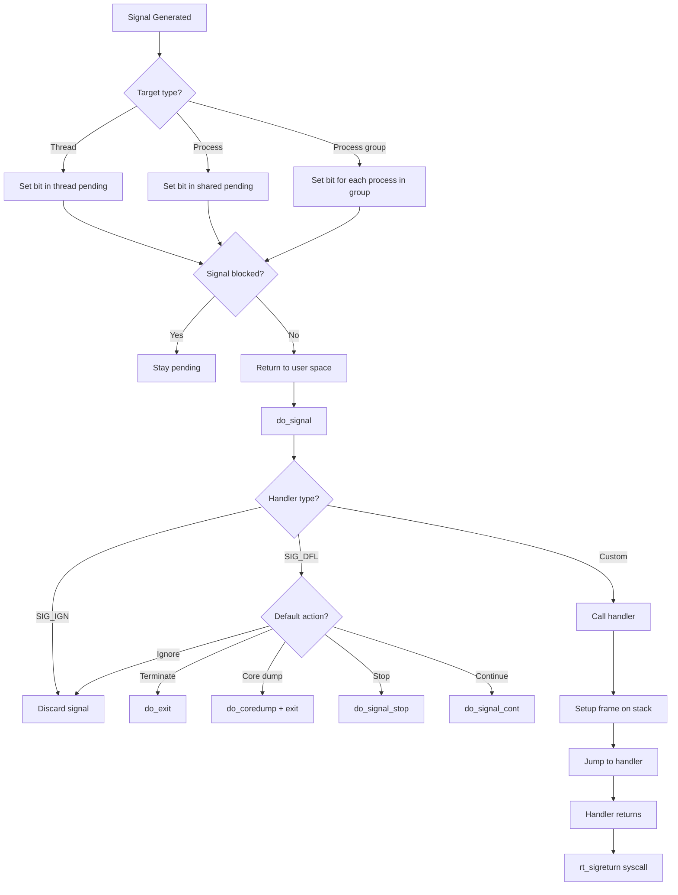
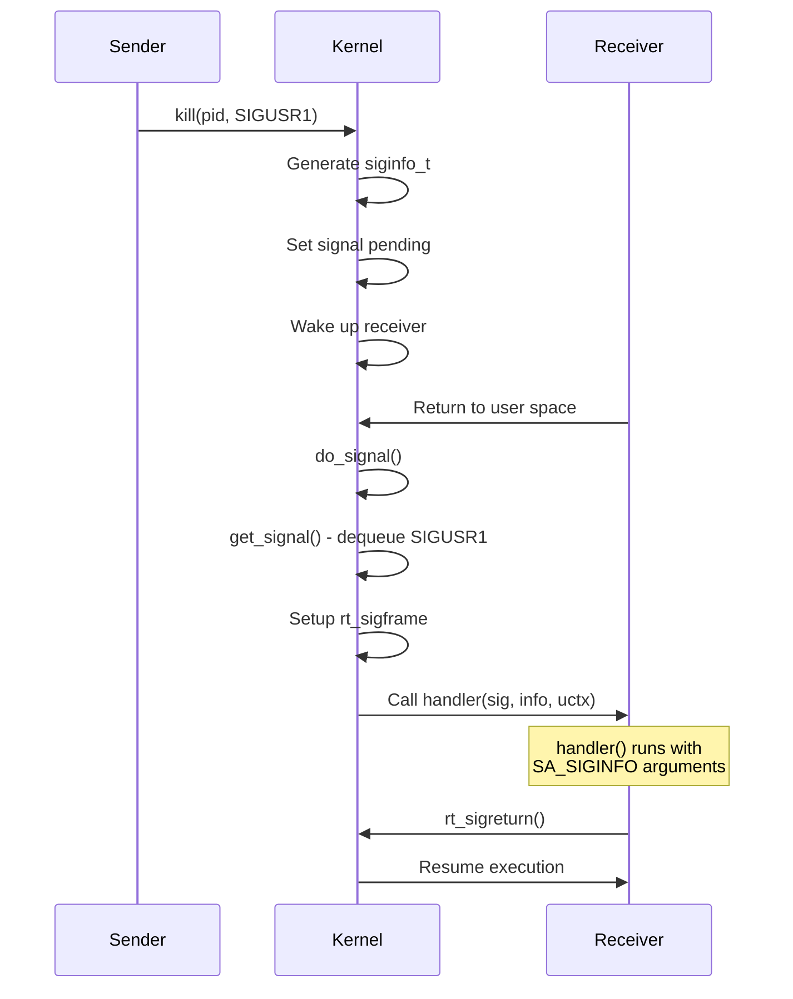
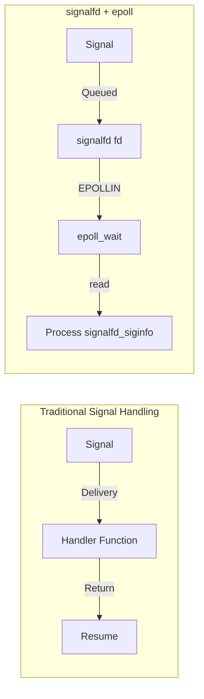

# Chapter 86: Signals — Deep Dive: Signal Delivery, SA_SIGINFO, Real-Time Signals, signalfd

## 1. Intuition

Signals are the oldest form of inter-process communication in Unix. They are **asynchronous notifications** sent to a process to inform it of events — from simple requests like "please terminate" (`SIGTERM`) to hardware exceptions like "you accessed invalid memory" (`SIGSEGV`).

Think of signals as **interrupts for user space**. Just as hardware interrupts notify the kernel of device events, signals notify processes of events that require attention. The process can choose to handle the signal with a custom function, ignore it, or accept the default action (which is often to terminate).

Modern Linux has extended the signal mechanism significantly. **Real-time signals** provide queuing and data delivery. **signalfd()** allows signal handling through file descriptors, integrating signals with event loops. **SA_SIGINFO** delivers detailed information about the signal's origin.

## 2. Architecture

### 2.1 Signal Lifecycle

```
Signal Generated (kernel or another process)
    │
    ├── Signal Pending (bit set in pending mask)
    │
    ├── Signal Blocked? (bit set in blocked mask)
    │   ├── Yes: Stay pending until unblocked
    │   └── No: Deliver on next return to user space
    │
    └── Signal Delivery
        ├── Default action (terminate, ignore, stop, continue)
        ├── User handler (signal function called)
        └── signalfd (read from fd)
```

### 2.2 Standard Signals

| Signal | Number | Default Action | Description |
|--------|--------|---------------|-------------|
| `SIGHUP` | 1 | Terminate | Hangup (terminal close) |
| `SIGINT` | 2 | Terminate | Interrupt (Ctrl-C) |
| `SIGQUIT` | 3 | Core dump | Quit (Ctrl-\) |
| `SIGILL` | 4 | Core dump | Illegal instruction |
| `SIGTRAP` | 5 | Core dump | Trace/breakpoint trap |
| `SIGABRT` | 6 | Core dump | Abort |
| `SIGBUS` | 7 | Core dump | Bus error |
| `SIGFPE` | 8 | Core dump | Floating point exception |
| `SIGKILL` | 9 | Terminate | **Cannot be caught or ignored** |
| `SIGUSR1` | 10 | Terminate | User-defined signal 1 |
| `SIGSEGV` | 11 | Core dump | Segmentation fault |
| `SIGUSR2` | 12 | Terminate | User-defined signal 2 |
| `SIGPIPE` | 13 | Terminate | Broken pipe |
| `SIGALRM` | 14 | Terminate | Timer alarm |
| `SIGTERM` | 15 | Terminate | Graceful termination |
| `SIGCHLD` | 17 | Ignore | Child process changed |
| `SIGCONT` | 19 | Continue | Continue if stopped |
| `SIGSTOP` | 19 | Stop | **Cannot be caught or ignored** |
| `SIGTSTP` | 20 | Stop | Terminal stop (Ctrl-Z) |

### 2.3 Real-Time Signals

- Range: `SIGRTMIN` (usually 34) to `SIGRTMAX` (usually 64)
- **Queued**: Multiple instances of the same signal are queued, not lost
- **Data delivery**: Can carry an integer or pointer value
- **Ordering**: Lower-numbered RT signals are delivered first

## 3. Kernel Implementation

### 3.1 Signal Generation

```c
/* kernel/signal.c */
int send_signal_locked(int sig, struct kernel_siginfo *info,
                       struct task_struct *t, enum pid_type type) {
    struct sigpending *pending;
    struct sigqueue *q;

    /* Determine target: thread, thread group, or process group */
    switch (type) {
    case PIDTYPE_PID:
        pending = &t->pending;
        break;
    case PIDTYPE_TGID:
        pending = &t->signal->shared_pending;
        break;
    case PIDTYPE_PGID:
        /* Send to all processes in group */
        /* ... */
        break;
    }

    /* For real-time signals, queue the signal */
    if (sig >= SIGRTMIN && sig <= SIGRTMAX) {
        q = sigqueue_alloc();
        q->info = *info;
        list_add_tail(&q->list, &pending->list);
    }

    /* Set signal bit in pending mask */
    sigaddset(&pending->signal, sig);

    /* Wake up the target if sleeping */
    signal_wake_up(t, sig == SIGKILL);

    return 0;
}
```

### 3.2 Signal Delivery

Signals are delivered on return to user space, in `do_signal()` or `do_notify_resume()`:

```c
/* arch/x86/kernel/signal.c */
static void do_signal(struct pt_regs *regs) {
    struct ksignal ksig;

    /* Get a pending signal to deliver */
    if (get_signal(&ksig)) {
        /* Deliver the signal */
        handle_signal(&ksig, regs);
    }

    /* If no signals, handle syscall restart */
    /* ... */
}
```

### 3.3 get_signal() — Selecting a Signal to Deliver

```c
/* kernel/signal.c */
bool get_signal(struct ksignal *ksig) {
    struct sighand_struct *sighand = current->sighand;
    struct signal_struct *signal = current->signal;
    sigset_t *mask = &current->blocked;
    int signr;

    /* Check for group exit */
    if (signal->flags & SIGNAL_GROUP_EXIT)
        do_group_exit(signal->group_exit_code);

    /* Dequeue a signal */
    for (;;) {
        struct k_sigaction *ka;

        /* Check shared pending first (process-directed) */
        signr = dequeue_signal(current, mask, &ksig->info);

        if (!signr)
            break;  /* No signals */

        /* Get the signal action */
        ka = &sighand->sa[signr - 1];

        if (ka->sa.sa_handler == SIG_IGN) {
            /* Ignore the signal */
            continue;
        }

        if (ka->sa.sa_handler == SIG_DFL) {
            /* Default action */
            switch (default_action(signr)) {
            case SIGNAL_CONTINUE:
                continue;
            case SIGNAL_STOP:
                do_signal_stop(signr);
                continue;
            case SIGNAL_TERMINATE:
                do_group_exit(signr);
                /* NOTREACHED */
            case SIGNAL_CORE_DUMP:
                do_coredump(&ksig->info);
                do_group_exit(signr);
                /* NOTREACHED */
            }
        }

        /* User handler — deliver the signal */
        ksig->sig = signr;
        ksig->ka = *ka;
        return true;
    }

    return false;
}
```

### 3.4 Signal Handler Setup: rt_sigaction()

```c
/* kernel/signal.c */
SYSCALL_DEFINE4(rt_sigaction, int, sig,
                const struct sigaction __user *, act,
                struct sigaction __user *, oact, size_t, sigsetsize) {
    struct k_sigaction new_sa, old_sa;
    int ret;

    /* Validate signal number */
    if (sig < 1 || sig > _NSIG)
        return -EINVAL;

    /* Copy new action from user space */
    if (act) {
        if (copy_from_user(&new_sa.sa, act, sizeof(new_sa.sa)))
            return -EFAULT;
    }

    /* Install the new handler */
    ret = do_sigaction(sig, act ? &new_sa : NULL, oact ? &old_sa : NULL);

    /* Copy old action to user space */
    if (oact && !ret)
        if (copy_to_user(&oact, &old_sa.sa, sizeof(old_sa.sa)))
            return -EFAULT;

    return ret;
}
```

### 3.5 SA_SIGINFO Handler Invocation

When `SA_SIGINFO` is set, the signal handler receives three arguments:

```c
/* arch/x86/kernel/signal.c - simplified */
static void setup_rt_frame(int sig, struct ksignal *ksig,
                           sigset_t *set, struct pt_regs *regs) {
    struct rt_sigframe __user *frame;

    /* Build signal frame on user stack */
    frame = get_sigframe(ksig, regs, sizeof(*frame));

    /* Set up info structure for SA_SIGINFO */
    if (ksig->ka.sa.sa_flags & SA_SIGINFO) {
        /* Copy siginfo to user stack */
        if (copy_siginfo_to_user(&frame->info, &ksig->info))
            goto give_sigsegv;
    }

    /* Set up register state for handler */
    regs->sp = (unsigned long)frame;
    regs->ip = (unsigned long)ksig->ka.sa.sa_handler;

    /* For SA_SIGINFO: handler(int sig, siginfo_t *info, void *ucontext) */
    regs->di = sig;                              /* First argument */
    regs->si = (unsigned long)&frame->info;      /* Second argument */
    regs->dx = (unsigned long)&frame->uc;        /* Third argument */

    /* Set up return address (sigreturn) */
    regs->cx = (unsigned long)frame->retcode;
}
```

### 3.6 signalfd Implementation

```c
/* fs/signalfd.c */
SYSCALL_DEFINE4(signalfd4, int, ufd, sigset_t __user *, user_mask,
                size_t, sizemask, int, flags) {
    sigset_t sigmask;

    /* Copy signal mask from user */
    if (copy_from_user(&sigmask, user_mask, sizeof(sigmask)))
        return -EFAULT;

    /* Create or update signalfd */
    if (ufd == -1) {
        /* Create new signalfd */
        return anon_inode_getfd("[signalfd]", &signalfd_fops, ...);
    } else {
        /* Update existing signalfd */
        /* ... */
    }
}

/* Reading from signalfd */
static ssize_t signalfd_read(struct file *file, char __user *buf,
                              size_t count, loff_t *ppos) {
    struct signalfd_ctx *ctx = file->private_data;
    struct signalfd_siginfo __user *siginfo = (void __user *)buf;

    /* Wait for signals */
    spin_lock_irq(&current->sighand->siglock);

    while (1) {
        siginfo_t info;
        int signr;

        /* Dequeue a signal that matches our mask */
        signr = dequeue_signal(current, &ctx->sigmask, &info);

        if (signr) {
            /* Convert to signalfd_siginfo and copy to user */
            struct signalfd_siginfo si;
            memset(&si, 0, sizeof(si));
            si.ssi_signo = info.si_signo;
            si.ssi_errno = info.si_errno;
            si.ssi_code = info.si_code;
            si.ssi_pid = info.si_pid;
            si.ssi_uid = info.si_uid;
            si.ssi_status = info.si_status;

            spin_unlock_irq(&current->sighand->siglock);

            if (copy_to_user(siginfo, &si, sizeof(si)))
                return -EFAULT;

            return sizeof(si);
        }

        /* No signal available */
        if (file->f_flags & O_NONBLOCK) {
            spin_unlock_irq(&current->sighand->siglock);
            return -EAGAIN;
        }

        /* Wait for signal */
        set_current_state(TASK_INTERRUPTIBLE);
        spin_unlock_irq(&current->sighand->siglock);
        schedule();
        spin_lock_irq(&current->sighand->siglock);
    }
}
```

## 4. Source Code References

| File | Description |
|------|-------------|
| `kernel/signal.c` | Core signal handling |
| `arch/x86/kernel/signal.c` | x86 signal delivery |
| `fs/signalfd.c` | signalfd implementation |
| `include/linux/signal.h` | Signal structures and macros |
| `include/uapi/asm-generic/signal.h` | Signal number definitions |
| `include/uapi/linux/signalfd.h` | signalfd structures |

## 5. Data Structures

### 5.1 Signal Structures

```c
/* include/linux/signal_types.h */
struct sigpending {
    struct list_head list;      /* Queued signals (real-time) */
    sigset_t signal;            /* Bit mask of pending signals */
};

struct sigqueue {
    struct list_head list;
    int flags;
    kernel_siginfo_t info;
    struct ucounts *ucounts;
};

struct sigaction {
    __sighandler_t sa_handler;
    unsigned long sa_flags;
    sigset_t sa_mask;           /* Signals blocked during handler */
};

/* In task_struct */
struct task_struct {
    /* ... */
    struct signal_struct *signal;       /* Shared by thread group */
    struct sighand_struct *sighand;     /* Signal handlers */
    sigset_t blocked;                   /* Blocked signals */
    sigset_t real_blocked;              /* Saved blocked mask */
    struct sigpending pending;          /* Thread-private pending */
    /* ... */
};

struct signal_struct {
    /* ... */
    struct sigpending shared_pending;   /* Process-wide pending */
    /* ... */
};

struct sighand_struct {
    /* ... */
    struct k_sigaction sa[_NSIG];       /* Signal handlers */
    spinlock_t siglock;
    /* ... */
};
```

### 5.2 siginfo_t

```c
/* include/uapi/asm-generic/siginfo.h */
typedef struct siginfo {
    int si_signo;       /* Signal number */
    int si_errno;       /* Error number */
    int si_code;        /* Signal code */
    union {
        /* kill() */
        struct {
            pid_t si_pid;
            uid_t si_uid;
        } _kill;

        /* POSIX timer */
        struct {
            timer_t si_tid;
            int si_overrun;
            sigval_t si_sigval;
        } _timer;

        /* POSIX.1b signals */
        struct {
            pid_t si_pid;
            uid_t si_uid;
            sigval_t si_sigval;
        } _rt;

        /* SIGCHLD */
        struct {
            pid_t si_pid;
            uid_t si_uid;
            int si_status;
            clock_t si_utime;
            clock_t si_stime;
        } _sigchld;

        /* SIGILL, SIGFPE, SIGSEGV, SIGBUS */
        struct {
            void __user *si_addr;
            short si_addr_lsb;
            union {
                void __user *si_addr_bnd;
                /* ... */
            };
        } _sigfault;

        /* SIGPOLL */
        struct {
            long si_band;
            int si_fd;
        } _sigpoll;
    } _sifields;
} siginfo_t;
```

### 5.3 signalfd_siginfo

```c
/* include/uapi/linux/signalfd.h */
struct signalfd_siginfo {
    __u32 ssi_signo;
    __s32 ssi_errno;
    __s32 ssi_code;
    __u32 ssi_pid;
    __u32 ssi_uid;
    __s32 ssi_fd;
    __u32 ssi_tid;
    __u32 ssi_band;
    __u32 ssi_overrun;
    __u32 ssi_trapno;
    __s32 ssi_status;
    __s32 si_int;
    __u64 ssi_ptr;
    __u64 ssi_utime;
    __u64 ssi_stime;
    __u64 ssi_addr;
    __u16 ssi_addr_lsb;
    __u16 __pad2;
    __s32 ssi_syscall;
    __u64 ssi_call_addr;
    __u32 ssi_arch;
    __u8 __pad[28];
};
```

## 6. C/Assembly Examples

### 6.1 Basic Signal Handler

```c
#include <stdio.h>
#include <stdlib.h>
#include <signal.h>
#include <unistd.h>

volatile sig_atomic_t got_signal = 0;

void handler(int sig) {
    got_signal = 1;
}

int main(void) {
    struct sigaction sa;
    sa.sa_handler = handler;
    sigemptyset(&sa.sa_mask);
    sa.sa_flags = SA_RESTART;  /* Restart interrupted syscalls */

    sigaction(SIGINT, &sa, NULL);
    sigaction(SIGTERM, &sa, NULL);

    printf("PID %d: Send SIGINT (Ctrl-C) or SIGTERM\n", getpid());

    while (!got_signal) {
        pause();
    }

    printf("Signal received, cleaning up...\n");
    return 0;
}
```

### 6.2 SA_SIGINFO Handler

```c
#include <stdio.h>
#include <stdlib.h>
#include <signal.h>
#include <unistd.h>

void siginfo_handler(int sig, siginfo_t *info, void *ucontext) {
    printf("Signal %d received\n", sig);
    printf("  Sender PID:  %d\n", info->si_pid);
    printf("  Sender UID:  %d\n", info->si_uid);
    printf("  Signal code: %d\n", info->si_code);

    switch (sig) {
    case SIGSEGV:
        printf("  Fault address: %p\n", info->si_addr);
        printf("  Fault type: %s\n",
               info->si_code == SEGV_MAPERR ? "Address not mapped" : "Permission denied");
        break;
    case SIGCHLD:
        printf("  Child PID:  %d\n", info->si_pid);
        printf("  Exit status: %d\n", info->si_status);
        break;
    case SIGILL:
        printf("  Fault address: %p\n", info->si_addr);
        break;
    }
}

int main(void) {
    struct sigaction sa;
    sa.sa_sigaction = siginfo_handler;
    sigemptyset(&sa.sa_mask);
    sa.sa_flags = SA_SIGINFO;  /* Use siginfo_t handler */

    sigaction(SIGSEGV, &sa, NULL);
    sigaction(SIGBUS, &sa, NULL);
    sigaction(SIGFPE, &sa, NULL);

    /* Trigger a segfault */
    int *p = NULL;
    *p = 42;

    return 0;
}
```

### 6.3 Real-Time Signal Example

```c
#include <stdio.h>
#include <stdlib.h>
#include <signal.h>
#include <unistd.h>
#include <sys/wait.h>

#define MY_RT_SIGNAL (SIGRTMIN + 1)

void rt_handler(int sig, siginfo_t *info, void *ucontext) {
    printf("RT Signal %d received\n", sig);
    printf("  Sender PID: %d\n", info->si_pid);
    printf("  Value:      %d\n", info->si_int);
}

int main(void) {
    /* Install RT signal handler */
    struct sigaction sa;
    sa.sa_sigaction = rt_handler;
    sigemptyset(&sa.sa_mask);
    sa.sa_flags = SA_SIGINFO | SA_RESTART;
    sigaction(MY_RT_SIGNAL, &sa, NULL);

    pid_t pid = fork();
    if (pid == 0) {
        /* Child: send RT signals with data */
        for (int i = 0; i < 5; i++) {
            union sigval val;
            val.sival_int = i * 100;

            printf("Sending RT signal %d with value %d\n", MY_RT_SIGNAL, val.sival_int);
            sigqueue(getppid(), MY_RT_SIGNAL, val);
            usleep(500000);
        }
        _exit(0);
    }

    /* Parent: receive RT signals */
    for (int i = 0; i < 5; i++) {
        pause();
    }

    waitpid(pid, NULL, 0);
    printf("All RT signals received\n");

    return 0;
}
```

### 6.4 signalfd Example

```c
#include <stdio.h>
#include <stdlib.h>
#include <signal.h>
#include <unistd.h>
#include <sys/signalfd.h>
#include <sys/epoll.h>
#include <sys/wait.h>

int main(void) {
    sigset_t mask;

    /* Block signals that we'll handle via signalfd */
    sigemptyset(&mask);
    sigaddset(&mask, SIGINT);
    sigaddset(&mask, SIGTERM);
    sigaddset(&mask, SIGCHLD);
    sigaddset(&mask, SIGRTMIN);

    /* Block signals from normal delivery */
    sigprocmask(SIG_BLOCK, &mask, NULL);

    /* Create signalfd */
    int sfd = signalfd(-1, &mask, SFD_NONBLOCK | SFD_CLOEXEC);
    if (sfd == -1) {
        perror("signalfd");
        return 1;
    }

    /* Set up epoll */
    int epfd = epoll_create1(0);
    struct epoll_event ev = {
        .events = EPOLLIN,
        .data.fd = sfd,
    };
    epoll_ctl(epfd, EPOLL_CTL_ADD, sfd, &ev);

    /* Spawn a child to generate signals */
    pid_t pid = fork();
    if (pid == 0) {
        sleep(1);
        kill(getppid(), SIGINT);
        sleep(1);
        kill(getppid(), SIGRTMIN);
        sleep(1);
        kill(getppid(), SIGTERM);
        _exit(0);
    }

    /* Event loop with signalfd */
    struct epoll_event events[10];
    int running = 1;

    while (running) {
        int nfds = epoll_wait(epfd, events, 10, -1);

        for (int i = 0; i < nfds; i++) {
            if (events[i].data.fd == sfd) {
                struct signalfd_siginfo fdsi;
                ssize_t n;

                while ((n = read(sfd, &fdsi, sizeof(fdsi))) > 0) {
                    printf("Signal %d from PID %d\n",
                           fdsi.ssi_signo, fdsi.ssi_pid);

                    if (fdsi.ssi_signo == SIGTERM) {
                        running = 0;
                    }
                }
            }
        }
    }

    waitpid(pid, NULL, 0);
    close(sfd);
    close(epfd);

    printf("Clean exit\n");
    return 0;
}
```

### 6.5 Signal Mask Manipulation

```c
#include <stdio.h>
#include <signal.h>
#include <unistd.h>

void print_sigset(const char *name, const sigset_t *set) {
    printf("%s: ", name);
    for (int sig = 1; sig < NSIG; sig++) {
        if (sigismember(set, sig)) {
            printf("%d ", sig);
        }
    }
    printf("\n");
}

int main(void) {
    sigset_t set, oldset;

    /* Get current signal mask */
    sigprocmask(SIG_SETMASK, NULL, &oldset);
    print_sigset("Current mask", &oldset);

    /* Block SIGUSR1 and SIGUSR2 */
    sigemptyset(&set);
    sigaddset(&set, SIGUSR1);
    sigaddset(&set, SIGUSR2);

    sigprocmask(SIG_BLOCK, &set, &oldset);
    print_sigset("After blocking USR1/USR2", &oldset);

    /* Send SIGUSR1 to ourselves */
    raise(SIGUSR1);
    printf("SIGUSR1 sent and blocked\n");

    /* Check pending signals */
    sigset_t pending;
    sigpending(&pending);
    print_sigset("Pending signals", &pending);

    /* Unblock SIGUSR1 */
    sigdelset(&set, SIGUSR1);
    sigprocmask(SIG_UNBLOCK, &set, NULL);
    printf("SIGUSR1 unblocked — should be delivered now\n");

    return 0;
}
```

## 7. Diagrams

### 7.1 Signal Delivery Flow



### 7.2 SA_SIGINFO Handler Invocation



### 7.3 signalfd Integration



## 8. Performance

### 8.1 Signal Delivery Performance

- **Standard signals**: O(1) delivery, non-queued (may be lost)
- **Real-time signals**: O(n) where n = queued signals, guaranteed delivery
- **signalfd**: Adds syscall overhead but integrates with event loops

### 8.2 Signal-related Overhead

| Operation | Cost |
|-----------|------|
| `kill()` | ~1-2 μs |
| `sigaction()` | ~0.5 μs |
| `sigprocmask()` | ~0.3 μs |
| `signalfd()` read | ~2-5 μs |
| Signal handler invocation | ~1-3 μs |

### 8.3 Performance Tips

1. **Use `signalfd` + `epoll`** for event-driven programs
2. **Avoid frequent signals** for communication (use pipes/eventfd instead)
3. **Real-time signals** have overhead for queuing — don't overuse
4. **`SA_RESTART`** avoids EINTR but adds kernel complexity

## 9. Security

### 9.1 Signal Security Rules

1. **Permission**: Sender must have appropriate permissions (same UID, CAP_KILL, etc.)
2. **SIGKILL/SIGSTOP**: Cannot be caught or blocked
3. **Setuid processes**: Special handling for signal delivery

### 9.2 Signal-related Attacks

1. **Signal flooding**: Sending many signals can disrupt processes
2. **Race conditions**: Signals can interrupt critical sections
3. **Information leakage**: `siginfo_t` reveals sender PID/UID

### 9.3 Secure Signal Handling

```c
/* Block all signals during critical section */
sigset_t mask, oldmask;
sigfillset(&mask);
sigprocmask(SIG_BLOCK, &mask, &oldmask);

/* Critical section — no signals will be delivered */

sigprocmask(SIG_SETMASK, &oldmask, NULL);  /* Restore */
```

## 10. Common Pitfalls

### Pitfall 1: Non-async-signal-safe Functions in Handlers

```c
/* WRONG: printf() is not async-signal-safe */
void handler(int sig) {
    printf("Got signal %d\n", sig);  /* UNSAFE */
}

/* RIGHT: Use write() which is async-signal-safe */
void handler(int sig) {
    const char msg[] = "Got signal\n";
    write(STDOUT_FILENO, msg, sizeof(msg) - 1);
}
```

### Pitfall 2: Race Between Signal and sigprocmask()

```c
/* WRONG: Signal can arrive between fork and sigprocmask */
pid_t pid = fork();
if (pid == 0) {
    /* Too late — signal may have already been delivered */
    sigprocmask(SIG_BLOCK, &mask, NULL);
}

/* RIGHT: Block before forking */
sigprocmask(SIG_BLOCK, &mask, NULL);
pid_t pid = fork();
```

### Pitfall 3: Using Signal Handlers for Communication

```c
/* WRONG: Signals are not reliable for data delivery */
/* Standard signals can be lost if sent multiple times */
for (int i = 0; i < 1000; i++) {
    kill(pid, SIGUSR1);  /* Most will be lost! */
}

/* RIGHT: Use pipes, eventfd, or real-time signals */
```

### Pitfall 4: Forgetting to Unblock Signals

```c
/* WRONG: Signals stay blocked after critical section */
sigprocmask(SIG_BLOCK, &mask, NULL);
do_critical_work();
/* Forgot to unblock! */

/* RIGHT: Always restore */
sigset_t oldmask;
sigprocmask(SIG_BLOCK, &mask, &oldmask);
do_critical_work();
sigprocmask(SIG_SETMASK, &oldmask, NULL);
```

## 11. Best Practices

1. **Use `sigaction()` over `signal()`**: More control and portable behavior
2. **Use `SA_SIGINFO`**: Get detailed signal information
3. **Use `signalfd` for event loops**: Integrates with `epoll`/`select`
4. **Use real-time signals** when queuing matters
5. **Block signals in critical sections**: Use `sigprocmask()`
6. **Only use async-signal-safe functions** in handlers
7. **Use `volatile sig_atomic_t`** for handler flags
8. **Avoid signals for IPC**: Use pipes, sockets, or shared memory instead

## 12. Exercises

### Exercise 1: Signal-safe Logger

Write a logging function that can safely be called from signal handlers, using only async-signal-safe operations.

### Exercise 2: Signal-based Timer

Implement a timer using `SIGALRM` and `alarm()` that periodically prints the current time.

### Exercise 3: signalfd Event Loop

Write a program that uses `signalfd` + `epoll` to handle multiple signals concurrently.

### Exercise 4: Real-time Signal Queue Test

Write a program that sends 100 real-time signals with data values, and verify all are received in order.

### Exercise 5: Signal Mask Inspector

Write a program that displays the signal mask, pending signals, and installed handlers for a given PID using `/proc`.

## 13. References

1. **Linux kernel source**: `kernel/signal.c` — https://github.com/torvalds/linux/blob/master/kernel/signal.c
2. **man pages**: `signal(7)`, `sigaction(2)`, `kill(2)`, `signalfd(2)`, `sigprocmask(2)`
3. **"Advanced Programming in the UNIX Environment"** by Stevens & Rago, Chapter 10
4. **"Understanding the Linux Kernel"** by Bovet & Cesati
5. **POSIX.1-2017**: Signal specifications
6. **LWN.net**: "Signalfd" — https://lwn.net/Articles/257013/
7. **The Linux man-pages project**: Signal documentation
8. **W. Richard Stevens**: "UNIX Network Programming" — Signal handling
