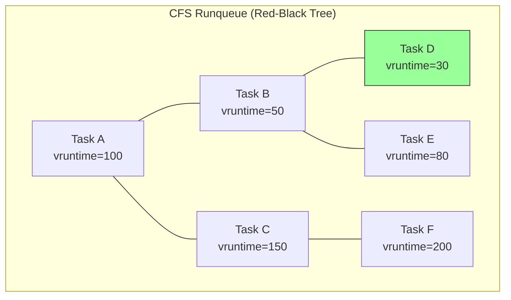
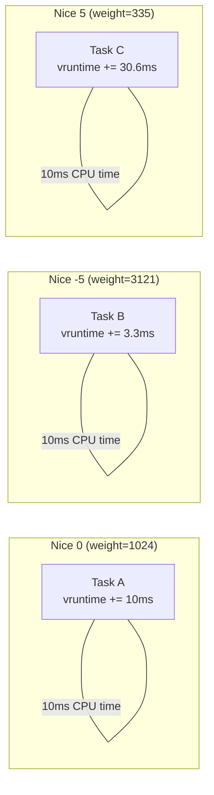
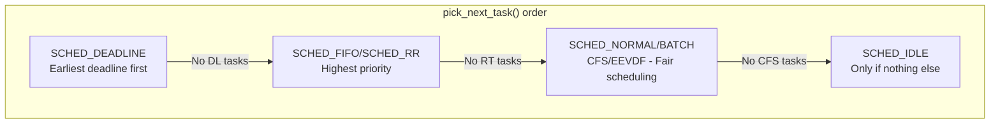
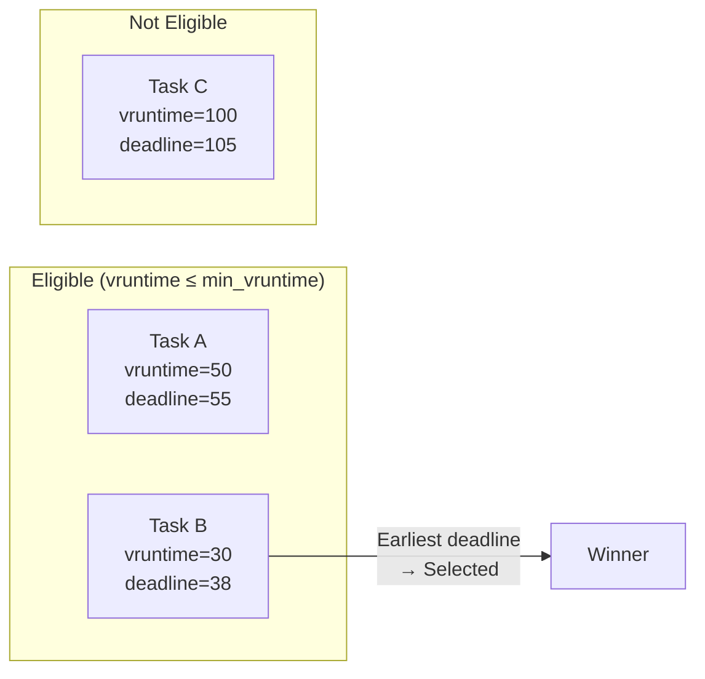

# Chapter 87: Process Scheduling — CFS (vruntime, rb-tree), RT Classes, Deadline, EEVDF

## 1. Intuition

The Linux scheduler is the kernel's most performance-critical subsystem. It decides which process runs on which CPU at every moment, balancing competing demands: interactive responsiveness, throughput, fairness, and real-time guarantees.

The **Completely Fair Scheduler (CFS)** is Linux's default scheduler, embodying the principle that CPU time should be distributed proportionally to each process's priority. It uses a **virtual runtime** concept: the more CPU time a process consumes, the higher its virtual runtime, and the less likely it is to be scheduled next. This elegant approach naturally balances interactive and batch processes without explicit tuning.

For real-time workloads, Linux provides **SCHED_FIFO** and **SCHED_RR** (round-robin) classes with strict priority ordering. The newer **SCHED_DEADLINE** class uses Earliest Deadline First (EDF) scheduling for hard real-time constraints.

The newest addition is **EEVDF (Earliest Eligible Virtual Deadline First)**, which replaces CFS in Linux 6.6+, providing better latency guarantees while maintaining fairness.

## 2. Architecture

### 2.1 Scheduler Classes

```
┌─────────────────────────────────────────┐
│            Scheduler Classes            │
├─────────────────────────────────────────┤
│  SCHED_DEADLINE  (Highest priority)     │
│      ↓                                  │
│  SCHED_FIFO / SCHED_RR (Real-time)     │
│      ↓                                  │
│  SCHED_NORMAL / SCHED_BATCH (CFS/EEVDF)│
│      ↓                                  │
│  SCHED_IDLE      (Lowest priority)      │
└─────────────────────────────────────────┘
```

### 2.2 CFS Key Concepts

- **Virtual Runtime (vruntime)**: Normalized CPU time consumed
- **Red-black tree**: Tasks ordered by vruntime
- **Nice value**: Maps to weight → affects vruntime accumulation rate
- **Time slice**: Proportional to weight / total weight
- **Scheduling latency**: Target time for all runnable tasks to run

### 2.3 Scheduling Decisions

```
Timer interrupt (every tick)
    │
    ├── Update current task's vruntime
    │
    ├── Check if task should be preempted
    │   └── If leftmost vruntime < current's vruntime → preempt
    │
    └── Pick next task
        └── Leftmost node in rb-tree
```

## 3. Kernel Implementation

### 3.1 CFS Scheduler Structure

```c
/* kernel/sched/sched.h */
struct cfs_rq {
    struct load_weight load;        /* Total weight of runnable tasks */
    unsigned int nr_running;        /* Number of runnable tasks */

    u64 exec_clock;                 /* Total execution time */
    u64 min_vruntime;               /* Minimum vruntime (monotonic) */

    struct rb_root_cached tasks_timeline;  /* Red-black tree */
    struct sched_entity *curr;      /* Currently running entity */
    struct sched_entity *next;      /* Next to run */
    struct sched_entity *last;      /* Last to run */
};
```

### 3.2 Virtual Runtime Calculation

```c
/* kernel/sched/fair.c */
static void update_curr(struct cfs_rq *cfs_rq) {
    struct sched_entity *curr = cfs_rq->curr;
    u64 now = rq_clock_task(rq_of(cfs_rq));
    u64 delta_exec;

    /* Calculate time since last update */
    delta_exec = now - curr->exec_start;
    curr->exec_start = now;

    /* Update statistics */
    curr->sum_exec_runtime += delta_exec;

    /* Calculate vruntime increment */
    /* vruntime += delta_exec * NICE_0_LOAD / weight */
    curr->vruntime += calc_delta_fair(delta_exec, curr);

    /* Update min_vruntime */
    update_min_vruntime(cfs_rq);
}
```

### 3.3 vruntime Calculation with Weights

```c
/* kernel/sched/fair.c */
static inline u64 calc_delta_fair(u64 delta, struct sched_entity *se) {
    if (unlikely(se->load.weight != NICE_0_LOAD))
        delta = __calc_delta(delta, NICE_0_LOAD, &se->load);
    return delta;
}

/*
 * delta_exec: actual time elapsed
 * weight: task's weight (from nice value)
 * lw: load weight of the runqueue
 *
 * result = delta_exec * weight / lw->weight
 */
static u64 __calc_delta(u64 delta_exec, unsigned long weight,
                        struct load_weight *lw) {
    u64 fact = scale_load_down(weight);
    int shift = WMULT_SHIFT;

    /* Multiply and shift to avoid overflow */
    fact = mul_u64_u32_shr(delta_exec, scale_load_down(lw->weight), shift);

    return mul_u64_u32_shr(fact, scale_load_down(weight), shift);
}
```

### 3.4 Nice Value to Weight Mapping

```c
/* kernel/sched/core.c */
const int sched_prio_to_weight[40] = {
 /* -20 */     88761,     71755,     56483,     46273,     36291,
 /* -15 */     29154,     23254,     18705,     14949,     11916,
 /* -10 */      9548,      7620,      6100,      4904,      3906,
 /*  -5 */      3121,      2501,      1991,      1586,      1277,
 /*   0 */      1024,       820,       655,       526,       423,
 /*   5 */       335,       272,       215,       172,       137,
 /*  10 */       110,        87,        70,        56,        45,
 /*  15 */        36,        29,        23,        18,        15,
};

/* Inverse weights (for faster calculation) */
const u32 sched_prio_to_wmult[40] = {
 /* -20 */ 48388,     59856,     76040,    92818,    118348,
 /* -15 */ 147320,    184698,    229616,   287308,   360437,
 /* -10 */ 449829,    563644,    704093,   875809,  1099582,
 /*  -5 */ 1376151,   1717300,   2157191,  2708050,  3363326,
 /*   0 */ 4194304,   5237765,   6557202,  8165337,  10153587,
 /*   5 */ 12820798,  15790321,  19976592, 24970740,  31350126,
 /*  10 */ 39045157,  49367440,  61356676, 76695844,  95443717,
 /*  15 */ 119304647, 148102320, 186737708,238609294, 286331153,
};
```

### 3.5 Red-Black Tree Operations

```c
/* kernel/sched/fair.c */
static void enqueue_entity(struct cfs_rq *cfs_rq, struct sched_entity *se,
                           int flags) {
    /* Update vruntime */
    if (!(flags & ENQUEUE_WAKEUP) || (flags & ENQUEUE_WAKING))
        se->vruntime += cfs_rq->min_vruntime;

    /* Insert into red-black tree */
    __enqueue_entity(cfs_rq, se);

    /* Update load */
    account_entity_enqueue(cfs_rq, se);
}

static void __enqueue_entity(struct cfs_rq *cfs_rq, struct sched_entity *se) {
    struct rb_node **link = &cfs_rq->tasks_timeline.rb_root.rb_node;
    struct rb_node *parent = NULL;
    struct sched_entity *entry;
    bool leftmost = true;

    /* Find insertion point */
    while (*link) {
        parent = *link;
        entry = rb_entry(parent, struct sched_entity, run_node);

        if (entity_before(se, entry)) {
            link = &parent->rb_left;
        } else {
            link = &parent->rb_right;
            leftmost = false;
        }
    }

    /* Insert and rebalance */
    rb_link_node(&se->run_node, parent, link);
    rb_insert_color_cached(&se->run_node,
                           &cfs_rq->tasks_timeline, leftmost);
}
```

### 3.6 Pick Next Task (CFS)

```c
/* kernel/sched/fair.c */
static struct sched_entity *pick_next_entity(struct cfs_rq *cfs_rq) {
    struct sched_entity *se;

    /* Leftmost node has smallest vruntime */
    se = rb_entry_cached_first(&cfs_rq->tasks_timeline);

    return se;
}
```

### 3.7 Real-Time Scheduler

```c
/* kernel/sched/rt.c */
static struct task_struct *pick_next_task_rt(struct rq *rq) {
    struct sched_rt_entity *rt_se;
    struct rt_prio_array *array;
    struct list_head *queue;
    int idx;

    /* Find highest priority non-empty queue */
    array = &rq->rt.active;
    idx = sched_find_first_bit(array->bitmap);
    queue = array->queue + idx;

    /* Pick first task in that queue */
    rt_se = list_entry(queue->next, struct sched_rt_entity, run_list);

    return rt_task_of(rt_se);
}
```

### 3.8 SCHED_DEADLINE (EDF)

```c
/* kernel/sched/deadline.c */
static struct task_struct *pick_next_task_dl(struct rq *rq) {
    struct sched_dl_entity *dl_se;
    struct dl_rq *dl_rq = &rq->dl;

    /* Pick task with earliest deadline */
    dl_se = __pick_earliest_dl_entity(dl_rq);

    return dl_task_of(dl_se);
}

/* Enqueue deadline task */
static void enqueue_task_dl(struct rq *rq, struct task_struct *p, int flags) {
    struct sched_dl_entity *dl_se = &p->dl;

    /* Update timing parameters */
    setup_new_dl_entity(dl_se);

    /* Insert into rb-tree ordered by deadline */
    __enqueue_dl_entity(dl_se);
}
```

### 3.9 EEVDF (Earliest Eligible Virtual Deadline First)

Starting from Linux 6.6, CFS is replaced by EEVDF:

```c
/* kernel/sched/fair.c (Linux 6.6+) */
struct sched_entity {
    /* ... */
    u64 deadline;       /* Virtual deadline */
    u64 min_vruntime;   /* Eligibility threshold */
    /* ... */
};

/* Calculate virtual deadline */
static u64 entity_deadline(struct sched_entity *se) {
    return se->vruntime + calc_delta_fair(se->slice, se);
}

/* Pick next entity (EEVDF) */
static struct sched_entity *pick_eevdf(struct cfs_rq *cfs_rq) {
    struct sched_entity *se = NULL;
    struct rb_node *node = cfs_rq->tasks_timeline.rb_root.rb_node;

    /* Find eligible entity with earliest deadline */
    while (node) {
        struct sched_entity *curr = rb_entry(node, struct sched_entity, run_node);

        /* Check eligibility: vruntime <= min_vruntime */
        if (curr->min_vruntime <= cfs_rq->min_vruntime) {
            /* Eligible — check if this has earliest deadline */
            if (!se || entity_before(curr, se))
                se = curr;
            node = node->rb_left;
        } else {
            node = node->rb_right;
        }
    }

    return se;
}
```

## 4. Source Code References

| File | Description |
|------|-------------|
| `kernel/sched/fair.c` | CFS and EEVDF implementation |
| `kernel/sched/rt.c` | Real-time scheduler |
| `kernel/sched/deadline.c` | SCHED_DEADLINE (EDF) |
| `kernel/sched/core.c` | Core scheduler, nice values |
| `kernel/sched/sched.h` | Scheduler data structures |
| `include/linux/sched.h` | Task scheduling fields |

## 5. Data Structures

### 5.1 sched_entity (CFS)

```c
/* include/linux/sched.h */
struct sched_entity {
    struct load_weight load;        /* Weight (from nice) */
    struct rb_node run_node;        /* Red-black tree node */
    struct list_head group_node;
    unsigned int on_rq;             /* Is on runqueue? */

    u64 exec_start;                 /* Start of current execution */
    u64 sum_exec_runtime;           /* Total execution time */
    u64 vruntime;                   /* Virtual runtime */
    u64 prev_sum_exec_runtime;      /* Previous total execution */

    u64 nr_migrations;              /* Number of CPU migrations */

    /* EEVDF fields (Linux 6.6+) */
    u64 deadline;
    u64 min_vruntime;

    /* ... */
};
```

### 5.2 sched_rt_entity (RT)

```c
struct sched_rt_entity {
    struct list_head run_list;      /* RT runqueue list */
    unsigned long timeout;          /* Timeout for SCHED_RR */
    unsigned long watchdog_stamp;   /* For bandwidth checking */
    unsigned int time_slice;        /* Remaining time slice */
    unsigned short on_rq;
    unsigned short on_list;

    struct sched_rt_entity *back;   /* For group scheduling */
};
```

### 5.3 sched_dl_entity (Deadline)

```c
struct sched_dl_entity {
    struct rb_node rb_node;         /* Deadline-sorted rb-tree */

    u64 dl_runtime;                 /* Runtime per period */
    u64 dl_deadline;                /* Relative deadline */
    u64 dl_period;                  /* Period */
    u64 deadline;                   /* Absolute deadline */

    u64 runtime;                    /* Remaining runtime */
    u64 remaining_runtime;          /* For bandwidth tracking */

    /* ... */
};
```

## 6. C/Assembly Examples

### 6.1 Setting Process Priority (nice)

```c
#include <stdio.h>
#include <unistd.h>
#include <sys/time.h>
#include <sys/resource.h>

int main(void) {
    /* Get current nice value */
    int nice_val = getpriority(PRIO_PROCESS, 0);
    printf("Current nice value: %d\n", nice_val);

    /* Set nice value (requires appropriate permissions) */
    if (setpriority(PRIO_PROCESS, 0, 10) == -1) {
        perror("setpriority");
    } else {
        printf("New nice value: %d\n", getpriority(PRIO_PROCESS, 0));
    }

    /* Demonstrate CPU usage with different nice values */
    printf("Running CPU-intensive task...\n");
    volatile long long sum = 0;
    for (long long i = 0; i < 1000000000LL; i++) {
        sum += i;
    }
    printf("Done. Sum = %lld\n", sum);

    return 0;
}
```

### 6.2 Setting Real-Time Priority

```c
#include <stdio.h>
#include <sched.h>
#include <unistd.h>

int main(void) {
    struct sched_param param;

    /* Get current scheduling policy */
    int policy = sched_getscheduler(0);
    printf("Current policy: %d (%s)\n", policy,
           policy == SCHED_OTHER ? "SCHED_OTHER" :
           policy == SCHED_FIFO ? "SCHED_FIFO" :
           policy == SCHED_RR ? "SCHED_RR" :
           policy == SCHED_DEADLINE ? "SCHED_DEADLINE" : "UNKNOWN");

    /* Set SCHED_FIFO with priority 50 */
    param.sched_priority = 50;
    if (sched_setscheduler(0, SCHED_FIFO, &param) == -1) {
        perror("sched_setscheduler");
        printf("Try running with sudo\n");
    } else {
        printf("Set to SCHED_FIFO priority %d\n", param.sched_priority);
    }

    /* Get priority limits */
    int max_fifo = sched_get_priority_max(SCHED_FIFO);
    int min_fifo = sched_get_priority_min(SCHED_FIFO);
    int max_rr = sched_get_priority_max(SCHED_RR);
    int min_rr = sched_get_priority_min(SCHED_RR);

    printf("SCHED_FIFO priority range: %d - %d\n", min_fifo, max_fifo);
    printf("SCHED_RR priority range: %d - %d\n", min_rr, max_rr);

    return 0;
}
```

### 6.3 SCHED_DEADLINE Example

```c
#define _GNU_SOURCE
#include <stdio.h>
#include <sched.h>
#include <unistd.h>
#include <linux/sched.h>
#include <sys/syscall.h>

int main(void) {
    struct sched_attr attr;
    int ret;

    /* Set up deadline scheduling parameters */
    attr.size = sizeof(attr);
    attr.sched_policy = SCHED_DEADLINE;
    attr.sched_flags = 0;
    attr.sched_nice = 0;
    attr.sched_priority = 0;

    /* Runtime: 1ms, Deadline: 5ms, Period: 10ms */
    attr.sched_runtime = 1000000;    /* 1ms in nanoseconds */
    attr.sched_deadline = 5000000;   /* 5ms */
    attr.sched_period = 10000000;    /* 10ms */

    /* Use sched_setattr syscall */
    ret = syscall(SYS_sched_setattr, 0, &attr, 0);
    if (ret == -1) {
        perror("sched_setattr");
        printf("Try running with sudo\n");
        return 1;
    }

    printf("Set to SCHED_DEADLINE: runtime=1ms, deadline=5ms, period=10ms\n");

    /* Run a real-time task */
    for (int i = 0; i < 100; i++) {
        /* Simulate work */
        volatile int x = 0;
        for (int j = 0; j < 100000; j++) x++;

        printf("Deadline task iteration %d\n", i);
    }

    return 0;
}
```

### 6.4 CPU Affinity and Scheduling

```c
#define _GNU_SOURCE
#include <stdio.h>
#include <sched.h>
#include <unistd.h>

int main(void) {
    cpu_set_t mask;

    /* Get current CPU affinity */
    sched_getaffinity(0, sizeof(mask), &mask);

    printf("CPU Affinity: ");
    for (int i = 0; i < CPU_SETSIZE; i++) {
        if (CPU_ISSET(i, &mask))
            printf("%d ", i);
    }
    printf("\n");

    /* Get current CPU */
    printf("Running on CPU: %d\n", sched_getcpu());

    /* Get scheduler info */
    struct sched_param param;
    int policy = sched_getscheduler(0);
    sched_getparam(0, &param);
    printf("Scheduler: %d, Priority: %d\n", policy, param.sched_priority);

    return 0;
}
```

### 6.5 Viewing Scheduler Statistics

```c
#include <stdio.h>
#include <stdlib.h>
#include <string.h>

int main(int argc, char *argv[]) {
    int pid = argc > 1 ? atoi(argv[1]) : getpid();
    char path[256];
    char line[1024];

    printf("Scheduler info for PID %d:\n\n", pid);

    /* Read /proc/PID/sched */
    snprintf(path, sizeof(path), "/proc/%d/sched", pid);
    FILE *f = fopen(path, "r");
    if (f) {
        while (fgets(line, sizeof(line), f)) {
            printf("  %s", line);
        }
        fclose(f);
    }

    /* Read scheduling policy */
    snprintf(path, sizeof(path), "/proc/%d/sched", pid);
    printf("\nPolicy and priority:\n");

    /* Use sched_getscheduler syscall */
    int policy = sched_getscheduler(pid);
    printf("  Policy: %d\n", policy);

    struct sched_param param;
    sched_getparam(pid, &param);
    printf("  Priority: %d\n", param.sched_priority);

    return 0;
}
```

## 7. Diagrams

### 7.1 CFS Red-Black Tree



### 7.2 Virtual Runtime Update



### 7.3 Scheduler Class Hierarchy



### 7.4 EEVDF Eligibility



## 8. Performance

### 8.1 Scheduler Performance Characteristics

| Aspect | CFS | RT | Deadline |
|--------|-----|-----|----------|
| Time complexity | O(log n) | O(1) | O(log n) |
| Fairness | Excellent | Poor (priority) | Guaranteed |
| Latency | Good | Excellent | Bounded |
| Throughput | Good | Varies | Limited |

### 8.2 Scheduling Latency

```bash
# Measure scheduling latency
cyclictest -t1 -p80 -i1000 -l10000

# Check /proc/PID/sched for statistics
cat /proc/self/sched | grep -E "wait|exec|nr_switches"
```

### 8.3 Performance Tuning

1. **Nice values**: Adjust for background workloads
2. **CPU affinity**: Pin real-time tasks to specific CPUs
3. **Isolation**: Use `isolcpus=` kernel parameter for RT workloads
4. **Preemption**: Use `PREEMPT_RT` for hard real-time

## 9. Security

### 9.1 Scheduler Security

1. **Priority escalation**: Unprivileged users can't set RT priorities
2. **Resource exhaustion**: RT tasks can starve normal tasks
3. **CPU bandwidth limiting**: Cgroups can limit CPU usage

### 9.2 Secure Scheduling

```c
/* Check permissions before setting RT priority */
if (geteuid() != 0) {
    fprintf(stderr, "Must be root to set RT priority\n");
    return 1;
}
```

## 10. Common Pitfalls

### Pitfall 1: RT Task Starving System

```c
/* WRONG: RT task with no yield can freeze the system */
void rt_task(void) {
    while (1) {
        /* Busy work — system is unresponsive! */
    }
}

/* RIGHT: Use SCHED_DEADLINE or yield periodically */
void rt_task(void) {
    while (1) {
        do_work();
        sched_yield();  /* Give other tasks a chance */
    }
}
```

### Pitfall 2: Wrong Nice Value Calculation

```c
/* WRONG: Confusing nice with priority */
setpriority(PRIO_PROCESS, 0, -20);  /* Highest priority, NOT lowest! */

/* RIGHT: Nice -20 = highest priority, +19 = lowest */
```

### Pitfall 3: Assuming Fair Scheduling for RT

```c
/* WRONG: SCHED_FIFO tasks are NOT preempted by other RT tasks */
/* If two FIFO tasks have same priority, the running one continues */

/* RIGHT: Use SCHED_RR for time-slicing among equal-priority RT tasks */
```

## 11. Best Practices

1. **Use SCHED_NORMAL** for most applications
2. **Use SCHED_FIFO/RR** only for real-time requirements
3. **Use SCHED_DEADLINE** for periodic real-time tasks
4. **Set CPU affinity** for RT tasks to avoid migration overhead
5. **Use cgroups** to limit CPU usage of batch workloads
6. **Monitor scheduling latency** with `cyclictest`
7. **Use `isolcpus`** for dedicated real-time CPUs

### EEVDF: The New Scheduler

Starting from Linux 6.6, the EEVDF (Earliest Eligible Virtual Deadline First) scheduler replaces CFS. EEVDF improves upon CFS in several ways:

1. **Better latency guarantees**: Each task gets a virtual deadline based on its nice value and request size
2. **No lag**: EEVDF eliminates the "lag" metric that CFS used, simplifying the scheduling logic
3. **Preemption decisions**: Tasks are preempted when a task with an earlier virtual deadline becomes eligible
4. **Fairness**: EEVDF maintains the same fairness properties as CFS but with better worst-case behavior

The key insight of EEVDF is that it separates eligibility (whether a task has had enough CPU time recently) from deadline ordering (which eligible task should run next). This allows the scheduler to make better decisions about when to preempt and which task to run next.

### SCHED_DEADLINE Theory

SCHED_DEADLINE is based on Earliest Deadline First (EDF) theory from real-time systems:

**Schedulability Test**: For a set of periodic tasks, the system is schedulable if:
```
Σ (runtime_i / period_i) ≤ n
```
where n is the number of CPUs.

**Example**: Two tasks on one CPU:
- Task A: runtime=2ms, period=10ms (utilization = 0.2)
- Task B: runtime=3ms, period=10ms (utilization = 0.3)
- Total utilization = 0.5 ≤ 1.0 ✓ (schedulable)

**Admission control**: The kernel rejects SCHED_DEADLINE requests that would exceed the schedulable utilization:

```c
/* Simplified admission control */
static int dl_overflow(struct rq *rq, struct sched_dl_entity *dl_se) {
    u64 total_bw = 0;

    /* Sum bandwidth of all deadline tasks */
    for_each_dl_entity(dl)
        total_bw += dl->dl_runtime * BW_UNIT / dl->dl_deadline;

    /* Check against available bandwidth */
    if (total_bw + new_bw > BW_UNIT)
        return -EBUSY;  /* Would miss deadlines */

    return 0;
}
```

### CFS Tuning Parameters

Several parameters can be tuned for CFS behavior:

```bash
# Scheduling latency target (ns)
cat /proc/sys/kernel/sched_latency_ns        # Default: 6ms

# Minimum granularity (ns)
cat /proc/sys/kernel/sched_min_granularity_ns # Default: 0.75ms

# Wakeup granularity (ns)
cat /proc/sys/kernel/sched_wakeup_granularity_ns # Default: 1ms

# Migration cost (ns)
cat /proc/sys/kernel/sched_migration_cost_ns  # Default: 0.5ms
```

These parameters affect how the scheduler balances latency vs. throughput:
- **Lower latency**: Tasks switch more frequently, better responsiveness
- **Higher throughput**: Tasks run longer before switching, less overhead

## 12. Exercises

### Exercise 1: Nice Value Impact

Write a program that spawns two CPU-intensive processes with different nice values and measures their relative throughput.

### Exercise 2: CFS Visualization

Write a program that reads `/proc/PID/sched` for multiple processes and visualizes their vruntime over time.

### Exercise 3: Real-Time Priority Experiment

Write a program that creates an RT task and a normal task, demonstrating that the RT task gets priority.

### Exercise 4: SCHED_DEADLINE Periodic Task

Implement a periodic task using SCHED_DEADLINE that runs for 1ms every 10ms.

### Exercise 5: Scheduler Latency Measurement

Write a program that measures the time between when a task becomes runnable and when it actually runs.

## 13. References

1. **Linux kernel source**: `kernel/sched/fair.c` — CFS/EEVDF
2. **Linux kernel source**: `kernel/sched/rt.c` — Real-time scheduler
3. **Linux kernel source**: `kernel/sched/deadline.c` — Deadline scheduler
4. **man pages**: `sched(7)`, `sched_setparam(2)`, `nice(2)`
5. **"Understanding the Linux Kernel"** by Bovet & Cesati, Chapter 7
6. **LWN.net**: "EEVDF" — https://lwn.net/Articles/925371/
7. **LWN.net**: "The EEVDF CPU scheduler" — https://lwn.net/Articles/926882/
8. **Con Kolivas**: "RSDL scheduler" — historical CFS predecessor
9. **Ingo Molnár**: CFS design documentation
10. **Real-Time Linux Documentation**: https://wiki.linuxfoundation.org/realtime/start
