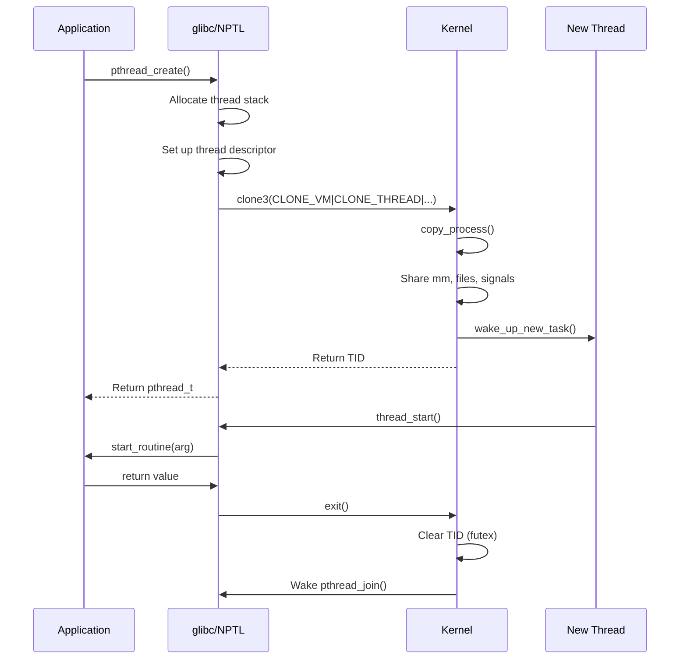
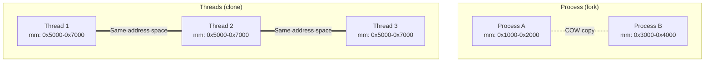
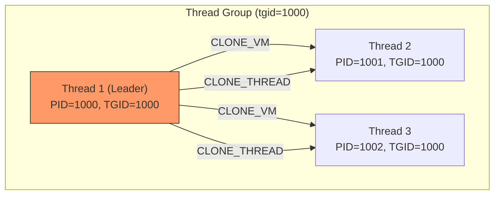

# Chapter 88: Threads and pthreads — NPTL, clone(CLONE_VM|CLONE_THREAD), pthread_create/join

## 1. Intuition

Threads are lightweight execution units that share the same address space. While processes are isolated from each other (each has its own memory), threads within a process share memory, file descriptors, and other resources. This makes threads ideal for concurrent programming within a single application.

In Linux, **threads are just processes that share resources**. The kernel doesn't have a separate "thread" abstraction — it uses the same `task_struct` for both. The difference is in the `clone()` flags: threads are created with `CLONE_VM | CLONE_THREAD | CLONE_SIGHAND | CLONE_FILES`, which causes them to share memory, signal handlers, and file descriptors.

The **Native POSIX Thread Library (NPTL)** is the standard implementation of POSIX threads on Linux. It provides efficient thread creation and synchronization using kernel support, with features like futex-based mutexes and thread-local storage.

## 2. Architecture

### 2.1 Process vs. Thread

```
Process (fork):                 Thread (clone):
┌──────────────┐               ┌──────────────┐
│ Task A       │               │ Task A       │
│ mm: private  │               │ mm: shared   │
│ files: copy  │               │ files: shared│
│ signals: copy│               │ signals: shared│
└──────────────┘               └──────────────┘
       │                              │
       ▼                              ▼
┌──────────────┐               ┌──────────────┐
│ Task B       │               │ Task B       │
│ mm: private  │               │ mm: shared   │
│ files: copy  │               │ files: shared│
│ signals: copy│               │ signals: shared│
└──────────────┘               └──────────────┘
```

### 2.2 Thread Group

```
Thread Group (all share tgid = PID of leader)
    │
    ├── Thread 1 (leader) — PID=1000, TGID=1000
    ├── Thread 2          — PID=1001, TGID=1000
    ├── Thread 3          — PID=1002, TGID=1000
    └── Thread 4          — PID=1003, TGID=1000
```

### 2.3 Clone Flags for Threads

| Flag | Effect |
|------|--------|
| `CLONE_VM` | Share virtual memory (mm_struct) |
| `CLONE_THREAD` | Same thread group (tgid) |
| `CLONE_SIGHAND` | Share signal handlers |
| `CLONE_FILES` | Share file descriptor table |
| `CLONE_SYSVSEM` | Share System V semaphore undo |
| `CLONE_SETTLS` | Set thread-local storage |
| `CLONE_PARENT_SETTID` | Write child TID to parent memory |
| `CLONE_CHILD_CLEARTID` | Clear child TID on exit |
| `CLONE_CHILD_SETTID` | Write child TID to child memory |

## 3. Kernel Implementation

### 3.1 Thread Creation via clone()

```c
/* kernel/fork.c - simplified */
SYSCALL_DEFINE5(clone, unsigned long, clone_flags,
                unsigned long, newsp,
                int __user *, parent_tidptr,
                int __user *, child_tidptr,
                unsigned long, tls) {
    struct kernel_clone_args args = {
        .flags      = (lower_32_bits(clone_flags) & ~CSIGNAL),
        .exit_signal = (lower_32_bits(clone_flags) & CSIGNAL),
        .stack       = newsp,
        .parent_tid  = parent_tidptr,
        .child_tid   = child_tidptr,
        .tls         = tls,
    };
    return kernel_clone(&args);
}
```

### 3.2 copy_process() for Threads

When `CLONE_THREAD` is set, `copy_process()` does things differently:

```c
/* kernel/fork.c - simplified */
static struct task_struct *copy_process(struct pid *pid, ...) {
    struct task_struct *p;

    /* Allocate new task */
    p = dup_task_struct(current, node);

    if (clone_flags & CLONE_THREAD) {
        /* Same thread group — share everything */
        p->tgid = current->tgid;           /* Same thread group ID */
        p->group_leader = current->group_leader;

        /* Share signal handlers */
        p->sighand = current->sighand;
        atomic_inc(&p->sighand->count);

        /* Share signal struct */
        p->signal = current->signal;
        atomic_inc(&p->signal->live);
        atomic_inc(&p->signal->sigcnt);
    }

    /* Share memory */
    if (clone_flags & CLONE_VM) {
        p->mm = current->mm;
        atomic_inc(&p->mm->mm_users);
    }

    /* Share files */
    if (clone_flags & CLONE_FILES) {
        p->files = current->files;
        atomic_inc(&p->files->count);
    }

    /* Set TLS */
    if (clone_flags & CLONE_SETTLS)
        p->thread.fsbase = tls;

    /* Set TID in user memory */
    if (clone_flags & CLONE_PARENT_SETTID)
        put_user(p->pid, parent_tidptr);

    if (clone_flags & CLONE_CHILD_SETTID)
        put_user(p->pid, child_tidptr);

    if (clone_flags & CLONE_CHILD_CLEARTID)
        p->clear_child_tid = child_tidptr;

    return p;
}
```

### 3.3 NPTL Implementation

The NPTL library provides the POSIX thread API:

```c
/* nptl/pthread_create.c (glibc) */
int pthread_create(pthread_t *newthread, const pthread_attr_t *attr,
                   void *(*start_routine)(void *), void *arg) {
    struct pthread *pd;
    struct clone_args clone_args;
    size_t stacksize;
    int ret;

    /* Allocate thread descriptor and stack */
    stacksize = attr ? attr->stacksize : default_stacksize;
    pd = allocate_stack(stacksize);

    /* Set up clone arguments */
    clone_args.flags = CLONE_VM | CLONE_FS | CLONE_FILES |
                       CLONE_SIGHAND | CLONE_THREAD |
                       CLONE_SYSVSEM | CLONE_SETTLS |
                       CLONE_PARENT_SETTID | CLONE_CHILD_CLEARTID;
    clone_args.stack = pd->stackblock;
    clone_args.stack_size = pd->stackblock_size;
    clone_args.parent_tid = &pd->tid;
    clone_args.child_tid = &pd->tid;
    clone_args.tls = pd->tcb;

    /* Set up thread start wrapper */
    pd->start_routine = start_routine;
    pd->arg = arg;

    /* Create thread using clone3() */
    ret = clone3(&clone_args, sizeof(clone_args));

    if (ret == 0) {
        /* Child thread */
        thread_start(pd);
        /* NOTREACHED */
    }

    *newthread = (pthread_t)pd;
    return 0;
}
```

### 3.4 Thread Entry Point

```c
/* nptl/pthread_create.c (glibc) */
static int thread_start(struct pthread *pd) {
    /* Set up TLS */
    __set_thread_area(&pd->tcb);

    /* Call the user's start routine */
    void *result = pd->start_routine(pd->arg);

    /* Exit the thread */
    pthread_exit(result);

    return 0;
}
```

### 3.5 pthread_join Implementation

```c
/* nptl/pthread_join.c (glibc) */
int pthread_join(pthread_t th, void **thread_return) {
    struct pthread *pd = (struct pthread *)th;

    /* Wait for thread to exit */
    /* Uses CLONE_CHILD_CLEARTID — kernel wakes on futex when TID is cleared */

    while (1) {
        int val = atomic_read(&pd->tid);
        if (val == 0)
            break;  /* Thread has exited */

        /* Futex wait — kernel sleeps until TID is cleared */
        futex_wait(&pd->tid, val);
    }

    /* Retrieve return value */
    if (thread_return)
        *thread_return = pd->result;

    /* Free thread resources */
    free_thread_stack(pd);

    return 0;
}
```

### 3.6 Thread Exit and CLONE_CHILD_CLEARTID

When a thread exits, the kernel clears the TID and wakes any futex waiters:

```c
/* kernel/exit.c */
static void exit_mm_release(struct task_struct *tsk, struct mm_struct *mm) {
    /* Clear child TID and wake futex waiters */
    if (tsk->clear_child_tid) {
        if (atomic_read(tsk->clear_child_tid) != 0) {
            /* Clear the TID */
            put_user(0, tsk->clear_child_tid);

            /* Wake futex waiters (pthread_join) */
            futex(tsk->clear_child_tid, FUTEX_WAKE, 1, NULL, NULL, 0, 0);
        }
    }
}
```

## 4. Source Code References

| File | Description |
|------|-------------|
| `kernel/fork.c` | Thread creation via clone() |
| `kernel/exit.c` | Thread exit, CLONE_CHILD_CLEARTID |
| `kernel/futex.c` | Futex implementation |
| `nptl/pthread_create.c` (glibc) | pthread_create implementation |
| `nptl/pthread_join.c` (glibc) | pthread_join implementation |
| `include/linux/sched.h` | task_struct, thread-related fields |
| `include/uapi/linux/sched.h` | Clone flags |

## 5. Data Structures

### 5.1 Thread-Specific task_struct Fields

```c
struct task_struct {
    /* Thread group */
    pid_t pid;                  /* Thread ID (unique per thread) */
    pid_t tgid;                 /* Thread group ID (same for all threads) */
    struct task_struct *group_leader;  /* Thread group leader */

    /* Thread-local storage */
    struct thread_struct thread;  /* CPU-specific state */

    /* Clear TID on exit (for pthread_join) */
    int __user *clear_child_tid;

    /* ... */
};
```

### 5.2 NPTL Thread Descriptor (glibc)

```c
/* nptl/descr.h (glibc) */
struct pthread {
    /* Thread ID (kernel TID) */
    pid_t tid;

    /* Thread-local storage */
    void *tcb;                  /* Thread control block */

    /* Stack info */
    void *stackblock;
    size_t stackblock_size;

    /* Start routine and argument */
    void *(*start_routine)(void *);
    void *arg;

    /* Return value */
    void *result;

    /* Thread attributes */
    int schedpolicy;
    struct sched_param schedparam;

    /* Detach state */
    int detached;

    /* ... */
};
```

## 6. C/Assembly Examples

### 6.1 Basic pthread_create and pthread_join

```c
#include <stdio.h>
#include <stdlib.h>
#include <pthread.h>
#include <unistd.h>

#define NUM_THREADS 4

void *thread_func(void *arg) {
    int id = *(int *)arg;
    printf("Thread %d: started (TID=%d)\n", id, getpid());

    /* Simulate work */
    sleep(1);

    printf("Thread %d: done\n", id);

    /* Return value */
    int *result = malloc(sizeof(int));
    *result = id * 100;
    return result;
}

int main(void) {
    pthread_t threads[NUM_THREADS];
    int thread_ids[NUM_THREADS];

    printf("Main: creating %d threads\n", NUM_THREADS);

    for (int i = 0; i < NUM_THREADS; i++) {
        thread_ids[i] = i;
        int ret = pthread_create(&threads[i], NULL, thread_func, &thread_ids[i]);
        if (ret != 0) {
            fprintf(stderr, "pthread_create failed: %d\n", ret);
            return 1;
        }
    }

    /* Wait for all threads */
    for (int i = 0; i < NUM_THREADS; i++) {
        void *result;
        pthread_join(threads[i], &result);
        printf("Main: thread %d returned %d\n", i, *(int *)result);
        free(result);
    }

    printf("Main: all threads completed\n");
    return 0;
}
```

### 6.2 Thread with Attributes

```c
#include <stdio.h>
#include <stdlib.h>
#include <pthread.h>
#include <unistd.h>
#include <sched.h>

void *thread_func(void *arg) {
    printf("Thread: running\n");

    /* Get thread attributes */
    pthread_attr_t attr;
    size_t stacksize;
    void *stackaddr;
    int detachstate;

    pthread_getattr_np(pthread_self(), &attr);
    pthread_attr_getstack(&attr, &stackaddr, &stacksize);
    pthread_attr_getdetachstate(&attr, &detachstate);

    printf("  Stack: %p (size: %zu)\n", stackaddr, stacksize);
    printf("  Detach state: %s\n",
           detachstate == PTHREAD_CREATE_DETACHED ? "detached" : "joinable");

    pthread_attr_destroy(&attr);
    return NULL;
}

int main(void) {
    pthread_t thread;
    pthread_attr_t attr;

    /* Initialize attributes */
    pthread_attr_init(&attr);

    /* Set custom stack size (2 MB) */
    pthread_attr_setstacksize(&attr, 2 * 1024 * 1024);

    /* Set detach state */
    pthread_attr_setdetachstate(&attr, PTHREAD_CREATE_JOINABLE);

    /* Set scheduling policy */
    struct sched_param param;
    param.sched_priority = 0;
    pthread_attr_setschedpolicy(&attr, SCHED_OTHER);
    pthread_attr_setschedparam(&attr, &param);

    /* Create thread with attributes */
    pthread_create(&thread, &attr, thread_func, NULL);

    pthread_join(thread, NULL);
    pthread_attr_destroy(&attr);

    return 0;
}
```

### 6.3 Thread-Local Counter with Mutex

```c
#include <stdio.h>
#include <stdlib.h>
#include <pthread.h>

#define NUM_THREADS 10
#define ITERATIONS 100000

/* Shared data with mutex */
typedef struct {
    int counter;
    pthread_mutex_t mutex;
} shared_data_t;

void *increment_thread(void *arg) {
    shared_data_t *data = (shared_data_t *)arg;

    for (int i = 0; i < ITERATIONS; i++) {
        pthread_mutex_lock(&data->mutex);
        data->counter++;
        pthread_mutex_unlock(&data->mutex);
    }

    return NULL;
}

int main(void) {
    shared_data_t data = { .counter = 0 };
    pthread_t threads[NUM_THREADS];

    pthread_mutex_init(&data.mutex, NULL);

    /* Create threads */
    for (int i = 0; i < NUM_THREADS; i++) {
        pthread_create(&threads[i], NULL, increment_thread, &data);
    }

    /* Wait for all threads */
    for (int i = 0; i < NUM_THREADS; i++) {
        pthread_join(threads[i], NULL);
    }

    pthread_mutex_destroy(&data.mutex);

    printf("Expected: %d, Actual: %d\n",
           NUM_THREADS * ITERATIONS, data.counter);

    return 0;
}
```

### 6.4 Thread Cancellation

```c
#include <stdio.h>
#include <stdlib.h>
#include <pthread.h>
#include <unistd.h>

void cleanup_handler(void *arg) {
    printf("Cleanup: freeing %s\n", (char *)arg);
    free(arg);
}

void *worker(void *arg) {
    /* Push cleanup handler */
    char *resource = malloc(100);
    sprintf(resource, "resource from thread");
    pthread_cleanup_push(cleanup_handler, resource);

    /* Cancellation point */
    while (1) {
        printf("Worker: working...\n");
        sleep(1);  /* Cancellation point */
    }

    /* Cleanup pop (never reached in this case) */
    pthread_cleanup_pop(1);
    return NULL;
}

int main(void) {
    pthread_t thread;

    pthread_create(&thread, NULL, worker, NULL);

    sleep(3);

    printf("Main: canceling thread\n");
    pthread_cancel(thread);

    void *result;
    pthread_join(thread, &result);

    if (result == PTHREAD_CANCELED) {
        printf("Main: thread was canceled\n");
    }

    return 0;
}
```

### 6.5 Direct clone() for Threads

```c
#define _GNU_SOURCE
#include <sched.h>
#include <stdio.h>
#include <stdlib.h>
#include <unistd.h>
#include <sys/wait.h>
#include <signal.h>
#include <sys/mman.h>

#define STACK_SIZE (1024 * 1024)

static int thread_func(void *arg) {
    int id = *(int *)arg;
    printf("Thread %d: PID=%d, TID=%d\n", id, getpid(), syscall(SYS_gettid));
    sleep(2);
    printf("Thread %d: exiting\n", id);
    return 0;
}

int main(void) {
    int ids[3];
    void *stacks[3];

    printf("Main: PID=%d, TID=%d\n", getpid(), syscall(SYS_gettid));

    for (int i = 0; i < 3; i++) {
        ids[i] = i;

        /* Allocate stack */
        stacks[i] = mmap(NULL, STACK_SIZE, PROT_READ | PROT_WRITE,
                         MAP_PRIVATE | MAP_ANONYMOUS, -1, 0);

        /* Clone with thread flags */
        unsigned long flags = CLONE_VM | CLONE_THREAD | CLONE_SIGHAND |
                              CLONE_FILES | CLONE_SYSVSEM |
                              CLONE_PARENT_SETTID | CLONE_CHILD_CLEARTID;

        pid_t tid = clone(thread_func, (char *)stacks[i] + STACK_SIZE,
                          flags, &ids[i]);

        printf("Main: created thread with TID=%d\n", tid);
    }

    sleep(5);

    /* Clean up stacks */
    for (int i = 0; i < 3; i++) {
        munmap(stacks[i], STACK_SIZE);
    }

    return 0;
}
```

## 7. Diagrams

### 7.1 Thread Creation Flow



### 7.2 Process vs Thread Memory Layout



### 7.3 Thread Group Structure



## 8. Performance

### 8.1 Thread vs Process Performance

| Operation | Process (fork) | Thread (clone) |
|-----------|---------------|----------------|
| Creation time | 100-500 μs | 10-50 μs |
| Context switch | ~1-2 μs | ~1-2 μs |
| Memory overhead | Full page tables | Shared |
| IPC cost | Syscalls (pipes, etc.) | Direct memory access |

### 8.2 Thread Pool Best Practices

```c
/* Efficient: Reuse threads */
typedef struct {
    pthread_t *threads;
    int num_threads;
    task_queue_t *queue;
    pthread_mutex_t queue_mutex;
    pthread_cond_t queue_cond;
} thread_pool_t;

void *worker(void *arg) {
    thread_pool_t *pool = (thread_pool_t *)arg;

    while (1) {
        pthread_mutex_lock(&pool->queue_mutex);

        while (queue_empty(pool->queue))
            pthread_cond_wait(&pool->queue_cond, &pool->queue_mutex);

        task_t *task = dequeue(pool->queue);
        pthread_mutex_unlock(&pool->queue_mutex);

        execute(task);
    }
}
```

## 9. Security

### 9.1 Thread Security Considerations

1. **Shared memory**: All threads can access all data — no isolation
2. **Race conditions**: Shared data requires synchronization
3. **Stack overflow**: One thread's stack overflow can corrupt others

### 9.2 Secure Threading Practices

```c
/* Use thread-local storage for sensitive data */
__thread char sensitive_buffer[1024];

/* Use guard pages for stack overflow detection */
pthread_attr_setguardsize(&attr, PAGESIZE);
```

## 10. Common Pitfalls

### Pitfall 1: Joining Detached Threads

```c
/* WRONG: Joining a detached thread */
pthread_detach(thread);
pthread_join(thread, NULL);  /* Undefined behavior! */

/* RIGHT: Either join OR detach, not both */
```

### Pitfall 2: Stack Overflow in Threads

```c
/* WRONG: Default stack may be too small for deep recursion */
pthread_create(&thread, NULL, recursive_func, NULL);

/* RIGHT: Set adequate stack size */
pthread_attr_setstacksize(&attr, 8 * 1024 * 1024);  /* 8 MB */
```

### Pitfall 3: Thread-Safety of Library Functions

```c
/* WRONG: Using non-thread-safe functions */
char *strtok(buffer, delim);  /* Not thread-safe! */

/* RIGHT: Use thread-safe variants */
char *saveptr;
strtok_r(buffer, delim, &saveptr);  /* Thread-safe */
```

### Pitfall 4: Forgetting to Unlock Mutex

```c
/* WRONG: Mutex remains locked if function returns early */
pthread_mutex_lock(&mutex);
if (error_condition) {
    return -1;  /* Mutex still locked! */
}
/* ... */
pthread_mutex_unlock(&mutex);

/* RIGHT: Use cleanup handlers or goto */
pthread_mutex_lock(&mutex);
if (error_condition) {
    pthread_mutex_unlock(&mutex);
    return -1;
}
/* ... */
pthread_mutex_unlock(&mutex);
```

### Pitfall 5: Spurious Wakeups

```c
/* WRONG: Not checking condition in loop */
pthread_cond_wait(&cond, &mutex);
/* Proceed assuming condition is true */

/* RIGHT: Always check condition in a loop */
while (!condition) {
    pthread_cond_wait(&cond, &mutex);
}
/* Now condition is guaranteed true */
```

### Pitfall 6: Deadlock with Multiple Mutexes

```c
/* WRONG: Inconsistent lock ordering */
/* Thread 1 */
pthread_mutex_lock(&mutex_a);
pthread_mutex_lock(&mutex_b);

/* Thread 2 */
pthread_mutex_lock(&mutex_b);
pthread_mutex_lock(&mutex_a);  /* Deadlock! */

/* RIGHT: Always lock in same order */
/* Both threads */
pthread_mutex_lock(&mutex_a);
pthread_mutex_lock(&mutex_b);
```

### Pitfall 7: Data Race on Shared Variable

```c
/* WRONG: Unsynchronized access to shared data */
int shared_counter = 0;

void *thread_func(void *arg) {
    for (int i = 0; i < 1000000; i++) {
        shared_counter++;  /* Data race! */
    }
    return NULL;
}

/* RIGHT: Use mutex or atomic */
pthread_mutex_t mutex = PTHREAD_MUTEX_INITIALIZER;
atomic_int shared_counter = ATOMIC_VAR_INIT(0);

void *thread_func(void *arg) {
    for (int i = 0; i < 1000000; i++) {
        atomic_fetch_add(&shared_counter, 1);
    }
    return NULL;
}
```

## 11. Best Practices

1. **Use pthreads** for portable thread programming
2. **Join or detach** every thread you create
3. **Use mutexes** for shared data protection
4. **Prefer condition variables** over busy-waiting
5. **Set appropriate stack sizes** for deep recursion
6. **Use thread pools** for frequent task creation
7. **Avoid thread-local static variables** when possible
8. **Use `pthread_cleanup_push`** for resource cleanup

### Thread Safety Levels

Libraries can be classified by their thread-safety level:

1. **Thread-safe**: All functions can be called from multiple threads concurrently
2. **Conditionally thread-safe**: Most functions are thread-safe, but some require external synchronization
3. **Thread-unsafe**: No function is safe to call from multiple threads

Common thread-safe function variants:

| Unsafe | Thread-safe | Description |
|--------|------------|-------------|
| `strtok` | `strtok_r` | String tokenization |
| `rand` | `rand_r` | Random number generation |
| `ctime` | `ctime_r` | Time formatting |
| `gethostbyname` | `gethostbyname_r` | DNS lookup |
| `readdir` | `readdir_r` | Directory reading |
| `basename` | `basename_r` | Path parsing |

### Thread Synchronization Primitives

POSIX provides several synchronization mechanisms:

1. **Mutexes**: Mutual exclusion locks
   - `pthread_mutex_lock()` / `pthread_mutex_unlock()`
   - Types: normal, recursive, error-check, adaptive

2. **Condition Variables**: Wait for conditions
   - `pthread_cond_wait()` / `pthread_cond_signal()`
   - Always used with a mutex

3. **Read-Write Locks**: Multiple readers OR one writer
   - `pthread_rwlock_rdlock()` / `pthread_rwlock_wrlock()`
   - Better than mutexes when reads dominate

4. **Barriers**: Synchronize multiple threads at a point
   - `pthread_barrier_wait()`
   - All threads must reach the barrier before any proceed

5. **Spinlocks**: Busy-wait locks (for very short critical sections)
   - `pthread_spin_lock()` / `pthread_spin_unlock()`
   - Avoid on single-core systems

### Thread-Per-Connection vs Thread Pool

| Pattern | Pros | Cons |
|---------|------|------|
| Thread-per-connection | Simple, no queuing | Thread creation overhead, resource limits |
| Thread pool | Bounded resources, no creation overhead | Queue management, tuning |

Thread pool sizing guidelines:
- **CPU-bound**: `num_threads = num_cpus + 1`
- **I/O-bound**: `num_threads = num_cpus * (1 + wait_time / compute_time)`
- **Mixed**: Profile and tune empirically

### Atomics and Memory Ordering

Modern CPUs reorder memory operations for performance. Thread-safe code must account for this:

```c
#include <stdatomic.h>

atomic_int counter = ATOMIC_VAR_INIT(0);

void increment(void) {
    atomic_fetch_add_explicit(&counter, 1, memory_order_relaxed);
}

int get_value(void) {
    return atomic_load_explicit(&counter, memory_order_acquire);
}
```

Memory ordering levels:
- `memory_order_relaxed`: No ordering guarantees
- `memory_order_acquire`: Subsequent reads see writes before the release
- `memory_order_release`: Previous writes are visible after the acquire
- `memory_order_seq_cst`: Total order (default, strongest)

## 12. Exercises

### Exercise 1: Producer-Consumer with pthreads

Implement a producer-consumer pattern using pthreads, mutexes, and condition variables with a bounded buffer.

### Exercise 2: Thread Pool

Implement a thread pool that can execute submitted tasks concurrently.

### Exercise 3: Parallel Matrix Multiplication

Write a parallel matrix multiplication using pthreads, dividing work across threads.

### Exercise 4: Thread-Safe Queue

Implement a thread-safe queue using mutexes and condition variables.

### Exercise 5: Thread vs Process Performance

Write a benchmark comparing thread creation time vs process creation time.

### Exercise 6: Read-Write Lock Usage

Write a program that demonstrates the read-write lock pattern where multiple readers can access data concurrently, but writers need exclusive access.

### Exercise 7: Barrier Synchronization

Write a program that uses pthread barriers to synchronize multiple threads at specific points in their execution.

### Exercise 8: Thread-Local Statistics Collector

Write a multi-threaded program where each thread collects statistics locally (using thread-local storage), then merges them at the end using a barrier or join.

## 13. References

1. **Linux kernel source**: `kernel/fork.c` — thread creation
2. **glibc source**: `nptl/` — NPTL implementation
3. **man pages**: `pthread_create(3)`, `pthread_join(3)`, `clone(2)`
4. **"Advanced Programming in the UNIX Environment"** by Stevens & Rago, Chapter 12
5. **"Programming with POSIX Threads"** by David R. Butenhof
6. **POSIX.1-2017**: pthread specifications
7. **LWN.net**: "A (brief) history of threading on Linux"
8. **Ulrich Drepper**: "Futexes Are Tricky" — NPTL internals
