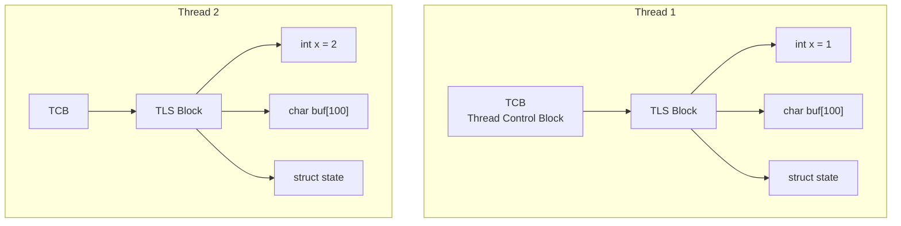
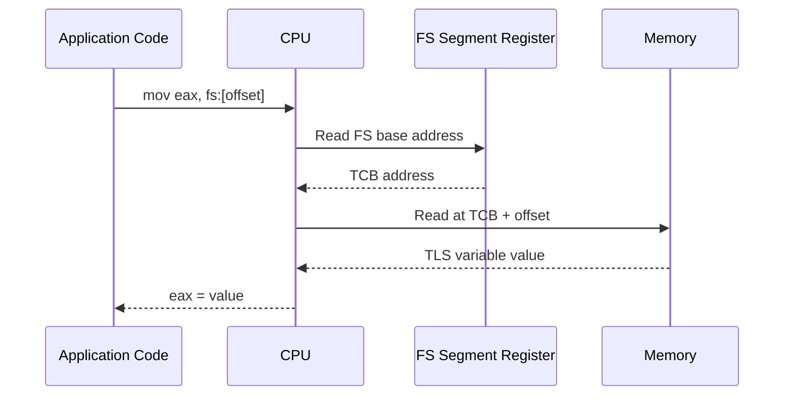
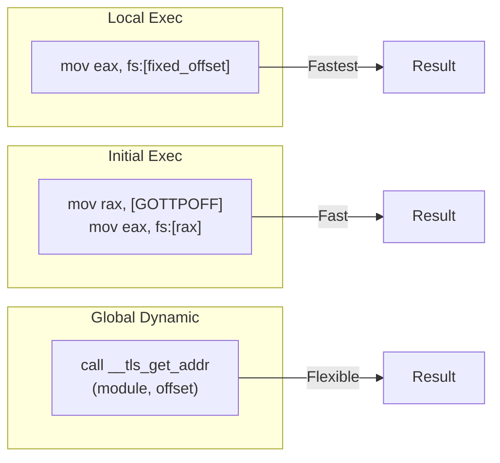

# Chapter 89: Thread-Local Storage — __thread, TLS Model (initial/exec/dynamic), glibc TLS

## 1. Intuition

Thread-Local Storage (TLS) provides each thread with its own copy of a variable. While global variables are shared among all threads, and local variables (on the stack) are inherently private, TLS gives you the best of both worlds: the lifetime and accessibility of a global variable, but with per-thread isolation.

TLS is essential for several reasons:
- **errno**: Each thread needs its own `errno` value
- **Random number generators**: Each thread needs its own state
- **Connection pools**: Per-thread database connections
- **Performance counters**: Per-thread statistics without synchronization

The implementation is surprisingly complex, involving compiler support (`__thread` keyword), dynamic linker support (for shared libraries), and architecture-specific mechanisms (segment registers on x86, thread pointers on ARM).

## 2. Architecture

### 2.1 TLS Models

Linux supports several TLS models, each with different trade-offs:

| Model | Description | Use Case |
|-------|-------------|----------|
| **Local Dynamic** | Variables defined in current module | Shared library internal TLS |
| **Initial Exec** | Variables defined in executable | Static executable TLS |
| **Global Dynamic** | Variables may be in any module | Shared library exported TLS |
| **Local Exec** | Variables defined in executable | Most efficient for executable |

### 2.2 TLS Layout

```
Thread Control Block (TCB)
    │
    ├── Pointer to TLS data
    │
    └── TLS Block
        ├── Module 1 TLS data (executable)
        │   ├── __thread int x
        │   └── __thread char buf[100]
        │
        ├── Module 2 TLS data (libfoo.so)
        │   ├── __thread int y
        │   └── __thread struct state
        │
        └── Module N TLS data (libbar.so)
            └── ...
```

### 2.3 x86-64 TLS Implementation

On x86-64, the TLS base address is stored in the `FS` segment register:

```
FS register → TCB → TLS Block
```

Accessing a TLS variable:
```asm
mov eax, fs:[offset]  ; Access TLS variable at offset
```

## 3. Kernel Implementation

### 3.1 Setting TLS (arch_prctl)

```c
/* arch/x86/kernel/process.c */
long set_thread_area(unsigned long addr) {
    /* Set FS base for x86-64 */
    current->thread.fsbase = addr;

    /* Write to MSR (Model Specific Register) */
    wrmsrl(MSR_FS_BASE, addr);

    return 0;
}

/* arch/x86/entry/common.c */
SYSCALL_DEFINE2(arch_prctl, int, option, unsigned long, arg2) {
    switch (option) {
    case ARCH_SET_FS:
        return set_thread_area(arg2);
    case ARCH_GET_FS:
        return get_thread_area((unsigned long __user *)arg2);
    case ARCH_SET_GS:
        return set_thread_area_gs(arg2);
    case ARCH_GET_GS:
        return get_thread_area_gs((unsigned long __user *)arg2);
    }
}
```

### 3.2 clone() and TLS

When creating a thread, `CLONE_SETTLS` tells the kernel to set the TLS pointer:

```c
/* kernel/fork.c */
static struct task_struct *copy_process(...) {
    /* ... */

    if (clone_flags & CLONE_SETTLS) {
        /* Set thread-local storage pointer */
        ret = set_tls(clone_args->tls);
    }

    /* ... */
}
```

### 3.3 exec() and TLS

When a new program is loaded, the TLS is initialized from the ELF:

```c
/* fs/binfmt_elf.c */
static int load_elf_binary(struct linux_binprm *bprm) {
    /* ... */

    /* Set up TLS from PT_TLS segment */
    for (i = 0; i < elf_ex->e_phnum; i++) {
        if (elf_ppnt[i].p_type == PT_TLS) {
            /* Copy TLS initialization image */
            /* Set up TLS pointer */
        }
    }

    /* ... */
}
```

## 4. Source Code References

| File | Description |
|------|-------------|
| `arch/x86/kernel/process.c` | TLS setup (arch_prctl) |
| `kernel/fork.c` | CLONE_SETTLS handling |
| `fs/binfmt_elf.c` | TLS initialization during exec |
| `elf/dl-tls.c` (glibc) | Dynamic TLS management |
| `nptl/descr.h` (glibc) | Thread descriptor with TLS info |
| `include/asm-generic/elf.h` | TLS-related ELF definitions |

## 5. Data Structures

### 5.1 ELF TLS Segment

```c
/* include/uapi/linux/elf.h */
/* PT_TLS program header */
typedef struct {
    Elf64_Word p_type;      /* PT_TLS */
    Elf64_Word p_flags;
    Elf64_Off  p_offset;    /* File offset of TLS init image */
    Elf64_Addr p_vaddr;     /* Virtual address (unused) */
    Elf64_Addr p_paddr;     /* Physical address (unused) */
    Elf64_Xword p_filesz;   /* Size of TLS init image in file */
    Elf64_Xword p_memsz;    /* Total size of TLS (init + bss) */
    Elf64_Xword p_align;    /* Alignment */
} Elf64_Phdr;
```

### 5.2 Thread Descriptor TLS Info (glibc)

```c
/* nptl/descr.h (glibc) */
struct pthread {
    /* ... */

    /* TLS information */
    void *tcb;              /* Thread control block pointer */
    dtv_t *dtv;             /* Dynamic thread vector */
    void *tls_block;        /* TLS block pointer */

    /* ... */
};

/* Dynamic Thread Vector */
typedef union dtv {
    size_t counter;
    struct {
        void *val;          /* Pointer to TLS block */
        bool is_static;     /* Static or dynamic allocation */
    } pointer;
} dtv_t;
```

### 5.3 TLS Module Info (glibc)

```c
/* elf/dl-tls.c (glibc) */
struct tls_index {
    unsigned long ti_module;    /* Module ID */
    unsigned long ti_offset;    /* Offset within TLS block */
};

/* TLS descriptor for dynamic TLS */
typedef struct {
    long int ti_module;
    long int ti_offset;
} tls_index;
```

## 6. C/Assembly Examples

### 6.1 Basic __thread Usage

```c
#include <stdio.h>
#include <pthread.h>
#include <unistd.h>

/* Thread-local variable */
__thread int thread_id = 0;
__thread char thread_name[32] = "unnamed";

void *thread_func(void *arg) {
    int id = *(int *)arg;

    /* Each thread has its own copy */
    thread_id = id;
    snprintf(thread_name, sizeof(thread_name), "Thread-%d", id);

    printf("Thread %d: thread_id=%d, thread_name=%s\n",
           id, thread_id, thread_name);

    /* Modify and verify isolation */
    thread_id += 100;
    printf("Thread %d: modified thread_id=%d\n", id, thread_id);

    sleep(1);

    /* Check that other threads' values are unaffected */
    printf("Thread %d: thread_id still=%d\n", id, thread_id);

    return NULL;
}

int main(void) {
    pthread_t threads[3];
    int ids[3] = {1, 2, 3};

    for (int i = 0; i < 3; i++) {
        pthread_create(&threads[i], NULL, thread_func, &ids[i]);
    }

    for (int i = 0; i < 3; i++) {
        pthread_join(threads[i], NULL);
    }

    /* main's copy is separate */
    printf("Main: thread_id=%d, thread_name=%s\n", thread_id, thread_name);

    return 0;
}
```

### 6.2 Thread-Safe errno Implementation

```c
/* How errno works with TLS */
#include <stdio.h>
#include <errno.h>
#include <pthread.h>
#include <string.h>

/* errno is actually a thread-local macro */
/* On modern Linux: #define errno (*__errno_location()) */
/* __errno_location() returns pointer to thread-local errno */

void *thread_func(void *arg) {
    int id = *(int *)arg;

    /* Set errno for this thread */
    errno = 0;

    /* Some operation that sets errno */
    FILE *f = fopen("/nonexistent", "r");
    if (!f) {
        printf("Thread %d: errno=%d (%s)\n", id, errno, strerror(errno));
    }

    /* Each thread has its own errno */
    printf("Thread %d: errno address=%p\n", id, &errno);

    return NULL;
}

int main(void) {
    pthread_t threads[2];
    int ids[2] = {1, 2};

    for (int i = 0; i < 2; i++) {
        pthread_create(&threads[i], NULL, thread_func, &ids[i]);
    }

    for (int i = 0; i < 2; i++) {
        pthread_join(threads[i], NULL);
    }

    printf("Main: errno address=%p\n", &errno);
    printf("(Different addresses = different thread-local copies)\n");

    return 0;
}
```

### 6.3 __thread with Different Types

```c
#include <stdio.h>
#include <pthread.h>

/* Various TLS types */
__thread int counter = 0;
__thread double accumulator = 0.0;
__thread struct {
    int x, y;
    char name[20];
} point = { .x = 0, .y = 0, .name = "origin" };

__thread int array[10] = { 0 };

void *thread_func(void *arg) {
    int id = *(int *)arg;

    /* Each thread has its own copies */
    counter = id * 100;
    accumulator = id * 3.14;
    point.x = id;
    point.y = id * 2;
    snprintf(point.name, sizeof(point.name), "point-%d", id);

    for (int i = 0; i < 10; i++)
        array[i] = id * 10 + i;

    printf("Thread %d: counter=%d, accumulator=%.2f, point=(%d,%d,%s)\n",
           id, counter, accumulator, point.x, point.y, point.name);

    return NULL;
}

int main(void) {
    pthread_t threads[3];
    int ids[3] = {1, 2, 3};

    for (int i = 0; i < 3; i++)
        pthread_create(&threads[i], NULL, thread_func, &ids[i]);

    for (int i = 0; i < 3; i++)
        pthread_join(threads[i], NULL);

    /* Main's TLS copies are zero-initialized */
    printf("Main: counter=%d, accumulator=%.2f\n", counter, accumulator);

    return 0;
}
```

### 6.4 pthread_key_t (POSIX TLS API)

```c
#include <stdio.h>
#include <stdlib.h>
#include <pthread.h>

/* POSIX TLS API (alternative to __thread) */
pthread_key_t tls_key;

void tls_destructor(void *value) {
    printf("Destructor: freeing %p\n", value);
    free(value);
}

void *thread_func(void *arg) {
    int id = *(int *)arg;

    /* Allocate TLS data */
    int *data = malloc(sizeof(int));
    *data = id * 100;

    /* Set TLS value */
    pthread_setspecific(tls_key, data);

    /* Get TLS value */
    int *retrieved = (int *)pthread_getspecific(tls_key);
    printf("Thread %d: TLS value = %d\n", id, *retrieved);

    return NULL;
}

int main(void) {
    /* Create TLS key with destructor */
    pthread_key_create(&tls_key, tls_destructor);

    pthread_t threads[3];
    int ids[3] = {1, 2, 3};

    for (int i = 0; i < 3; i++)
        pthread_create(&threads[i], NULL, thread_func, &ids[i]);

    for (int i = 0; i < 3; i++)
        pthread_join(threads[i], NULL);

    /* Delete TLS key */
    pthread_key_delete(tls_key);

    return 0;
}
```

### 6.5 Accessing TLS via Assembly (x86-64)

```asm
; x86-64: Access thread-local variable
; FS register points to TCB (Thread Control Block)

section .text
global get_tls_value
global set_tls_value

; int get_tls_value(void);
; Returns value of TLS variable at known offset
get_tls_value:
    ; On x86-64, TLS variables are accessed via FS segment
    ; The exact offset depends on the TLS layout
    mov     eax, fs:[-4]    ; Example: TLS variable at offset -4
    ret

; void set_tls_value(int value);
set_tls_value:
    mov     fs:[-4], edi    ; Set TLS variable at offset -4
    ret

; Get thread pointer (FS base)
get_thread_pointer:
    ; Read FS base using rdfsbase (if available) or arch_prctl
    rdfsbase rax
    ret
```

### 6.6 Checking TLS Model

```c
#include <stdio.h>

/* Different TLS models affect code generation */

/* Local Exec: fastest, for executable-only TLS */
__thread int local_exec_var = 42;

/* Initial Exec: for TLS in executable, may be from shared lib */
__thread int initial_exec_var __attribute__((tls_model("initial-exec"))) = 100;

/* Global Dynamic: most flexible, for shared libraries */
__thread int global_dynamic_var __attribute__((tls_model("global-dynamic"))) = 200;

int main(void) {
    printf("local_exec_var:      %d\n", local_exec_var);
    printf("initial_exec_var:    %d\n", initial_exec_var);
    printf("global_dynamic_var:  %d\n", global_dynamic_var);

    /* Check TLS model effects with: */
    /* gcc -S -O2 tls_example.c */
    /* Look at the different instructions used for each variable */

    return 0;
}
```

## 7. Diagrams

### 7.1 TLS Layout



### 7.2 x86-64 TLS Access



### 7.3 TLS Models Comparison



## 8. Performance

### 8.1 TLS Access Performance

| Model | Instructions | Latency |
|-------|-------------|---------|
| Local Exec | 1 (direct FS access) | ~1 ns |
| Initial Exec | 2-3 (GOT access + FS) | ~2-3 ns |
| Global Dynamic | Function call | ~5-10 ns |
| pthread_getspecific | Function call | ~3-5 ns |

### 8.2 TLS Allocation

- **Static TLS**: Allocated at thread creation, no runtime overhead
- **Dynamic TLS**: Allocated on first access, may involve malloc

### 8.3 Optimization Tips

1. **Use `__thread`** for simple types (int, pointer, struct)
2. **Use `initial-exec` model** when possible for shared libraries
3. **Avoid dynamic TLS** in performance-critical paths
4. **Cache TLS pointers** when accessing multiple variables

## 9. Security

### 9.1 TLS Security Considerations

1. **Information isolation**: TLS prevents accidental data sharing
2. **Stack overflow**: TLS is typically on the stack — overflow can corrupt it
3. **Sensitive data**: TLS doesn't provide confidentiality (still in process memory)

### 9.2 Secure TLS Usage

```c
/* Use TLS for per-thread buffers to avoid race conditions */
__thread char error_buffer[256];

char *thread_safe_strerror(int err) {
    strerror_r(err, error_buffer, sizeof(error_buffer));
    return error_buffer;
}
```

## 10. Common Pitfalls

### Pitfall 1: __thread Initialization

```c
/* WRONG: __thread variables can't have complex initializers */
__thread struct complex_type x = { .a = 1, .b = init_func() };  /* Error! */

/* RIGHT: Use simple initializers or initialize at runtime */
__thread struct complex_type x;
void thread_init(void) {
    x.a = 1;
    x.b = compute_value();
}
```

### Pitfall 2: TLS in Shared Libraries

```c
/* WRONG: Using __thread with global-dynamic model in performance loop */
__thread int counter __attribute__((tls_model("global-dynamic")));

void hot_function(void) {
    for (int i = 0; i < 1000000; i++) {
        counter++;  /* TLS lookup every iteration! */
    }
}

/* RIGHT: Use initial-exec or cache the address */
__thread int counter __attribute__((tls_model("initial-exec")));

void hot_function(void) {
    int *local_counter = &counter;  /* Cache TLS address */
    for (int i = 0; i < 1000000; i++) {
        (*local_counter)++;
    }
}
```

### Pitfall 3: pthread_key_t Limits

```c
/* WRONG: Creating too many TLS keys */
/* PTHREAD_KEYS_MAX is typically 1024 */
for (int i = 0; i < 2000; i++) {
    pthread_key_create(&keys[i], NULL);  /* May fail! */
}

/* RIGHT: Use __thread or consolidate keys */
```

### Pitfall 4: Accessing TLS After Thread Exit

```c
/* WRONG: Accessing TLS from a terminated thread */
pthread_t thread;
int *tls_ptr;

void *thread_func(void *arg) {
    __thread int tls_var = 42;
    tls_ptr = &tls_var;
    return NULL;
}

pthread_create(&thread, NULL, thread_func, NULL);
pthread_join(thread, NULL);
printf("%d\n", *tls_ptr);  /* Undefined behavior! */

/* RIGHT: Don't access TLS from other threads */
```

### Pitfall 5: TLS Destructor Ordering

```c
/* WRONG: TLS destructors may run in undefined order */
pthread_key_create(&key1, destructor1);
pthread_key_create(&key2, destructor2);
/* destructor1 and destructor2 may run in any order */

/* RIGHT: Don't depend on TLS destructor ordering */
```

### Pitfall 6: __thread and dlopen()

```c
/* WRONG: Using TLS from dynamically loaded library without care */
void *handle = dlopen("libfoo.so", RTLD_NOW);
/* Accessing TLS from libfoo before it's properly initialized */

/* RIGHT: Ensure library initialization before accessing TLS */
```

## 11. Best Practices

1. **Use `__thread`** for simple TLS variables
2. **Use `pthread_key_t`** when you need destructors
3. **Specify TLS model** explicitly in shared libraries
4. **Initialize TLS variables** in thread initialization code
5. **Avoid large TLS blocks** — they're allocated per-thread
6. **Use `__thread` for errno-like patterns** (per-thread error state)
7. **Consider `thread_local` (C11)** for portable code

### C11 thread_local

C11 introduced the `thread_local` keyword, which is more portable than `__thread`:

```c
#include <threads.h>

thread_local int counter = 0;
thread_local char buffer[1024];

int thread_func(void *arg) {
    counter = 42;  /* Each thread has its own copy */
    return 0;
}
```

C++11 also has `thread_local`:

```cpp
thread_local int counter = 0;
thread_local std::string name;
```

### TLS in Shared Libraries

When using TLS in shared libraries, the TLS model matters for performance:

1. **Global Dynamic (default for shared libraries)**: Most flexible, but slowest. Uses `__tls_get_addr()` function call.

2. **Initial Exec**: Faster, but TLS must be allocated at library load time. Can't handle lazy allocation.

3. **Local Exec**: Fastest, but only works for TLS in the main executable.

```c
/* Force a specific TLS model */
__thread int var1 __attribute__((tls_model("initial-exec"))) = 0;
__thread int var2 __attribute__((tls_model("global-dynamic"))) = 0;
```

### TLS and Dynamic Loading

When a shared library is loaded with `dlopen()`, its TLS must be allocated dynamically. This has implications:

1. **First access cost**: The first access to a TLS variable from a new library triggers allocation
2. **dtv growth**: The Dynamic Thread Vector may need to be reallocated
3. **Thread iteration**: All threads must be updated when new TLS is allocated

```c
/* Illustration of dynamic TLS allocation */
#include <dlfcn.h>

void *handle = dlopen("libfoo.so", RTLD_NOW);
typedef int (*get_tls_func)(void);

/* First call allocates TLS for this thread */
get_tls_func get_var = dlsym(handle, "get_tls_var");
int value = get_var();  /* Triggers TLS allocation */
```

### Debugging TLS Issues

Common TLS problems and debugging techniques:

1. **TLS exhaustion**: Too many TLS variables or too many modules
   - Check with: `readelf -l executable | grep TLS`

2. **TLS access after dlclose**: Accessing TLS after library is unloaded
   - Always nullify pointers after `dlclose()`

3. **Performance issues**: Slow TLS access in hot loops
   - Use `initial-exec` model or cache TLS pointers

4. **ABI incompatibility**: Different TLS layouts between compiler versions
   - Recompile all libraries with same compiler

```bash
# Examine TLS layout
readelf -l /path/to/binary | grep -A5 TLS

# Check TLS size
readelf -S /path/to/binary | grep tbss
readelf -S /path/to/binary | grep tdata
```

## 12. Exercises

### Exercise 1: Thread-Safe Counter

Implement a thread-safe counter using `__thread` and periodic aggregation.

### Exercise 2: Per-Thread Connection Pool

Design a connection pool where each thread has its own set of connections using TLS.

### Exercise 3: TLS Performance Benchmark

Write a benchmark comparing access speed of `__thread`, `pthread_getspecific`, and global variables.

### Exercise 4: TLS Destructor

Write a program that uses `pthread_key_create` with a destructor to clean up thread-local resources.

### Exercise 5: TLS Model Comparison

Write code that demonstrates the difference between TLS models by examining the generated assembly.

### Exercise 6: Thread-Local Random Number Generator

Implement a thread-local random number generator that maintains per-thread state without synchronization.

### Exercise 7: errno Implementation

Write your own implementation of `errno` using TLS, demonstrating how each thread gets its own error code.

### Exercise 8: TLS in Shared Libraries

Create a shared library that exports TLS variables. Write a program that loads the library with `dlopen()` and accesses the TLS variables from multiple threads.

## 13. References

1. **glibc source**: `elf/dl-tls.c` — TLS management
2. **glibc source**: `nptl/` — NPTL TLS support
3. **man pages**: `pthreads(7)`, `__thread` documentation
4. **ELF specification**: TLS chapter
5. **"ELF Handling For Thread-Local Storage"** by Ulrich Drepper
6. **LWN.net**: "Thread-local storage" — https://lwn.net/Articles/
7. **GCC documentation**: TLS models
8. **ARM/AArch64 TLS**: Architecture-specific TLS implementation
