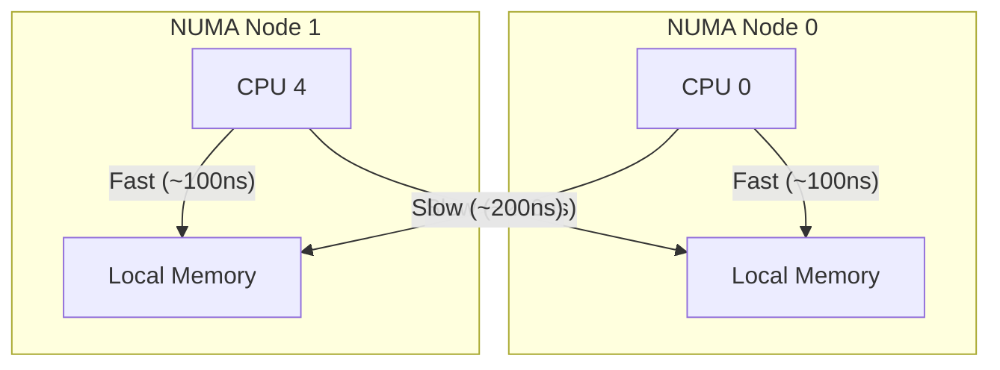
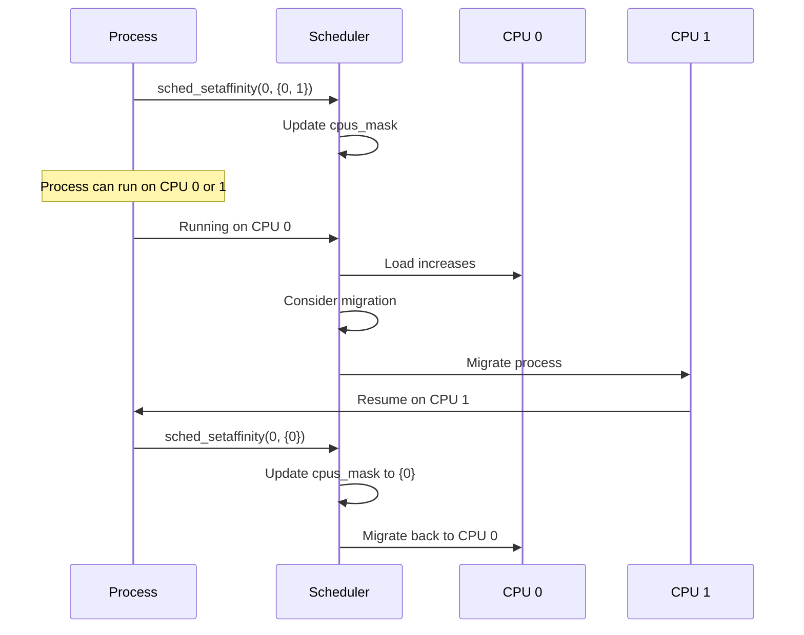
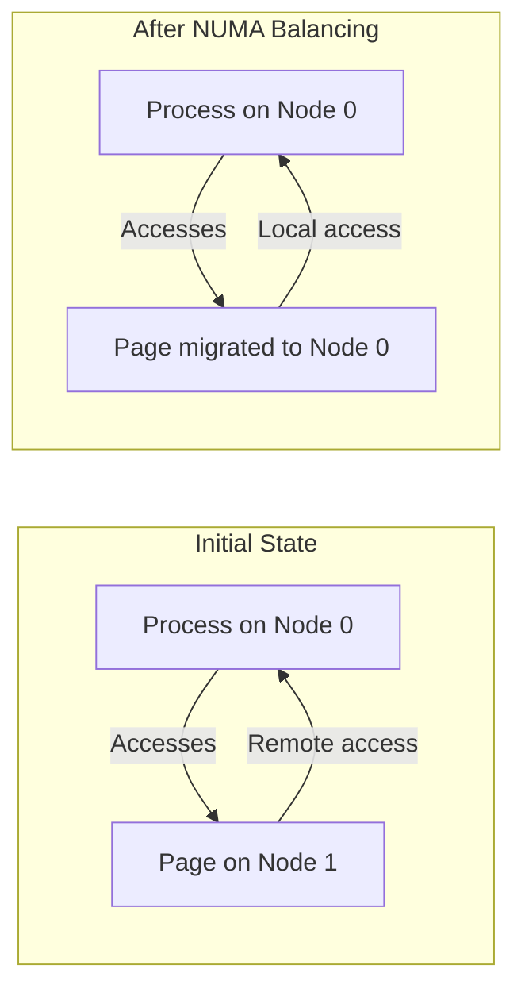

# Chapter 90: NUMA and CPU Affinity — numactl, sched_setaffinity(), /proc/PID/status

## 1. Intuition

Modern multi-socket servers have a **Non-Uniform Memory Access (NUMA)** architecture where each CPU has its own local memory. Accessing local memory is fast, while accessing memory attached to another CPU is slower (often 2-3x). Understanding NUMA and CPU affinity is crucial for optimizing performance on modern hardware.

**CPU affinity** determines which CPU(s) a process or thread can run on. By pinning processes to specific CPUs, you can:
- Reduce cache misses (process stays on same CPU)
- Improve NUMA locality (process accesses local memory)
- Isolate critical workloads (dedicate CPUs to real-time tasks)
- Improve predictability (consistent performance)

The Linux scheduler normally migrates processes across CPUs for load balancing. CPU affinity overrides this, giving you explicit control.

## 2. Architecture

### 2.1 NUMA Topology

```
┌─────────────────────────────────────────────────────────┐
│                    NUMA Node 0                          │
│  ┌─────────┐  ┌─────────┐  ┌─────────┐  ┌─────────┐  │
│  │  CPU 0  │  │  CPU 1  │  │  CPU 2  │  │  CPU 3  │  │
│  └─────────┘  └─────────┘  └─────────┘  └─────────┘  │
│  ┌──────────────────────────────────────────────────┐  │
│  │              Local Memory (fast)                  │  │
│  └──────────────────────────────────────────────────┘  │
└─────────────────────────────────────────────────────────┘
        │                                    │
        │ Interconnect (QPI/UPI)             │
        │                                    │
┌─────────────────────────────────────────────────────────┐
│                    NUMA Node 1                          │
│  ┌─────────┐  ┌─────────┐  ┌─────────┐  ┌─────────┐  │
│  │  CPU 4  │  │  CPU 5  │  │  CPU 6  │  │  CPU 7  │  │
│  └─────────┘  └─────────┘  └─────────┘  └─────────┘  │
│  ┌──────────────────────────────────────────────────┐  │
│  │              Local Memory (fast)                  │  │
│  └──────────────────────────────────────────────────┘  │
└─────────────────────────────────────────────────────────┘
```

### 2.2 Memory Access Latencies

| Access Type | Typical Latency |
|-------------|----------------|
| Local NUMA memory | ~100 ns |
| Remote NUMA memory | ~150-300 ns |
| Cache hit (L1) | ~1 ns |
| Cache hit (L2) | ~4 ns |
| Cache hit (L3) | ~12 ns |

### 2.3 CPU Affinity API

| Function | Description |
|----------|-------------|
| `sched_setaffinity(pid, len, mask)` | Set CPU affinity |
| `sched_getaffinity(pid, len, mask)` | Get CPU affinity |
| `taskset` | Command-line affinity tool |
| `numactl` | NUMA control utility |
| `cgroups` | Container-level CPU affinity |

## 3. Kernel Implementation

### 3.1 sched_setaffinity()

```c
/* kernel/sched/core.c */
int sched_setaffinity(pid_t pid, const struct cpumask *mask) {
    struct task_struct *p;
    int retval;

    /* Find target process */
    rcu_read_lock();
    p = find_process_by_pid(pid);
    if (!p) {
        rcu_read_unlock();
        return -ESRCH;
    }

    /* Check permissions */
    if (!check_same_owner(p) && !capable(CAP_SYS_NICE)) {
        rcu_read_unlock();
        return -EPERM;
    }

    /* Validate mask — at least one CPU must be allowed */
    if (!cpumask_intersects(mask, cpu_active_mask)) {
        rcu_read_unlock();
        return -EINVAL;
    }

    /* Set affinity */
    retval = __set_cpus_allowed_ptr(p, mask, true);

    rcu_read_unlock();
    return retval;
}
```

### 3.2 __set_cpus_allowed_ptr()

```c
/* kernel/sched/core.c */
static int __set_cpus_allowed_ptr(struct task_struct *p,
                                  const struct cpumask *new_mask,
                                  bool check) {
    struct rq_flags rf;
    struct rq *rq;
    unsigned long flags;
    int ret = 0;

    rq = task_rq_lock(p, &rf);

    /* Check if task can run on any CPU in the mask */
    if (!cpumask_intersects(new_mask, cpu_active_mask)) {
        ret = -EINVAL;
        goto out;
    }

    /* Update affinity mask */
    cpumask_copy(&p->cpus_mask, new_mask);

    /* If current CPU is not in new mask, need to migrate */
    if (!cpumask_test_cpu(task_cpu(p), new_mask)) {
        /* Find a suitable CPU */
        int dest_cpu = cpumask_any_and(new_mask, cpu_active_mask);

        /* Migrate the task */
        if (task_on_rq_queued(p))
            rq = move_queued_task(rq, p, dest_cpu);
    }

out:
    task_rq_unlock(rq, p, &rf);
    return ret;
}
```

### 3.3 NUMA Memory Policy

```c
/* mm/mempolicy.c */
/* Set NUMA memory policy */
SYSCALL_DEFINE4(set_mempolicy, int, mode, const unsigned long __user *, nodemask,
                unsigned long, maxnode, unsigned long, flags) {
    struct mempolicy *new;
    nodemask_t nodes;

    /* Copy nodemask from user */
    if (nodemask) {
        if (copy_from_user(&nodes, nodemask, sizeof(nodes)))
            return -EFAULT;
    }

    /* Create new policy */
    switch (mode) {
    case MPOL_DEFAULT:
        new = NULL;  /* Use system default */
        break;
    case MPOL_BIND:
        new = mpol_new(mode, &nodes);
        break;
    case MPOL_PREFERRED:
        new = mpol_new(mode, &nodes);
        break;
    case MPOL_INTERLEAVE:
        new = mpol_new(mode, &nodes);
        break;
    }

    /* Apply to current process */
    set_task_policy(current, new);

    return 0;
}
```

### 3.4 NUMA Balancing

The kernel automatically migrates memory pages to the NUMA node where they're accessed most:

```c
/* mm/migrate.c */
static int numamigrate_isolate_page(pg_data_t *pgdat, struct page *page) {
    /* Isolate page for migration */
    /* ... */
}

/* kernel/sched/fair.c */
static void task_numa_fault(struct task_struct *p, int node, int pages) {
    /* Record NUMA faults */
    p->numa_faults[node] += pages;

    /* If too many remote faults, consider migrating */
    if (should_numa_migrate_memory(p, node)) {
        /* Schedule page migration */
        numa_migrate_prep(p);
    }
}
```

## 4. Source Code References

| File | Description |
|------|-------------|
| `kernel/sched/core.c` | CPU affinity implementation |
| `mm/mempolicy.c` | NUMA memory policy |
| `mm/migrate.c` | Page migration for NUMA balancing |
| `kernel/sched/topology.c` | NUMA topology detection |
| `arch/x86/kernel/smpboot.c` | NUMA node initialization |
| `include/linux/topology.h` | NUMA topology structures |

## 5. Data Structures

### 5.1 CPU Affinity in task_struct

```c
struct task_struct {
    /* ... */

    /* CPU affinity */
    cpumask_t cpus_mask;        /* CPUs this task can run on */
    int nr_cpus_allowed;        /* Number of CPUs in mask */

    /* NUMA policy */
    struct mempolicy *mempolicy;

    /* NUMA fault counters */
    unsigned long *numa_faults;
    unsigned long total_numa_faults;

    /* ... */
};
```

### 5.2 NUMA Node Information

```c
/* include/linux/topology.h */
typedef struct {
    /* ... */
} nodemask_t;

/* Per-CPU NUMA node mapping */
extern int cpu_to_node(int cpu);

/* Node distance */
extern int node_distance(int from, int to);
```

### 5.3 Memory Policy

```c
/* include/linux/mempolicy.h */
struct mempolicy {
    atomic_t refcnt;
    unsigned short mode;        /* MPOL_DEFAULT, BIND, PREFERRED, INTERLEAVE */
    unsigned short flags;
    nodemask_t nodes;           /* Node mask for BIND/INTERLEAVE */
    int home_node;              /* Preferred node for PREFERRED */
};
```

## 6. C/Assembly Examples

### 6.1 Basic CPU Affinity

```c
#define _GNU_SOURCE
#include <stdio.h>
#include <sched.h>
#include <unistd.h>

int main(void) {
    cpu_set_t mask;
    int cpu;

    /* Get current affinity */
    sched_getaffinity(0, sizeof(mask), &mask);

    printf("Allowed CPUs: ");
    for (cpu = 0; cpu < CPU_SETSIZE; cpu++) {
        if (CPU_ISSET(cpu, &mask))
            printf("%d ", cpu);
    }
    printf("\n");

    printf("Currently running on CPU: %d\n", sched_getcpu());

    /* Pin to CPU 0 */
    CPU_ZERO(&mask);
    CPU_SET(0, &mask);

    if (sched_setaffinity(0, sizeof(mask), &mask) == -1) {
        perror("sched_setaffinity");
    } else {
        printf("Pinned to CPU 0\n");
        printf("Now running on CPU: %d\n", sched_getcpu());
    }

    /* Pin to CPUs 0 and 1 */
    CPU_ZERO(&mask);
    CPU_SET(0, &mask);
    CPU_SET(1, &mask);

    sched_setaffinity(0, sizeof(mask), &mask);
    printf("Now allowed on CPUs 0 and 1\n");

    return 0;
}
```

### 6.2 NUMA Topology Detection

```c
#define _GNU_SOURCE
#include <stdio.h>
#include <sched.h>
#include <numa.h>
#include <numaif.h>

int main(void) {
    if (numa_available() == -1) {
        printf("NUMA not available\n");
        return 1;
    }

    printf("NUMA Configuration:\n");
    printf("  Number of nodes: %d\n", numa_num_configured_nodes());
    printf("  Number of CPUs:  %d\n", numa_num_configured_cpus());
    printf("  Maximum node:    %d\n", numa_max_node());

    /* Print node-to-CPU mapping */
    printf("\nNode to CPU mapping:\n");
    for (int node = 0; node <= numa_max_node(); node++) {
        struct bitmask *cpus = numa_allocate_cpumask();
        numa_node_to_cpus(node, cpus, numa_bitmask_nbytes(cpus));

        printf("  Node %d: CPUs ", node);
        for (int cpu = 0; cpu < numa_num_configured_cpus(); cpu++) {
            if (numa_bitmask_isbitset(cpus, cpu))
                printf("%d ", cpu);
        }
        printf("\n");

        numa_bitmask_free(cpus);
    }

    /* Print node distances */
    printf("\nNode distances:\n");
    for (int i = 0; i <= numa_max_node(); i++) {
        for (int j = 0; j <= numa_max_node(); j++) {
            printf("%3d ", numa_distance(i, j));
        }
        printf("\n");
    }

    /* Print current NUMA node */
    int current_node = numa_node_of_cpu(sched_getcpu());
    printf("\nCurrent NUMA node: %d\n", current_node);

    return 0;
}
```

### 6.3 NUMA-Aware Memory Allocation

```c
#define _GNU_SOURCE
#include <stdio.h>
#include <stdlib.h>
#include <numa.h>
#include <numaif.h>
#include <sched.h>
#include <unistd.h>

int main(void) {
    if (numa_available() == -1) {
        printf("NUMA not available\n");
        return 1;
    }

    size_t size = 1024 * 1024 * 100;  /* 100 MB */

    /* Allocate on specific node */
    int target_node = 0;
    void *mem = numa_alloc_onnode(size, target_node);
    if (!mem) {
        perror("numa_alloc_onnode");
        return 1;
    }

    printf("Allocated %zu bytes on node %d at %p\n", size, target_node, mem);

    /* Touch memory to fault it in */
    for (size_t i = 0; i < size; i += 4096) {
        ((char *)mem)[i] = 0;
    }

    /* Check where memory actually is */
    int status[1];
    void *addrs[1] = {mem};
    get_mempolicy(status, NULL, 0, addrs, MPOL_F_NODE | MPOL_F_ADDR);
    printf("Memory is on node: %d\n", status[0]);

    /* Interleave allocation across all nodes */
    void *interleaved = numa_alloc_interleaved(size);
    if (interleaved) {
        printf("Interleaved allocation at %p\n", interleaved);
        numa_free(interleaved, size);
    }

    numa_free(mem, size);
    return 0;
}
```

### 6.4 Per-Thread CPU Affinity

```c
#define _GNU_SOURCE
#include <stdio.h>
#include <pthread.h>
#include <sched.h>
#include <unistd.h>

#define NUM_THREADS 4

void *thread_func(void *arg) {
    int thread_id = *(int *)arg;
    int target_cpu = thread_id;  /* Pin each thread to a different CPU */

    cpu_set_t mask;
    CPU_ZERO(&mask);
    CPU_SET(target_cpu, &mask);

    if (sched_setaffinity(0, sizeof(mask), &mask) == -1) {
        perror("sched_setaffinity");
    }

    printf("Thread %d: pinned to CPU %d, running on CPU %d\n",
           thread_id, target_cpu, sched_getcpu());

    /* Do some work */
    volatile long sum = 0;
    for (long i = 0; i < 100000000; i++) {
        sum += i;
    }

    return NULL;
}

int main(void) {
    pthread_t threads[NUM_THREADS];
    int ids[NUM_THREADS];

    for (int i = 0; i < NUM_THREADS; i++) {
        ids[i] = i;
        pthread_create(&threads[i], NULL, thread_func, &ids[i]);
    }

    for (int i = 0; i < NUM_THREADS; i++) {
        pthread_join(threads[i], NULL);
    }

    return 0;
}
```

### 6.5 Reading Affinity from /proc

```c
#include <stdio.h>
#include <stdlib.h>
#include <string.h>

int main(int argc, char *argv[]) {
    int pid = argc > 1 ? atoi(argv[1]) : getpid();
    char path[256];
    char line[1024];

    printf("CPU affinity for PID %d:\n\n", pid);

    /* Read /proc/PID/status */
    snprintf(path, sizeof(path), "/proc/%d/status", pid);
    FILE *f = fopen(path, "r");
    if (!f) {
        perror("fopen");
        return 1;
    }

    while (fgets(line, sizeof(line), f)) {
        if (strncmp(line, "Cpus_allowed:", 13) == 0 ||
            strncmp(line, "Cpus_allowed_list:", 18) == 0 ||
            strncmp(line, "Mems_allowed:", 13) == 0 ||
            strncmp(line, "Mems_allowed_list:", 18) == 0) {
            printf("  %s", line);
        }
    }
    fclose(f);

    /* Read /proc/PID/stat for current CPU */
    snprintf(path, sizeof(path), "/proc/%d/stat", pid);
    f = fopen(path, "r");
    if (f) {
        int p, pgrp, session, tty;
        unsigned cpu;
        char comm[256], state;

        /* Parse /proc/PID/stat (simplified) */
        fscanf(f, "%d %s %c %d %d %d %*d %*d %*u %*u %*u %*u %*u %*u %*u %*d %*d %*d %*d %*d %*d %*u %*u %*d %*u %*u %*u %*u %*u %*u %*u %*u %*u %*u %*u %*u %*u %*u %d",
               &p, comm, &state, &pgrp, &session, &tty, &cpu);
        printf("\n  Current CPU: %u\n", cpu);
        fclose(f);
    }

    return 0;
}
```

## 7. Diagrams

### 7.1 NUMA Memory Access



### 7.2 CPU Affinity and Migration



### 7.3 NUMA Balancing



## 8. Performance

### 8.1 NUMA Performance Impact

```bash
# Measure NUMA impact
numactl --hardware
numactl --cpunodebind=0 --membind=0 ./benchmark
numactl --cpunodebind=0 --membind=1 ./benchmark  # Remote memory
```

### 8.2 Affinity Performance

| Scenario | Benefit |
|----------|---------|
| Pin to single CPU | Reduced cache misses |
| Pin to NUMA node | Local memory access |
| Isolate CPU | Reduced interference |
| Avoid migration | Consistent latency |

### 8.3 Performance Measurement

```c
/* Measure memory access latency */
#include <stdio.h>
#include <stdlib.h>
#include <time.h>
#include <numa.h>

#define SIZE (1024 * 1024 * 100)  /* 100 MB */

int main(void) {
    struct timespec start, end;

    /* Allocate on local node */
    void *local = numa_alloc_local(SIZE);
    void *remote = numa_alloc_onnode(SIZE, 1);  /* Assuming node 1 is remote */

    /* Measure local access */
    clock_gettime(CLOCK_MONOTONIC, &start);
    for (size_t i = 0; i < SIZE; i += 4096) {
        ((volatile char *)local)[i]++;
    }
    clock_gettime(CLOCK_MONOTONIC, &end);
    printf("Local: %.2f ms\n",
           (end.tv_sec - start.tv_sec) * 1000.0 +
           (end.tv_nsec - start.tv_nsec) / 1e6);

    /* Measure remote access */
    clock_gettime(CLOCK_MONOTONIC, &start);
    for (size_t i = 0; i < SIZE; i += 4096) {
        ((volatile char *)remote)[i]++;
    }
    clock_gettime(CLOCK_MONOTONIC, &end);
    printf("Remote: %.2f ms\n",
           (end.tv_sec - start.tv_sec) * 1000.0 +
           (end.tv_nsec - start.tv_nsec) / 1e6);

    numa_free(local, SIZE);
    numa_free(remote, SIZE);

    return 0;
}
```

## 9. Security

### 9.1 Security Implications

1. **CPU isolation**: Pin sensitive workloads to dedicated CPUs
2. **Side-channel attacks**: Affinity can be used to control cache timing
3. **Resource denial**: Pinning all CPUs can starve other processes

### 9.2 Secure Affinity Practices

```c
/* Check permissions before setting affinity */
if (geteuid() != 0 && !check_nice_perm()) {
    fprintf(stderr, "Insufficient permissions for affinity change\n");
    return 1;
}
```

## 10. Common Pitfalls

### Pitfall 1: Over-Restricting Affinity

```c
/* WRONG: Pinning to CPU that may be offline */
cpu_set_t mask;
CPU_ZERO(&mask);
CPU_SET(7, &mask);  /* CPU 7 may not exist! */
sched_setaffinity(0, sizeof(mask), &mask);  /* May fail */

/* RIGHT: Check available CPUs first */
sched_getaffinity(0, sizeof(mask), &mask);
```

### Pitfall 2: Forgetting About NUMA

```c
/* WRONG: Allocating memory without considering NUMA */
/* Process runs on node 0, memory allocated on node 1 */
void *mem = malloc(1024 * 1024 * 100);

/* RIGHT: Use NUMA-aware allocation */
void *mem = numa_alloc_onnode(size, 0);
```

### Pitfall 3: Affinity Inheritance

```c
/* WRONG: Child inherits parent's restricted affinity */
sched_setaffinity(0, sizeof(mask), &mask);  /* Restrict parent */
fork();  /* Child inherits restricted affinity! */

/* RIGHT: Reset affinity in child if needed */
```

### Pitfall 4: Assuming NUMA Node == CPU

```c
/* WRONG: Assuming CPU numbers map directly to NUMA nodes */
/* CPU 4 might be on NUMA node 1, not node 0 */

/* RIGHT: Use numa_node_of_cpu() to check */
int node = numa_node_of_cpu(sched_getcpu());
```

### Pitfall 5: Not Considering NUMA Distance

```c
/* WRONG: Allocating on node 2 when node 1 is closer */
/* NUMA distances are not uniform! */

/* RIGHT: Check distances with numa_distance() */
int dist = numa_distance(current_node, target_node);
if (dist > 20) {
    /* Remote access — consider local allocation */
}
```

### Pitfall 6: Affinity Mask All-Off

```c
/* WRONG: Setting empty affinity mask */
cpu_set_t mask;
CPU_ZERO(&mask);
sched_setaffinity(0, sizeof(mask), &mask);  /* Fails — no CPUs allowed */

/* RIGHT: Always include at least one CPU */
CPU_ZERO(&mask);
CPU_SET(0, &mask);
sched_setaffinity(0, sizeof(mask), &mask);
```

### Pitfall 7: Ignoring NUMA Balancing

```c
/* WRONG: Assuming memory stays on allocated node */
/* NUMA balancing may migrate pages */

/* RIGHT: Use mbind() to enforce policy if needed */
unsigned long nodemask = 1 << target_node;
mbind(mem, size, MPOL_BIND, &nodemask, sizeof(nodemask) * 8, 0);
```

## 11. Best Practices

1. **Use `numactl`** for NUMA-aware application launch
2. **Set affinity for real-time tasks** to avoid migration
3. **Use NUMA-aware allocation** (`numa_alloc_onnode`)
4. **Measure NUMA impact** with benchmarks
5. **Use cgroups** for container-level CPU isolation
6. **Consider `isolcpus`** kernel parameter for dedicated CPUs
7. **Monitor NUMA balancing** with `/proc/vmstat`

### NUMA Balancing

Linux has automatic NUMA balancing that migrates pages to the node where they're most accessed:

```bash
# Check if NUMA balancing is enabled
cat /proc/sys/kernel/numa_balancing  # 1 = enabled

# NUMA balancing statistics
cat /proc/vmstat | grep numa
# numa_pte_updates        — PTEs updated for NUMA
# numa_hint_faults        — Hints delivered
# numa_hint_faults_local  — Faults on local node
# numa_pages_migrated     — Pages migrated
```

The NUMA balancing algorithm works by:
1. **Scanning**: Periodically marking page table entries as inaccessible
2. **Faulting**: When the process accesses the page, a NUMA fault occurs
3. **Counting**: The kernel counts which node the access came from
4. **Migrating**: If the page is accessed mostly from a remote node, it's migrated

### CPU Topology Detection

Modern CPUs have complex topologies with cores, threads, and caches:

```bash
# CPU topology
cat /sys/devices/system/cpu/cpu*/topology/physical_package_id
cat /sys/devices/system/cpu/cpu*/topology/core_id
cat /sys/devices/system/cpu/cpu*/topology/thread_siblings_list

# Cache topology
cat /sys/devices/system/cpu/cpu*/cache/index*/size
cat /sys/devices/system/cpu/cpu*/cache/index*/shared_cpu_list

# NUMA distance matrix
cat /sys/devices/system/node/node*/distance
```

### cgroups v2 CPU Controller

For containerized workloads, cgroups v2 provides CPU isolation:

```bash
# Create a cgroup
mkdir /sys/fs/cgroup/myapp

# Set CPU weight (relative share)
echo 100 > /sys/fs/cgroup/myapp/cpu.weight  # Default is 100

# Set CPU max (absolute limit)
echo "50000 100000" > /sys/fs/cgroup/myapp/cpu.max  # 50% of one CPU

# Pin to specific CPUs
echo "0-3" > /sys/fs/cgroup/myapp/cpuset.cpus
echo "0-1" > /sys/fs/cgroup/myapp/cpuset.mems

# Add process to cgroup
echo $$ > /sys/fs/cgroup/myapp/cgroup.procs

# Monitor CPU usage
stat /sys/fs/cgroup/myapp/cpu.stat
```

### Performance Analysis Tools

Several tools help analyze NUMA and affinity performance:

1. **numastat**: NUMA memory statistics
2. **numad**: Automatic NUMA affinity daemon
3. **taskset**: Set CPU affinity from command line
4. **cgroups**: Container-level CPU isolation
5. **perf**: Performance analysis with NUMA events
6. **turbostat**: CPU frequency and topology information

```bash
# Comprehensive NUMA analysis
numastat -p <pid>
numastat -m  # Memory statistics per node

# CPU affinity analysis
taskset -pc <pid>

# Performance events related to NUMA
perf stat -e node-loads,node-load-misses,node-stores,node-store-misses ./benchmark
```

## 12. Exercises

### Exercise 1: NUMA Topology Detector

Write a program that detects and displays the NUMA topology of the system.

### Exercise 2: NUMA-Aware Benchmark

Write a benchmark that measures memory access latency for local vs. remote NUMA access.

### Exercise 3: CPU Affinity Manager

Write a tool that manages CPU affinity for a set of processes, ensuring they don't share CPUs.

### Exercise 4: NUMA Memory Policy Test

Write a program that tests different NUMA memory policies (BIND, INTERLEAVE, PREFERRED) and measures their impact.

### Exercise 5: Process Migration Observer

Write a program that monitors process migration between CPUs using `/proc/PID/sched`.

### Exercise 6: NUMA-Aware Allocator

Implement a simple NUMA-aware memory allocator that allocates memory on the node closest to the requesting thread.

### Exercise 7: CPU Cache Effects

Write a program that demonstrates CPU cache effects by measuring access times for data that fits in L1/L2/L3 cache vs. main memory.

### Exercise 8: Multi-Node Scaling Test

Write a parallel program that scales across NUMA nodes, measuring performance as you increase the number of nodes used.

## 13. References

1. **Linux kernel source**: `kernel/sched/core.c` — CPU affinity
2. **Linux kernel source**: `mm/mempolicy.c` — NUMA policy
3. **man pages**: `sched_setaffinity(2)`, `numactl(8)`, `set_mempolicy(2)`
4. **numactl source**: https://github.com/numactl/numactl
5. **"Understanding the Linux Kernel"** by Bovet & Cesati
6. **Intel NUMA documentation**: https://www.intel.com/
7. **LWN.net**: "NUMA scheduling" — https://lwn.net/
8. **NUMA benchmarking**: https://github.com/numactl/numactl/wiki
