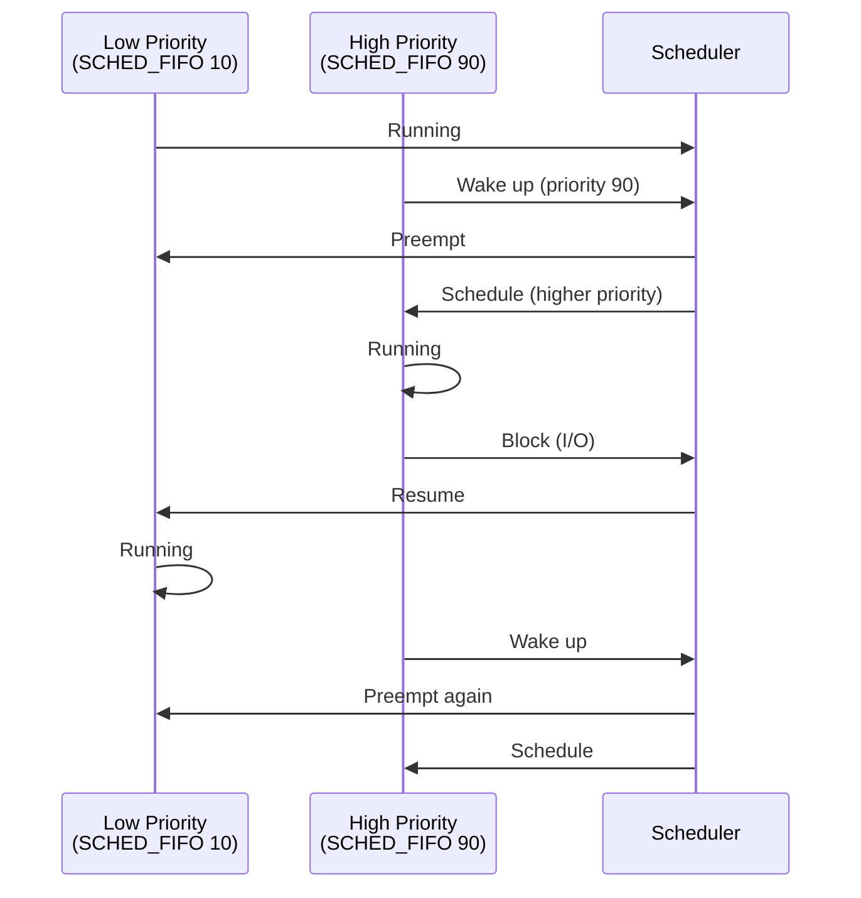
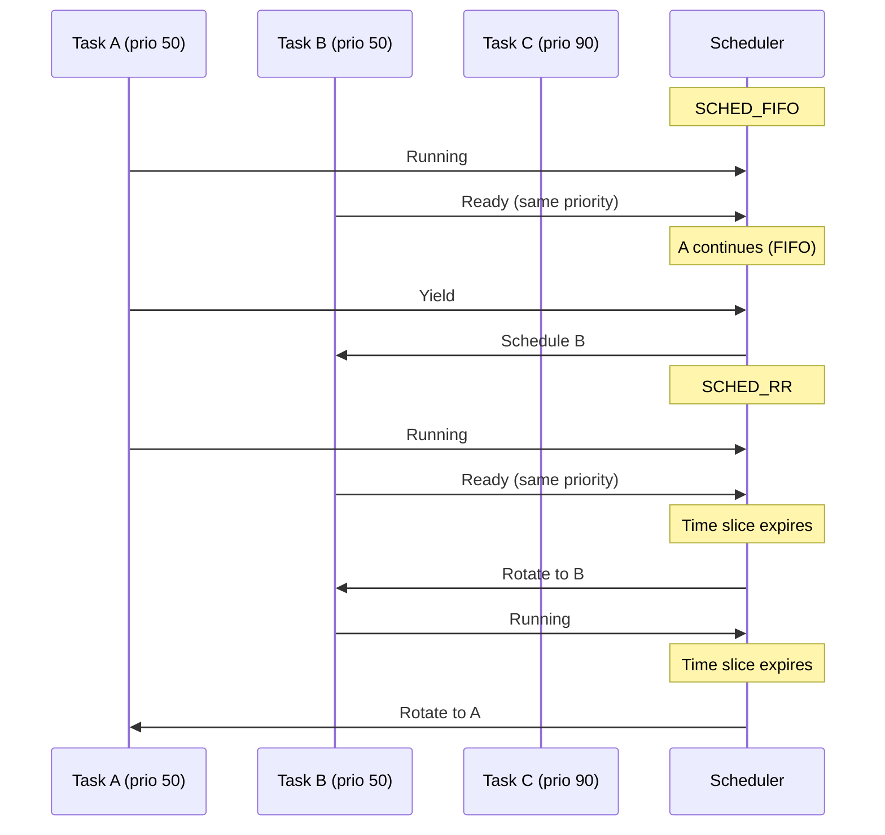
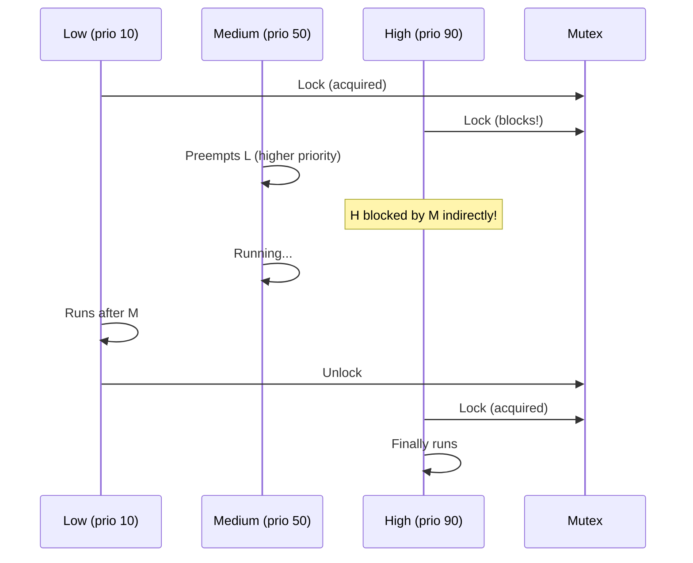

# Chapter 91: Realtime Scheduling — SCHED_FIFO, SCHED_RR, SCHED_DEADLINE, Priority Inversion

## 1. Intuition

Real-time scheduling guarantees that critical tasks meet their timing deadlines. Unlike normal processes that share CPU time fairly, real-time processes get **strict priority** — a higher-priority real-time task always runs before a lower-priority one, regardless of how long the lower-priority task has been waiting.

Linux provides three real-time scheduling policies:
- **SCHED_FIFO**: First-in-first-out within same priority level. A FIFO task runs until it blocks or yields.
- **SCHED_RR**: Round-robin within same priority level. Tasks get time slices and rotate.
- **SCHED_DEADLINE**: Earliest Deadline First (EDF). Tasks specify runtime, deadline, and period. The kernel guarantees execution within deadlines.

Real-time scheduling is essential for:
- Audio/video processing (meeting frame deadlines)
- Industrial control systems (deterministic response times)
- Network packet processing (meeting latency SLAs)
- Robotics (real-time control loops)

## 2. Architecture

### 2.1 Real-Time Priority Levels

```
Priority 99 (highest) ──── SCHED_FIFO / SCHED_RR
    │
Priority 98
    │
    ...
    │
Priority 1
    │
Priority 0 ──────────────── SCHED_OTHER / SCHED_BATCH
    │
SCHED_IDLE ──────────────── Only runs when system is idle
```

### 2.2 SCHED_FIFO vs SCHED_RR

| Feature | SCHED_FIFO | SCHED_RR |
|---------|-----------|----------|
| Same priority | First to run continues | Time-sliced rotation |
| Preemption | By higher priority only | By higher priority only |
| Time slice | Unlimited | Configurable (default 100ms) |
| Yielding | Only if blocks/yields | Automatic rotation |

### 2.3 SCHED_DEADLINE Parameters

- **Runtime**: Maximum CPU time needed per period
- **Deadline**: Time by which task must complete (relative to period start)
- **Period**: Repeating interval

Example: A task needs 1ms of CPU every 10ms, must complete within 5ms:
- Runtime = 1ms
- Deadline = 5ms
- Period = 10ms

## 3. Kernel Implementation

### 3.1 RT Scheduler Structure

```c
/* kernel/sched/rt.c */
struct rt_rq {
    struct rt_prio_array active;    /* Bitmap + queues */
    unsigned int rt_nr_running;
    unsigned int rr_nr_running;

    /* Bandwidth control */
    struct sched_rt_bandwidth rt_bw;
    struct sched_rt_bandwidth rt_root_rt_rq;
};

/* Priority array: bitmap for O(1) scheduling */
struct rt_prio_array {
    DECLARE_BITMAP(bitmap, MAX_RT_PRIO + 1);  /* Bitmap of non-empty queues */
    struct list_head queue[MAX_RT_PRIO];       /* Queue per priority */
};
```

### 3.2 Enqueue RT Task

```c
/* kernel/sched/rt.c */
static void enqueue_task_rt(struct rq *rq, struct task_struct *p, int flags) {
    struct sched_rt_entity *rt_se = &p->rt;

    /* Add to priority queue */
    enqueue_rt_entity(rt_se, flags);

    /* Set bit in bitmap */
    /* ... */
}

static void enqueue_rt_entity(struct sched_rt_entity *rt_se, int flags) {
    struct rt_prio_array *array = &rq->rt.active;
    struct list_head *queue = array->queue + rt_se->prio;

    /* Add to end of queue (for RR) or list (for FIFO) */
    list_add_tail(&rt_se->run_list, queue);

    /* Set priority bit */
    __set_bit(rt_se->prio, array->bitmap);
}
```

### 3.3 Pick Next RT Task (O(1))

```c
/* kernel/sched/rt.c */
static struct task_struct *pick_next_task_rt(struct rq *rq) {
    struct sched_rt_entity *rt_se;
    struct rt_prio_array *array = &rq->rt.active;
    struct list_head *queue;
    int idx;

    /* Find highest priority non-empty queue — O(1) using bitmap */
    idx = sched_find_first_bit(array->bitmap);
    if (idx >= MAX_RT_PRIO)
        return NULL;  /* No RT tasks */

    queue = array->queue + idx;

    /* Get first task in queue */
    rt_se = list_entry(queue->next, struct sched_rt_entity, run_list);

    return rt_task_of(rt_se);
}
```

### 3.4 RT Time Slice (SCHED_RR)

```c
/* kernel/sched/rt.c */
static void task_tick_rt(struct rq *rq, struct task_struct *p, int queued) {
    struct sched_rt_entity *rt_se = &p->rt;

    /* Only SCHED_RR has time slicing */
    if (p->policy != SCHED_RR)
        return;

    /* Decrement time slice */
    if (--rt_se->time_slice)
        return;  /* Still has time */

    /* Reset time slice */
    rt_se->time_slice = sched_rr_timeslice;

    /* Move to end of queue */
    list_move_tail(&rt_se->run_list, &rq->rt.active.queue[rt_se->prio]);

    /* Reschedule */
    set_tsk_need_resched(p);
}
```

### 3.5 SCHED_DEADLINE Implementation

```c
/* kernel/sched/deadline.c */
static void enqueue_task_dl(struct rq *rq, struct task_struct *p, int flags) {
    struct sched_dl_entity *dl_se = &p->dl;

    /* Update timing parameters if new */
    if (flags & ENQUEUE_WAKEUP)
        setup_new_dl_entity(dl_se);

    /* Insert into deadline-sorted rb-tree */
    __enqueue_dl_entity(dl_se);

    /* Update rq */
    inc_dl_tasks(dl_se, rq);
}

static struct task_struct *pick_next_task_dl(struct rq *rq) {
    struct sched_dl_entity *dl_se;

    /* Pick task with earliest deadline */
    dl_se = __pick_earliest_dl_entity(&rq->dl);

    if (!dl_se)
        return NULL;

    return dl_task_of(dl_se);
}

/* Setup new deadline entity */
static void setup_new_dl_entity(struct sched_dl_entity *dl_se) {
    struct dl_rq *dl_rq = dl_rq_of_se(dl_se);

    /* Set absolute deadline */
    dl_se->deadline = rq_clock(dl_rq->rq) + dl_se->dl_deadline;

    /* Set runtime */
    dl_se->runtime = dl_se->dl_runtime;
}
```

### 3.6 RT Bandwidth Control

```c
/* kernel/sched/rt.c */
/* Limit RT tasks to a percentage of CPU time */
static int sched_rt_global_constraints(void) {
    /* Default: RT tasks limited to 95% of CPU time */
    /* Prevents RT tasks from starving kernel threads */

    u64 rt_period = global_rt_period();
    u64 rt_runtime = global_rt_runtime();

    /* Check: rt_runtime / rt_period <= 0.95 */
    if (rt_runtime * 100 > rt_period * 95)
        return -EINVAL;

    return 0;
}

/* /proc/sys/kernel/sched_rt_period_us */
/* /proc/sys/kernel/sched_rt_runtime_us */
```

## 4. Source Code References

| File | Description |
|------|-------------|
| `kernel/sched/rt.c` | SCHED_FIFO and SCHED_RR implementation |
| `kernel/sched/deadline.c` | SCHED_DEADLINE implementation |
| `kernel/sched/core.c` | Core scheduler, priority handling |
| `kernel/sched/sched.h` | Scheduler structures |
| `include/linux/sched/rt.h` | RT-related definitions |

## 5. Data Structures

### 5.1 sched_rt_entity

```c
struct sched_rt_entity {
    struct list_head run_list;      /* Link in priority queue */
    unsigned long timeout;          /* SCHED_RR timeout */
    unsigned long watchdog_stamp;   /* For bandwidth checking */
    unsigned int time_slice;        /* SCHED_RR remaining time */
    unsigned short on_rq;
    unsigned short on_list;

    struct sched_rt_entity *back;   /* For group scheduling */
    struct task_struct *rt_task;    /* Back-pointer to task */
};
```

### 5.2 sched_dl_entity

```c
struct sched_dl_entity {
    struct rb_node rb_node;         /* Deadline-sorted rb-tree */

    u64 dl_runtime;                 /* Runtime per period */
    u64 dl_deadline;                /* Relative deadline */
    u64 dl_period;                  /* Period */
    u64 deadline;                   /* Absolute deadline */

    u64 runtime;                    /* Remaining runtime */
    u64 remaining_runtime;          /* For bandwidth tracking */

    int dl_throttled;               /* Is throttled? */
    int dl_new;                     /* Is new task? */

    /* ... */
};
```

## 6. C/Assembly Examples

### 6.1 SCHED_FIFO Example

```c
#define _GNU_SOURCE
#include <stdio.h>
#include <stdlib.h>
#include <sched.h>
#include <unistd.h>
#include <sys/resource.h>

int main(void) {
    struct sched_param param;

    /* Check current scheduling */
    int policy = sched_getscheduler(0);
    printf("Current policy: %d\n", policy);

    /* Set SCHED_FIFO with priority 50 */
    param.sched_priority = 50;
    if (sched_setscheduler(0, SCHED_FIFO, &param) == -1) {
        perror("sched_setscheduler");
        printf("Need root privileges for RT scheduling\n");
        return 1;
    }

    printf("Set to SCHED_FIFO priority %d\n", param.sched_priority);

    /* Get priority limits */
    printf("SCHED_FIFO range: %d - %d\n",
           sched_get_priority_min(SCHED_FIFO),
           sched_get_priority_max(SCHED_FIFO));

    /* This task now has real-time priority */
    /* It will preempt all SCHED_OTHER tasks */

    for (int i = 0; i < 10; i++) {
        printf("RT task iteration %d on CPU %d\n", i, sched_getcpu());
        usleep(100000);  /* 100ms */
    }

    /* Return to normal scheduling */
    param.sched_priority = 0;
    sched_setscheduler(0, SCHED_OTHER, &param);

    return 0;
}
```

### 6.2 SCHED_RR Example

```c
#define _GNU_SOURCE
#include <stdio.h>
#include <stdlib.h>
#include <sched.h>
#include <unistd.h>
#include <pthread.h>

#define NUM_THREADS 3

void *rr_thread(void *arg) {
    int id = *(int *)arg;

    /* Set SCHED_RR */
    struct sched_param param;
    param.sched_priority = 50;
    sched_setscheduler(0, SCHED_RR, &param);

    printf("Thread %d: SCHED_RR priority %d\n", id, param.sched_priority);

    for (int i = 0; i < 5; i++) {
        printf("Thread %d: iteration %d\n", id, i);

        /* Busy work to demonstrate time-slicing */
        volatile long sum = 0;
        for (long j = 0; j < 10000000; j++)
            sum += j;
    }

    return NULL;
}

int main(void) {
    pthread_t threads[NUM_THREADS];
    int ids[NUM_THREADS];

    for (int i = 0; i < NUM_THREADS; i++) {
        ids[i] = i;
        pthread_create(&threads[i], NULL, rr_thread, &ids[i]);
    }

    for (int i = 0; i < NUM_THREADS; i++) {
        pthread_join(threads[i], NULL);
    }

    return 0;
}
```

### 6.3 SCHED_DEADLINE Example

```c
#define _GNU_SOURCE
#include <stdio.h>
#include <stdlib.h>
#include <unistd.h>
#include <linux/sched.h>
#include <sys/syscall.h>
#include <time.h>

struct sched_attr {
    __u32 size;
    __u32 sched_policy;
    __u64 sched_flags;
    __s32 sched_nice;
    __u32 sched_priority;
    __u64 sched_runtime;
    __u64 sched_deadline;
    __u64 sched_period;
};

int main(void) {
    struct sched_attr attr;
    int ret;

    /* Configure deadline scheduling */
    attr.size = sizeof(attr);
    attr.sched_policy = SCHED_DEADLINE;
    attr.sched_flags = 0;
    attr.sched_nice = 0;
    attr.sched_priority = 0;

    /* Runtime: 1ms, Deadline: 5ms, Period: 10ms */
    attr.sched_runtime = 1000000;    /* 1ms in nanoseconds */
    attr.sched_deadline = 5000000;   /* 5ms */
    attr.sched_period = 10000000;    /* 10ms */

    printf("Setting SCHED_DEADLINE: runtime=%lld ns, deadline=%lld ns, period=%lld ns\n",
           attr.sched_runtime, attr.sched_deadline, attr.sched_period);

    ret = syscall(SYS_sched_setattr, 0, &attr, 0);
    if (ret == -1) {
        perror("sched_setattr");
        printf("Need root privileges for deadline scheduling\n");
        return 1;
    }

    printf("SCHED_DEADLINE set successfully\n");

    /* Run periodic task */
    struct timespec ts;
    for (int i = 0; i < 10; i++) {
        clock_gettime(CLOCK_MONOTONIC, &ts);
        printf("Deadline task %d at %ld.%09ld\n", i, ts.tv_sec, ts.tv_nsec);

        /* Simulate work (must complete within deadline) */
        volatile int x = 0;
        for (int j = 0; j < 100000; j++)
            x += j;

        /* Sleep until next period */
        /* In real code, use clock_nanosleep with TIMER_ABSTIME */
    }

    /* Switch back to normal */
    attr.sched_policy = SCHED_OTHER;
    syscall(SYS_sched_setattr, 0, &attr, 0);

    return 0;
}
```

### 6.4 Priority Inversion Demonstration

```c
#include <stdio.h>
#include <stdlib.h>
#include <pthread.h>
#include <sched.h>
#include <unistd.h>

pthread_mutex_t mutex = PTHREAD_MUTEX_INITIALIZER;

void *high_priority(void *arg) {
    struct sched_param param;
    param.sched_priority = 90;
    sched_setscheduler(0, SCHED_FIFO, &param);

    printf("High priority: waiting for mutex\n");
    pthread_mutex_lock(&mutex);
    printf("High priority: got mutex, doing critical work\n");
    sleep(1);
    pthread_mutex_unlock(&mutex);
    printf("High priority: released mutex\n");

    return NULL;
}

void *medium_priority(void *arg) {
    struct sched_param param;
    param.sched_priority = 50;
    sched_setscheduler(0, SCHED_FIFO, &param);

    printf("Medium priority: doing work\n");
    for (int i = 0; i < 5; i++) {
        printf("Medium priority: iteration %d\n", i);
        usleep(200000);
    }

    return NULL;
}

void *low_priority(void *arg) {
    struct sched_param param;
    param.sched_priority = 10;
    sched_setscheduler(0, SCHED_FIFO, &param);

    printf("Low priority: acquiring mutex\n");
    pthread_mutex_lock(&mutex);
    printf("Low priority: holding mutex, doing slow work\n");
    sleep(5);  /* Simulate slow operation */
    pthread_mutex_unlock(&mutex);
    printf("Low priority: released mutex\n");

    return NULL;
}

int main(void) {
    pthread_t low, med, high;

    /* Priority inversion scenario:
     * 1. Low priority acquires mutex
     * 2. High priority tries to acquire mutex (blocks)
     * 3. Medium priority preempts low priority
     * 4. High priority is indirectly blocked by medium!
     */

    pthread_create(&low, NULL, low_priority, NULL);
    sleep(1);  /* Let low priority acquire mutex */

    pthread_create(&high, NULL, high_priority, NULL);
    pthread_create(&med, NULL, medium_priority, NULL);

    pthread_join(low, NULL);
    pthread_join(med, NULL);
    pthread_join(high, NULL);

    return 0;
}
```

### 6.5 Priority Inheritance Mutex

```c
#include <stdio.h>
#include <pthread.h>
#include <sched.h>

int main(void) {
    pthread_mutex_t mutex;
    pthread_mutexattr_t attr;

    /* Enable priority inheritance */
    pthread_mutexattr_init(&attr);
    pthread_mutexattr_setprotocol(&attr, PTHREAD_PRIO_INHERIT);

    pthread_mutex_init(&mutex, &attr);

    printf("Mutex with priority inheritance created\n");

    /* Now when high-priority thread blocks on this mutex,
     * the low-priority holder temporarily gets boosted to
     * the high-priority thread's priority */

    pthread_mutexattr_destroy(&attr);
    pthread_mutex_destroy(&mutex);

    return 0;
}
```

## 7. Diagrams

### 7.1 RT Scheduling Behavior



### 7.2 SCHED_FIFO vs SCHED_RR



### 7.3 SCHED_DEADLINE Timeline

```mermaid
gantt
    title SCHED_DEADLINE Timeline
    dateFormat X
    axisFormat %L ms

    section Task A
    Runtime 1ms     :a1, 0, 1
    Idle            :a2, 1, 5
    Deadline 5ms    :milestone, 5, 0

    section Task B
    Runtime 2ms     :b1, 2, 4
    Idle            :b2, 4, 8
    Deadline 8ms    :milestone, 8, 0
```



### 7.4 Priority Inversion



## 8. Performance

### 8.1 RT Scheduling Overhead

| Operation | SCHED_OTHER | SCHED_FIFO | SCHED_DEADLINE |
|-----------|------------|------------|----------------|
| Pick next | O(log n) | O(1) | O(log n) |
| Enqueue | O(log n) | O(1) | O(log n) |
| Context switch | ~1-2 μs | ~1-2 μs | ~1-2 μs |

### 8.2 RT Bandwidth

```bash
# Check RT bandwidth limits
cat /proc/sys/kernel/sched_rt_period_us   # Default: 1000000 (1s)
cat /proc/sys/kernel/sched_rt_runtime_us  # Default: 950000 (950ms)

# This means RT tasks can use at most 95% of CPU time
# Remaining 5% reserved for kernel threads
```

### 8.3 Measuring RT Latency

```bash
# cyclictest - measure scheduling latency
cyclictest -t1 -p80 -i1000 -l10000 -m

# Results show:
# - Min/Max/Avg latency
# - Histogram of latencies
# - Worst-case latency
```

## 9. Security

### 9.1 RT Security Concerns

1. **Resource starvation**: RT tasks can starve all other processes
2. **Denial of service**: Unprivileged users can't set RT priorities (by default)
3. **Kernel deadlocks**: RT tasks holding locks can deadlock the system

### 9.2 Secure RT Configuration

```bash
# Limit RT bandwidth to prevent starvation
echo 950000 > /proc/sys/kernel/sched_rt_runtime_us

# Use rlimits for per-user RT limits
# /etc/security/limits.conf:
# @realtime  -  rtprio  99
# @realtime  -  memlock unlimited
```

## 10. Common Pitfalls

### Pitfall 1: RT Task Without Yielding

```c
/* WRONG: RT task busy-waits, starving system */
void rt_loop(void) {
    while (1) {
        /* Busy work — system is unresponsive! */
    }
}

/* RIGHT: RT task with proper blocking */
void rt_loop(void) {
    while (1) {
        wait_for_event();  /* Block when nothing to do */
        process_event();
    }
}
```

### Pitfall 2: Priority Inversion

```c
/* WRONG: Using normal mutex with RT tasks */
pthread_mutex_t mutex = PTHREAD_MUTEX_INITIALIZER;
/* Can cause priority inversion! */

/* RIGHT: Use priority inheritance mutex */
pthread_mutexattr_t attr;
pthread_mutexattr_init(&attr);
pthread_mutexattr_setprotocol(&attr, PTHREAD_PRIO_INHERIT);
pthread_mutex_init(&mutex, &attr);
```

### Pitfall 3: RT Bandwidth Exhaustion

```c
/* WRONG: Too many RT tasks competing for CPU */
for (int i = 0; i < 100; i++) {
    create_rt_task();  /* May exceed RT bandwidth limit */
}

/* RIGHT: Limit RT tasks to available bandwidth */
```

## 11. Best Practices

1. **Use SCHED_DEADLINE** for periodic real-time tasks
2. **Use SCHED_FIFO** for event-driven real-time tasks
3. **Use SCHED_RR** when multiple tasks need equal priority
4. **Use priority inheritance mutexes** to prevent priority inversion
5. **Set RT bandwidth limits** to prevent system starvation
6. **Isolate RT CPUs** using `isolcpus` kernel parameter
7. **Measure worst-case latency** with `cyclictest`
8. **Minimize RT task duration** — quick processing, then block

### Real-Time Linux Configuration

For production real-time systems, proper kernel configuration is essential:

```bash
# Check kernel preemption model
cat /sys/kernel/debug/sched/debug | grep preempt

# PREEMPT_NONE: No preemption (throughput)
# PREEMPT_VOLUNTARY: Explicit preemption points
# PREEMPT_FULL: Preempt anywhere (latency)
# PREEMPT_RT: Full real-time preemption (experimental)

# Check for RT preemption
uname -v | grep -i preempt

# Isolate CPUs for RT workload
# Add to kernel command line:
# isolcpus=2,3 nohz_full=2,3 rcu_nocbs=2,3
```

### RT Application Design Patterns

Several patterns exist for real-time application design:

1. **Dedicated RT thread**: One thread handles all real-time work
2. **Thread pool with RT**: Multiple RT threads for parallel work
3. **Event-driven RT**: RT thread waits for events, processes immediately
4. **Periodic RT**: Thread runs at fixed intervals using timers

```c
/* Periodic RT thread pattern */
void *rt_periodic_thread(void *arg) {
    struct timespec next;
    struct timespec period = { .tv_sec = 0, .tv_nsec = 1000000 }; /* 1ms */

    /* Set RT priority */
    struct sched_param param = { .sched_priority = 80 };
    sched_setscheduler(0, SCHED_FIFO, &param);

    /* Lock memory to prevent page faults */
    mlockall(MCL_CURRENT | MCL_FUTURE);

    /* Get initial time */
    clock_gettime(CLOCK_MONOTONIC, &next);

    while (running) {
        /* Process real-time work */
        process_rt_data();

        /* Sleep until next period */
        clock_nanosleep(CLOCK_MONOTONIC, TIMER_ABSTIME, &next, NULL);

        /* Advance to next period */
        timespec_add(&next, &period);
    }

    return NULL;
}
```

### Memory Locking for RT

Real-time tasks must avoid page faults, which cause unpredictable delays:

```c
#include <sys/mman.h>

/* Lock all current and future pages */
if (mlockall(MCL_CURRENT | MCL_FUTURE) == -1) {
    perror("mlockall");
    /* Non-fatal: warn but continue */
}

/* Pre-fault stack */
#define STACK_SIZE (8 * 1024 * 1024)
char stack[STACK_SIZE];
for (int i = 0; i < STACK_SIZE; i += 4096)
    stack[i] = 0;
```

### Priority Inheritance Protocols

Several protocols exist to handle priority inversion:

1. **Priority Inheritance (PI)**: Lock holder temporarily inherits highest blocked waiter's priority
2. **Priority Ceiling (PCP)**: Each lock has a ceiling priority; holder runs at max ceiling of held locks
3. **Immediate Priority Ceiling (IPCP)**: Like PCP but applied immediately on lock acquisition

Linux supports PI for:
- `pthread_mutex_t` with `PTHREAD_PRIO_INHERIT`
- Kernel mutexes (internal)
- Futex-based locks (kernel-assisted)

The kernel's PI implementation uses the `rt_mutex` data structure:

```c
/* Kernel's PI-aware mutex */
struct rt_mutex {
    raw_spinlock_t      wait_lock;
    struct rb_root_cached waiters;
    struct task_struct  *owner;
};
```

## 12. Exercises

### Exercise 1: RT Priority Experiment

Write a program that creates RT and normal tasks, demonstrating that RT tasks always preempt normal tasks.

### Exercise 2: SCHED_DEADLINE Periodic Task

Implement a periodic control loop using SCHED_DEADLINE with proper timing.

### Exercise 3: Priority Inversion Demo

Write a program that demonstrates priority inversion and solves it with priority inheritance.

### Exercise 4: RT Bandwidth Test

Write a program that tests RT bandwidth limits by creating multiple RT tasks.

### Exercise 5: Cyclictest Analysis

Run `cyclictest` on your system and analyze the results, identifying worst-case latency sources.

### Exercise 6: RT vs Normal Throughput

Write a program that compares throughput of RT tasks vs. normal tasks under various system loads.

### Exercise 7: Deadline Schedulability Test

Write a program that checks whether a set of periodic tasks can be scheduled on the system, implementing the utilization bound test.

### Exercise 8: Priority Ceiling Protocol

Implement a simple priority ceiling protocol using mutexes and demonstrate how it prevents priority inversion.

## 13. References

1. **Linux kernel source**: `kernel/sched/rt.c` — RT scheduler
2. **Linux kernel source**: `kernel/sched/deadline.c` — Deadline scheduler
3. **man pages**: `sched(7)`, `sched_setscheduler(2)`, `sched_setattr(2)`
4. **"Real-Time Linux"** — https://wiki.linuxfoundation.org/realtime/start
5. **cyclictest**: https://wiki.linuxfoundation.org/realtime/documentation/howto/tools/rt-tests
6. **LWN.net**: "Deadline scheduling" — https://lwn.net/Articles/575511/
7. **POSIX.1-2017**: Real-time scheduling specifications
8. **"Priority Inversion"** — https://en.wikipedia.org/wiki/Priority_inversion
