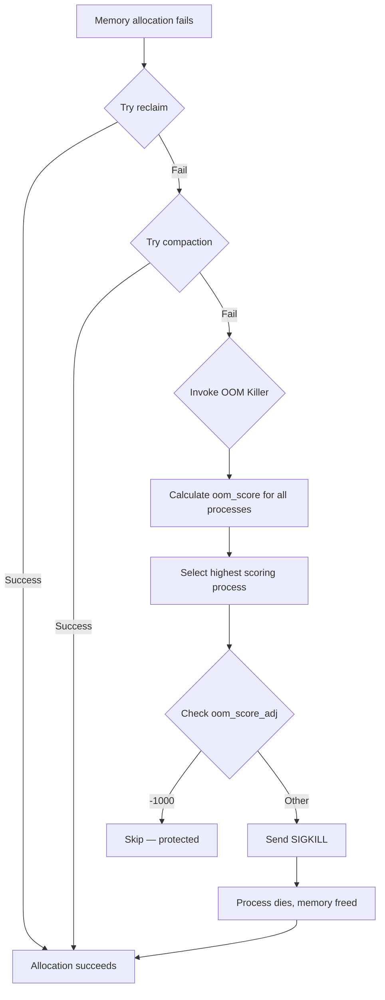
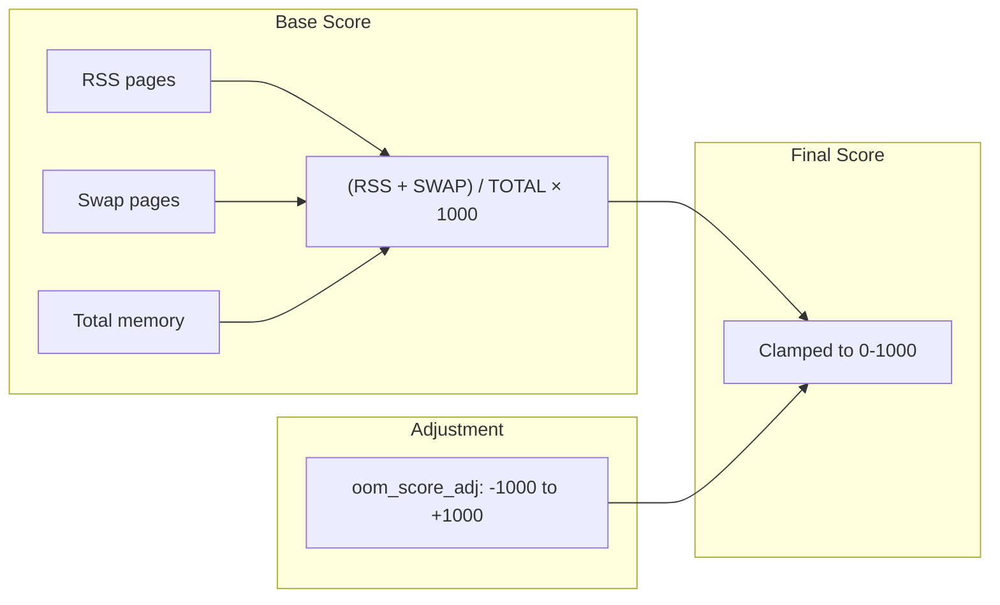
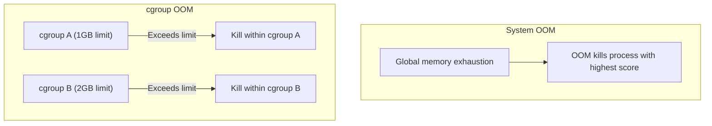
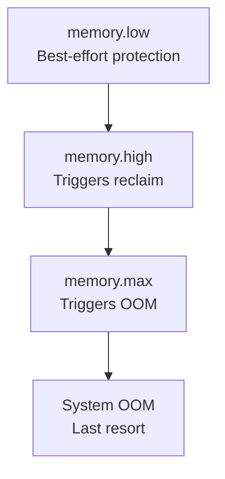

# Chapter 92: The OOM Killer — oom_score_adj, /proc/PID/oom_score, cgroup OOM, memory.high

## 1. Intuition

When a Linux system runs out of memory, something has to give. The kernel has several mechanisms to handle memory pressure: swapping, page cache reclaim, and as a last resort, the **OOM (Out-Of-Memory) Killer**. The OOM Killer selects a process to terminate in order to free memory and keep the system running.

The OOM Killer's decision is based on a scoring system. Each process gets an **oom_score** (0-1000) based on how much memory it's using and other factors. The process with the highest score is killed first. You can influence this with **oom_score_adj** (-1000 to +1000) to protect critical processes or sacrifice expendable ones.

In containerized environments, cgroups have their own OOM handling. When a cgroup exceeds its memory limit, the kernel kills a process within that cgroup, without affecting other cgroups.

Understanding the OOM Killer is essential for:
- Production system reliability
- Container memory management
- Database and critical service protection
- Memory-overcommit environments

## 2. Architecture

### 2.1 OOM Killer Flow

```
Memory allocation fails
    │
    ├── Try memory reclaim (kswapd, direct reclaim)
    │
    ├── Try compaction
    │
    ├── Try OOM Killer
    │   ├── Select victim (highest oom_score)
    │   ├── Send SIGKILL
    │   └── Wait for process to exit and free memory
    │
    └── If still no memory → panic (or retry)
```

### 2.2 OOM Score Calculation

```
oom_score = (process RSS + swap usage) / total memory * 1000
            + oom_score_adj
```

- **Base score**: Proportional to memory usage
- **oom_score_adj**: User-configurable adjustment (-1000 to +1000)
- **Special values**: -1000 = never kill, +1000 = always kill first

### 2.3 OOM Types

| Type | Trigger | Scope |
|------|---------|-------|
| System OOM | Global memory exhaustion | Entire system |
| cgroup OOM | cgroup memory limit | Processes in cgroup |
| memcg OOM | memory.max exceeded | Processes in memcg |
| Network OOM | Socket buffer exhaustion | Network subsystem |

## 3. Kernel Implementation

### 3.1 OOM Killer Invocation

```c
/* mm/oom_kill.c */
static void __out_of_memory(struct oom_control *oc) {
    /* Check if we should panic instead */
    if (sysctl_panic_on_oom) {
        panic("Out of memory: %s", oc->constraint);
        return;
    }

    /* Select victim */
    if (!select_bad_process(oc)) {
        /* No killable process found */
        if (oc->constraint == CONSTRAINT_MEMORY_POLICY)
            goto out;
        /* Panic as last resort */
        panic("Out of memory and no killable processes");
    }

    /* Kill the selected victim */
    oom_kill_process(oc, "Out of memory");
}
```

### 3.2 Victim Selection

```c
/* mm/oom_kill.c */
static int oom_evaluate_task(struct task_struct *task, void *arg) {
    struct oom_control *oc = arg;
    long points;

    /* Skip if task is already dying */
    if (task->flags & PF_EXITING)
        return 0;

    /* Skip if in different cgroup (for cgroup OOM) */
    if (!oom_unkillable_task(task, oc))
        return 0;

    /* Calculate OOM score */
    points = oom_badness(task, oc->totalpages);

    /* Check oom_score_adj */
    if (task->signal->oom_score_adj == OOM_SCORE_ADJ_MIN) {
        /* Protected — never kill */
        return 0;
    }

    /* Track best victim */
    if (points > oc->chosen_points) {
        oc->chosen = task;
        oc->chosen_points = points;
    }

    return 0;
}

/* Calculate OOM score for a process */
long oom_badness(struct task_struct *p, unsigned long totalpages) {
    long points;
    long adj;

    /* Base score: RSS + swap usage */
    points = get_mm_rss(p->mm) + get_mm_counter(p->mm, MM_SWAPENTS);
    atomic_long_add(points, &p->mm->oom_notified);

    /* Normalize to 0-1000 range */
    points *= 1000;
    points /= totalpages;

    /* Add oom_score_adj */
    adj = (long)p->signal->oom_score_adj;
    points += adj;

    /* Clamp to valid range */
    if (points < 0)
        points = 0;

    return points;
}
```

### 3.3 OOM Kill Process

```c
/* mm/oom_kill.c */
static void oom_kill_process(struct oom_control *oc, const char *message) {
    struct task_struct *victim = oc->chosen;
    struct task_struct *p;
    unsigned int points;

    /* Log the OOM event */
    pr_err("%s: Killed process %d (%s) total-vm:%lukB, anon-rss:%lukB\n",
           message, victim->pid, victim->comm,
           K(get_mm_total_vm(victim->mm)),
           K(get_mm_counter(victim->mm, MM_ANONPAGES)));

    /* Kill all threads in the thread group */
    do_send_sig_info(SIGKILL, SEND_SIG_PRIV, victim, PIDTYPE_TGID);

    /* Also kill child processes (optional) */
    list_for_each_entry(p, &victim->children, sibling) {
        if (p->mm == victim->mm) {
            do_send_sig_info(SIGKILL, SEND_SIG_PRIV, p, PIDTYPE_PID);
        }
    }
}
```

### 3.4 cgroup OOM

```c
/* mm/memcontrol.c */
static int mem_cgroup_oom(struct mem_cgroup *memcg, gfp_t gfp_mask,
                          int order) {
    /* Check if we should invoke OOM killer */
    if (!mem_cgroup_out_of_memory(memcg, gfp_mask, order)) {
        /* No killable process in cgroup */
        return -ENOMEM;
    }

    return 0;
}

static bool mem_cgroup_out_of_memory(struct mem_cgroup *memcg,
                                     gfp_t gfp_mask, int order) {
    struct oom_control oc = {
        .zonelist = NULL,
        .nodemask = NULL,
        .memcg = memcg,
        .gfp_mask = gfp_mask,
        .order = order,
    };

    /* Select and kill victim within cgroup */
    if (select_bad_process(&oc)) {
        oom_kill_process(&oc, "Memory cgroup out of memory");
        return true;
    }

    return false;
}
```

### 3.5 /proc/PID/oom_score Implementation

```c
/* fs/proc/base.c */
static int proc_oom_score(struct seq_file *m, struct pid_namespace *ns,
                          struct pid *pid, struct task_struct *task) {
    unsigned long totalpages = totalram_pages() + total_swap_pages;
    long points;

    /* Calculate OOM score */
    points = oom_badness(task, totalpages);

    /* Clamp to 0-1000 */
    if (points < 0)
        points = 0;
    if (points > 1000)
        points = 1000;

    seq_printf(m, "%lu\n", points);
    return 0;
}
```

### 3.6 memory.high (cgroup v2)

```c
/* mm/memcontrol.c */
/* memory.high triggers reclaim, not OOM */
/* memory.max triggers OOM */

static ssize_t memory_high_write(struct kernfs_open_file *of,
                                 char *buf, size_t nbytes, loff_t off) {
    unsigned long high;

    /* Parse value */
    if (strcmp(buf, "max") == 0) {
        high = PAGE_COUNTER_MAX;
    } else {
        if (kstrtoul(buf, 0, &high))
            return -EINVAL;
        high = PAGE_ALIGN(high) / PAGE_SIZE;
    }

    /* Set memory.high */
    page_counter_set_high(&memcg->memory, high);

    return nbytes;
}
```

## 4. Source Code References

| File | Description |
|------|-------------|
| `mm/oom_kill.c` | OOM killer implementation |
| `mm/memcontrol.c` | cgroup memory controller |
| `fs/proc/base.c` | /proc/PID/oom_score |
| `include/linux/oom.h` | OOM-related structures |
| `include/linux/memcontrol.h` | Memory cgroup structures |

## 5. Data Structures

### 5.1 oom_control

```c
/* include/linux/oom.h */
struct oom_control {
    /* Used to select the victim */
    struct zonelist *zonelist;
    nodemask_t *nodemask;
    struct mem_cgroup *memcg;
    gfp_t gfp_mask;
    int order;
    unsigned long totalpages;
    struct task_struct *chosen;
    unsigned long chosen_points;

    /* OOM constraint */
    enum oom_constraint constraint;
};
```

### 5.2 Memory cgroup

```c
/* include/linux/memcontrol.h */
struct mem_cgroup {
    struct cgroup_subsys_state css;

    /* Memory limits */
    struct page_counter memory;      /* memory.current */
    struct page_counter swap;        /* swap.current */
    struct page_counter memsw;       /* memory+swap */

    /* OOM settings */
    struct mem_cgroup_reclaim_iter iter;
    struct work_struct work;
    spinlock_t oom_lock;

    /* Events */
    atomic_long_t memory_events[MEMCG_NR_MEMORY_EVENTS];
};
```

## 6. C/Assembly Examples

### 6.1 Checking OOM Score

```c
#include <stdio.h>
#include <stdlib.h>
#include <unistd.h>

int main(void) {
    pid_t pid = getpid();
    char path[256];
    char line[256];

    /* Read oom_score */
    snprintf(path, sizeof(path), "/proc/%d/oom_score", pid);
    FILE *f = fopen(path, "r");
    if (f) {
        if (fgets(line, sizeof(line), f)) {
            printf("OOM score: %s", line);
        }
        fclose(f);
    }

    /* Read oom_score_adj */
    snprintf(path, sizeof(path), "/proc/%d/oom_score_adj", pid);
    f = fopen(path, "r");
    if (f) {
        if (fgets(line, sizeof(line), f)) {
            printf("OOM score adj: %s", line);
        }
        fclose(f);
    }

    return 0;
}
```

### 6.2 Adjusting OOM Score

```c
#include <stdio.h>
#include <stdlib.h>
#include <unistd.h>
#include <fcntl.h>

int set_oom_score_adj(pid_t pid, int adj) {
    char path[256];
    char value[16];

    snprintf(path, sizeof(path), "/proc/%d/oom_score_adj", pid);
    int fd = open(path, O_WRONLY);
    if (fd < 0) {
        perror("open");
        return -1;
    }

    snprintf(value, sizeof(value), "%d", adj);
    if (write(fd, value, strlen(value)) < 0) {
        perror("write");
        close(fd);
        return -1;
    }

    close(fd);
    return 0;
}

int main(void) {
    pid_t pid = getpid();

    printf("Current OOM score adj: ");
    system("cat /proc/self/oom_score_adj");

    /* Protect this process from OOM killer */
    printf("Setting OOM score adj to -1000 (never kill)\n");
    set_oom_score_adj(pid, -1000);

    printf("New OOM score adj: ");
    system("cat /proc/self/oom_score_adj");

    /* Make this process first to be killed */
    printf("Setting OOM score adj to 1000 (always kill first)\n");
    set_oom_score_adj(pid, 1000);

    printf("New OOM score adj: ");
    system("cat /proc/self/oom_score_adj");

    /* Reset to default */
    set_oom_score_adj(pid, 0);

    return 0;
}
```

### 6.3 Monitoring OOM Events

```c
#include <stdio.h>
#include <stdlib.h>
#include <string.h>
#include <dirent.h>
#include <ctype.h>

typedef struct {
    pid_t pid;
    char name[256];
    long oom_score;
    long rss_kb;
} process_info_t;

int main(void) {
    DIR *proc = opendir("/proc");
    struct dirent *entry;
    process_info_t *procs = NULL;
    int count = 0;
    int capacity = 0;

    while ((entry = readdir(proc)) != NULL) {
        if (!isdigit(entry->d_name[0]))
            continue;

        pid_t pid = atoi(entry->d_name);
        char path[256];
        char line[1024];

        /* Read oom_score */
        snprintf(path, sizeof(path), "/proc/%d/oom_score", pid);
        FILE *f = fopen(path, "r");
        if (!f) continue;

        long oom_score = 0;
        if (fgets(line, sizeof(line), f))
            oom_score = atol(line);
        fclose(f);

        /* Read comm */
        snprintf(path, sizeof(path), "/proc/%d/comm", pid);
        f = fopen(path, "r");
        if (!f) continue;

        char name[256] = "?";
        if (fgets(line, sizeof(line), f)) {
            line[strcspn(line, "\n")] = 0;
            strncpy(name, line, sizeof(name) - 1);
        }
        fclose(f);

        /* Read RSS */
        snprintf(path, sizeof(path), "/proc/%d/statm", pid);
        f = fopen(path, "r");
        if (!f) continue;

        long rss_pages = 0;
        fscanf(f, "%*ld %ld", &rss_pages);
        fclose(f);

        long rss_kb = rss_pages * 4;  /* Assuming 4KB pages */

        /* Add to list */
        if (count >= capacity) {
            capacity = capacity ? capacity * 2 : 256;
            procs = realloc(procs, capacity * sizeof(process_info_t));
        }

        procs[count].pid = pid;
        strncpy(procs[count].name, name, sizeof(procs[count].name) - 1);
        procs[count].oom_score = oom_score;
        procs[count].rss_kb = rss_kb;
        count++;
    }

    closedir(proc);

    /* Sort by OOM score (highest first) */
    for (int i = 0; i < count - 1; i++) {
        for (int j = i + 1; j < count; j++) {
            if (procs[j].oom_score > procs[i].oom_score) {
                process_info_t tmp = procs[i];
                procs[i] = procs[j];
                procs[j] = tmp;
            }
        }
    }

    /* Print top 20 processes by OOM score */
    printf("%-8s %-8s %-20s %s\n", "PID", "OOM_SCORE", "RSS_KB", "NAME");
    for (int i = 0; i < count && i < 20; i++) {
        printf("%-8d %-8ld %-20ld %s\n",
               procs[i].pid, procs[i].oom_score,
               procs[i].rss_kb, procs[i].name);
    }

    free(procs);
    return 0;
}
```

### 6.4 cgroup v2 Memory Limits

```bash
#!/bin/bash
# Create a cgroup with memory limits

CGROUP_PATH="/sys/fs/cgroup/myapp"

# Create cgroup
mkdir -p "$CGROUP_PATH"

# Set memory limits
echo "512M" > "$CGROUP_PATH/memory.max"      # Hard limit
echo "256M" > "$CGROUP_PATH/memory.high"     # Soft limit (triggers reclaim)
echo "128M" > "$CGROUP_PATH/memory.low"      # Best-effort protection

# Add current process to cgroup
echo $$ > "$CGROUP_PATH/cgroup.procs"

# Monitor memory usage
cat "$CGROUP_PATH/memory.current"
cat "$CGROUP_PATH/memory.events"
```

### 6.5 OOM Notification with cgroup v2

```c
#include <stdio.h>
#include <stdlib.h>
#include <fcntl.h>
#include <unistd.h>
#include <sys/epoll.h>
#include <stdint.h>

int main(void) {
    const char *cgroup_path = "/sys/fs/cgroup/myapp";

    /* Open memory.events file for notifications */
    char path[256];
    snprintf(path, sizeof(path), "%s/memory.events", cgroup_path);

    int fd = open(path, O_RDONLY);
    if (fd < 0) {
        perror("open memory.events");
        return 1;
    }

    /* Use epoll to watch for changes */
    int epfd = epoll_create1(0);
    struct epoll_event ev = {
        .events = EPOLLPRI,
        .data.fd = fd,
    };
    epoll_ctl(epfd, EPOLL_CTL_ADD, fd, &ev);

    printf("Monitoring cgroup memory events...\n");

    while (1) {
        struct epoll_event events[1];
        int nfds = epoll_wait(epfd, events, 1, -1);

        if (nfds > 0) {
            /* Read events */
            lseek(fd, 0, SEEK_SET);
            char buf[1024];
            ssize_t n = read(fd, buf, sizeof(buf) - 1);
            if (n > 0) {
                buf[n] = 0;
                printf("Memory events:\n%s\n", buf);
            }
        }
    }

    close(fd);
    close(epfd);
    return 0;
}
```

## 7. Diagrams

### 7.1 OOM Killer Flow



### 7.2 OOM Score Calculation



### 7.3 cgroup OOM Scenarios



### 7.4 Memory Pressure Hierarchy



## 8. Performance

### 8.1 OOM Killer Overhead

- **Score calculation**: O(n) where n = number of processes
- **Process killing**: ~1-10 ms per process
- **Memory reclaim**: Variable (depends on memory pressure)

### 8.2 OOM Killer Logs

```bash
# Check OOM events in kernel log
dmesg | grep -i "out of memory"
journalctl -k | grep -i "oom"

# Check cgroup memory events
cat /sys/fs/cgroup/myapp/memory.events
```

### 8.3 Performance Tuning

1. **Protect critical processes**: Set oom_score_adj = -1000
2. **Sacrifice expendable processes**: Set oom_score_adj = 1000
3. **Use cgroup limits**: Prevent one process from consuming all memory
4. **Set memory.high**: Trigger reclaim before OOM

## 9. Security

### 9.1 OOM Security Implications

1. **Information leakage**: OOM logs may contain sensitive process info
2. **Denial of service**: OOM can kill critical services
3. **Container escape**: Improper cgroup config can affect host

### 9.2 Secure OOM Configuration

```bash
# Protect SSH from OOM
echo -1000 > /proc/$(pidof sshd)/oom_score_adj

# Protect database
echo -900 > /proc/$(pidof mysqld)/oom_score_adj

# Make expendable processes killable first
echo 500 > /proc/$(pidof expendable_worker)/oom_score_adj
```

## 10. Common Pitfalls

### Pitfall 1: OOM Killer Killing Database

```c
/* WRONG: Database gets killed because it uses most memory */
/* Solution: Protect database with oom_score_adj */
set_oom_score_adj(database_pid, -1000);
```

### Pitfall 2: OOM Killer Not Triggering

```c
/* WRONG: Overcommit disabled, allocation fails immediately */
/* /proc/sys/vm/overcommit_memory = 2 (strict) */
/* Then malloc() returns NULL instead of triggering OOM */

/* RIGHT: Understand overcommit settings */
```

### Pitfall 3: cgroup OOM vs System OOM

```c
/* WRONG: cgroup limit too low, OOM kills processes frequently */
/* RIGHT: Set appropriate limits with some headroom */
```

## 11. Best Practices

1. **Protect critical services** with negative oom_score_adj
2. **Use cgroup limits** for containers and services
3. **Set memory.high** to trigger reclaim before OOM
4. **Monitor OOM events** with kernel logs
5. **Test OOM behavior** in staging environments
6. **Use overcommit settings** appropriate for workload
7. **Document OOM policies** for production systems

### Memory Overcommit

Linux has three overcommit modes:

```bash
# /proc/sys/vm/overcommit_memory
cat /proc/sys/vm/overcommit_memory
# 0 = Heuristic overcommit (default)
# 1 = Always overcommit
# 2 = Strict accounting

# Overcommit ratio (for mode 2)
cat /proc/sys/vm/overcommit_ratio  # Default: 50 (50% of RAM + swap)
```

- **Mode 0 (Heuristic)**: Kernel uses heuristics to decide if allocation is likely to succeed. Most allocations succeed, OOM killer handles failures.
- **Mode 1 (Always)**: All allocations succeed. Useful for sparse address spaces but can lead to OOM.
- **Mode 2 (Strict)**: Allocations limited to swap + ratio% of RAM. Most conservative.

### cgroup v2 Memory Controller

cgroup v2 provides fine-grained memory control:

```bash
# Create memory cgroup
mkdir /sys/fs/cgroup/myapp

# Set limits
echo "1G" > /sys/fs/cgroup/myapp/memory.max      # Hard limit
echo "768M" > /sys/fs/cgroup/myapp/memory.high     # Soft limit (triggers reclaim)
echo "512M" > /sys/fs/cgroup/myapp/memory.low       # Best-effort protection
echo "256M" > /sys/fs/cgroup/myapp/memory.min       # Guaranteed minimum

# Swap control
echo "0" > /sys/fs/cgroup/myapp/memory.swap.max    # Disable swap

# Monitoring
cat /sys/fs/cgroup/myapp/memory.current   # Current usage
cat /sys/fs/cgroup/myapp/memory.stat      # Detailed statistics
cat /sys/fs/cgroup/myapp/memory.events    # OOM events

# Memory pressure notifications
cat /sys/fs/cgroup/myapp/memory.pressure  # PSI metrics
```

### OOM Analysis Techniques

When an OOM occurs, analyzing the kernel log provides valuable information:

```bash
# Extract OOM information from kernel log
dmesg | grep -A 50 "Out of memory"

# Key information in OOM log:
# - Killed process: PID, name, RSS
# - Memory usage: total, free, available
# - OOM scores: all processes considered
# - Memory breakdown: anon, file, slab, etc.

# Analyze memory usage before OOM
cat /proc/meminfo
cat /proc/buddyinfo  # Memory fragmentation
cat /proc/slabinfo   # Kernel slab usage
```

### Swap Management

Swap affects OOM behavior:

```bash
# Check swap usage
swapon --show
free -h

# Swap tendency
cat /proc/sys/vm/swappiness  # 0-100, default 60
# Lower = prefer to keep processes in RAM
# Higher = prefer to swap out

# For databases: often set to 10 or lower
# For containers: often set to 0 (disable swap)
```

### Memory Leak Detection

Memory leaks can trigger OOM over time:

```bash
# Valgrind memory leak detection
valgrind --leak-check=full --show-leak-kinds=all ./program

# AddressSanitizer (faster)
clang -fsanitize=address -o program program.c

# System-wide memory monitoring
watch -n 1 'free -h; echo; cat /proc/meminfo | head -5'
```

## 12. Exercises

### Exercise 1: OOM Score Analyzer

Write a program that displays all processes sorted by OOM score, showing which would be killed first.

### Exercise 2: OOM Protection Manager

Write a tool that manages OOM protection for a set of critical services.

### Exercise 3: cgroup Memory Limit Test

Write a program that creates a cgroup, sets memory limits, and observes OOM behavior.

### Exercise 4: OOM Simulator

In a sandboxed environment, trigger an OOM and analyze the kernel's decision process.

### Exercise 5: Memory Pressure Monitor

Write a program that monitors system memory pressure and warns before OOM is triggered.

### Exercise 6: OOM Score Manipulation

Write a program that:
1. Lists all processes with their OOM scores
2. Protects a list of critical processes by setting oom_score_adj = -1000
3. Makes expendable processes more likely to be killed
4. Verifies the changes took effect

### Exercise 7: cgroup v2 Memory Monitoring

Write a program that monitors a cgroup's memory usage and triggers alerts when it approaches limits.

### Exercise 8: Overcommit Behavior Test

Write a program that tests the three overcommit modes and demonstrates how they affect memory allocation behavior.

## 13. References

1. **Linux kernel source**: `mm/oom_kill.c` — OOM killer
2. **Linux kernel source**: `mm/memcontrol.c` — Memory cgroup
3. **man pages**: `oom_score(5)`, `cgroups(7)`
4. **LWN.net**: "The OOM killer" — https://lwn.net/Articles/317814/
5. **kernel.org Documentation**: `admin-guide/cgroup-v2.rst`
6. **Red Hat**: "Understanding the OOM killer"
7. **cgroup v2 specification**: https://www.kernel.org/doc/Documentation/cgroup-v2.txt
8. **Memory management documentation**: `admin-guide/sysctl/vm.rst`
