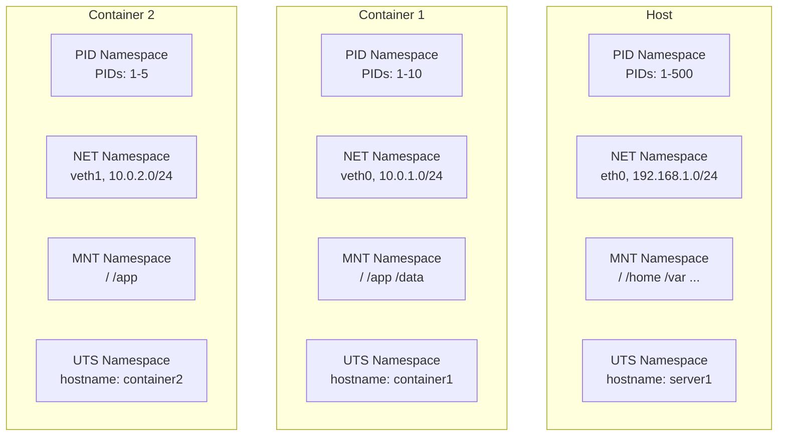
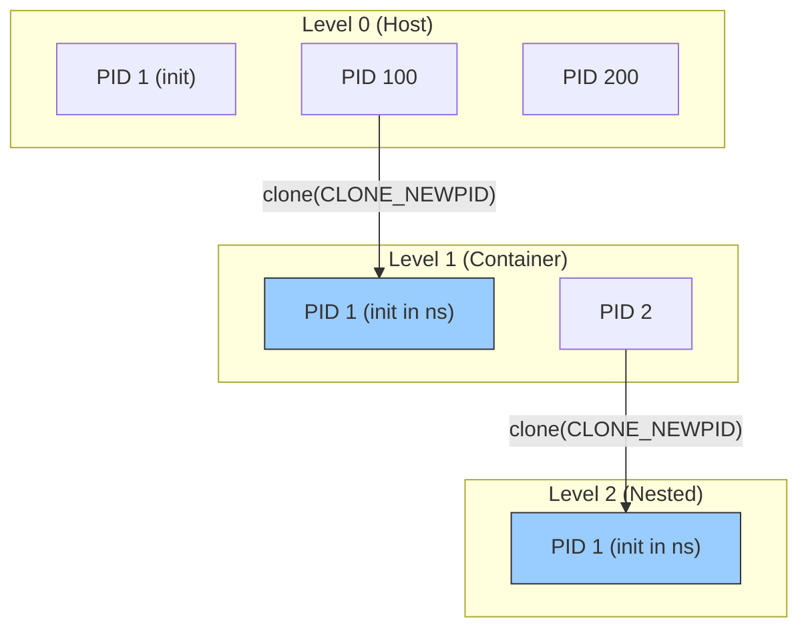
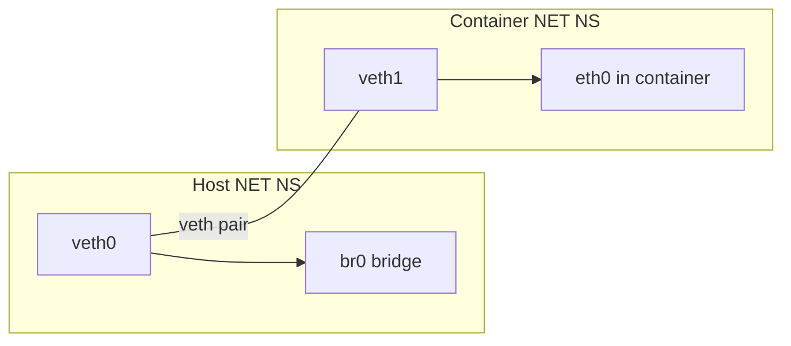
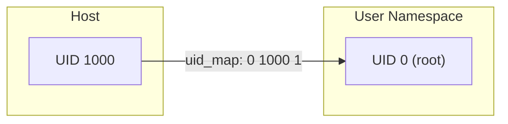

# Chapter 93: Namespaces — PID, NET, MNT, UTS, IPC, USER, CGROUP, TIME: Clone Flags, unshare, nsenter

## 1. Intuition

Namespaces are the foundation of Linux containers. They provide **isolation** — each namespace gives a process its own view of a particular system resource. A process in a PID namespace sees PIDs starting from 1, independent of other namespaces. A process in a network namespace has its own network interfaces, routing tables, and firewall rules.

Think of namespaces as **virtual worlds**. Each process can live in its own world where it appears to be PID 1, has its own hostname, its own network stack, and its own mount points. The kernel multiplexes the real resources among these virtual worlds.

There are 8 namespace types:

| Namespace | Flag | Isolates |
|-----------|------|----------|
| **PID** | `CLONE_NEWPID` | Process IDs |
| **NET** | `CLONE_NEWNET` | Network stack |
| **MNT** | `CLONE_NEWNS` | Mount points |
| **UTS** | `CLONE_NEWUTS` | Hostname, domain |
| **IPC** | `CLONE_NEWIPC` | System V IPC, POSIX message queues |
| **USER** | `CLONE_NEWUSER` | User/group IDs |
| **CGROUP** | `CLONE_NEWCGROUP` | cgroup root |
| **TIME** | `CLONE_NEWTIME` | System clocks |

## 2. Architecture

### 2.1 Namespace Hierarchy

```
Host System
    │
    ├── Container 1
    │   ├── PID namespace (PIDs 1, 2, 3...)
    │   ├── NET namespace (own interfaces, routes)
    │   ├── MNT namespace (own filesystem view)
    │   ├── UTS namespace (own hostname)
    │   └── USER namespace (own UID mapping)
    │
    └── Container 2
        ├── PID namespace (PIDs 1, 2, 3...)
        ├── NET namespace (own interfaces, routes)
        ├── MNT namespace (own filesystem view)
        ├── UTS namespace (own hostname)
        └── USER namespace (own UID mapping)
```

### 2.2 Namespace Operations

| Operation | System Call | Description |
|-----------|------------|-------------|
| Create new namespace | `clone()` | With CLONE_NEW* flags |
| Join namespace | `setns()` | Attach to existing namespace |
| Detach from namespace | `unshare()` | Create new namespace for current process |
| List namespaces | `/proc/PID/ns/` | Symlinks to namespace files |

## 3. Kernel Implementation

### 3.1 Namespace Structures

```c
/* include/linux/nsproxy.h */
struct nsproxy {
    struct uts_namespace *uts_ns;    /* UTS namespace */
    struct ipc_namespace *ipc_ns;   /* IPC namespace */
    struct mnt_namespace *mnt_ns;   /* Mount namespace */
    struct pid_namespace *pid_ns;   /* PID namespace */
    struct net           *net_ns;   /* Network namespace */
    struct cgroup_namespace *cgroup_ns;  /* cgroup namespace */
    struct time_namespace *time_ns; /* Time namespace */
};

/* Each process has an nsproxy */
struct task_struct {
    /* ... */
    struct nsproxy *nsproxy;
    /* ... */
};
```

### 3.2 PID Namespace

```c
/* include/linux/pid_namespace.h */
struct pid_namespace {
    struct kref kref;
    struct pid_namespace *parent;       /* Parent namespace */
    struct idr idr;                     /* PID allocation */
    unsigned int level;                 /* Nesting level */
    struct pid_namespace *child_ns;

    /* PID 1 in this namespace */
    struct task_struct *child_reaper;

    /* ... */
};

/* PID lookup is namespace-aware */
struct pid {
    atomic_t count;
    unsigned int level;                 /* Number of namespaces */
    struct hlist_head tasks[PIDTYPE_MAX]; /* Tasks using this PID */
    struct rcu_head rcu;
    struct upid numbers[];              /* One per namespace level */
};

struct upid {
    int nr;                             /* PID number in this namespace */
    struct pid_namespace *ns;           /* Namespace */
};
```

### 3.3 Network Namespace

```c
/* include/net/net_namespace.h */
struct net {
    refcount_t passive;
    spinlock_t rules_mod_lock;

    /* Network devices */
    struct list_head dev_base_head;
    int dev_base_seq;

    /* Routing tables */
    struct netns_ipv4 ipv4;
    struct netns_ipv6 ipv6;

    /* Firewall rules */
    struct netns_nf nf;

    /* ... */
};
```

### 3.4 Mount Namespace

```c
/* include/linux/mnt_namespace.h */
struct mnt_namespace {
    struct kref kref;
    struct mount *root;
    struct list_head list;
    struct user_namespace *user_ns;
    struct ucounts *ucounts;
    u64 seq;
    /* ... */
};
```

### 3.5 User Namespace

```c
/* include/linux/user_namespace.h */
struct user_namespace {
    struct uid_gid_map uid_map;         /* UID mapping */
    struct uid_gid_map gid_map;         /* GID mapping */
    struct uid_gid_map projid_map;      /* Project ID mapping */
    unsigned int flags;

    /* ... */
};
```

### 3.6 unshare() System Call

```c
/* kernel/nsproxy.c */
SYSCALL_DEFINE1(unshare, unsigned long, unshare_flags) {
    struct nsproxy *new_nsproxy;

    /* Create new namespaces */
    if (unshare_flags & CLONE_NEWPID) {
        /* Create new PID namespace */
    }
    if (unshare_flags & CLONE_NEWNET) {
        /* Create new network namespace */
    }
    if (unshare_flags & CLONE_NEWNS) {
        /* Create new mount namespace */
    }
    if (unshare_flags & CLONE_NEWUTS) {
        /* Create new UTS namespace */
    }
    if (unshare_flags & CLONE_NEWIPC) {
        /* Create new IPC namespace */
    }
    if (unshare_flags & CLONE_NEWUSER) {
        /* Create new user namespace */
    }
    if (unshare_flags & CLONE_NEWCGROUP) {
        /* Create new cgroup namespace */
    }
    if (unshare_flags & CLONE_NEWTIME) {
        /* Create new time namespace */
    }

    /* Create new nsproxy with selected new namespaces */
    new_nsproxy = create_new_namespaces(unshare_flags, current);

    /* Switch to new nsproxy */
    switch_task_namespaces(current, new_nsproxy);

    return 0;
}
```

### 3.7 setns() System Call

```c
/* kernel/nsproxy.c */
SYSCALL_DEFINE2(setns, int, fd, int, nstype) {
    struct file *file;
    struct ns_common *ns;

    /* Get namespace from fd */
    file = fget(fd);
    if (!file)
        return -EBADF;

    ns = get_proc_ns(file_inode(file));

    /* Check type if specified */
    if (nstype && ns->ops->type != nstype)
        return -EINVAL;

    /* Enter the namespace */
    switch_task_namespaces(current, ns->ops->get(ns));

    return 0;
}
```

### 3.8 User Namespace UID Mapping

```c
/* kernel/user_namespace.c */
static ssize_t map_write(struct file *file, const char __user *buf,
                         size_t count, loff_t *ppos) {
    struct uid_gid_map *map = file->private_data;
    struct uid_gid_extent *extent;
    char *kbuf;
    int ret;

    /* Parse mapping: "inside_id outside_id count" */
    /* Example: "0 1000 1" maps UID 0 in ns to UID 1000 on host */

    /* Allocate extent */
    extent = kmalloc(sizeof(*extent), GFP_KERNEL);

    /* Parse values */
    /* ... */

    /* Install mapping */
    if (map->nr_extents >= UID_GID_MAP_MAX_EXTENTS) {
        kfree(extent);
        return -EPERM;
    }

    map->extent[map->nr_extents++] = *extent;

    return count;
}
```

## 4. Source Code References

| File | Description |
|------|-------------|
| `kernel/nsproxy.c` | Namespace proxy management |
| `kernel/pid_namespace.c` | PID namespace |
| `net/core/net_namespace.c` | Network namespace |
| `fs/namespace.c` | Mount namespace |
| `kernel/user_namespace.c` | User namespace |
| `kernel/cgroup/namespace.c` | cgroup namespace |
| `kernel/time/namespace.c` | Time namespace |
| `include/linux/nsproxy.h` | nsproxy structure |

## 5. Data Structures

### 5.1 Namespace Types

```c
/* Operations for each namespace type */
struct proc_ns_operations {
    const char *name;
    int type;
    struct ns_common *(*get)(struct task_struct *t);
    void (*put)(struct ns_common *ns);
    struct ns_common *(*get_parent)(struct ns_common *ns);
};

/* Common namespace header */
struct ns_common {
    atomic_long_t stashed;
    const struct proc_ns_operations *ops;
    unsigned int inum;      /* Inode number (unique identifier) */
};
```

### 5.2 Clone Flags for Namespaces

```c
/* include/uapi/linux/sched.h */
#define CLONE_NEWNS      0x00020000  /* New mount namespace */
#define CLONE_NEWUTS     0x04000000  /* New UTS namespace */
#define CLONE_NEWIPC     0x08000000  /* New IPC namespace */
#define CLONE_NEWUSER     0x10000000  /* New user namespace */
#define CLONE_NEWPID      0x20000000  /* New PID namespace */
#define CLONE_NEWNET      0x40000000  /* New network namespace */
#define CLONE_NEWCGROUP    0x02000000  /* New cgroup namespace */
#define CLONE_NEWTIME      0x00000080  /* New time namespace */
```

## 6. C/Assembly Examples

### 6.1 Creating a PID Namespace

```c
#define _GNU_SOURCE
#include <sched.h>
#include <stdio.h>
#include <stdlib.h>
#include <unistd.h>
#include <sys/wait.h>
#include <signal.h>

#define STACK_SIZE (1024 * 1024)

static int child_func(void *arg) {
    /* In new PID namespace, we are PID 1 */
    printf("Child: PID=%d, PPID=%d\n", getpid(), getppid());

    /* Create child in this namespace */
    pid_t pid = fork();
    if (pid == 0) {
        printf("Grandchild: PID=%d, PPID=%d\n", getpid(), getppid());
        _exit(0);
    }

    waitpid(pid, NULL, 0);
    return 0;
}

int main(void) {
    char *stack = malloc(STACK_SIZE);
    char *stack_top = stack + STACK_SIZE;

    printf("Parent: PID=%d\n", getpid());

    /* Create new PID namespace */
    pid_t pid = clone(child_func, stack_top,
                      CLONE_NEWPID | SIGCHLD,
                      NULL);

    if (pid == -1) {
        perror("clone");
        return 1;
    }

    printf("Parent: child PID in parent namespace=%d\n", pid);
    waitpid(pid, NULL, 0);

    free(stack);
    return 0;
}
```

### 6.2 Creating a Network Namespace

```c
#define _GNU_SOURCE
#include <sched.h>
#include <stdio.h>
#include <stdlib.h>
#include <unistd.h>
#include <sys/wait.h>
#include <signal.h>

#define STACK_SIZE (1024 * 1024)

static int child_func(void *arg) {
    printf("Child: in new network namespace\n");

    /* Show network interfaces — should only have lo */
    printf("Network interfaces:\n");
    system("ip link show");

    return 0;
}

int main(void) {
    char *stack = malloc(STACK_SIZE);
    char *stack_top = stack + STACK_SIZE;

    printf("Parent: creating child with new network namespace\n");

    pid_t pid = clone(child_func, stack_top,
                      CLONE_NEWNET | SIGCHLD,
                      NULL);

    if (pid == -1) {
        perror("clone");
        return 1;
    }

    waitpid(pid, NULL, 0);
    free(stack);
    return 0;
}
```

### 6.3 Using unshare

```c
#define _GNU_SOURCE
#include <sched.h>
#include <stdio.h>
#include <stdlib.h>
#include <unistd.h>
#include <sys/wait.h>

int main(void) {
    printf("Before unshare: PID=%d\n", getpid());

    /* Unshare PID namespace */
    if (unshare(CLONE_NEWPID) == -1) {
        perror("unshare");
        return 1;
    }

    /* Fork to enter new PID namespace */
    pid_t pid = fork();
    if (pid == 0) {
        /* In new PID namespace */
        printf("Child in new PID ns: PID=%d, PPID=%d\n",
               getpid(), getppid());
        _exit(0);
    }

    waitpid(pid, NULL, 0);
    return 0;
}
```

### 6.4 Using setns to Join Namespace

```c
#define _GNU_SOURCE
#include <stdio.h>
#include <stdlib.h>
#include <fcntl.h>
#include <unistd.h>
#include <sched.h>

int main(int argc, char *argv[]) {
    if (argc != 2) {
        fprintf(stderr, "Usage: %s <PID>\n", argv[0]);
        return 1;
    }

    pid_t target_pid = atoi(argv[1]);
    char ns_path[256];
    int ns_fd;

    /* Join target's network namespace */
    snprintf(ns_path, sizeof(ns_path), "/proc/%d/ns/net", target_pid);
    ns_fd = open(ns_path, O_RDONLY);
    if (ns_fd < 0) {
        perror("open ns");
        return 1;
    }

    if (setns(ns_fd, CLONE_NEWNET) == -1) {
        perror("setns");
        close(ns_fd);
        return 1;
    }

    close(ns_fd);

    printf("Now in PID %d's network namespace\n", target_pid);

    /* Show network interfaces in that namespace */
    system("ip link show");

    return 0;
}
```

### 6.5 User Namespace with UID Mapping

```c
#define _GNU_SOURCE
#include <sched.h>
#include <stdio.h>
#include <stdlib.h>
#include <unistd.h>
#include <sys/wait.h>
#include <fcntl.h>
#include <signal.h>

#define STACK_SIZE (1024 * 1024)

static int child_func(void *arg) {
    printf("Child: UID=%d, GID=%d\n", getuid(), getgid());

    /* In user namespace, we appear as root */
    if (getuid() == 0) {
        printf("Child: I'm root in this user namespace!\n");
    }

    return 0;
}

int main(void) {
    char *stack = malloc(STACK_SIZE);
    char *stack_top = stack + STACK_SIZE;

    /* Create new user namespace */
    pid_t pid = clone(child_func, stack_top,
                      CLONE_NEWUSER | SIGCHLD,
                      NULL);

    if (pid == -1) {
        perror("clone");
        return 1;
    }

    /* Write UID mapping */
    char path[256];
    char mapping[64];

    /* Map current user to root (UID 0) in namespace */
    snprintf(path, sizeof(path), "/proc/%d/uid_map", pid);
    snprintf(mapping, sizeof(mapping), "0 %d 1", getuid());

    int fd = open(path, O_WRONLY);
    if (fd >= 0) {
        write(fd, mapping, strlen(mapping));
        close(fd);
    }

    /* Set GID mapping */
    snprintf(path, sizeof(path), "/proc/%d/gid_map", pid);
    fd = open(path, O_WRONLY);
    if (fd >= 0) {
        /* Need to deny setgroups first */
        snprintf(path, sizeof(path), "/proc/%d/setgroups", pid);
        int sg_fd = open(path, O_WRONLY);
        if (sg_fd >= 0) {
            write(sg_fd, "deny", 4);
            close(sg_fd);
        }

        snprintf(mapping, sizeof(mapping), "0 %d 1", getgid());
        write(fd, mapping, strlen(mapping));
        close(fd);
    }

    waitpid(pid, NULL, 0);
    free(stack);
    return 0;
}
```

### 6.6 Listing Process Namespaces

```c
#include <stdio.h>
#include <stdlib.h>
#include <unistd.h>
#include <dirent.h>
#include <sys/stat.h>

int main(int argc, char *argv[]) {
    pid_t pid = argc > 1 ? atoi(argv[1]) : getpid();
    char path[256];
    char link[256];
    ssize_t len;

    printf("Namespaces for PID %d:\n\n", pid);

    snprintf(path, sizeof(path), "/proc/%d/ns", pid);

    DIR *dir = opendir(path);
    if (!dir) {
        perror("opendir");
        return 1;
    }

    struct dirent *entry;
    while ((entry = readdir(dir)) != NULL) {
        if (entry->d_name[0] == '.')
            continue;

        char ns_path[512];
        snprintf(ns_path, sizeof(ns_path), "%s/%s", path, entry->d_name);

        len = readlink(ns_path, link, sizeof(link) - 1);
        if (len > 0) {
            link[len] = 0;
            printf("  %-12s %s\n", entry->d_name, link);
        }
    }

    closedir(dir);
    return 0;
}
```

## 7. Diagrams

### 7.1 Namespace Isolation



### 7.2 PID Namespace Nesting



### 7.3 Network Namespace with veth



### 7.4 User Namespace UID Mapping



## 8. Performance

### 8.1 Namespace Overhead

| Namespace | Creation Cost | Runtime Overhead |
|-----------|--------------|------------------|
| PID | Low (new PID allocation table) | Minimal |
| NET | Medium (new network stack) | Routing lookups |
| MNT | Low (new mount tree) | Path resolution |
| UTS | Very low (just hostname) | None |
| IPC | Low (new IPC tables) | None |
| USER | Low (new UID maps) | UID translation |
| CGROUP | Very low | Minimal |
| TIME | Very low | None |

### 8.2 Container Startup Performance

```bash
# Measure namespace creation time
time unshare --pid --fork --mount-proc echo "done"
time unshare --net ip link show
```

## 9. Security

### 9.1 Namespace Security Considerations

1. **User namespace root**: Can create other namespaces, but not real root
2. **Namespace escape**: Improper configuration can allow escape
3. **Capabilities**: User namespace grants capabilities within the namespace
4. **Seccomp**: Restrict namespace-related syscalls

### 9.2 Secure Namespace Configuration

```c
/* Restrict namespace creation with seccomp */
#include <seccomp.h>

void restrict_namespaces(void) {
    scmp_filter_ctx ctx = seccomp_init(SCMP_ACT_ALLOW);

    /* Deny creating new user namespaces (if not needed) */
    seccomp_rule_add(ctx, SCMP_ACT_ERRNO(EPERM),
                     SCMP_SYS(unshare), 1,
                     SCMP_A0(SCMP_CMP_MASKED_EQ, CLONE_NEWUSER, CLONE_NEWUSER));

    seccomp_load(ctx);
    seccomp_release(ctx);
}
```

### 9.3 Container Security Best Practices

```bash
# Use user namespaces for unprivileged containers
# Map root in container to unprivileged user on host
echo "0 1000 1" > /proc/$$/uid_map

# Drop capabilities after setup
# Use seccomp to restrict syscalls
# Use read-only mounts where possible
```

## 10. Common Pitfalls

### Pitfall 1: PID Namespace Without init

```c
/* WRONG: No PID 1 to reap zombies */
unshare(CLONE_NEWPID);
fork();
/* Child is PID 1 but doesn't handle SIGCHLD */
/* Zombies accumulate! */

/* RIGHT: PID 1 must reap children */
unshare(CLONE_NEWPID);
pid_t pid = fork();
if (pid == 0) {
    /* We're PID 1 — handle SIGCHLD */
    signal(SIGCHLD, SIG_IGN);
    /* ... */
}
```

### Pitfall 2: Mount Namespace Without Propagation

```c
/* WRONG: New mount namespace still receives host mounts */
unshare(CLONE_NEWNS);
/* Mount events still propagate from host! */

/* RIGHT: Make mount tree private */
unshare(CLONE_NEWNS);
mount(NULL, "/", NULL, MS_REC | MS_PRIVATE, NULL);
```

### Pitfall 3: User Namespace Capabilities

```c
/* WRONG: Assuming user namespace root equals real root */
unshare(CLONE_NEWUSER);
/* Map to root */
/* But can't actually mount, etc. without real capabilities */

/* RIGHT: Understand user namespace capability limits */
```

## 11. Best Practices

1. **Use user namespaces** for unprivileged containers
2. **Always have PID 1** in PID namespaces to reap zombies
3. **Make mount trees private** when using mount namespaces
4. **Use `/proc/PID/ns/`** to inspect namespaces
5. **Combine with cgroups** for resource limits
6. **Use seccomp** to restrict namespace syscalls
7. **Test namespace isolation** thoroughly

### Container Runtime Architecture

Container runtimes like Docker use namespaces extensively:

```
Container Runtime (containerd/runc)
    │
    ├── Create namespaces (PID, NET, MNT, UTS, IPC, USER)
    ├── Set up cgroups (CPU, memory, I/O limits)
    ├── Configure networking (veth pairs, bridges)
    ├── Mount filesystem (overlay, bind mounts)
    ├── Set up seccomp filters
    ├── Apply AppArmor/SELinux labels
    └── exec() the container process
```

### Namespace Interaction with Other Subsystems

Namespaces interact with several other kernel subsystems:

1. **cgroups**: Resource limits per container
2. **seccomp**: Syscall filtering within namespace
3. **Capabilities**: Capability sets per user namespace
4. **SELinux/AppArmor**: Mandatory access control
5. **Networking**: Bridges, veth, routing
6. **Filesystems**: OverlayFS, bind mounts

### Network Namespace Configuration

Network namespaces require additional setup to be useful:

```bash
#!/bin/bash
# Create a network namespace with connectivity

NS_NAME="mynet"
BRIDGE="br0"

# Create namespace
ip netns add $NS_NAME

# Create veth pair
ip link add veth0 type veth peer name veth1

# Move one end to namespace
ip link set veth1 netns $NS_NAME

# Configure host side
ip addr add 10.0.0.1/24 dev veth0
ip link set veth0 up

# Configure namespace side
ip netns exec $NS_NAME ip addr add 10.0.0.2/24 dev veth1
ip netns exec $NS_NAME ip link set veth1 up
ip netns exec $NS_NAME ip link set lo up
ip netns exec $NS_NAME ip route add default via 10.0.0.1

# Enable forwarding on host
echo 1 > /proc/sys/net/ipv4/ip_forward

# Test connectivity
ip netns exec $NS_NAME ping -c 3 10.0.0.1
```

### Mount Namespace Propagation

Mount events can propagate between namespaces:

- **MS_SHARED**: Mount events propagate to/from peers
- **MS_PRIVATE**: No propagation
- **MS_SLAVE**: Receives from master, doesn't propagate back
- **MS_SLAVE | MS_REC**: Recursive slave binding

```bash
# Make mount tree private (common in containers)
mount --make-rprivate /

# Check propagation
cat /proc/self/mountinfo | grep propagation
```

### Namespace Limitations

Namespaces have several limitations to be aware of:

1. **PID namespace**: PID 1 must reap zombies, can't send signals to parent namespace
2. **Network namespace**: No automatic internet access, requires bridge/routing setup
3. **Mount namespace**: Doesn't isolate /proc/sys, needs mount propagation handling
4. **User namespace**: Some operations still require real root (e.g., mounting certain filesystems)
5. **cgroup namespace**: Doesn't limit resources, just changes the view
6. **Time namespace**: Only affects CLOCK_MONOTONIC and CLOCK_BOOTTIME

### Debugging Namespaces

Tools for debugging namespace issues:

```bash
# List all namespaces for a process
ls -la /proc/$$/ns/

# Compare namespaces between processes
readlink /proc/$$/ns/pid
readlink /proc/1/ns/pid

# Enter a namespace
nsenter --target $PID --pid --net --mount

# Run a command in a new namespace
unshare --pid --fork --mount-proc bash

# Inspect namespace hierarchy
lsns -t pid
lsns -t net
```

## 12. Exercises

### Exercise 1: Container-like Environment

Write a program that creates a process in new PID, NET, MNT, UTS, and USER namespaces, simulating a simple container.

### Exercise 2: Network Namespace with veth

Create a network namespace and connect it to the host with a veth pair.

### Exercise 3: PID Namespace Zombie Reaper

Write a PID 1 process for a PID namespace that properly reaps zombie children.

### Exercise 4: Namespace Inspector

Write a tool that displays all namespaces for a given PID, including their relationships.

### Exercise 5: Unprivileged User Namespace

Write a program that uses user namespaces to create an isolated environment without root privileges.

## 13. References

1. **Linux kernel source**: `kernel/nsproxy.c` — namespace management
2. **man pages**: `namespaces(7)`, `unshare(2)`, `setns(2)`, `clone(2)`
3. **"Namespaces in operation"** (LWN series) — https://lwn.net/Articles/531114/
4. **"Understanding Linux Namespaces"** — https://blog.jessfraz.com/post/containers-zones-jails-vms/
5. **kernel.org Documentation**: `admin-guide/namespaces/`
6. **Docker/libcontainer**: Container namespace implementation
7. **LWN.net**: "User namespaces" — https://lwn.net/Articles/532593/
8. **man pages**: `user_namespaces(7)`, `pid_namespaces(7)`, `network_namespaces(7)`
