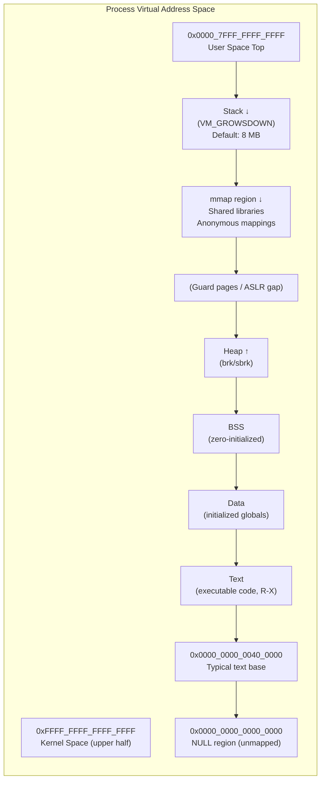
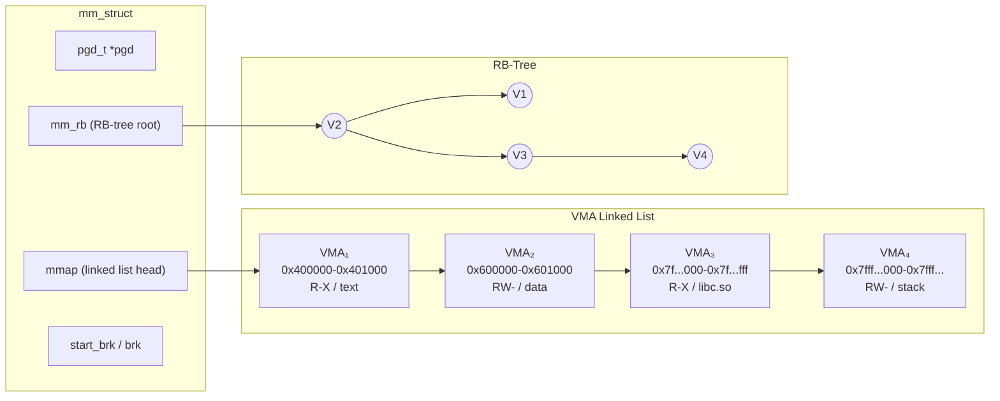
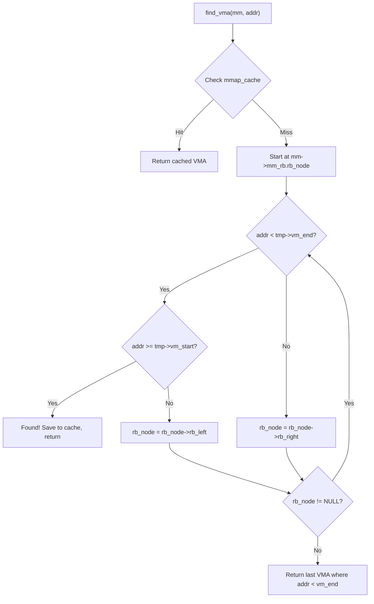

# Chapter 94: Virtual Memory Architecture

## Introduction

Virtual memory is one of the most fundamental abstractions in modern operating systems. It provides each process with the illusion of a large, contiguous, private address space, decoupling the logical addresses used by software from the physical addresses of actual RAM. This chapter explores the architecture of virtual memory in Linux, covering address space layout, Virtual Memory Areas (VMAs), and the key regions that make up a process's address space.

## 1. Intuition

### Why Virtual Memory?

Imagine a librarian who must organize thousands of books across multiple rooms. Rather than requiring every visitor to know exactly which room and shelf holds each book, the librarian provides a catalog system. Visitors request books by title (virtual address), and the librarian translates that into a physical location. This is exactly what virtual memory does for programs.

Before virtual memory, programs had to be loaded at specific physical addresses and had to be aware of the actual memory layout. Virtual memory eliminates this burden by providing:

- **Isolation**: Each process believes it has its own private memory space
- **Abstraction**: Programs use logical addresses without concern for physical layout
- **Efficiency**: Only the actively used portions of memory need to be in RAM
- **Sharing**: Multiple processes can share code and data through mapped regions
- **Protection**: One process cannot corrupt another's memory

### The Translation Layer

Every memory access in a program goes through a translation. When code accesses address `0x7ffc12345678`, the CPU's Memory Management Unit (MMU) translates this to a physical address like `0x1a2b3c4000`. This translation happens transparently and at hardware speed.

```
Process A sees:        Physical RAM:
+----------------+     +----------------+
| 0x00000000     |     | Kernel Space   |
| ...            |     | (shared)       |
| 0x7fff........ | --> | Page frames    |
| Stack ↓        |     | mapped via     |
| ...            |     | page tables    |
| Heap ↑         |     | ...            |
| ...            |     +----------------+
| Data           |
| Text           |
+----------------+
```

## 2. Architecture

### Address Space Layout

On a 64-bit x86-64 Linux system, the virtual address space is 48 bits wide (256 TiB) with recent extensions supporting 57 bits (128 PiB with 5-level paging). The canonical layout divides this space into two halves:

**User Space** (lower half): `0x0000000000000000` – `0x00007FFFFFFFFFFF` (128 TiB)
**Kernel Space** (upper half): `0xFFFF800000000000` – `0xFFFFFFFFFFFFFFFF` (128 TiB)

The region between them is the "non-canonical hole" — addresses in this range are invalid and cause a general protection fault.

#### User Space Layout (Typical)

```
0x00007FFFFFFFFFFF  ┌─────────────────────┐
                    │     Stack (↓)        │  Grows downward
                    │  (default 8 MB)      │
                    ├─────────────────────┤
                    │   Memory Mappings    │  mmap, shared libs
                    │     (↓ and ↑)       │
                    ├─────────────────────┤
                    │   (unmapped gap)     │  Guard pages
                    ├─────────────────────┤
                    │     Heap (↑)         │  Grows upward (brk/sbrk)
                    ├─────────────────────┤
                    │     BSS              │  Uninitialized data
                    ├─────────────────────┤
                    │     Data             │  Initialized globals
                    ├─────────────────────┤
                    │     Text (.text)     │  Executable code (RX)
0x0000000000400000  └─────────────────────┘
                    │  (unmapped, NULL)    │
0x0000000000000000  └─────────────────────┘
```

#### Kernel Space Layout

```
0xFFFFFFFFFFFFFFFF  ┌─────────────────────┐
                    │  Direct mapping of   │
                    │  all physical memory │  (page_offset_base)
                    │  (identical mapping) │
                    ├─────────────────────┤
                    │  vmalloc region      │
                    ├─────────────────────┤
                    │  Kernel text/modules │
                    ├─────────────────────┤
                    │  fixmap/vsyscall     │
0xFFFF880000000000  └─────────────────────┘
```

The kernel direct mapping (`page_offset_base`) maps all physical RAM into kernel virtual address space at a fixed offset. On x86-64, this typically starts at `0xFFFF888000000000` (with KASLR randomization applied).

### The Role of `mm_struct`

Every process has an `mm_struct` that describes its entire address space:

```c
struct mm_struct {
    struct vm_area_struct *mmap;        /* list of VMAs */
    struct rb_root mm_rb;               /* red-black tree of VMAs */
    struct vm_area_struct *mmap_cache;  /* last used VMA */
    
    pgd_t *pgd;                         /* page global directory */
    atomic_t mm_users;                  /* address space users */
    atomic_t mm_count;                  /* primary usage count */
    
    unsigned long start_code, end_code; /* text segment bounds */
    unsigned long start_data, end_data; /* data segment bounds */
    unsigned long start_brk, brk;       /* heap bounds */
    unsigned long start_stack;          /* stack start */
    
    unsigned long arg_start, arg_end;   /* command-line arguments */
    unsigned long env_start, env_end;   /* environment variables */
    
    unsigned long total_vm;             /* total pages mapped */
    unsigned long locked_vm;            /* locked pages (mlock) */
    unsigned long pinned_vm;            /* pinned pages */
    unsigned long data_vm;              /* VM_WRITE & ~VM_SHARED */
    unsigned long exec_vm;              /* VM_EXEC & ~VM_WRITE */
    unsigned long stack_vm;             /* VM_GROWSUP/DOWN */
    
    /* ... many more fields ... */
};
```

This structure is defined in `include/linux/mm_types.h`.

## 3. Virtual Memory Areas (VMAs)

### What is a VMA?

A Virtual Memory Area (VMA) represents a contiguous range of virtual addresses within a process that share common attributes (permissions, backing store, flags). VMAs are the fundamental data structure that the kernel uses to manage a process's address space.

```c
struct vm_area_struct {
    unsigned long vm_start;     /* start address (inclusive) */
    unsigned long vm_end;       /* end address (exclusive) */
    
    /* linked list */
    struct vm_area_struct *vm_next, *vm_prev;
    
    /* red-black tree */
    struct rb_node vm_rb;
    
    /* backing store info */
    unsigned long rb_subtree_gap;
    struct mm_struct *vm_mm;    /* associated mm */
    pgprot_t vm_page_prot;      /* access permissions */
    unsigned long vm_flags;     /* flags (VM_READ, VM_WRITE, etc.) */
    
    struct {
        struct rb_node rb;
        unsigned long rb_subtree_last;
    } shared;
    
    struct list_head anon_vma_node;  /* linked list of anon_vma */
    struct anon_vma *anon_vma;       /* anonymous VMA object */
    
    const struct vm_operations_struct *vm_ops;  /* operations */
    unsigned long vm_pgoff;         /* file offset (in pages) */
    struct file *vm_file;           /* backing file (NULL for anonymous) */
    void *vm_private_data;          /* private data */
};
```

### VMA Flags

VMAs have flags that describe their properties:

```c
#define VM_READ     0x00000001  /* readable */
#define VM_WRITE    0x00000002  /* writable */
#define VM_EXEC     0x00000004  /* executable */
#define VM_SHARED   0x00000008  /* shared mapping */
#define VM_MAYREAD  0x00000010  /* may set VM_READ */
#define VM_MAYWRITE 0x00000020  /* may set VM_WRITE */
#define VM_MAYEXEC  0x00000040  /* may set VM_EXEC */
#define VM_GROWSDOWN 0x01000000 /* stack-like segment */
#define VM_GROWSUP   0x02000000 /* heap-like segment */
#define VM_LOCKED    0x00002000  /* pages are locked */
#define VM_IO        0x00004000  /* memory-mapped I/O */
#define VM_DONTEXPAND 0x00040000 /* cannot expand with mremap */
#define VM_PFNMAP    0x00000400  /* page-frame number range */
#define VM_MIXEDMAP  0x10000000  /* can contain struct page and PFN */
```

### VMA Organization

VMAs are organized in two data structures for efficient lookup:

1. **Linked list**: For sequential traversal (`vm_next`/`vm_prev`)
2. **Red-black tree**: For O(log n) lookups by address

```
mm_struct
    │
    ├── mmap ──→ VMA₁ ──→ VMA₂ ──→ VMA₃ ──→ VMA₄ ──→ NULL
    │
    └── mm_rb (red-black tree)
            ┌───────┐
            │ VMA₂  │
            │/     \│
           VMA₁   VMA₃
                   │
                  VMA₄
```

### VMA Operations

Each VMA can have a set of operations:

```c
struct vm_operations_struct {
    void (*open)(struct vm_area_struct *area);
    void (*close)(struct vm_area_struct *area);
    int (*fault)(struct vm_fault *vmf);
    int (*huge_fault)(struct vm_fault *vmf, enum page_entry_size pe_size);
    void (*map_pages)(struct vm_fault *vmf, pgoff_t start, pgoff_t end);
    unsigned long (*pagesize)(struct vm_area_struct *area);
    int (*set_policy)(struct vm_area_struct *area, struct mempolicy *new);
    struct mempolicy *(*get_policy)(struct vm_area_struct *area, unsigned long addr);
    struct page *(*find_special_page)(struct vm_area_struct *area, unsigned long addr);
};
```

The `fault` operation is critical — it's called when a page fault occurs in this VMA and is responsible for allocating and mapping the appropriate physical page.

## 4. Memory Regions in Detail

### Text Segment (.text)

The text segment contains the executable code of the program. It is typically mapped as read-only and executable (`PROT_READ | PROT_EXEC`). Attempting to write to the text segment causes a segmentation fault.

Key characteristics:
- Mapped from the ELF binary file
- Shared across processes running the same binary (copy-on-write not needed for read-only)
- Often marked with `MAP_PRIVATE` (file-backed, read-only)
- Contains the actual machine instructions

### Data Segment

The data segment contains initialized global and static variables. It is mapped as read-write but not executable (`PROT_READ | PROT_WRITE`).

```c
// These go into .data
int global_init = 42;
static int static_init = 100;

// These go into .bss (zero-initialized, no file backing needed)
int global_uninit;
static int static_uninit;
```

### BSS Segment

The BSS (Block Started by Symbol) segment contains uninitialized global and static variables. The kernel maps this as anonymous memory (zero-filled demand paging). The ELF header specifies the size, but no actual file data is needed.

### Heap

The heap is used for dynamic memory allocation (`malloc`, `new`). It grows upward in address space. The kernel manages it through the `brk` system call.

```c
/* Heap management in the kernel */
SYSCALL_DEFINE1(brk, unsigned long, brk)
{
    unsigned long retval;
    unsigned long newbrk, oldbrk;
    struct mm_struct *mm = current->mm;
    
    /* ... validation ... */
    
    newbrk = PAGE_ALIGN(brk);
    oldbrk = PAGE_ALIGN(mm->brk);
    
    if (oldbrk == newbrk) {
        mm->brk = brk;
        return brk;
    }
    
    /* expand or contract */
    if (brk <= mm->brk) {
        /* shrink heap */
        if (!do_munmap(mm, newbrk, oldbrk - newbrk, &uf))
            goto set_brk;
    } else {
        /* grow heap - check if VMA can be expanded */
        /* ... */
    }
    
set_brk:
    mm->brk = brk;
    return brk;
}
```

### Stack

The stack grows downward from high addresses. It stores:
- Function call frames
- Local variables
- Return addresses
- Saved registers

The stack has a configurable size limit (default 8 MB on Linux, configurable via `ulimit -s`).

```bash
# Check current stack size limit
ulimit -s
# 8192 (in KB = 8 MB)

# Set stack size limit
ulimit -s 16384  # 16 MB
```

The stack VMA has the `VM_GROWSDOWN` flag, meaning the kernel can automatically expand it downward when a page fault occurs below `vm_start`, provided it hasn't exceeded the stack size limit.

### Memory Mappings (mmap Region)

The mmap region is used for:
- Shared libraries (libc, libpthread, etc.)
- Anonymous mappings (`MAP_ANONYMOUS`)
- File mappings (`MAP_FILE`)
- Shared memory segments

On 64-bit Linux, the mmap region typically grows downward from near the stack, using ASLR (Address Space Layout Randomization) to randomize the base address.

```
Stack (top of user space, randomized)
    ↓
mmap region (grows down)
    ↓
(gap with guard pages - typically randomized)
    ↑
Heap (grows up from program break)
    ↑
Data/BSS
Text (at fixed base: 0x400000 on x86-64, also randomized with PIE)
```

## 5. Kernel Implementation

### Address Space Creation

When a new process is created via `fork()`, the kernel creates a new `mm_struct` and copies the parent's VMAs:

```c
/* kernel/fork.c */
static struct mm_struct *dup_mm(struct task_struct *tsk,
                                struct mm_struct *oldmm)
{
    struct mm_struct *mm;
    
    mm = allocate_mm();
    memcpy(mm, oldmm, sizeof(*mm));
    
    /* ... */
    
    if (!mm_init(mm, tsk))
        goto fail_nomem;
    
    if (dup_mmap(mm, oldmm))  /* copy all VMAs */
        goto fail_nomem;
    
    /* ... */
    return mm;
}
```

### VMA Lookup

When the kernel needs to find the VMA for a given address, it uses the red-black tree:

```c
/* mm/mmap.c */
struct vm_area_struct *find_vma(struct mm_struct *mm, unsigned long addr)
{
    struct rb_node *rb_node;
    struct vm_area_struct *vma;
    
    /* check the cache first */
    vma = mm->mmap_cache;
    if (vma && vma->vm_end > addr && vma->vm_start <= addr)
        return vma;
    
    /* search the red-black tree */
    rb_node = mm->mm_rb.rb_node;
    vma = NULL;
    
    while (rb_node) {
        struct vm_area_struct *tmp;
        
        tmp = rb_entry(rb_node, struct vm_area_struct, vm_rb);
        
        if (tmp->vm_end > addr) {
            vma = tmp;
            if (tmp->vm_start <= addr)
                break;
            rb_node = rb_node->rb_left;
        } else {
            rb_node = rb_node->rb_right;
        }
    }
    
    if (vma)
        mm->mmap_cache = vma;
    
    return vma;
}
```

### VMA Merging

The kernel attempts to merge adjacent VMAs with compatible properties to reduce the number of VMA entries:

```c
/* mm/mmap.c */
static int __vma_adjust(struct vm_area_struct *vma,
                        unsigned long start, unsigned long end,
                        pgoff_t pgoff, struct vm_area_struct *insert,
                        struct vm_area_struct *expand)
{
    /* ... */
    
    /* try to merge with next VMA */
    if (next && !vma_policy(next) &&
        can_vma_merge_after(next, vma->vm_flags,
                           vma->anon_vma, vma->vm_file, vma->vm_pgoff +
                           ((vma->vm_end - vma->vm_start) >> PAGE_SHIFT))) {
        /* merge! */
    }
    
    /* try to merge with previous VMA */
    /* ... */
}
```

### Process Address Space Visualization

Viewing a process's address space:

```bash
# View memory map of a process
cat /proc/self/maps
# or
pmap -x <PID>

# Example output:
# 00400000      4K r-x--  /usr/bin/cat
# 00600000      4K r----  /usr/bin/cat
# 00601000      4K rw---  /usr/bin/cat
# 7f8c12340000  1792K r-x--  /usr/lib/libc-2.31.so
# 7f8c124ff000  2048K ----  /usr/lib/libc-2.31.so
# 7f8c126ff000     4K r----  /usr/lib/libc-2.31.so
# 7f8c12700000     8K rw---  /usr/lib/libc-2.31.so
# 7ffd12345000    132K rw---  [stack]
# ffffffffff600000   4K r-x--  [vsyscall]
```

## 6. Data Structures Summary

### Relationship Between Key Structures

```
task_struct
    └── mm_struct
            ├── pgd_t *pgd          → Page Global Directory
            ├── mmap / mm_rb        → VMA list/tree
            ├── start_brk, brk      → Heap boundaries
            ├── start_stack         → Stack start
            └── total_vm, etc.      → Statistics

vm_area_struct (per region)
    ├── vm_start, vm_end            → Address range
    ├── vm_flags                    → R/W/X, SHARED, etc.
    ├── vm_file                     → Backing file (or NULL)
    ├── vm_pgoff                    → File offset
    ├── vm_ops                      → Operations (fault, etc.)
    └── vm_mm                       → Back-pointer to mm_struct
```

## 7. C/Assembly Examples

### Examining Address Space Layout Programmatically

```c
#include <stdio.h>
#include <stdlib.h>
#include <string.h>
#include <sys/mman.h>
#include <unistd.h>

/* Demonstrates the address space layout */
int main() {
    int local_var = 42;
    static int static_var = 100;
    static int static_uninit;
    
    void *heap_ptr = malloc(4096);
    void *mmap_ptr = mmap(NULL, 4096, PROT_READ | PROT_WRITE,
                          MAP_PRIVATE | MAP_ANONYMOUS, -1, 0);
    
    printf("Text (main):      %p\n", (void *)main);
    printf("Data (static):    %p\n", (void *)&static_var);
    printf("BSS (uninit):     %p\n", (void *)&static_uninit);
    printf("Heap (malloc):    %p\n", heap_ptr);
    printf("mmap region:      %p\n", mmap_ptr);
    printf("Stack (local):    %p\n", (void *)&local_var);
    
    printf("\n/proc/self/maps:\n");
    fflush(stdout);
    
    char cmd[64];
    snprintf(cmd, sizeof(cmd), "cat /proc/%d/maps", getpid());
    system(cmd);
    
    free(heap_ptr);
    munmap(mmap_ptr, 4096);
    return 0;
}
```

### Reading /proc/PID/maps from C

```c
#include <stdio.h>
#include <string.h>

/* Parse and display /proc/self/maps with analysis */
int main() {
    FILE *fp = fopen("/proc/self/maps", "r");
    if (!fp) {
        perror("fopen");
        return 1;
    }
    
    char line[512];
    unsigned long total_vm = 0;
    
    printf("%-35s %s\n", "ADDRESS RANGE", "PERMISSIONS MAPPING");
    printf("%-35s %s\n", "=============", "==================");
    
    while (fgets(line, sizeof(line), fp)) {
        unsigned long start, end;
        char perms[5], path[256] = "";
        
        sscanf(line, "%lx-%lx %4s %*s %*s %*s %255[^\n]",
               &start, &end, perms, path);
        
        total_vm += (end - start);
        
        /* Trim leading whitespace from path */
        char *p = path;
        while (*p == ' ') p++;
        
        printf("0x%012lx-0x%012lx  %s  %s\n",
               start, end, perms, *p ? p : "[anonymous]");
    }
    
    printf("\nTotal mapped virtual memory: %lu bytes (%.2f MB)\n",
           total_vm, (double)total_vm / (1024 * 1024));
    
    fclose(fp);
    return 0;
}
```

### x86-64 Assembly: Reading CR3 (Page Table Base)

```asm
; Read the current page table base address (CR3 register)
; CR3 contains the physical address of the Page Global Directory
; This is a privileged instruction (ring 0 only)

section .text
global read_cr3

read_cr3:
    mov rax, cr3        ; Read CR3 into RAX
    ret                 ; Return the value

; In kernel module context:
;   phys_addr = read_cr3();
;   pgd = phys_to_virt(phys_addr);
;   // Now pgd points to the page global directory
```

## 8. Mermaid Diagrams

### Address Space Layout Diagram



### VMA Data Structure Relationships



### VMA Lookup Flow



## 9. Performance Considerations

### VMA Cache Performance

The `mmap_cache` field in `mm_struct` is a one-entry cache that speeds up repeated access to the same VMA. This is effective because memory accesses tend to be spatially localized.

### Address Space Randomization (ASLR)

ASLR randomizes the base addresses of the stack, mmap region, heap, and (with PIE) text segment. This has a small performance cost due to:
- TLB pressure (non-contiguous mappings)
- Suboptimal alignment for some operations
- Increased page table fragmentation

The performance impact is typically 1-3%.

### VMA Count Limits

Too many VMAs can slow down operations:

```bash
# Check max VMA count
cat /proc/sys/vm/max_map_count
# Default: 65530

# Increase if needed (e.g., for Java applications with many mappings)
sysctl -w vm.max_map_count=262144
```

### Address Space Size

On 64-bit systems, the virtual address space is enormous (256 TiB), so "running out" of virtual address space is essentially impossible. However, on 32-bit systems, this was a real concern, leading to the "highmem" concept.

## 10. Security Implications

### ASLR (Address Space Layout Randomization)

ASLR is a critical security mechanism that randomizes memory layout to make exploitation harder:

```bash
# Check ASLR status
cat /proc/sys/kernel/randomize_va_space
# 0 = disabled
# 1 = partial (mmap, stack, VDSO randomized)
# 2 = full (heap also randomized, default)

# Disable ASLR (for debugging only!)
echo 0 > /proc/sys/kernel/randomize_va_space
```

### NX/XD Bit (No-Execute)

The NX (No eXecute) bit marks pages as non-executable. If code tries to execute from a data page, a fault occurs. This prevents many buffer overflow attacks:

```bash
# Check if NX is supported
grep nx /proc/cpuinfo
```

### SMAP/SMEP

Supervisor Mode Access/Execution Prevention prevents the kernel from accidentally accessing or executing userspace memory:

- **SMAP**: Kernel cannot read/write user pages
- **SMEP**: Kernel cannot execute user pages

### Stack Guard Pages

The kernel places unmapped guard pages below the stack to catch stack overflow:

```
[mmap region]
    ↓
(unmapped guard page) ← Fault on stack overflow
    ↓
[stack VM_GROWSDOWN]
```

## 11. Common Pitfalls

### 1. Assuming Continuous Physical Mapping

Virtual memory decouples logical and physical addresses. Never assume that two adjacent virtual pages are adjacent in physical memory.

### 2. Ignoring ASLR in Debugging

When debugging with GDB, ASLR can change addresses between runs:

```bash
# Disable ASLR for consistent debugging
echo 0 | sudo tee /proc/sys/kernel/randomize_va_space
# Or use setarch:
setarch -R gdb ./myprogram
```

### 3. Stack Overflow in Recursion

Deep recursion can exhaust the stack:

```c
/* Will cause stack overflow */
void infinite_recursion(void) {
    char buf[4096];  /* large local variable */
    infinite_recursion();
}
```

### 4. Forgetting About VMA Limits

Applications that create many `mmap` mappings (e.g., some JVM implementations) can hit the `max_map_count` limit.

### 5. Confusing Virtual and Physical Memory

A process can allocate more virtual memory than physical RAM exists (overcommit). This doesn't mean all of it is backed by physical pages.

## 12. Best Practices

1. **Use `/proc/PID/maps`** for debugging address space issues
2. **Set appropriate stack limits** for applications with deep recursion
3. **Enable ASLR** in production (it's the default)
4. **Monitor VMA count** for applications that create many mappings
5. **Use `pmap`** for human-readable address space visualization
6. **Understand overcommit** — virtual memory != physical memory
7. **Use `mmap` over `brk`** for large allocations (more flexible)
8. **Consider `/proc/PID/smaps`** for detailed per-mapping memory statistics

## 13. Exercises

### Exercise 1: Map Your Process

Write a C program that allocates memory using different methods (`malloc`, `mmap`, stack variables) and prints the addresses. Then examine `/proc/self/maps` to understand the layout.

### Exercise 2: VMA Exploration

Write a program that reads `/proc/self/maps` and categorizes each mapping (text, data, heap, stack, library, anonymous).

### Exercise 3: Stack Growth

Create a program that uses progressively more stack space and observe how the stack VMA grows. Use `/proc/self/maps` to verify.

### Exercise 4: ASLR Analysis

Write a script that launches a program 100 times and collects the base addresses of different segments. Analyze the randomization.

### Exercise 5: Memory Layout Comparison

Compare the memory layouts of a statically-linked vs dynamically-linked program. What are the differences?

## 14. References

1. **Linux Kernel Source**: `mm/mmap.c`, `include/linux/mm_types.h`
2. **"Understanding the Linux Kernel"** by Daniel P. Bovet and Marco Cesati
3. **"Linux Kernel Development"** by Robert Love
4. **Intel Software Developer's Manual**, Volume 3A: System Programming Guide
5. **Linux man pages**: `proc(5)`, `mmap(2)`, `brk(2)`
6. **LWN.net**: "A new virtual memory layout for x86-64"
7. **Documentation/vm/** in the Linux kernel source tree
8. **"What Every Programmer Should Know About Memory"** by Ulrich Drepper
