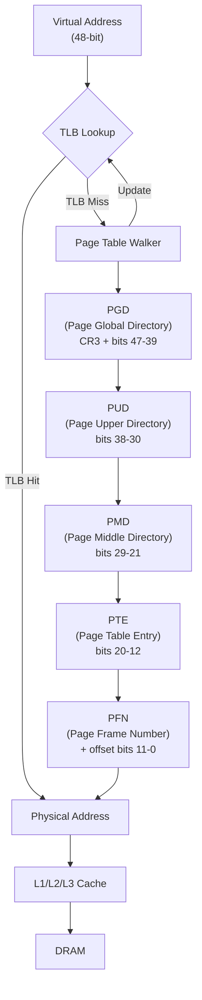
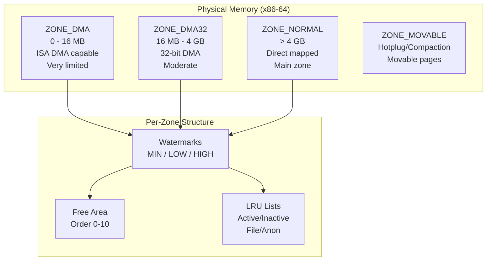
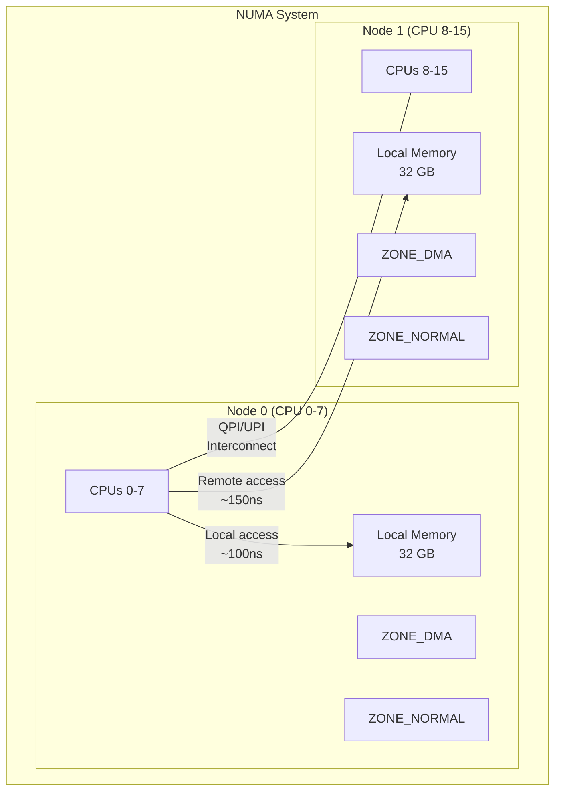
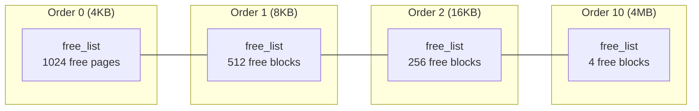

# Chapter 95: Physical Memory and the MMU

## Introduction

While virtual memory provides the abstraction of a large, contiguous address space, physical memory is the actual hardware — the DRAM chips on your motherboard. The Memory Management Unit (MMU) is the hardware bridge between these two worlds, translating virtual addresses to physical addresses at memory speed. This chapter explores how Linux manages physical memory, the zone-based allocation system, and the MMU's role in address translation.

## 1. Intuition

### The Library Analogy Extended

Continuing our library analogy: virtual memory is the catalog system, but the physical library has real constraints. Some shelves are near the entrance (fast access, limited space), others are in the basement (slower, more space). The MMU is the librarian who instantly translates catalog numbers to shelf locations.

Physical memory has real constraints that virtual memory abstracts away:
- **Limited size**: You can't map more than you have (plus swap)
- **Hardware limitations**: Some devices can only access certain physical address ranges
- **Performance characteristics**: Different physical regions have different access speeds
- **Fragmentation**: Free pages may not be contiguous even when total free memory is sufficient

### Why Zones Matter

Not all physical memory is equal. On x86 systems, ISA (Industry Standard Architecture) devices can only DMA to the first 16 MB of physical memory. Some 32-bit devices can only address the first 4 GB. Linux handles this through memory zones.

## 2. Architecture

### Physical Memory Model

Linux supports several physical memory models:

```
CONFIG_FLATMEM    - Flat memory model (simple, single array of page structs)
CONFIG_DISCONTIGMEM - Discontiguous memory model (deprecated)
CONFIG_SPARSEMEM  - Sparse memory model (modern, supports hotplug)
CONFIG_SPARSEMEM_VMEMMAP - Uses vmemmap for struct page array
```

On modern x86-64 systems, `SPARSEMEM_VMEMMAP` is the default. It provides:
- Efficient handling of non-contiguous physical memory
- Memory hotplug support
- Reduced memory overhead for the `struct page` array

### The `struct page` Array

Every physical page frame in the system has a corresponding `struct page` in a large array. This array is called `mem_map` (or `vmemmap` with SPARSEMEM_VMEMMAP).

```c
struct page {
    unsigned long flags;        /* page status flags */
    
    union {
        struct {    /* page cache and anonymous pages */
            union {
                struct list_head lru;       /* LRU list linkage */
                struct {                    /* slub per cpu */
                    void *freelist;
                    unsigned counters;
                };
                struct {                    /* SLUB */
                    unsigned inuse:16;
                    unsigned objects:15;
                    unsigned frozen:1;
                };
            };
            struct address_space *mapping;  /* owner address space */
            pgoff_t index;                  /* offset within mapping */
            unsigned long private;          /* private data */
        };
        
        struct {    /* slab allocator */
            struct kmem_cache *slab_cache;
            void *freelist;
            /* ... */
        };
        
        struct {    /* compound page (huge pages) */
            unsigned long compound_head;
            unsigned char compound_dtor;
            unsigned char compound_order;
            atomic_t compound_mapcount;
        };
        
        pgtable_t pmd_huge_pte;  /* page table entry for huge pages */
        /* ... more unions ... */
    };
    
    atomic_t _refcount;         /* reference count */
    atomic_t _mapcount;         /* mapping count */
};
```

### Page Flags

The `flags` field encodes information about the page:

```c
enum pageflags {
    PG_locked,          /* page is locked for I/O */
    PG_error,           /* I/O error occurred */
    PG_referenced,      /* page has been accessed */
    PG_uptodate,        /* page contents are valid */
    PG_dirty,           /* page has been written to */
    PG_lru,             /* page is on an LRU list */
    PG_active,          /* page is on the active LRU list */
    PG_slab,            /* page is managed by the slab allocator */
    PG_reserved,        /* kernel reserved page */
    PG_private,         /* page has private data */
    PG_writeback,       /* page is under writeback */
    PG_reclaim,         /* page will be reclaimed soon */
    PG_swapbacked,      /* page is backed by swap */
    PG_swapcache,       /* page is in swap cache */
    PG_mlocked,         /* page is mlock()ed */
    PG_unevictable,     /* page cannot be reclaimed */
    /* ... many more ... */
};
```

### Memory Zones

Linux divides physical memory into zones to handle hardware limitations:

```c
enum zone_type {
#ifdef CONFIG_ZONE_DMA
    ZONE_DMA,       /* < 16 MB: ISA DMA capable */
#endif
#ifdef CONFIG_ZONE_DMA32
    ZONE_DMA32,     /* < 4 GB: 32-bit DMA capable */
#endif
    ZONE_NORMAL,    /* normal memory (directly mapped) */
#ifdef CONFIG_HIGHMEM
    ZONE_HIGHMEM,   /* not permanently mapped (32-bit only) */
#endif
    ZONE_MOVABLE,   /* movable pages (for hotplug/compaction) */
#ifdef CONFIG_ZONE_DEVICE
    ZONE_DEVICE,    /* device memory (persistent memory, GPU) */
#endif
    __MAX_NR_ZONES
};
```

#### Zone Characteristics

```
Physical Address Space (x86-64):

0 ──────────────────────────────────────────────── MAX
│  ZONE_DMA   │  ZONE_DMA32  │      ZONE_NORMAL      │
│  (0-16MB)   │  (16MB-4GB)  │      (>4GB)            │
│  ISA DMA    │  32-bit DMA  │   Most system RAM      │
│  Very limited│ Limited      │   Primary zone          │
└─────────────┴──────────────┴────────────────────────┘
```

### Zone Structure

```c
struct zone {
    unsigned long _watermark[NR_WMARK];  /* watermark levels */
    long lowmem_reserve[MAX_NR_ZONES];   /* reserve for higher zones */
    
    struct pglist_data *zone_pgdat;      /* parent node */
    struct per_cpu_pages __percpu *per_cpu_pageset;  /* per-cpu pages */
    
    unsigned long zone_start_pfn;        /* start page frame number */
    atomic_long_t managed_pages;         /* managed page count */
    unsigned long spanned_pages;         /* total pages (including holes) */
    unsigned long present_pages;         /* actual physical pages */
    
    const char *name;                    /* zone name */
    
    /* free areas - free lists for each order (0 to MAX_ORDER) */
    struct free_area free_area[MAX_ORDER + 1];
    
    /* zone flags */
    unsigned long flags;
    
    /* LRU lists for page reclaim */
    struct lruvec lruvec;
    
    /* ... more fields ... */
};
```

### NUMA Nodes

On NUMA (Non-Uniform Memory Access) systems, physical memory is distributed across nodes. Each node has its own zones:

```c
typedef struct pglist_data {
    struct zone node_zones[MAX_NR_ZONES];  /* zones in this node */
    struct zonelist node_zonelists[MAX_ZONELISTS];  /* allocation fallback */
    int nr_zones;                           /* number of zones */
    
#ifdef CONFIG_FLATMEM
    struct page *node_mem_map;              /* page array */
#endif
#ifdef CONFIG_SPARSEMEM
    struct mem_section *node_mem_map;       /* sparse sections */
#endif
    
    unsigned long node_start_pfn;           /* first PFN in node */
    unsigned long node_present_pages;       /* physical pages */
    unsigned long node_spanned_pages;       /* total span */
    
    int node_id;                            /* node number */
    wait_queue_head_t kswapd_wait;          /* kswapd wait queue */
    struct task_struct *kswapd;             /* kswapd thread */
    /* ... more fields ... */
} pg_data_t;
```

## 3. The MMU (Memory Management Unit)

### MMU Architecture

The MMU is hardware that performs virtual-to-physical address translation. On x86-64, it's integrated into the CPU and operates on every memory access.

```
CPU Core
    │
    ├── Load/Store Unit
    │       │
    │       ▼
    │   Virtual Address (48-bit)
    │       │
    │       ▼
    │   ┌─────────┐
    │   │   TLB   │ ← Translation Lookaside Buffer (cache of translations)
    │   │ (cache) │
    │   └────┬────┘
    │        │ miss
    │        ▼
    │   ┌─────────┐
    │   │  Page   │ ← Hardware page table walker
    │   │ Walker  │   (reads page tables from memory)
    │   └────┬────┘
    │        │
    │        ▼
    │   Physical Address (52-bit max)
    │        │
    │        ▼
    └────── L1/L2/L3 Cache → DRAM
```

### TLB (Translation Lookaside Buffer)

The TLB is a cache of recent virtual-to-physical translations. It's the most critical component for memory performance.

**TLB Hierarchy (typical modern x86-64)**:
- **L1 dTLB**: 64 entries, 4-way, 1-cycle latency (for data)
- **L1 iTLB**: 128 entries, 8-way, 1-cycle latency (for instructions)
- **L2 sTLB**: 1536 entries, 12-way, ~7-cycle latency (unified)

A TLB miss triggers a hardware page table walk, which can cost 20-100+ cycles.

### Page Table Entry (PTE) Format

Each PTE contains:

```
Bit 63      : NX (No eXecute) - if supported
Bits 52-62  : Available for OS
Bit 51      : Protection Key bit 3
Bits 12-51  : Physical address of the page frame
Bits 9-11   : Available for OS
Bit 8       : Global (don't flush on CR3 switch)
Bit 7       : PAT (Page Attribute Table)
Bit 6       : Dirty (page has been written)
Bit 5       : Accessed (page has been read/written)
Bit 4       : PCD (Page Cache Disable)
Bit 3       : PWT (Page Write-Through)
Bit 2       : U/S (User/Supervisor)
Bit 1       : R/W (Read/Write)
Bit 0       : Present (page is in memory)
```

### CR3 Register

The CR3 register points to the base of the top-level page table (PGD). On x86-64:

```
CR3:
Bits 51-12  : Physical address of PGD
Bits 11-5   : Reserved (must be 0)
Bit 4       : PCD (Page Cache Disable for PGD)
Bit 3       : PWT (Page Write-Through for PGD)
Bits 2-0    : Reserved
```

When a process is scheduled, the kernel loads its CR3 value, switching the page tables.

## 4. Source Code References

### Zone Initialization

Zone initialization happens during boot in `mm/page_alloc.c`:

```c
/* mm/page_alloc.c */
static void __meminit zone_init_internals(struct zone *zone,
                                           enum zone_type zone_type,
                                           int nid, unsigned long start_pfn,
                                           unsigned long size)
{
    zone->name = zone_names[zone_type];
    zone->_watermark[WMARK_MIN] = min_wmark_pages(zone);
    zone->_watermark[WMARK_LOW] = low_wmark_pages(zone);
    zone->_watermark[WMARK_HIGH] = high_wmark_pages(zone);
    zone->zone_pgdat = NODE_DATA(nid);
    zone->zone_start_pfn = start_pfn;
    /* ... */
}
```

### Buddy System Initialization

The buddy system allocator initializes free lists for each zone:

```c
/* mm/page_alloc.c */
void __meminit memmap_init_zone(unsigned long size, int nid,
                                 unsigned long zone,
                                 unsigned long start_pfn,
                                 enum meminit_context context,
                                 struct vmem_altmap *altmap,
                                 struct page *page)
{
    /* Initialize each struct page in the zone */
    for (pfn = start_pfn; pfn < end_pfn; pfn++) {
        struct page *page = pfn_to_page(pfn);
        
        /* set up page struct */
        __init_single_page(page, pfn, zone, nid);
        
        /* add to free list if appropriate */
        /* ... */
    }
}
```

### Zone Watermarks

Watermarks determine when allocation should trigger reclaim:

```c
/* include/linux/mmzone.h */
enum zone_watermarks {
    WMARK_MIN,      /* minimum watermark - critical */
    WMARK_LOW,      /* low watermark - kswapd wakes up */
    WMARK_HIGH,     /* high watermark - kswapd goes back to sleep */
    NR_WMARK
};

/* mm/page_alloc.c */
static int __setup_per_zone_wmarks(void)
{
    unsigned long pages_min = min_free_kbytes >> (PAGE_SHIFT - 10);
    
    for_each_zone(zone) {
        /* Calculate watermarks based on zone managed pages */
        zone->_watermark[WMARK_MIN] = /* ... */;
        zone->_watermark[WMARK_LOW] = /* ... */;
        zone->_watermark[WMARK_HIGH] = /* ... */;
    }
    return 0;
}
```

## 5. Data Structures

### Physical Memory Organization

```
Node 0 (pg_data_t)
    ├── zone[0] = ZONE_DMA (0-16MB)
    │       ├── free_area[0]  (order-0: 4KB pages)
    │       ├── free_area[1]  (order-1: 8KB blocks)
    │       ├── free_area[2]  (order-2: 16KB blocks)
    │       ├── ...
    │       └── free_area[10] (order-10: 4MB blocks)
    │
    ├── zone[1] = ZONE_DMA32 (16MB-4GB)
    │       ├── free_area[0..10]
    │       └── LRU lists
    │
    └── zone[2] = ZONE_NORMAL (>4GB)
            ├── free_area[0..10]
            └── LRU lists
```

### Page Frame Number (PFN) Relationships

```c
/* Converting between PFN, physical address, and struct page */

/* PFN to physical address */
#define PFN_PHYS(pfn)  ((phys_addr_t)(pfn) << PAGE_SHIFT)

/* Physical address to PFN */
#define PHYS_PFN(phys)  ((unsigned long)((phys) >> PAGE_SHIFT))

/* PFN to struct page */
struct page *pfn_to_page(unsigned long pfn);

/* struct page to PFN */
unsigned long page_to_pfn(const struct page *page);

/* struct page to virtual address (kernel direct mapped) */
void *page_address(struct page *page);

/* Virtual address to struct page */
struct page *virt_to_page(const void *vaddr);
```

### Buddy System Free Area

```c
struct free_area {
    struct list_head free_list[MIGRATE_TYPES];  /* per-migrate-type lists */
    unsigned long nr_free;                       /* number of free blocks */
};

/* Migrate types for memory compaction */
enum migratetype {
    MIGRATE_UNMOVABLE,    /* kernel allocations */
    MIGRATE_MOVABLE,      /* movable pages (user pages) */
    MIGRATE_RECLAIMABLE,  /* can be reclaimed (page cache) */
    MIGRATE_PCPTYPES,     /* per-cpu page type */
    MIGRATE_HIGHATOMIC = MIGRATE_PCPTYPES,
    MIGRATE_CMA,          /* contiguous memory allocator */
    MIGRATE_ISOLATE,      /* isolate for compaction/hotplug */
    MIGRATE_TYPES
};
```

## 6. C/Assembly Examples

### Examining Physical Memory Info

```bash
# View physical memory information
cat /proc/meminfo

# View zone info
cat /proc/zoneinfo

# View NUMA node info
cat /proc/buddyinfo
# Node 0, zone      DMA      1      1      1      0      2      1      1      0      1      1      3
# Node 0, zone    DMA32   1234    567    234    123     56     23     11      5      2      1     45
# Node 0, zone   Normal  45678  12345   6789   3456   1234    567    234     89     23      5     12

# View page frame info
cat /proc/pagetypeinfo
```

### C Program to Examine Zone Information

```c
#include <stdio.h>
#include <stdlib.h>
#include <string.h>

int main() {
    FILE *fp;
    char line[1024];
    
    printf("=== Zone Information ===\n\n");
    
    fp = fopen("/proc/zoneinfo", "r");
    if (!fp) {
        perror("fopen /proc/zoneinfo");
        return 1;
    }
    
    while (fgets(line, sizeof(line), fp)) {
        printf("%s", line);
    }
    fclose(fp);
    
    printf("\n=== Buddy Info ===\n\n");
    
    fp = fopen("/proc/buddyinfo", "r");
    if (!fp) {
        perror("fopen /proc/buddyinfo");
        return 1;
    }
    
    while (fgets(line, sizeof(line), fp)) {
        printf("%s", line);
    }
    fclose(fp);
    
    return 0;
}
```

### Reading CR3 and Walking Page Tables (Kernel Module)

```c
/* kernel module to walk page tables */
#include <linux/module.h>
#include <linux/sched.h>
#include <linux/mm.h>
#include <asm/pgtable.h>

static void walk_page_tables(unsigned long addr)
{
    pgd_t *pgd;
    p4d_t *p4d;
    pud_t *pud;
    pmd_t *pmd;
    pte_t *pte;
    
    struct mm_struct *mm = current->mm;
    
    pgd = pgd_offset(mm, addr);
    if (pgd_none(*pgd)) {
        pr_info("No PGD entry\n");
        return;
    }
    
    p4d = p4d_offset(pgd, addr);
    if (p4d_none(*p4d)) {
        pr_info("No P4D entry\n");
        return;
    }
    
    pud = pud_offset(p4d, addr);
    if (pud_none(*pud)) {
        pr_info("No PUD entry\n");
        return;
    }
    
    pmd = pmd_offset(pud, addr);
    if (pmd_none(*pmd)) {
        pr_info("No PMD entry\n");
        return;
    }
    
    if (pmd_large(*pmd)) {
        pr_info("2MB huge page at PMD level\n");
        pr_info("Physical address: 0x%llx\n",
                (u64)pmd_pfn(*pmd) << PAGE_SHIFT);
        return;
    }
    
    pte = pte_offset_map(pmd, addr);
    if (!pte || pte_none(*pte)) {
        pr_info("No PTE entry\n");
        return;
    }
    
    pr_info("PTE found: 0x%llx\n", (u64)pte_val(*pte));
    pr_info("Physical address: 0x%llx\n",
            (u64)pte_pfn(*pte) << PAGE_SHIFT);
    pr_info("Present: %d, Writable: %d, User: %d\n",
            pte_present(*pte), pte_write(*pte), pte_user(*pte));
    
    pte_unmap(pte);
}

static int __init pgwalk_init(void)
{
    pr_info("Walking page tables for address 0x%lx\n", TASK_SIZE / 2);
    walk_page_tables(TASK_SIZE / 2);
    return 0;
}

static void __exit pgwalk_exit(void)
{
    pr_info("Module unloaded\n");
}

module_init(pgwalk_init);
module_exit(pgwalk_exit);
MODULE_LICENSE("GPL");
```

### Assembly: TLB Flush

```asm
; x86-64 TLB flush operations

; Flush entire TLB (reload CR3)
flush_tlb_full:
    mov rax, cr3
    mov cr3, rax              ; Reload CR3 flushes all non-global entries
    ret

; Flush single page (INVLPG)
flush_tlb_page:
    invlpg [rdi]              ; Invalidate TLB entry for address in RDI
    ret

; Flush TLB for PCID (Process-Context Identifier)
flush_tlb_pcide:
    invpcid [rdi], rsi        ; Invalidate by PCID (if supported)
    ret
```

## 7. Mermaid Diagrams

### MMU Address Translation



### Zone Organization



### NUMA Memory Architecture



### Buddy System Free Lists



## 8. Performance

### TLB Miss Cost

A TLB miss is expensive:
- **L2 TLB hit**: ~7 cycles
- **Hardware page walk (4 levels)**: 20-100+ cycles
- **TLB miss + page fault**: millions of cycles (OS intervention)

### Huge Pages and TLB Efficiency

Using 2MB huge pages instead of 4KB pages:
- Each TLB entry covers 2MB instead of 4KB (512x more)
- Dramatically reduces TLB misses for large datasets
- Critical for databases, virtual machines, and HPC

### Zone Watermark Tuning

```bash
# View current watermarks
cat /proc/zoneinfo | grep -A5 "Node 0, zone   Normal" | grep -E "min|low|high"

# Adjust minimum free kilobytes
echo 16384 > /proc/sys/vm/min_free_kbytes

# The kernel recalculates watermarks based on this value
```

### NUMA Performance

```bash
# Check NUMA statistics
numastat

# Bind process to specific node
numactl --cpunodebind=0 --membind=0 ./application

# Check NUMA hit/miss ratios
cat /proc/vmstat | grep numa
```

## 9. Security

### Physical Memory Protection

The MMU provides hardware-enforced protection:
- **User/Supervisor bit**: Prevents userspace from accessing kernel pages
- **Read/Write bit**: Prevents writes to read-only pages
- **NX bit**: Prevents execution of data pages
- **SMAP/SMEP**: Additional kernel protections

### DMA Attacks

Physical memory can be accessed by DMA-capable devices. IOMMU (Intel VT-d / AMD-Vi) provides protection:

```bash
# Check if IOMMU is enabled
dmesg | grep -i iommu

# Enable IOMMU in GRUB
# intel_iommu=on (Intel) or amd_iommu=on (AMD)
```

### Cold Boot Attacks

Physical DRAM retains data briefly after power-off. Full-disk encryption helps, but keys in memory remain vulnerable during runtime.

## 10. Common Pitfalls

### 1. Zone Imbalance

Running out of pages in a zone (e.g., ZONE_DMA) can cause allocation failures even when ZONE_NORMAL has plenty of free memory.

### 2. Highmem on 32-bit

On 32-bit systems with >1GB RAM, HIGHMEM is necessary. Kernel code must explicitly handle HIGHMEM pages using `kmap()`.

### 3. NUMA Imbalance

Allocating all memory on one NUMA node while running threads on another causes remote memory access penalties.

### 4. TLB Thrashing

Working sets larger than TLB capacity cause constant TLB misses. Huge pages can help.

### 5. Fragmentation

Physical memory fragmentation can prevent allocation of contiguous pages, even when total free memory is sufficient.

## 11. Best Practices

1. **Use NUMA-aware allocation** on multi-socket systems
2. **Enable huge pages** for large-memory applications
3. **Monitor zone watermarks** to prevent zone exhaustion
4. **Use IOMMU** for DMA protection
5. **Set appropriate `vm.min_free_kbytes`** to maintain zone health
6. **Profile TLB misses** with `perf stat -e dTLB-load-misses`
7. **Use `numactl`** to control NUMA placement
8. **Understand zone fallback** when one zone is full

## 12. Exercises

### Exercise 1: Zone Analysis

Write a script that parses `/proc/zoneinfo` and reports the free page count, watermark levels, and utilization for each zone.

### Exercise 2: Buddy Info Analysis

Parse `/proc/buddyinfo` and calculate the total free memory per zone. Identify fragmentation (few high-order blocks).

### Exercise 3: NUMA Profiling

Write a program that allocates large arrays and uses `numastat` to verify which NUMA node the memory resides on.

### Exercise 4: TLB Performance

Write a benchmark that demonstrates TLB miss impact by accessing memory with different strides (4KB, 2MB, random).

### Exercise 5: Watermark Behavior

Experiment with different `min_free_kvalues` and observe the effect on zone watermarks and kswapd behavior.

## 13. References

1. **Linux Kernel Source**: `mm/page_alloc.c`, `include/linux/mmzone.h`, `include/linux/mm_types.h`
2. **"Understanding the Linux Kernel"** by Daniel P. Bovet and Marco Cesati, Chapter 8
3. **"Linux Kernel Development"** by Robert Love, Chapter 12
4. **Intel 64 and IA-32 Architectures Software Developer's Manual**, Volume 3A
5. **Linux Documentation**: `Documentation/admin-guide/sysctl/vm.rst`
6. **"What Every Programmer Should Know About Memory"** by Ulrich Drepper
7. **Linux man pages**: `numactl(8)`, `mmap(2)`
8. **LWN.net**: "A new approach to kernel memory allocation"
